+++
title = "17.中断与系统调用详解"
date = 2026-01-31
description = "Linux中断机制、系统调用实现、进程调度与切换、用户态内核态上下文"
[taxonomies]
tags = ["Linux", "内核", "中断", "系统调用", "进程调度"]
+++

# Linux 中断与系统调用详解

本文深入剖析 Linux 的中断处理机制、系统调用实现、进程调度算法和上下文切换过程，这些是内核开发者必须掌握的核心知识。

---

## 一、中断机制

### 1.1 中断的分类

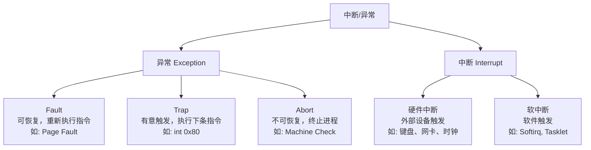

| 类型 | 触发源 | 同步/异步 | 示例 |
|------|--------|-----------|------|
| **异常 (Exception)** | CPU 执行指令时检测到 | 同步 | 除零、缺页、断点 |
| **硬件中断 (IRQ)** | 外部设备信号 | 异步 | 时钟、网卡、磁盘 |
| **软中断 (Softirq)** | 内核代码触发 | 异步 | 网络收包、定时器 |

### 1.2 中断描述符表（IDT）

x86 架构使用 **IDT (Interrupt Descriptor Table)** 存储中断处理程序入口：

```
┌─────────────────────────────────────────────────────────────────┐
│                    中断描述符表 (IDT)                            │
├──────┬──────────────────────────────────────────────────────────┤
│ 向量 │ 描述                                                     │
├──────┼──────────────────────────────────────────────────────────┤
│  0   │ #DE Divide Error (除零错误)                              │
│  1   │ #DB Debug Exception                                      │
│  2   │ NMI Interrupt (不可屏蔽中断)                             │
│  3   │ #BP Breakpoint (断点, int 3)                            │
│  6   │ #UD Invalid Opcode (非法指令)                           │
│  13  │ #GP General Protection (一般保护错误)                    │
│  14  │ #PF Page Fault (缺页异常)                               │
│ 32-  │ 外部中断 (IRQ 0-223)                                    │
│ 128  │ System Call (int 0x80, 传统系统调用)                    │
│ ...  │ ...                                                      │
└──────┴──────────────────────────────────────────────────────────┘
```

**IDT 条目格式（Gate Descriptor）**：

```
┌─────────────────────────────────────────────────────────────────┐
│  127:96  │  95:64   │  63:48  │ 47:45 │ 44:40 │ 39:32 │ 31:16 │ 15:0  │
├──────────┼──────────┼─────────┼───────┼───────┼───────┼───────┼───────┤
│ Reserved │ Offset   │ Offset  │  DPL  │ Type  │ IST   │  Seg  │Offset │
│          │ [63:32]  │ [31:16] │       │       │       │  Sel  │[15:0] │
└─────────────────────────────────────────────────────────────────┘

Offset: 中断处理程序地址
Seg Sel: 代码段选择子
DPL: 描述符特权级 (0=内核, 3=用户)
Type: 门类型 (Interrupt Gate / Trap Gate)
IST: 中断栈表索引
```

### 1.3 中断处理流程

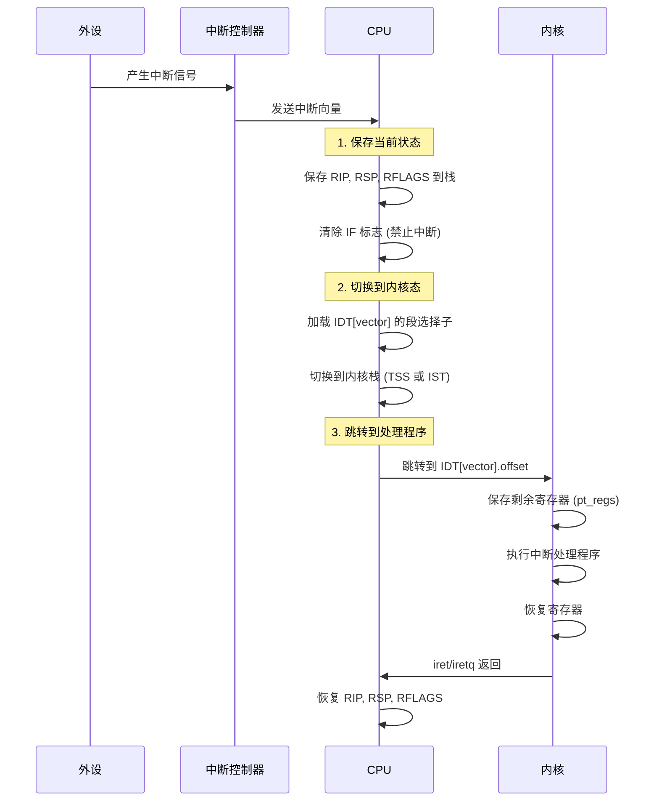

### 1.4 中断上下文 vs 进程上下文

| 特性 | 中断上下文 | 进程上下文 |
|------|-----------|-----------|
| **current 指针** | 指向被中断的进程（但不代表它） | 指向当前运行的进程 |
| **可睡眠** | **否**（没有进程可调度） | 是 |
| **可使用锁** | 只能用 spinlock | 可用 mutex、semaphore |
| **栈** | 中断栈（独立的小栈） | 进程内核栈 |
| **执行时间** | 必须尽快完成 | 无严格限制 |

**重要原则**：中断处理程序必须快速执行，不能睡眠，不能调用可能睡眠的函数。

### 1.5 中断下半部（Bottom Half）

为了减少中断处理时间，Linux 将中断处理分为两部分：

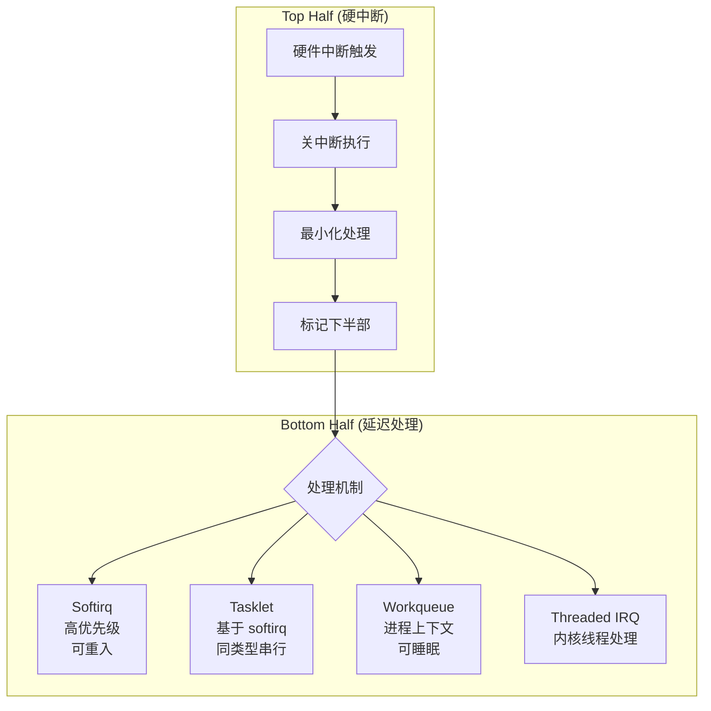

| 机制 | 上下文 | 可睡眠 | 并发性 | 适用场景 |
|------|--------|--------|--------|----------|
| **Softirq** | 中断 | 否 | 多 CPU 同时执行 | 网络、块设备 |
| **Tasklet** | 中断 | 否 | 同类型串行 | 简单延迟处理 |
| **Workqueue** | 进程 | **是** | 取决于配置 | 需要睡眠的处理 |
| **Threaded IRQ** | 进程 | **是** | 每中断一个线程 | 通用推荐方式 |

**Softirq 类型**：

| 编号 | 名称 | 用途 |
|------|------|------|
| 0 | HI_SOFTIRQ | 高优先级 tasklet |
| 1 | TIMER_SOFTIRQ | 定时器 |
| 2 | NET_TX_SOFTIRQ | 网络发送 |
| 3 | NET_RX_SOFTIRQ | 网络接收 |
| 4 | BLOCK_SOFTIRQ | 块设备 |
| 5 | IRQ_POLL_SOFTIRQ | IRQ polling |
| 6 | TASKLET_SOFTIRQ | 普通 tasklet |
| 7 | SCHED_SOFTIRQ | 调度器 |
| 8 | HRTIMER_SOFTIRQ | 高精度定时器 |
| 9 | RCU_SOFTIRQ | RCU 处理 |

---

## 二、系统调用

### 2.1 系统调用的本质

系统调用是用户态程序请求内核服务的**受控入口**：

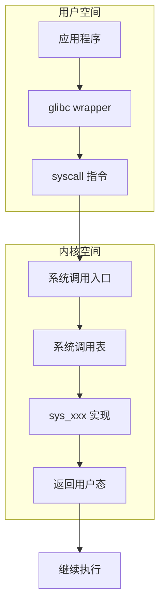

### 2.2 系统调用的触发方式

| 方式 | 指令 | 特点 |
|------|------|------|
| **int 0x80** | `int $0x80` | 传统方式，较慢 |
| **syscall** | `syscall` | x86-64 快速系统调用 |
| **sysenter** | `sysenter` | x86-32 快速系统调用 |
| **vDSO** | 直接调用 | 某些调用无需陷入内核 |

**syscall 指令执行过程**：

1. 用户态设置参数（rax=系统调用号，rdi/rsi/rdx/r10/r8/r9=参数）
2. 执行 `syscall` 指令
3. CPU 自动：
   - 保存 rip 到 rcx
   - 保存 rflags 到 r11
   - 从 MSR 加载内核态 rip (LSTAR)
   - 从 MSR 加载内核态 cs/ss
   - 清除 rflags 中的 IF 等标志
4. 开始执行内核代码

### 2.3 系统调用表

内核维护系统调用表 `sys_call_table`，每个条目是一个函数指针：

```
┌────────────────────────────────────────────────────────────────┐
│                    sys_call_table (x86-64)                     │
├───────┬────────────────────────────────────────────────────────┤
│  编号 │ 函数                                                   │
├───────┼────────────────────────────────────────────────────────┤
│   0   │ sys_read                                               │
│   1   │ sys_write                                              │
│   2   │ sys_open                                               │
│   3   │ sys_close                                              │
│  ...  │ ...                                                    │
│  57   │ sys_fork                                               │
│  59   │ sys_execve                                             │
│  60   │ sys_exit                                               │
│  ...  │ ...                                                    │
│  ~450 │ (最新内核系统调用数量)                                  │
└───────┴────────────────────────────────────────────────────────┘
```

### 2.4 参数传递约定 (x86-64)

| 寄存器 | 用途 |
|--------|------|
| rax | 系统调用号 / 返回值 |
| rdi | 第 1 个参数 |
| rsi | 第 2 个参数 |
| rdx | 第 3 个参数 |
| r10 | 第 4 个参数 (注意：不是 rcx) |
| r8 | 第 5 个参数 |
| r9 | 第 6 个参数 |

**注意**：rcx 被 syscall 指令用于保存返回地址，所以第 4 个参数使用 r10。

### 2.5 vDSO（虚拟动态共享对象）

某些"系统调用"不需要真正陷入内核：

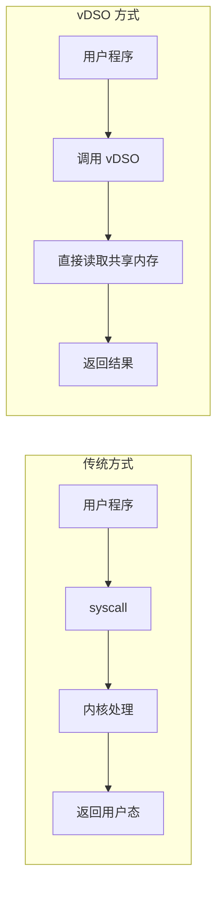

**vDSO 加速的调用**：
- `gettimeofday()` - 读取内核映射的时间数据
- `clock_gettime()` - 同上
- `getcpu()` - 读取 per-CPU 变量

---

## 三、进程调度

### 3.1 调度类（Scheduling Class）

Linux 采用**模块化调度器**，不同类型的任务使用不同的调度类：

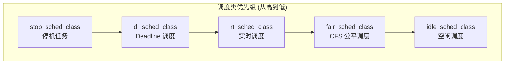

| 调度类 | 策略 | 适用任务 |
|--------|------|----------|
| **Stop** | 不可调度 | 迁移任务、CPU 热插拔 |
| **Deadline** | SCHED_DEADLINE | 周期性实时任务 |
| **RT** | SCHED_FIFO, SCHED_RR | 实时任务 |
| **CFS** | SCHED_NORMAL, SCHED_BATCH | 普通任务（大多数） |
| **Idle** | SCHED_IDLE | 极低优先级后台任务 |

### 3.2 CFS 完全公平调度器

CFS（Completely Fair Scheduler）是 Linux 默认的调度器，核心思想是**虚拟运行时间（vruntime）**：

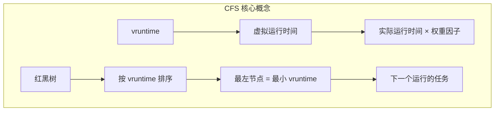

**vruntime 计算**：

```
vruntime += 实际运行时间 × (NICE_0_WEIGHT / 进程权重)
```

**权重与 nice 值的关系**：

| nice 值 | 权重 | 相对于 nice 0 |
|---------|------|---------------|
| -20 | 88761 | 约 88x |
| -10 | 9548 | 约 9.5x |
| 0 | 1024 | 1x (基准) |
| 10 | 110 | 约 1/9 |
| 19 | 15 | 约 1/68 |

**调度决策**：

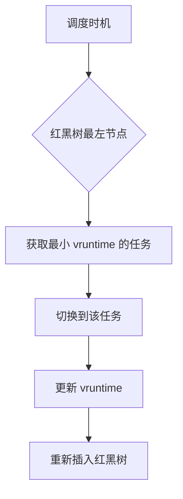

### 3.3 实时调度

实时任务有更高的优先级，总是抢占普通任务：

**SCHED_FIFO**：先进先出
- 高优先级任务抢占低优先级
- 同优先级按到达顺序执行
- 任务主动让出或阻塞才会切换

**SCHED_RR**：时间片轮转
- 与 FIFO 类似，但有时间片
- 同优先级任务轮流执行

**实时优先级范围**：1-99（数字越大优先级越高）

### 3.4 调度时机

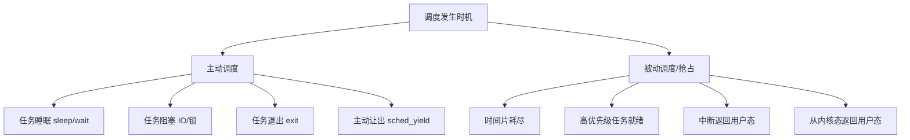

**need_resched 标志**：

内核在以下情况设置 `TIF_NEED_RESCHED`：
- 时钟中断检测到时间片耗尽
- 唤醒了更高优先级的任务
- 任务优先级发生变化

调度点检查此标志决定是否调用 `schedule()`。

---

## 四、进程切换

### 4.1 上下文切换的组成

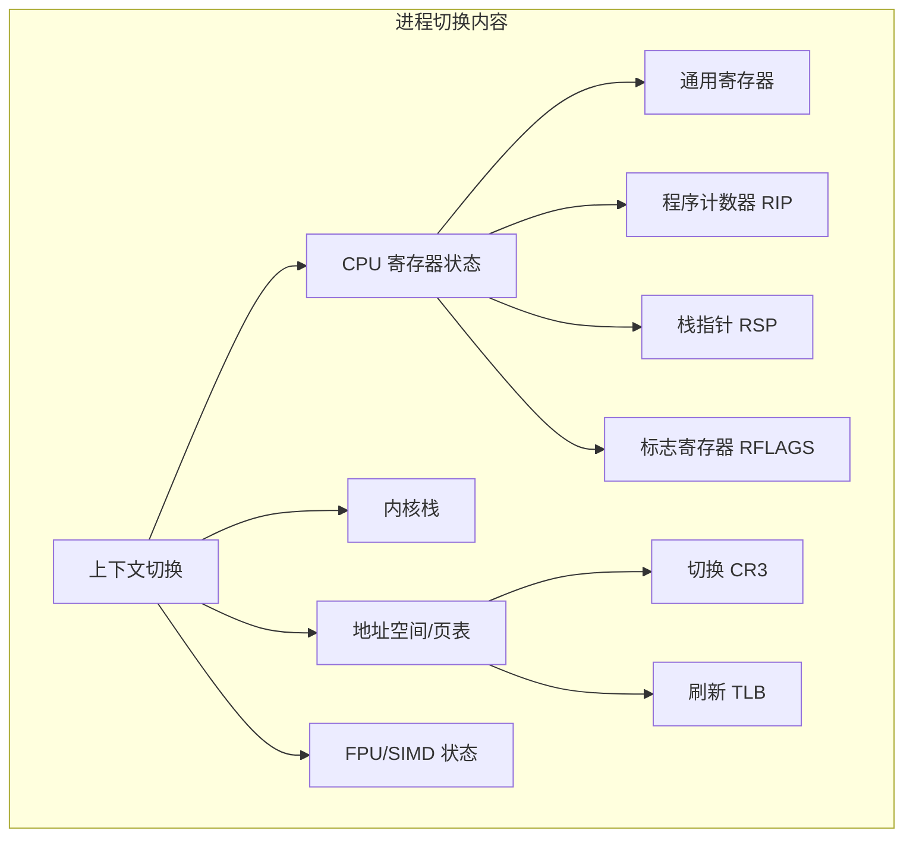

### 4.2 切换流程详解

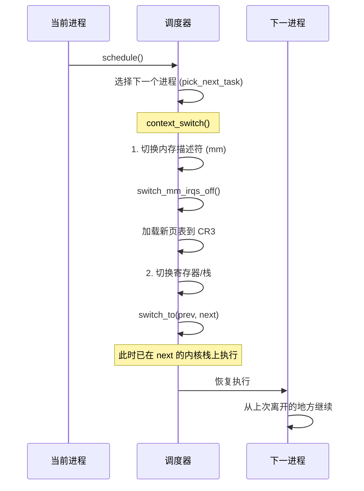

### 4.3 switch_to 的魔法

`switch_to` 是进程切换的核心，它在不同进程的内核栈之间跳转：

```
进程 A 内核栈                         进程 B 内核栈
┌───────────────┐                    ┌───────────────┐
│ 保存的寄存器   │                    │ 保存的寄存器   │
├───────────────┤                    ├───────────────┤
│ 返回地址      │                    │ 返回地址      │
├───────────────┤                    ├───────────────┤
│ switch_to     │  ──────────────>   │ switch_to     │
│ 保存 A 的 RSP │                    │ 恢复 B 的 RSP │
│ 恢复 B 的 RSP │                    │               │
├───────────────┤                    ├───────────────┤
│     ...       │                    │     ...       │
└───────────────┘                    └───────────────┘
```

**关键操作**：
1. 保存 prev 的 RSP 到 `prev->thread.sp`
2. 从 `next->thread.sp` 恢复 next 的 RSP
3. 此时栈已切换，后续代码在 next 的栈上执行

### 4.4 用户态与内核态上下文

**用户态上下文**（保存在内核栈 pt_regs 中）：
- 通用寄存器：rax, rbx, rcx, rdx, rsi, rdi, rbp, r8-r15
- 指令指针：rip
- 栈指针：rsp
- 标志寄存器：rflags
- 段寄存器：cs, ss

**内核态上下文**（保存在 thread_struct 中）：
- 内核栈指针：sp
- FPU/SIMD 状态（延迟保存）
- 调试寄存器
- TLS 相关

### 4.5 FPU/SIMD 状态切换

FPU/SIMD 寄存器状态较大（512B-2KB+），采用**延迟切换**优化：

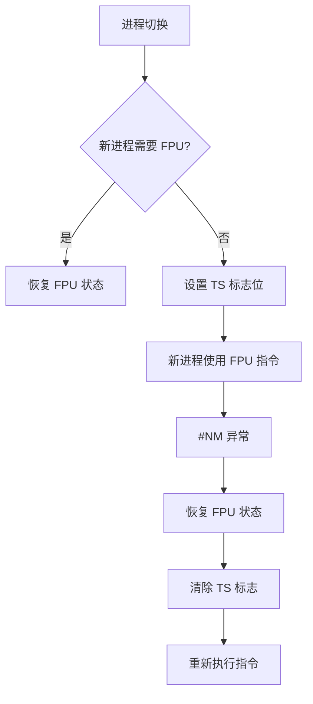

**优势**：如果进程不使用 FPU，完全避免 FPU 状态保存/恢复的开销。

---

## 五、上下文切换开销分析

### 5.1 开销构成

| 开销类型 | 估计时间 | 说明 |
|----------|----------|------|
| **直接开销** | | |
| 保存/恢复寄存器 | ~100ns | 通用寄存器 |
| 切换内核栈 | ~50ns | 修改 RSP |
| 切换页表 (CR3) | ~200-500ns | 进程切换时 |
| TLB 刷新 | ~1-5μs | 非 PCID 时全刷新 |
| FPU 状态 | ~200-500ns | 若需要保存/恢复 |
| **间接开销** | | |
| L1/L2 Cache 失效 | ~10-100μs | 新进程的数据不在缓存 |
| TLB 重填 | 多次 Page Walk | 新映射需要重建 |
| 分支预测器失效 | 不可预测 | 新的代码路径 |

### 5.2 减少上下文切换

**系统级**：
- CPU 隔离 (`isolcpus`)
- 中断亲和性
- 使用 PCID 减少 TLB 刷新

**应用级**：
- 减少线程数量
- 使用异步 IO 减少阻塞
- 批量处理减少系统调用次数
- 无锁设计减少睡眠等待

---

## 六、内核面试要点

### 6.1 常见问题

**Q: 中断和异常有什么区别？**

A: 
- **中断**：由外部设备异步产生，与当前执行的指令无关
- **异常**：由 CPU 执行指令时同步产生，如除零、缺页
- 异常进一步分为 Fault（可恢复，重新执行）、Trap（继续下条）、Abort（不可恢复）

**Q: 为什么中断处理程序不能睡眠？**

A: 
1. 中断上下文没有"进程"身份，无法被调度
2. 如果睡眠，没有进程可以切换回来恢复执行
3. 可能持有 spinlock，睡眠会导致死锁
4. 中断需要快速处理，不能阻塞

**Q: 系统调用和普通函数调用有什么区别？**

A: 
- 特权级切换：用户态 Ring 3 → 内核态 Ring 0
- 栈切换：用户栈 → 内核栈
- 地址空间：可访问内核地址空间
- 使用特殊指令：syscall/int 0x80 而非 call
- 开销：远大于普通函数调用（~100-1000 cycles vs ~1-10 cycles）

**Q: CFS 调度器如何保证公平？**

A: 
1. 使用虚拟运行时间（vruntime）度量 CPU 使用
2. 高权重进程的 vruntime 增长慢，获得更多 CPU 时间
3. 红黑树按 vruntime 排序，总是选择 vruntime 最小的
4. 长期来看，每个进程获得与权重成比例的 CPU 时间

**Q: 进程切换时保存了哪些状态？**

A: 
1. **用户态上下文**：通用寄存器、RIP、RSP、RFLAGS（在进入内核时已保存到 pt_regs）
2. **内核态上下文**：内核栈指针、部分寄存器（在 switch_to 时保存）
3. **地址空间**：页表（CR3 寄存器）
4. **FPU/SIMD**：若进程使用则保存
5. **其他**：TLS、调试寄存器等

---

## 相关文章

- [上一篇：内核内存管理详解](/articles/linux/linux-16-内核内存管理详解/)
- [下一篇：内核同步机制详解](/articles/linux/linux-18-内核同步机制详解/)
