+++
title = "18.内核同步机制详解"
date = 2026-01-31
description = "Linux内核同步：Spinlock多核实现、读写锁、信号量、RCU原理、内存屏障"
[taxonomies]
tags = ["Linux", "内核", "同步", "Spinlock", "RCU"]
+++

# Linux 内核同步机制详解

本文深入剖析 Linux 内核中的各种同步机制，包括 spinlock 的多核实现、读写锁、信号量、RCU 等，这是内核开发者必须精通的核心知识。

---

## 一、为什么需要内核同步

### 1.1 内核并发来源

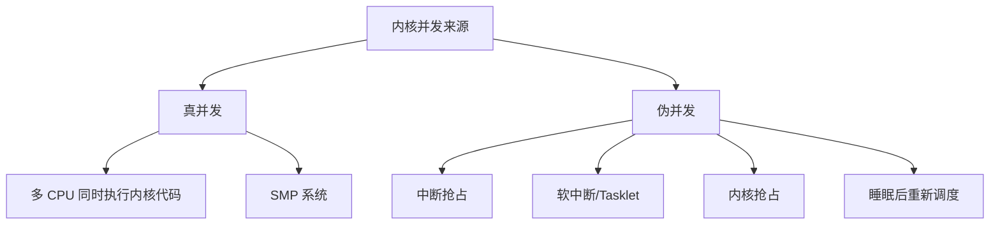

**即使单核系统也需要同步**：中断可以随时打断内核代码，软中断、内核抢占同样会导致并发问题。

### 1.2 临界区保护需求

| 场景 | 保护需求 | 推荐机制 |
|------|----------|----------|
| 进程上下文，短临界区 | 禁止抢占+多核互斥 | spinlock |
| 进程上下文，长临界区 | 可睡眠锁 | mutex/semaphore |
| 中断上下文 | 禁止中断+多核互斥 | spinlock_irq |
| 多读少写 | 读并发，写互斥 | rwlock/RCU |
| 纯读操作 | 无锁 | RCU |

---

## 二、原子操作与内存屏障

### 2.1 原子操作

原子操作是不可分割的操作，执行过程中不会被中断：

```c
/* 内核原子类型 */
typedef struct {
    int counter;
} atomic_t;

/* 原子操作 */
atomic_read(v)           // 读取
atomic_set(v, i)         // 设置
atomic_add(i, v)         // 加
atomic_sub(i, v)         // 减
atomic_inc(v)            // 自增
atomic_dec(v)            // 自减
atomic_dec_and_test(v)   // 自减并测试是否为零
atomic_cmpxchg(v, old, new)  // Compare-And-Swap
```

**实现原理**：x86 使用 `LOCK` 前缀锁定总线或缓存行：

```asm
; atomic_inc 的实现
lock incl (%rdi)    ; LOCK 前缀确保原子性
```

### 2.2 内存屏障

**为什么需要内存屏障**：

1. **编译器优化**：可能重排指令顺序
2. **CPU 乱序执行**：为了性能，CPU 可能乱序执行指令
3. **Store Buffer**：写操作可能被缓冲，其他 CPU 看不到

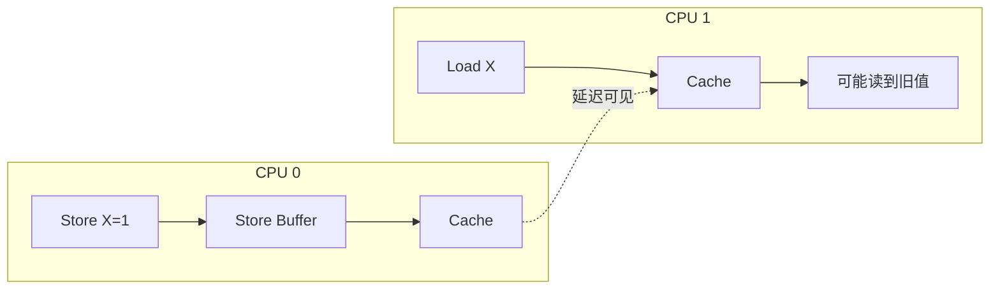

**Linux 内存屏障 API**：

| 屏障 | 作用 |
|------|------|
| `barrier()` | 编译器屏障，阻止编译器重排 |
| `mb()` | 全屏障，阻止读写重排 |
| `rmb()` | 读屏障，阻止读操作重排 |
| `wmb()` | 写屏障，阻止写操作重排 |
| `smp_mb()` | SMP 全屏障（单核为空操作） |
| `smp_rmb()` | SMP 读屏障 |
| `smp_wmb()` | SMP 写屏障 |

**典型使用模式**：

```c
/* 生产者 */
data = value;          // 先写数据
smp_wmb();             // 写屏障
flag = 1;              // 再写标志

/* 消费者 */
while (!flag);         // 等待标志
smp_rmb();             // 读屏障
use(data);             // 使用数据
```

---

## 三、Spinlock（自旋锁）

### 3.1 基本原理

Spinlock 是一种**忙等待**锁，获取失败时不睡眠，而是循环检测（自旋）：

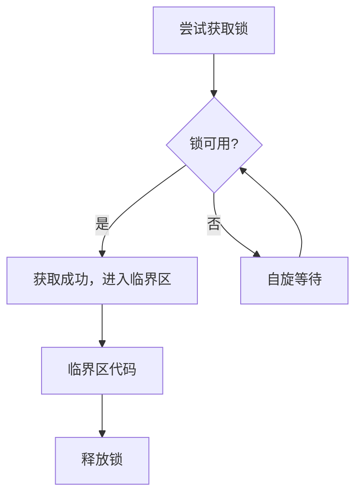

**为什么中断上下文只能用 spinlock**：
- 中断上下文不能睡眠
- 自旋锁不会导致睡眠
- 必须禁止中断或抢占，否则可能死锁

### 3.2 简单自旋锁的问题

最简单的实现（Test-and-Set）存在问题：

```c
/* 简单实现 - 有问题 */
void spin_lock(spinlock_t *lock) {
    while (test_and_set(&lock->locked))
        ;  // 自旋
}
```

**问题**：
1. **不公平**：多核竞争时，靠近锁的 CPU 可能一直抢到
2. **缓存行抖动**：所有 CPU 竞争修改同一缓存行

### 3.3 Ticket Lock

Ticket Lock 引入排队机制，保证 FIFO 公平性：

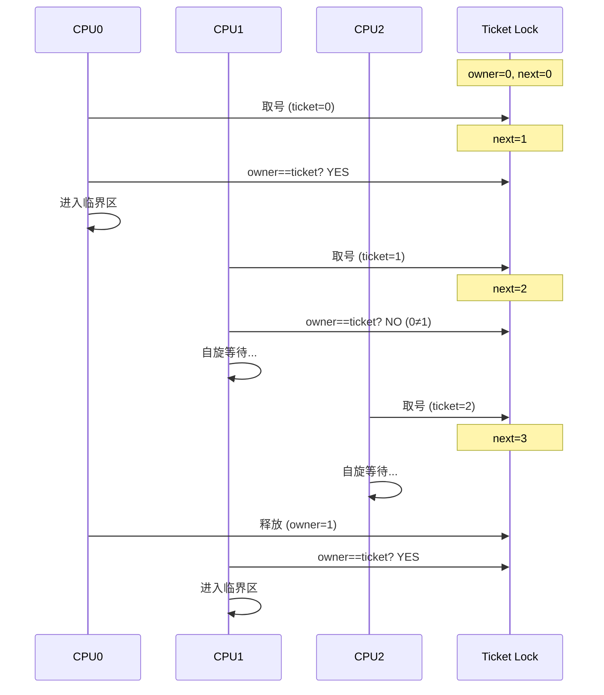

```c
typedef struct {
    atomic_t owner;  // 当前服务号
    atomic_t next;   // 下一个取号值
} ticket_spinlock_t;

void ticket_spin_lock(ticket_spinlock_t *lock) {
    int ticket = atomic_fetch_add(1, &lock->next);  // 取号
    while (atomic_read(&lock->owner) != ticket)     // 等待叫号
        cpu_relax();
}

void ticket_spin_unlock(ticket_spinlock_t *lock) {
    atomic_inc(&lock->owner);  // 叫下一号
}
```

**优点**：公平，FIFO 顺序
**缺点**：所有 CPU 仍在同一缓存行上自旋

### 3.4 MCS Lock

MCS Lock 让每个 CPU 在自己的本地变量上自旋，减少缓存行争用：

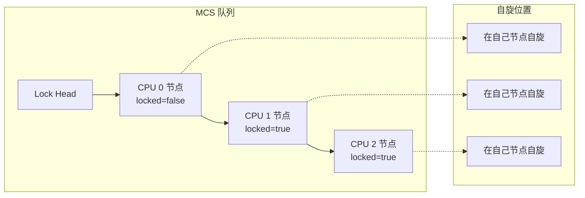

**工作原理**：

1. 每个 CPU 分配一个本地节点
2. 获取锁时将自己加入队列尾部
3. 在自己的节点上自旋，等待前驱通知
4. 释放锁时通知后继节点

```c
struct mcs_spinlock {
    struct mcs_spinlock *next;
    int locked;  // 1 = 需要等待
};

void mcs_spin_lock(struct mcs_spinlock **lock, struct mcs_spinlock *node) {
    struct mcs_spinlock *prev;
    
    node->next = NULL;
    node->locked = 1;
    
    prev = xchg(lock, node);  // 原子交换，加入队尾
    
    if (prev != NULL) {
        prev->next = node;    // 链接到前驱
        while (node->locked)  // 在本地节点自旋
            cpu_relax();
    }
}

void mcs_spin_unlock(struct mcs_spinlock **lock, struct mcs_spinlock *node) {
    if (node->next == NULL) {
        if (cmpxchg(lock, node, NULL) == node)
            return;  // 无后继，直接释放
        while (node->next == NULL)  // 等待后继设置 next
            cpu_relax();
    }
    node->next->locked = 0;  // 通知后继
}
```

**优点**：每个 CPU 在本地自旋，缓存友好
**缺点**：实现复杂，节点内存管理

### 3.5 Linux qspinlock

Linux 4.2+ 使用 **qspinlock**（Queued Spinlock），结合了多种优化：

```
┌─────────────────────────────────────────────────────────────┐
│                    qspinlock 结构 (32位)                    │
├─────────┬─────────┬─────────────────────────────────────────┤
│ locked  │ pending │           tail                          │
│  (8位)  │  (8位)  │          (16位)                         │
└─────────┴─────────┴─────────────────────────────────────────┘

locked:  锁状态 (0=空闲, 1=被占用)
pending: 有 CPU 在快速路径等待
tail:    MCS 队列尾部编码
```

**三级策略**：

1. **快速路径**：无竞争时直接获取
2. **Pending 路径**：少量竞争时短暂自旋
3. **MCS 队列**：激烈竞争时排队等待

### 3.6 Spinlock 变体

| 变体 | 禁止内容 | 适用场景 |
|------|----------|----------|
| `spin_lock()` | 抢占 | 进程上下文，无中断竞争 |
| `spin_lock_bh()` | 抢占 + 软中断 | 与软中断共享数据 |
| `spin_lock_irq()` | 抢占 + 硬中断 | 与中断处理程序共享 |
| `spin_lock_irqsave()` | 同上，保存中断状态 | 不确定当前中断状态时 |

**选择原则**：根据竞争者选择最小化的禁止范围。

### 3.7 单 CPU 场景：preempt_disable 与死锁

**问题**：假设只有一个 CPU，如果把 `spin_lock` 中的 `preempt_disable()` 注释掉（即允许抢占），使用 spinlock 会产生死锁吗？

**答案**：会！这是一个经典的死锁场景。

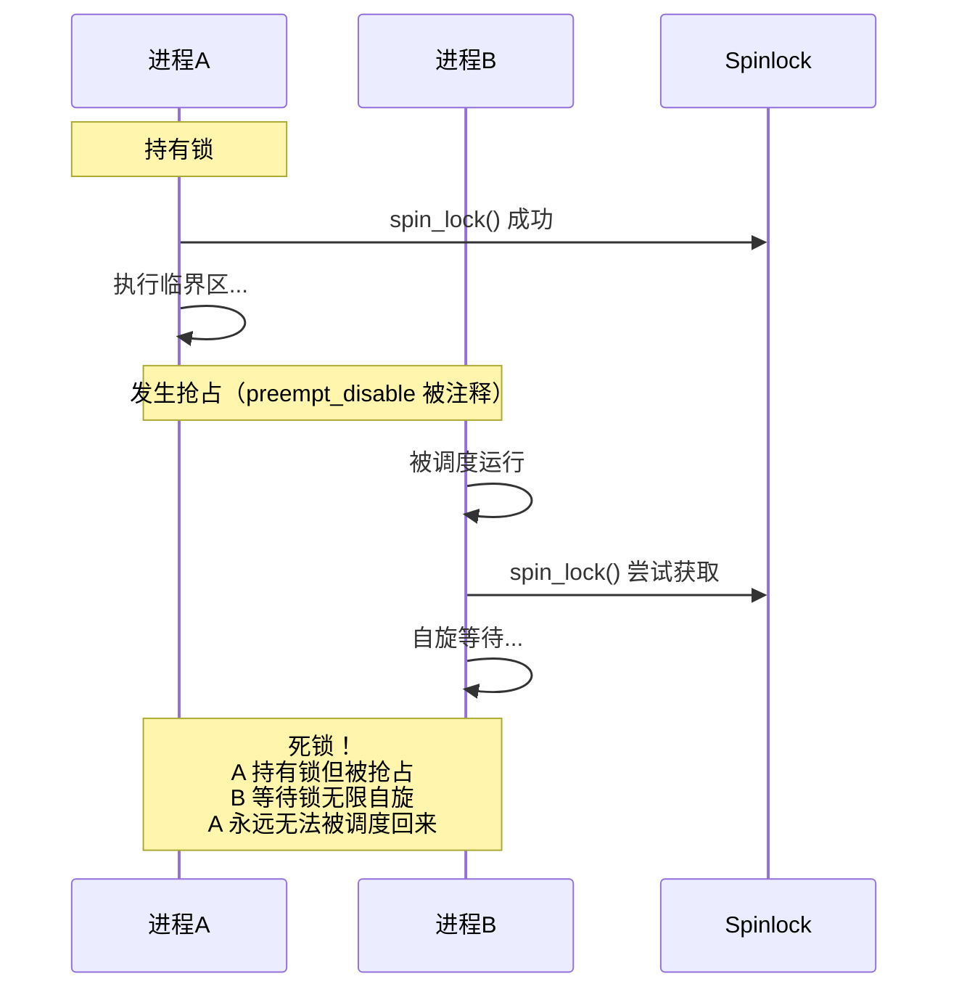

**死锁推演**：

| 时刻 | 进程A | 进程B | 锁状态 |
|------|-------|-------|--------|
| T1 | 获取锁成功 | - | A 持有 |
| T2 | 执行临界区 | - | A 持有 |
| T3 | **被抢占** | 开始运行 | A 持有 |
| T4 | 等待调度 | 尝试获取锁 | A 持有 |
| T5 | 无法运行 | **无限自旋** | 死锁 |

**关键点**：
1. 单 CPU 上，spinlock 的"自旋"意味着当前 CPU 不做其他事
2. 如果持锁者被抢占，它无法释放锁
3. 新进程自旋时，CPU 被占用，持锁者永远无法被调度
4. 结果：**死锁**

**正确实现**：

```c
// Linux 内核 spin_lock 实现
static inline void spin_lock(spinlock_t *lock)
{
    preempt_disable();      // 1. 先禁止抢占
    do_raw_spin_lock(lock); // 2. 再获取锁
}

static inline void spin_unlock(spinlock_t *lock)
{
    do_raw_spin_unlock(lock); // 1. 先释放锁
    preempt_enable();         // 2. 再恢复抢占
}
```

**为什么 `preempt_disable()` 能解决问题**：
- 禁止抢占后，持锁进程不会被打断
- 保证临界区能够完整执行
- 释放锁后才恢复抢占，其他进程才有机会运行

#### 多 CPU vs 单 CPU 对比

| 场景 | 无 preempt_disable | 有 preempt_disable |
|------|-------------------|-------------------|
| **单 CPU** | ❌ 死锁：持锁者被抢占，等锁者无限自旋 | ✅ 安全：不会被抢占 |
| **多 CPU** | ⚠️ 性能差：持锁者被抢占，其他 CPU 空转 | ✅ 高效：快速完成临界区 |

**多 CPU 不死锁但有问题**：
```c
// CPU 0                          // CPU 1
spin_lock(&lock);                 
// 被抢占，切换到其他进程          spin_lock(&lock);
// ...                            // 自旋等待 CPU 0...
// ...                            // 自旋等待 CPU 0...
// 终于被调度回来                  // 自旋等待 CPU 0...
spin_unlock(&lock);               // 获取成功
```
多 CPU 上不会死锁，因为 CPU 1 的自旋不影响 CPU 0 被调度回来。但 CPU 1 白白自旋浪费资源。

#### 中断上下文：更严重的问题

```c
// 错误代码：进程上下文持锁，中断也请求同一锁
spin_lock(&lock);           // 进程持有锁
    // ... 发生中断 ...
    irq_handler() {
        spin_lock(&lock);   // 中断请求同一锁 → 死锁！
    }
spin_unlock(&lock);
```

**解决方案**：与中断共享的锁必须使用 `spin_lock_irqsave()`：

```c
unsigned long flags;
spin_lock_irqsave(&lock, flags);  // 禁中断 + 获取锁
// 临界区
spin_unlock_irqrestore(&lock, flags);
```

#### 嵌套锁：ABBA 死锁

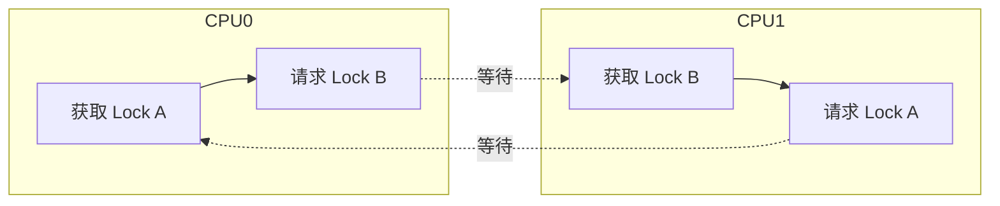

**预防**：始终按固定顺序获取锁（Lock Ordering）。

### 3.8 ARM 架构：WFE/SEV 指令优化

x86 使用 `PAUSE` 指令优化自旋，ARM 架构则使用 **WFE/SEV** 指令对实现更高效的自旋锁。

#### WFE/SEV 指令说明

| 指令 | 全称 | 作用 |
|------|------|------|
| **WFE** | Wait For Event | CPU 进入低功耗等待状态，直到收到事件 |
| **SEV** | Send Event | 向所有 CPU 发送事件，唤醒 WFE 等待者 |
| **SEVL** | Send Event Local | 只设置本地事件寄存器 |

#### 与 x86 PAUSE 的对比

| 特性 | x86 PAUSE | ARM WFE/SEV |
|------|-----------|-------------|
| 功耗 | 降低流水线功耗 | CPU 可完全休眠 |
| 延迟 | 固定延迟 (~10 cycles) | 事件驱动唤醒 |
| 唤醒机制 | 无，超时自动继续 | 需要 SEV 显式唤醒 |
| 适用场景 | 短自旋 | 长短自旋均可 |

#### ARM Spinlock 实现

```c
/* ARM64 spinlock 实现 (简化版) */
static inline void arch_spin_lock(arch_spinlock_t *lock)
{
    unsigned int tmp;
    arch_spinlock_t lockval, newval;

    asm volatile(
    "   sevl\n"                      // 设置本地事件，确保首次不等待
    "1: wfe\n"                       // 等待事件
    "   ldaxr   %w0, %2\n"           // 加载锁值（带 acquire）
    "   eor     %w1, %w0, %w0, ror #16\n"  // 比较 owner 和 next
    "   cbnz    %w1, 1b\n"           // 不等则继续等待
    "   add     %w0, %w0, #(1<<16)\n"// next++
    "   stxr    %w1, %w0, %2\n"      // 尝试存储
    "   cbnz    %w1, 1b\n"           // 失败则重试
    : "=&r" (lockval), "=&r" (newval), "+Q" (*lock)
    :
    : "memory");
}

static inline void arch_spin_unlock(arch_spinlock_t *lock)
{
    asm volatile(
    "   stlrh   %w1, %0\n"           // 释放锁（带 release）
    "   sev\n"                       // 发送事件唤醒等待者
    : "=Q" (lock->owner)
    : "r" (lock->owner + 1)
    : "memory");
}
```

#### 工作流程

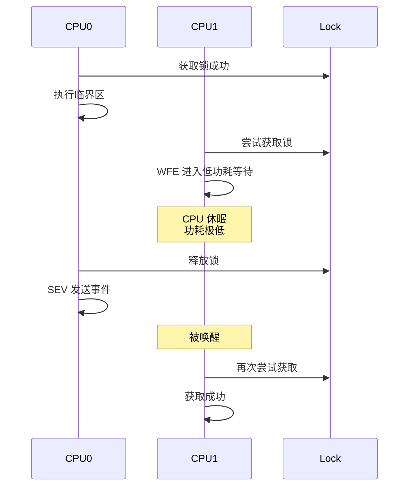

**WFE/SEV 的优势**：
1. **节能**：等待时 CPU 进入低功耗状态，而非空转
2. **高效**：事件驱动，无需轮询
3. **公平**：所有等待者同时被唤醒，配合 ticket/MCS 保证顺序

#### WFE 唤醒源详解

WFE 指令可以被多种事件唤醒：

| 唤醒源 | 说明 |
|--------|------|
| **SEV 指令** | 其他 CPU 执行 SEV 发送全局事件 |
| **事件寄存器** | 本地事件寄存器被设置（SEVL 可设置） |
| **外部事件** | 中断、调试事件等 |
| **Exclusive Monitor 清除** | 其他 CPU 修改了被监视的内存 |

#### Exclusive Monitor 机制

ARM 使用 **Exclusive Monitor** 实现原子操作，这是 spinlock 的基础：

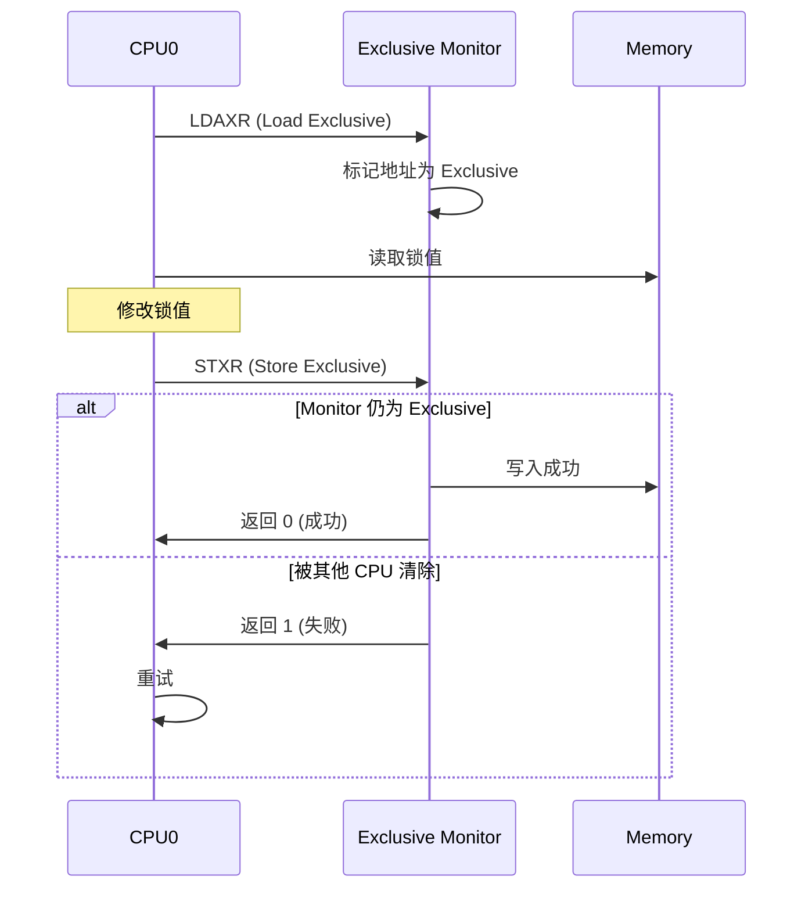

**关键点**：
- `LDAXR`：Load-Acquire Exclusive Register，带 acquire 语义
- `STXR`：Store Exclusive Register，只有 monitor 未被清除才成功
- `STLR`：Store-Release，带 release 语义，用于释放锁

#### 虚拟化场景处理

在虚拟化环境下，WFE 行为可能改变：

```c
/* Hypervisor 可以配置 WFE 行为 */
// HCR_EL2.TWE = 1 时，WFE 会 trap 到 EL2

// KVM 处理 WFE trap
static int handle_wfe(struct kvm_vcpu *vcpu)
{
    // 如果 vCPU 应该让出 CPU
    if (should_yield(vcpu)) {
        kvm_vcpu_yield_to(vcpu);  // 让出物理 CPU
    }
    return 1;  // 继续执行
}
```

**虚拟化下的优化**：
1. **pvspinlock**：半虚拟化自旋锁，通知 hypervisor 让出 CPU
2. **WFE trap**：hypervisor 可以将自旋的 vCPU 换出
3. **避免 Lock Holder Preemption**：防止持锁 vCPU 被抢占

#### x86 PAUSE vs ARM WFE 性能对比

| 指标 | x86 PAUSE | ARM WFE |
|------|-----------|---------|
| 短自旋 (<100 cycles) | ⭐⭐⭐ 优 | ⭐⭐ 良（WFE 有开销） |
| 长自旋 (>1000 cycles) | ⭐ 差（空转） | ⭐⭐⭐ 优（休眠） |
| 功耗 | 中等 | 低 |
| 唤醒延迟 | ~10 cycles | ~20-50 cycles |
| 适用架构 | 服务器（性能优先） | 移动/嵌入式（功耗优先） |

**Linux 内核的适配**：

```c
// include/asm-generic/barrier.h
#define cpu_relax() barrier()

// arch/arm64/include/asm/processor.h  
static inline void cpu_relax(void)
{
    asm volatile("yield" ::: "memory");
    // 或者在某些实现中使用 wfe
}

// arch/x86/include/asm/processor.h
static inline void cpu_relax(void)
{
    asm volatile("rep; nop" ::: "memory");  // PAUSE 指令
}
```

---

## 四、读写锁

### 4.1 读写锁原理

读写锁允许多个读者同时访问，但写者独占：

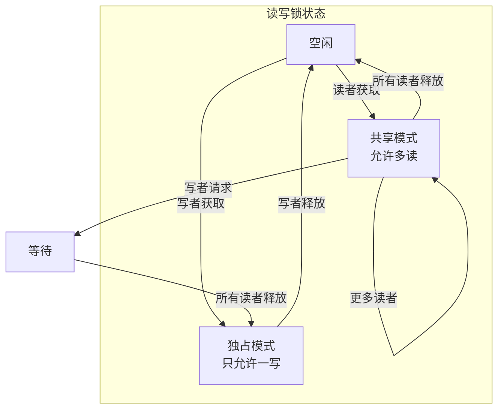

### 4.2 读写自旋锁

```c
typedef struct {
    atomic_t lock;  // 负数=写锁，正数=读者计数，0=空闲
} rwlock_t;

/* 读者 */
void read_lock(rwlock_t *rw) {
    while (1) {
        int old = atomic_read(&rw->lock);
        if (old >= 0 && atomic_cmpxchg(&rw->lock, old, old + 1) == old)
            break;
        cpu_relax();
    }
}

void read_unlock(rwlock_t *rw) {
    atomic_dec(&rw->lock);
}

/* 写者 */
void write_lock(rwlock_t *rw) {
    while (atomic_cmpxchg(&rw->lock, 0, -1) != 0)
        cpu_relax();
}

void write_unlock(rwlock_t *rw) {
    atomic_set(&rw->lock, 0);
}
```

### 4.3 读写锁的问题

**读者饥饿写者**：持续有读者时，写者可能长时间无法获取锁。

**解决方案**：
- 写者优先锁
- 公平读写锁
- 使用 RCU 替代

---

## 五、信号量

### 5.1 信号量 vs 互斥锁

| 特性 | 信号量 | 互斥锁 |
|------|--------|--------|
| 计数 | 可以 > 1 | 只能 0 或 1 |
| 持有者 | 无所有权概念 | 有明确持有者 |
| 递归 | 可实现 | 需要特殊类型 |
| 优先级继承 | 无 | 可以有 |
| 中断上下文 | down() 不可用 | 不适用 |

### 5.2 内核信号量

```c
struct semaphore {
    raw_spinlock_t lock;
    unsigned int count;
    struct list_head wait_list;
};

/* P 操作 (down) */
void down(struct semaphore *sem) {
    spin_lock(&sem->lock);
    if (sem->count > 0) {
        sem->count--;
        spin_unlock(&sem->lock);
    } else {
        /* 加入等待队列并睡眠 */
        add_to_wait_list(current);
        spin_unlock(&sem->lock);
        schedule();  // 睡眠
    }
}

/* V 操作 (up) */
void up(struct semaphore *sem) {
    spin_lock(&sem->lock);
    if (list_empty(&sem->wait_list)) {
        sem->count++;
    } else {
        /* 唤醒等待者 */
        wake_up_first_waiter();
    }
    spin_unlock(&sem->lock);
}
```

### 5.3 互斥锁 (Mutex)

Mutex 是二值信号量的优化版本，专为互斥设计：

```c
struct mutex {
    atomic_t count;           // 1=可用, 0=被占用, 负数=有等待者
    spinlock_t wait_lock;
    struct list_head wait_list;
    struct task_struct *owner;  // 持有者
};
```

**Mutex 相比信号量的优势**：
- 支持调试（检测死锁、错误释放）
- 支持优先级继承
- 有明确的持有者概念

---

## 六、RCU（Read-Copy-Update）

### 6.1 RCU 设计动机

传统锁的问题：
- 读多写少时，读者加锁开销大
- 读者间不应互相阻塞
- 读写锁仍有原子操作开销

**RCU 的核心思想**：读者无需加锁，写者负责同步。

### 6.2 RCU 核心概念

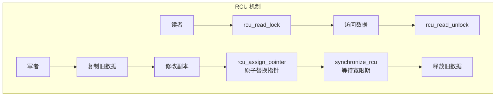

**关键术语**：

| 术语 | 定义 |
|------|------|
| **读侧临界区** | `rcu_read_lock()` 和 `rcu_read_unlock()` 之间的代码 |
| **宽限期（Grace Period）** | 所有 CPU 都经过一次静止状态的时间段 |
| **静止状态（Quiescent State）** | CPU 不在读侧临界区的状态 |

### 6.3 RCU 工作原理

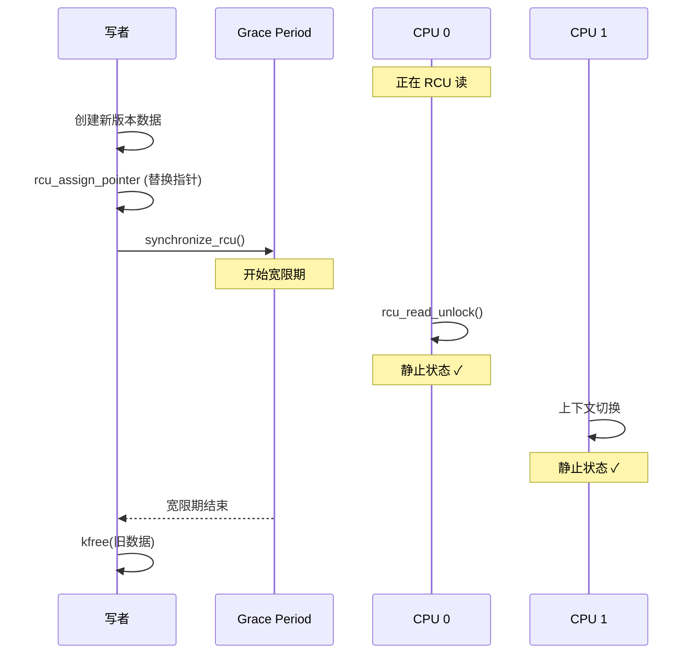

**为什么安全**：
1. 指针替换是原子的，读者要么看到旧版本，要么看到新版本
2. 写者等待所有可能看到旧指针的读者退出
3. 宽限期结束后，没有读者持有旧数据引用

### 6.4 RCU API

```c
/* 读者 */
rcu_read_lock();                    // 进入读侧临界区
ptr = rcu_dereference(global_ptr);  // 安全读取指针
/* 使用 ptr */
rcu_read_unlock();                  // 退出读侧临界区

/* 写者 */
new_ptr = kmalloc(...);
/* 初始化新数据 */
old_ptr = rcu_dereference(global_ptr);
rcu_assign_pointer(global_ptr, new_ptr);  // 发布新指针

synchronize_rcu();  // 等待宽限期
/* 或 */
call_rcu(&old_ptr->rcu_head, callback);  // 异步回调释放

kfree(old_ptr);
```

### 6.5 RCU 变体

| 变体 | 特点 | 适用场景 |
|------|------|----------|
| **Classic RCU** | 读侧临界区禁止调度 | 大多数情况 |
| **SRCU** | 读侧临界区可睡眠 | 需要阻塞的读操作 |
| **Tree RCU** | 可扩展到数千 CPU | 大型系统 |
| **Tiny RCU** | 简化实现 | 嵌入式单核系统 |

### 6.6 RCU 典型应用

**链表遍历**：

```c
/* 读者：无锁遍历 */
rcu_read_lock();
list_for_each_entry_rcu(entry, &mylist, list) {
    /* 处理 entry */
}
rcu_read_unlock();

/* 写者：删除节点 */
spin_lock(&list_lock);
list_del_rcu(&target->list);  // 从链表删除
spin_unlock(&list_lock);

synchronize_rcu();            // 等待读者
kfree(target);                // 释放内存
```

---

## 七、其他同步机制

### 7.1 序列锁（Seqlock）

写者优先的锁，读者可能需要重试：

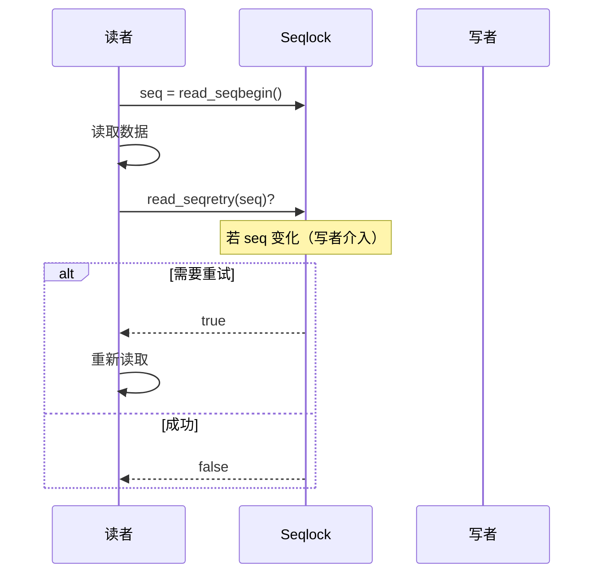

**适用场景**：写少读多，且读操作可以重试（如 jiffies 读取）。

### 7.2 完成变量（Completion）

用于等待某个事件完成：

```c
struct completion done;
init_completion(&done);

/* 等待方 */
wait_for_completion(&done);  // 阻塞等待

/* 通知方 */
complete(&done);             // 唤醒等待者
complete_all(&done);         // 唤醒所有等待者
```

**适用场景**：内核线程启动同步、设备初始化等待。

### 7.3 Per-CPU 变量

每个 CPU 独立副本，天然无竞争：

```c
DEFINE_PER_CPU(int, counter);

/* 访问 */
get_cpu_var(counter)++;  // 禁止抢占后访问
put_cpu_var(counter);    // 恢复抢占

/* 或使用 this_cpu 操作 */
this_cpu_inc(counter);   // 原子增加本 CPU 副本
```

**适用场景**：统计计数、缓存数据。

### 7.4 禁止抢占

有时只需防止同一 CPU 上的并发：

```c
preempt_disable();  // 禁止抢占
/* 临界区 */
preempt_enable();   // 恢复抢占
```

**注意**：只防止本 CPU 抢占，不防止其他 CPU。

---

## 八、同步机制选择指南

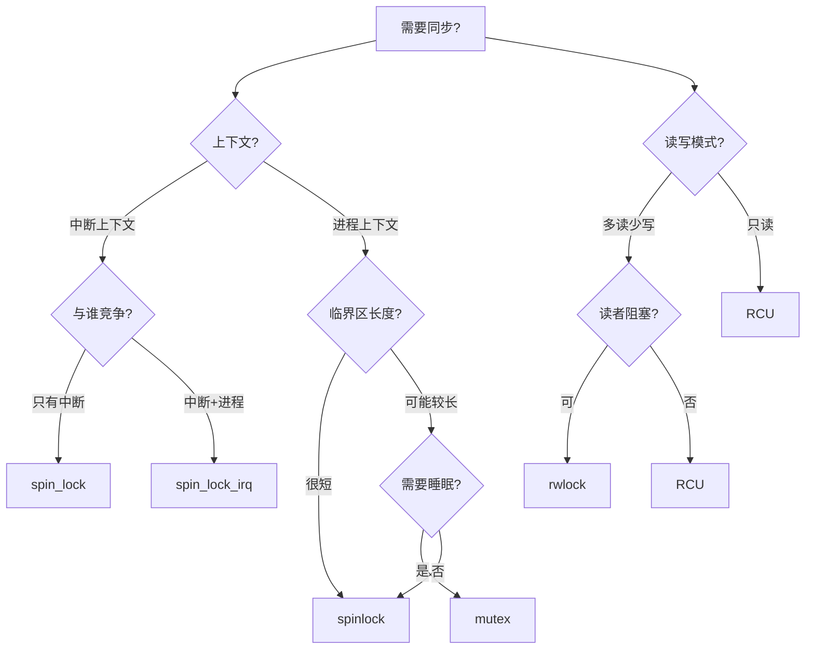

### 同步机制对比

| 机制 | 睡眠 | 开销 | 公平性 | 适用场景 |
|------|------|------|--------|----------|
| **spinlock** | 否 | 低 | qspinlock 公平 | 短临界区 |
| **mutex** | 是 | 中 | 公平 | 进程上下文，可睡眠 |
| **semaphore** | 是 | 中 | 公平 | 计数资源限制 |
| **rwlock** | 否 | 低 | 读者优先 | 读多写少 |
| **RCU** | 读否 | 极低(读) | 无 | 读极多，写极少 |
| **seqlock** | 否 | 低 | 写者优先 | 读可重试的场景 |

---

## 九、内核面试要点

### 9.1 常见问题

**Q: Spinlock 为什么要禁止抢占？**

A: 
1. 如果持有 spinlock 的进程被抢占，其他 CPU 会一直自旋
2. 如果被抢占后运行的进程也请求同一锁，单 CPU 上会死锁
3. 即使不死锁，自旋期间浪费 CPU 时间

**Q: RCU 如何知道宽限期结束？**

A: 
1. 每个 CPU 记录是否经过静止状态（上下文切换、用户态、idle）
2. 当所有 CPU 都报告至少一次静止状态，宽限期结束
3. Tree RCU 使用层次结构聚合，减少全局同步开销

**Q: 为什么中断处理程序不能使用 mutex？**

A: 
1. Mutex 可能导致睡眠（竞争失败时）
2. 中断上下文没有进程身份，不能被调度
3. 睡眠后无法被唤醒，系统会 hang

**Q: 什么情况下使用 spin_lock_irqsave 而不是 spin_lock_irq？**

A: 
当你不知道当前中断是否已经被禁止时。例如：
- 函数可能从多个路径调用
- 调用栈上层可能已经禁中断
- `spin_lock_irqsave` 保存当前状态，`spin_unlock_irqrestore` 恢复

**Q: RCU 相比读写锁有什么优势？**

A: 
1. **读者无开销**：不需要原子操作或内存屏障
2. **读者不阻塞**：无论写者状态如何
3. **无锁争用**：读者间完全并发
4. **更好的扩展性**：读者数量增加不影响性能

代价是：
- 写者需要等待宽限期
- 需要为更新维护多版本
- 实现复杂度较高

---

## 相关文章

- [上一篇：中断与系统调用详解](/articles/linux/linux-17-中断与系统调用详解/)
- [下一篇：暂无](/articles/linux/)
