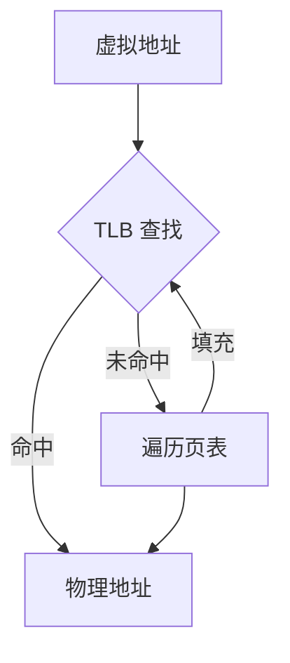
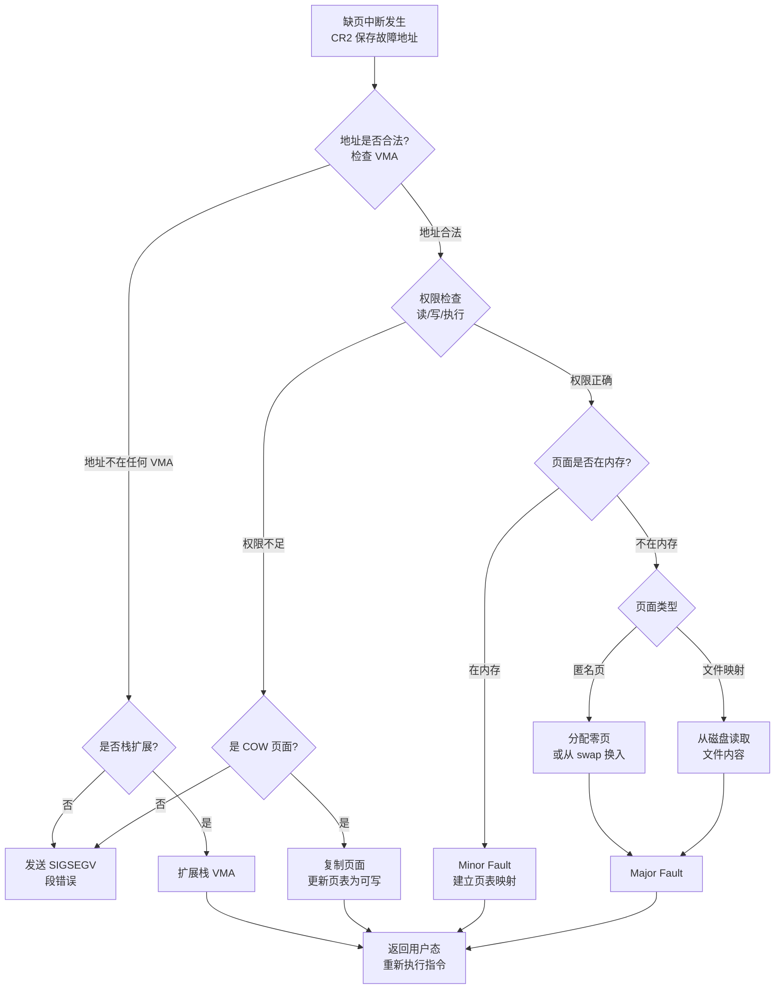
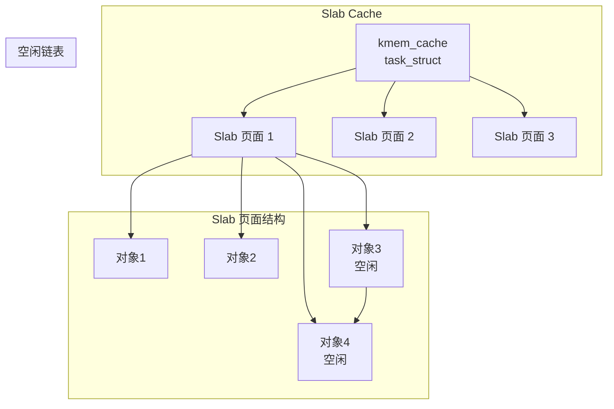

+++
title = "19.内核笔试题-内存管理"
date = 2026-01-31
description = "Linux内核内存管理笔试题：页表计算、分配器实现、缺页处理、GFP标志"
[taxonomies]
tags = ["Linux", "内核", "笔试", "内存管理", "MMU"]
+++

# Linux 内核笔试题 - 内存管理

本文汇集 Linux 内核内存管理相关的笔试真题，包括选择填空、简答计算、编程实现、Bug 分析等题型。

**难度标注**：★☆☆ 基础 | ★★☆ 中级 | ★★★ 困难

---

## 一、选择题

### 题目 1 ★☆☆

Linux 64 位系统中，用户空间的地址范围是：

A. `0x0000_0000_0000_0000` - `0x0000_7FFF_FFFF_FFFF`  
B. `0xFFFF_8000_0000_0000` - `0xFFFF_FFFF_FFFF_FFFF`  
C. `0x0000_0000_0000_0000` - `0xFFFF_FFFF_FFFF_FFFF`  
D. `0x0000_0000_0000_0000` - `0x0000_FFFF_FFFF_FFFF`

<details>
<summary>查看答案与解析</summary>

**答案：A**

**解析**：
- 64 位 Linux 使用 48 位虚拟地址空间（可扩展到 57 位 LA57）
- 用户空间：`0x0000_0000_0000_0000` - `0x0000_7FFF_FFFF_FFFF`（128TB）
- 内核空间：`0xFFFF_8000_0000_0000` - `0xFFFF_FFFF_FFFF_FFFF`（128TB）
- 中间是非规范地址（canonical hole），访问会触发异常

```
┌─────────────────────────────────────┐ 0xFFFF_FFFF_FFFF_FFFF
│           内核空间 128TB            │
├─────────────────────────────────────┤ 0xFFFF_8000_0000_0000
│                                     │
│        非规范地址 (Hole)            │
│                                     │
├─────────────────────────────────────┤ 0x0000_7FFF_FFFF_FFFF
│           用户空间 128TB            │
└─────────────────────────────────────┘ 0x0000_0000_0000_0000
```

</details>

---

### 题目 2 ★☆☆

以下关于 `kmalloc` 和 `vmalloc` 的描述，**错误**的是：

A. `kmalloc` 分配的内存物理连续，`vmalloc` 分配的内存物理不连续  
B. `vmalloc` 分配的内存可以用于 DMA 操作  
C. `kmalloc` 从 slab 分配器获取内存  
D. `vmalloc` 需要建立页表映射，开销比 `kmalloc` 大

<details>
<summary>查看答案与解析</summary>

**答案：B**

**解析**：

| 特性 | kmalloc | vmalloc |
|------|---------|---------|
| 物理连续 | ✅ 是 | ❌ 否 |
| 虚拟连续 | ✅ 是 | ✅ 是 |
| 可用于 DMA | ✅ 是 | ❌ 否 |
| 分配来源 | slab/slub | vmalloc 区 |
| 页表映射 | 已存在（直接映射区） | 需要建立 |
| 效率 | 高 | 低 |

B 选项错误：DMA 需要物理连续内存，vmalloc 仅保证虚拟连续，不能用于 DMA。

</details>

---

### 题目 3 ★★☆

以下哪个 GFP flag 组合会导致问题？

A. 进程上下文使用 `GFP_KERNEL`  
B. 中断上下文使用 `GFP_ATOMIC`  
C. 持有 spinlock 时使用 `GFP_KERNEL`  
D. 软中断上下文使用 `GFP_ATOMIC`

<details>
<summary>查看答案与解析</summary>

**答案：C**

**解析**：

| 上下文 | 可睡眠 | 正确 flag |
|--------|--------|-----------|
| 进程上下文 | ✅ | `GFP_KERNEL` |
| 持有 spinlock | ❌ | `GFP_ATOMIC` |
| 中断上下文 | ❌ | `GFP_ATOMIC` |
| 软中断上下文 | ❌ | `GFP_ATOMIC` |

C 选项问题：
- `spin_lock()` 会禁止抢占
- `GFP_KERNEL` 允许睡眠（内存不足时触发回收）
- 持有 spinlock 时睡眠 → 系统死锁

```c
// 错误
spin_lock(&lock);
p = kmalloc(size, GFP_KERNEL);  // ❌ 可能睡眠
spin_unlock(&lock);

// 正确
spin_lock(&lock);
p = kmalloc(size, GFP_ATOMIC);  // ✅ 不睡眠
spin_unlock(&lock);
```

</details>

---

### 题目 4 ★★☆

关于 TLB（Translation Lookaside Buffer）的描述，**正确**的是：

A. TLB 是页表的一部分，存储在内存中  
B. TLB 命中时，仍需要遍历页表获取物理地址  
C. 进程切换时必须刷新整个 TLB  
D. TLB 缓存的是虚拟地址到物理地址的映射

<details>
<summary>查看答案与解析</summary>

**答案：D**

**解析**：

- A 错误：TLB 是 CPU 内部的高速缓存，不在内存中
- B 错误：TLB 命中时直接返回物理地址，无需查页表
- C 错误：使用 PCID（进程上下文标识符）可以避免全刷新
- D 正确：TLB 缓存页表项，即 VA → PA 的映射



PCID 优化：
```c
// Linux 4.14+ 使用 PCID
// 每个进程分配唯一 PCID (0-4095)
// 切换进程时不刷新 TLB，TLB 条目带 PCID 标签
// 只有 PCID 匹配的条目才有效
```

</details>

---

### 题目 5 ★★★

以下代码在什么情况下可能失败？

```c
void *alloc_dma_buffer(size_t size) {
    return kmalloc(size, GFP_KERNEL | GFP_DMA);
}
```

A. size 超过 slab 最大分配大小  
B. size 小于 4KB  
C. 系统内存充足时  
D. 在进程上下文中调用时

<details>
<summary>查看答案与解析</summary>

**答案：A**

**解析**：

`kmalloc` 的限制：
- 最大分配大小通常为 4MB（`KMALLOC_MAX_SIZE`）
- 实际取决于 slab 配置，可能更小

```c
// 检查最大 kmalloc 大小
#include <linux/slab.h>
// KMALLOC_MAX_SIZE 定义

// 大内存应使用：
// 1. vmalloc（但不能用于 DMA）
// 2. alloc_pages（获取连续物理页）
// 3. dma_alloc_coherent（专用 DMA 分配）

void *alloc_dma_buffer(size_t size) {
    if (size > KMALLOC_MAX_SIZE) {
        // 使用专用 DMA API
        return dma_alloc_coherent(dev, size, &dma_handle, GFP_KERNEL);
    }
    return kmalloc(size, GFP_KERNEL | GFP_DMA);
}
```

其他选项：
- B：小于 4KB 正常工作
- C：内存充足更容易成功
- D：进程上下文使用 `GFP_KERNEL` 正确

</details>

---

## 二、填空题

### 题目 6 ★☆☆

x86_64 架构使用 ______ 级页表，每级索引占 ______ 位，页内偏移占 ______ 位，标准页大小为 ______ 。

<details>
<summary>查看答案</summary>

**答案**：4 级，9 位，12 位，4KB

```
48 位虚拟地址结构：
┌─────────┬─────────┬─────────┬─────────┬──────────────┐
│ PGD(9)  │ PUD(9)  │ PMD(9)  │ PTE(9)  │ Offset(12)   │
└─────────┴─────────┴─────────┴─────────┴──────────────┘
   9 bits    9 bits    9 bits    9 bits     12 bits

- 每级 9 位 → 512 个条目
- 每个条目 8 字节 → 每个页表页 4KB
- 页内偏移 12 位 → 2^12 = 4KB 页大小
- 可选 5 级页表（LA57）：57 位地址空间
```

</details>

---

### 题目 7 ★★☆

Linux 内核中，`__pa(vaddr)` 宏用于将 ______ 地址转换为 ______ 地址，该转换仅适用于 ______ 区域的地址。

<details>
<summary>查看答案</summary>

**答案**：虚拟地址，物理地址，直接映射区

```c
// x86_64 实现
#define PAGE_OFFSET     0xFFFF888000000000UL

// 虚拟 → 物理（仅限直接映射区）
#define __pa(x)         ((unsigned long)(x) - PAGE_OFFSET)

// 物理 → 虚拟（仅限直接映射区）
#define __va(x)         ((void *)((unsigned long)(x) + PAGE_OFFSET))

// 直接映射区特点：
// - 物理地址和虚拟地址存在固定偏移
// - 无需查页表，O(1) 转换
// - kmalloc 返回的地址在此区域
// - vmalloc 返回的地址不在此区域，不能用 __pa()
```

</details>

---

### 题目 8 ★★☆

缺页中断分为两类：______ Fault 表示页面已在内存，只需建立映射；______ Fault 表示需要从磁盘读取页面。

<details>
<summary>查看答案</summary>

**答案**：Minor（次要），Major（主要）

| 类型 | 触发条件 | 开销 | 示例 |
|------|----------|------|------|
| Minor Fault | 页在内存，缺页表映射 | ~1-10 μs | fork 后首次访问 |
| Major Fault | 页不在内存，需磁盘 IO | ~1-10 ms | mmap 文件首次访问 |

```bash
# 查看进程缺页统计
$ cat /proc/<pid>/stat | awk '{print "minflt:", $10, "majflt:", $12}'

# 或使用 ps
$ ps -o min_flt,maj_flt -p <pid>

# time 命令也会显示
$ /usr/bin/time -v ./program
# Minor (reclaiming a frame) page faults: 1234
# Major (requiring I/O) page faults: 56
```

</details>

---

### 题目 9 ★★★

Buddy System 将物理内存按 ______ 大小组织成链表，最小单位是 ______ ，释放时会尝试与 ______ 合并。

<details>
<summary>查看答案</summary>

**答案**：2^n（2的幂次），一个物理页（通常4KB），相邻的伙伴块

```
Buddy System 组织：

order-0 链表: 4KB 块
order-1 链表: 8KB 块（2个连续页）
order-2 链表: 16KB 块（4个连续页）
...
order-10 链表: 4MB 块（1024个连续页）

伙伴规则：
- 两个块大小相同
- 物理地址相邻
- 起始地址按大小对齐

示例：释放 16KB 块（地址 0x1000_0000）
1. 查找伙伴：0x1000_4000（相邻的 16KB）
2. 伙伴空闲 → 合并成 32KB（地址 0x1000_0000）
3. 继续查找 32KB 的伙伴...
```

</details>

---

## 三、简答题

### 题目 10 ★★☆

简述 Linux 缺页中断的处理流程。

<details>
<summary>参考答案</summary>



**关键步骤**：

1. **获取故障地址**：从 CR2 寄存器读取
2. **查找 VMA**：`find_vma()` 确定地址所属区域
3. **权限检查**：对比 VMA 权限和访问类型
4. **处理缺页**：
   - 已在内存 → 建立映射（Minor）
   - 需要 IO → 读取内容（Major）
   - COW → 复制页面
5. **返回**：重新执行触发缺页的指令

</details>

---

### 题目 11 ★★★

解释 Slab 分配器解决了什么问题，以及它的基本工作原理。

<details>
<summary>参考答案</summary>

**解决的问题**：

1. **内部碎片**：Buddy 最小分配 4KB，分配 64B 对象浪费 98%
2. **分配效率**：频繁分配/释放小对象开销大
3. **对象初始化**：内核对象（如 `task_struct`）有复杂初始化

**工作原理**：



**核心机制**：

```c
// 1. 创建缓存（系统初始化时）
struct kmem_cache *task_struct_cache;
task_struct_cache = kmem_cache_create(
    "task_struct",           // 名称
    sizeof(struct task_struct), // 对象大小
    0,                       // 对齐
    SLAB_HWCACHE_ALIGN,      // 标志
    NULL                     // 构造函数
);

// 2. 分配对象
struct task_struct *task = kmem_cache_alloc(task_struct_cache, GFP_KERNEL);

// 3. 释放对象（不释放内存，放回空闲链表）
kmem_cache_free(task_struct_cache, task);

// 4. 销毁缓存
kmem_cache_destroy(task_struct_cache);
```

**Slab 状态**：
- **Full**：所有对象已分配
- **Partial**：部分对象已分配（优先从这里分配）
- **Empty**：所有对象空闲（可回收给 Buddy）

</details>

---

## 四、计算题

### 题目 12 ★★☆

一个进程使用 2GB 连续虚拟地址空间，使用 4KB 页面和 4 级页表。计算：

1. 需要多少个 PTE（页表项）？
2. 需要多少个页表页？
3. 页表本身占用多少内存？

<details>
<summary>参考答案</summary>

**计算过程**：

```
1. PTE 数量：
   2GB / 4KB = 2^31 / 2^12 = 2^19 = 524,288 个 PTE

2. 页表页数量：
   每个页表页 4KB = 4096 字节
   每个 PTE 8 字节 → 每页 512 个 PTE

   PTE 级（最底层）：524,288 / 512 = 1,024 个页表页
   PMD 级：1,024 / 512 = 2 个页表页
   PUD 级：2 / 512 = 1 个页表页（向上取整）
   PGD 级：1 个页表页（每进程一个）

   总计：1,024 + 2 + 1 + 1 = 1,028 个页表页

3. 页表内存占用：
   1,028 × 4KB = 4,112 KB ≈ 4 MB
```

**对比使用 2MB 大页**：

```
PTE 数量：2GB / 2MB = 1,024 个
页表页：
  PMD 级：1,024 / 512 = 2 个
  PUD 级：1 个
  PGD 级：1 个
  总计：4 个页表页 = 16 KB

节省：4 MB → 16 KB（减少 99.6%）
```

</details>

---

### 题目 13 ★★★

假设一个系统有 8GB 物理内存，Buddy System 初始状态下只有一个 8GB 的空闲块。现在依次分配：

1. 分配 3GB
2. 分配 500MB
3. 释放步骤 1 分配的 3GB
4. 分配 2GB

请画出每步操作后的 Buddy 空闲链表状态。

<details>
<summary>参考答案</summary>

**初始状态**：
```
order-33 (8GB): [0-8GB]
```

**步骤 1：分配 3GB**（需要 4GB 块）

```
8GB 拆分:
  → 4GB [0-4GB] + 4GB [4-8GB]

分配 [0-4GB]，剩余:
order-32 (4GB): [4-8GB]
```

**步骤 2：分配 500MB**（需要 512MB 块）

```
4GB [4-8GB] 拆分:
  → 2GB [4-6GB] + 2GB [6-8GB]
2GB [4-6GB] 拆分:
  → 1GB [4-5GB] + 1GB [5-6GB]
1GB [4-5GB] 拆分:
  → 512MB [4-4.5GB] + 512MB [4.5-5GB]

分配 [4-4.5GB]，剩余:
order-29 (512MB): [4.5-5GB]
order-30 (1GB):   [5-6GB]
order-31 (2GB):   [6-8GB]
```

**步骤 3：释放 3GB**（即释放 4GB [0-4GB]）

```
尝试合并:
- [0-4GB] 的伙伴是 [4-8GB]
- [4-8GB] 不完整空闲，无法合并

剩余:
order-32 (4GB):   [0-4GB]
order-29 (512MB): [4.5-5GB]
order-30 (1GB):   [5-6GB]
order-31 (2GB):   [6-8GB]
```

**步骤 4：分配 2GB**

```
使用 [6-8GB]，剩余:
order-32 (4GB):   [0-4GB]
order-29 (512MB): [4.5-5GB]
order-30 (1GB):   [5-6GB]
```

**最终内存布局**：
```
┌──────────┬───────┬───────┬────────┬────────┐
│ 已用 4GB │ 已用  │ 空闲  │ 空闲   │ 已用   │
│ (步骤1)  │ 512MB │ 512MB │ 1GB    │ 2GB    │
│ 0-4GB    │4-4.5GB│4.5-5GB│ 5-6GB  │ 6-8GB  │
└──────────┴───────┴───────┴────────┴────────┘
```

</details>

---

## 五、编程题

### 题目 14 ★★☆

实现一个简化的页帧分配器，支持分配和释放 2^order 个连续页面。

<details>
<summary>参考答案</summary>

```c
#include <stdio.h>
#include <stdlib.h>
#include <string.h>
#include <stdbool.h>

#define MAX_ORDER 10
#define PAGE_SIZE 4096
#define TOTAL_PAGES (1 << MAX_ORDER)  // 1024 pages = 4MB

// 页帧状态
typedef struct {
    bool allocated;
    int order;  // 当前块的 order（仅对块首页有效）
} page_t;

// 空闲链表节点
typedef struct free_node {
    int page_idx;
    struct free_node *next;
} free_node_t;

// Buddy 分配器
typedef struct {
    page_t pages[TOTAL_PAGES];
    free_node_t *free_lists[MAX_ORDER + 1];
} buddy_allocator_t;

// 初始化分配器
void buddy_init(buddy_allocator_t *alloc) {
    memset(alloc->pages, 0, sizeof(alloc->pages));
    memset(alloc->free_lists, 0, sizeof(alloc->free_lists));
    
    // 初始时有一个 2^MAX_ORDER 的块
    alloc->pages[0].order = MAX_ORDER;
    
    free_node_t *node = malloc(sizeof(free_node_t));
    node->page_idx = 0;
    node->next = NULL;
    alloc->free_lists[MAX_ORDER] = node;
}

// 从空闲链表移除
static int remove_from_free_list(buddy_allocator_t *alloc, int order) {
    free_node_t *node = alloc->free_lists[order];
    if (!node) return -1;
    
    int idx = node->page_idx;
    alloc->free_lists[order] = node->next;
    free(node);
    return idx;
}

// 添加到空闲链表
static void add_to_free_list(buddy_allocator_t *alloc, int page_idx, int order) {
    free_node_t *node = malloc(sizeof(free_node_t));
    node->page_idx = page_idx;
    node->next = alloc->free_lists[order];
    alloc->free_lists[order] = node;
    alloc->pages[page_idx].order = order;
}

// 分配 2^order 个页面
int buddy_alloc(buddy_allocator_t *alloc, int order) {
    if (order > MAX_ORDER) return -1;
    
    // 查找足够大的空闲块
    int found_order = order;
    while (found_order <= MAX_ORDER && !alloc->free_lists[found_order]) {
        found_order++;
    }
    
    if (found_order > MAX_ORDER) return -1;  // 内存不足
    
    // 从链表取出
    int page_idx = remove_from_free_list(alloc, found_order);
    
    // 拆分大块
    while (found_order > order) {
        found_order--;
        int buddy_idx = page_idx + (1 << found_order);
        add_to_free_list(alloc, buddy_idx, found_order);
    }
    
    // 标记为已分配
    alloc->pages[page_idx].allocated = true;
    alloc->pages[page_idx].order = order;
    
    return page_idx;
}

// 计算伙伴页帧索引
static int get_buddy_idx(int page_idx, int order) {
    return page_idx ^ (1 << order);
}

// 释放页面
void buddy_free(buddy_allocator_t *alloc, int page_idx) {
    if (!alloc->pages[page_idx].allocated) return;
    
    int order = alloc->pages[page_idx].order;
    alloc->pages[page_idx].allocated = false;
    
    // 尝试与伙伴合并
    while (order < MAX_ORDER) {
        int buddy_idx = get_buddy_idx(page_idx, order);
        
        // 检查伙伴是否空闲且大小匹配
        if (buddy_idx >= TOTAL_PAGES || 
            alloc->pages[buddy_idx].allocated ||
            alloc->pages[buddy_idx].order != order) {
            break;
        }
        
        // 从空闲链表移除伙伴
        free_node_t **pp = &alloc->free_lists[order];
        while (*pp && (*pp)->page_idx != buddy_idx) {
            pp = &(*pp)->next;
        }
        if (*pp) {
            free_node_t *tmp = *pp;
            *pp = (*pp)->next;
            free(tmp);
        }
        
        // 合并：取较小的索引
        if (buddy_idx < page_idx) {
            page_idx = buddy_idx;
        }
        order++;
    }
    
    // 添加到空闲链表
    add_to_free_list(alloc, page_idx, order);
}

// 打印状态
void buddy_print(buddy_allocator_t *alloc) {
    printf("Free lists:\n");
    for (int i = 0; i <= MAX_ORDER; i++) {
        printf("  order %2d (%6d pages): ", i, 1 << i);
        for (free_node_t *n = alloc->free_lists[i]; n; n = n->next) {
            printf("[%d] ", n->page_idx);
        }
        printf("\n");
    }
}

int main() {
    buddy_allocator_t alloc;
    buddy_init(&alloc);
    
    printf("Initial state:\n");
    buddy_print(&alloc);
    
    printf("\nAllocate order 5 (32 pages):\n");
    int p1 = buddy_alloc(&alloc, 5);
    printf("Got page %d\n", p1);
    buddy_print(&alloc);
    
    printf("\nAllocate order 3 (8 pages):\n");
    int p2 = buddy_alloc(&alloc, 3);
    printf("Got page %d\n", p2);
    buddy_print(&alloc);
    
    printf("\nFree page %d:\n", p1);
    buddy_free(&alloc, p1);
    buddy_print(&alloc);
    
    return 0;
}
```

</details>

---

### 题目 15 ★★★

实现一个简化的 Slab 分配器，支持固定大小对象的分配和释放。

<details>
<summary>参考答案</summary>

```c
#include <stdio.h>
#include <stdlib.h>
#include <string.h>
#include <stdbool.h>
#include <stdint.h>

#define PAGE_SIZE 4096
#define MAX_SLABS 16

// Slab 页面头部
typedef struct slab {
    struct slab *next;
    int free_count;
    int total_count;
    void *free_list;  // 空闲对象链表
    char objects[];   // 柔性数组，存放对象
} slab_t;

// Slab 缓存
typedef struct kmem_cache {
    const char *name;
    size_t obj_size;      // 对象大小
    size_t aligned_size;  // 对齐后大小
    int objs_per_slab;    // 每个 slab 的对象数
    slab_t *partial;      // 部分空闲 slab
    slab_t *full;         // 全满 slab
    slab_t *empty;        // 全空 slab
} kmem_cache_t;

// 创建 slab 缓存
kmem_cache_t *kmem_cache_create(const char *name, size_t size) {
    kmem_cache_t *cache = malloc(sizeof(kmem_cache_t));
    
    cache->name = name;
    cache->obj_size = size;
    
    // 对齐到 8 字节，且至少能存放一个指针
    cache->aligned_size = (size + 7) & ~7;
    if (cache->aligned_size < sizeof(void*)) {
        cache->aligned_size = sizeof(void*);
    }
    
    // 计算每个 slab 能容纳多少对象
    size_t slab_header = sizeof(slab_t);
    cache->objs_per_slab = (PAGE_SIZE - slab_header) / cache->aligned_size;
    
    cache->partial = NULL;
    cache->full = NULL;
    cache->empty = NULL;
    
    printf("Created cache '%s': obj_size=%zu, aligned=%zu, per_slab=%d\n",
           name, size, cache->aligned_size, cache->objs_per_slab);
    
    return cache;
}

// 创建新 slab
static slab_t *create_slab(kmem_cache_t *cache) {
    // 分配一个页面
    slab_t *slab = aligned_alloc(PAGE_SIZE, PAGE_SIZE);
    if (!slab) return NULL;
    
    slab->next = NULL;
    slab->total_count = cache->objs_per_slab;
    slab->free_count = cache->objs_per_slab;
    
    // 初始化空闲链表
    slab->free_list = NULL;
    char *obj = slab->objects;
    for (int i = 0; i < cache->objs_per_slab; i++) {
        *(void**)obj = slab->free_list;
        slab->free_list = obj;
        obj += cache->aligned_size;
    }
    
    return slab;
}

// 分配对象
void *kmem_cache_alloc(kmem_cache_t *cache) {
    slab_t *slab = cache->partial;
    
    // 没有 partial slab，尝试从 empty 获取
    if (!slab) {
        slab = cache->empty;
        if (slab) {
            cache->empty = slab->next;
            slab->next = cache->partial;
            cache->partial = slab;
        }
    }
    
    // 没有 empty slab，创建新的
    if (!slab) {
        slab = create_slab(cache);
        if (!slab) return NULL;
        slab->next = cache->partial;
        cache->partial = slab;
    }
    
    // 从空闲链表取出对象
    void *obj = slab->free_list;
    slab->free_list = *(void**)obj;
    slab->free_count--;
    
    // 如果 slab 满了，移到 full 链表
    if (slab->free_count == 0) {
        cache->partial = slab->next;
        slab->next = cache->full;
        cache->full = slab;
    }
    
    return obj;
}

// 找到对象所属的 slab
static slab_t *find_slab(void *obj) {
    // slab 页面对齐，直接计算
    return (slab_t *)((uintptr_t)obj & ~(PAGE_SIZE - 1));
}

// 释放对象
void kmem_cache_free(kmem_cache_t *cache, void *obj) {
    slab_t *slab = find_slab(obj);
    bool was_full = (slab->free_count == 0);
    
    // 放回空闲链表
    *(void**)obj = slab->free_list;
    slab->free_list = obj;
    slab->free_count++;
    
    // 如果之前是满的，从 full 移到 partial
    if (was_full) {
        // 从 full 链表移除
        slab_t **pp = &cache->full;
        while (*pp && *pp != slab) pp = &(*pp)->next;
        if (*pp) *pp = slab->next;
        
        // 添加到 partial
        slab->next = cache->partial;
        cache->partial = slab;
    }
    // 如果现在全空，从 partial 移到 empty
    else if (slab->free_count == slab->total_count) {
        // 从 partial 链表移除
        slab_t **pp = &cache->partial;
        while (*pp && *pp != slab) pp = &(*pp)->next;
        if (*pp) *pp = slab->next;
        
        // 添加到 empty
        slab->next = cache->empty;
        cache->empty = slab;
    }
}

// 打印缓存状态
void kmem_cache_print(kmem_cache_t *cache) {
    printf("Cache '%s':\n", cache->name);
    
    int count = 0;
    for (slab_t *s = cache->partial; s; s = s->next) count++;
    printf("  partial: %d slabs\n", count);
    
    count = 0;
    for (slab_t *s = cache->full; s; s = s->next) count++;
    printf("  full: %d slabs\n", count);
    
    count = 0;
    for (slab_t *s = cache->empty; s; s = s->next) count++;
    printf("  empty: %d slabs\n", count);
}

// 测试
int main() {
    // 创建一个 64 字节对象的缓存
    kmem_cache_t *cache = kmem_cache_create("test_cache", 64);
    
    // 分配一些对象
    void *objs[100];
    for (int i = 0; i < 100; i++) {
        objs[i] = kmem_cache_alloc(cache);
    }
    printf("\nAfter allocating 100 objects:\n");
    kmem_cache_print(cache);
    
    // 释放一半
    for (int i = 0; i < 50; i++) {
        kmem_cache_free(cache, objs[i]);
    }
    printf("\nAfter freeing 50 objects:\n");
    kmem_cache_print(cache);
    
    // 释放剩余
    for (int i = 50; i < 100; i++) {
        kmem_cache_free(cache, objs[i]);
    }
    printf("\nAfter freeing all objects:\n");
    kmem_cache_print(cache);
    
    return 0;
}
```

</details>

---

## 六、Bug 分析题

### 题目 16 ★★☆

以下代码有什么问题？如何修复？

```c
void process_data(struct device *dev) {
    char *buffer;
    
    spin_lock(&dev->lock);
    
    buffer = kmalloc(4096, GFP_KERNEL);
    if (!buffer) {
        spin_unlock(&dev->lock);
        return;
    }
    
    memcpy(buffer, dev->data, 4096);
    
    spin_unlock(&dev->lock);
    
    process_buffer(buffer);
    kfree(buffer);
}
```

<details>
<summary>查看答案与解析</summary>

**问题**：持有 spinlock 时使用 `GFP_KERNEL` 分配内存。

**原因**：
- `spin_lock()` 禁止抢占
- `GFP_KERNEL` 允许睡眠（内存不足时触发回收）
- 持有 spinlock 时睡眠会导致死锁

**修复方案**：

```c
// 方案 1：使用 GFP_ATOMIC
void process_data_v1(struct device *dev) {
    char *buffer;
    
    spin_lock(&dev->lock);
    
    buffer = kmalloc(4096, GFP_ATOMIC);  // 不会睡眠
    if (!buffer) {
        spin_unlock(&dev->lock);
        return;
    }
    
    memcpy(buffer, dev->data, 4096);
    spin_unlock(&dev->lock);
    
    process_buffer(buffer);
    kfree(buffer);
}

// 方案 2：先分配内存，再获取锁（推荐）
void process_data_v2(struct device *dev) {
    char *buffer;
    
    buffer = kmalloc(4096, GFP_KERNEL);  // 锁外分配
    if (!buffer)
        return;
    
    spin_lock(&dev->lock);
    memcpy(buffer, dev->data, 4096);
    spin_unlock(&dev->lock);
    
    process_buffer(buffer);
    kfree(buffer);
}

// 方案 3：使用 mutex 替代 spinlock（如果允许睡眠）
void process_data_v3(struct device *dev) {
    char *buffer;
    
    mutex_lock(&dev->mutex);
    
    buffer = kmalloc(4096, GFP_KERNEL);  // mutex 下可以睡眠
    if (!buffer) {
        mutex_unlock(&dev->mutex);
        return;
    }
    
    memcpy(buffer, dev->data, 4096);
    mutex_unlock(&dev->mutex);
    
    process_buffer(buffer);
    kfree(buffer);
}
```

**选择建议**：
- 方案 1：简单但 `GFP_ATOMIC` 可能失败
- 方案 2：最佳实践，锁外分配
- 方案 3：如果临界区可以使用 mutex

</details>

---

### 题目 17 ★★★

以下驱动代码可能导致内存泄漏，找出所有问题并修复。

```c
int my_driver_init(struct platform_device *pdev) {
    struct my_device *dev;
    int ret;
    
    dev = kzalloc(sizeof(*dev), GFP_KERNEL);
    if (!dev)
        return -ENOMEM;
    
    dev->buffer = kmalloc(BUF_SIZE, GFP_KERNEL);
    if (!dev->buffer)
        return -ENOMEM;
    
    dev->workqueue = create_singlethread_workqueue("my_wq");
    if (!dev->workqueue)
        return -ENOMEM;
    
    ret = request_irq(dev->irq, my_irq_handler, 0, "my_dev", dev);
    if (ret)
        return ret;
    
    ret = misc_register(&dev->misc);
    if (ret)
        return ret;
    
    platform_set_drvdata(pdev, dev);
    return 0;
}
```

<details>
<summary>查看答案与解析</summary>

**问题分析**：

每个错误返回都可能泄漏之前分配的资源：

1. `dev->buffer` 分配失败 → 泄漏 `dev`
2. `dev->workqueue` 创建失败 → 泄漏 `dev`, `dev->buffer`
3. `request_irq` 失败 → 泄漏 `dev`, `dev->buffer`, `dev->workqueue`
4. `misc_register` 失败 → 泄漏所有已分配资源

**修复代码**：

```c
int my_driver_init(struct platform_device *pdev) {
    struct my_device *dev;
    int ret;
    
    dev = kzalloc(sizeof(*dev), GFP_KERNEL);
    if (!dev)
        return -ENOMEM;
    
    dev->buffer = kmalloc(BUF_SIZE, GFP_KERNEL);
    if (!dev->buffer) {
        ret = -ENOMEM;
        goto err_free_dev;
    }
    
    dev->workqueue = create_singlethread_workqueue("my_wq");
    if (!dev->workqueue) {
        ret = -ENOMEM;
        goto err_free_buffer;
    }
    
    ret = request_irq(dev->irq, my_irq_handler, 0, "my_dev", dev);
    if (ret)
        goto err_destroy_wq;
    
    ret = misc_register(&dev->misc);
    if (ret)
        goto err_free_irq;
    
    platform_set_drvdata(pdev, dev);
    return 0;

err_free_irq:
    free_irq(dev->irq, dev);
err_destroy_wq:
    destroy_workqueue(dev->workqueue);
err_free_buffer:
    kfree(dev->buffer);
err_free_dev:
    kfree(dev);
    return ret;
}

void my_driver_exit(struct platform_device *pdev) {
    struct my_device *dev = platform_get_drvdata(pdev);
    
    misc_deregister(&dev->misc);
    free_irq(dev->irq, dev);
    destroy_workqueue(dev->workqueue);
    kfree(dev->buffer);
    kfree(dev);
}
```

**关键模式：goto 清理链**

```
分配顺序：A → B → C → D
清理顺序：D → C → B → A（逆序）

err_D:
    cleanup_C();
err_C:
    cleanup_B();
err_B:
    cleanup_A();
    return ret;
```

</details>

---

## 七、高频考点总结

| 考点 | 频率 | 难度 | 关键知识 |
|------|------|------|----------|
| 地址空间布局 | ★★★ | ★☆☆ | 用户/内核空间划分，直接映射区 |
| kmalloc vs vmalloc | ★★★ | ★★☆ | 物理连续性，DMA 使用 |
| GFP flags | ★★★ | ★★☆ | GFP_KERNEL vs GFP_ATOMIC |
| 页表结构 | ★★☆ | ★★☆ | 4 级页表，每级 9 位 |
| TLB 机制 | ★★☆ | ★★☆ | 缓存原理，PCID |
| 缺页中断 | ★★☆ | ★★★ | Minor/Major，COW |
| Buddy System | ★★☆ | ★★★ | 伙伴合并，2^n 分配 |
| Slab 分配器 | ★★☆ | ★★★ | 对象缓存，空闲链表 |

---

## 相关文章

- [上一篇：内核同步机制详解](/articles/linux/linux-18-内核同步机制详解/)
- [下一篇：内核笔试题-进程调度](/articles/linux/linux-20-内核笔试题-进程调度/)

**知识基础**：
- [内核内存管理详解](/articles/linux/linux-16-内核内存管理详解/)
