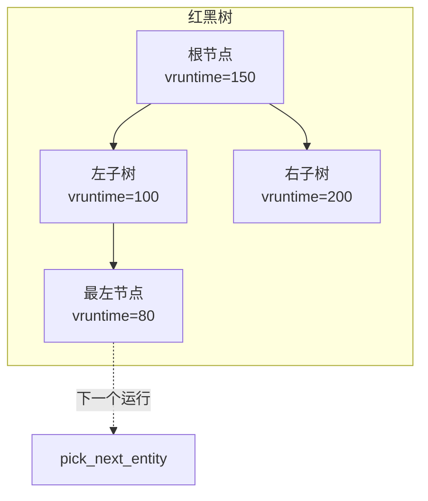
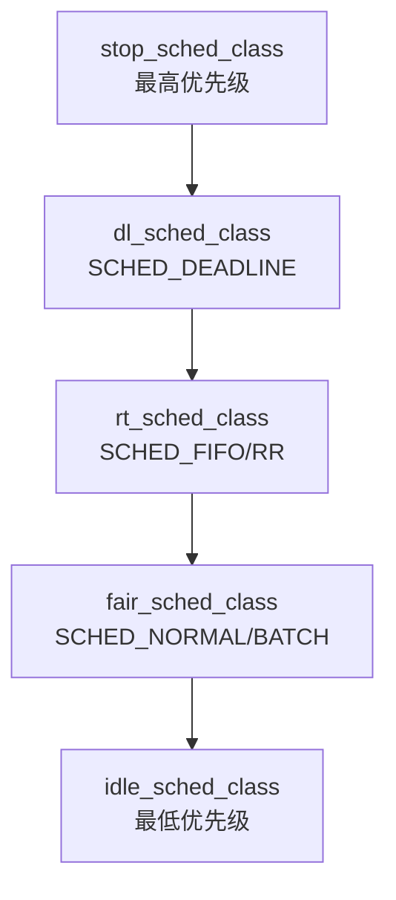
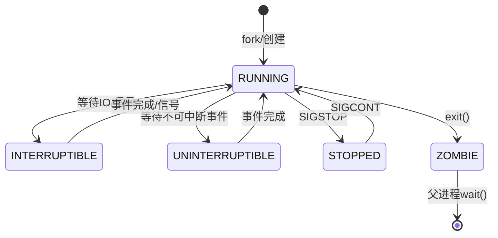
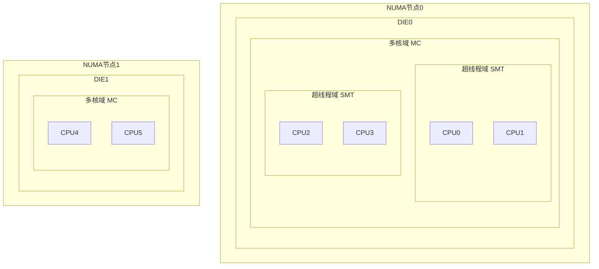

+++
title = "内核笔试题-进程调度"
date = 2026-01-31
weight = 20000
description = "Linux内核进程调度笔试题：CFS算法、vruntime计算、实时调度、上下文切换"
[taxonomies]
tags = ["Linux", "内核", "笔试", "调度", "CFS"]
+++

# Linux 内核笔试题 - 进程调度

本文汇集 Linux 内核进程调度相关的笔试真题，包括 CFS 调度器、vruntime 计算、实时调度、上下文切换等内容。

**难度标注**：★☆☆ 基础 | ★★☆ 中级 | ★★★ 困难

---

## 一、选择题

### 题目 1 ★☆☆

Linux CFS 调度器使用什么数据结构组织可运行进程？

A. 数组  
B. 链表  
C. 红黑树  
D. 哈希表

<details>
<summary>查看答案与解析</summary>

**答案：C**

**解析**：

CFS（Completely Fair Scheduler）使用红黑树按 vruntime 排序进程：



- 插入/删除：O(log n)
- 获取最小 vruntime：O(1)，使用 `rb_first_cached()`
- 最左节点就是下一个要运行的进程

</details>

---

### 题目 2 ★★☆

进程 A 的 nice 值为 -10，进程 B 的 nice 值为 0。在 CFS 调度下：

A. 进程 A 的 vruntime 增长更快  
B. 进程 A 的 vruntime 增长更慢  
C. 两者 vruntime 增长速度相同  
D. 进程 A 永远不会被调度出去

<details>
<summary>查看答案与解析</summary>

**答案：B**

**解析**：

vruntime 计算公式：
```
vruntime += delta_exec × (NICE_0_LOAD / weight)
```

nice 值与权重对应关系（部分）：

| nice | weight |
|------|--------|
| -20 | 88761 |
| -10 | 9548 |
| 0 | 1024 |
| 10 | 110 |
| 19 | 15 |

计算：
- 进程 A（nice=-10, weight=9548）运行 10ms：
  ```
  vruntime_A = 10 × (1024/9548) ≈ 1.07ms
  ```
- 进程 B（nice=0, weight=1024）运行 10ms：
  ```
  vruntime_B = 10 × (1024/1024) = 10ms
  ```

**结论**：高优先级（低 nice）的进程 vruntime 增长慢，因此更常被选中运行。

</details>

---

### 题目 3 ★★☆

以下哪个调度策略的优先级最高？

A. SCHED_NORMAL  
B. SCHED_FIFO  
C. SCHED_DEADLINE  
D. SCHED_BATCH

<details>
<summary>查看答案与解析</summary>

**答案：C**

**解析**：

Linux 调度类优先级（从高到低）：



| 调度策略 | 调度类 | 说明 |
|----------|--------|------|
| SCHED_DEADLINE | dl | 最早截止时间优先 |
| SCHED_FIFO | rt | 先进先出，无时间片 |
| SCHED_RR | rt | 轮转，有时间片 |
| SCHED_NORMAL | fair | 普通进程，CFS |
| SCHED_BATCH | fair | 批处理，CPU 密集型 |
| SCHED_IDLE | fair | 最低优先级 |

</details>

---

### 题目 4 ★★★

关于进程上下文切换，以下描述**错误**的是：

A. 切换时需要保存和恢复通用寄存器  
B. 同一进程的线程切换不需要切换页表  
C. 上下文切换一定会导致 TLB 全部失效  
D. FPU/SIMD 状态需要保存和恢复

<details>
<summary>查看答案与解析</summary>

**答案：C**

**解析**：

- A 正确：必须保存 RAX, RBX, RCX 等通用寄存器
- B 正确：同进程线程共享地址空间，无需切换 CR3
- C **错误**：使用 PCID（进程上下文标识符）可以避免 TLB 全部失效
- D 正确：如果使用了 FPU/SIMD，需要 XSAVE/XRSTOR

**PCID 优化**：
```c
// Linux 4.14+ 使用 PCID
// 每个进程分配唯一 PCID (0-4095)
// TLB 条目带 PCID 标签
// 切换进程时只刷新特定 PCID 的条目

// 进程切换时
if (cpu_feature_enabled(X86_FEATURE_PCID)) {
    // 设置新 PCID，不刷新 TLB
    write_cr3(new_pgd | (new_pcid << 48));
} else {
    // 无 PCID，切换 CR3 会刷新整个 TLB
    write_cr3(new_pgd);
}
```

</details>

---

### 题目 5 ★★★

以下关于 `SCHED_DEADLINE` 的描述，**正确**的是：

A. 使用固定优先级调度  
B. 进程需要指定 runtime、deadline、period 三个参数  
C. 不能与 SCHED_FIFO 进程共存  
D. 不需要内核准入控制

<details>
<summary>查看答案与解析</summary>

**答案：B**

**解析**：

SCHED_DEADLINE 使用 EDF（Earliest Deadline First）算法：

```c
struct sched_attr attr = {
    .sched_policy = SCHED_DEADLINE,
    .sched_runtime = 5000000,     // 每周期需要 5ms CPU
    .sched_deadline = 10000000,   // 必须在 10ms 内完成
    .sched_period = 20000000      // 任务周期 20ms
};
sched_setattr(0, &attr, 0);
```

- A 错误：使用动态优先级（最早截止时间优先）
- B 正确：三参数缺一不可
- C 错误：可以共存，DEADLINE 优先级更高
- D 错误：需要准入控制，保证 Σ(runtime/period) ≤ CPU 数量

**准入控制**：
```
系统有 4 个 CPU，每个 CPU 利用率上限 95%：
Σ(runtime_i / period_i) ≤ 4 × 0.95 = 3.8

如果超过，sched_setattr() 返回 -EBUSY
```

</details>

---

## 二、填空题

### 题目 6 ★☆☆

Linux 进程有 ______ 种基本状态，其中 ______ 状态表示进程可运行但等待 CPU，______ 状态表示进程正在等待 I/O 完成。

<details>
<summary>查看答案</summary>

**答案**：5 种（或更多），TASK_RUNNING，TASK_INTERRUPTIBLE（或 TASK_UNINTERRUPTIBLE）

```c
// 主要进程状态
#define TASK_RUNNING            0x0000  // 可运行/正在运行
#define TASK_INTERRUPTIBLE      0x0001  // 可中断睡眠
#define TASK_UNINTERRUPTIBLE    0x0002  // 不可中断睡眠
#define __TASK_STOPPED          0x0004  // 已停止
#define __TASK_TRACED           0x0008  // 被跟踪
#define EXIT_DEAD               0x0010  // 已死亡
#define EXIT_ZOMBIE             0x0020  // 僵尸进程
```



</details>

---

### 题目 7 ★★☆

CFS 调度器中，新创建的进程的 vruntime 初始化为 ______ ，这样做是为了防止 ______ 。

<details>
<summary>查看答案</summary>

**答案**：队列的 min_vruntime（加上一定补偿），新进程立即抢占所有老进程

```c
static void place_entity(struct cfs_rq *cfs_rq,
                         struct sched_entity *se, int initial) {
    u64 vruntime = cfs_rq->min_vruntime;
    
    if (initial) {
        // 新创建进程：加上一个调度延迟作为惩罚
        vruntime += sched_vslice(cfs_rq, se);
    }
    
    se->vruntime = max(se->vruntime, vruntime);
}
```

**设计目的**：
1. 如果新进程 vruntime=0，会立即抢占所有老进程
2. 可能被滥用：不断 fork 新进程独占 CPU
3. 初始化为 min_vruntime + 补偿，确保公平

</details>

---

### 题目 8 ★★☆

实时调度中，SCHED_FIFO 和 SCHED_RR 的主要区别是：SCHED_RR 具有 ______ ，时间片用完后会 ______ 。

<details>
<summary>查看答案</summary>

**答案**：时间片，让同优先级进程运行（轮转）

| 策略 | 时间片 | 行为 |
|------|--------|------|
| SCHED_FIFO | 无 | 一直运行直到阻塞或主动让出 |
| SCHED_RR | 有 | 时间片用完后让同优先级进程运行 |

```bash
# 查看 RR 时间片
$ cat /proc/sys/kernel/sched_rr_timeslice_ms
100  # 默认 100ms

# 设置实时调度
$ chrt -f 50 ./app   # FIFO，优先级 50
$ chrt -r 30 ./app   # RR，优先级 30
```

**注意**：两者都会被更高优先级进程抢占。

</details>

---

### 题目 9 ★★★

进程上下文切换时，`switch_to` 宏完成的主要工作包括：保存 ______ 寄存器、切换 ______ 、以及切换 ______ 。

<details>
<summary>查看答案</summary>

**答案**：通用/CPU 寄存器，内核栈（RSP），页表（CR3）

```c
// arch/x86/kernel/process.c
__visible struct task_struct *
__switch_to(struct task_struct *prev, struct task_struct *next) {
    struct thread_struct *prev_t = &prev->thread;
    struct thread_struct *next_t = &next->thread;
    
    // 1. 保存/恢复 FPU 状态
    switch_fpu_prepare(prev_fpu, cpu);
    
    // 2. 切换内核栈（修改 TSS 中的 RSP0）
    load_sp0(next);
    
    // 3. 切换 TLS（线程本地存储）
    load_TLS(next, cpu);
    
    // 4. 切换 FS/GS 段寄存器
    savesegment(fs, prev_t->fsbase);
    loadsegment(fs, next_t->fsbase);
    
    // 5. 切换调试寄存器（如果使用）
    if (prev_t->debugreg7)
        set_debugreg(0, 7);
    
    // 注：CR3 切换在 switch_mm() 中完成
    
    return prev;
}
```

</details>

---

## 三、简答题

### 题目 10 ★★☆

解释为什么 CFS 使用 vruntime 而不是实际运行时间来调度进程？

<details>
<summary>参考答案</summary>

**问题**：如果使用实际运行时间

```
进程 A（nice=-10，高优先级）运行 10ms
进程 B（nice=0，普通优先级）运行 10ms
→ 两者"平等"，违背优先级语义
```

**vruntime 的设计**：

```
vruntime = 实际运行时间 × (NICE_0_LOAD / weight)

效果：
- 高优先级（低 nice）→ 大 weight → vruntime 增长慢
- 低优先级（高 nice）→ 小 weight → vruntime 增长快
- 调度器选 vruntime 最小的 → 高优先级获得更多 CPU
```

**示例计算**：

```
nice=-10（weight=9548）运行 10ms：
  vruntime = 10 × (1024/9548) ≈ 1.07ms

nice=0（weight=1024）运行 10ms：
  vruntime = 10 × (1024/1024) = 10ms

nice=10（weight=110）运行 10ms：
  vruntime = 10 × (1024/110) ≈ 93ms
```

**公平性保证**：

长时间运行后，所有进程的 vruntime 趋于相等，但实际获得的 CPU 时间按权重分配：
```
CPU 时间比 = weight_A : weight_B : weight_C
           = 9548 : 1024 : 110
           ≈ 87 : 9 : 1
```

</details>

---

### 题目 11 ★★★

请解释 Linux 多核负载均衡的层次结构和触发时机。

<details>
<summary>参考答案</summary>

**调度域层次**：



**负载均衡触发时机**：

| 触发点 | 描述 | 场景 |
|--------|------|------|
| scheduler_tick | 周期性检查 | 每个调度 tick |
| nohz_idle_balance | 空闲 CPU 触发 | tickless 模式 |
| wake_up_process | 进程唤醒时选 CPU | 每次唤醒 |
| sched_fork | 新进程选 CPU | 每次 fork |
| CPU 变空闲 | 拉取其他 CPU 任务 | 立即 |

**均衡策略**：

```c
// 负载均衡考虑因素
1. 负载差异
   imbalance = max_cpu_load - avg_cpu_load
   if (imbalance > threshold)
       migrate_tasks();

2. 缓存亲和性
   // 优先在同一 LLC（Last Level Cache）内均衡
   // 跨 NUMA 迁移代价最大

3. 任务热度
   // 刚运行过的任务缓存热，避免迁移
   if (now - task->last_run < cache_hot_threshold)
       skip_migration();

4. NUMA 感知
   // 跨 NUMA 迁移需要考虑内存位置
   // 尽量让任务在其内存所在的 NUMA 节点运行
```

</details>

---

## 四、计算题

### 题目 12 ★★☆

系统中有三个进程同时就绪：

| 进程 | nice | weight |
|------|------|--------|
| A | -5 | 3121 |
| B | 0 | 1024 |
| C | 5 | 335 |

假设每个进程实际运行 10ms 后被切换，计算：
1. 每个进程 10ms 对应的 vruntime 增量
2. 如果初始 vruntime 都为 0，三轮调度后各进程的 vruntime

<details>
<summary>参考答案</summary>

**1. vruntime 增量计算**：

```
公式：vruntime += delta_exec × (NICE_0_LOAD / weight)
NICE_0_LOAD = 1024

进程 A：10 × (1024/3121) = 3.28ms
进程 B：10 × (1024/1024) = 10.00ms
进程 C：10 × (1024/335)  = 30.57ms
```

**2. 三轮调度模拟**：

```
初始状态：
  A: vruntime = 0
  B: vruntime = 0
  C: vruntime = 0

第 1 轮：选 vruntime 最小的（都是 0，假设选 A）
  A 运行 10ms
  A: vruntime = 3.28ms
  B: vruntime = 0
  C: vruntime = 0

第 2 轮：选 vruntime 最小的（B 或 C，假设选 B）
  B 运行 10ms
  A: vruntime = 3.28ms
  B: vruntime = 10.00ms
  C: vruntime = 0

第 3 轮：选 vruntime 最小的（C）
  C 运行 10ms
  A: vruntime = 3.28ms
  B: vruntime = 10.00ms
  C: vruntime = 30.57ms

第 4 轮：选 vruntime 最小的（A）
  A 运行 10ms
  A: vruntime = 6.56ms
  ...
```

**长期 CPU 分配比例**：
```
A : B : C = 3121 : 1024 : 335 ≈ 9.3 : 3.1 : 1
```

</details>

---

### 题目 13 ★★★

假设一个 SCHED_DEADLINE 任务的参数为：
- runtime = 2ms
- deadline = 5ms
- period = 10ms

1. 计算该任务的 CPU 利用率
2. 如果系统有 4 个 CPU，最多能运行多少个这样的任务（假设利用率上限 95%）？

<details>
<summary>参考答案</summary>

**1. CPU 利用率**：

```
利用率 = runtime / period = 2ms / 10ms = 20%
```

**2. 最大任务数**：

```
系统总可用利用率 = 4 CPU × 95% = 3.8 (380%)

每个任务利用率 = 20%

最大任务数 = 380% / 20% = 19 个
```

**准入控制公式**：
```
Σ(runtime_i / period_i) ≤ num_cpus × threshold

n × (2ms / 10ms) ≤ 4 × 0.95
n × 0.2 ≤ 3.8
n ≤ 19
```

**注意事项**：
- 实际部署需要考虑其他开销（中断、内核任务）
- deadline 必须 ≤ period
- runtime 必须 ≤ deadline

</details>

---

### 题目 14 ★★★

假设上下文切换的各项开销如下：

| 操作 | 开销 |
|------|------|
| 保存/恢复通用寄存器 | 100ns |
| 切换内核栈 | 20ns |
| 切换页表 (CR3) | 50ns |
| TLB 失效（无 PCID） | 2000ns |
| TLB 失效（有 PCID） | 100ns |
| FPU/SIMD 状态 | 200ns |

计算：
1. 同进程线程切换的开销
2. 不同进程切换的开销（无 PCID）
3. 不同进程切换的开销（有 PCID）

<details>
<summary>参考答案</summary>

**1. 同进程线程切换**：

```
线程共享地址空间，不需要切换页表

开销 = 寄存器 + 内核栈 + FPU
     = 100 + 20 + 200
     = 320ns
```

**2. 不同进程切换（无 PCID）**：

```
开销 = 寄存器 + 内核栈 + 页表 + TLB失效(无PCID) + FPU
     = 100 + 20 + 50 + 2000 + 200
     = 2370ns ≈ 2.4μs
```

**3. 不同进程切换（有 PCID）**：

```
开销 = 寄存器 + 内核栈 + 页表 + TLB失效(有PCID) + FPU
     = 100 + 20 + 50 + 100 + 200
     = 470ns
```

**对比**：

| 类型 | 开销 | 说明 |
|------|------|------|
| 线程切换 | 320ns | 最快，共享地址空间 |
| 进程切换(PCID) | 470ns | PCID 避免 TLB 全刷新 |
| 进程切换(无PCID) | 2370ns | TLB 失效是主要开销 |

</details>

---

## 五、编程题

### 题目 15 ★★☆

实现一个简化的优先级调度器，支持多个优先级队列和时间片轮转。

<details>
<summary>参考答案</summary>

```c
#include <stdio.h>
#include <stdlib.h>
#include <string.h>
#include <stdbool.h>

#define MAX_PRIORITY 10
#define TIME_SLICE 10  // 时间片 10ms

typedef enum {
    TASK_RUNNING,
    TASK_READY,
    TASK_BLOCKED,
    TASK_TERMINATED
} task_state_t;

typedef struct task {
    int id;
    int priority;           // 0-9，0 最高
    int remaining_time;     // 剩余执行时间
    int time_slice;         // 剩余时间片
    task_state_t state;
    struct task *next;
} task_t;

typedef struct {
    task_t *head;
    task_t *tail;
    int count;
} task_queue_t;

typedef struct {
    task_queue_t queues[MAX_PRIORITY];
    task_t *current;
    int total_tasks;
} scheduler_t;

// 初始化调度器
void scheduler_init(scheduler_t *sched) {
    memset(sched, 0, sizeof(scheduler_t));
}

// 添加任务到队列尾部
void enqueue(task_queue_t *q, task_t *task) {
    task->next = NULL;
    if (q->tail) {
        q->tail->next = task;
    } else {
        q->head = task;
    }
    q->tail = task;
    q->count++;
}

// 从队列头部取出任务
task_t *dequeue(task_queue_t *q) {
    if (!q->head) return NULL;
    
    task_t *task = q->head;
    q->head = task->next;
    if (!q->head) q->tail = NULL;
    q->count--;
    task->next = NULL;
    return task;
}

// 创建新任务
task_t *create_task(scheduler_t *sched, int priority, int exec_time) {
    task_t *task = malloc(sizeof(task_t));
    task->id = sched->total_tasks++;
    task->priority = priority;
    task->remaining_time = exec_time;
    task->time_slice = TIME_SLICE;
    task->state = TASK_READY;
    task->next = NULL;
    
    enqueue(&sched->queues[priority], task);
    printf("Created task %d: priority=%d, exec_time=%d\n",
           task->id, priority, exec_time);
    return task;
}

// 选择下一个任务（最高优先级队列的队首）
task_t *pick_next_task(scheduler_t *sched) {
    for (int i = 0; i < MAX_PRIORITY; i++) {
        if (sched->queues[i].head) {
            return dequeue(&sched->queues[i]);
        }
    }
    return NULL;
}

// 运行一个时间单位
void scheduler_tick(scheduler_t *sched) {
    if (!sched->current) {
        sched->current = pick_next_task(sched);
        if (!sched->current) {
            printf("No runnable tasks\n");
            return;
        }
        sched->current->state = TASK_RUNNING;
        printf("Switch to task %d (priority=%d)\n",
               sched->current->id, sched->current->priority);
    }
    
    task_t *curr = sched->current;
    
    // 执行 1ms
    curr->remaining_time--;
    curr->time_slice--;
    
    printf("  Task %d running: remaining=%d, slice=%d\n",
           curr->id, curr->remaining_time, curr->time_slice);
    
    // 检查任务是否完成
    if (curr->remaining_time <= 0) {
        printf("  Task %d completed\n", curr->id);
        curr->state = TASK_TERMINATED;
        free(curr);
        sched->current = NULL;
        return;
    }
    
    // 检查是否有更高优先级任务
    for (int i = 0; i < curr->priority; i++) {
        if (sched->queues[i].head) {
            printf("  Task %d preempted by higher priority\n", curr->id);
            curr->state = TASK_READY;
            curr->time_slice = TIME_SLICE;  // 重置时间片
            enqueue(&sched->queues[curr->priority], curr);
            sched->current = NULL;
            return;
        }
    }
    
    // 检查时间片是否用完
    if (curr->time_slice <= 0) {
        printf("  Task %d time slice expired\n", curr->id);
        curr->state = TASK_READY;
        curr->time_slice = TIME_SLICE;
        enqueue(&sched->queues[curr->priority], curr);
        sched->current = NULL;
    }
}

int main() {
    scheduler_t sched;
    scheduler_init(&sched);
    
    // 创建测试任务
    create_task(&sched, 2, 25);  // 低优先级，需要 25ms
    create_task(&sched, 0, 5);   // 高优先级，需要 5ms
    create_task(&sched, 1, 15);  // 中优先级，需要 15ms
    
    printf("\n--- Start scheduling ---\n\n");
    
    // 模拟运行
    for (int tick = 0; tick < 50; tick++) {
        printf("Tick %d:\n", tick);
        scheduler_tick(&sched);
        printf("\n");
        
        // 检查是否所有任务完成
        bool all_done = true;
        for (int i = 0; i < MAX_PRIORITY; i++) {
            if (sched.queues[i].head) all_done = false;
        }
        if (all_done && !sched.current) break;
    }
    
    return 0;
}
```

</details>

---

### 题目 16 ★★★

实现一个简化的 CFS 调度器，使用红黑树按 vruntime 排序。

<details>
<summary>参考答案</summary>

```c
#include <stdio.h>
#include <stdlib.h>
#include <stdint.h>
#include <stdbool.h>

// 简化的红黑树节点（实际使用 Linux 的 rbtree 或手写）
typedef struct rb_node {
    struct rb_node *left, *right, *parent;
    bool color;  // 0=红, 1=黑
    uint64_t key; // vruntime
} rb_node_t;

typedef struct {
    rb_node_t *root;
    rb_node_t *leftmost;  // 缓存最左节点
} rb_tree_t;

// 调度实体
typedef struct sched_entity {
    int id;
    int nice;
    uint64_t weight;
    uint64_t vruntime;
    uint64_t exec_time;      // 已执行时间
    uint64_t remaining_time; // 剩余时间
    rb_node_t node;
} sched_entity_t;

// CFS 运行队列
typedef struct {
    rb_tree_t tasks_timeline;
    uint64_t min_vruntime;
    int nr_running;
} cfs_rq_t;

// nice 到 weight 的映射（简化）
static const uint64_t nice_to_weight[] = {
    88761, 71755, 56483, 46273, 36291,  // nice -20 to -16
    29154, 23254, 18705, 14949, 11916,  // nice -15 to -11
    9548,  7620,  6100,  4904,  3906,   // nice -10 to -6
    3121,  2501,  1991,  1586,  1277,   // nice -5 to -1
    1024,  820,   655,   526,   423,    // nice 0 to 4
    335,   272,   215,   172,   137,    // nice 5 to 9
    110,   87,    70,    56,    45,     // nice 10 to 14
    36,    29,    23,    18,    15      // nice 15 to 19
};

#define NICE_TO_WEIGHT(nice) nice_to_weight[(nice) + 20]
#define NICE_0_LOAD 1024

// 简化的红黑树操作（实际应该完整实现）
void rb_insert(rb_tree_t *tree, sched_entity_t *se) {
    rb_node_t **link = &tree->root;
    rb_node_t *parent = NULL;
    
    // 找到插入位置
    while (*link) {
        parent = *link;
        sched_entity_t *entry = (sched_entity_t *)
            ((char*)parent - offsetof(sched_entity_t, node));
        
        if (se->vruntime < entry->vruntime) {
            link = &parent->left;
        } else {
            link = &parent->right;
        }
    }
    
    se->node.parent = parent;
    se->node.left = se->node.right = NULL;
    se->node.color = 0;  // 红色
    *link = &se->node;
    
    // 更新最左节点
    if (!tree->leftmost || se->vruntime < tree->leftmost->key) {
        tree->leftmost = &se->node;
        tree->leftmost->key = se->vruntime;
    }
    
    // 简化：省略红黑树平衡操作
}

void rb_remove(rb_tree_t *tree, sched_entity_t *se) {
    // 简化实现：仅处理简单情况
    rb_node_t *node = &se->node;
    
    if (tree->leftmost == node) {
        // 更新最左节点
        if (node->right) {
            tree->leftmost = node->right;
            while (tree->leftmost->left)
                tree->leftmost = tree->leftmost->left;
        } else {
            tree->leftmost = node->parent;
        }
    }
    
    // 简化：实际需要完整的删除和平衡操作
    if (node->parent) {
        if (node->parent->left == node)
            node->parent->left = NULL;
        else
            node->parent->right = NULL;
    } else {
        tree->root = NULL;
    }
}

// 初始化 CFS 运行队列
void cfs_rq_init(cfs_rq_t *rq) {
    rq->tasks_timeline.root = NULL;
    rq->tasks_timeline.leftmost = NULL;
    rq->min_vruntime = 0;
    rq->nr_running = 0;
}

// 计算 vruntime 增量
uint64_t calc_delta_vruntime(uint64_t delta_exec, uint64_t weight) {
    return delta_exec * NICE_0_LOAD / weight;
}

// 入队
void enqueue_entity(cfs_rq_t *rq, sched_entity_t *se) {
    // 新任务的 vruntime 不能小于 min_vruntime
    if (se->vruntime < rq->min_vruntime) {
        se->vruntime = rq->min_vruntime;
    }
    
    rb_insert(&rq->tasks_timeline, se);
    rq->nr_running++;
    
    printf("Enqueue task %d: nice=%d, weight=%lu, vruntime=%lu\n",
           se->id, se->nice, se->weight, se->vruntime);
}

// 出队
void dequeue_entity(cfs_rq_t *rq, sched_entity_t *se) {
    rb_remove(&rq->tasks_timeline, se);
    rq->nr_running--;
}

// 选择下一个任务
sched_entity_t *pick_next_entity(cfs_rq_t *rq) {
    if (!rq->tasks_timeline.leftmost) return NULL;
    
    return (sched_entity_t *)
        ((char*)rq->tasks_timeline.leftmost - offsetof(sched_entity_t, node));
}

// 更新 vruntime
void update_curr(cfs_rq_t *rq, sched_entity_t *curr, uint64_t delta_exec) {
    uint64_t delta_vruntime = calc_delta_vruntime(delta_exec, curr->weight);
    curr->vruntime += delta_vruntime;
    curr->exec_time += delta_exec;
    
    // 更新 min_vruntime
    if (curr->vruntime > rq->min_vruntime) {
        rq->min_vruntime = curr->vruntime;
    }
    
    printf("Update task %d: exec=%lu, vruntime=%lu (delta=%lu)\n",
           curr->id, curr->exec_time, curr->vruntime, delta_vruntime);
}

// 创建任务
sched_entity_t *create_entity(int id, int nice, uint64_t total_time) {
    sched_entity_t *se = malloc(sizeof(sched_entity_t));
    se->id = id;
    se->nice = nice;
    se->weight = NICE_TO_WEIGHT(nice);
    se->vruntime = 0;
    se->exec_time = 0;
    se->remaining_time = total_time;
    return se;
}

int main() {
    cfs_rq_t rq;
    cfs_rq_init(&rq);
    
    // 创建测试任务
    sched_entity_t *tasks[3];
    tasks[0] = create_entity(0, -5, 30);   // 高优先级
    tasks[1] = create_entity(1, 0, 30);    // 普通优先级
    tasks[2] = create_entity(2, 5, 30);    // 低优先级
    
    // 入队
    for (int i = 0; i < 3; i++) {
        enqueue_entity(&rq, tasks[i]);
    }
    
    printf("\n--- CFS Scheduling Simulation ---\n\n");
    
    // 模拟调度（每次运行 5ms）
    uint64_t time_slice = 5;
    
    for (int round = 0; round < 20 && rq.nr_running > 0; round++) {
        printf("Round %d:\n", round);
        
        // 选择 vruntime 最小的任务
        sched_entity_t *curr = pick_next_entity(&rq);
        if (!curr) break;
        
        printf("  Selected task %d (nice=%d, vruntime=%lu)\n",
               curr->id, curr->nice, curr->vruntime);
        
        // 从树中移除当前任务
        dequeue_entity(&rq, curr);
        
        // 执行
        uint64_t exec = (curr->remaining_time < time_slice) ?
                        curr->remaining_time : time_slice;
        curr->remaining_time -= exec;
        
        // 更新 vruntime
        update_curr(&rq, curr, exec);
        
        // 如果任务完成
        if (curr->remaining_time <= 0) {
            printf("  Task %d completed! Total exec=%lu\n",
                   curr->id, curr->exec_time);
            free(curr);
        } else {
            // 重新入队
            enqueue_entity(&rq, curr);
        }
        
        printf("\n");
    }
    
    return 0;
}
```

</details>

---

## 六、Bug 分析题

### 题目 17 ★★☆

以下代码试图实现一个简单的自旋等待，但有问题。分析问题并修复。

```c
volatile int ready = 0;
int data = 0;

void producer(void) {
    data = 42;
    ready = 1;
}

void consumer(void) {
    while (!ready)
        ;
    printf("data = %d\n", data);  // 可能打印 0
}
```

<details>
<summary>查看答案与解析</summary>

**问题分析**：

1. **编译器重排序**：编译器可能将 `ready = 1` 移到 `data = 42` 之前
2. **CPU 重排序**：CPU 可能乱序执行写操作
3. **Store Buffer**：`ready = 1` 可能先对其他 CPU 可见

**修复方案**：

```c
#include <stdatomic.h>

atomic_int ready = ATOMIC_VAR_INIT(0);
int data = 0;

// 方案 1：使用 release-acquire 语义
void producer_v1(void) {
    data = 42;
    atomic_store_explicit(&ready, 1, memory_order_release);
}

void consumer_v1(void) {
    while (!atomic_load_explicit(&ready, memory_order_acquire))
        ;
    printf("data = %d\n", data);  // 一定是 42
}

// 方案 2：使用显式内存屏障
void producer_v2(void) {
    data = 42;
    atomic_thread_fence(memory_order_release);  // 写屏障
    atomic_store_explicit(&ready, 1, memory_order_relaxed);
}

void consumer_v2(void) {
    while (!atomic_load_explicit(&ready, memory_order_relaxed))
        ;
    atomic_thread_fence(memory_order_acquire);  // 读屏障
    printf("data = %d\n", data);  // 一定是 42
}
```

**内存序保证**：
- `memory_order_release`：之前的写操作不会被重排到之后
- `memory_order_acquire`：之后的读操作不会被重排到之前
- 形成 release-acquire 配对，确保正确同步

</details>

---

### 题目 18 ★★★

以下内核代码在 SMP 系统上可能导致问题，分析原因。

```c
static struct task_struct *next_task = NULL;

void scheduler_tick(void) {
    struct task_struct *prev = current;
    
    // 选择下一个任务
    next_task = pick_next_task();
    
    if (next_task != prev) {
        // 切换任务
        switch_to(prev, next_task);
    }
}
```

<details>
<summary>查看答案与解析</summary>

**问题分析**：

1. **全局变量竞争**：`next_task` 是全局变量，多个 CPU 同时执行 `scheduler_tick()` 会竞争
2. **无锁保护**：没有任何同步机制
3. **可能的错误**：
   - CPU0 选择 task A，写入 next_task
   - CPU1 选择 task B，覆盖 next_task
   - CPU0 切换到 task B（错误！）

**修复方案**：

```c
// 方案 1：使用 per-CPU 变量
DEFINE_PER_CPU(struct task_struct *, next_task);

void scheduler_tick(void) {
    struct task_struct *prev = current;
    struct task_struct **next_ptr = this_cpu_ptr(&next_task);
    
    *next_ptr = pick_next_task();
    
    if (*next_ptr != prev) {
        switch_to(prev, *next_ptr);
    }
}

// 方案 2：使用局部变量（推荐）
void scheduler_tick(void) {
    struct task_struct *prev = current;
    struct task_struct *next;  // 局部变量
    
    next = pick_next_task();
    
    if (next != prev) {
        switch_to(prev, next);
    }
}

// 方案 3：如果必须用全局状态，加锁
static DEFINE_SPINLOCK(sched_lock);
static struct task_struct *next_task = NULL;

void scheduler_tick(void) {
    struct task_struct *prev = current;
    unsigned long flags;
    
    spin_lock_irqsave(&sched_lock, flags);
    
    next_task = pick_next_task();
    
    if (next_task != prev) {
        switch_to(prev, next_task);
    }
    
    spin_unlock_irqrestore(&sched_lock, flags);
}
```

**最佳实践**：
- 调度器路径应该使用 per-CPU 数据结构
- 避免全局状态竞争
- Linux 实际调度器使用 per-CPU 的 runqueue

</details>

---

## 七、高频考点总结

| 考点 | 频率 | 难度 | 关键知识 |
|------|------|------|----------|
| CFS 红黑树 | ★★★ | ★★☆ | 按 vruntime 排序 |
| vruntime 计算 | ★★★ | ★★☆ | 公式、nice/weight |
| 调度类优先级 | ★★☆ | ★☆☆ | DEADLINE > RT > CFS |
| 实时调度 | ★★☆ | ★★☆ | FIFO/RR 区别 |
| SCHED_DEADLINE | ★★☆ | ★★★ | EDF、三参数 |
| 上下文切换 | ★★★ | ★★☆ | 保存内容、开销分析 |
| 负载均衡 | ★★☆ | ★★★ | 调度域、触发时机 |
| 进程状态 | ★★☆ | ★☆☆ | 状态转换图 |

---

## 相关文章

- [上一篇：内核笔试题-内存管理](@/articles/linux/linux-19-内核笔试题-内存管理.md)
- [下一篇：内核笔试题-同步机制](@/articles/linux/linux-21-内核笔试题-同步机制.md)

**知识基础**：
- [中断与系统调用详解](@/articles/linux/linux-17-中断与系统调用详解.md)
