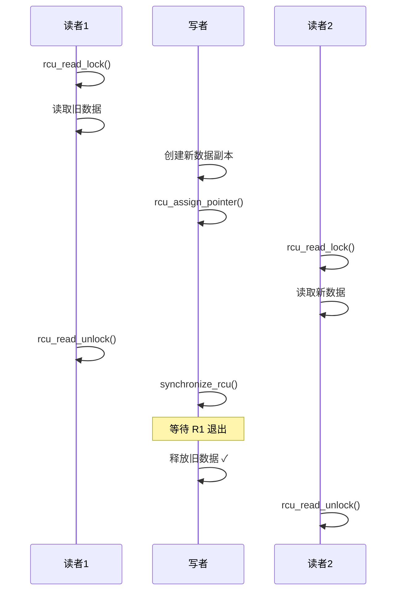
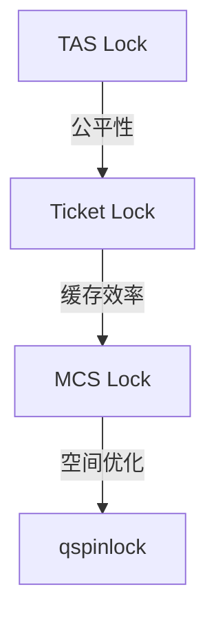

+++
title = "21.内核笔试题-同步机制"
date = 2026-01-31
description = "Linux内核同步机制笔试题：Spinlock实现、RCU原理、内存屏障、死锁分析"
[taxonomies]
tags = ["Linux", "内核", "笔试", "同步", "Spinlock", "RCU"]
+++

# Linux 内核笔试题 - 同步机制

本文汇集 Linux 内核同步机制相关的笔试真题，包括 Spinlock、RCU、内存屏障、死锁分析等内容。

**难度标注**：★☆☆ 基础 | ★★☆ 中级 | ★★★ 困难

---

## 一、选择题

### 题目 1 ★☆☆

以下哪种同步机制**可以**在中断上下文中使用？

A. mutex  
B. semaphore  
C. spinlock  
D. completion

<details>
<summary>查看答案与解析</summary>

**答案：C**

**解析**：

| 机制 | 可睡眠 | 中断上下文 | 说明 |
|------|--------|------------|------|
| mutex | ✅ | ❌ | 获取失败会睡眠 |
| semaphore | ✅ | ❌ | down() 可能睡眠 |
| spinlock | ❌ | ✅ | 忙等待，不睡眠 |
| completion | ✅ | ❌ | wait_for_completion() 睡眠 |

**中断上下文特点**：
- 没有进程上下文
- 不能被调度
- 不能睡眠

如果在中断中使用 mutex，获取失败时会尝试睡眠，但中断无法被调度，导致系统死锁。

</details>

---

### 题目 2 ★★☆

关于 RCU（Read-Copy-Update）的描述，**正确**的是：

A. 读者需要获取锁  
B. 写者修改数据后立即释放旧数据  
C. 标准 RCU 的读侧临界区可以睡眠  
D. 写者需要等待宽限期结束后才能释放旧数据

<details>
<summary>查看答案与解析</summary>

**答案：D**

**解析**：

- A 错误：RCU 读者无锁，只需 `rcu_read_lock()` 禁止抢占
- B 错误：必须等待宽限期（Grace Period）结束
- C 错误：标准 RCU 读侧不能睡眠（SRCU 可以）
- D 正确：这是 RCU 的核心机制



</details>

---

### 题目 3 ★★☆

以下代码有什么问题？

```c
spinlock_t lock;

void func() {
    spin_lock(&lock);
    void *p = kmalloc(1024, GFP_KERNEL);
    // use p
    spin_unlock(&lock);
}
```

A. 语法错误  
B. 可能导致死锁  
C. 内存泄漏  
D. 没有问题

<details>
<summary>查看答案与解析</summary>

**答案：B**

**解析**：

持有 spinlock 时使用 `GFP_KERNEL` 可能导致死锁：

```
1. spin_lock() 禁止抢占
2. GFP_KERNEL 允许内存回收（可能睡眠）
3. 睡眠需要调度，但抢占已禁止
4. 死锁！
```

**正确写法**：

```c
// 方案 1：使用 GFP_ATOMIC
spin_lock(&lock);
p = kmalloc(1024, GFP_ATOMIC);  // 不会睡眠
spin_unlock(&lock);

// 方案 2：锁外分配
p = kmalloc(1024, GFP_KERNEL);
spin_lock(&lock);
// use p
spin_unlock(&lock);
```

</details>

---

### 题目 4 ★★★

关于 Linux 内存屏障，以下描述**错误**的是：

A. `barrier()` 阻止编译器重排序  
B. `smp_mb()` 在单处理器系统上是空操作  
C. `smp_wmb()` 保证写操作的顺序  
D. 内存屏障可以保证操作的原子性

<details>
<summary>查看答案与解析</summary>

**答案：D**

**解析**：

- A 正确：`barrier()` 是编译器屏障，阻止编译器重排序
- B 正确：`smp_*` 屏障在 UP（单处理器）系统上通常是空操作或仅是编译器屏障
- C 正确：`smp_wmb()` 保证之前的写在之后的写之前完成
- D **错误**：内存屏障只保证顺序，不保证原子性

**内存屏障的作用**：
```c
// 内存屏障保证顺序
data = 42;
smp_wmb();     // 保证 data 写在 flag 之前
flag = 1;

// 原子性需要原子操作
atomic_set(&var, 42);      // 原子写
atomic_add(1, &var);       // 原子加
atomic_cmpxchg(&var, old, new);  // 原子 CAS
```

</details>

---

### 题目 5 ★★★

以下哪种锁的实现使用了本地自旋（local spinning）来减少缓存行争用？

A. Test-and-Set Lock  
B. Ticket Lock  
C. MCS Lock  
D. 简单 Spinlock

<details>
<summary>查看答案与解析</summary>

**答案：C**

**解析**：

| 锁类型 | 自旋位置 | 缓存行为 |
|--------|----------|----------|
| TAS Lock | 同一变量 | 严重抖动 |
| Ticket Lock | 同一变量 | 全局抖动 |
| MCS Lock | 本地节点 | 本地自旋 |
| qspinlock | 自适应 | 优化 |

**MCS Lock 原理**：

```c
struct mcs_node {
    struct mcs_node *next;
    int locked;  // 在此自旋
};

void mcs_lock(mcs_node_t **lock, mcs_node_t *node) {
    node->next = NULL;
    node->locked = 1;
    
    mcs_node_t *prev = atomic_xchg(lock, node);
    if (prev) {
        prev->next = node;
        while (node->locked)  // 本地自旋
            cpu_relax();
    }
}
```

每个 CPU 在自己的节点上自旋，避免缓存行在多个 CPU 间抖动。

</details>

---

## 二、填空题

### 题目 6 ★☆☆

Linux 内核中，在进程上下文获取 spinlock 时，如果临界区可能与中断处理程序共享数据，应该使用 ______ 或 ______ 来获取锁。

<details>
<summary>查看答案</summary>

**答案**：`spin_lock_irq()` 或 `spin_lock_irqsave()`

```c
// 场景：进程上下文和中断都访问 data

// 中断处理程序
irqreturn_t my_irq(int irq, void *dev) {
    spin_lock(&lock);      // 中断中不需要再禁止中断
    // 访问 data
    spin_unlock(&lock);
    return IRQ_HANDLED;
}

// 进程上下文
void process_func() {
    // 方案 1：不保存中断状态
    spin_lock_irq(&lock);  // 禁止中断 + 获取锁
    // 访问 data
    spin_unlock_irq(&lock);
    
    // 方案 2：保存中断状态（推荐）
    unsigned long flags;
    spin_lock_irqsave(&lock, flags);
    // 访问 data
    spin_unlock_irqrestore(&lock, flags);
}
```

**选择建议**：
- 确定中断是开的：`spin_lock_irq()`
- 不确定中断状态：`spin_lock_irqsave()`

</details>

---

### 题目 7 ★★☆

RCU 的三个核心 API 是：读者使用 ______ 和 ______ 标记临界区，写者使用 ______ 等待宽限期。

<details>
<summary>查看答案</summary>

**答案**：`rcu_read_lock()`、`rcu_read_unlock()`、`synchronize_rcu()`

```c
// 读者
rcu_read_lock();
ptr = rcu_dereference(global_ptr);
// 使用 ptr，期间 ptr 不会被释放
rcu_read_unlock();

// 写者
new_data = kmalloc(...);
// 填充 new_data
old_data = rcu_dereference(global_ptr);
rcu_assign_pointer(global_ptr, new_data);
synchronize_rcu();  // 等待所有读者退出
kfree(old_data);    // 安全释放

// 异步版本
call_rcu(&old_data->rcu_head, my_callback);
// my_callback 在宽限期后被调用
```

</details>

---

### 题目 8 ★★★

Ticket Lock 由两个计数器组成：______ 表示下一个票号，______ 表示当前服务的票号。获取锁时原子递增 ______ ，然后自旋等待直到 ______ 等于自己的票号。

<details>
<summary>查看答案</summary>

**答案**：next（或 tail）、owner（或 head）、next、owner

```c
typedef struct {
    atomic_t next;   // 下一个票号
    atomic_t owner;  // 当前服务的票号
} ticket_lock_t;

void ticket_lock(ticket_lock_t *lock) {
    // 1. 取号
    int my_ticket = atomic_fetch_add(&lock->next, 1);
    
    // 2. 等待叫号
    while (atomic_read(&lock->owner) != my_ticket)
        cpu_relax();
    
    // 3. 获得锁
}

void ticket_unlock(ticket_lock_t *lock) {
    // 叫下一个号
    atomic_add(&lock->owner, 1);
}
```

**特点**：
- FIFO 公平性
- 所有 CPU 在同一变量自旋（缓存行抖动）

</details>

---

### 题目 9 ★★★

Linux qspinlock 采用三级策略：无竞争时 ______ ，轻度竞争时使用 ______ 位自旋，重度竞争时进入 ______ 队列。

<details>
<summary>查看答案</summary>

**答案**：直接获取（CAS）、pending、MCS

```c
typedef struct qspinlock {
    union {
        atomic_t val;
        struct {
            u8 locked;     // 锁状态
            u8 pending;    // 等待标志
            u16 tail;      // MCS 队列尾
        };
    };
} arch_spinlock_t;

// 策略 1：无竞争 - 直接 CAS
if (atomic_try_cmpxchg(&lock->val, 0, 1))
    return;  // 成功

// 策略 2：轻度竞争 - pending 位自旋
if (try_set_pending(lock)) {
    while (lock->locked)
        cpu_relax();
    lock->locked = 1;
    clear_pending(lock);
    return;
}

// 策略 3：重度竞争 - MCS 队列
enqueue_mcs(lock);
// 在本地节点自旋
```

**优点**：仅 4 字节，自适应策略。

</details>

---

## 三、简答题

### 题目 10 ★★☆

解释为什么 RCU 读侧临界区开销极低。

<details>
<summary>参考答案</summary>

**RCU 读侧实现**：

```c
static inline void rcu_read_lock(void) {
    preempt_disable();
    // 可能还有一些调试代码
}

static inline void rcu_read_unlock(void) {
    preempt_enable();
}
```

**开销分析**：

| 操作 | RCU 读侧 | Spinlock | Mutex |
|------|----------|----------|-------|
| 原子操作 | ❌ 无 | ✅ 有 | ✅ 有 |
| 内存屏障 | ❌ 无 | ✅ 有 | ✅ 有 |
| 缓存争用 | ❌ 无 | ✅ 可能 | ✅ 可能 |
| 可能睡眠 | ❌ 无 | ❌ 无 | ✅ 可能 |

**为什么这么快**：

1. **无原子操作**：只修改本地 preempt_count
2. **无内存屏障**：读侧不需要同步
3. **无缓存争用**：不访问共享锁变量
4. **无阻塞**：不可能失败

**典型开销**：
- RCU 读侧：几个时钟周期
- Spinlock：几十到几百个时钟周期
- Mutex：可能数千个时钟周期

</details>

---

### 题目 11 ★★★

详细解释 spinlock 从 TAS 演进到 qspinlock 的过程和各自的优缺点。

<details>
<summary>参考答案</summary>

**演进过程**：



**1. TAS (Test-And-Set) Lock**

```c
void tas_lock(int *lock) {
    while (atomic_xchg(lock, 1) == 1)
        cpu_relax();
}
```

| 优点 | 缺点 |
|------|------|
| 实现简单 | 不公平，可能饿死 |
| 空间小（1字节） | 缓存行抖动严重 |

**2. Ticket Lock**

```c
void ticket_lock(ticket_lock_t *lock) {
    int ticket = atomic_fetch_add(&lock->next, 1);
    while (atomic_read(&lock->owner) != ticket)
        cpu_relax();
}
```

| 优点 | 缺点 |
|------|------|
| FIFO 公平 | 所有 CPU 同一变量自旋 |
| 实现较简单 | unlock 时缓存行失效波及所有等待者 |

**3. MCS Lock**

```c
void mcs_lock(mcs_node_t **lock, mcs_node_t *node) {
    node->next = NULL;
    node->locked = 1;
    mcs_node_t *prev = atomic_xchg(lock, node);
    if (prev) {
        prev->next = node;
        while (node->locked)  // 本地自旋
            cpu_relax();
    }
}
```

| 优点 | 缺点 |
|------|------|
| 本地自旋，无缓存抖动 | 每 CPU 需要一个节点 |
| FIFO 公平 | 实现复杂 |

**4. qspinlock**

```c
// 仅 4 字节，三级策略
typedef struct qspinlock {
    union {
        atomic_t val;
        struct {
            u8 locked;
            u8 pending;
            u16 tail;
        };
    };
} arch_spinlock_t;
```

| 优点 | 缺点 |
|------|------|
| 空间小（4字节） | 实现最复杂 |
| 自适应策略 | - |
| 无竞争时高效 | - |

</details>

---

## 四、计算题

### 题目 12 ★★☆

假设系统有 4 个 CPU，一个临界区执行时间为 100ns，无竞争获取锁开销 20ns，每次自旋迭代 5ns，上下文切换 3000ns。

计算：
1. 4 个 CPU 同时竞争 spinlock 的最坏等待时间
2. 对比使用 mutex 的情况

<details>
<summary>参考答案</summary>

**1. Spinlock 分析**：

```
最坏情况：4 个 CPU 同时尝试获取锁

CPU1：获取锁，执行 100ns
CPU2：自旋 100ns，获取锁，执行 100ns
CPU3：自旋 200ns，获取锁，执行 100ns
CPU4：自旋 300ns，获取锁，执行 100ns

各 CPU 等待时间：
CPU1: 20ns（获取开销）
CPU2: 20 + 100 = 120ns
CPU3: 20 + 200 = 220ns
CPU4: 20 + 300 = 320ns

平均等待：(20 + 120 + 220 + 320) / 4 = 170ns
总自旋时间：100 + 200 + 300 = 600ns
```

**2. Mutex 分析**：

```
CPU1：获取锁，执行 100ns
CPU2-4：获取失败，睡眠

CPU1 释放后：
- 唤醒 CPU2（3000ns 上下文切换）
- CPU2 执行 100ns
- 唤醒 CPU3...

总时间：
执行：4 × 100ns = 400ns
切换：3 × 3000ns = 9000ns
总计：9400ns

平均等待：约 2350ns
```

**对比**：

| 指标 | Spinlock | Mutex |
|------|----------|-------|
| 总时间 | ~680ns | ~9400ns |
| CPU 浪费 | 600ns 自旋 | 很少 |
| 适用场景 | 短临界区 | 长临界区 |

**结论**：
- 临界区 < 2×上下文切换 → 用 spinlock
- 本例：100ns << 3000ns → spinlock 更优

</details>

---

### 题目 13 ★★★

RCU 宽限期（Grace Period）分析。假设：
- 系统有 4 个 CPU
- 调度 tick 周期为 4ms
- 上下文切换时会检测静止状态

最坏情况下，`synchronize_rcu()` 需要等待多长时间？

<details>
<summary>参考答案</summary>

**宽限期机制**：

```
宽限期结束条件：所有 CPU 都经历了静止状态（Quiescent State）

静止状态包括：
1. 用户态执行
2. CPU 空闲
3. 上下文切换
```

**最坏情况分析**：

```
假设某个 CPU 刚进入 RCU 读侧临界区：

rcu_read_lock();
// 开始长时间计算...

这个 CPU 需要：
1. 执行完当前代码
2. 进入静止状态（调度、中断返回用户态等）

最坏情况：
- CPU 在内核中执行不可抢占的长任务
- 需要等待下一次调度 tick
- 每个 CPU 最多等待一个 tick 周期

最坏等待时间 ≈ tick 周期 = 4ms
```

**实际优化**：

```c
// Linux 使用多种机制加速：

1. 调度器回调
   // 上下文切换时检测
   schedule() → rcu_note_context_switch()

2. 空闲检测
   // CPU 空闲时检测
   cpu_idle() → rcu_idle_enter()

3. 用户态检测
   // 返回用户态时检测
   syscall_return → rcu_user_enter()

4. NO_HZ 模式
   // 无 tick 时主动上报
   tick_nohz_idle_enter() → rcu_idle_enter()
```

**典型延迟**：
- 轻负载系统：几十微秒
- 重负载系统：几毫秒
- 最坏情况：一个 tick 周期

</details>

---

## 五、编程题

### 题目 14 ★★☆

实现一个 Ticket Lock。

<details>
<summary>参考答案</summary>

```c
#include <stdatomic.h>
#include <stdbool.h>

typedef struct {
    atomic_uint next;   // 下一个票号
    atomic_uint owner;  // 当前服务的票号
} ticket_spinlock_t;

#define TICKET_SPINLOCK_INIT { ATOMIC_VAR_INIT(0), ATOMIC_VAR_INIT(0) }

// 获取锁
static inline void ticket_spin_lock(ticket_spinlock_t *lock) {
    // 原子获取票号
    unsigned int my_ticket = atomic_fetch_add_explicit(
        &lock->next, 1, memory_order_relaxed);
    
    // 自旋等待
    while (atomic_load_explicit(&lock->owner, memory_order_acquire)
           != my_ticket) {
        // CPU 放松指令
        #if defined(__x86_64__)
        __asm__ volatile("pause" ::: "memory");
        #elif defined(__aarch64__)
        __asm__ volatile("yield" ::: "memory");
        #endif
    }
    // 此时持有锁，acquire 保证后续读取看到最新数据
}

// 释放锁
static inline void ticket_spin_unlock(ticket_spinlock_t *lock) {
    // 叫下一个号
    atomic_fetch_add_explicit(&lock->owner, 1, memory_order_release);
}

// 尝试获取锁
static inline bool ticket_spin_trylock(ticket_spinlock_t *lock) {
    unsigned int next = atomic_load_explicit(&lock->next, memory_order_relaxed);
    unsigned int owner = atomic_load_explicit(&lock->owner, memory_order_relaxed);
    
    // 只有当 next == owner 时才可能成功
    if (next != owner)
        return false;
    
    // 尝试 CAS
    return atomic_compare_exchange_strong_explicit(
        &lock->next, &next, next + 1,
        memory_order_acquire, memory_order_relaxed);
}

// 测试
#include <pthread.h>
#include <stdio.h>

ticket_spinlock_t lock = TICKET_SPINLOCK_INIT;
int counter = 0;

void *worker(void *arg) {
    int id = *(int*)arg;
    for (int i = 0; i < 100000; i++) {
        ticket_spin_lock(&lock);
        counter++;
        ticket_spin_unlock(&lock);
    }
    printf("Thread %d done\n", id);
    return NULL;
}

int main() {
    pthread_t threads[4];
    int ids[4] = {0, 1, 2, 3};
    
    for (int i = 0; i < 4; i++)
        pthread_create(&threads[i], NULL, worker, &ids[i]);
    
    for (int i = 0; i < 4; i++)
        pthread_join(threads[i], NULL);
    
    printf("Counter: %d (expected: 400000)\n", counter);
    return 0;
}
```

</details>

---

### 题目 15 ★★★

实现一个简化的 RCU 机制，包括读侧 API 和写侧同步。

<details>
<summary>参考答案</summary>

```c
#include <stdatomic.h>
#include <stdbool.h>
#include <stdlib.h>
#include <pthread.h>
#include <stdio.h>

// 简化 RCU：基于全局计数器
// 注意：实际 Linux RCU 使用 per-CPU 计数和更复杂的机制

typedef struct {
    atomic_ulong version;        // 全局版本号
    atomic_uint readers;         // 读者计数
    pthread_mutex_t write_lock;  // 写者互斥
} simple_rcu_t;

#define SIMPLE_RCU_INIT { \
    .version = ATOMIC_VAR_INIT(0), \
    .readers = ATOMIC_VAR_INIT(0), \
    .write_lock = PTHREAD_MUTEX_INITIALIZER \
}

// 读侧 API
typedef struct {
    unsigned long start_version;
} rcu_read_lock_t;

static inline rcu_read_lock_t rcu_read_lock(simple_rcu_t *rcu) {
    rcu_read_lock_t lock;
    
    // 增加读者计数
    atomic_fetch_add(&rcu->readers, 1);
    
    // 记录进入时的版本
    lock.start_version = atomic_load(&rcu->version);
    
    // acquire 屏障确保后续读取看到最新数据
    atomic_thread_fence(memory_order_acquire);
    
    return lock;
}

static inline void rcu_read_unlock(simple_rcu_t *rcu, rcu_read_lock_t *lock) {
    // release 屏障确保读操作完成
    atomic_thread_fence(memory_order_release);
    
    // 减少读者计数
    atomic_fetch_sub(&rcu->readers, 1);
}

// 写侧 API
static inline void rcu_write_lock(simple_rcu_t *rcu) {
    pthread_mutex_lock(&rcu->write_lock);
}

static inline void rcu_write_unlock(simple_rcu_t *rcu) {
    pthread_mutex_unlock(&rcu->write_lock);
}

// 等待宽限期
static inline void synchronize_rcu(simple_rcu_t *rcu) {
    // 增加版本号
    unsigned long old_version = atomic_fetch_add(&rcu->version, 1);
    
    // 等待所有读者退出
    // 简化实现：等待 readers 变为 0
    while (atomic_load(&rcu->readers) > 0) {
        // 实际实现会更精细，只等待旧版本的读者
        sched_yield();
    }
    
    // 全屏障
    atomic_thread_fence(memory_order_seq_cst);
}

// RCU 保护的指针操作
#define rcu_dereference(p) ({                     \
    __typeof__(p) _p = (p);                       \
    atomic_thread_fence(memory_order_consume);    \
    _p;                                           \
})

#define rcu_assign_pointer(p, v) do {             \
    atomic_thread_fence(memory_order_release);    \
    (p) = (v);                                    \
} while (0)

// 使用示例
simple_rcu_t my_rcu = SIMPLE_RCU_INIT;

struct data {
    int value;
};

struct data *global_data = NULL;

void *reader(void *arg) {
    for (int i = 0; i < 1000000; i++) {
        rcu_read_lock_t lock = rcu_read_lock(&my_rcu);
        
        struct data *p = rcu_dereference(global_data);
        if (p) {
            // 读取数据
            volatile int v = p->value;
            (void)v;
        }
        
        rcu_read_unlock(&my_rcu, &lock);
    }
    return NULL;
}

void *writer(void *arg) {
    for (int i = 0; i < 1000; i++) {
        // 分配新数据
        struct data *new_data = malloc(sizeof(struct data));
        new_data->value = i;
        
        rcu_write_lock(&my_rcu);
        
        // 保存旧数据
        struct data *old_data = global_data;
        
        // 原子替换
        rcu_assign_pointer(global_data, new_data);
        
        rcu_write_unlock(&my_rcu);
        
        // 等待宽限期
        synchronize_rcu(&my_rcu);
        
        // 释放旧数据
        free(old_data);
    }
    return NULL;
}

int main() {
    pthread_t readers[4], w;
    
    // 初始化
    global_data = malloc(sizeof(struct data));
    global_data->value = 0;
    
    // 启动读者
    for (int i = 0; i < 4; i++)
        pthread_create(&readers[i], NULL, reader, NULL);
    
    // 启动写者
    pthread_create(&w, NULL, writer, NULL);
    
    // 等待完成
    for (int i = 0; i < 4; i++)
        pthread_join(readers[i], NULL);
    pthread_join(w, NULL);
    
    printf("RCU test completed\n");
    return 0;
}
```

</details>

---

### 题目 16 ★★★

使用 C11 原子操作和内存屏障，实现一个无锁 SPSC（单生产者单消费者）队列。

<details>
<summary>参考答案</summary>

```c
#include <stdatomic.h>
#include <stdbool.h>
#include <stddef.h>
#include <stdlib.h>
#include <stdio.h>
#include <pthread.h>

#define QUEUE_SIZE 1024  // 必须是 2 的幂
#define QUEUE_MASK (QUEUE_SIZE - 1)

typedef struct {
    void *buffer[QUEUE_SIZE];
    
    // 缓存行对齐，避免伪共享
    _Alignas(64) atomic_size_t head;  // 消费者读取位置
    _Alignas(64) atomic_size_t tail;  // 生产者写入位置
} spsc_queue_t;

void spsc_init(spsc_queue_t *q) {
    atomic_init(&q->head, 0);
    atomic_init(&q->tail, 0);
    for (size_t i = 0; i < QUEUE_SIZE; i++)
        q->buffer[i] = NULL;
}

// 生产者入队
bool spsc_enqueue(spsc_queue_t *q, void *data) {
    size_t tail = atomic_load_explicit(&q->tail, memory_order_relaxed);
    size_t next_tail = (tail + 1) & QUEUE_MASK;
    
    // 检查队列是否满
    size_t head = atomic_load_explicit(&q->head, memory_order_acquire);
    if (next_tail == head) {
        return false;  // 队列满
    }
    
    // 写入数据
    q->buffer[tail] = data;
    
    // 发布新的 tail
    // release 保证 buffer 写入在 tail 更新之前对消费者可见
    atomic_store_explicit(&q->tail, next_tail, memory_order_release);
    
    return true;
}

// 消费者出队
void *spsc_dequeue(spsc_queue_t *q) {
    size_t head = atomic_load_explicit(&q->head, memory_order_relaxed);
    
    // 检查队列是否空
    // acquire 保证看到生产者写入的最新数据
    size_t tail = atomic_load_explicit(&q->tail, memory_order_acquire);
    if (head == tail) {
        return NULL;  // 队列空
    }
    
    // 读取数据
    void *data = q->buffer[head];
    
    // 更新 head
    // release 保证 buffer 读取在 head 更新之前完成
    atomic_store_explicit(&q->head, (head + 1) & QUEUE_MASK,
                          memory_order_release);
    
    return data;
}

// 查询队列大小
size_t spsc_size(spsc_queue_t *q) {
    size_t head = atomic_load_explicit(&q->head, memory_order_relaxed);
    size_t tail = atomic_load_explicit(&q->tail, memory_order_relaxed);
    return (tail - head) & QUEUE_MASK;
}

// 测试
#define NUM_ITEMS 10000000

spsc_queue_t queue;
atomic_bool done = ATOMIC_VAR_INIT(false);

void *producer(void *arg) {
    for (size_t i = 1; i <= NUM_ITEMS; i++) {
        while (!spsc_enqueue(&queue, (void*)i)) {
            // 队列满，自旋
            #if defined(__x86_64__)
            __asm__ volatile("pause");
            #endif
        }
    }
    atomic_store(&done, true);
    return NULL;
}

void *consumer(void *arg) {
    size_t count = 0;
    size_t sum = 0;
    
    while (count < NUM_ITEMS) {
        void *data = spsc_dequeue(&queue);
        if (data) {
            sum += (size_t)data;
            count++;
        } else if (atomic_load(&done) && spsc_size(&queue) == 0) {
            break;
        }
    }
    
    printf("Consumed %zu items, sum = %zu\n", count, sum);
    printf("Expected sum = %zu\n", (size_t)NUM_ITEMS * (NUM_ITEMS + 1) / 2);
    return NULL;
}

int main() {
    spsc_init(&queue);
    
    pthread_t p, c;
    pthread_create(&p, NULL, producer, NULL);
    pthread_create(&c, NULL, consumer, NULL);
    
    pthread_join(p, NULL);
    pthread_join(c, NULL);
    
    return 0;
}
```

</details>

---

## 六、Bug 分析题

### 题目 17 ★★☆

以下代码可能导致死锁，分析原因并修复。

```c
DEFINE_SPINLOCK(lock_a);
DEFINE_SPINLOCK(lock_b);

void thread_1(void) {
    spin_lock(&lock_a);
    spin_lock(&lock_b);
    // 临界区
    spin_unlock(&lock_b);
    spin_unlock(&lock_a);
}

void thread_2(void) {
    spin_lock(&lock_b);
    spin_lock(&lock_a);
    // 临界区
    spin_unlock(&lock_a);
    spin_unlock(&lock_b);
}
```

<details>
<summary>查看答案与解析</summary>

**问题**：ABBA 死锁

```
Thread 1               Thread 2
--------               --------
lock(A) ✓
                       lock(B) ✓
lock(B) 自旋...
                       lock(A) 自旋...
死锁！
```

**修复方案**：

```c
// 方案 1：固定加锁顺序（推荐）
void thread_1(void) {
    spin_lock(&lock_a);  // 先 A
    spin_lock(&lock_b);  // 后 B
    // 临界区
    spin_unlock(&lock_b);
    spin_unlock(&lock_a);
}

void thread_2(void) {
    spin_lock(&lock_a);  // 先 A（改变顺序）
    spin_lock(&lock_b);  // 后 B
    // 临界区
    spin_unlock(&lock_b);
    spin_unlock(&lock_a);
}

// 方案 2：trylock + 回退
void thread_2_v2(void) {
retry:
    spin_lock(&lock_b);
    if (!spin_trylock(&lock_a)) {
        spin_unlock(&lock_b);
        cpu_relax();
        goto retry;
    }
    // 临界区
    spin_unlock(&lock_a);
    spin_unlock(&lock_b);
}

// 方案 3：锁排序函数
void lock_pair(spinlock_t *a, spinlock_t *b) {
    if (a < b) {
        spin_lock(a);
        spin_lock(b);
    } else {
        spin_lock(b);
        spin_lock(a);
    }
}
```

</details>

---

### 题目 18 ★★★

以下中断处理代码有问题，分析并修复。

```c
DEFINE_SPINLOCK(lock);
struct data *shared_data;

irqreturn_t my_irq_handler(int irq, void *dev) {
    spin_lock(&lock);
    process(shared_data);
    spin_unlock(&lock);
    return IRQ_HANDLED;
}

void user_func(void) {
    spin_lock(&lock);
    update(shared_data);
    spin_unlock(&lock);
}
```

<details>
<summary>查看答案与解析</summary>

**问题**：进程上下文持有锁时可能被中断抢占，导致死锁。

```
1. user_func() 获取 lock
2. 中断发生
3. my_irq_handler() 尝试获取 lock
4. 死锁！（中断无法返回，user_func 无法释放锁）
```

**修复方案**：

```c
DEFINE_SPINLOCK(lock);
struct data *shared_data;

// 中断处理程序（不变）
irqreturn_t my_irq_handler(int irq, void *dev) {
    spin_lock(&lock);  // 中断中不需要禁止中断
    process(shared_data);
    spin_unlock(&lock);
    return IRQ_HANDLED;
}

// 方案 1：禁止中断（推荐）
void user_func_v1(void) {
    unsigned long flags;
    spin_lock_irqsave(&lock, flags);  // 禁止中断 + 获取锁
    update(shared_data);
    spin_unlock_irqrestore(&lock, flags);
}

// 方案 2：如果确定中断是开的
void user_func_v2(void) {
    spin_lock_irq(&lock);  // 禁止中断 + 获取锁
    update(shared_data);
    spin_unlock_irq(&lock);
}
```

**规则总结**：

| 竞争场景 | 进程上下文使用 |
|----------|----------------|
| 只与进程竞争 | `spin_lock()` |
| 与软中断竞争 | `spin_lock_bh()` |
| 与硬中断竞争 | `spin_lock_irq[save]()` |

</details>

---

## 七、高频考点总结

| 考点 | 频率 | 难度 | 关键知识 |
|------|------|------|----------|
| Spinlock 使用场景 | ★★★ | ★★☆ | 中断上下文、GFP_ATOMIC |
| RCU 原理 | ★★★ | ★★★ | 宽限期、读写分离 |
| 内存屏障 | ★★☆ | ★★★ | acquire-release、smp_*mb |
| 死锁分析 | ★★★ | ★★☆ | ABBA、中断死锁 |
| 锁的选择 | ★★★ | ★★☆ | spinlock vs mutex |
| qspinlock | ★★☆ | ★★★ | 三级策略 |
| 无锁编程 | ★★☆ | ★★★ | SPSC 队列、CAS |

---

## 相关文章

- [上一篇：内核笔试题-进程调度](/articles/linux/linux-20-内核笔试题-进程调度/)
- [下一篇：内核笔试题-中断与系统调用](/articles/linux/linux-22-内核笔试题-中断与系统调用/)

**知识基础**：
- [内核同步机制详解](/articles/linux/linux-18-内核同步机制详解/)
