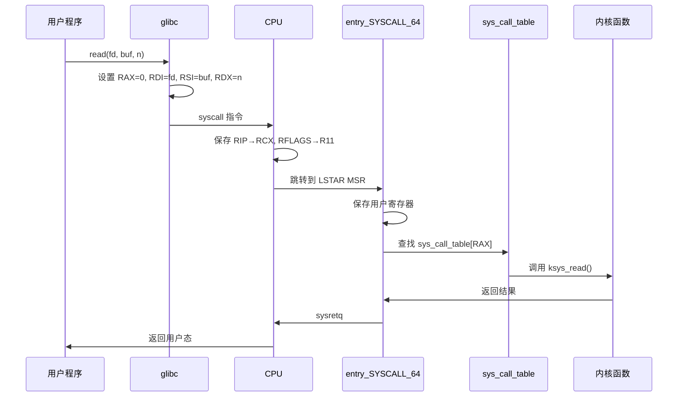
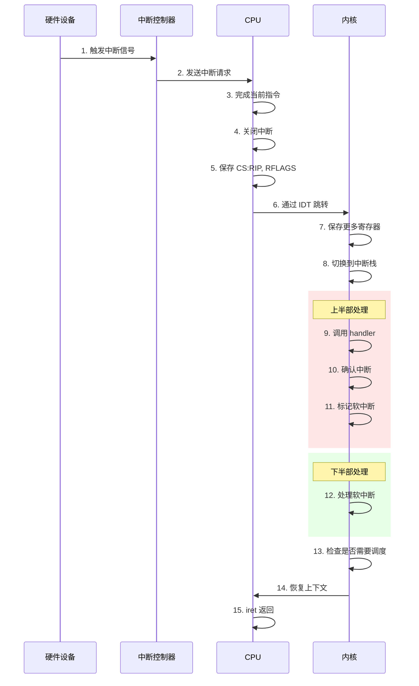
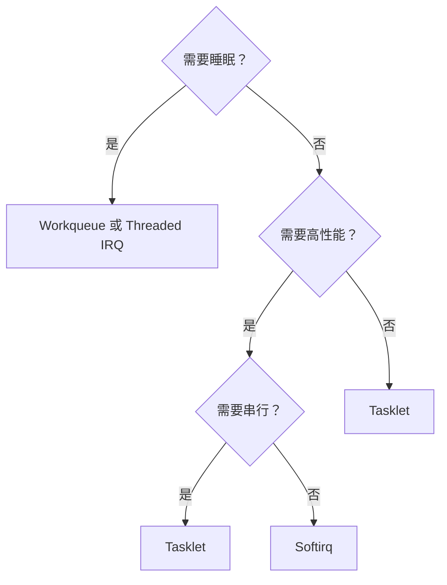

+++
title = "22.内核笔试题-中断与系统调用"
date = 2026-01-31
description = "Linux内核中断与系统调用笔试题：中断处理流程、下半部机制、syscall实现、vDSO"
[taxonomies]
tags = ["Linux", "内核", "笔试", "中断", "系统调用"]
+++

# Linux 内核笔试题 - 中断与系统调用

本文汇集 Linux 内核中断处理和系统调用相关的笔试真题，包括中断流程、上下半部、syscall 机制等内容。

**难度标注**：★☆☆ 基础 | ★★☆ 中级 | ★★★ 困难

---

## 一、选择题

### 题目 1 ★☆☆

Linux 中断下半部机制中，哪个**可以睡眠**？

A. Softirq  
B. Tasklet  
C. Workqueue  
D. 以上都不可以

<details>
<summary>查看答案与解析</summary>

**答案：C**

**解析**：

| 机制 | 执行上下文 | 可睡眠 | 并发性 |
|------|------------|--------|--------|
| Softirq | 软中断上下文 | ❌ | 多 CPU 并行 |
| Tasklet | 软中断上下文 | ❌ | 同类型串行 |
| Workqueue | 进程上下文 | ✅ | 可配置 |
| Threaded IRQ | 进程上下文 | ✅ | 每 IRQ 一线程 |

**Workqueue 为什么能睡眠**：
- 由内核线程（kworker）执行
- 有完整的进程上下文
- 可以被调度

</details>

---

### 题目 2 ★★☆

x86_64 系统调用使用的指令和寄存器，正确的是：

A. 使用 `int 0x80`，系统调用号在 EAX  
B. 使用 `syscall`，系统调用号在 RAX  
C. 使用 `sysenter`，系统调用号在 RBX  
D. 使用 `call`，系统调用号在 RDI

<details>
<summary>查看答案与解析</summary>

**答案：B**

**解析**：

| 架构/方式 | 指令 | 系统调用号 | 参数 |
|-----------|------|------------|------|
| i386 传统 | `int 0x80` | EAX | EBX,ECX,EDX,ESI,EDI,EBP |
| i386 快速 | `sysenter` | EAX | EBX,ECX,EDX,ESI,EDI,EBP |
| x86_64 | `syscall` | RAX | RDI,RSI,RDX,R10,R8,R9 |

**x86_64 syscall 约定**：
```c
// 系统调用号：RAX
// 参数：RDI, RSI, RDX, R10, R8, R9（最多 6 个）
// 返回值：RAX
// 会被修改：RCX（保存 RIP）、R11（保存 RFLAGS）
```

</details>

---

### 题目 3 ★★☆

关于中断上下文和进程上下文，**错误**的描述是：

A. 中断上下文没有对应的进程，不能睡眠  
B. 中断上下文的 `current` 指向被中断的进程  
C. 中断上下文可以访问被中断进程的用户空间  
D. 进程上下文可以被抢占调度

<details>
<summary>查看答案与解析</summary>

**答案：C**

**解析**：

| 特性 | 中断上下文 | 进程上下文 |
|------|------------|------------|
| 对应进程 | 无 | 有 |
| current | 被中断进程（借用） | 当前进程 |
| 可睡眠 | ❌ | ✅ |
| 可抢占 | ❌ | ✅ |
| 访问用户空间 | ❌ | ✅ |

**C 选项错误原因**：
- 中断可能发生在任何进程上下文
- 不能假定 `current` 是正确的用户空间
- 访问用户空间可能触发缺页，需要睡眠
- 中断上下文不能睡眠

</details>

---

### 题目 4 ★★★

关于 `request_threaded_irq()` 的描述，**正确**的是：

A. 中断处理完全在线程中执行  
B. 硬中断处理程序可以睡眠  
C. 线程处理程序在进程上下文执行，可以睡眠  
D. 不能与普通 `request_irq()` 共存

<details>
<summary>查看答案与解析</summary>

**答案：C**

**解析**：

```c
int request_threaded_irq(
    unsigned int irq,
    irq_handler_t handler,       // 硬中断处理（可选）
    irq_handler_t thread_fn,     // 线程处理
    unsigned long flags,
    const char *name,
    void *dev
);
```

**两阶段处理**：
1. **硬中断处理（handler）**：
   - 在硬中断上下文执行
   - 快速执行，确认中断
   - 返回 `IRQ_WAKE_THREAD` 唤醒线程
   - 不能睡眠

2. **线程处理（thread_fn）**：
   - 在内核线程中执行
   - 进程上下文，可以睡眠
   - 处理实际工作

```c
// 示例
static irqreturn_t my_hardirq(int irq, void *dev) {
    // 快速确认中断，禁止后续中断
    writel(0, dev->base + IRQ_ACK);
    return IRQ_WAKE_THREAD;
}

static irqreturn_t my_thread(int irq, void *dev) {
    // 可以睡眠
    mutex_lock(&dev->lock);
    process_data(dev);
    mutex_unlock(&dev->lock);
    return IRQ_HANDLED;
}

request_threaded_irq(irq, my_hardirq, my_thread, 
                     IRQF_ONESHOT, "my_dev", dev);
```

</details>

---

### 题目 5 ★★★

vDSO（virtual Dynamic Shared Object）的作用是：

A. 提供系统调用的用户态实现，避免内核切换  
B. 加载动态链接库  
C. 实现虚拟内存映射  
D. 处理信号

<details>
<summary>查看答案与解析</summary>

**答案：A**

**解析**：

vDSO 是内核映射到用户空间的特殊共享库，包含部分"系统调用"的用户态实现：

| 函数 | 传统方式 | vDSO 方式 |
|------|----------|-----------|
| gettimeofday | 陷入内核 | 直接读取映射数据 |
| clock_gettime | 陷入内核 | 直接读取映射数据 |
| getcpu | 陷入内核 | 读取 CPU 信息 |

**性能对比**：
```
传统 syscall：~100-200ns（陷入内核）
vDSO：~20-30ns（纯用户态）
```

**工作原理**：
```
1. 内核维护一个只读页面，包含时间戳等数据
2. 内核定期更新这些数据（定时器中断）
3. vDSO 代码直接读取这些数据
4. 无需真正进入内核
```

```bash
# 查看 vDSO
$ cat /proc/self/maps | grep vdso
7ffff7fca000-7ffff7fcc000 r-xp 00000000 00:00 0  [vdso]
```

</details>

---

## 二、填空题

### 题目 6 ★☆☆

x86 IDT（中断描述符表）包含 ______ 个条目，其中向量 ______ 到 ______ 是 CPU 异常，向量 ______ 传统用于系统调用。

<details>
<summary>查看答案</summary>

**答案**：256 个，0 到 31，128

**IDT 结构：**

| 向量范围 | 类型 | 说明 |
|----------|------|------|
| 0-31 | CPU 异常（预留） | |
| 0 | #DE | 除法错误 |
| 6 | #UD | 无效操作码 |
| 13 | #GP | 一般保护异常 |
| 14 | #PF | 缺页异常 |
| 32-47 | 传统 ISA 设备中断 | |
| 32 | IRQ0 | 定时器 |
| 33 | IRQ1 | 键盘 |
| 128 | 系统调用 | int 0x80 |
| 48-255 | 其他用途 | APIC、IPI 等 |

</details>

---

### 题目 7 ★★☆

Softirq 在 ______ 返回时和 ______ 中被执行。Linux 定义了 ______ 种 softirq，其中网络收包使用 ______ 。

<details>
<summary>查看答案</summary>

**答案**：硬中断返回时，ksoftirqd 内核线程中，10 种，NET_RX_SOFTIRQ

```c
// 定义的 softirq 类型
enum {
    HI_SOFTIRQ=0,           // 高优先级 tasklet
    TIMER_SOFTIRQ,          // 定时器
    NET_TX_SOFTIRQ,         // 网络发送
    NET_RX_SOFTIRQ,         // 网络接收
    BLOCK_SOFTIRQ,          // 块设备
    IRQ_POLL_SOFTIRQ,       // IRQ 轮询
    TASKLET_SOFTIRQ,        // 普通 tasklet
    SCHED_SOFTIRQ,          // 调度器
    HRTIMER_SOFTIRQ,        // 高精度定时器
    RCU_SOFTIRQ,            // RCU
    NR_SOFTIRQS             // 总数 = 10
};
```

**执行时机**：
1. 硬中断返回前（`irq_exit()`）
2. `ksoftirqd` 内核线程
3. 显式调用 `local_bh_enable()`

</details>

---

### 题目 8 ★★★

系统调用从用户态到内核态的完整路径是：用户调用 libc 函数 → ______ 指令 → CPU 跳转到 ______ → 保存寄存器 → 查找 ______ → 执行内核函数。

<details>
<summary>查看答案</summary>

**答案**：syscall（或 int 0x80），entry_SYSCALL_64（或系统调用入口），sys_call_table（系统调用表）



</details>

---

## 三、简答题

### 题目 9 ★★☆

简述 Linux 中断处理的完整流程。

<details>
<summary>参考答案</summary>



**关键步骤说明**：

1. **硬件触发**：设备完成操作，触发中断
2. **CPU 响应**：完成当前指令，关闭中断
3. **保存上下文**：CS:RIP, RFLAGS 压栈
4. **查 IDT**：根据中断向量找到处理程序
5. **上半部**：快速处理，不能睡眠
6. **下半部**：延迟处理，可以更复杂
7. **返回**：恢复上下文，继续执行

</details>

---

### 题目 10 ★★★

解释 Softirq、Tasklet、Workqueue 的区别和使用场景。

<details>
<summary>参考答案</summary>

**对比表**：

| 特性 | Softirq | Tasklet | Workqueue |
|------|---------|---------|-----------|
| 执行上下文 | 软中断 | 软中断 | 进程（kworker） |
| 可睡眠 | ❌ | ❌ | ✅ |
| 并发性 | 多 CPU 并行 | 同类型串行 | 可配置 |
| 定义方式 | 静态（编译时） | 动态 | 动态 |
| 数量限制 | 10 种固定 | 无限制 | 无限制 |
| 使用复杂度 | 高 | 中 | 低 |

**使用场景**：

```c
// Softirq：高性能场景，如网络栈
// 需要静态定义，内核开发者使用
open_softirq(NET_RX_SOFTIRQ, net_rx_action);
raise_softirq(NET_RX_SOFTIRQ);

// Tasklet：驱动中常用的下半部
// 动态创建，同一 tasklet 不会并发执行
DECLARE_TASKLET(my_tasklet, my_func, data);
tasklet_schedule(&my_tasklet);

// Workqueue：需要睡眠的下半部
// 可以使用 mutex、等待 IO 等
DECLARE_WORK(my_work, my_work_func);
schedule_work(&my_work);

// Threaded IRQ：现代驱动推荐
// 中断线程化，实时性好
request_threaded_irq(irq, hardirq, thread_fn, flags, name, dev);
```

**选择指南**：



</details>

---

## 四、计算题

### 题目 11 ★★☆

假设一个系统调用的开销分解如下：

| 阶段 | 开销 |
|------|------|
| 用户态准备（设置寄存器） | 5ns |
| syscall 指令 | 50ns |
| 内核入口处理 | 30ns |
| 实际系统调用执行 | 100ns |
| 内核返回处理 | 30ns |
| sysretq 指令 | 50ns |

计算：
1. 一次完整系统调用的总开销
2. 如果改用 vDSO（只需 20ns），性能提升多少倍？

<details>
<summary>参考答案</summary>

**1. 传统系统调用总开销**：

```
总开销 = 5 + 50 + 30 + 100 + 30 + 50 = 265ns

开销分解：
- 用户态开销：5ns (1.9%)
- 切换开销：50 + 30 + 30 + 50 = 160ns (60.4%)
- 实际执行：100ns (37.7%)
```

**2. vDSO 性能提升**：

```
vDSO 开销 = 20ns
传统开销 = 265ns

提升倍数 = 265 / 20 = 13.25 倍

注意：vDSO 只适用于特定系统调用（如 gettimeofday）
对于需要真正内核操作的调用（如 read/write），无法使用 vDSO
```

**系统调用优化建议**：
- 批量操作：减少调用次数
- 使用 vDSO：时间相关操作
- 避免频繁小调用：如小块 read/write

</details>

---

### 题目 12 ★★★

一个网卡驱动使用 NAPI 处理接收中断。假设：
- 硬中断开销：500ns
- 每个包处理开销：200ns
- NAPI 轮询批量大小：64 个包

对比传统中断方式（每包一个中断）和 NAPI 方式处理 1000 个包的总开销。

<details>
<summary>参考答案</summary>

**传统中断方式**：

```
每个包：1 次硬中断 + 处理
总开销 = 1000 × (500 + 200) = 700,000ns = 700μs

中断次数：1000 次
```

**NAPI 方式**：

```
中断次数 = ceil(1000 / 64) = 16 次
处理开销 = 1000 × 200 = 200,000ns

总开销 = 16 × 500 + 200,000 = 8,000 + 200,000 = 208,000ns = 208μs
```

**对比**：

| 方式 | 中断次数 | 总开销 | 吞吐量 |
|------|----------|--------|--------|
| 传统 | 1000 | 700μs | 1.43M pps |
| NAPI | 16 | 208μs | 4.81M pps |

**性能提升**：700 / 208 ≈ 3.37 倍

**NAPI 原理**：
```
1. 第一个包到达，触发硬中断
2. 硬中断处理程序：
   - 禁用该中断源
   - 调度 NAPI 轮询
3. NAPI 轮询：
   - 批量处理包（软中断上下文）
   - 直到队列空或达到配额
4. 重新启用中断
```

</details>

---

## 五、编程题

### 题目 13 ★★☆

实现一个简单的中断处理框架，包括注册中断和触发中断。

<details>
<summary>参考答案</summary>

```c
#include <stdio.h>
#include <stdlib.h>
#include <stdbool.h>
#include <signal.h>
#include <string.h>

#define MAX_IRQ 256

// 中断处理程序类型
typedef enum {
    IRQ_NONE,
    IRQ_HANDLED,
    IRQ_WAKE_THREAD
} irqreturn_t;

typedef irqreturn_t (*irq_handler_t)(int irq, void *dev);

// 中断描述符
typedef struct {
    irq_handler_t handler;
    irq_handler_t thread_fn;
    void *dev;
    const char *name;
    bool enabled;
    unsigned long count;
} irq_desc_t;

// 全局中断描述符表
static irq_desc_t irq_descs[MAX_IRQ];

// 待处理的软中断
static unsigned long softirq_pending = 0;

// 初始化
void irq_init(void) {
    memset(irq_descs, 0, sizeof(irq_descs));
}

// 注册中断
int request_irq(int irq, irq_handler_t handler, 
                const char *name, void *dev) {
    if (irq < 0 || irq >= MAX_IRQ)
        return -1;
    
    if (irq_descs[irq].handler)
        return -1;  // 已注册
    
    irq_descs[irq].handler = handler;
    irq_descs[irq].dev = dev;
    irq_descs[irq].name = name;
    irq_descs[irq].enabled = true;
    irq_descs[irq].count = 0;
    
    printf("IRQ %d registered: %s\n", irq, name);
    return 0;
}

// 注册线程化中断
int request_threaded_irq(int irq, 
                         irq_handler_t handler,
                         irq_handler_t thread_fn,
                         const char *name, void *dev) {
    int ret = request_irq(irq, handler, name, dev);
    if (ret == 0) {
        irq_descs[irq].thread_fn = thread_fn;
    }
    return ret;
}

// 释放中断
void free_irq(int irq) {
    if (irq >= 0 && irq < MAX_IRQ) {
        memset(&irq_descs[irq], 0, sizeof(irq_desc_t));
        printf("IRQ %d freed\n", irq);
    }
}

// 禁用中断
void disable_irq(int irq) {
    if (irq >= 0 && irq < MAX_IRQ) {
        irq_descs[irq].enabled = false;
    }
}

// 启用中断
void enable_irq(int irq) {
    if (irq >= 0 && irq < MAX_IRQ) {
        irq_descs[irq].enabled = true;
    }
}

// 模拟硬中断处理
void do_IRQ(int irq) {
    if (irq < 0 || irq >= MAX_IRQ)
        return;
    
    irq_desc_t *desc = &irq_descs[irq];
    
    if (!desc->handler || !desc->enabled)
        return;
    
    desc->count++;
    
    printf("[IRQ %d] Handling interrupt...\n", irq);
    
    // 调用硬中断处理程序
    irqreturn_t ret = desc->handler(irq, desc->dev);
    
    switch (ret) {
    case IRQ_HANDLED:
        printf("[IRQ %d] Handled\n", irq);
        break;
    case IRQ_WAKE_THREAD:
        if (desc->thread_fn) {
            printf("[IRQ %d] Waking thread...\n", irq);
            // 模拟线程执行
            desc->thread_fn(irq, desc->dev);
        }
        break;
    case IRQ_NONE:
        printf("[IRQ %d] Not handled\n", irq);
        break;
    }
}

// 触发软中断
void raise_softirq(int nr) {
    softirq_pending |= (1UL << nr);
}

// 处理软中断
void do_softirq(void) {
    while (softirq_pending) {
        for (int i = 0; i < 32; i++) {
            if (softirq_pending & (1UL << i)) {
                printf("[SOFTIRQ %d] Processing...\n", i);
                softirq_pending &= ~(1UL << i);
            }
        }
    }
}

// 模拟中断返回
void irq_exit(void) {
    // 中断返回时处理软中断
    if (softirq_pending) {
        do_softirq();
    }
}

// 测试设备
struct my_device {
    int id;
    int data;
};

// 示例硬中断处理程序
irqreturn_t my_hardirq(int irq, void *dev) {
    struct my_device *mydev = dev;
    printf("  Hard IRQ: device %d\n", mydev->id);
    
    // 读取数据，清除中断
    mydev->data = irq * 100;
    
    // 请求软中断处理
    raise_softirq(0);
    
    return IRQ_WAKE_THREAD;
}

// 示例线程处理程序
irqreturn_t my_thread(int irq, void *dev) {
    struct my_device *mydev = dev;
    printf("  Thread: processing device %d, data=%d\n", 
           mydev->id, mydev->data);
    return IRQ_HANDLED;
}

int main() {
    irq_init();
    
    struct my_device dev1 = {.id = 1};
    struct my_device dev2 = {.id = 2};
    
    // 注册中断
    request_threaded_irq(10, my_hardirq, my_thread, "eth0", &dev1);
    request_irq(11, my_hardirq, "uart0", &dev2);
    
    printf("\n--- Simulating interrupts ---\n\n");
    
    // 模拟中断
    do_IRQ(10);
    irq_exit();
    
    printf("\n");
    
    do_IRQ(11);
    irq_exit();
    
    // 清理
    free_irq(10);
    free_irq(11);
    
    return 0;
}
```

</details>

---

### 题目 14 ★★★

实现一个简化的系统调用分发器。

<details>
<summary>参考答案</summary>

```c
#include <stdio.h>
#include <stdint.h>
#include <string.h>

#define NR_SYSCALLS 256

// 系统调用参数结构
typedef struct {
    uint64_t nr;      // 系统调用号
    uint64_t arg1;    // 参数 1
    uint64_t arg2;    // 参数 2
    uint64_t arg3;    // 参数 3
    uint64_t arg4;    // 参数 4
    uint64_t arg5;    // 参数 5
    uint64_t arg6;    // 参数 6
} syscall_args_t;

// 系统调用函数类型
typedef long (*sys_call_t)(syscall_args_t *args);

// 系统调用表
static sys_call_t sys_call_table[NR_SYSCALLS];
static const char *syscall_names[NR_SYSCALLS];

// 注册系统调用
void register_syscall(int nr, sys_call_t handler, const char *name) {
    if (nr >= 0 && nr < NR_SYSCALLS) {
        sys_call_table[nr] = handler;
        syscall_names[nr] = name;
    }
}

// 系统调用分发
long do_syscall(syscall_args_t *args) {
    uint64_t nr = args->nr;
    
    // 检查系统调用号
    if (nr >= NR_SYSCALLS || !sys_call_table[nr]) {
        printf("Unknown syscall: %lu\n", nr);
        return -1;  // -ENOSYS
    }
    
    printf("Syscall [%lu] %s\n", nr, syscall_names[nr]);
    
    // 调用处理程序
    return sys_call_table[nr](args);
}

// 模拟用户态系统调用接口
long syscall(uint64_t nr, ...) {
    syscall_args_t args = {0};
    args.nr = nr;
    
    // 简化：使用 va_list 获取参数
    // 实际上 x86_64 使用寄存器传参
    
    return do_syscall(&args);
}

// ========== 示例系统调用实现 ==========

// sys_read
long sys_read(syscall_args_t *args) {
    int fd = args->arg1;
    char *buf = (char *)args->arg2;
    size_t count = args->arg3;
    
    printf("  read(fd=%d, buf=%p, count=%zu)\n", fd, buf, count);
    
    // 模拟读取
    if (buf && count > 0) {
        strncpy(buf, "Hello from kernel!", count);
        return strlen(buf);
    }
    return -1;
}

// sys_write
long sys_write(syscall_args_t *args) {
    int fd = args->arg1;
    const char *buf = (const char *)args->arg2;
    size_t count = args->arg3;
    
    printf("  write(fd=%d, buf=\"%.*s\", count=%zu)\n", 
           fd, (int)count, buf, count);
    
    return count;
}

// sys_open
long sys_open(syscall_args_t *args) {
    const char *path = (const char *)args->arg1;
    int flags = args->arg2;
    int mode = args->arg3;
    
    printf("  open(path=\"%s\", flags=%d, mode=%o)\n", path, flags, mode);
    
    // 返回模拟的 fd
    return 3;
}

// sys_close
long sys_close(syscall_args_t *args) {
    int fd = args->arg1;
    
    printf("  close(fd=%d)\n", fd);
    
    return 0;
}

// sys_getpid
long sys_getpid(syscall_args_t *args) {
    printf("  getpid()\n");
    return 1234;  // 模拟 PID
}

// sys_gettimeofday (可以通过 vDSO 优化)
long sys_gettimeofday(syscall_args_t *args) {
    struct {
        long tv_sec;
        long tv_usec;
    } *tv = (void *)args->arg1;
    
    printf("  gettimeofday(tv=%p)\n", tv);
    
    if (tv) {
        tv->tv_sec = 1706745600;  // 模拟时间戳
        tv->tv_usec = 123456;
    }
    
    return 0;
}

// 初始化系统调用表
void init_syscall_table(void) {
    memset(sys_call_table, 0, sizeof(sys_call_table));
    memset(syscall_names, 0, sizeof(syscall_names));
    
    // 注册系统调用（编号参考 Linux x86_64）
    register_syscall(0, sys_read, "read");
    register_syscall(1, sys_write, "write");
    register_syscall(2, sys_open, "open");
    register_syscall(3, sys_close, "close");
    register_syscall(39, sys_getpid, "getpid");
    register_syscall(96, sys_gettimeofday, "gettimeofday");
}

int main() {
    init_syscall_table();
    
    printf("=== Syscall Dispatcher Demo ===\n\n");
    
    // 模拟系统调用
    char buf[64];
    syscall_args_t args;
    
    // read(0, buf, 64)
    args = (syscall_args_t){.nr = 0, .arg1 = 0, .arg2 = (uint64_t)buf, .arg3 = 64};
    long ret = do_syscall(&args);
    printf("  -> returned %ld, buf=\"%s\"\n\n", ret, buf);
    
    // write(1, "Hello", 5)
    args = (syscall_args_t){.nr = 1, .arg1 = 1, .arg2 = (uint64_t)"Hello", .arg3 = 5};
    ret = do_syscall(&args);
    printf("  -> returned %ld\n\n", ret);
    
    // getpid()
    args = (syscall_args_t){.nr = 39};
    ret = do_syscall(&args);
    printf("  -> returned %ld\n\n", ret);
    
    // 未知系统调用
    args = (syscall_args_t){.nr = 999};
    ret = do_syscall(&args);
    printf("  -> returned %ld\n\n", ret);
    
    return 0;
}
```

</details>

---

## 六、Bug 分析题

### 题目 15 ★★☆

以下中断处理代码有什么问题？

```c
irqreturn_t my_irq_handler(int irq, void *dev) {
    struct my_device *mydev = dev;
    
    // 读取数据
    mydev->data = readl(mydev->base + DATA_REG);
    
    // 处理数据（可能耗时）
    process_complex_data(mydev->data);
    
    // 通知用户空间
    wake_up(&mydev->wait_queue);
    
    return IRQ_HANDLED;
}
```

<details>
<summary>查看答案与解析</summary>

**问题**：在硬中断处理程序中执行耗时操作。

**影响**：
1. 长时间关闭中断，影响系统响应
2. 可能导致其他中断丢失
3. 降低整体系统性能

**修复方案**：

```c
// 方案 1：使用 Tasklet
DECLARE_TASKLET(my_tasklet, my_tasklet_func, 0);

irqreturn_t my_irq_handler(int irq, void *dev) {
    struct my_device *mydev = dev;
    
    // 快速读取数据
    mydev->data = readl(mydev->base + DATA_REG);
    
    // 调度 tasklet 处理
    tasklet_schedule(&my_tasklet);
    
    return IRQ_HANDLED;
}

void my_tasklet_func(unsigned long data) {
    // 耗时处理在这里
    process_complex_data(mydev->data);
    wake_up(&mydev->wait_queue);
}

// 方案 2：使用 Threaded IRQ（推荐）
irqreturn_t my_hardirq(int irq, void *dev) {
    struct my_device *mydev = dev;
    
    // 只做必要的快速操作
    mydev->data = readl(mydev->base + DATA_REG);
    
    // 禁用中断，唤醒线程
    disable_irq_nosync(irq);
    
    return IRQ_WAKE_THREAD;
}

irqreturn_t my_thread(int irq, void *dev) {
    struct my_device *mydev = dev;
    
    // 耗时处理
    process_complex_data(mydev->data);
    wake_up(&mydev->wait_queue);
    
    // 重新启用中断
    enable_irq(irq);
    
    return IRQ_HANDLED;
}

// 注册
request_threaded_irq(irq, my_hardirq, my_thread, 
                     IRQF_ONESHOT, "my_dev", mydev);
```

**上半部原则**：
- 快速执行（< 100μs）
- 只做必要操作（读寄存器、确认中断）
- 复杂处理交给下半部

</details>

---

### 题目 16 ★★★

以下代码在 SMP 系统上可能有问题，分析原因。

```c
static int counter = 0;
static DEFINE_SPINLOCK(lock);

irqreturn_t my_irq_handler(int irq, void *dev) {
    spin_lock(&lock);
    counter++;
    spin_unlock(&lock);
    return IRQ_HANDLED;
}

void user_read_counter(void) {
    spin_lock(&lock);
    printf("counter = %d\n", counter);
    spin_unlock(&lock);
}
```

<details>
<summary>查看答案与解析</summary>

**问题**：进程上下文使用 `spin_lock()` 时可能被同一 CPU 的中断抢占，导致死锁。

```
CPU0:
1. user_read_counter() 获取 lock
2. 中断发生，进入 my_irq_handler()
3. 尝试获取 lock
4. 死锁！（中断无法返回，lock 无法释放）
```

**修复**：

```c
static int counter = 0;
static DEFINE_SPINLOCK(lock);

// 中断处理程序（不变）
irqreturn_t my_irq_handler(int irq, void *dev) {
    spin_lock(&lock);
    counter++;
    spin_unlock(&lock);
    return IRQ_HANDLED;
}

// 方案 1：禁用中断
void user_read_counter_v1(void) {
    unsigned long flags;
    spin_lock_irqsave(&lock, flags);
    printf("counter = %d\n", counter);
    spin_unlock_irqrestore(&lock, flags);
}

// 方案 2：如果确定中断是开的
void user_read_counter_v2(void) {
    spin_lock_irq(&lock);
    printf("counter = %d\n", counter);
    spin_unlock_irq(&lock);
}
```

**规则**：
- 与硬中断共享数据：`spin_lock_irq[save]()`
- 与软中断共享数据：`spin_lock_bh()`
- 只与进程共享数据：`spin_lock()`

</details>

---

## 七、高频考点总结

| 考点 | 频率 | 难度 | 关键知识 |
|------|------|------|----------|
| 下半部机制 | ★★★ | ★★☆ | Softirq/Tasklet/Workqueue |
| 系统调用流程 | ★★★ | ★★☆ | syscall 指令、寄存器约定 |
| 中断上下文 | ★★★ | ★★☆ | 不能睡眠、不能访问用户空间 |
| vDSO | ★★☆ | ★★☆ | 避免内核切换 |
| Threaded IRQ | ★★☆ | ★★☆ | 中断线程化 |
| NAPI | ★★☆ | ★★★ | 网络性能优化 |
| 中断亲和性 | ★★☆ | ★★☆ | smp_affinity |

---

## 相关文章

- [上一篇：内核笔试题-同步机制](/articles/linux/linux-21-内核笔试题-同步机制/)
- [下一篇：内核面试题-内存管理](/articles/linux/linux-23-内核面试题-内存管理/)

**知识基础**：
- [中断与系统调用详解](/articles/linux/linux-17-中断与系统调用详解/)
