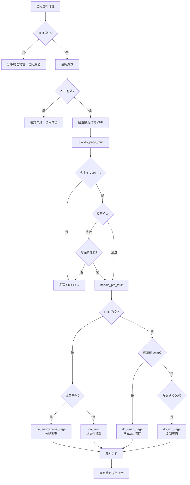
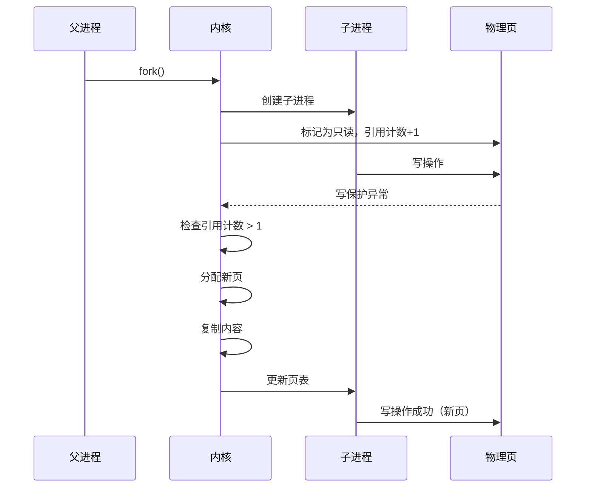
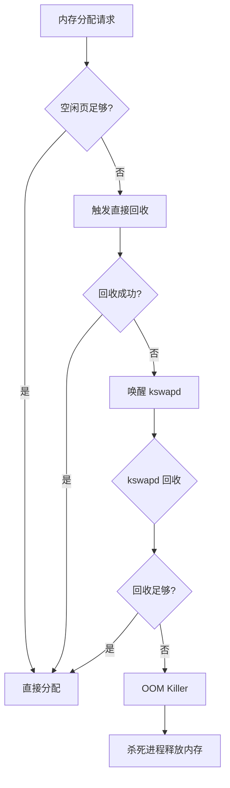
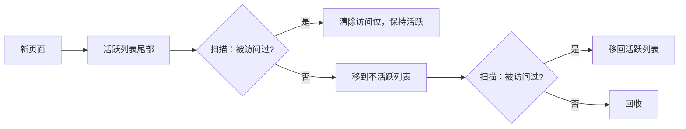

+++
title = "23.内核面试题-内存管理"
date = 2026-01-31
description = "Linux内核内存管理面试题：虚拟地址空间、页表、分配器、缺页处理深度解析"
[taxonomies]
tags = ["Linux", "内核", "面试", "内存管理", "MMU"]
+++

# Linux 内核面试题 - 内存管理

本文汇集 Linux 内核内存管理相关的高频面试问题，采用问答深挖形式，模拟真实面试场景。

---

## 问题 1：请描述 Linux 虚拟地址空间的布局

### 标准答案

**64 位 Linux（x86_64）地址空间**：

```
0xFFFF_FFFF_FFFF_FFFF  ┌─────────────────────┐
                       │     内核空间         │
                       │    (128TB)          │
0xFFFF_8000_0000_0000  ├─────────────────────┤
                       │                     │
                       │   非规范地址空洞     │
                       │  (不可访问)          │
                       │                     │
0x0000_7FFF_FFFF_FFFF  ├─────────────────────┤
                       │     用户空间         │
                       │    (128TB)          │
0x0000_0000_0000_0000  └─────────────────────┘
```

### 面试官追问

**Q1: 为什么有非规范地址空洞？**

当前 x86_64 只使用 48 位虚拟地址（可扩展到 57 位 LA57）。地址最高位需要符号扩展：
- 0x0000 开头 → 用户空间（第 47 位为 0）
- 0xFFFF 开头 → 内核空间（第 47 位为 1，符号扩展）
- 中间地址访问会触发 #GP（General Protection）异常

```c
// 判断地址是否规范
static inline bool is_canonical_address(unsigned long addr) {
    return ((long)addr >> 47) == ((long)addr >> 63);
}
```

**Q2: 内核空间包含哪些区域？请详细说明**

```
内核空间详细布局：
0xFFFF_FFFF_FFFF_FFFF  ┌───────────────────────┐
                       │  固定映射区 (fixmap)   │ 编译时确定的虚拟地址
0xFFFF_FFFF_FEE0_0000  ├───────────────────────┤
                       │  VSYSCALL 页           │ 兼容老程序
0xFFFF_FFFF_FF60_0000  ├───────────────────────┤
                       │  模块映射区            │ 内核模块加载
0xFFFF_FFFF_C000_0000  ├───────────────────────┤
                       │  vmemmap 区            │ struct page 数组
0xFFFF_EA00_0000_0000  ├───────────────────────┤
                       │  vmalloc 区            │ vmalloc 分配
0xFFFF_C900_0000_0000  ├───────────────────────┤
                       │  直接映射区            │ 线性映射所有物理内存
0xFFFF_8880_0000_0000  └───────────────────────┘
```

**Q3: 用户空间的布局是怎样的？**

```
用户空间布局（典型）：
0x7FFF_FFFF_FFFF      ┌───────────────────────┐
                      │       栈 (Stack)       │ 向下增长
                      │          ↓             │
0x7FFF_XXXX_XXXX      ├───────────────────────┤
                      │       随机间隙         │ ASLR
                      ├───────────────────────┤
                      │   共享库 (.so)         │ mmap 区域
                      ├───────────────────────┤
                      │          ↑             │
                      │       堆 (Heap)        │ 向上增长
0x0000_XXXX_XXXX      ├───────────────────────┤
                      │       BSS              │ 未初始化全局变量
                      ├───────────────────────┤
                      │       Data             │ 已初始化全局变量
                      ├───────────────────────┤
                      │       Text             │ 代码段
0x0000_0040_0000      └───────────────────────┘
```

**Q4: kmalloc 和 vmalloc 的区别？何时使用哪个？**

| 特性 | kmalloc | vmalloc |
|------|---------|---------|
| 物理连续 | ✅ 是 | ❌ 否 |
| 虚拟连续 | ✅ 是 | ✅ 是 |
| 映射区域 | 直接映射区 | vmalloc 区 |
| 页表开销 | 无（已映射）| 需要建立页表 |
| DMA 可用 | ✅ 是 | ❌ 否 |
| 最大大小 | ~4MB | 几乎无限 |
| 分配速度 | 快 | 慢 |
| 使用场景 | 小对象、需要物理连续 | 大块内存、不需要物理连续 |

```c
// 使用示例
// kmalloc：设备驱动中的 DMA 缓冲区
struct dma_buf *buf = kmalloc(4096, GFP_KERNEL);

// vmalloc：大型数据结构
char *large_buf = vmalloc(1024 * 1024);  // 1MB

// 注意：vmalloc 区域不能用于 DMA！
```

**Q5: kvmalloc 是什么？为什么需要它？**

```c
// kvmalloc：智能选择 kmalloc 或 vmalloc
void *kvmalloc(size_t size, gfp_t flags);

// 实现逻辑：
// 1. 尝试 kmalloc（如果 size <= PAGE_SIZE * 2）
// 2. kmalloc 失败则回退到 vmalloc

// 使用场景：大小不确定的分配
void *buf = kvmalloc(size, GFP_KERNEL);
// 释放时必须使用 kvfree
kvfree(buf);
```

---

## 问题 2：解释 Linux 的多级页表机制

### 标准答案

**4 级页表结构（x86_64）**：

```
48位虚拟地址分解：
┌─────────┬─────────┬─────────┬─────────┬──────────────┐
│   PGD   │   PUD   │   PMD   │   PTE   │   Offset     │
│  [47:39]│  [38:30]│  [29:21]│  [20:12]│    [11:0]    │
│   (9位) │   (9位) │   (9位) │   (9位) │    (12位)    │
└─────────┴─────────┴─────────┴─────────┴──────────────┘

每级索引 9 位 → 512 个条目
每个条目 8 字节 → 每个页表页 4KB

地址转换过程：
CR3 ──→ PGD表 ──→ PUD表 ──→ PMD表 ──→ PTE表 ──→ 物理页
        │         │         │         │         │
       9位       9位       9位       9位      12位
```


### 面试官追问

**Q1: 为什么使用多级页表而不是单级？**

单级页表问题：
```
48位地址空间，4KB页面：
页表项数 = 2^48 / 4KB = 2^36 个
页表大小 = 2^36 × 8B = 512GB！

每个进程都需要 512GB 页表 → 完全不可行
```

多级页表优势：
```
4级页表实际使用：
- 每级 512 × 8B = 4KB（正好一个页面）
- 只有使用的区域才分配页表页
- 典型进程只需几 MB 页表内存

示例：进程使用 1GB 内存（连续）
需要的页表页：
- PGD：1页（始终存在）
- PUD：1页
- PMD：1页（指向 512 个 PTE 表）
- PTE：512页
总计约 2MB 页表，而非 512GB
```

**Q2: 页表项（PTE）包含哪些信息？**

```c
// x86_64 PTE 格式（64位）
┌────────────────────────────────────────────────────────────┐
│ 63  62  ...  52  51  ...  12  11  ...  9  8  7  6  5  4  3  2  1  0 │
├────────────────────────────────────────────────────────────┤
│ NX │ 保留 │ 物理页帧号 │ AVL │ G │ PAT│ D │ A │PCD│PWT│U/S│R/W│ P │
└────────────────────────────────────────────────────────────┘

关键位说明：
P (Present)     : 页面是否在内存中
R/W             : 0=只读, 1=可写
U/S             : 0=内核态, 1=用户态可访问
A (Accessed)    : 页面被访问过
D (Dirty)       : 页面被修改过
NX (No Execute) : 禁止执行

// 内核中的操作
pte_present(pte)  // 检查 P 位
pte_write(pte)    // 检查 R/W 位
pte_dirty(pte)    // 检查 D 位
pte_young(pte)    // 检查 A 位
```

**Q3: TLB 的作用和刷新时机？**

TLB（Translation Lookaside Buffer）缓存虚拟→物理地址转换：

```c
// TLB 查找过程
if (TLB 命中) {
    直接获取物理地址;  // 快：1-2 周期
} else {
    遍历多级页表;      // 慢：可能需要多次内存访问
    填充 TLB;
}

// TLB 刷新时机：
1. 进程切换时（无 PCID 时刷新整个 TLB）
2. 修改页表时（flush_tlb_page）
3. 释放页面时（flush_tlb_range）
4. 显式调用 invlpg 指令

// PCID 优化（Process Context ID）
// 每个进程分配唯一 PCID（12位，最多4096个）
// TLB 条目带 PCID 标签，切换时不需要刷新
// 大幅减少进程切换开销
```

**Q4: 什么是大页（Huge Pages）？有哪些类型？**

```
页面大小比较：
标准页：4KB
大页：  2MB（PMD 级，跳过 PTE）
巨页：  1GB（PUD 级，跳过 PMD 和 PTE）

TLB 效率对比（映射 1GB 内存）：
标准 4KB 页：需要 262144 个 TLB 条目
2MB 大页：   需要 512 个 TLB 条目
1GB 巨页：   需要 1 个 TLB 条目
```

**大页使用方式**：

```c
// 方式1：hugetlbfs 文件系统
mount -t hugetlbfs none /mnt/huge
echo 128 > /proc/sys/vm/nr_hugepages  // 预留 128 个大页
fd = open("/mnt/huge/file", O_CREAT | O_RDWR);
ptr = mmap(NULL, size, PROT_READ | PROT_WRITE, MAP_SHARED, fd, 0);

// 方式2：mmap MAP_HUGETLB
ptr = mmap(NULL, size, PROT_READ | PROT_WRITE,
           MAP_PRIVATE | MAP_ANONYMOUS | MAP_HUGETLB, -1, 0);

// 方式3：透明大页（THP）
// 系统自动将连续的 4KB 页合并成 2MB 大页
echo always > /sys/kernel/mm/transparent_hugepage/enabled
```

**Q5: 透明大页（THP）的问题是什么？为什么 HFT 系统常常禁用它？**

```
THP 问题：
1. 延迟抖动：内核后台合并/拆分大页导致延迟尖峰
2. 内存碎片：需要连续 2MB 物理内存
3. 内存浪费：稀疏访问时浪费内存
4. khugepaged 进程：后台扫描消耗 CPU

HFT 系统配置：
echo never > /sys/kernel/mm/transparent_hugepage/enabled
echo never > /sys/kernel/mm/transparent_hugepage/defrag

替代方案：
使用显式的 hugetlbfs 或 mmap(MAP_HUGETLB)
预分配固定数量的大页，避免运行时分配
```

---

## 问题 3：详细解释缺页中断处理流程

### 标准答案



### 面试官追问

**Q1: Minor Fault 和 Major Fault 的区别？如何统计？**

| 类型 | 触发条件 | 开销 | 影响 |
|------|----------|------|------|
| Minor Fault | 页在内存，只需建立映射 | ~1-10μs | 轻微 |
| Major Fault | 需要磁盘 IO（从文件或 swap 读取）| ~1-10ms | 严重 |

```bash
# 统计进程缺页次数
$ cat /proc/<pid>/stat | awk '{print "minflt:", $10, "majflt:", $12}'

# 使用 perf 监控
$ perf stat -e page-faults,minor-faults,major-faults ./program

# 实时监控
$ ps -o pid,min_flt,maj_flt -p <pid>
```

**Q2: 什么是 Demand Paging？有什么优势？**

```c
// Demand Paging（按需分页）
// mmap 时只建立 VMA，不分配物理页，不建立页表

void *p = mmap(NULL, 1024*1024*1024,  // 请求 1GB
               PROT_READ | PROT_WRITE,
               MAP_PRIVATE | MAP_ANONYMOUS, -1, 0);
// 此时：
// - VMA 已创建
// - 物理页未分配
// - 页表未建立
// - 物理内存使用：0

for (int i = 0; i < 1024*1024*1024; i += 4096) {
    p[i] = 0;  // 每次访问触发缺页，分配一个物理页
}
// 最终分配 262144 个物理页

// 优势：
// 1. 快速返回：mmap 立即返回
// 2. 节省内存：只分配实际使用的页
// 3. 支持稀疏访问
```

**Q3: COW（Copy-On-Write）的完整工作流程？**

```c
pid_t pid = fork();
// fork 后状态：
// - 父子进程共享相同物理页
// - 所有共享页的页表项标记为只读
// - 页面引用计数增加

if (pid == 0) {  // 子进程
    data = 42;   // 写操作
    
    // 触发缺页异常（写保护违例）
    // do_wp_page() 处理：
    // 1. 检查页面引用计数
    // 2. 如果 > 1：
    //    a. 分配新物理页
    //    b. 复制原页内容
    //    c. 更新子进程页表指向新页
    //    d. 设置新页可写
    //    e. 原页引用计数减 1
    // 3. 如果 == 1（最后一个引用）：
    //    直接设置页面可写，无需复制
    // 4. 返回重新执行写操作
}
```



**Q4: 如何优化缺页中断性能？**

```bash
# 1. 预先填充页面（mlock）
mlock(addr, length);   # 锁定内存，防止换出
mlockall(MCL_FUTURE);  # 锁定所有未来分配

# 2. 使用 MAP_POPULATE
mmap(..., MAP_POPULATE, ...);  # 预先分配所有页面

# 3. 使用大页减少 TLB miss
mmap(..., MAP_HUGETLB, ...);

# 4. 预热内存（HFT 常用）
for (i = 0; i < size; i += PAGE_SIZE) {
    volatile char tmp = buffer[i];  // 触发所有缺页
}

# 5. 禁用 swap
swapoff -a
# 或设置 vm.swappiness = 0
```

---

## 问题 4：解释 Buddy System 和 Slab 分配器

### 标准答案

**Buddy System（伙伴系统）**：

```
管理物理页帧，按 2^n 页大小组织：

order-0:  4KB 块链表  ─┬─ 合并 ─→  order-1:  8KB 块链表
                       │
order-1:  8KB 块链表  ─┬─ 合并 ─→  order-2:  16KB 块链表
                       │
...                    │
                       │
order-10: 4MB 块链表  ─┘  最大块

分配算法（分配 12KB）：
1. 需要 16KB（order-2）
2. 从 order-2 链表取出一个块
3. 如果 order-2 为空，从 order-3 拆分

释放算法：
1. 将块加入对应 order 链表
2. 检查伙伴块是否空闲
3. 如果是，合并成更大块
4. 递归检查合并
```

```c
// 伙伴地址计算
// 块地址 ^ (1 << order * PAGE_SIZE) = 伙伴地址
#define BUDDY_ADDR(addr, order) ((addr) ^ (1UL << ((order) + PAGE_SHIFT)))
```

**Slab 分配器**：

```
解决 Buddy 无法高效分配小对象的问题：

┌─────────────────────────────────────────────────────┐
│                  kmem_cache（对象缓存）              │
│  例如：task_struct 缓存、inode 缓存、dentry 缓存    │
├─────────────────────────────────────────────────────┤
│ Slab 页面 1        │ Slab 页面 2        │ ...       │
│ ┌───┬───┬───┬───┐  │ ┌───┬───┬───┬───┐  │           │
│ │obj│obj│obj│obj│  │ │obj│obj│obj│obj│  │           │
│ │[用]│[用]│[空]│[空]│  │ │[空]│[空]│[空]│[空]│  │           │
│ └───┴───┴───┴───┘  │ └───┴───┴───┴───┘  │           │
│     ↓       ↓      │          ↓         │           │
│  空闲对象链表       │   完全空闲         │           │
└─────────────────────────────────────────────────────┘
```

### 面试官追问

**Q1: 为什么需要 Slab？Buddy 不够吗？**

```
Buddy 分配 64B 对象：
最小分配单位 = 4KB
内部碎片 = (4096 - 64) / 4096 = 98.4%

Slab 分配 64B 对象：
一个 4KB 页可存放 64 个 64B 对象
内部碎片 ≈ 0%

Slab 额外优势：
1. 对象重用：避免重复初始化/销毁
2. 缓存着色（Cache Coloring）：不同 slab 不同偏移，减少缓存冲突
3. 构造/析构函数：自动调用初始化/清理
4. per-CPU 缓存：减少锁竞争
```

**Q2: SLUB 和 SLAB 的区别？为什么 SLUB 成为默认？**

| 特性 | SLAB | SLUB |
|------|------|------|
| 复杂度 | 高（约 5000 行代码） | 低（约 2500 行代码） |
| per-CPU 缓存 | 复杂的多级缓存 | 简单的 per-CPU slab |
| 元数据 | 单独的管理结构 | 嵌入页面 `struct page` |
| 调试 | 困难 | 内置 SLUB_DEBUG |
| 内存效率 | 较低 | 较高 |
| 默认选择 | 旧内核 (< 2.6.23) | 现代内核 (>= 2.6.23) |

```bash
# 查看 slab 信息
cat /proc/slabinfo
slabtop -s c  # 按缓存大小排序

# SLUB 调试
echo 1 > /sys/kernel/slab/<cache>/validate
cat /sys/kernel/slab/<cache>/alloc_calls  # 分配调用栈
```

**Q3: GFP flags 的详细说明？**

```c
// GFP = Get Free Pages

// 基本标志
GFP_KERNEL      // 正常内核分配，可睡眠，可回收
GFP_ATOMIC      // 原子分配，不可睡眠，用于中断上下文
GFP_USER        // 用户空间分配
GFP_HIGHUSER    // 用户空间，优先高端内存
GFP_DMA         // DMA 可用的低端内存（<16MB）
GFP_DMA32       // 32位 DMA 可用（<4GB）

// 修饰标志
__GFP_WAIT      // 可以等待
__GFP_IO        // 可以启动 IO
__GFP_FS        // 可以调用文件系统
__GFP_NOWARN    // 失败时不打印警告
__GFP_RETRY_MAYFAIL  // 允许重试，但可能失败
__GFP_NOFAIL    // 不允许失败（危险！）
__GFP_ZERO      // 分配后清零

// 组合标志
GFP_KERNEL = __GFP_WAIT | __GFP_IO | __GFP_FS
GFP_ATOMIC = 0  // 什么都不能做

// 使用示例
spin_lock(&lock);
p = kmalloc(size, GFP_ATOMIC);  // 正确：持有 spinlock，不能睡眠
spin_unlock(&lock);

mutex_lock(&mutex);
p = kmalloc(size, GFP_KERNEL);  // 正确：mutex 可以睡眠
mutex_unlock(&mutex);

// 中断上下文
irqreturn_t handler(int irq, void *dev) {
    p = kmalloc(size, GFP_ATOMIC);  // 正确：中断上下文
    // GFP_KERNEL 会 BUG！
}
```

**Q4: 什么是内存分配器的 per-CPU 缓存？为什么重要？**

```c
// per-CPU 缓存：每个 CPU 有私有的对象缓存
struct kmem_cache_cpu {
    void **freelist;     // 空闲对象链表
    struct page *page;   // 当前使用的 slab 页面
};

// 分配流程
object = kmem_cache_alloc(cache, flags);
// 1. 检查 per-CPU 缓存
// 2. 如果有空闲对象，直接返回（无需加锁！）
// 3. 如果没有，从共享缓存或 Buddy 获取

// 优势：
// 1. 无锁分配：per-CPU 缓存不需要加锁
// 2. 缓存亲和性：对象留在分配它的 CPU
// 3. 减少争用：多 CPU 不竞争同一锁

// 这就是为什么现代内核小对象分配非常快
```

---

## 问题 5：如何诊断内核内存问题？

### 标准答案

**诊断工具和方法**：

```bash
# 1. 查看整体内存使用
cat /proc/meminfo
free -h

# 2. Slab 缓存统计
cat /proc/slabinfo
slabtop -o -s c

# 3. 进程内存映射
cat /proc/<pid>/maps      # 虚拟内存区域
cat /proc/<pid>/smaps     # 详细统计（RSS, PSS, etc.）
pmap -x <pid>             # 格式化输出

# 4. 缺页统计
cat /proc/<pid>/stat | awk '{print "minflt:", $10, "majflt:", $12}'

# 5. NUMA 统计
numastat
numastat -p <pid>

# 6. 内存压力（Linux 4.20+）
cat /proc/pressure/memory

# 7. 内存 cgroup 统计
cat /sys/fs/cgroup/memory/<cgroup>/memory.stat
```

### 面试官追问

**Q1: 如何检测内核内存泄漏？**

```bash
# 方法1：kmemleak（内核内置）
echo scan > /sys/kernel/debug/kmemleak
cat /sys/kernel/debug/kmemleak

# 输出示例：
unreferenced object 0xffff88003c4c4000 (size 1024):
  comm "insmod", pid 1234, jiffies 4294670888
  backtrace:
    [<ffffffff81234567>] kmalloc+0x12/0x34
    [<ffffffff81234890>] my_driver_init+0x45/0x100
    ...

# 方法2：slabinfo 观察增长
watch -n 1 'cat /proc/slabinfo | sort -k3 -nr | head'

# 方法3：内核 ftrace
echo 1 > /sys/kernel/debug/tracing/events/kmem/kmalloc/enable
cat /sys/kernel/debug/tracing/trace_pipe

# 方法4：用户空间 valgrind
valgrind --leak-check=full ./app
```

**Q2: OOM Killer 的工作原理？如何保护关键进程？**

```c
// OOM Killer 触发条件：
// 1. 内存分配失败
// 2. 内存回收无效
// 3. 无可用 swap

// oom_score 计算：
// 基础分 = 进程内存使用 / 总内存 × 1000
// 调整分 = oom_score_adj（-1000 到 1000）
// 最终分 = max(基础分 + 调整分, 0)

// 选择得分最高的进程杀死
```

```bash
# 保护关键进程
echo -1000 > /proc/<pid>/oom_score_adj  # 完全保护

# 优先杀死某进程
echo 1000 > /proc/<pid>/oom_score_adj

# 查看当前分数
cat /proc/<pid>/oom_score

# 禁用 OOM Killer（危险！）
echo 2 > /proc/sys/vm/overcommit_memory  # 不允许过度提交
```

**Q3: 什么是 PSS 和 USS？与 RSS 有什么区别？**

```
RSS (Resident Set Size)：进程占用的物理内存
  - 包括共享库的全部大小
  - 多个进程共享同一库时，RSS 会重复计算

PSS (Proportional Set Size)：按比例共享内存
  - 共享内存按进程数平分
  - 更准确反映进程的内存"责任"

USS (Unique Set Size)：进程独占内存
  - 只有该进程使用的内存
  - 进程终止后可释放的内存

示例：进程使用 100MB 私有内存 + 50MB 共享库（被 5 个进程共享）
RSS = 100 + 50 = 150MB
PSS = 100 + 50/5 = 110MB
USS = 100MB
```

```bash
# 查看 PSS/USS
cat /proc/<pid>/smaps | grep -E "^(Rss|Pss|Private)"

# 使用 smem 工具
smem -k -s pss
```

---

## 问题 6：解释内核的内存回收机制

### 标准答案

**内存回收触发条件**：



**可回收的内存类型**：

| 类型 | 回收方式 | 代价 |
|------|----------|------|
| 页缓存（干净） | 直接丢弃 | 低 |
| 页缓存（脏） | 写回磁盘后丢弃 | 中 |
| Slab 缓存 | 调用 shrink 回调 | 低 |
| 匿名页 | 交换到 swap | 高 |
| 映射页 | 写回文件后丢弃 | 中 |

### 面试官追问

**Q1: 解释 LRU 列表和页面回收算法**

```c
// Linux 使用双 LRU 列表（活跃/不活跃）
enum lru_list {
    LRU_INACTIVE_ANON,  // 不活跃匿名页
    LRU_ACTIVE_ANON,    // 活跃匿名页
    LRU_INACTIVE_FILE,  // 不活跃文件页
    LRU_ACTIVE_FILE,    // 活跃文件页
    LRU_UNEVICTABLE,    // 不可驱逐（mlocked）
    NR_LRU_LISTS
};

// 页面老化流程：
// 1. 新页面加入活跃列表尾部
// 2. 扫描活跃列表，检查访问位（PTE_A）
// 3. 如果被访问过，清除访问位，保持活跃
// 4. 如果未被访问，移到不活跃列表
// 5. 不活跃列表的页面最终被回收
```



**Q2: 什么是 swappiness？如何调优？**

```bash
# swappiness：控制内核回收匿名页与文件页的倾向
cat /proc/sys/vm/swappiness
# 默认值：60

# 值范围：0-200（传统为 0-100）
# 0:   只在绝对必要时使用 swap
# 60:  默认平衡
# 100: 积极使用 swap
# 200: 最大化使用 swap

# 实际计算公式（简化）：
anon_priority = swappiness
file_priority = 200 - swappiness

# 推荐值：
# - 数据库服务器：10（尽量避免 swap）
# - 普通服务器：60
# - 内存紧张系统：80
# - 禁用 swap：swapoff -a 或 swappiness=0

# 设置
echo 10 > /proc/sys/vm/swappiness
# 或永久设置 /etc/sysctl.conf
vm.swappiness = 10
```

**Q3: 什么是内存水位（Watermarks）？**

```
内存水位控制页面分配和回收：

高水位 (high)  ─────────┐
                        │  空闲页充足
min+low+high 差值       │  直接分配
                        │
低水位 (low)   ─────────┤
                        │  唤醒 kswapd
min+low 差值            │  后台回收
                        │
最小水位 (min) ─────────┤
                        │  直接回收
0                       │  可能 OOM
               ─────────┘

查看水位值：
$ cat /proc/zoneinfo | grep -E "min|low|high"
```

```bash
# 调整水位
echo 65536 > /proc/sys/vm/min_free_kbytes

# 计算规则：
# min = min_free_kbytes / 4 (per zone)
# low = min + min/4
# high = min + min/2
```

---

## 问题 7：NUMA 架构下的内存管理

### 标准答案

**NUMA（Non-Uniform Memory Access）**：

```
NUMA 架构：
┌─────────────────┐       ┌─────────────────┐
│     Node 0      │       │     Node 1      │
│  ┌───────────┐  │       │  ┌───────────┐  │
│  │   CPU 0-7 │  │       │  │  CPU 8-15 │  │
│  └─────┬─────┘  │       │  └─────┬─────┘  │
│        │        │       │        │        │
│  ┌─────┴─────┐  │       │  ┌─────┴─────┐  │
│  │ 本地内存  │  │◄─────►│  │ 本地内存  │  │
│  │   64GB    │  │ 互联  │  │   64GB    │  │
│  └───────────┘  │       │  └───────────┘  │
└─────────────────┘       └─────────────────┘

访问延迟：
本地内存：~80ns
远程内存：~150ns（差距可达 1.5-2 倍）
```

### 面试官追问

**Q1: Linux 如何处理 NUMA？**

```c
// NUMA 内存分配策略
MPOL_DEFAULT     // 本地优先
MPOL_BIND        // 绑定到指定节点
MPOL_INTERLEAVE  // 交错分配到多个节点
MPOL_PREFERRED   // 优先指定节点，失败时回退

// 设置进程 NUMA 策略
#include <numaif.h>
set_mempolicy(MPOL_BIND, &nodemask, maxnode);

// 或使用 numactl
numactl --membind=0 ./program    // 绑定到节点 0
numactl --cpunodebind=0 ./program  // CPU 绑定到节点 0
numactl --interleave=all ./program  // 交错分配
```

**Q2: 为什么 NUMA 对 HFT 很重要？**

```c
// 问题：跨 NUMA 访问导致延迟增加
// 延迟差异：80ns vs 150ns，对 HFT 很显著

// 解决方案：
// 1. CPU 绑定
cpu_set_t cpuset;
CPU_ZERO(&cpuset);
CPU_SET(0, &cpuset);  // 绑定到 CPU 0
pthread_setaffinity_np(thread, sizeof(cpuset), &cpuset);

// 2. 内存绑定
numa_tonode_memory(ptr, size, 0);  // 绑定到节点 0

// 3. 预分配本地内存
numactl --membind=0 --cpunodebind=0 ./hft_app

// 4. 验证分配
$ numastat -p <pid>
$ cat /proc/<pid>/numa_maps
```

---

## 高频考点总结

| 考点 | 频率 | 深度要求 |
|------|------|----------|
| 地址空间布局 | ★★★ | 能画出布局图，解释每个区域 |
| 多级页表 | ★★★ | 理解地址转换过程，PTE 各位含义 |
| kmalloc/vmalloc | ★★★ | 区别、使用场景、kvmalloc |
| 缺页处理 | ★★★ | 完整流程，Minor/Major Fault |
| Buddy/Slab | ★★☆ | 设计原理，SLUB vs SLAB |
| GFP flags | ★★★ | 常用标志和注意事项 |
| 内存回收 | ★★☆ | LRU、swappiness、水位 |
| COW | ★★★ | 完整工作流程 |
| 大页 | ★★☆ | 类型、使用方式、THP 问题 |
| NUMA | ★★☆ | 基本概念、优化策略 |

---

## 相关文章

- [上一篇：内核笔试题-中断与系统调用](/articles/linux/linux-22-内核笔试题-中断与系统调用/)
- [下一篇：内核面试题-进程调度](/articles/linux/linux-24-内核面试题-进程调度/)
