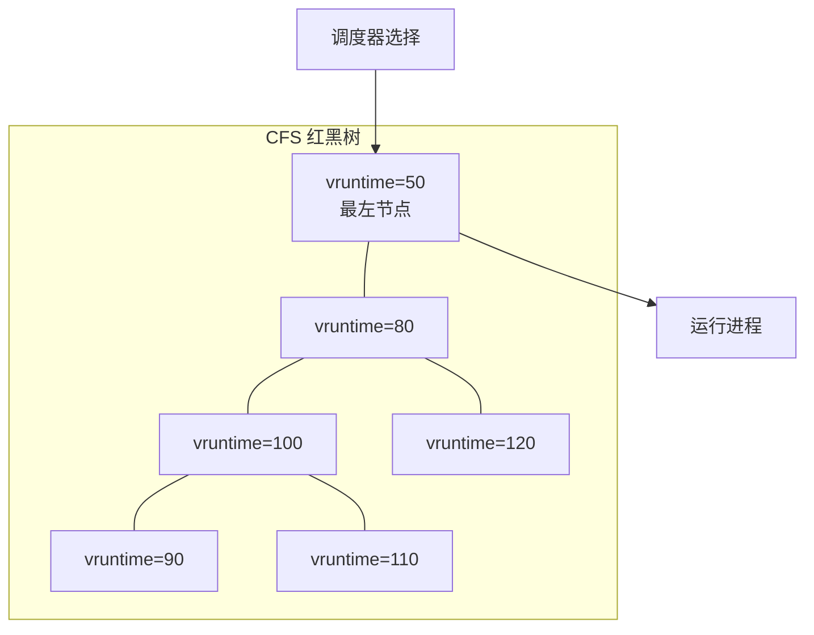
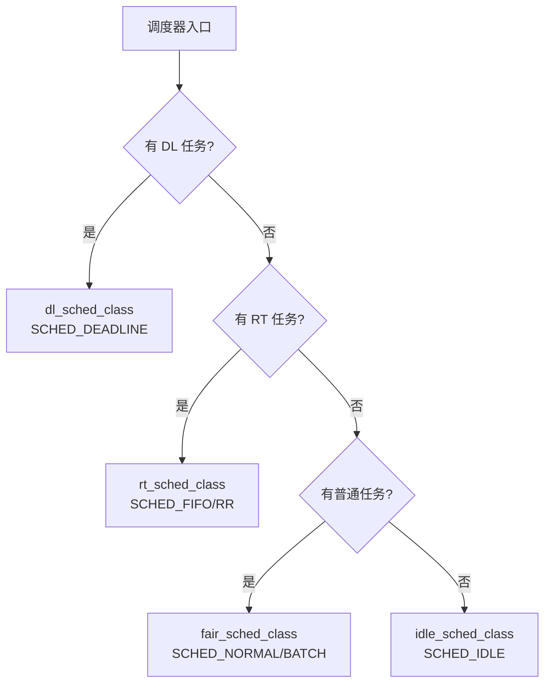
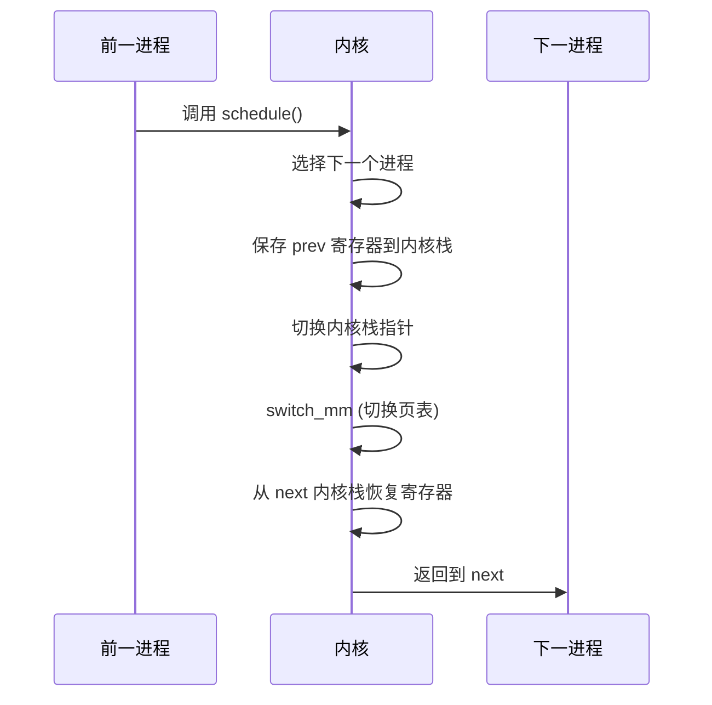
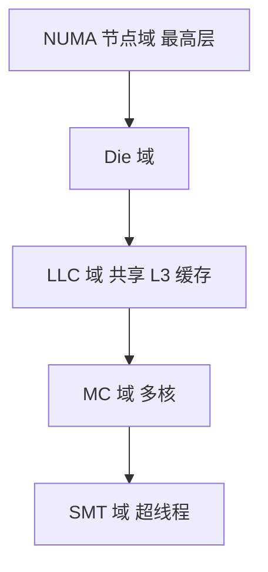
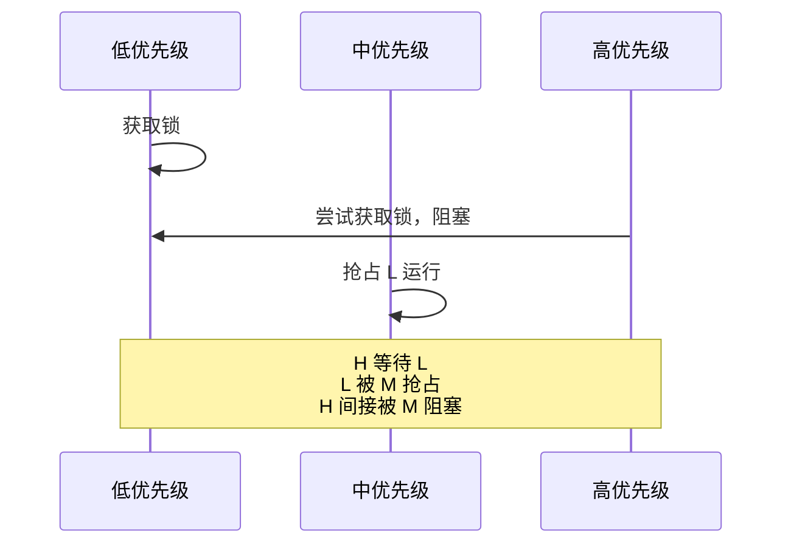

+++
title = "24. 内核面试题-进程调度"
date = 2026-01-31
weight = 24000
description = "Linux内核进程调度面试题：CFS算法、vruntime、实时调度、上下文切换深度解析"
[taxonomies]
tags = ["Linux", "内核", "面试", "调度", "CFS"]
+++

# Linux 内核面试题 - 进程调度

本文汇集 Linux 内核进程调度相关的高频面试问题，采用问答深挖形式，模拟真实面试场景。

---

## 问题 1：解释 CFS 调度器的核心原理

### 标准答案

**CFS（Completely Fair Scheduler）核心思想**：
- 每个进程应获得公平的 CPU 时间份额
- 使用虚拟运行时间（vruntime）跟踪进程的"领先/落后"程度
- 始终选择 vruntime 最小的进程运行
- 用红黑树维护可运行进程，快速找到最小 vruntime

**vruntime 计算公式**：
```
vruntime += delta_exec × (NICE_0_LOAD / weight)

- delta_exec: 实际运行时间（纳秒）
- NICE_0_LOAD: nice=0 的权重基准（1024）
- weight: 进程权重（由 nice 值决定）
```

**关键特性**：
- 高优先级（低 nice）→ 大 weight → vruntime 增长慢 → 获得更多 CPU
- 低优先级（高 nice）→ 小 weight → vruntime 增长快 → 获得更少 CPU



### 面试官追问

**Q1: nice 值和权重的对应关系是什么？**

| nice | weight | 相对 nice=0 的 CPU 份额 |
|------|--------|------------------------|
| -20 | 88761 | ~87× CPU |
| -10 | 9548 | ~9× CPU |
| -5 | 3121 | ~3× CPU |
| 0 | 1024 | 1×（基准） |
| 5 | 335 | ~0.33× CPU |
| 10 | 110 | ~0.1× CPU |
| 19 | 15 | ~0.015× CPU |

```c
// 内核权重表（简化）
static const int sched_prio_to_weight[40] = {
    /* -20 */ 88761, 71755, 56483, 46273, 36291,
    /* -15 */ 29154, 23254, 18705, 14949, 11916,
    /* -10 */ 9548,  7620,  6100,  4904,  3906,
    /*  -5 */ 3121,  2501,  1991,  1586,  1277,
    /*   0 */ 1024,  820,   655,   526,   423,
    /*   5 */ 335,   272,   215,   172,   137,
    /*  10 */ 110,   87,    70,    56,    45,
    /*  15 */ 36,    29,    23,    18,    15,
};
```

**Q2: 新进程的 vruntime 如何初始化？为什么？**

```c
// 新进程初始化 vruntime
void place_entity(struct cfs_rq *cfs_rq, struct sched_entity *se, int initial) {
    u64 vruntime = cfs_rq->min_vruntime;
    
    if (initial) {
        // 新进程：加上调度延迟的一半
        vruntime += sched_vslice(cfs_rq, se);
    }
    
    // 从睡眠唤醒的进程：补偿一些 vruntime
    if (!initial) {
        vruntime -= sysctl_sched_latency;  // 减少一些，给予唤醒奖励
    }
    
    se->vruntime = max(se->vruntime, vruntime);
}

// 为什么这样设计？
// 1. 如果 vruntime = 0，新进程会立即抢占所有老进程
// 2. 如果 vruntime = min_vruntime，新进程会立即获得 CPU
// 3. 加上一些延迟，让新进程稍后再运行，更公平
```

**Q3: CFS 的时间片是如何计算的？**

```c
// 目标调度延迟（默认 6ms 到 24ms）
sysctl_sched_latency = 6ms

// 每个进程的理想时间片
time_slice = sched_latency × (进程权重 / 运行队列总权重)

// 示例：运行队列有 3 个进程，权重分别为 1024, 1024, 1024
// 每个进程时间片 = 6ms × (1024 / 3072) = 2ms

// 如果进程太多，保证最小粒度
sysctl_sched_min_granularity = 0.75ms
// 实际延迟 = max(sched_latency, nr_running × min_granularity)
```

**Q4: 什么是 min_vruntime？它的作用是什么？**

```c
// min_vruntime 是运行队列的单调递增值
// 作用：
// 1. 作为新进程 vruntime 的基准
// 2. 防止睡眠唤醒后 vruntime 差距过大
// 3. 用于负载均衡时的 vruntime 规范化

// 更新逻辑
void update_min_vruntime(struct cfs_rq *cfs_rq) {
    u64 vruntime = cfs_rq->min_vruntime;
    
    if (cfs_rq->curr)
        vruntime = min(vruntime, cfs_rq->curr->vruntime);
    
    if (cfs_rq->rb_leftmost)
        vruntime = min(vruntime, 
                      rb_entry(cfs_rq->rb_leftmost)->vruntime);
    
    cfs_rq->min_vruntime = max(cfs_rq->min_vruntime, vruntime);
}
```

---

## 问题 2：Linux 有哪些调度策略和调度类？

### 标准答案

**调度策略**：

| 策略 | 调度类 | 说明 | 优先级范围 |
|------|--------|------|-----------|
| SCHED_DEADLINE | dl | EDF 算法，最高优先级 | - |
| SCHED_FIFO | rt | 实时先进先出 | 1-99 |
| SCHED_RR | rt | 实时轮转 | 1-99 |
| SCHED_NORMAL | fair | 普通进程（CFS） | nice -20~19 |
| SCHED_BATCH | fair | 批处理，不抢占 | nice -20~19 |
| SCHED_IDLE | fair | 最低优先级 | - |

**调度类层次**：



```c
// 调度类链表（优先级从高到低）
stop_sched_class     // 最高：停止 CPU（迁移用）
   ↓
dl_sched_class       // SCHED_DEADLINE
   ↓
rt_sched_class       // SCHED_FIFO, SCHED_RR
   ↓
fair_sched_class     // SCHED_NORMAL, SCHED_BATCH
   ↓
idle_sched_class     // 最低：空闲任务
```

### 面试官追问

**Q1: SCHED_FIFO 和 SCHED_RR 的详细区别？**

| 特性 | SCHED_FIFO | SCHED_RR |
|------|------------|----------|
| 时间片 | 无（运行到阻塞或主动让出） | 有（默认 100ms） |
| 同优先级抢占 | 否 | 是（时间片用完） |
| 适用场景 | 短任务、确定性延迟 | 需要公平轮转 |
| 风险 | 可能饿死低优先级 | 相对公平 |

```c
// 设置实时调度策略
struct sched_param param;
param.sched_priority = 50;  // 1-99
sched_setscheduler(pid, SCHED_FIFO, &param);

// 查看/修改 RR 时间片
sched_rr_get_interval(pid, &tp);
```

**Q2: SCHED_DEADLINE 的三参数详解？**

```c
struct sched_attr {
    uint32_t size;
    uint32_t sched_policy;      // SCHED_DEADLINE
    uint64_t sched_runtime;     // 每周期需要的 CPU 时间
    uint64_t sched_deadline;    // 必须在此时间内完成
    uint64_t sched_period;      // 任务周期
};

// 示例：每 10ms 需要 2ms CPU 时间，deadline 为 5ms
attr.sched_runtime = 2 * 1000000;   // 2ms
attr.sched_deadline = 5 * 1000000;  // 5ms
attr.sched_period = 10 * 1000000;   // 10ms

sched_setattr(pid, &attr, 0);

// 准入控制公式：
// Σ(runtime_i / period_i) ≤ M（CPU 核数）
// 超过则 EBUSY
```

**Q3: 什么是调度延迟（Scheduling Latency）？**

```c
// 调度延迟 = 任务变为可运行到实际开始运行的时间

// 影响因素：
1. 运行队列长度
2. 更高优先级任务
3. 中断处理时间
4. 锁等待时间

// 查看调度延迟
$ perf sched latency
$ cat /proc/<pid>/schedstat
// 第二个数字是等待时间（纳秒）

// HFT 优化目标：调度延迟 < 10μs
```

**Q4: 如何将进程设置为实时调度？**

```c
#include <sched.h>

// 方法1：sched_setscheduler
struct sched_param param;
param.sched_priority = 80;  // 1-99，99 最高
if (sched_setscheduler(0, SCHED_FIFO, &param) == -1) {
    perror("sched_setscheduler");
}

// 方法2：pthread_setschedparam
pthread_t thread = pthread_self();
struct sched_param param;
param.sched_priority = 80;
pthread_setschedparam(thread, SCHED_FIFO, &param);

// 方法3：命令行
$ chrt -f 80 ./program    // SCHED_FIFO
$ chrt -r 80 ./program    // SCHED_RR

// 需要 CAP_SYS_NICE 权限
```

---

## 问题 3：描述上下文切换的完整过程

### 标准答案

**上下文切换发生时机**：
1. 时间片用完
2. 更高优先级任务就绪
3. 当前任务阻塞（I/O、锁等）
4. 当前任务主动让出（sched_yield）

**上下文切换流程**：

```c
// 核心函数
static inline void context_switch(struct rq *rq,
                                  struct task_struct *prev,
                                  struct task_struct *next) {
    // 1. 准备工作
    prepare_task_switch(rq, prev, next);
    
    // 2. 切换地址空间
    if (!next->mm) {
        // 内核线程：借用前一个进程的 mm
        next->active_mm = prev->active_mm;
        atomic_inc(&prev->active_mm->mm_count);
    } else {
        // 用户进程：切换页表
        switch_mm(prev->active_mm, next->mm, next);
    }
    
    // 3. 切换 CPU 上下文（寄存器、栈）
    switch_to(prev, next, prev);
    
    // 4. 完成切换后的清理
    finish_task_switch(prev);
}
```

**switch_to 保存和恢复的内容**：

| 组件 | 操作 | 开销 |
|------|------|------|
| 通用寄存器 | 保存到内核栈，从新栈恢复 | 低 |
| 栈指针 RSP | 切换到新进程内核栈 | 低 |
| 页表 CR3 | 加载新进程页表基址 | 中（TLB 刷新） |
| FPU/SIMD | XSAVE/XRSTOR | 高（可延迟） |
| TLS FS/GS | 更新基址寄存器 | 低 |
| 调试寄存器 | 如果使用 | 低 |



### 面试官追问

**Q1: 线程切换和进程切换的区别？开销差多少？**

| 类型 | 页表切换 | TLB 刷新 | 开销 |
|------|----------|----------|------|
| 同进程线程切换 | 无需 | 无 | ~100-500ns |
| 进程切换（无 PCID）| 需要 | 全部刷新 | ~1-5μs |
| 进程切换（有 PCID）| 需要 | 无需刷新 | ~500ns-2μs |

```c
// PCID (Process Context ID) 优化
// 每个进程分配一个 12 位 ID（最多 4096 个）
// TLB 条目带 PCID 标签
// 切换进程时不需要刷新 TLB

// 检查是否启用 PCID
$ cat /proc/cpuinfo | grep pcid

// 内核配置
CONFIG_X86_PCID=y
```

**Q2: 什么是 Lazy FPU？为什么重要？**

```c
// 问题：FPU/SIMD 状态很大（最多 2KB+）
// 每次切换都保存/恢复太昂贵

// Lazy FPU 策略：
// 1. 切换时不保存 FPU 状态
// 2. 标记 FPU 为 "不属于当前进程"
// 3. 下一次使用 FPU 时触发异常
// 4. 异常处理中保存上一进程 FPU，恢复当前进程 FPU

// 现代 CPU（Eager FPU）：
// XSAVES/XRSTORS 指令很快
// 不再使用 Lazy FPU
// 直接在切换时保存/恢复

// 内核配置
CONFIG_X86_DEBUG_FPU=y
```

**Q3: 如何测量上下文切换开销？**

```bash
# 方法1：perf
$ perf stat -e context-switches,cpu-migrations ./program

# 方法2：/proc/pid/status
$ grep ctxt /proc/<pid>/status
voluntary_ctxt_switches:        1234
nonvoluntary_ctxt_switches:     567

# 方法3：vmstat
$ vmstat 1
# cs 列是每秒上下文切换数

# 方法4：自己测量
clock_gettime(CLOCK_MONOTONIC, &start);
for (int i = 0; i < 100000; i++) {
    sched_yield();  // 强制切换
}
clock_gettime(CLOCK_MONOTONIC, &end);
// 计算平均切换时间
```

**Q4: 如何优化上下文切换开销？**

```bash
# 1. 减少切换频率
# 增加时间片
echo 10000000 > /proc/sys/kernel/sched_min_granularity_ns

# 2. CPU 绑定（避免迁移）
taskset -c 0 ./program

# 3. 使用实时调度（减少抢占）
chrt -f 80 ./program

# 4. 隔离 CPU
# /etc/default/grub
GRUB_CMDLINE_LINUX="isolcpus=2,3 nohz_full=2,3"

# 5. 禁用中断
# 将中断绑定到其他 CPU
echo 0 > /proc/irq/XX/smp_affinity

# 6. 使用 NOHZ（tickless）
# 减少定时器中断
```

---

## 问题 4：解释 CFS 的负载均衡机制

### 标准答案

**调度域层次结构**：



**负载均衡触发时机**：

```c
// 1. 周期性均衡（scheduler_tick）
void scheduler_tick(void) {
    // 每个 tick 检查是否需要均衡
    trigger_load_balance(rq);
}

// 2. 空闲均衡（CPU 空闲时）
void idle_balance(struct rq *this_rq) {
    // 从其他 CPU 拉取任务
    pull_tasks();
}

// 3. 唤醒均衡（进程唤醒时）
int select_task_rq_fair(struct task_struct *p) {
    // 选择最佳 CPU 运行
    return select_idle_sibling(cpu);
}

// 4. 主动均衡（负载严重不均）
// migration 内核线程执行
```

### 面试官追问

**Q1: 如何计算 CPU 负载？**

```c
// CFS 使用 PELT (Per-Entity Load Tracking)
// 每个调度实体跟踪自己的负载

struct sched_avg {
    u64 load_avg;       // 负载平均
    u64 runnable_avg;   // 可运行平均
    u64 util_avg;       // 利用率平均
};

// 负载衰减公式（每 1ms 衰减）
load = load × (y^n)
// y ≈ 0.978（半衰期约 32ms）

// CPU 负载 = Σ(所有进程负载)
```

**Q2: 什么是 wake_affine？**

```c
// wake_affine：唤醒时尝试将任务放到唤醒者的 CPU
// 目的：利用缓存亲和性

int wake_affine(struct sched_domain *sd, 
                struct task_struct *p, int wake_flags) {
    // 如果唤醒者 CPU 有足够容量
    // 且被唤醒者与唤醒者有关联
    // 则将任务放到唤醒者 CPU
    
    // 好处：共享数据可能还在缓存中
}

// 控制参数
sysctl kernel.sched_wake_affine = 1
```

**Q3: 如何查看和调试负载均衡？**

```bash
# 查看调度域
cat /proc/sys/kernel/sched_domain/cpu0/domain0/name
cat /proc/sys/kernel/sched_domain/cpu0/domain0/flags

# 查看负载
cat /proc/loadavg
cat /proc/schedstat

# 调试负载均衡
echo 1 > /sys/kernel/debug/sched/verbose
dmesg | grep -i balance

# perf 调度事件
perf stat -e sched:sched_migrate_task ./program
```

---

## 问题 5：实时调度的优先级反转问题

### 标准答案

**优先级反转**：高优先级任务等待低优先级任务持有的锁，而中优先级任务抢占低优先级任务，导致高优先级任务无限期等待。



**解决方案**：

```c
// 1. 优先级继承（Priority Inheritance）
// 低优先级任务继承等待它的高优先级任务的优先级
pthread_mutexattr_t attr;
pthread_mutexattr_init(&attr);
pthread_mutexattr_setprotocol(&attr, PTHREAD_PRIO_INHERIT);
pthread_mutex_init(&mutex, &attr);

// 2. 优先级天花板（Priority Ceiling）
// 获取锁时立即提升到预设的最高优先级
pthread_mutexattr_setprotocol(&attr, PTHREAD_PRIO_PROTECT);
pthread_mutexattr_setprioceiling(&attr, 99);

// 3. 使用 rt_mutex（内核中）
// 内核 rt_mutex 自动实现优先级继承
```

### 面试官追问

**Q1: Linux 内核如何处理优先级反转？**

```c
// rt_mutex 实现优先级继承
struct rt_mutex {
    struct task_struct *owner;
    struct rb_root waiters;  // 等待者按优先级排序
};

// 当高优先级任务等待时：
// 1. 将自己加入 waiters
// 2. 检查 owner 优先级
// 3. 如果 owner 优先级低，临时提升 owner
// 4. 递归处理（如果 owner 也在等待其他锁）

// 这就是 "优先级继承链"
```

**Q2: 什么是 RT 节流（RT Throttling）？**

```bash
# 防止实时任务饿死普通任务
# 默认：每 1 秒最多使用 950ms（95%）

$ cat /proc/sys/kernel/sched_rt_period_us
1000000  # 1 秒

$ cat /proc/sys/kernel/sched_rt_runtime_us
950000   # 950ms

# 禁用节流（危险！）
$ echo -1 > /proc/sys/kernel/sched_rt_runtime_us

# RT 任务超时会打印警告
# "sched: RT throttling activated"
```

---

## 问题 6：如何诊断调度性能问题？

### 标准答案

```bash
# 1. 调度延迟分析
$ perf sched record -a sleep 10
$ perf sched latency

# 输出示例：
# Task                  | Runtime   | Switches | Avg delay |
# ----------------------+-----------+----------+-----------+
# my_process:(4)        | 1234.567  | 5678     | 0.123 ms  |

# 2. 调度时间线
$ perf sched timehist
# 显示每次调度事件的时间戳

# 3. 运行队列长度
$ sar -q 1
# runq-sz：运行队列长度
# plist-sz：进程总数

# 4. 上下文切换统计
$ vmstat 1
# cs：每秒上下文切换次数

# 5. 进程调度统计
$ cat /proc/<pid>/sched
# nr_switches：切换次数
# wait_sum：等待总时间
# iowait_sum：IO 等待时间

# 6. 调度跟踪
$ trace-cmd record -e sched
$ trace-cmd report
```

### 面试官追问

**Q1: 调度延迟过高怎么排查？**

```bash
# 步骤1：确认是否有实时进程抢占
$ ps -eo pid,cls,pri,ni,comm | grep -E "FF|RR"
# FF = SCHED_FIFO, RR = SCHED_RR

# 步骤2：检查 CPU 使用率
$ mpstat -P ALL 1
# 是否有 CPU 100%？

# 步骤3：检查 CPU 亲和性
$ taskset -p <pid>
# 是否绑定到单个 CPU？

# 步骤4：检查中断
$ cat /proc/interrupts
$ cat /proc/irq/*/smp_affinity
# 中断是否集中在某 CPU？

# 步骤5：使用 perf 追踪
$ perf sched record -p <pid>
$ perf sched latency --sort max

# 步骤6：ftrace 深入分析
$ echo 1 > /sys/kernel/debug/tracing/events/sched/enable
$ cat /sys/kernel/debug/tracing/trace_pipe
```

**Q2: 如何优化调度延迟？**

```bash
# 1. CPU 隔离
GRUB_CMDLINE_LINUX="isolcpus=2,3 nohz_full=2,3 rcu_nocbs=2,3"

# 2. 使用实时调度
chrt -f 80 ./program

# 3. 禁用调度器特性
echo NO_ENERGY_AWARE > /sys/kernel/debug/sched/features

# 4. 调整调度参数
echo 100000 > /proc/sys/kernel/sched_min_granularity_ns
echo 500000 > /proc/sys/kernel/sched_latency_ns

# 5. 内核参数
preempt=full    # 或 preempt=voluntary
threadirqs      # 线程化中断

# 6. 绑定中断
echo 1 > /proc/irq/<irq>/smp_affinity  # 绑定到 CPU 0
```

---

## 高频考点总结

| 考点 | 频率 | 深度要求 |
|------|------|----------|
| CFS 原理 | ★★★ | vruntime 计算、红黑树 |
| nice 与权重 | ★★★ | 对应关系、影响 |
| 调度策略 | ★★★ | 各策略区别和使用场景 |
| 上下文切换 | ★★★ | 完整流程、优化方法 |
| 负载均衡 | ★★☆ | 调度域、PELT |
| 实时调度 | ★★☆ | FIFO/RR/DEADLINE |
| 优先级反转 | ★★☆ | 问题和解决方案 |
| 调度诊断 | ★★★ | perf sched、schedstat |

---

## 相关文章

- [上一篇：内核面试题-内存管理](@/articles/linux/linux-23-内核面试题-内存管理.md)
- [下一篇：内核面试题-同步机制](@/articles/linux/linux-25-内核面试题-同步机制.md)
