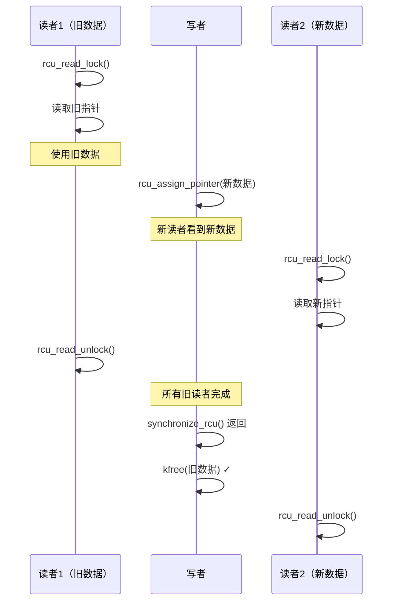

+++
title = "内核面试题-同步机制"
date = 2026-01-31
weight = 25000
description = "Linux内核同步机制面试题：Spinlock、Mutex、RCU、内存屏障深度解析"
[taxonomies]
tags = ["Linux", "内核", "面试", "同步", "RCU"]
+++

# Linux 内核面试题 - 同步机制

本文汇集 Linux 内核同步机制相关的高频面试问题，采用问答深挖形式，模拟真实面试场景。

---

## 问题 1：什么时候用 Spinlock，什么时候用 Mutex？

### 标准答案

| 场景 | 选择 | 原因 |
|------|------|------|
| 中断上下文 | Spinlock | 不能睡眠 |
| 临界区很短（< 几μs） | Spinlock | 自旋开销小于睡眠 |
| 临界区较长 | Mutex | 避免浪费 CPU |
| 临界区需要睡眠 | Mutex | Spinlock 禁止睡眠 |
| 进程上下文持锁时需要调度 | Mutex | Spinlock 禁止调度 |

**核心区别**：

```c
// Spinlock：自旋等待，不睡眠
spin_lock(&lock);
// 临界区 - 不能睡眠！不能调用可能睡眠的函数！
spin_unlock(&lock);

// Mutex：可能睡眠
mutex_lock(&lock);
// 临界区 - 可以睡眠
mutex_unlock(&lock);
```

### 面试官追问

**Q1: Spinlock 在不同上下文如何使用？**

```c
// 场景1：只与进程上下文共享数据
spin_lock(&lock);
// 临界区
spin_unlock(&lock);

// 场景2：与软中断（softirq、tasklet）共享数据
spin_lock_bh(&lock);    // 禁用软中断 + 获取锁
// 临界区
spin_unlock_bh(&lock);  // 释放锁 + 启用软中断

// 场景3：与硬中断共享数据
unsigned long flags;
spin_lock_irqsave(&lock, flags);    // 保存中断状态 + 禁中断 + 获取锁
// 临界区
spin_unlock_irqrestore(&lock, flags);  // 恢复中断状态

// 场景4：确定中断已经禁用
spin_lock_irq(&lock);    // 禁中断 + 获取锁（不保存状态）
// 临界区
spin_unlock_irq(&lock);  // 释放锁 + 启用中断
```

**Q2: 为什么持有 Spinlock 时不能睡眠？**

```c
// 假设 CPU A 持有 spinlock 后睡眠
spin_lock(&lock);
schedule();  // 睡眠！错误！
spin_unlock(&lock);

// 问题：
// 1. CPU A 睡眠，其他 CPU 等待这个锁会一直自旋
// 2. 如果切换到的进程也需要这个锁 → 死锁
// 3. 在单核上：自己等待自己 → 死锁

// 内核会检测并报告 BUG
// "BUG: scheduling while atomic"
```

**Q3: Spinlock 的 raw_spinlock 变体是什么？**

```c
// raw_spinlock：无论 PREEMPT_RT 如何配置都是真正的自旋锁
// spinlock：在 PREEMPT_RT 内核可能变成 rt_mutex

// 普通内核：
spinlock_t = raw_spinlock_t  // 相同

// PREEMPT_RT 内核：
spinlock_t = rt_mutex        // 可以睡眠！
raw_spinlock_t = 真正自旋    // 始终自旋

// 何时使用 raw_spinlock：
// - 必须禁止抢占的场景
// - 调度器内部
// - 中断处理内部
```

**Q4: Mutex 的自适应自旋是什么？**

```c
// 自适应自旋（Adaptive Spinning）
// 如果锁持有者正在其他 CPU 上运行，先自旋等待

mutex_lock(&mutex);
// 内部逻辑：
// 1. 检查 owner 是否在运行
// 2. 如果在运行，自旋等待（可能很快释放）
// 3. 如果不在运行，进入睡眠等待

// 优势：减少不必要的睡眠/唤醒开销

// 控制参数
CONFIG_MUTEX_SPIN_ON_OWNER=y
```

---

## 问题 2：详细解释 RCU 的工作原理

### 标准答案

**RCU（Read-Copy-Update）核心思想**：
- 读侧：无锁访问，极低开销
- 写侧：复制-更新-延迟释放

```c
// 读者
rcu_read_lock();                    // 禁止抢占
ptr = rcu_dereference(global_ptr);  // 安全读取指针
// 使用 ptr 指向的数据
rcu_read_unlock();                  // 恢复抢占

// 写者
struct data *new_data = kmalloc(...);
// 填充 new_data
old_data = global_ptr;
rcu_assign_pointer(global_ptr, new_data);  // 原子更新指针
synchronize_rcu();    // 等待所有旧读者完成
kfree(old_data);      // 安全释放旧数据
```

**宽限期（Grace Period）**：



### 面试官追问

**Q1: RCU 读侧为什么这么快？有多快？**

```c
// rcu_read_lock 实现（非抢占内核）
static inline void rcu_read_lock(void) {
    __rcu_read_lock();
    // 展开为：preempt_disable();
}

// 无原子操作
// 无内存屏障（除了编译器屏障）
// 无缓存行争用
// 开销：约 1-5 个时钟周期

// 对比其他锁的读侧开销：
// rwlock_t：原子操作 + 可能自旋 → 几十到几百周期
// mutex：可能睡眠 → 上千周期
// RCU：几个周期
```

**Q2: rcu_dereference 和 rcu_assign_pointer 的作用？**

```c
// rcu_dereference：安全读取 RCU 保护的指针
// 添加必要的内存屏障，防止编译器/CPU 重排序
#define rcu_dereference(p) \
    ({ \
        typeof(p) _p = READ_ONCE(p); \
        barrier(); \
        _p; \
    })

// rcu_assign_pointer：安全更新 RCU 保护的指针
// 确保新数据的初始化在指针更新之前完成
#define rcu_assign_pointer(p, v) \
    ({ \
        smp_store_release(&p, v); \
    })

// 错误用法（可能出问题）：
global_ptr = new_data;  // 错误！可能重排序

// 正确用法：
rcu_assign_pointer(global_ptr, new_data);
```

**Q3: synchronize_rcu 如何知道所有读者完成？**

```c
// 静止状态（Quiescent State）：CPU 经过了以下状态之一
// 1. 上下文切换
// 2. 用户态执行
// 3. 空闲循环

// 宽限期结束条件：所有 CPU 都经过了静止状态

// 实现方式（简化）：
void synchronize_rcu(void) {
    // 记录开始时间
    start_grace_period();
    
    // 等待所有 CPU 报告静止状态
    for_each_online_cpu(cpu) {
        wait_for_qs(cpu);
    }
    
    // 宽限期结束
}

// 因为 rcu_read_lock 禁止抢占
// 一旦 CPU 发生上下文切换，说明没有活跃的 RCU 读者
```

**Q4: 什么是 SRCU？什么时候使用？**

```c
// SRCU = Sleepable RCU
// 允许读侧睡眠

DEFINE_SRCU(my_srcu);

// 读者
int idx = srcu_read_lock(&my_srcu);
// 可以睡眠的操作
// 例如：mutex_lock、kmalloc(GFP_KERNEL)
srcu_read_unlock(&my_srcu, idx);

// 写者
synchronize_srcu(&my_srcu);

// SRCU 开销比普通 RCU 大
// 只在必须睡眠时使用
```

**Q5: call_rcu 和 synchronize_rcu 的区别？**

```c
// synchronize_rcu：同步等待
old_data = global_ptr;
rcu_assign_pointer(global_ptr, new_data);
synchronize_rcu();  // 阻塞等待
kfree(old_data);

// call_rcu：异步回调（推荐方式）
struct my_data {
    struct rcu_head rcu;  // 必须包含 rcu_head
    // 其他数据
};

void free_callback(struct rcu_head *rcu) {
    struct my_data *data = container_of(rcu, struct my_data, rcu);
    kfree(data);
}

rcu_assign_pointer(global_ptr, new_data);
call_rcu(&old_data->rcu, free_callback);  // 立即返回
// 宽限期后自动调用 free_callback

// call_rcu 优势：写者不阻塞
```

---

## 问题 3：解释内存屏障的作用

### 标准答案

**为什么需要内存屏障？**

```c
// 问题：编译器和 CPU 可能重排序指令

// 代码顺序
a = 1;
b = 2;

// 可能的执行顺序
b = 2;  // CPU 先执行这个
a = 1;

// 这在单线程中无影响，但多线程会出问题
```

**内存屏障类型**：

| 类型 | 函数 | 作用 | 开销 |
|------|------|------|------|
| 编译器屏障 | `barrier()` | 阻止编译器重排序 | 零（仅编译时）|
| 读屏障 | `smp_rmb()` | 保证读操作顺序 | 低 |
| 写屏障 | `smp_wmb()` | 保证写操作顺序 | 低 |
| 全屏障 | `smp_mb()` | 保证所有操作顺序 | 高 |
| 数据依赖屏障 | `smp_read_barrier_depends()` | Alpha CPU 专用 | 几乎零 |

### 面试官追问

**Q1: 经典的生产者-消费者屏障用法？**

```c
// 共享数据
int data;
int flag = 0;

// 生产者
void producer(void) {
    data = 42;          // 先写数据
    smp_wmb();          // 写屏障：确保 data 先于 flag 写入
    flag = 1;           // 再设置标志
}

// 消费者
void consumer(void) {
    while (!flag);      // 等待标志
    smp_rmb();          // 读屏障：确保 flag 先于 data 读取
    use(data);          // 使用数据，保证看到 42
}

// 没有屏障会发生什么？
// 生产者：CPU 可能先写 flag，再写 data
// 消费者：看到 flag=1，但 data 还是旧值
```

**Q2: acquire-release 语义是什么？**

```c
// acquire 语义：之后的操作不能重排到之前
// 像"获取锁"一样
smp_load_acquire(&x);  // 之后的读写不能提前

// release 语义：之前的操作不能重排到之后
// 像"释放锁"一样
smp_store_release(&x, value);  // 之前的读写不能推后

// 配对使用
// 生产者
data = 42;
smp_store_release(&flag, 1);  // 包含写屏障

// 消费者
while (!smp_load_acquire(&flag));  // 包含读屏障
use(data);

// acquire-release 比全屏障更轻量
// 只保证配对操作之间的顺序
```

**Q3: READ_ONCE 和 WRITE_ONCE 的作用？**

```c
// 问题：编译器优化可能产生意外结果

// 例1：循环读取
while (flag == 0);  // 编译器可能优化成只读一次

// 解决：
while (READ_ONCE(flag) == 0);  // 强制每次读取

// 例2：拆分写入
x = 0x12345678;  // 编译器可能拆成两次 16 位写入

// 解决：
WRITE_ONCE(x, 0x12345678);  // 强制原子写入

// 实现（简化）
#define READ_ONCE(x)   (*(volatile typeof(x) *)&(x))
#define WRITE_ONCE(x, val) (*(volatile typeof(x) *)&(x) = (val))
```

**Q4: 什么情况需要使用内存屏障？**

```c
// 场景1：无锁通信
// 必须使用屏障保证顺序

// 场景2：设备驱动
// 硬件寄存器访问顺序敏感
writel(data, reg);
wmb();  // 确保数据写入先于控制写入
writel(cmd, ctrl_reg);

// 场景3：使用锁时
// 锁本身包含屏障，通常不需要额外添加
spin_lock(&lock);  // 包含 acquire 屏障
// 临界区
spin_unlock(&lock);  // 包含 release 屏障

// 场景4：RCU
// rcu_dereference 和 rcu_assign_pointer 已包含必要屏障
```

---

## 问题 4：如何避免死锁？

### 标准答案

**死锁必要条件**：
1. **互斥**：资源不能共享
2. **占有并等待**：持有资源同时等待其他资源
3. **不可抢占**：资源不能被强制释放
4. **循环等待**：进程形成等待环

**预防策略**：

```c
// 策略1：固定加锁顺序
// 总是按照地址或 ID 排序
void lock_two(spinlock_t *a, spinlock_t *b) {
    if (a < b) {
        spin_lock(a);
        spin_lock(b);
    } else {
        spin_lock(b);
        spin_lock(a);
    }
}

// 策略2：使用 trylock + 回退
retry:
    spin_lock(&lock_a);
    if (!spin_trylock(&lock_b)) {
        spin_unlock(&lock_a);
        cpu_relax();  // 短暂等待
        goto retry;
    }
    // 持有两个锁

// 策略3：使用 lock_class（内核提供）
// 同类锁按相同顺序获取
```

### 面试官追问

**Q1: Linux 内核的 lockdep 如何工作？**

```c
// lockdep = Lock Dependency Validator
// 运行时检测潜在死锁

// 启用
CONFIG_LOCKDEP=y
CONFIG_PROVE_LOCKING=y

// 工作原理：
// 1. 记录每个锁类的获取历史
// 2. 构建锁依赖图
// 3. 检测循环依赖

// 示例输出
/*
======================================================
WARNING: possible circular locking dependency detected
------------------------------------------------------
process/1234 is trying to acquire lock:
 (&lock_b){+.+.}, at: [<...>] function_x+0x12
but task is already holding lock:
 (&lock_a){+.+.}, at: [<...>] function_y+0x34

which lock already depends on the new lock.
*/

// lockdep 注解
spin_lock_nested(&lock, SUBCLASS);  // 指定子类
lockdep_assert_held(&lock);          // 断言持有锁
```

**Q2: 什么是 ABBA 死锁？如何避免？**

```c
// ABBA 死锁示例
// 线程1              线程2
// lock(A)            lock(B)
// lock(B) 等待        lock(A) 等待
//   → 死锁！

// 解决方案1：始终按相同顺序加锁
// 线程1              线程2
// lock(A)            lock(A)
// lock(B)            lock(B)

// 解决方案2：使用锁层级
enum lock_level {
    LOCK_LEVEL_A = 0,
    LOCK_LEVEL_B = 1,
};
// 只能按层级顺序加锁

// 解决方案3：一次性获取所有锁
lock_all(&lock_a, &lock_b, NULL);
```

**Q3: 如何诊断生产环境的死锁？**

```bash
# 1. 查看进程状态
$ ps aux | grep D  # D 状态是不可中断睡眠

# 2. 查看等待链
$ echo t > /proc/sysrq-trigger
$ dmesg | grep -A 20 "blocked"

# 3. 使用 crash 工具分析
$ crash vmlinux vmcore
crash> bt <pid>

# 4. 查看 lockdep 统计
$ cat /proc/lockdep_stats

# 5. 查看锁等待者
$ cat /proc/lock_stat

# 6. ftrace 追踪
$ echo 1 > /sys/kernel/debug/tracing/events/lock/enable
```

---

## 问题 5：解释 qspinlock 的演进

### 标准答案

**Spinlock 演进历程**：

```
TAS Lock → Ticket Lock → MCS Lock → qspinlock
  (简单)     (公平)       (本地自旋)   (混合)
```

**各代 Spinlock 比较**：

| 类型 | 优点 | 缺点 |
|------|------|------|
| TAS Lock | 实现简单 | 不公平，缓存行争用严重 |
| Ticket Lock | 公平 | 所有等待者争用同一缓存行 |
| MCS Lock | 本地自旋，可扩展 | 占用空间大 |
| qspinlock | 综合优势，空间小 | 实现复杂 |

### 面试官追问

**Q1: TAS Lock 的问题是什么？**

```c
// TAS = Test And Set
typedef struct {
    int locked;
} tas_lock_t;

void tas_lock(tas_lock_t *lock) {
    while (xchg(&lock->locked, 1) == 1) {
        // 自旋等待
    }
}

// 问题1：不公平
// 刚释放锁的 CPU 可能立即再获取（缓存热）
// 其他 CPU 可能饿死

// 问题2：缓存行争用
// 所有 CPU 同时 xchg 同一地址
// 导致缓存行在 CPU 间反复失效（缓存乒乓）
```

**Q2: Ticket Lock 如何保证公平？**

```c
typedef struct {
    uint16_t owner;  // 当前服务号
    uint16_t next;   // 下一个取号
} ticket_lock_t;

void ticket_lock(ticket_lock_t *lock) {
    uint16_t ticket = atomic_fetch_add(&lock->next, 1);
    while (READ_ONCE(lock->owner) != ticket) {
        cpu_relax();
    }
}

void ticket_unlock(ticket_lock_t *lock) {
    WRITE_ONCE(lock->owner, lock->owner + 1);
}

// 优点：严格 FIFO 公平
// 缺点：所有等待者仍然自旋在同一地址（owner）
// 大量 CPU 竞争时仍有缓存争用
```

**Q3: MCS Lock 如何实现本地自旋？**

```c
// 每个等待者有自己的节点，在本地变量上自旋
struct mcs_node {
    struct mcs_node *next;
    int locked;  // 每个节点自己的标志
};

void mcs_lock(mcs_lock_t *lock, struct mcs_node *node) {
    node->next = NULL;
    node->locked = 1;
    
    struct mcs_node *prev = xchg(&lock->tail, node);
    if (prev) {
        prev->next = node;
        while (READ_ONCE(node->locked)) {  // 本地自旋！
            cpu_relax();
        }
    }
}

void mcs_unlock(mcs_lock_t *lock, struct mcs_node *node) {
    if (!node->next) {
        if (cmpxchg(&lock->tail, node, NULL) == node)
            return;
        while (!READ_ONCE(node->next));
    }
    WRITE_ONCE(node->next->locked, 0);  // 唤醒下一个
}

// 优点：每个 CPU 在自己的缓存行上自旋
// 缺点：需要额外的 node 存储空间
```

**Q4: qspinlock 如何综合优势？**

```c
// qspinlock 三级策略：

// 1. 无竞争路径（locked = 0）
// 直接 CAS 获取，最快

// 2. 轻度竞争（1个等待者）
// 使用 pending 位，在锁上自旋
// qspinlock 位布局：locked(1位) | pending(1位) | tail(16位)

// 3. 重度竞争（多个等待者）
// 回退到 MCS 队列
// tail 指向 MCS 链表

// qspinlock 只占 4 字节（与 Ticket Lock 相同）
// 但拥有 MCS 的可扩展性

// 代码路径
void queued_spin_lock(struct qspinlock *lock) {
    if (likely(atomic_try_cmpxchg(&lock->val, &val, _Q_LOCKED_VAL)))
        return;  // 快速路径
    
    queued_spin_lock_slowpath(lock, val);  // 慢速路径
}
```

---

## 问题 6：读写锁和顺序锁

### 标准答案

**读写锁（rwlock）**：

```c
rwlock_t lock = __RW_LOCK_UNLOCKED(lock);

// 读者
read_lock(&lock);      // 多个读者可并发
// 读取数据
read_unlock(&lock);

// 写者
write_lock(&lock);     // 独占
// 修改数据
write_unlock(&lock);

// 特点：
// - 读者优先（可能饿死写者）
// - 读者互不阻塞
// - 写者独占
```

**顺序锁（seqlock）**：

```c
seqlock_t lock = __SEQLOCK_UNLOCKED(lock);

// 读者（无锁！）
unsigned seq;
do {
    seq = read_seqbegin(&lock);
    // 读取数据
} while (read_seqretry(&lock, seq));  // 检查是否有写者

// 写者
write_seqlock(&lock);
// 修改数据
write_sequnlock(&lock);

// 特点：
// - 写者优先
// - 读者可能需要重试
// - 读者不阻塞写者
// - 适用于读多写少
```

### 面试官追问

**Q1: seqlock 适用于什么场景？**

```c
// 适用场景：
// 1. 读多写少
// 2. 读取开销低于重试开销
// 3. 数据更新频率不太高
// 4. 数据是独立的（没有指针）

// 经典用例：jiffies 和时间
u64 get_jiffies_64(void) {
    unsigned long seq;
    u64 ret;
    
    do {
        seq = read_seqbegin(&jiffies_lock);
        ret = jiffies_64;
    } while (read_seqretry(&jiffies_lock, seq));
    
    return ret;
}

// 不适用场景：
// 1. 数据包含指针（读者可能访问已释放内存）
// 2. 读取开销很大
// 3. 写入频繁（读者一直重试）
```

**Q2: RCU vs rwlock vs seqlock 如何选择？**

| 机制 | 读侧开销 | 写侧开销 | 写者等待 | 适用场景 |
|------|----------|----------|----------|----------|
| RCU | 极低 | 中（延迟释放）| 否 | 读多写少，指针更新 |
| rwlock | 中 | 中 | 是 | 读写平衡 |
| seqlock | 低（可能重试）| 低 | 否 | 简单数据，写者优先 |

---

## 高频考点总结

| 考点 | 频率 | 深度要求 |
|------|------|----------|
| Spinlock vs Mutex | ★★★ | 使用场景，中断上下文 |
| RCU 原理 | ★★★ | 宽限期，call_rcu |
| 内存屏障 | ★★★ | 类型和使用场景 |
| 死锁预防 | ★★★ | lockdep，ABBA |
| qspinlock | ★★☆ | 演进过程 |
| seqlock | ★★☆ | 与 RCU 对比 |
| SRCU | ★☆☆ | 使用场景 |

---

## 相关文章

- [上一篇：内核面试题-进程调度](@/articles/linux/linux-24-内核面试题-进程调度.md)
- [下一篇：内核面试题-中断处理](@/articles/linux/linux-26-内核面试题-中断处理.md)
