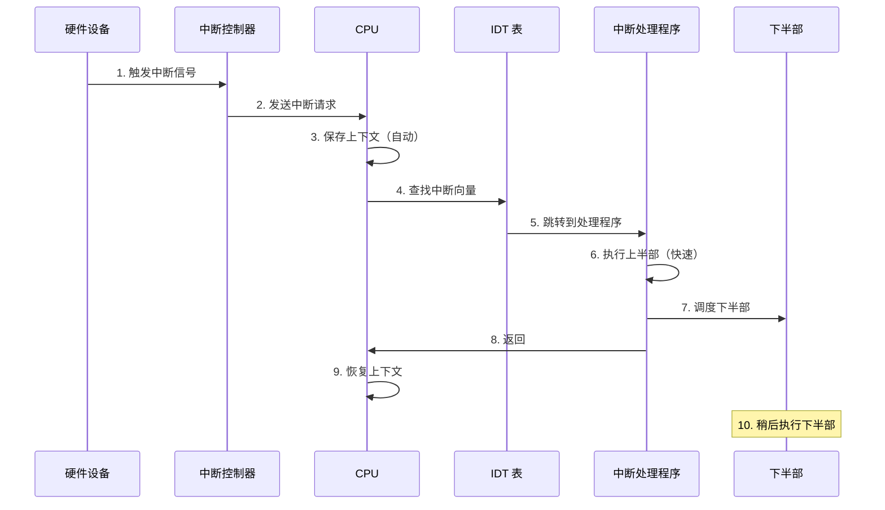
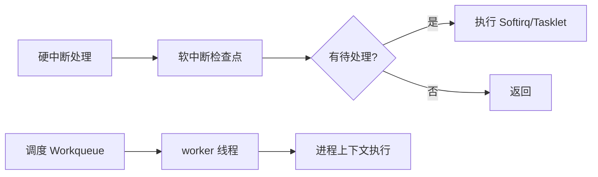

+++
title = "26.内核面试题-中断处理"
date = 2026-01-31
description = "Linux内核中断处理面试题：中断流程、下半部机制、中断亲和性深度解析"
[taxonomies]
tags = ["Linux", "内核", "面试", "中断", "Softirq"]
+++

# Linux 内核面试题 - 中断处理

本文汇集 Linux 内核中断处理相关的高频面试问题，采用问答深挖形式，模拟真实面试场景。

---

## 问题 1：描述 Linux 中断处理的完整流程

### 标准答案

**中断处理完整流程**：



**上半部 vs 下半部**：

| 特性 | 上半部（Top Half） | 下半部（Bottom Half） |
|------|-------------------|---------------------|
| 执行时机 | 立即，中断上下文 | 延迟 |
| 可睡眠 | ❌ 绝对不能 | Workqueue 可以 |
| 中断状态 | 禁用（本 IRQ）| 通常启用 |
| 时间要求 | 极短（<100μs）| 可较长 |
| 典型操作 | 确认中断、读寄存器、调度下半部 | 数据处理、协议栈 |
| 抢占 | 不可抢占 | Softirq/Tasklet 不可，Workqueue 可 |

### 面试官追问

**Q1: 上半部具体能做和不能做什么？**

```c
irqreturn_t my_irq_handler(int irq, void *dev_id) {
    struct my_device *dev = dev_id;
    u32 status;
    
    // ✅ 可以做的操作：
    
    // 1. 读取设备状态寄存器
    status = readl(dev->base + STATUS_REG);
    
    // 2. 检查是否是我们的中断
    if (!(status & MY_IRQ_FLAG))
        return IRQ_NONE;  // 不是我们的中断
    
    // 3. 清除中断标志（告诉硬件已收到）
    writel(status, dev->base + IRQ_ACK_REG);
    
    // 4. 读取少量紧急数据
    dev->rx_data = readl(dev->base + DATA_REG);
    
    // 5. 调度下半部
    tasklet_schedule(&dev->tasklet);
    // 或 schedule_work(&dev->work);
    
    // ❌ 不能做的操作：
    
    // mutex_lock(&some_mutex);  // 可能睡眠！
    // kmalloc(size, GFP_KERNEL);  // 可能睡眠！
    // copy_to_user(...);  // 可能缺页睡眠！
    // msleep(10);  // 睡眠！
    
    return IRQ_HANDLED;
}
```

**Q2: 中断返回值有哪些？分别表示什么？**

```c
// 中断处理返回值
IRQ_NONE       // (0) 不是我们的中断
IRQ_HANDLED    // (1) 已处理
IRQ_WAKE_THREAD // (2) 唤醒线程处理（threaded irq）

// 共享中断场景
// 多个设备共享同一个 IRQ 号
// 每个处理程序都会被调用，通过返回值区分

irqreturn_t shared_irq_handler(int irq, void *dev_id) {
    if (!is_my_interrupt())
        return IRQ_NONE;  // 让下一个处理程序检查
    
    // 处理中断
    return IRQ_HANDLED;
}
```

**Q3: 为什么要分上半部和下半部？**

```
问题：如果中断处理时间过长：
1. 其他中断被阻塞（高优先级除外）
2. 系统响应性下降
3. 可能丢失中断
4. 实时性无法保证

解决方案：上下半部分离
- 上半部：只做必须立即完成的工作（确认中断、保存数据）
- 下半部：在安全时机完成剩余工作

原则：把能推迟的工作都推迟到下半部
```

**Q4: 中断嵌套是如何处理的？**

```c
// Linux 2.6.35+ 默认禁止中断嵌套

// 旧版本（2.6.35 之前）：
// IRQF_DISABLED：禁用中断嵌套
// 无此标志：允许嵌套

// 现代内核：
// 处理中断时自动禁止同一 IRQ
// 不同 IRQ 可能嵌套（但通常不允许）

// 原因：嵌套增加复杂性，收益不大
// 现代系统使用线程化中断获得更好的确定性
```

---

## 问题 2：比较 Softirq、Tasklet、Workqueue、Threaded IRQ

### 标准答案

| 机制 | 执行上下文 | 可睡眠 | 并发性 | 延迟 | 适用场景 |
|------|-----------|--------|--------|------|----------|
| Softirq | 软中断上下文 | ❌ | 多 CPU 同类型并行 | 最低 | 网络、块设备 |
| Tasklet | 软中断上下文 | ❌ | 同一 tasklet 串行 | 低 | 驱动下半部 |
| Workqueue | 进程上下文 | ✅ | 可配置 | 中 | 需要睡眠的工作 |
| Threaded IRQ | 进程上下文 | ✅ | 每 IRQ 一线程 | 中 | 现代驱动推荐 |

**执行时机**：



### 面试官追问

**Q1: Softirq 有哪些类型？**

```c
// 内核定义的 softirq 类型（优先级从高到低）
enum {
    HI_SOFTIRQ = 0,        // 高优先级 tasklet
    TIMER_SOFTIRQ,         // 定时器
    NET_TX_SOFTIRQ,        // 网络发送
    NET_RX_SOFTIRQ,        // 网络接收
    BLOCK_SOFTIRQ,         // 块设备
    IRQ_POLL_SOFTIRQ,      // IRQ 轮询
    TASKLET_SOFTIRQ,       // 普通 tasklet
    SCHED_SOFTIRQ,         // 调度器
    HRTIMER_SOFTIRQ,       // 高精度定时器
    RCU_SOFTIRQ,           // RCU 回调
    NR_SOFTIRQS            // 数量
};

// Softirq 数量固定，编译时确定
// 驱动通常使用 Tasklet（动态创建）
```

**Q2: Tasklet 如何使用？**

```c
// 定义 tasklet
void my_tasklet_func(unsigned long data) {
    struct my_device *dev = (struct my_device *)data;
    // 处理数据，不能睡眠
}

DECLARE_TASKLET(my_tasklet, my_tasklet_func, 0);

// 动态初始化
struct tasklet_struct my_tasklet;
tasklet_init(&my_tasklet, my_tasklet_func, (unsigned long)dev);

// 在中断处理程序中调度
irqreturn_t my_handler(int irq, void *dev_id) {
    // 快速处理
    tasklet_schedule(&my_tasklet);  // 调度执行
    return IRQ_HANDLED;
}

// 清理
tasklet_kill(&my_tasklet);
```

**Q3: Workqueue 如何使用？**

```c
// 方法1：使用系统默认 workqueue
void my_work_func(struct work_struct *work) {
    struct my_device *dev = container_of(work, struct my_device, work);
    
    // 可以睡眠！
    mutex_lock(&dev->lock);
    // 处理数据
    mutex_unlock(&dev->lock);
}

DECLARE_WORK(my_work, my_work_func);

// 调度
schedule_work(&my_work);  // 使用系统 workqueue
schedule_delayed_work(&my_work, HZ);  // 延迟 1 秒

// 方法2：创建专用 workqueue
struct workqueue_struct *my_wq;
my_wq = alloc_workqueue("my_wq", WQ_HIGHPRI | WQ_UNBOUND, 0);

queue_work(my_wq, &my_work);

// 清理
cancel_work_sync(&my_work);
destroy_workqueue(my_wq);
```

**Q4: 为什么推荐 Threaded IRQ？**

```c
// Threaded IRQ：将中断处理放到内核线程中

// 传统方式
request_irq(irq, my_handler, IRQF_SHARED, "my_dev", dev);

// Threaded IRQ 方式
request_threaded_irq(irq,
    my_hardirq_handler,  // 上半部：快速确认
    my_thread_handler,   // 下半部：在线程中执行
    IRQF_ONESHOT,        // 线程完成前不重新使能中断
    "my_dev", dev);

// 上半部（可选，可以为 NULL）
irqreturn_t my_hardirq_handler(int irq, void *dev_id) {
    // 快速检查，确认中断
    return IRQ_WAKE_THREAD;  // 唤醒线程
}

// 线程处理函数
irqreturn_t my_thread_handler(int irq, void *dev_id) {
    struct my_device *dev = dev_id;
    
    // 可以睡眠！
    mutex_lock(&dev->lock);
    // 完整的中断处理
    mutex_unlock(&dev->lock);
    
    return IRQ_HANDLED;
}

// Threaded IRQ 优势：
// 1. 减少关中断时间
// 2. 可以使用睡眠操作
// 3. 可以设置线程优先级（实时系统）
// 4. 更好的调度灵活性
```

**Q5: ksoftirqd 线程的作用？**

```c
// ksoftirqd：每个 CPU 一个的内核线程
// 用于处理积压的软中断

// 触发条件：
// 1. 软中断处理时间过长（>2ms）
// 2. 软中断被重复触发（>10次）

// 工作原理：
// 正常情况：中断返回时处理软中断
// 积压情况：唤醒 ksoftirqd 线程处理

// 查看 ksoftirqd
$ ps aux | grep ksoftirqd
# 每个 CPU 一个：ksoftirqd/0, ksoftirqd/1, ...

// 问题：如果 ksoftirqd 占用太高
// 说明软中断太多，需要优化
```

---

## 问题 3：什么是中断亲和性？如何优化？

### 标准答案

**中断亲和性**：指定中断由哪些 CPU 处理，用于优化性能和降低延迟。

```bash
# 查看中断分布
$ cat /proc/interrupts
           CPU0       CPU1       CPU2       CPU3       
 24:     123456          0          0          0   IR-PCI-MSI  eth0-TxRx-0
 25:          0     234567          0          0   IR-PCI-MSI  eth0-TxRx-1
 26:          0          0     345678          0   IR-PCI-MSI  eth0-TxRx-2
 27:          0          0          0     456789   IR-PCI-MSI  eth0-TxRx-3

# 查看特定中断的亲和性
$ cat /proc/irq/24/smp_affinity
01  # 只在 CPU 0 上处理

# 设置亲和性（十六进制位掩码）
$ echo 2 > /proc/irq/24/smp_affinity   # CPU 1
$ echo 4 > /proc/irq/24/smp_affinity   # CPU 2
$ echo f > /proc/irq/24/smp_affinity   # CPU 0-3

# 使用 CPU 列表格式
$ echo 0-3 > /proc/irq/24/smp_affinity_list
$ echo 0,2 > /proc/irq/24/smp_affinity_list
```

### 面试官追问

**Q1: 什么是 RSS、RPS、RFS？**

```
RSS (Receive Side Scaling)：
- 硬件层面
- 网卡多队列，根据流哈希分发到不同 CPU
- 需要网卡支持

RPS (Receive Packet Steering)：
- 软件层面的 RSS
- 不需要硬件支持
- 在软中断中根据哈希分发

RFS (Receive Flow Steering)：
- 在 RPS 基础上
- 将数据包发送到处理该连接的应用所在 CPU
- 提高缓存命中率
```

```bash
# 启用 RPS
# 设置 CPU 掩码
echo ff > /sys/class/net/eth0/queues/rx-0/rps_cpus

# 启用 RFS
echo 32768 > /proc/sys/net/core/rps_sock_flow_entries
echo 4096 > /sys/class/net/eth0/queues/rx-0/rps_flow_cnt
```

**Q2: HFT 场景如何优化中断？**

```bash
# 1. 中断绑定到专用 CPU
echo 2 > /proc/irq/<nic_irq>/smp_affinity

# 2. 将业务进程绑定到其他 CPU
taskset -c 4-7 ./trading_app

# 3. 隔离 CPU
# /etc/default/grub
GRUB_CMDLINE_LINUX="isolcpus=4-7 nohz_full=4-7 rcu_nocbs=4-7"

# 4. 禁用 irqbalance
systemctl stop irqbalance
systemctl disable irqbalance

# 5. 关闭中断合并（降低延迟）
ethtool -C eth0 rx-usecs 0 tx-usecs 0

# 6. 增加网卡队列
ethtool -L eth0 combined 4
```

**Q3: 中断风暴如何处理？**

```c
// 中断风暴：设备持续触发大量中断
// 可能导致系统无响应

// 解决方案1：中断合并（Interrupt Coalescing）
// 硬件层面合并多个中断
ethtool -C eth0 rx-usecs 100 rx-frames 64

// 解决方案2：NAPI（网络场景）
// 切换到轮询模式
struct napi_struct napi;
netif_napi_add(netdev, &napi, my_poll, 64);

int my_poll(struct napi_struct *napi, int budget) {
    int work_done = 0;
    while (work_done < budget) {
        // 处理数据包
        work_done++;
    }
    if (work_done < budget) {
        napi_complete(napi);
        // 重新启用中断
    }
    return work_done;
}

// 解决方案3：禁用问题设备
// 紧急情况下的最后手段
```

---

## 问题 4：解释中断上下文和进程上下文

### 标准答案

**上下文类型**：

| 特性 | 进程上下文 | 中断上下文 |
|------|-----------|-----------|
| current 有效 | ✅ 指向当前进程 | ❌ 不可靠 |
| 可睡眠 | ✅ 可以 | ❌ 不能 |
| 可调度 | ✅ 可以 | ❌ 不能 |
| 用户空间访问 | ✅ 可以 | ❌ 不能 |
| 示例 | 系统调用处理 | 中断处理、Softirq |

### 面试官追问

**Q1: 如何判断当前是什么上下文？**

```c
// 内核提供的判断函数

// 是否在中断上下文（包括硬中断和软中断）
in_interrupt()

// 是否在硬中断上下文
in_irq()

// 是否在软中断上下文
in_softirq()

// 是否在 NMI 上下文
in_nmi()

// 是否可以调度（进程上下文且未持有锁）
!in_atomic()

// 示例
void my_function(void) {
    if (in_interrupt()) {
        // 使用 GFP_ATOMIC
        buf = kmalloc(size, GFP_ATOMIC);
    } else {
        // 使用 GFP_KERNEL
        buf = kmalloc(size, GFP_KERNEL);
    }
}
```

**Q2: 为什么中断上下文不能睡眠？**

```c
// 原因1：没有进程上下文
// 中断"借用"被中断进程的内核栈
// 但不是代表该进程运行
// 睡眠需要保存/恢复进程状态

// 原因2：死锁风险
spin_lock(&some_lock);
// 中断发生
// 中断处理中尝试 schedule() → 死锁

// 原因3：设计原则
// 中断应该尽快完成
// 让出 CPU 给正常进程

// 如果需要睡眠，使用：
// - Workqueue
// - Threaded IRQ
```

**Q3: 什么是中断栈？**

```c
// 每个 CPU 有独立的中断栈（不使用进程栈）

// 好处：
// 1. 不占用进程的内核栈空间
// 2. 避免栈溢出
// 3. 更好的隔离性

// 查看中断栈大小
$ dmesg | grep -i "irq stack"
# 通常 16KB 或 32KB

// 内核配置
CONFIG_HAVE_IRQ_EXIT_ON_IRQ_STACK=y

// x86_64 中断栈
struct irq_stack {
    char stack[IRQ_STACK_SIZE];
} __aligned(PAGE_SIZE);

DEFINE_PER_CPU(struct irq_stack, irq_stack);
```

---

## 问题 5：如何诊断中断相关问题？

### 标准答案

```bash
# 1. 查看中断统计
$ watch -n 1 'cat /proc/interrupts'

# 2. 查看软中断统计
$ cat /proc/softirqs
                    CPU0       CPU1       CPU2       CPU3
          HI:          0          0          0          0
       TIMER:    1234567    1234568    1234569    1234570
      NET_TX:         12         13         14         15
      NET_RX:     456789     456790     456791     456792
       BLOCK:       1234       1235       1236       1237
    ...

# 3. 中断频率（每秒）
$ vmstat 1
# in 列是每秒中断数

# 4. 中断处理时间
$ perf top -e irq:irq_handler_entry
$ perf record -e irq:irq_handler_entry -a sleep 10
$ perf report

# 5. 追踪中断事件
$ trace-cmd record -e irq -e softirq
$ trace-cmd report

# 6. 查看 ksoftirqd 负载
$ top -p $(pgrep -d, ksoftirqd)
```

### 面试官追问

**Q1: 如何诊断中断延迟？**

```bash
# 1. 使用 ftrace
$ echo irq > /sys/kernel/debug/tracing/current_tracer
$ cat /sys/kernel/debug/tracing/trace

# 2. 使用 cyclictest（实时性测试）
$ cyclictest -p 80 -t 1 -n
# 报告最大延迟

# 3. 使用 perf sched
$ perf sched record -a sleep 10
$ perf sched latency

# 4. 查看中断处理统计
$ cat /proc/irq/<irq>/spurious
# 查看是否有虚假中断

# 5. 查看中断禁用时间（需要 LOCKDEP）
# 内核会报告过长的关中断时间
```

**Q2: 如何优化中断性能？**

```bash
# 1. 使用多队列网卡
$ ethtool -l eth0  # 查看队列数
$ ethtool -L eth0 combined 8  # 设置 8 个队列

# 2. 中断亲和性
$ for i in $(ls /proc/irq/*/smp_affinity); do
    echo "Setting $i"
    echo 2 > $i
done

# 3. 中断合并（权衡延迟和吞吐）
$ ethtool -c eth0  # 查看当前设置
$ ethtool -C eth0 rx-usecs 50 rx-frames 16

# 4. 使用 Busy Polling
$ echo 50 > /proc/sys/net/core/busy_poll
$ echo 50 > /proc/sys/net/core/busy_read

# 5. 禁用不需要的中断源
$ echo disabled > /sys/class/net/eth0/device/interrupt_mitigation
```

---

## 问题 6：MSI/MSI-X 中断

### 标准答案

**MSI（Message Signaled Interrupts）**：
- 通过内存写操作发送中断
- 不使用物理中断线
- 支持更多中断向量

```c
// 传统 INTx 中断
// - 共享中断线
// - 需要 ACK 操作
// - 延迟较高

// MSI 中断
// - 每个设备独立
// - 无需 ACK（消息本身就是通知）
// - 延迟较低

// MSI-X 中断
// - 更多中断向量（最多 2048）
// - 每个向量可独立配置
// - 适合多队列设备
```

### 面试官追问

**Q1: 驱动如何使用 MSI-X？**

```c
// 分配 MSI-X 向量
int num_vecs = 4;
int ret = pci_alloc_irq_vectors(pdev, 1, num_vecs, PCI_IRQ_MSIX);
if (ret < 0) {
    // 回退到 MSI 或 INTx
    ret = pci_alloc_irq_vectors(pdev, 1, 1, PCI_IRQ_MSI | PCI_IRQ_LEGACY);
}

// 获取 IRQ 号
int irq = pci_irq_vector(pdev, vector_num);

// 注册处理程序
request_irq(irq, my_handler, 0, "my_dev", dev);

// 清理
free_irq(irq, dev);
pci_free_irq_vectors(pdev);
```

**Q2: 多队列网卡如何利用 MSI-X？**

```
网卡多队列 + MSI-X：
                  ┌─────────┐
                  │ 网卡    │
                  │         │
                  │ Queue 0 ├──── MSI-X 0 ──→ CPU 0
                  │ Queue 1 ├──── MSI-X 1 ──→ CPU 1
                  │ Queue 2 ├──── MSI-X 2 ──→ CPU 2
                  │ Queue 3 ├──── MSI-X 3 ──→ CPU 3
                  │         │
                  └─────────┘

优势：
1. 每个队列独立中断
2. 中断分布到多个 CPU
3. 并行处理，提高吞吐
4. 减少锁竞争
```

---

## 高频考点总结

| 考点 | 频率 | 深度要求 |
|------|------|----------|
| 中断处理流程 | ★★★ | 上下半部分离 |
| 下半部机制比较 | ★★★ | Softirq/Tasklet/Workqueue/Threaded |
| Threaded IRQ | ★★★ | 使用方法和优势 |
| 中断亲和性 | ★★☆ | 设置方法和优化 |
| RSS/RPS/RFS | ★★☆ | 概念和使用场景 |
| 中断上下文 | ★★★ | 限制和判断方法 |
| MSI/MSI-X | ★★☆ | 概念和使用 |
| 中断诊断 | ★★☆ | 工具使用 |

---

## 相关文章

- [上一篇：内核面试题-同步机制](/articles/linux/linux-25-内核面试题-同步机制/)
- [下一篇：内核面试题-系统调用](/articles/linux/linux-27-内核面试题-系统调用/)
