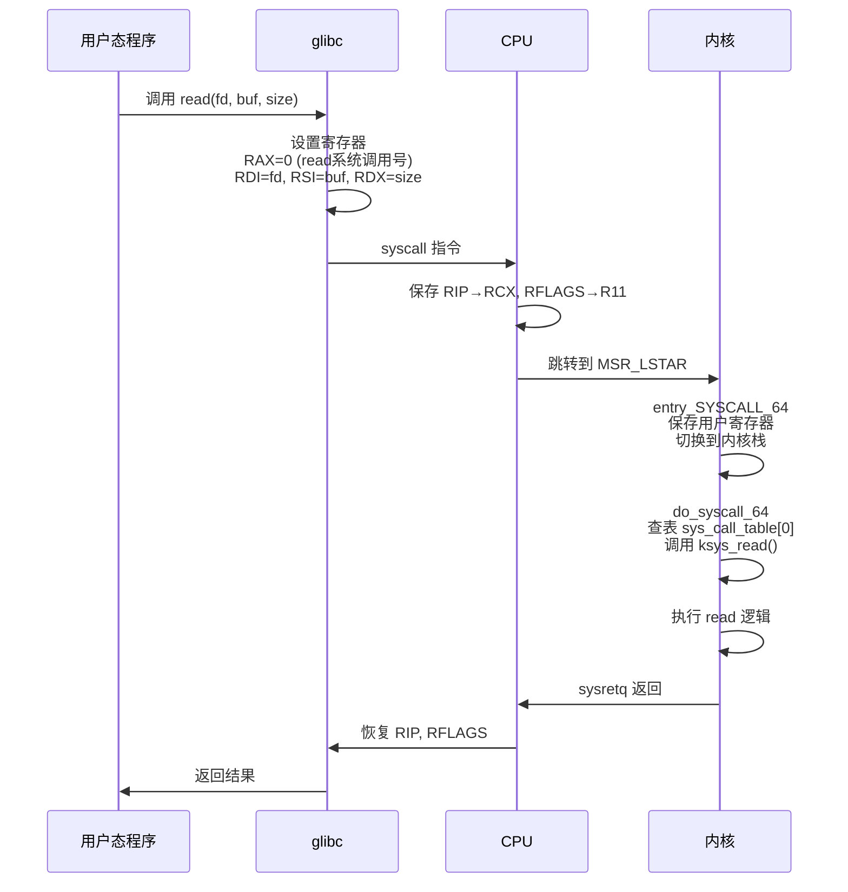

+++
title = "内核面试题-系统调用"
date = 2026-01-31
weight = 27000
description = "Linux内核系统调用面试题：syscall机制、vDSO、性能优化深度解析"
[taxonomies]
tags = ["Linux", "内核", "面试", "系统调用", "vDSO"]
+++

# Linux 内核面试题 - 系统调用

本文汇集 Linux 内核系统调用相关的高频面试问题，采用问答深挖形式，模拟真实面试场景。

---

## 问题 1：描述系统调用的完整流程

### 标准答案

**x86_64 系统调用流程**：



**详细步骤说明**：

```asm
# 用户态（glibc syscall wrapper）
mov $0, %rax        # 系统调用号（read = 0）
mov fd, %rdi        # 第1个参数
mov buf, %rsi       # 第2个参数
mov size, %rdx      # 第3个参数
syscall             # 触发系统调用

# syscall 指令执行：
# 1. RCX = RIP（保存返回地址）
# 2. R11 = RFLAGS（保存标志寄存器）
# 3. RIP = MSR_LSTAR（跳转到内核入口）
# 4. 切换到 Ring 0

# 内核态（entry_SYSCALL_64）
# 1. 切换到内核栈
# 2. 保存所有用户寄存器到 pt_regs
# 3. 调用 do_syscall_64(regs)
# 4. 查找 sys_call_table[rax]
# 5. 执行具体的系统调用函数
# 6. 返回值放入 rax
# 7. sysretq 返回用户态
```

### 面试官追问

**Q1: syscall 和 int 0x80 的区别？**

| 特性 | syscall/sysret | int 0x80/iret |
|------|----------------|---------------|
| 架构 | 仅 64 位 | 32 位（可在 64 位兼容）|
| 速度 | 快（~100 周期） | 慢（~300 周期） |
| 权限切换 | 直接修改段寄存器 | 通过 IDT 查表 |
| 参数寄存器 | RDI,RSI,RDX,R10,R8,R9 | EBX,ECX,EDX,ESI,EDI,EBP |
| 返回值 | RAX | EAX |
| 系统调用号 | RAX（64位编号） | EAX（32位编号） |

```c
// 现代系统使用 syscall
// int 0x80 仅用于 32 位兼容

// glibc 对应的入口
// 64位：ENTRY(syscall)
// 32位：ENTRY(__kernel_vsyscall)
```

**Q2: 系统调用的开销来源是什么？**

**系统调用开销分解：**

| 阶段 | 开销 | 说明 |
|------|------|------|
| 1. 用户态 → 内核态切换 | ~50-100 周期 | 权限级别变化，切换到内核栈 |
| 2. 保存/恢复用户寄存器 | ~20-50 周期 | pt_regs 结构体 |
| 3. 安全检查 | ~10-20 周期 | 系统调用号验证，参数验证 |
| 4. 实际系统调用执行 | 变化 | 取决于具体操作 |
| 5. Spectre 缓解 | ~50-100 周期 | retpoline、KPTI |
| 6. 内核态 → 用户态返回 | ~50-100 周期 | sysretq 执行 |

**总计：** 典型的空系统调用约 200-400 周期（~100ns @ 3GHz），加上 Spectre 缓解可能更多

**Q3: 什么是 KPTI？对系统调用有什么影响？**

```c
// KPTI = Kernel Page Table Isolation
// 用于缓解 Meltdown 漏洞

// 原理：
// - 用户态和内核态使用不同的页表
// - 用户态页表不包含内核映射（除了必要部分）

// 对系统调用的影响：
// 进入内核时：切换到内核页表
// 返回用户态：切换回用户页表
// 每次切换都要写 CR3，刷新 TLB

// 性能影响：
// - 无 PCID：每次切换刷新整个 TLB，开销大
// - 有 PCID：只切换页表，不刷新 TLB，开销较小

// 检查是否启用
$ cat /sys/devices/system/cpu/vulnerabilities/meltdown
Mitigation: PTI

// 禁用（不推荐，有安全风险）
# 内核参数：nopti
```

---

## 问题 2：什么是 vDSO？如何使用？

### 标准答案

**vDSO（virtual Dynamic Shared Object）**：
- 内核自动映射到每个进程地址空间的共享库
- 提供部分系统调用的用户态快速实现
- 无需真正陷入内核

**进程地址空间中的 vDSO：**

| 区域 | 大小 | 内容 |
|------|------|------|
| 用户空间 | - | 应用程序代码和数据 |
| vDSO（内核映射，只读） | ~4KB | `__vdso_gettimeofday`、`__vdso_clock_gettime`、`__vdso_getcpu` |
| vvar（内核数据，只读） | - | 当前时间、时钟参数等 |

**支持的函数**：

| 函数 | 传统开销 | vDSO 开销 | 加速比 |
|------|----------|-----------|--------|
| gettimeofday | ~200ns | ~20ns | 10x |
| clock_gettime | ~200ns | ~20ns | 10x |
| getcpu | ~200ns | ~10ns | 20x |
| time | ~200ns | ~20ns | 10x |

### 面试官追问

**Q1: vDSO 是如何实现快速时间获取的？**

```c
// vvar 区域包含内核维护的时间数据
struct vdso_data {
    u32 seq;                    // 序列号（检测更新）
    s32 clock_mode;             // 时钟类型
    u64 cycle_last;             // 上次更新的 TSC 值
    u64 mask;                   // TSC 掩码
    u32 mult;                   // 乘数（用于转换）
    u32 shift;                  // 位移（用于转换）
    struct vdso_timestamp basetime[VDSO_BASES];
    s32 tz_minuteswest;
    s32 tz_dsttime;
};

// vDSO 中的 clock_gettime 实现（简化）
int __vdso_clock_gettime(clockid_t clk, struct timespec *ts) {
    struct vdso_data *vd = __arch_get_vdso_data();
    u64 cycles, ns;
    u32 seq;
    
    do {
        seq = vd->seq;          // 读取序列号
        smp_rmb();              // 读屏障
        
        cycles = rdtsc();       // 读取 TSC
        ns = (cycles - vd->cycle_last) * vd->mult >> vd->shift;
        ts->tv_sec = vd->basetime[clk].sec;
        ts->tv_nsec = vd->basetime[clk].nsec + ns;
        
        smp_rmb();              // 读屏障
    } while (seq != vd->seq);   // 检查是否有更新
    
    // 规范化 nsec
    while (ts->tv_nsec >= 1000000000) {
        ts->tv_nsec -= 1000000000;
        ts->tv_sec++;
    }
    
    return 0;
}

// 完全在用户态执行，无系统调用！
```

**Q2: 如何查看进程的 vDSO 映射？**

```bash
# 查看 vDSO 映射
$ cat /proc/self/maps | grep vdso
7fff12345000-7fff12346000 r-xp 00000000 00:00 0   [vdso]

# 查看 vvar 映射
$ cat /proc/self/maps | grep vvar
7fff12344000-7fff12345000 r--p 00000000 00:00 0   [vvar]

# 提取 vDSO
$ dd if=/proc/self/mem of=vdso.so bs=1 count=4096 skip=$((0x7fff12345000))

# 反汇编查看
$ objdump -d vdso.so
```

**Q3: 什么情况下 vDSO 会回退到真正的系统调用？**

```c
// 回退条件：
// 1. 时钟类型不支持 vDSO 实现
if (clk == CLOCK_PROCESS_CPUTIME_ID)
    return syscall(SYS_clock_gettime, clk, ts);

// 2. 时钟模式不支持
if (vd->clock_mode == VDSO_CLOCKMODE_NONE)
    return syscall(...);

// 3. 虚拟化环境 TSC 不可靠
// 某些虚拟机的 TSC 不单调递增

// 4. 内核禁用了 vDSO
# 内核参数：vdso=0
```

---

## 问题 3：如何添加一个新的系统调用？

### 标准答案

**添加系统调用的步骤**：

```c
// 步骤1：定义系统调用函数（kernel/sys.c 或新文件）

#include <linux/syscalls.h>

SYSCALL_DEFINE2(my_syscall, int, arg1, const char __user *, arg2)
{
    char kbuf[256];
    int ret;
    
    // 验证用户指针
    if (!access_ok(arg2, 256))
        return -EFAULT;
    
    // 从用户空间复制数据
    ret = strncpy_from_user(kbuf, arg2, sizeof(kbuf));
    if (ret < 0)
        return ret;
    
    // 实现功能
    pr_info("my_syscall called: arg1=%d, arg2=%s\n", arg1, kbuf);
    
    return 0;
}
```

```
// 步骤2：添加到系统调用表
// 文件：arch/x86/entry/syscalls/syscall_64.tbl

// 格式：号码  ABI    名称          入口函数
335     common  my_syscall      sys_my_syscall
```

```c
// 步骤3：添加头文件声明
// 文件：include/linux/syscalls.h

asmlinkage long sys_my_syscall(int arg1, const char __user *arg2);
```

```c
// 步骤4：用户态调用
#include <unistd.h>
#include <sys/syscall.h>

#define SYS_my_syscall 335

int my_syscall(int arg1, const char *arg2) {
    return syscall(SYS_my_syscall, arg1, arg2);
}

int main() {
    int ret = my_syscall(42, "hello");
    printf("ret = %d\n", ret);
    return 0;
}
```

### 面试官追问

**Q1: SYSCALL_DEFINEn 宏的作用是什么？**

```c
// SYSCALL_DEFINEn 做了很多工作：

// 1. 处理不同架构的参数传递
// 某些架构对齐要求不同

// 2. 提供类型安全
// 参数类型检查

// 3. 支持系统调用追踪
// ftrace、perf 等工具可以追踪

// 4. 生成元数据
// 参数名称和类型信息

// 宏展开示例（简化）
#define SYSCALL_DEFINE2(name, t1, a1, t2, a2) \
    static inline long SYSC_##name(t1 a1, t2 a2); \
    asmlinkage long sys_##name(t1 a1, t2 a2) { \
        return SYSC_##name(a1, a2); \
    } \
    static inline long SYSC_##name(t1 a1, t2 a2)
```

**Q2: 如何安全地访问用户空间内存？**

```c
// 必须使用专用函数访问用户空间内存

// 1. 验证访问权限
access_ok(user_ptr, size);  // 返回 true/false

// 2. 复制数据
copy_from_user(kernel_buf, user_buf, size);
copy_to_user(user_buf, kernel_buf, size);

// 3. 字符串操作
strncpy_from_user(kernel_str, user_str, max_len);

// 4. 单值操作
get_user(kernel_var, user_ptr);
put_user(kernel_var, user_ptr);

// 为什么不能直接访问？
// 1. 用户指针可能无效
// 2. 可能触发缺页，需要正确处理
// 3. 安全检查（防止内核信息泄露）

// 错误示例（危险！）
char *user_str = arg2;
printk("%s\n", user_str);  // 危险！可能内核崩溃

// 正确示例
char kbuf[256];
if (copy_from_user(kbuf, arg2, 255)) {
    return -EFAULT;
}
kbuf[255] = '\0';
printk("%s\n", kbuf);  // 安全
```

**Q3: 系统调用如何返回错误？**

```c
// 系统调用通过返回负数表示错误
// 错误码定义在 include/uapi/asm-generic/errno.h

// 常用错误码
-EINVAL    // 无效参数
-EFAULT    // 无效地址
-ENOMEM    // 内存不足
-ENOENT    // 文件不存在
-EACCES    // 权限不足
-EBUSY     // 设备忙

// glibc 转换
// 系统调用返回 -EINVAL
// glibc 设置 errno = EINVAL，返回 -1

// 内核中的宏
return -EINVAL;  // 直接返回负数

// 检查指针参数
if (!user_ptr)
    return -EINVAL;

// 检查权限
if (!capable(CAP_SYS_ADMIN))
    return -EPERM;
```

---

## 问题 4：系统调用有哪些优化手段？

### 标准答案

| 优化方法 | 原理 | 适用场景 | 效果 |
|----------|------|----------|------|
| vDSO | 用户态实现 | 时间获取 | 10x 加速 |
| io_uring | 共享内存队列 | 高频 I/O | 减少 syscall |
| 批量操作 | 一次调用多个 | 网络发送 | 减少次数 |
| 零拷贝 | 避免数据拷贝 | 文件传输 | 减少内存带宽 |

### 面试官追问

**Q1: io_uring 是什么？如何工作？**

```c
// io_uring：Linux 5.1+ 的高性能异步 I/O 接口

// 核心概念：
// SQ (Submission Queue)：提交队列
// CQ (Completion Queue)：完成队列
// 两个队列在用户和内核之间共享

// 工作流程：
// 1. 用户填充 SQE（提交队列条目）
// 2. 更新 SQ tail 指针
// 3. （可选）调用 io_uring_enter 通知内核
// 4. 内核处理请求
// 5. 内核填充 CQE（完成队列条目）
// 6. 用户读取完成结果
```

```c
#include <liburing.h>

// 初始化
struct io_uring ring;
io_uring_queue_init(256, &ring, 0);

// 提交读请求
struct io_uring_sqe *sqe = io_uring_get_sqe(&ring);
io_uring_prep_read(sqe, fd, buf, size, offset);
sqe->user_data = my_request_id;  // 标识请求

// 提交（批量）
io_uring_submit(&ring);

// 获取完成
struct io_uring_cqe *cqe;
io_uring_wait_cqe(&ring, &cqe);
int result = cqe->res;
uint64_t request_id = cqe->user_data;
io_uring_cqe_seen(&ring, cqe);

// 优势：
// 1. 可以批量提交（一次 syscall 提交多个请求）
// 2. SQPOLL 模式：内核线程轮询，完全无 syscall
// 3. 支持链式请求
// 4. 减少用户态/内核态切换
```

**Q2: 零拷贝技术有哪些？**

```c
// 1. sendfile：文件→socket 直传
ssize_t sendfile(int out_fd, int in_fd, off_t *offset, size_t count);

// 传统方式：
// read(file) → 用户缓冲 → write(socket)
// 4次上下文切换，4次数据拷贝

// sendfile：
// 内核直接从文件读取到 socket 缓冲
// 2次上下文切换，2次数据拷贝（可能更少）

// 2. splice：管道数据传输
ssize_t splice(int fd_in, off_t *off_in,
               int fd_out, off_t *off_out,
               size_t len, unsigned int flags);

// 3. mmap + write
void *ptr = mmap(NULL, size, PROT_READ, MAP_SHARED, fd, 0);
write(socket_fd, ptr, size);

// 4. MSG_ZEROCOPY（发送）
setsockopt(fd, SOL_SOCKET, SO_ZEROCOPY, &one, sizeof(one));
send(fd, buf, len, MSG_ZEROCOPY);

// 5. io_uring 注册缓冲区
io_uring_register_buffers(&ring, iovecs, nr_iovecs);
```

**Q3: 如何测量系统调用开销？**

```c
#include <time.h>

int main() {
    struct timespec start, end;
    int iterations = 1000000;
    
    clock_gettime(CLOCK_MONOTONIC, &start);
    
    for (int i = 0; i < iterations; i++) {
        getpid();  // 最简单的系统调用
    }
    
    clock_gettime(CLOCK_MONOTONIC, &end);
    
    long ns = (end.tv_sec - start.tv_sec) * 1000000000L +
              (end.tv_nsec - start.tv_nsec);
    
    printf("Average syscall overhead: %ld ns\n", ns / iterations);
    
    return 0;
}

// 典型结果：
// 无缓解：~100ns
// 有 KPTI：~200ns
// 有 Spectre 缓解：~300ns
```

```bash
# 使用 perf 测量
$ perf stat -e raw_syscalls:sys_enter ./program
```

---

## 问题 5：seccomp 和系统调用过滤

### 标准答案

**seccomp（Secure Computing Mode）**：
- 限制进程可以使用的系统调用
- 用于沙箱化和安全隔离

```c
#include <seccomp.h>

// 方式1：严格模式（只允许 read, write, exit, sigreturn）
prctl(PR_SET_SECCOMP, SECCOMP_MODE_STRICT);

// 方式2：BPF 过滤器（更灵活）
scmp_filter_ctx ctx = seccomp_init(SCMP_ACT_KILL);  // 默认杀死

// 添加允许的系统调用
seccomp_rule_add(ctx, SCMP_ACT_ALLOW, SCMP_SYS(read), 0);
seccomp_rule_add(ctx, SCMP_ACT_ALLOW, SCMP_SYS(write), 0);
seccomp_rule_add(ctx, SCMP_ACT_ALLOW, SCMP_SYS(exit), 0);

// 应用规则
seccomp_load(ctx);

// 此后只能使用允许的系统调用
```

### 面试官追问

**Q1: seccomp 用在哪些地方？**

```
应用场景：
1. 容器运行时（Docker、containerd）
   限制容器内进程的系统调用

2. 浏览器沙箱（Chrome、Firefox）
   渲染进程不能执行危险操作

3. SSH ForceCommand
   限制特定用户的能力

4. systemd 服务
   SystemCallFilter= 配置

# 查看 Docker 的 seccomp 配置
$ docker run --security-opt seccomp=profile.json ...
```

**Q2: 如何调试 seccomp 问题？**

```bash
# 1. 使用 strace 查看被阻止的系统调用
$ strace -f ./program 2>&1 | grep -i seccomp

# 2. 使用 audit
$ auditctl -a exit,always -F arch=b64 -S all
$ ausearch -m SECCOMP

# 3. 使用 syslog
# seccomp 会记录被阻止的调用

# 4. 开发时使用 SCMP_ACT_LOG
seccomp_rule_add(ctx, SCMP_ACT_LOG, SCMP_SYS(dangerous_call), 0);
```

---

## 问题 6：系统调用追踪和调试

### 标准答案

```bash
# 1. strace - 用户态追踪
$ strace -f -tt -T -o trace.log ./program
# -f: 跟踪子进程
# -tt: 显示微秒级时间戳
# -T: 显示每个调用耗时
# -o: 输出到文件

# 只追踪特定系统调用
$ strace -e trace=open,read,write ./program

# 追踪网络相关
$ strace -e trace=network ./program

# 2. ltrace - 库函数追踪
$ ltrace ./program

# 3. perf - 性能分析
$ perf trace ./program
$ perf stat -e raw_syscalls:sys_enter ./program

# 4. ftrace - 内核追踪
$ echo 1 > /sys/kernel/debug/tracing/events/syscalls/enable
$ cat /sys/kernel/debug/tracing/trace_pipe

# 5. bpftrace - eBPF 追踪
$ bpftrace -e 'tracepoint:syscalls:sys_enter_read { @[comm] = count(); }'
```

### 面试官追问

**Q1: 如何统计系统调用频率？**

```bash
# 使用 strace
$ strace -c ./program
% time     seconds  usecs/call     calls    errors syscall
------ ----------- ----------- --------- --------- ----------------
 45.23    0.001234           5       234           read
 32.10    0.000876           4       219           write
 12.34    0.000337           3       112           open
...

# 使用 perf
$ perf stat -e 'syscalls:sys_enter_*' ./program

# 使用 bpftrace
$ bpftrace -e '
tracepoint:raw_syscalls:sys_enter {
    @syscalls[args->id] = count();
}
END {
    print(@syscalls);
}'
```

**Q2: 如何追踪系统调用参数和返回值？**

```bash
# strace 显示详细参数
$ strace -v -s 1000 ./program
# -v: 详细输出
# -s 1000: 字符串最大长度

# 使用 bpftrace
$ bpftrace -e '
tracepoint:syscalls:sys_enter_open {
    printf("%s open(%s)\n", comm, str(args->filename));
}
tracepoint:syscalls:sys_exit_open {
    printf("  = %d\n", args->ret);
}'
```

---

## 高频考点总结

| 考点 | 频率 | 深度要求 |
|------|------|----------|
| syscall 流程 | ★★★ | 寄存器使用，指令序列 |
| syscall vs int 0x80 | ★★★ | 区别和性能差异 |
| vDSO | ★★★ | 原理和支持的函数 |
| 系统调用开销 | ★★★ | 来源和优化方法 |
| 添加系统调用 | ★★☆ | 步骤和宏 |
| io_uring | ★★★ | 工作原理和优势 |
| 零拷贝 | ★★☆ | sendfile、splice |
| seccomp | ★★☆ | 概念和使用场景 |
| 系统调用追踪 | ★★☆ | strace、perf |

---

## 相关文章

- [上一篇：内核面试题-中断处理](@/articles/linux/linux-26-内核面试题-中断处理.md)
- [下一篇：内核笔试题-文件系统与VFS](@/articles/linux/linux-28-内核笔试题-文件系统与VFS.md)
