+++
title = "内核笔试题-文件系统与VFS"
date = 2026-01-31
weight = 28000
description = "Linux内核文件系统与VFS笔试题：VFS架构、inode、dentry、页缓存、文件操作深度解析"
[taxonomies]
tags = ["Linux", "笔试", "VFS", "文件系统", "inode", "页缓存"]
+++

# Linux 内核笔试题 - 文件系统与 VFS

本文汇集 Linux 内核文件系统与 VFS（虚拟文件系统）相关的高频笔试题，涵盖 VFS 架构、核心数据结构、文件操作流程、页缓存机制等核心知识点。

---

## 第一部分：VFS 架构与核心概念

### 题目 1：VFS 的作用与架构

**问题**：请描述 Linux VFS（虚拟文件系统）的作用，并画出其架构层次图。

**参考答案**：

**VFS 的核心作用**：
1. 抽象层：为不同文件系统提供统一接口
2. 统一视图：让用户态程序无需关心底层文件系统类型
3. 缓存管理：统一管理页缓存、目录缓存
4. 命名空间：统一的路径解析和挂载点管理

**VFS 架构层次**：

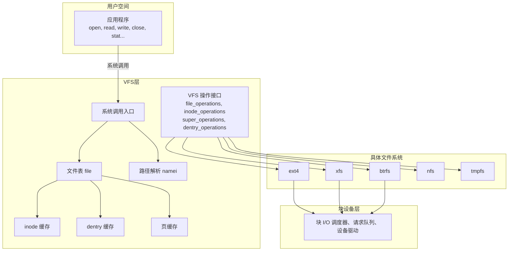

**VFS 四大核心对象**：

| 对象 | 结构体 | 描述 |
|------|--------|------|
| 超级块 | `struct super_block` | 描述已挂载的文件系统 |
| inode | `struct inode` | 描述文件的元数据 |
| dentry | `struct dentry` | 目录项，连接文件名与 inode |
| file | `struct file` | 描述进程打开的文件 |

---

### 题目 2：VFS 核心数据结构关系

**问题**：请画图说明 `super_block`、`inode`、`dentry`、`file` 之间的关系。

**参考答案**：

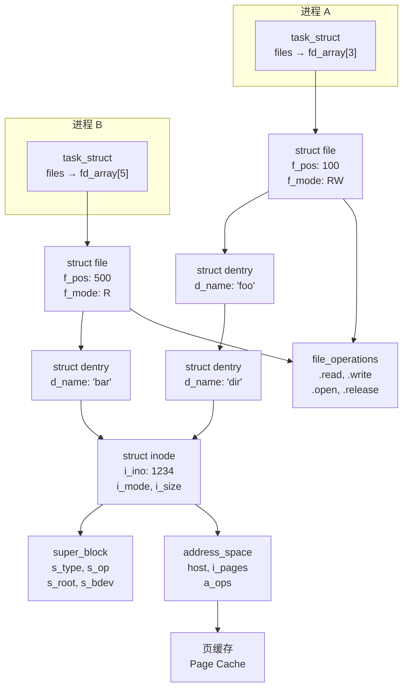

**关键关系说明**：

```c
// 1. 进程通过 fd 找到 file
struct file *f = current->files->fd_array[fd];

// 2. file 通过 f_path 找到 dentry
struct dentry *dentry = f->f_path.dentry;

// 3. dentry 指向 inode
struct inode *inode = dentry->d_inode;

// 4. inode 属于某个 super_block
struct super_block *sb = inode->i_sb;

// 5. inode 的 address_space 管理页缓存
struct address_space *mapping = inode->i_mapping;
```

---

### 题目 3：inode 结构详解

**问题**：请详细描述 `struct inode` 的关键字段及其作用。

**参考答案**：

```c
struct inode {
    /* ===== 标识信息 ===== */
    umode_t             i_mode;      // 文件类型和权限
    unsigned short      i_opflags;   // 操作标志
    kuid_t              i_uid;       // 所有者 UID
    kgid_t              i_gid;       // 所有者 GID
    unsigned int        i_flags;     // 文件系统挂载标志
    
    /* ===== 文件系统特定 ===== */
    const struct inode_operations *i_op;   // inode 操作
    struct super_block  *i_sb;             // 所属超级块
    struct address_space *i_mapping;       // 页缓存映射
    
    /* ===== 安全相关 ===== */
#ifdef CONFIG_SECURITY
    void                *i_security;  // 安全模块数据
#endif
    
    /* ===== 文件属性 ===== */
    unsigned long       i_ino;       // inode 编号
    union {
        const unsigned int i_nlink;  // 硬链接计数
        unsigned int __i_nlink;
    };
    dev_t               i_rdev;      // 设备号（设备文件）
    loff_t              i_size;      // 文件大小（字节）
    
    /* ===== 时间戳 ===== */
    struct timespec64   i_atime;     // 最后访问时间
    struct timespec64   i_mtime;     // 最后修改时间
    struct timespec64   i_ctime;     // 元数据修改时间
    
    /* ===== 锁 ===== */
    spinlock_t          i_lock;      // 自旋锁
    unsigned short      i_bytes;     // 最后不完整块的字节数
    u8                  i_blkbits;   // 块大小（位）
    u8                  i_write_hint;// 写入提示
    blkcnt_t            i_blocks;    // 占用块数
    
    /* ===== 状态 ===== */
    unsigned long       i_state;     // inode 状态标志
    struct rw_semaphore i_rwsem;     // 读写信号量
    
    /* ===== 目录项链表 ===== */
    struct hlist_head   i_dentry;    // 指向此 inode 的 dentry 链表
    
    /* ===== 文件操作 ===== */
    const struct file_operations *i_fop;  // 默认文件操作
    
    /* ===== 页缓存 ===== */
    struct address_space i_data;     // 内嵌的 address_space
    
    /* ===== 特殊文件类型 ===== */
    union {
        struct pipe_inode_info *i_pipe;   // 管道
        struct cdev            *i_cdev;    // 字符设备
        char                   *i_link;    // 符号链接
        unsigned               i_dir_seq;  // 目录序列号
    };
    
    /* ===== 文件系统私有 ===== */
    void                *i_private;  // 文件系统私有数据
};
```

**inode 状态标志（i_state）**：

| 标志 | 值 | 描述 |
|------|-----|------|
| I_DIRTY_SYNC | 1 | 元数据需要同步 |
| I_DIRTY_DATASYNC | 2 | 数据需要同步 |
| I_DIRTY_PAGES | 4 | 脏页需要写回 |
| I_NEW | 8 | 新创建的 inode |
| I_WILL_FREE | 16 | 即将释放 |
| I_FREEING | 32 | 正在释放 |
| I_CLEAR | 64 | 已清理 |
| I_SYNC | 128 | 正在同步 |

---

### 题目 4：dentry 缓存机制

**问题**：请解释 dentry 缓存的工作原理，包括 LRU 管理和负面 dentry。

**参考答案**：

```c
struct dentry {
    /* ===== 标志和引用计数 ===== */
    unsigned int d_flags;           // dentry 标志
    seqcount_spinlock_t d_seq;      // 序列锁
    struct hlist_bl_node d_hash;    // 哈希表链接
    struct dentry *d_parent;        // 父目录 dentry
    struct qstr d_name;             // 文件名
    struct inode *d_inode;          // 关联的 inode（可为 NULL）
    unsigned char d_iname[DNAME_INLINE_LEN];  // 短文件名内联存储
    
    /* ===== 引用计数 ===== */
    struct lockref d_lockref;       // 锁 + 引用计数
    
    /* ===== 操作 ===== */
    const struct dentry_operations *d_op;  // dentry 操作
    struct super_block *d_sb;       // 所属超级块
    
    /* ===== LRU 链表 ===== */
    struct list_head d_lru;         // LRU 链表
    struct list_head d_child;       // 父目录的子项链表
    struct list_head d_subdirs;     // 子目录链表
    
    /* ===== RCU 和别名 ===== */
    union {
        struct hlist_node d_alias;  // inode 的别名链表
        struct hlist_bl_node d_in_lookup_hash;
        struct rcu_head d_rcu;      // RCU 回收
    } d_u;
    
    void *d_fsdata;                 // 文件系统私有数据
};
```

**dentry 缓存架构**：

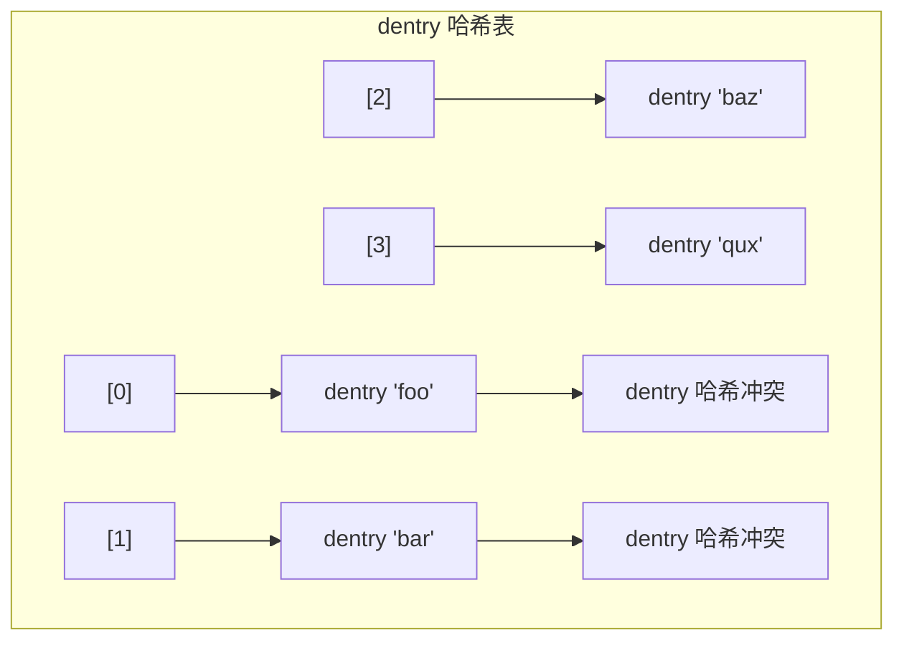

**LRU 链表：**

| 位置 | 状态 | 说明 |
|------|------|------|
| 最近使用 (头部) | ref:0 | 刚被释放引用的 dentry |
| ↓ | ref:0 | 按使用时间排序 |
| 最少使用 (尾部) | ref:0 | 内存压力时从这里回收 |

**负面 dentry（Negative Dentry）**：

```c
/*
 * 负面 dentry：d_inode == NULL
 * 用于缓存"文件不存在"的查找结果
 * 
 * 好处：
 * 1. 避免重复查找不存在的文件
 * 2. 减少磁盘 I/O
 * 3. 常见场景：shell 遍历 PATH 查找命令
 */

// 创建负面 dentry
struct dentry *d_alloc_negative(struct dentry *parent, 
                                const struct qstr *name) {
    struct dentry *dentry = d_alloc(parent, name);
    if (dentry) {
        // d_inode 保持 NULL，表示文件不存在
        spin_lock(&dentry->d_lock);
        dentry->d_flags |= DCACHE_NEGATIVE;
        spin_unlock(&dentry->d_lock);
    }
    return dentry;
}

// 检查是否为负面 dentry
static inline bool d_is_negative(const struct dentry *dentry) {
    return d_is_really_negative(dentry);
}

// 负面 dentry 转换为正面
// 当文件被创建时调用
void d_instantiate(struct dentry *entry, struct inode *inode) {
    // 将 inode 关联到 dentry
    __d_instantiate(entry, inode);
}
```

**dentry 状态转换**：

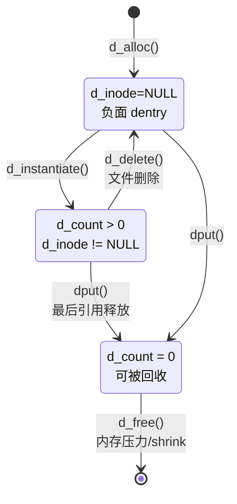

---

## 第二部分：文件操作流程

### 题目 5：open() 系统调用流程

**问题**：详细描述 `open()` 系统调用的内核执行流程。

**参考答案**：

```c
/* open() 系统调用完整流程 */

// 用户态
int fd = open("/home/user/file.txt", O_RDWR);

// 内核态流程：
```

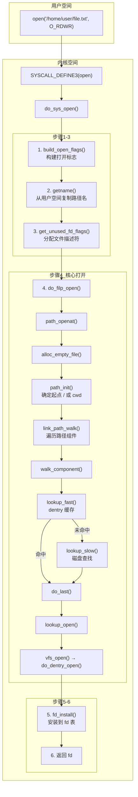

**路径解析详解（namei）**：

```c
// link_path_walk 伪代码
int link_path_walk(const char *name, struct nameidata *nd) {
    while (*name == '/')
        name++;  // 跳过前导斜杠
    
    while (*name) {
        // 提取下一个路径组件
        const char *next = strchrnul(name, '/');
        int len = next - name;
        struct qstr this = { .name = name, .len = len };
        
        // 计算哈希值
        this.hash = full_name_hash(nd->path.dentry, name, len);
        
        // 检查权限（执行权限用于目录）
        err = may_lookup(nd);
        if (err)
            return err;
        
        // 查找组件
        err = walk_component(nd, &this, WALK_MORE);
        if (err)
            return err;
        
        // 处理 "." 和 ".."
        if (this.name[0] == '.') {
            if (this.len == 1)
                continue;  // 当前目录
            if (this.len == 2 && this.name[1] == '.')
                goto_parent(nd);  // 父目录
        }
        
        // 处理符号链接
        if (d_is_symlink(nd->path.dentry)) {
            err = handle_symlink(nd);
            if (err)
                return err;
        }
        
        name = next;
        while (*name == '/')
            name++;
    }
    return 0;
}
```

---

### 题目 6：read() 系统调用流程

**问题**：描述 `read()` 系统调用的执行流程，包括页缓存的作用。

**参考答案**：

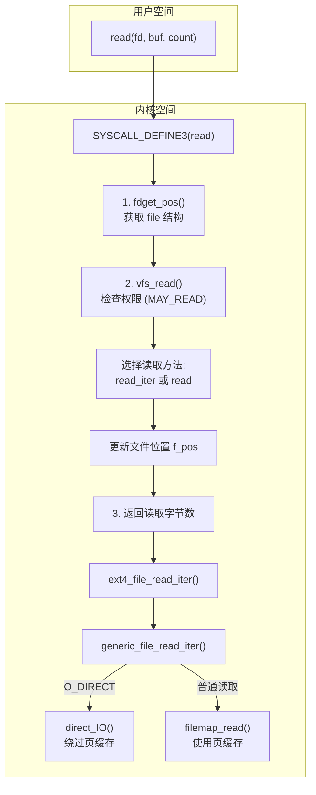

**页缓存读取流程**：

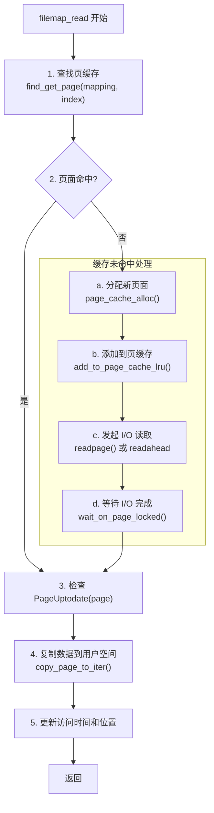

**预读机制（Readahead）**：

```c
/*
 * 预读：异步预取后续可能需要的页面
 * 
 * 触发条件：
 * 1. 顺序读取模式检测
 * 2. 缓存未命中时
 * 
 * 策略：
 * - 初始预读窗口：通常 32KB
 * - 动态调整：根据读取模式扩大/缩小
 * - 最大窗口：通常 128KB-256KB
 */

struct file_ra_state {
    pgoff_t start;          // 预读起始位置
    unsigned int size;      // 预读大小
    unsigned int async_size;// 异步预读大小
    unsigned int ra_pages;  // 最大预读页数
    unsigned int mmap_miss; // mmap 缺失计数
    loff_t prev_pos;        // 上次读取位置
};

// 预读逻辑（简化）
void ondemand_readahead(struct address_space *mapping,
                        struct file_ra_state *ra,
                        struct file *file,
                        bool hit_ra_marker,
                        pgoff_t index,
                        unsigned long req_count) {
    // 检测顺序读取
    if (index == ra->start + ra->size - ra->async_size) {
        // 顺序读取，继续预读
        ra->start += ra->size;
        ra->size = min(ra->size * 2, ra->ra_pages);
    } else if (index == ra->start + ra->size) {
        // 命中预读边界，扩大预读
        ra->size = min(ra->size * 4, ra->ra_pages);
    } else {
        // 随机读取，重新初始化预读
        ra->start = index;
        ra->size = initial_readahead;
    }
    
    // 发起预读
    __do_page_cache_readahead(mapping, file, index, ra->size, 0);
}
```

---

### 题目 7：write() 与写回机制

**问题**：描述 `write()` 系统调用的流程以及脏页写回机制。

**参考答案**：

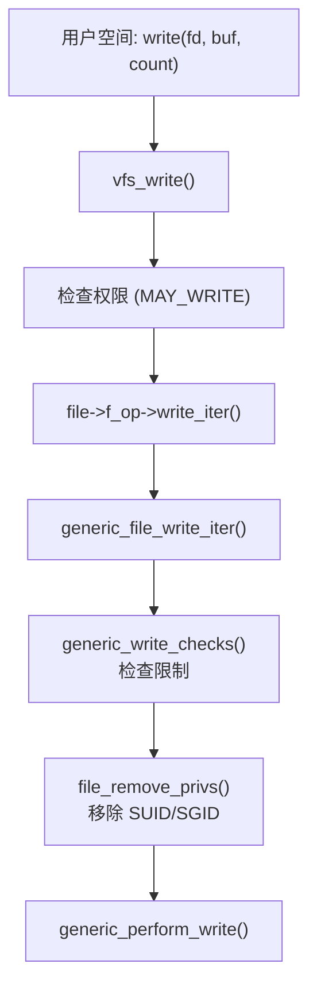

**写入页缓存流程**：

**generic_perform_write() 流程：**

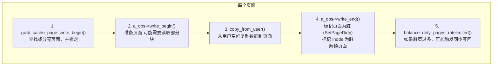
write() 返回（数据在页缓存中），异步写回在后台进行。

**脏页写回机制：**

**触发条件：**
1. 定时器到期（dirty_writeback_centisecs，默认 5s）
2. 脏页比例超过阈值（dirty_background_ratio，默认 10%）
3. 内存压力（需要回收页面）
4. 显式同步（sync, fsync, fdatasync）

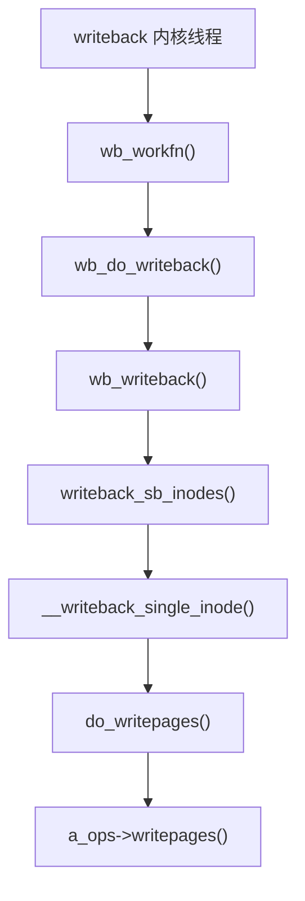
```

**脏页回写参数**：

```bash
# 查看和调整脏页参数
cat /proc/sys/vm/dirty_ratio           # 进程被阻塞前的脏页比例（默认 20%）
cat /proc/sys/vm/dirty_background_ratio # 后台写回开始的脏页比例（默认 10%）
cat /proc/sys/vm/dirty_writeback_centisecs  # 写回线程唤醒间隔（默认 500 = 5秒）
cat /proc/sys/vm/dirty_expire_centisecs     # 脏页过期时间（默认 3000 = 30秒）

# 对于 HFT 系统，可能需要调低这些值以减少写回延迟抖动
echo 5 > /proc/sys/vm/dirty_ratio
echo 2 > /proc/sys/vm/dirty_background_ratio
```

---

## 第三部分：页缓存深度解析

### 题目 8：address_space 与页缓存

**问题**：解释 `address_space` 结构及其在页缓存中的作用。

**参考答案**：

```c
struct address_space {
    struct inode        *host;        // 所属 inode
    struct xarray       i_pages;      // 页面基数树/xarray
    struct rw_semaphore invalidate_lock; // 无效化锁
    gfp_t               gfp_mask;     // 分配标志
    atomic_t            i_mmap_writable; // 可写映射计数
    
#ifdef CONFIG_READ_ONLY_THP_FOR_FS
    atomic_t            nr_thps;      // 透明大页计数
#endif
    struct rb_root_cached i_mmap;     // 私有/共享映射
    struct rw_semaphore i_mmap_rwsem; // 映射锁
    
    unsigned long       nrpages;      // 页面数量
    pgoff_t             writeback_index; // 写回起始位置
    const struct address_space_operations *a_ops; // 操作函数
    
    unsigned long       flags;        // 标志
    errseq_t            wb_err;       // 写回错误
    spinlock_t          private_lock; // 私有锁
    struct list_head    private_list; // 私有链表
    void                *private_data;// 私有数据
};
```

**页缓存数据结构**：

**页缓存使用 XArray（前身是 Radix Tree）索引：**

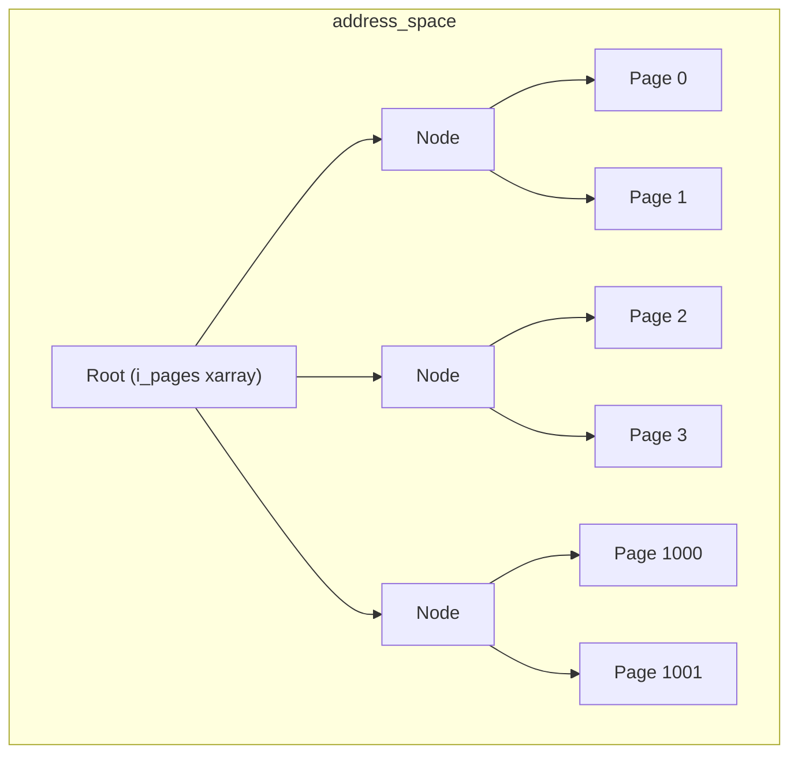

**说明：** 页面通过文件偏移量（page index）索引，`index = offset >> PAGE_SHIFT`

**address_space_operations**：

```c
struct address_space_operations {
    // 写回单个页面
    int (*writepage)(struct page *page, 
                     struct writeback_control *wbc);
    
    // 批量读取页面
    int (*readpage)(struct file *, struct page *);
    
    // 批量写回
    int (*writepages)(struct address_space *,
                      struct writeback_control *wbc);
    
    // 标记页面脏
    int (*set_page_dirty)(struct page *page);
    
    // 批量预读
    void (*readahead)(struct readahead_control *);
    
    // 准备写入
    int (*write_begin)(struct file *, struct address_space *,
                       loff_t pos, unsigned len, unsigned flags,
                       struct page **pagep, void **fsdata);
    
    // 完成写入
    int (*write_end)(struct file *, struct address_space *,
                     loff_t pos, unsigned len, unsigned copied,
                     struct page *page, void *fsdata);
    
    // 直接 I/O
    ssize_t (*direct_IO)(struct kiocb *, struct iov_iter *iter);
    
    // 迁移页面
    int (*migratepage)(struct address_space *,
                       struct page *, struct page *, enum migrate_mode);
    
    // 释放页面
    int (*releasepage)(struct page *, gfp_t);
    
    // 使页面无效
    void (*invalidatepage)(struct page *, unsigned int, unsigned int);
    
    // 交换激活
    int (*swap_activate)(struct swap_info_struct *, struct file *,
                         sector_t *);
    
    // 错误清理
    int (*error_remove_page)(struct address_space *, struct page *);
};
```

---

### 题目 9：页缓存页面状态

**问题**：描述页缓存中页面的各种状态及其转换。

**参考答案**：

```c
// 页面标志（简化版）
enum pageflags {
    PG_locked,       // 页面被锁定（I/O 进行中）
    PG_referenced,   // 最近被访问
    PG_uptodate,     // 内容有效（与磁盘同步）
    PG_dirty,        // 内容被修改（需要写回）
    PG_lru,          // 在 LRU 链表中
    PG_active,       // 在活动 LRU 中
    PG_workingset,   // 工作集页面
    PG_waiters,      // 有等待者
    PG_writeback,    // 正在写回
    PG_mappedtodisk, // 有磁盘块映射
    PG_reclaim,      // 将被回收
    PG_swapbacked,   // 可交换
    PG_private,      // 有私有数据
    // ...
};
```

**页面状态转换图**：

**页面生命周期：**

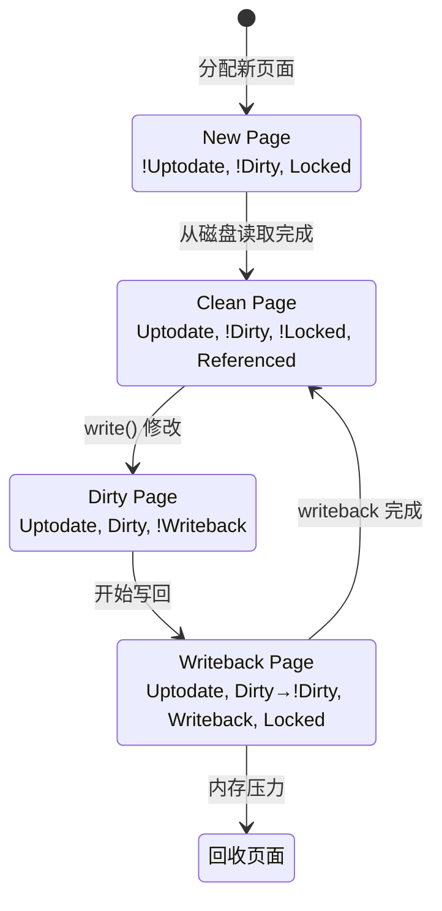

**LRU 状态机：**

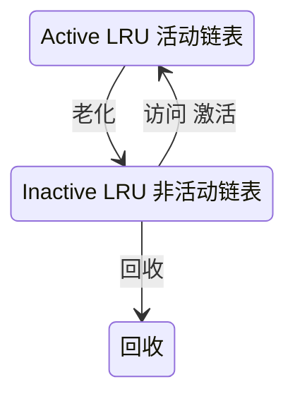

**页面状态检查函数**：

```c
// 页面状态检查宏
static inline bool PageLocked(struct page *page);
static inline bool PageDirty(struct page *page);
static inline bool PageUptodate(struct page *page);
static inline bool PageWriteback(struct page *page);
static inline bool PageActive(struct page *page);

// 设置页面状态
static inline void SetPageDirty(struct page *page);
static inline void ClearPageDirty(struct page *page);
static inline void SetPageUptodate(struct page *page);

// 原子操作
static inline int TestSetPageLocked(struct page *page);
static inline int TestClearPageDirty(struct page *page);

// 等待页面状态
void wait_on_page_locked(struct page *page);
void wait_on_page_writeback(struct page *page);

// 锁定页面
void lock_page(struct page *page);
int trylock_page(struct page *page);
void unlock_page(struct page *page);
```

---

### 题目 10：直接 I/O vs 缓存 I/O

**问题**：比较直接 I/O (O_DIRECT) 和缓存 I/O 的实现机制和适用场景。

**参考答案**：

**缓存 I/O：**

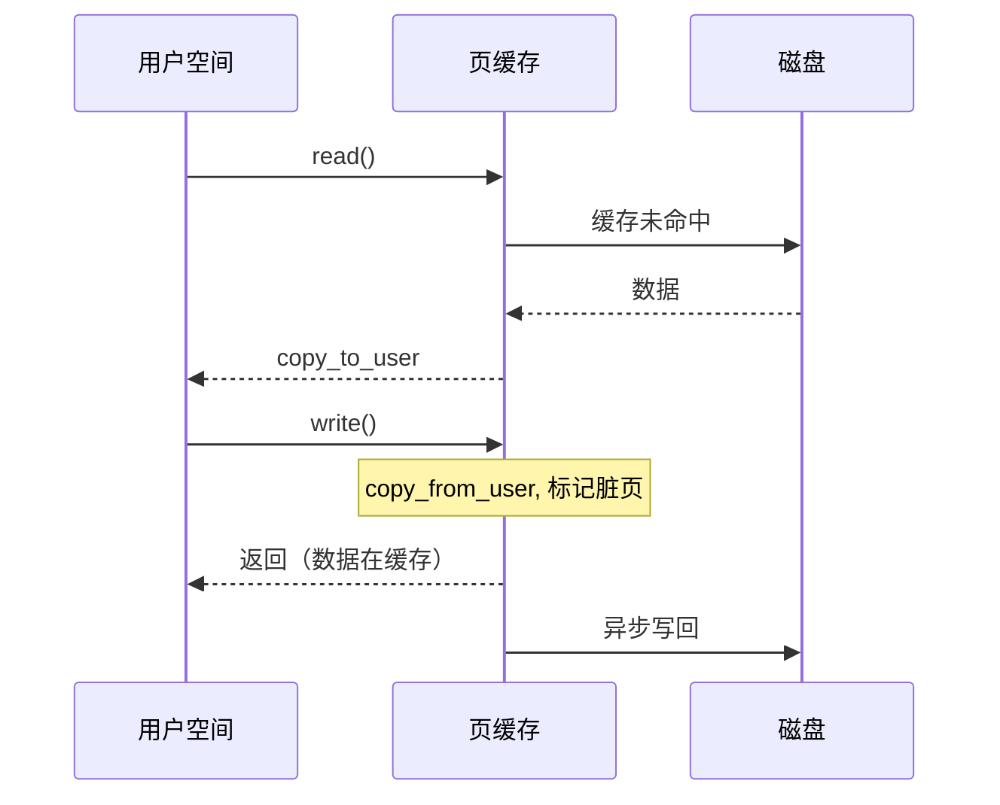

**直接 I/O (O_DIRECT)：**

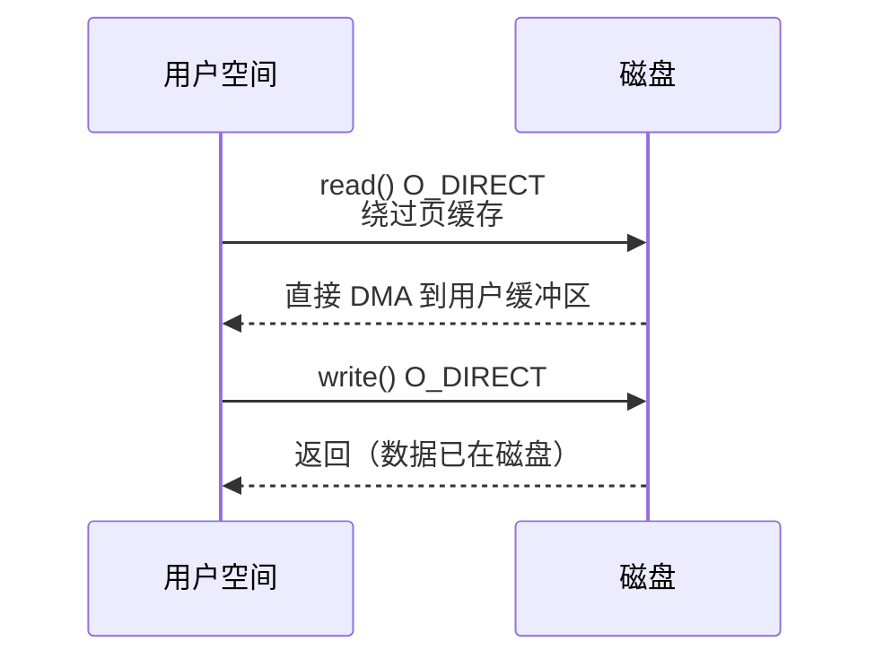

**比较表**：

| 特性 | 缓存 I/O | 直接 I/O |
|------|----------|----------|
| 数据路径 | 用户空间 ↔ 页缓存 ↔ 磁盘 | 用户空间 ↔ 磁盘 |
| 内存拷贝 | 需要（用户/内核空间拷贝）| 不需要（DMA 直接传输）|
| 缓存效果 | 有（提高重复访问性能）| 无 |
| 对齐要求 | 无 | 需要（通常 512B 或 4KB）|
| 大小要求 | 无 | 需要对齐 |
| 小 I/O 效率 | 高 | 低（每次都访问磁盘）|
| 大 I/O 效率 | 中（有拷贝开销）| 高 |
| 内存占用 | 高（占用页缓存）| 低 |
| 延迟可预测性 | 低（缓存命中/未命中差异大）| 高 |

**直接 I/O 要求**：

```c
// 直接 I/O 的对齐要求
// 1. 用户缓冲区地址必须对齐
// 2. 文件偏移量必须对齐
// 3. 传输长度必须对齐

// 对齐大小取决于文件系统和设备
// 通常是 512B（逻辑块大小）或 4KB（页大小）

#include <fcntl.h>
#include <unistd.h>
#include <stdlib.h>

int main() {
    int fd = open("file", O_RDWR | O_DIRECT);
    
    // 分配对齐的缓冲区
    void *buf;
    int ret = posix_memalign(&buf, 4096, 4096);
    
    // 读写必须从对齐的偏移开始，长度对齐
    pread(fd, buf, 4096, 0);        // OK
    pwrite(fd, buf, 4096, 4096);    // OK
    
    // pread(fd, buf, 100, 0);      // 可能失败
    // pread(fd, buf, 4096, 100);   // 可能失败
    
    free(buf);
    close(fd);
    return 0;
}
```

**适用场景**：

```
缓存 I/O 适用场景：
- 随机小文件访问
- 重复访问相同数据
- 一般应用程序
- 日志文件读取
- 配置文件

直接 I/O 适用场景：
- 数据库系统（自行管理缓存）
- HFT 应用（延迟可预测性）
- 大文件顺序读写
- 流媒体服务
- 不希望污染页缓存的场景
- 内存受限环境
```

---

## 第四部分：文件系统同步

### 题目 11：fsync、fdatasync 和 sync 的区别

**问题**：比较 `fsync()`、`fdatasync()` 和 `sync()` 的实现和性能差异。

**参考答案**：

```c
/*
 * sync() - 同步所有文件系统
 * 将所有脏页和脏 inode 写入磁盘
 */
void sync(void);

/*
 * fsync(fd) - 同步指定文件
 * 等待指定文件的所有脏页和元数据写入磁盘
 */
int fsync(int fd);

/*
 * fdatasync(fd) - 同步指定文件的数据
 * 只同步数据，不同步不影响数据读取的元数据
 * （如 atime, mtime 可能不同步，但 size 会同步）
 */
int fdatasync(int fd);
```

**比较表**：

| 特性 | sync() | fsync() | fdatasync() |
|------|--------|---------|-------------|
| 范围 | 整个系统 | 单个文件 | 单个文件 |
| 元数据 | 全部 | 全部 | 仅关键元数据 |
| 阻塞 | 不等待完成 | 等待完成 | 等待完成 |
| 延迟 | 最高 | 中等 | 最低 |
| 返回 | void | 成功/失败 | 成功/失败 |

**内核实现**：

```c
// fsync 实现
SYSCALL_DEFINE1(fsync, unsigned int, fd) {
    return do_fsync(fd, 0);
}

// fdatasync 实现
SYSCALL_DEFINE1(fdatasync, unsigned int, fd) {
    return do_fsync(fd, 1);  // datasync = 1
}

static int do_fsync(unsigned int fd, int datasync) {
    struct fd f = fdget(fd);
    int ret;
    
    if (!f.file)
        return -EBADF;
    
    ret = vfs_fsync(f.file, datasync);
    fdput(f);
    return ret;
}

int vfs_fsync(struct file *file, int datasync) {
    return vfs_fsync_range(file, 0, LLONG_MAX, datasync);
}

int vfs_fsync_range(struct file *file, loff_t start, loff_t end, 
                    int datasync) {
    struct inode *inode = file->f_mapping->host;
    
    if (!file->f_op->fsync)
        return -EINVAL;
    
    // 1. 写回脏页
    int ret = filemap_write_and_wait_range(file->f_mapping, start, end);
    
    // 2. 调用文件系统特定的 fsync
    if (!ret)
        ret = file->f_op->fsync(file, start, end, datasync);
    
    // 3. 可能需要刷新设备缓存
    if (!ret && !datasync)
        ret = blkdev_issue_flush(inode->i_sb->s_bdev);
    
    return ret;
}
```

**fsync vs fdatasync 性能差异**：

```
场景：追加写入日志文件

fsync() 需要同步的元数据：
- 文件大小 (i_size)
- 修改时间 (mtime)
- 块映射 (如果分配了新块)
- 访问时间 (atime)
- inode 序号

fdatasync() 可能跳过的元数据：
- 修改时间 (mtime)
- 访问时间 (atime)

如果只是覆盖写（不改变文件大小）：
- fdatasync() 可能完全跳过元数据同步
- 性能差异可达 50% 或更多

如果追加写（改变文件大小）：
- fdatasync() 仍需同步 i_size
- 性能差异较小
```

---

### 题目 12：文件系统日志（Journaling）

**问题**：解释 ext4 日志的工作原理，包括日志模式和崩溃恢复。

**参考答案**：

**Ext4 日志模式：**

| 模式 | 安全性 | 速度 | 说明 |
|------|--------|------|------|
| journal | 最安全 | 最慢 | 数据和元数据都写入日志 |
| ordered（默认） | 平衡 | 中等 | 只有元数据写入日志，数据先于元数据写入磁盘 |
| writeback | 最不安全 | 最快 | 只有元数据写入日志，数据和元数据顺序不保证 |

**写入流程：**
- **journal**: 数据→日志 → 元数据→日志 → 提交 → 数据→磁盘 → 元数据→磁盘
- **ordered**: 数据→磁盘 → 元数据→日志 → 提交 → 元数据→磁盘
- **writeback**: 元数据→日志 → 提交 → 数据/元数据→磁盘（顺序不定）

**日志结构**：

**Ext4 日志区域：**

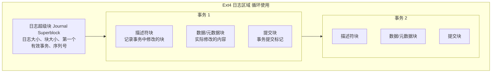

**日志写入流程（ordered 模式）**：

**写文件操作（ordered 模式）：**

| 步骤 | 函数 | 说明 |
|------|------|------|
| 1. 开始事务 | `jbd2_journal_start()` | |
| 2. 修改元数据 | - | inode、位图、目录项（在内存中） |
| 3. 获取日志信用 | `jbd2_journal_get_write_access()` | |
| 4. 标记缓冲区为脏 | `jbd2_journal_dirty_metadata()` | |
| 5. 提交事务 | `jbd2_journal_stop()` | |

**后台提交流程：**

| 步骤 | 函数 | 说明 |
|------|------|------|
| a | `filemap_fdatawait_range()` | 等待数据写入完成（ordered 模式） |
| b | `journal_write_metadata_buffer()` | 写入描述符块 |
| c | `submit_bh(WRITE)` | 写入元数据块到日志 |
| d | `journal_write_commit_record()` | 写入提交块 |
| e | - | 等待日志写入完成 |
| f | `jbd2_log_do_checkpoint()` | checkpoint: 将日志中的块写入最终位置 |

**崩溃恢复**：

**系统崩溃后恢复流程：**

| 步骤 | 函数 | 说明 |
|------|------|------|
| 1. 挂载文件系统 | `mount()` | |
| 2. 检测需要恢复 | `jbd2_journal_load()` | |
| 3. 扫描日志 | | 见下方详细流程 |
| 4. 重放完整事务 | `jbd2_journal_recover()` | 见下方详细流程 |
| 5. 清空日志 | `jbd2_journal_skip_recovery()` | |
| 6. 文件系统就绪 | | |

**扫描日志流程：**
- a. 读取日志超级块 (`jbd2_journal_read_superblock()`)
- b. 从第一个有效事务开始扫描
- c. 对每个事务：检查提交块是否存在（完整事务），如果完整则标记需要重放，如果不完整则停止扫描

**重放事务流程：**
- a. 读取描述符块，获取修改的块列表
- b. 对每个修改的块：从日志读取，写入最终位置
- c. 等待写入完成

---

## 第五部分：高级主题

### 题目 13：实现题 - 简化的 dentry 缓存

**问题**：实现一个简化版的 dentry 缓存，支持查找和 LRU 回收。

**参考答案**：

```c
#include <stdio.h>
#include <stdlib.h>
#include <string.h>
#include <pthread.h>

#define HASH_SIZE 1024
#define MAX_NAME_LEN 256

// 简化的 dentry 结构
struct dentry {
    char name[MAX_NAME_LEN];
    unsigned long ino;           // inode 编号
    struct dentry *parent;       // 父目录
    struct dentry *hash_next;    // 哈希链
    struct dentry *lru_prev;     // LRU 链表
    struct dentry *lru_next;
    int ref_count;               // 引用计数
    int is_negative;             // 是否为负面 dentry
};

// dentry 缓存
struct dentry_cache {
    struct dentry *hash_table[HASH_SIZE];
    struct dentry lru_head;      // LRU 链表头（哨兵）
    size_t count;                // 缓存项数
    size_t max_count;            // 最大缓存项
    pthread_mutex_t lock;
};

// 哈希函数
static unsigned int hash_name(const char *name, struct dentry *parent) {
    unsigned int hash = 0;
    while (*name) {
        hash = hash * 31 + (unsigned char)*name++;
    }
    hash ^= (unsigned long)parent;
    return hash % HASH_SIZE;
}

// 初始化缓存
void dcache_init(struct dentry_cache *cache, size_t max_count) {
    memset(cache->hash_table, 0, sizeof(cache->hash_table));
    cache->lru_head.lru_prev = &cache->lru_head;
    cache->lru_head.lru_next = &cache->lru_head;
    cache->count = 0;
    cache->max_count = max_count;
    pthread_mutex_init(&cache->lock, NULL);
}

// 从 LRU 链表移除
static void lru_remove(struct dentry *d) {
    if (d->lru_prev && d->lru_next) {
        d->lru_prev->lru_next = d->lru_next;
        d->lru_next->lru_prev = d->lru_prev;
        d->lru_prev = d->lru_next = NULL;
    }
}

// 添加到 LRU 头部（最近使用）
static void lru_add_head(struct dentry_cache *cache, struct dentry *d) {
    d->lru_next = cache->lru_head.lru_next;
    d->lru_prev = &cache->lru_head;
    cache->lru_head.lru_next->lru_prev = d;
    cache->lru_head.lru_next = d;
}

// 查找 dentry
struct dentry *dcache_lookup(struct dentry_cache *cache,
                             const char *name,
                             struct dentry *parent) {
    pthread_mutex_lock(&cache->lock);
    
    unsigned int hash = hash_name(name, parent);
    struct dentry *d = cache->hash_table[hash];
    
    while (d) {
        if (d->parent == parent && strcmp(d->name, name) == 0) {
            // 找到，增加引用计数
            d->ref_count++;
            // 移到 LRU 头部
            if (d->ref_count == 1) {
                lru_remove(d);  // 从 LRU 移除（正在使用）
            }
            pthread_mutex_unlock(&cache->lock);
            return d;
        }
        d = d->hash_next;
    }
    
    pthread_mutex_unlock(&cache->lock);
    return NULL;
}

// 回收一个 dentry
static void dcache_shrink_one(struct dentry_cache *cache) {
    // 从 LRU 尾部取（最少使用）
    struct dentry *d = cache->lru_head.lru_prev;
    
    if (d == &cache->lru_head) {
        return;  // LRU 为空
    }
    
    // 从 LRU 移除
    lru_remove(d);
    
    // 从哈希表移除
    unsigned int hash = hash_name(d->name, d->parent);
    struct dentry **pp = &cache->hash_table[hash];
    while (*pp) {
        if (*pp == d) {
            *pp = d->hash_next;
            break;
        }
        pp = &(*pp)->hash_next;
    }
    
    cache->count--;
    free(d);
}

// 添加 dentry
struct dentry *dcache_add(struct dentry_cache *cache,
                          const char *name,
                          struct dentry *parent,
                          unsigned long ino,
                          int is_negative) {
    pthread_mutex_lock(&cache->lock);
    
    // 如果缓存满，回收一些
    while (cache->count >= cache->max_count) {
        dcache_shrink_one(cache);
    }
    
    // 分配新 dentry
    struct dentry *d = calloc(1, sizeof(*d));
    strncpy(d->name, name, MAX_NAME_LEN - 1);
    d->parent = parent;
    d->ino = ino;
    d->ref_count = 1;
    d->is_negative = is_negative;
    
    // 添加到哈希表
    unsigned int hash = hash_name(name, parent);
    d->hash_next = cache->hash_table[hash];
    cache->hash_table[hash] = d;
    
    cache->count++;
    
    pthread_mutex_unlock(&cache->lock);
    return d;
}

// 释放引用
void dcache_put(struct dentry_cache *cache, struct dentry *d) {
    pthread_mutex_lock(&cache->lock);
    
    d->ref_count--;
    if (d->ref_count == 0) {
        // 加入 LRU（可被回收）
        lru_add_head(cache, d);
    }
    
    pthread_mutex_unlock(&cache->lock);
}

// 删除 dentry（文件删除时）
void dcache_delete(struct dentry_cache *cache, struct dentry *d) {
    pthread_mutex_lock(&cache->lock);
    
    // 转换为负面 dentry 或直接删除
    if (d->ref_count > 0) {
        d->is_negative = 1;
        d->ino = 0;
    } else {
        lru_remove(d);
        
        unsigned int hash = hash_name(d->name, d->parent);
        struct dentry **pp = &cache->hash_table[hash];
        while (*pp) {
            if (*pp == d) {
                *pp = d->hash_next;
                break;
            }
            pp = &(*pp)->hash_next;
        }
        
        cache->count--;
        free(d);
    }
    
    pthread_mutex_unlock(&cache->lock);
}

// 测试
int main() {
    struct dentry_cache cache;
    dcache_init(&cache, 100);
    
    // 模拟根目录
    struct dentry *root = dcache_add(&cache, "/", NULL, 2, 0);
    
    // 添加一些 dentry
    struct dentry *home = dcache_add(&cache, "home", root, 100, 0);
    struct dentry *user = dcache_add(&cache, "user", home, 101, 0);
    struct dentry *file = dcache_add(&cache, "file.txt", user, 102, 0);
    
    // 添加负面 dentry（文件不存在）
    struct dentry *notexist = dcache_add(&cache, "notexist", user, 0, 1);
    
    // 查找测试
    struct dentry *found = dcache_lookup(&cache, "file.txt", user);
    if (found) {
        printf("Found: %s, ino=%lu\n", found->name, found->ino);
        dcache_put(&cache, found);
    }
    
    // 查找负面 dentry
    found = dcache_lookup(&cache, "notexist", user);
    if (found && found->is_negative) {
        printf("Negative dentry: %s (file does not exist)\n", found->name);
        dcache_put(&cache, found);
    }
    
    // 释放
    dcache_put(&cache, root);
    dcache_put(&cache, home);
    dcache_put(&cache, user);
    dcache_put(&cache, file);
    dcache_put(&cache, notexist);
    
    printf("Cache count: %zu\n", cache.count);
    
    return 0;
}
```

---

## 高频考点总结

| 考点 | 频率 | 重点 |
|------|------|------|
| VFS 架构 | ★★★ | 四大对象关系 |
| inode 结构 | ★★★ | 关键字段含义 |
| dentry 缓存 | ★★★ | LRU、负面 dentry |
| 文件打开流程 | ★★★ | 路径解析 namei |
| 页缓存 | ★★★ | address_space、预读 |
| 读写流程 | ★★☆ | 缓存 I/O vs 直接 I/O |
| 脏页写回 | ★★☆ | writeback 机制 |
| fsync 实现 | ★★☆ | fsync vs fdatasync |
| 日志文件系统 | ★★☆ | 日志模式、崩溃恢复 |

---

## 导航

- [上一篇：内核面试题-系统调用](@/articles/linux/linux-27-内核面试题-系统调用.md)
- [下一篇：内核面试题-文件系统与VFS](@/articles/linux/linux-29-内核面试题-文件系统与VFS.md)
