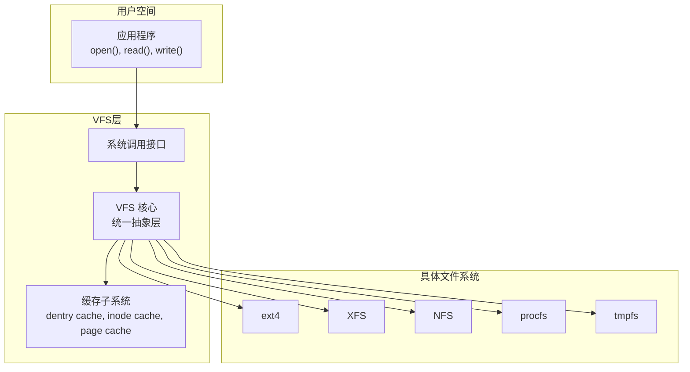
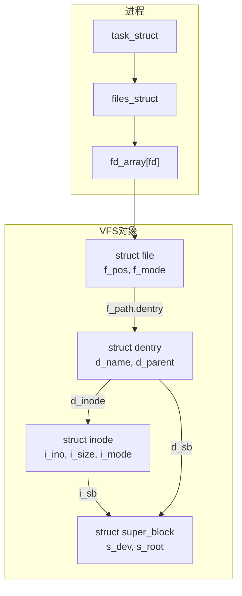
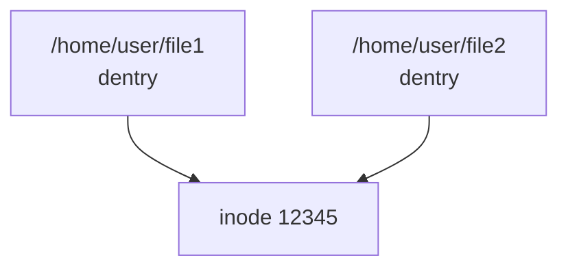
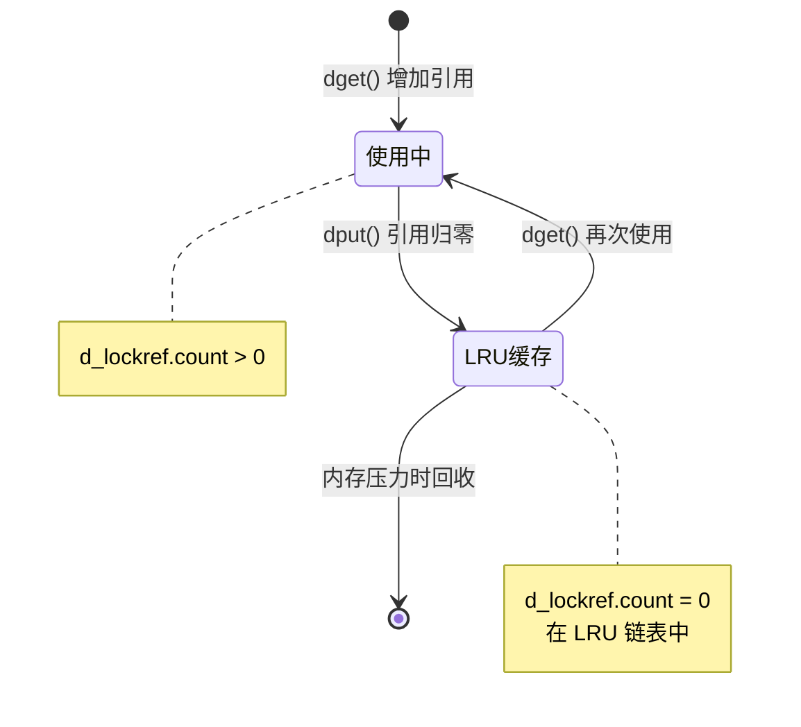
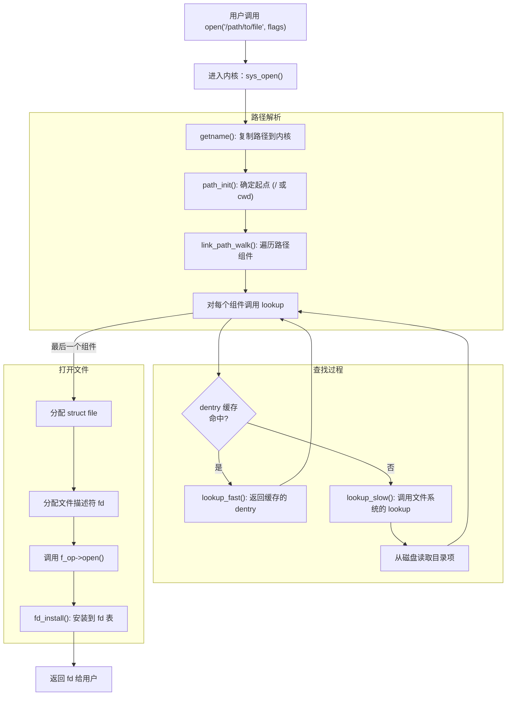
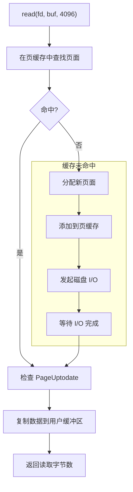
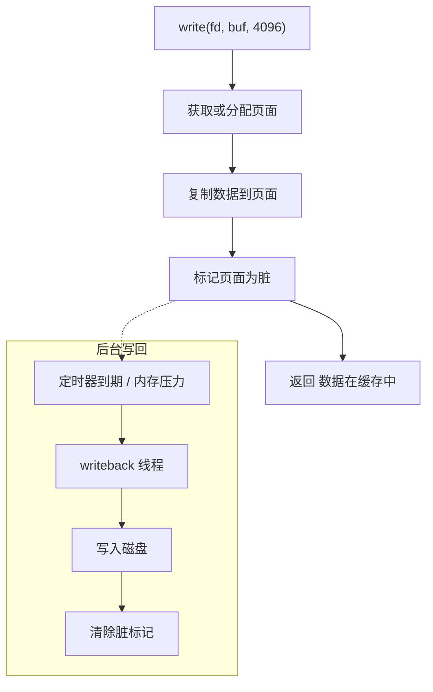
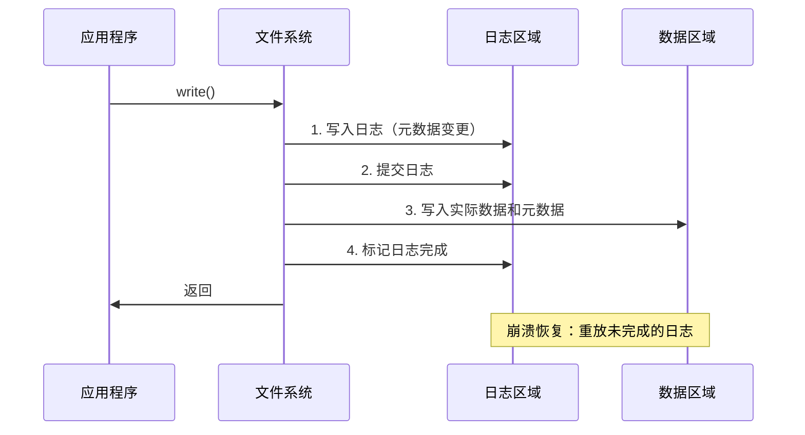
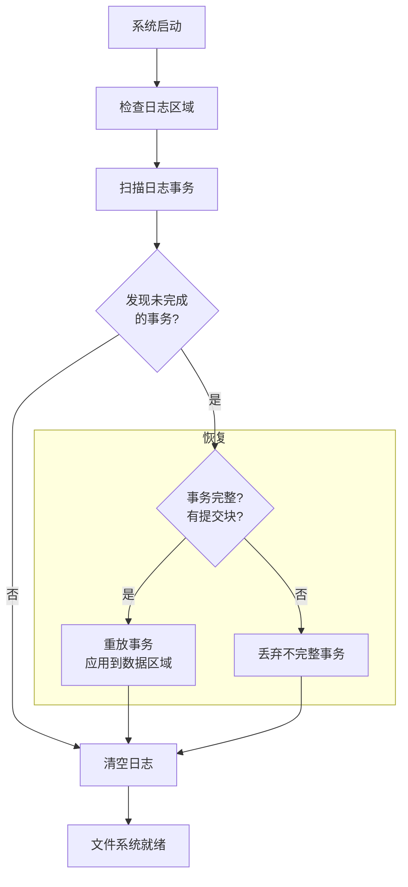
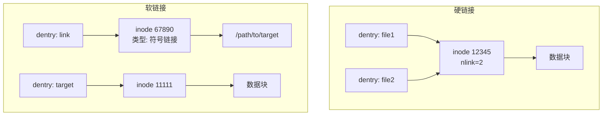

+++
title = "29.内核面试题-文件系统与VFS"
date = 2026-01-31
description = "Linux内核文件系统与VFS面试题：VFS架构、inode、dentry、页缓存、文件操作深度解析"
[taxonomies]
tags = ["Linux", "面试", "VFS", "文件系统", "inode", "页缓存"]
+++

# Linux 内核面试题 - 文件系统与 VFS

本文汇集 Linux 内核文件系统与 VFS 相关的高频面试问题，采用问答深挖形式，模拟真实面试场景。

---

## 问题 1：什么是 VFS？它的作用是什么？

### 标准答案

**VFS（Virtual File System）** 是 Linux 内核中的一个抽象层，为不同类型的文件系统提供统一的接口。



**VFS 的核心作用**：

| 作用 | 说明 |
|------|------|
| 统一接口 | 应用程序无需关心底层文件系统类型 |
| 抽象层 | 定义通用的数据结构和操作接口 |
| 缓存管理 | 统一管理 dentry cache、inode cache、page cache |
| 挂载管理 | 管理文件系统的挂载和命名空间 |

### 面试官追问

**Q1: VFS 定义了哪些核心对象？**

```c
// VFS 四大核心对象

// 1. 超级块（superblock）- 描述已挂载的文件系统
struct super_block {
    struct list_head    s_list;       // 超级块链表
    dev_t               s_dev;        // 设备标识
    unsigned long       s_blocksize;  // 块大小
    loff_t              s_maxbytes;   // 最大文件大小
    struct file_system_type *s_type;  // 文件系统类型
    const struct super_operations *s_op; // 超级块操作
    struct dentry       *s_root;      // 根目录 dentry
    // ...
};

// 2. inode - 描述文件元数据
struct inode {
    umode_t             i_mode;       // 文件类型和权限
    unsigned long       i_ino;        // inode 编号
    loff_t              i_size;       // 文件大小
    struct super_block  *i_sb;        // 所属超级块
    const struct inode_operations *i_op;  // inode 操作
    const struct file_operations *i_fop;  // 文件操作
    struct address_space *i_mapping;  // 页缓存映射
    // ...
};

// 3. dentry - 目录项，连接文件名和 inode
struct dentry {
    struct qstr         d_name;       // 文件名
    struct inode        *d_inode;     // 关联的 inode
    struct dentry       *d_parent;    // 父目录
    const struct dentry_operations *d_op; // dentry 操作
    struct super_block  *d_sb;        // 所属超级块
    // ...
};

// 4. file - 描述进程打开的文件
struct file {
    struct path         f_path;       // 文件路径（包含 dentry）
    const struct file_operations *f_op; // 文件操作
    loff_t              f_pos;        // 当前读写位置
    unsigned int        f_flags;      // 打开标志
    fmode_t             f_mode;       // 访问模式
    // ...
};
```

**Q2: 这四个对象之间的关系是什么？**



**关键点**：
- 多个 `file` 可以指向同一个 `dentry`（同一文件被多次打开）
- 多个 `dentry` 可以指向同一个 `inode`（硬链接）
- 一个 `dentry` 的 `d_inode` 可以为 NULL（负面 dentry）

---

## 问题 2：解释 inode 和 dentry 的区别

### 标准答案

| 特性 | inode | dentry |
|------|-------|--------|
| 存储位置 | 磁盘 + 内存缓存 | 仅内存缓存 |
| 内容 | 文件元数据（大小、权限、时间戳、数据块位置）| 文件名、父目录关系 |
| 唯一性 | 每个文件一个 inode | 每个路径组件一个 dentry |
| 生命周期 | 文件存在期间持续存在 | 缓存，可被回收 |
| 硬链接 | 多个文件名共享一个 inode | 每个文件名有独立的 dentry |

### 面试官追问

**Q1: 为什么需要分离 inode 和 dentry？**

设计原因：

**1. 硬链接支持**



两个不同的 dentry 指向同一个 inode

**2. 路径缓存效率**

访问 `/home/user/documents/file.txt` 需要依次查找 dentry：
- 查找 "home" dentry
- 查找 "user" dentry
- 查找 "documents" dentry
- 查找 "file.txt" dentry

dentry 缓存避免每次都从磁盘读取目录

**3. 负面 dentry**

缓存"文件不存在"的结果，`d_inode = NULL` 表示该路径不存在，避免重复查找不存在的文件

**4. 内存效率**

dentry 只在内存中，可以按需回收；inode 反映磁盘状态，必须保持同步

**Q2: 什么是负面 dentry？有什么用？**

```c
// 负面 dentry：d_inode == NULL

// 使用场景：
// shell 执行命令时遍历 PATH
// $ ls
// 检查 /usr/local/bin/ls  → 不存在（创建负面 dentry）
// 检查 /usr/bin/ls        → 不存在（创建负面 dentry）
// 检查 /bin/ls            → 存在！

// 下次执行 ls 时：
// 检查 /usr/local/bin/ls  → 负面 dentry 命中，直接跳过
// 检查 /usr/bin/ls        → 负面 dentry 命中，直接跳过
// 检查 /bin/ls            → 正面 dentry 命中

// 性能提升：避免重复磁盘 I/O

// 创建负面 dentry
struct dentry *d_alloc_negative(struct dentry *parent, 
                                const struct qstr *name);

// 检查
static inline bool d_is_negative(const struct dentry *dentry) {
    return !dentry->d_inode;
}

// 转换为正面 dentry（文件被创建时）
void d_instantiate(struct dentry *entry, struct inode *inode);
```

**Q3: dentry 是如何被缓存和回收的？**



```c
// dentry 引用计数操作
struct dentry *dget(struct dentry *dentry);  // 增加引用
void dput(struct dentry *dentry);            // 减少引用

// 当引用计数归零时，dentry 加入 LRU 链表
// 内存压力时，从 LRU 尾部回收

// 回收策略
// 1. 负面 dentry 优先回收
// 2. 最近最少使用的优先回收
// 3. 父目录的 dentry 后于子目录回收
```

---

## 问题 3：描述 open() 系统调用的执行流程

### 标准答案



### 面试官追问

**Q1: 路径解析（namei）的具体过程是什么？**

```c
// 路径解析示例：/home/user/file.txt

// 1. 初始化
//    起点：根目录 "/" 的 dentry

// 2. 遍历每个组件
//    组件 "home":
//      - 在当前目录的 dentry cache 中查找
//      - 如果没找到，调用 inode->i_op->lookup()
//      - 获得 /home 的 dentry

//    组件 "user":
//      - 同样的过程
//      - 获得 /home/user 的 dentry

//    组件 "file.txt":
//      - 这是最后一个组件
//      - 根据 flags 决定是否创建

// 伪代码
int path_lookupat(struct nameidata *nd, unsigned flags) {
    // 初始化起点
    path_init(nd, flags);
    
    // 遍历路径
    while (!last_component) {
        // 查找下一个组件
        err = walk_component(nd);
        if (err)
            return err;
            
        // 处理符号链接
        if (d_is_symlink(nd->path.dentry)) {
            err = follow_symlink(nd);
        }
    }
    
    // 处理最后一个组件
    return do_last(nd, flags);
}
```

**Q2: 符号链接是如何处理的？**

```c
// 符号链接处理

// 1. 检测到符号链接
if (d_is_symlink(dentry)) {
    // 2. 读取链接目标
    const char *target = inode->i_op->get_link(dentry, inode);
    
    // 3. 重新开始路径解析
    //    如果目标是绝对路径，从根开始
    //    如果目标是相对路径，从当前目录开始
    
    // 4. 防止循环
    if (++nd->depth > MAX_NESTED_LINKS)
        return -ELOOP;  // 太多层符号链接
}

// 符号链接最大嵌套深度
#define MAX_NESTED_LINKS 40

// 例子：
// /tmp/link1 -> /tmp/link2 -> /tmp/link3 -> ... -> /tmp/file
// 如果超过 40 层，返回 ELOOP
```

**Q3: O_CREAT 标志是如何处理的？**

```c
// 在 do_last() 中处理文件创建

int do_last(struct nameidata *nd, unsigned flags) {
    // 查找最后一个组件
    dentry = lookup_open(nd, &opened);
    
    if (d_is_negative(dentry)) {
        // 文件不存在
        if (!(flags & O_CREAT)) {
            return -ENOENT;
        }
        
        // 创建文件
        // 1. 权限检查
        error = may_create(dir_inode, dentry);
        if (error)
            return error;
        
        // 2. 调用文件系统的 create
        error = dir_inode->i_op->create(dir_inode, dentry, mode);
        if (error)
            return error;
        
        // 3. dentry 现在指向新创建的 inode
    }
    
    // 打开文件
    return vfs_open(&nd->path, file);
}
```

---

## 问题 4：什么是页缓存（Page Cache）？

### 标准答案

**页缓存** 是内核用于缓存文件数据的内存区域，以页（通常 4KB）为单位管理。

```mermaid
graph TB
    subgraph 用户空间
        APP["应用程序"]
        BUF["用户缓冲区"]
    end
    
    subgraph 内核空间
        VFS["VFS 层"]
        PC["页缓存<br/>Page Cache"]
        FS["文件系统"]
    end
    
    subgraph 存储
        DISK["磁盘"]
    end
    
    APP -->|read()| VFS
    VFS -->|1. 查找| PC
    PC -->|2a. 命中| BUF
    PC -->|2b. 未命中| FS
    FS -->|3. 读取| DISK
    DISK -->|4. 数据| PC
    PC -->|5. 复制| BUF
    BUF --> APP
```

**页缓存的关键结构**：

```c
// address_space - 管理文件的页缓存
struct address_space {
    struct inode        *host;        // 所属 inode
    struct xarray       i_pages;      // 页面索引（基数树/xarray）
    unsigned long       nrpages;      // 页面数量
    const struct address_space_operations *a_ops; // 操作函数
    // ...
};

// 页面通过文件偏移量索引
// index = offset >> PAGE_SHIFT
// 例如：偏移 8192 字节 → index = 2（第 3 页）
```

### 面试官追问

**Q1: 读取文件时页缓存是如何工作的？**



```c
// 读取流程核心函数
ssize_t generic_file_read_iter(struct kiocb *iocb, 
                               struct iov_iter *iter) {
    struct file *file = iocb->ki_filp;
    struct address_space *mapping = file->f_mapping;
    
    // 对于 O_DIRECT，绕过页缓存
    if (iocb->ki_flags & IOCB_DIRECT)
        return mapping->a_ops->direct_IO(iocb, iter);
    
    // 使用页缓存
    return filemap_read(iocb, iter, 0);
}
```

**Q2: 写入文件时页缓存是如何工作的？**



**写入不是同步的**：
- `write()` 返回时，数据可能只在页缓存中
- 后台 writeback 线程异步写入磁盘
- 使用 `fsync()` 或 `O_SYNC` 强制同步

**Q3: 什么是预读（Readahead）？**

```c
// 预读：预测性地读取后续数据

// 场景：顺序读取文件
// read 4KB at offset 0     → 触发预读，读取 0-32KB
// read 4KB at offset 4096  → 预读命中
// read 4KB at offset 8192  → 预读命中
// ...
// read 4KB at offset 28672 → 接近预读边界，触发异步预读

// 预读状态
struct file_ra_state {
    pgoff_t start;          // 预读起始
    unsigned int size;      // 当前预读大小
    unsigned int async_size;// 异步预读大小
    unsigned int ra_pages;  // 最大预读页数
};

// 预读算法
// 1. 初始预读：通常 32KB
// 2. 顺序读取时：窗口逐渐扩大（32KB → 64KB → 128KB）
// 3. 随机读取时：重置预读窗口
// 4. 异步预读：在当前窗口用完前触发下一次预读
```

---

## 问题 5：fsync、fdatasync 和 sync 的区别

### 标准答案

| 函数 | 同步范围 | 元数据 | 阻塞 |
|------|----------|--------|------|
| `sync()` | 所有文件系统 | 全部 | 不等待完成 |
| `fsync(fd)` | 指定文件 | 全部 | 等待完成 |
| `fdatasync(fd)` | 指定文件 | 仅关键元数据 | 等待完成 |

### 面试官追问

**Q1: fdatasync 比 fsync 快在哪里？**

```
fsync 需要同步的元数据：
- 文件大小 (i_size)
- 修改时间 (mtime)
- 访问时间 (atime)
- 块映射（如果分配了新块）
- 权限变更（如果有）

fdatasync 可以跳过的元数据：
- 修改时间 (mtime) - 如果文件大小没变
- 访问时间 (atime)

fdatasync 必须同步的元数据：
- 文件大小 (i_size) - 影响数据读取
- 块映射 - 影响数据读取

场景分析：
1. 覆盖写（不改变文件大小）
   - fdatasync 可能只写数据，不更新元数据
   - 性能提升明显

2. 追加写（改变文件大小）
   - fdatasync 也需要更新 i_size
   - 性能差异较小
```

**Q2: 数据库为什么关心 fsync？**

```c
// 数据库事务持久性要求

// 错误做法：
write(log_fd, transaction_log, size);
// 数据可能只在页缓存中
// 系统崩溃 → 事务丢失！

// 正确做法：
write(log_fd, transaction_log, size);
fsync(log_fd);  // 确保日志写入磁盘
// 然后才能确认事务提交

// 或者使用 O_SYNC
int log_fd = open("transaction.log", O_WRONLY | O_SYNC);
write(log_fd, transaction_log, size);
// 每次 write 都同步到磁盘（性能差）

// 更好的方式：批量 fsync
for (int i = 0; i < batch_size; i++) {
    write(log_fd, transactions[i], size);
}
fsync(log_fd);  // 批量同步
```

---

## 问题 6：解释直接 I/O（O_DIRECT）

### 标准答案


| 特性 | 缓存 I/O | 直接 I/O |
|------|----------|----------|
| 数据路径 | 用户空间 ↔ 页缓存 ↔ 磁盘 | 用户空间 ↔ 磁盘 |
| 内存拷贝 | 需要 | 不需要（DMA 直传）|
| 缓存效果 | 有 | 无 |
| 对齐要求 | 无 | 有（通常 512B 或 4KB）|
| 适用场景 | 一般应用 | 数据库、HFT |

### 面试官追问

**Q1: 直接 I/O 的对齐要求是什么？**

```c
// 直接 I/O 的三个对齐要求：
// 1. 用户缓冲区地址必须对齐
// 2. 文件偏移量必须对齐
// 3. 传输长度必须对齐

// 对齐大小取决于：
// - 文件系统块大小
// - 设备扇区大小
// 通常是 512 字节或 4096 字节

#include <fcntl.h>
#include <stdlib.h>

int main() {
    // 打开文件
    int fd = open("file", O_RDWR | O_DIRECT);
    
    // 分配对齐的缓冲区
    void *buf;
    if (posix_memalign(&buf, 4096, 4096) != 0) {
        perror("posix_memalign");
        return 1;
    }
    
    // 对齐的读写
    pread(fd, buf, 4096, 0);      // OK
    pwrite(fd, buf, 4096, 4096);  // OK
    
    // 不对齐会失败
    // pread(fd, buf, 100, 0);    // 可能返回 -EINVAL
    // pread(fd, buf, 4096, 100); // 可能返回 -EINVAL
    
    free(buf);
    close(fd);
    return 0;
}
```

**Q2: 为什么数据库使用直接 I/O？**

```
数据库使用直接 I/O 的原因：

1. 避免双重缓存
   - 数据库有自己的缓冲池（Buffer Pool）
   - 页缓存会导致数据被缓存两次
   - 浪费内存

2. 更好的缓存控制
   - 数据库了解访问模式
   - 可以实现更智能的替换策略
   - 页缓存的 LRU 可能不适合数据库工作负载

3. 可预测的 I/O 行为
   - 直接 I/O 的延迟更稳定
   - 页缓存可能导致写放大（write amplification）

4. 避免页缓存污染
   - 大表扫描不会驱逐有用的缓存

典型数据库：
- MySQL InnoDB (innodb_flush_method = O_DIRECT)
- PostgreSQL (effective_io_concurrency)
- Oracle
```

---

## 问题 7：文件系统的日志（Journaling）机制

### 标准答案

**日志文件系统** 通过记录元数据（或数据）变更日志来保证崩溃一致性。



### 面试官追问

**Q1: ext4 有哪些日志模式？**

```
ext4 三种日志模式：

1. journal（完整日志）
   - 数据和元数据都写入日志
   - 最安全，最慢
   - 流程：数据→日志 → 元数据→日志 → 提交 → 实际写入

2. ordered（有序模式，默认）
   - 只有元数据写入日志
   - 数据先于元数据写入
   - 保证：崩溃后不会看到垃圾数据
   - 流程：数据→磁盘 → 元数据→日志 → 提交 → 元数据→磁盘

3. writeback（回写模式）
   - 只有元数据写入日志
   - 数据和元数据顺序不保证
   - 最快，但可能看到旧数据
   - 流程：元数据→日志 → 提交 → 数据/元数据→磁盘（顺序不定）

挂载时选择：
mount -o data=journal /dev/sda1 /mnt
mount -o data=ordered /dev/sda1 /mnt
mount -o data=writeback /dev/sda1 /mnt
```

**Q2: 崩溃恢复是如何工作的？**



---

## 问题 8：硬链接和软链接的区别

### 标准答案



| 特性 | 硬链接 | 软链接（符号链接）|
|------|--------|-------------------|
| inode | 共享同一个 inode | 有独立的 inode |
| 跨文件系统 | 不能 | 可以 |
| 链接到目录 | 不能（防止循环）| 可以 |
| 目标删除后 | 仍然有效 | 变成悬空链接 |
| 存储内容 | 无额外存储 | 存储目标路径 |

### 面试官追问

**Q1: 为什么硬链接不能跨文件系统？**

```
硬链接的本质：多个 dentry 指向同一个 inode

inode 编号是文件系统内唯一的：
- /dev/sda1 的 inode 12345
- /dev/sda2 的 inode 12345
这是两个完全不同的文件！

如果允许跨文件系统硬链接：
- 文件系统 A 的 dentry 指向文件系统 B 的 inode
- 卸载文件系统 B 后，dentry 指向无效 inode
- 引用计数无法正确维护

所以内核禁止：
ln /mnt/fs1/file /mnt/fs2/link
# ln: failed to create hard link: Invalid cross-device link
```

**Q2: 为什么硬链接不能链接到目录？**

```
防止目录循环：

假设允许目录硬链接：
mkdir /a/b
ln /a/b /a/b/c  # 如果允许

目录结构变成：
/a/b → inode 100
/a/b/c → inode 100（同一个！）

路径 /a/b/c/c/c/c/... 无限循环！

问题：
1. 路径解析可能无限循环
2. 文件系统遍历（如 find、du）会死循环
3. 删除目录时引用计数混乱

例外：
"." 和 ".." 是特殊的硬链接
- 由文件系统内部管理
- 不允许用户创建
```

---

## 问题 9：文件描述符表的结构

### 标准答案

```mermaid
graph TB
    subgraph 进程A
        TASK_A["task_struct"]
        FILES_A["files_struct"]
        FDT_A["fdtable"]
        FD_A["fd_array<br/>[0] [1] [2] [3] ..."]
    end
    
    subgraph 进程B_fork后
        TASK_B["task_struct"]
        FILES_B["files_struct"]
        FDT_B["fdtable"]
        FD_B["fd_array<br/>[0] [1] [2] [3] ..."]
    end
    
    subgraph 内核
        FILE0["struct file<br/>stdin"]
        FILE1["struct file<br/>stdout"]
        FILE2["struct file<br/>stderr"]
        FILE3["struct file<br/>打开的文件"]
    end
    
    TASK_A --> FILES_A --> FDT_A --> FD_A
    TASK_B --> FILES_B --> FDT_B --> FD_B
    
    FD_A -->|[0]| FILE0
    FD_A -->|[1]| FILE1
    FD_A -->|[2]| FILE2
    FD_A -->|[3]| FILE3
    
    FD_B -->|[0]| FILE0
    FD_B -->|[1]| FILE1
    FD_B -->|[2]| FILE2
    FD_B -->|[3]| FILE3
```

### 面试官追问

**Q1: fork() 后父子进程的文件描述符是什么关系？**

```c
// fork() 后：
// - 子进程复制父进程的 files_struct
// - 但 fd_array 指向相同的 struct file
// - struct file 的引用计数增加

int fd = open("file.txt", O_RDWR);
pid_t pid = fork();

if (pid == 0) {
    // 子进程
    write(fd, "child", 5);
    // 这会改变共享的 f_pos！
} else {
    // 父进程
    sleep(1);
    write(fd, "parent", 6);
    // 写在 "child" 之后，因为 f_pos 是共享的
}

// 结果：文件内容可能是 "childparent"
// 因为父子进程共享同一个 struct file，包括 f_pos
```

**Q2: dup() 和 dup2() 是如何工作的？**

```c
// dup() - 复制文件描述符
int newfd = dup(oldfd);
// newfd 和 oldfd 指向同一个 struct file
// 共享 f_pos、f_flags 等

// dup2() - 复制到指定的 fd
dup2(oldfd, newfd);
// 如果 newfd 已打开，先关闭它
// 然后让 newfd 指向 oldfd 的 struct file

// 典型用途：重定向
int fd = open("output.txt", O_WRONLY | O_CREAT, 0644);
dup2(fd, STDOUT_FILENO);  // stdout 重定向到文件
close(fd);
printf("This goes to file\n");
```

---

## 问题 10：如何实现一个简单的文件系统？

### 标准答案

```c
// 注册文件系统类型
static struct file_system_type myfs_type = {
    .owner      = THIS_MODULE,
    .name       = "myfs",
    .mount      = myfs_mount,
    .kill_sb    = kill_litter_super,
};

// 挂载函数
static struct dentry *myfs_mount(struct file_system_type *type,
                                  int flags, const char *dev,
                                  void *data) {
    return mount_nodev(type, flags, data, myfs_fill_super);
}

// 填充超级块
static int myfs_fill_super(struct super_block *sb, void *data, 
                           int silent) {
    struct inode *root_inode;
    
    // 设置超级块参数
    sb->s_magic = MYFS_MAGIC;
    sb->s_op = &myfs_super_ops;
    
    // 创建根 inode
    root_inode = new_inode(sb);
    root_inode->i_ino = 1;
    root_inode->i_mode = S_IFDIR | 0755;
    root_inode->i_op = &myfs_dir_inode_ops;
    root_inode->i_fop = &myfs_dir_ops;
    
    // 创建根 dentry
    sb->s_root = d_make_root(root_inode);
    
    return 0;
}

// inode 操作
static const struct inode_operations myfs_dir_inode_ops = {
    .lookup     = myfs_lookup,
    .create     = myfs_create,
    .mkdir      = myfs_mkdir,
    .unlink     = myfs_unlink,
    .rmdir      = myfs_rmdir,
};

// 文件操作
static const struct file_operations myfs_file_ops = {
    .read_iter  = generic_file_read_iter,
    .write_iter = generic_file_write_iter,
    .open       = generic_file_open,
    .llseek     = generic_file_llseek,
};

// 模块初始化
static int __init myfs_init(void) {
    return register_filesystem(&myfs_type);
}

static void __exit myfs_exit(void) {
    unregister_filesystem(&myfs_type);
}

module_init(myfs_init);
module_exit(myfs_exit);
```

---

## 高频考点总结

| 考点 | 频率 | 重点 |
|------|------|------|
| VFS 架构 | ★★★ | 四大对象及其关系 |
| inode vs dentry | ★★★ | 区别、负面 dentry |
| open() 流程 | ★★★ | 路径解析、符号链接处理 |
| 页缓存 | ★★★ | 读写流程、预读机制 |
| fsync/fdatasync | ★★☆ | 区别、数据库应用 |
| 直接 I/O | ★★☆ | 对齐要求、使用场景 |
| 日志文件系统 | ★★☆ | 模式、崩溃恢复 |
| 硬链接/软链接 | ★★☆ | 区别、限制原因 |
| 文件描述符 | ★★☆ | fork/dup 行为 |

---

## 导航

- [上一篇：内核笔试题-文件系统与VFS](/articles/linux/linux-28-内核笔试题-文件系统与VFS/)
