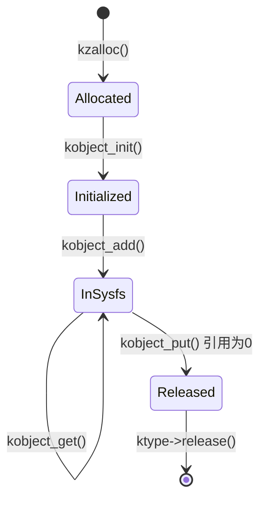
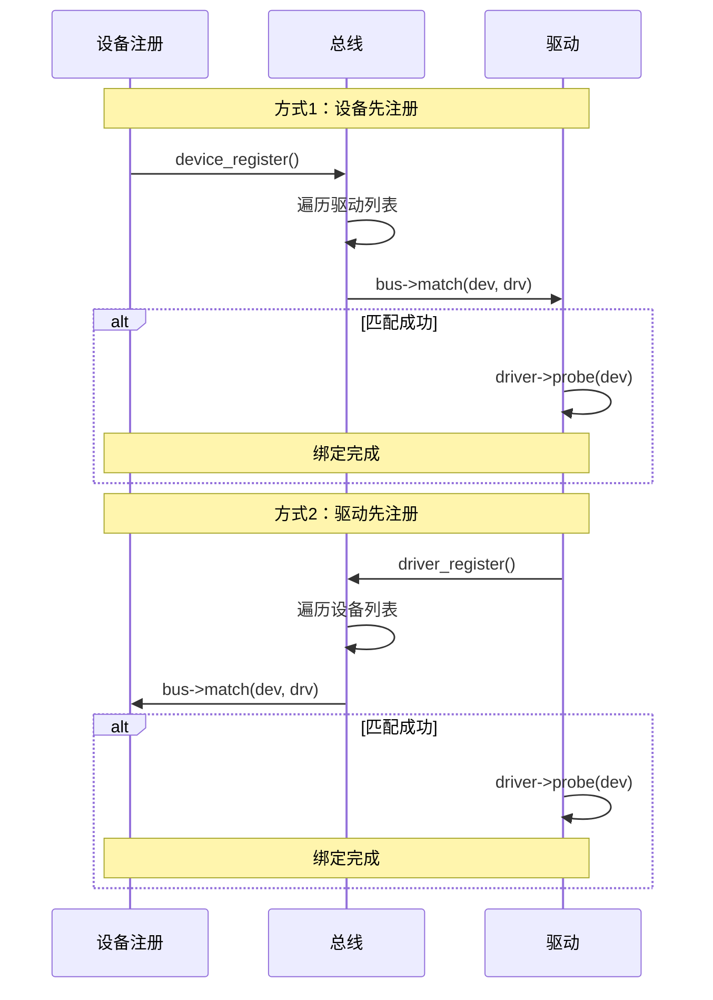

+++
title = "Linux设备驱动模型详解"
date = 2026-02-02
weight = 30000
description = "Linux设备驱动模型：kobject、kset、ktype、sysfs、udev、设备树、平台设备"
[taxonomies]
tags = ["Linux", "内核", "设备驱动", "kobject", "sysfs"]
+++

# Linux 设备驱动模型详解

本文深入剖析 Linux 内核的设备驱动模型（Device Model），包括 kobject 基础设施、sysfs 虚拟文件系统、设备与驱动的匹配机制、设备树（Device Tree）等核心内容。

---

## 一、设备驱动模型概述

### 1.1 为什么需要统一的设备模型

早期 Linux 内核（2.4 及之前）存在的问题：

| 问题 | 影响 |
|------|------|
| 缺乏统一的设备表示 | 每种总线有自己的设备管理方式 |
| 电源管理困难 | 无法确定设备依赖关系 |
| 热插拔支持复杂 | 需要各总线单独实现 |
| 用户空间接口不统一 | /proc 下各种杂乱的接口 |

Linux 2.6 引入了 **统一设备模型**（Unified Device Model），核心目标：

1. **统一设备表示**：所有设备用统一的数据结构描述
2. **设备层次结构**：反映真实的硬件拓扑
3. **电源管理**：按依赖顺序挂起/恢复
4. **热插拔支持**：统一的事件通知机制
5. **用户空间接口**：通过 sysfs 提供一致的接口

### 1.2 核心组件架构

```mermaid
graph TD
    subgraph "内核空间"
        KOBJECT[kobject<br/>内核对象基础]
        KSET[kset<br/>对象集合]
        KTYPE[ktype<br/>对象类型]
        
        DEVICE[struct device<br/>设备]
        DRIVER[struct device_driver<br/>驱动]
        BUS[struct bus_type<br/>总线]
        CLASS[struct class<br/>设备类]
        
        KOBJECT --> KSET
        KOBJECT --> KTYPE
        DEVICE --> KOBJECT
        DRIVER --> KOBJECT
        BUS --> KOBJECT
        CLASS --> KOBJECT
    end
    
    subgraph "用户空间"
        SYSFS[/sys 文件系统]
        UDEV[udev 守护进程]
        DEVFS[/dev 设备节点]
    end
    
    KOBJECT --> SYSFS
    SYSFS --> UDEV
    UDEV --> DEVFS
```

---

## 二、kobject 基础设施

### 2.1 kobject 结构

`kobject` 是设备模型的基础构建块，提供：

- 引用计数（生命周期管理）
- sysfs 表示（用户空间可见）
- 热插拔事件通知
- 层次结构（parent/child 关系）

```c
/* include/linux/kobject.h */
struct kobject {
    const char          *name;           // 对象名称
    struct list_head    entry;           // 链表节点
    struct kobject      *parent;         // 父对象
    struct kset         *kset;           // 所属集合
    struct kobj_type    *ktype;          // 类型操作
    struct kernfs_node  *sd;             // sysfs 目录节点
    struct kref         kref;            // 引用计数
    
    unsigned int state_initialized:1;    // 是否已初始化
    unsigned int state_in_sysfs:1;       // 是否在 sysfs 中
    unsigned int state_add_uevent_sent:1;// 是否发送过添加事件
    unsigned int state_remove_uevent_sent:1;
};
```

### 2.2 kobject 生命周期



**关键 API**：

```c
/* 初始化 */
void kobject_init(struct kobject *kobj, struct kobj_type *ktype);

/* 添加到 sysfs */
int kobject_add(struct kobject *kobj, struct kobject *parent,
                const char *fmt, ...);

/* 一步完成初始化和添加 */
int kobject_init_and_add(struct kobject *kobj, struct kobj_type *ktype,
                         struct kobject *parent, const char *fmt, ...);

/* 引用计数 */
struct kobject *kobject_get(struct kobject *kobj);
void kobject_put(struct kobject *kobj);

/* 删除 */
void kobject_del(struct kobject *kobj);
```

### 2.3 kobj_type：对象类型

`kobj_type` 定义 kobject 的类型特定操作：

```c
struct kobj_type {
    void (*release)(struct kobject *kobj);           // 释放回调
    const struct sysfs_ops *sysfs_ops;               // sysfs 读写操作
    const struct attribute_group **default_groups;   // 默认属性组
    const struct kobj_ns_type_operations *(*child_ns_type)(struct kobject *kobj);
    const void *(*namespace)(struct kobject *kobj);
    void (*get_ownership)(struct kobject *kobj, kuid_t *uid, kgid_t *gid);
};

/* sysfs 操作 */
struct sysfs_ops {
    ssize_t (*show)(struct kobject *kobj, struct attribute *attr, char *buf);
    ssize_t (*store)(struct kobject *kobj, struct attribute *attr,
                     const char *buf, size_t count);
};
```

### 2.4 kset：对象集合

`kset` 是同类 kobject 的集合，提供：

- 包含多个 kobject
- 统一的热插拔事件过滤
- sysfs 中的目录

```c
struct kset {
    struct list_head list;                   // kobject 链表
    spinlock_t list_lock;                    // 链表锁
    struct kobject kobj;                     // 内嵌 kobject
    const struct kset_uevent_ops *uevent_ops; // uevent 操作
};

/* uevent 操作 */
struct kset_uevent_ops {
    int (*filter)(struct kset *kset, struct kobject *kobj);
    const char *(*name)(struct kset *kset, struct kobject *kobj);
    int (*uevent)(struct kset *kset, struct kobject *kobj,
                  struct kobj_uevent_env *env);
};
```

### 2.5 实际示例：创建 kobject

```c
#include <linux/kobject.h>
#include <linux/module.h>

static struct kobject *my_kobj;

/* 属性定义 */
static ssize_t my_attr_show(struct kobject *kobj, struct kobj_attribute *attr,
                            char *buf)
{
    return sprintf(buf, "Hello from my_attr\n");
}

static ssize_t my_attr_store(struct kobject *kobj, struct kobj_attribute *attr,
                             const char *buf, size_t count)
{
    pr_info("Received: %s\n", buf);
    return count;
}

static struct kobj_attribute my_attr = __ATTR(my_attr, 0644, my_attr_show, my_attr_store);

static struct attribute *my_attrs[] = {
    &my_attr.attr,
    NULL,
};

static struct attribute_group my_attr_group = {
    .attrs = my_attrs,
};

static int __init my_init(void)
{
    int ret;
    
    /* 创建 kobject，在 /sys/kernel/ 下创建 my_kobject 目录 */
    my_kobj = kobject_create_and_add("my_kobject", kernel_kobj);
    if (!my_kobj)
        return -ENOMEM;
    
    /* 创建属性文件 */
    ret = sysfs_create_group(my_kobj, &my_attr_group);
    if (ret) {
        kobject_put(my_kobj);
        return ret;
    }
    
    pr_info("my_kobject created at /sys/kernel/my_kobject\n");
    return 0;
}

static void __exit my_exit(void)
{
    kobject_put(my_kobj);
    pr_info("my_kobject removed\n");
}

module_init(my_init);
module_exit(my_exit);
MODULE_LICENSE("GPL");
```

---

## 三、sysfs 虚拟文件系统

### 3.1 sysfs 概述

sysfs 是一个基于内存的虚拟文件系统，挂载在 `/sys`，将内核对象层次结构导出到用户空间。

```bash
/sys/
├── block/          # 块设备
├── bus/            # 总线类型
│   ├── pci/
│   ├── usb/
│   └── platform/
├── class/          # 设备类
│   ├── net/
│   ├── block/
│   └── input/
├── devices/        # 全局设备层次
│   ├── system/
│   ├── virtual/
│   └── pci0000:00/
├── firmware/       # 固件接口
├── fs/             # 文件系统
├── kernel/         # 内核参数
├── module/         # 已加载模块
└── power/          # 电源管理
```

### 3.2 sysfs 属性

属性是 sysfs 中的文件，代表内核对象的某个属性：

```c
/* 基本属性 */
struct attribute {
    const char *name;       // 属性名（文件名）
    umode_t mode;           // 权限
};

/* 设备属性 */
struct device_attribute {
    struct attribute attr;
    ssize_t (*show)(struct device *dev, struct device_attribute *attr,
                    char *buf);
    ssize_t (*store)(struct device *dev, struct device_attribute *attr,
                     const char *buf, size_t count);
};

/* 宏简化定义 */
#define DEVICE_ATTR_RO(_name) \
    struct device_attribute dev_attr_##_name = __ATTR_RO(_name)

#define DEVICE_ATTR_RW(_name) \
    struct device_attribute dev_attr_##_name = __ATTR_RW(_name)
```

### 3.3 sysfs 属性组

```c
/* 属性组 */
struct attribute_group {
    const char *name;                    // 组名（子目录名）
    umode_t (*is_visible)(struct kobject *, struct attribute *, int);
    umode_t (*is_bin_visible)(struct kobject *, struct bin_attribute *, int);
    struct attribute **attrs;            // 普通属性数组
    struct bin_attribute **bin_attrs;    // 二进制属性数组
};

/* 创建/删除属性组 */
int sysfs_create_group(struct kobject *kobj, const struct attribute_group *grp);
void sysfs_remove_group(struct kobject *kobj, const struct attribute_group *grp);
```

### 3.4 二进制属性

用于导出二进制数据（如固件、EEPROM 内容）：

```c
struct bin_attribute {
    struct attribute attr;
    size_t size;                         // 数据大小
    void *private;                       // 私有数据
    ssize_t (*read)(struct file *filp, struct kobject *kobj,
                    struct bin_attribute *attr, char *buf,
                    loff_t offset, size_t count);
    ssize_t (*write)(struct file *filp, struct kobject *kobj,
                     struct bin_attribute *attr, char *buf,
                     loff_t offset, size_t count);
    int (*mmap)(struct file *filp, struct kobject *kobj,
                struct bin_attribute *attr, struct vm_area_struct *vma);
};
```

---

## 四、设备与驱动

### 4.1 struct device

`struct device` 是所有设备的基类：

```c
struct device {
    struct kobject kobj;                    // 内嵌 kobject
    struct device *parent;                  // 父设备
    
    const char *init_name;                  // 初始名称
    const struct device_type *type;         // 设备类型
    
    struct bus_type *bus;                   // 所属总线
    struct device_driver *driver;           // 绑定的驱动
    
    void *platform_data;                    // 平台数据
    void *driver_data;                      // 驱动私有数据
    
    struct dev_pm_info power;               // 电源管理信息
    struct dev_pm_domain *pm_domain;        // 电源域
    
    u64 *dma_mask;                          // DMA 掩码
    u64 coherent_dma_mask;                  // 一致性 DMA 掩码
    
    struct device_node *of_node;            // 设备树节点
    struct fwnode_handle *fwnode;           // 固件节点
    
    dev_t devt;                             // 设备号
    u32 id;                                 // 设备 ID
    
    spinlock_t devres_lock;                 // 资源锁
    struct list_head devres_head;           // 资源链表
    
    struct class *class;                    // 所属类
    const struct attribute_group **groups;  // 属性组
    
    void (*release)(struct device *dev);    // 释放函数
};
```

### 4.2 struct device_driver

`struct device_driver` 是所有驱动的基类：

```c
struct device_driver {
    const char *name;                       // 驱动名称
    struct bus_type *bus;                   // 所属总线
    
    struct module *owner;                   // 所属模块
    const char *mod_name;                   // 模块名
    
    bool suppress_bind_attrs;               // 禁止 bind/unbind 属性
    
    const struct of_device_id *of_match_table;   // 设备树匹配表
    const struct acpi_device_id *acpi_match_table; // ACPI 匹配表
    
    int (*probe)(struct device *dev);       // 探测函数
    void (*sync_state)(struct device *dev); // 同步状态
    int (*remove)(struct device *dev);      // 移除函数
    void (*shutdown)(struct device *dev);   // 关机函数
    
    int (*suspend)(struct device *dev, pm_message_t state);
    int (*resume)(struct device *dev);
    
    const struct attribute_group **groups;  // 属性组
    const struct dev_pm_ops *pm;            // 电源管理操作
    
    struct driver_private *p;               // 私有数据
};
```

### 4.3 设备与驱动的绑定



---

## 五、总线类型

### 5.1 struct bus_type

```c
struct bus_type {
    const char *name;                       // 总线名称
    const char *dev_name;                   // 设备名前缀
    struct device *dev_root;                // 根设备
    
    const struct attribute_group **bus_groups;    // 总线属性
    const struct attribute_group **dev_groups;    // 设备属性
    const struct attribute_group **drv_groups;    // 驱动属性
    
    int (*match)(struct device *dev, struct device_driver *drv);  // 匹配函数
    int (*uevent)(struct device *dev, struct kobj_uevent_env *env);
    int (*probe)(struct device *dev);       // 探测
    void (*sync_state)(struct device *dev);
    int (*remove)(struct device *dev);      // 移除
    void (*shutdown)(struct device *dev);   // 关机
    
    int (*online)(struct device *dev);      // 上线
    int (*offline)(struct device *dev);     // 下线
    
    int (*suspend)(struct device *dev, pm_message_t state);
    int (*resume)(struct device *dev);
    
    const struct dev_pm_ops *pm;            // 电源管理
    
    struct subsys_private *p;               // 私有数据
};
```

### 5.2 平台总线（Platform Bus）

平台总线是最常用的虚拟总线，用于不能自动探测的设备：

```c
/* 平台设备 */
struct platform_device {
    const char *name;                       // 设备名
    int id;                                 // 设备 ID
    struct device dev;                      // 通用设备
    u32 num_resources;                      // 资源数量
    struct resource *resource;              // 资源数组
    const struct platform_device_id *id_entry;
    struct pdev_archdata archdata;          // 架构相关数据
};

/* 平台驱动 */
struct platform_driver {
    int (*probe)(struct platform_device *);
    int (*remove)(struct platform_device *);
    void (*shutdown)(struct platform_device *);
    int (*suspend)(struct platform_device *, pm_message_t);
    int (*resume)(struct platform_device *);
    struct device_driver driver;
    const struct platform_device_id *id_table;
    bool prevent_deferred_probe;
};
```

### 5.3 平台驱动示例

```c
#include <linux/module.h>
#include <linux/platform_device.h>
#include <linux/of.h>

struct my_device_data {
    void __iomem *base;
    int irq;
};

static int my_probe(struct platform_device *pdev)
{
    struct my_device_data *data;
    struct resource *res;
    
    /* 分配私有数据 */
    data = devm_kzalloc(&pdev->dev, sizeof(*data), GFP_KERNEL);
    if (!data)
        return -ENOMEM;
    
    /* 获取内存资源 */
    res = platform_get_resource(pdev, IORESOURCE_MEM, 0);
    data->base = devm_ioremap_resource(&pdev->dev, res);
    if (IS_ERR(data->base))
        return PTR_ERR(data->base);
    
    /* 获取中断资源 */
    data->irq = platform_get_irq(pdev, 0);
    if (data->irq < 0)
        return data->irq;
    
    /* 保存私有数据 */
    platform_set_drvdata(pdev, data);
    
    dev_info(&pdev->dev, "probed successfully\n");
    return 0;
}

static int my_remove(struct platform_device *pdev)
{
    dev_info(&pdev->dev, "removed\n");
    return 0;
}

/* 设备树匹配表 */
static const struct of_device_id my_of_match[] = {
    { .compatible = "vendor,my-device" },
    { }
};
MODULE_DEVICE_TABLE(of, my_of_match);

/* 平台设备 ID 表 */
static const struct platform_device_id my_id_table[] = {
    { "my-device", 0 },
    { }
};
MODULE_DEVICE_TABLE(platform, my_id_table);

static struct platform_driver my_driver = {
    .probe = my_probe,
    .remove = my_remove,
    .driver = {
        .name = "my-device",
        .of_match_table = my_of_match,
    },
    .id_table = my_id_table,
};

module_platform_driver(my_driver);

MODULE_LICENSE("GPL");
MODULE_AUTHOR("Author");
MODULE_DESCRIPTION("My Platform Driver");
```

---

## 六、设备类（Device Class）

### 6.1 struct class

设备类提供设备的高层视图，按功能分类：

```c
struct class {
    const char *name;                       // 类名
    struct module *owner;                   // 所属模块
    
    const struct attribute_group **class_groups;    // 类属性
    const struct attribute_group **dev_groups;      // 设备属性
    
    int (*dev_uevent)(struct device *dev, struct kobj_uevent_env *env);
    char *(*devnode)(struct device *dev, umode_t *mode);
    
    void (*class_release)(struct class *class);
    void (*dev_release)(struct device *dev);
    
    int (*shutdown_pre)(struct device *dev);
    
    const struct dev_pm_ops *pm;            // 电源管理
    
    struct subsys_private *p;               // 私有数据
};
```

### 6.2 使用设备类

```c
static struct class *my_class;
static dev_t my_devt;

static int __init my_init(void)
{
    struct device *dev;
    
    /* 分配设备号 */
    alloc_chrdev_region(&my_devt, 0, 1, "my_device");
    
    /* 创建设备类 */
    my_class = class_create(THIS_MODULE, "my_class");
    if (IS_ERR(my_class)) {
        unregister_chrdev_region(my_devt, 1);
        return PTR_ERR(my_class);
    }
    
    /* 创建设备，自动创建 /dev/my_device */
    dev = device_create(my_class, NULL, my_devt, NULL, "my_device");
    if (IS_ERR(dev)) {
        class_destroy(my_class);
        unregister_chrdev_region(my_devt, 1);
        return PTR_ERR(dev);
    }
    
    return 0;
}

static void __exit my_exit(void)
{
    device_destroy(my_class, my_devt);
    class_destroy(my_class);
    unregister_chrdev_region(my_devt, 1);
}
```

---

## 七、设备树（Device Tree）

### 7.1 设备树概述

设备树（Device Tree）是描述硬件的数据结构，源自 Open Firmware：

- **DTS**：Device Tree Source，源文件
- **DTB**：Device Tree Blob，编译后的二进制
- **DTC**：Device Tree Compiler，编译器

```
/* 设备树示例：my-board.dts */
/dts-v1/;

/ {
    compatible = "vendor,my-board";
    #address-cells = <1>;
    #size-cells = <1>;
    
    cpus {
        #address-cells = <1>;
        #size-cells = <0>;
        
        cpu@0 {
            device_type = "cpu";
            compatible = "arm,cortex-a53";
            reg = <0>;
        };
    };
    
    memory@80000000 {
        device_type = "memory";
        reg = <0x80000000 0x40000000>;  /* 1GB at 0x80000000 */
    };
    
    soc {
        compatible = "simple-bus";
        #address-cells = <1>;
        #size-cells = <1>;
        ranges;
        
        uart0: serial@10000000 {
            compatible = "vendor,my-uart";
            reg = <0x10000000 0x1000>;
            interrupts = <0 10 4>;
            clock-frequency = <115200>;
            status = "okay";
        };
        
        gpio: gpio@10001000 {
            compatible = "vendor,my-gpio";
            reg = <0x10001000 0x100>;
            gpio-controller;
            #gpio-cells = <2>;
            interrupt-controller;
            #interrupt-cells = <2>;
        };
    };
};
```

### 7.2 设备树节点解析

```c
#include <linux/of.h>
#include <linux/of_device.h>

static int my_probe(struct platform_device *pdev)
{
    struct device_node *np = pdev->dev.of_node;
    u32 clock_freq;
    const char *name;
    int ret;
    
    /* 读取字符串属性 */
    ret = of_property_read_string(np, "device-name", &name);
    if (ret)
        name = "default";
    
    /* 读取整数属性 */
    ret = of_property_read_u32(np, "clock-frequency", &clock_freq);
    if (ret)
        clock_freq = 115200;
    
    /* 检查属性是否存在 */
    if (of_property_read_bool(np, "enable-dma"))
        dev_info(&pdev->dev, "DMA enabled\n");
    
    /* 遍历子节点 */
    for_each_child_of_node(np, child) {
        const char *child_name;
        of_property_read_string(child, "name", &child_name);
        dev_info(&pdev->dev, "Child: %s\n", child_name);
    }
    
    return 0;
}

/* 设备树匹配表 */
static const struct of_device_id my_of_match[] = {
    { .compatible = "vendor,my-uart", .data = (void *)UART_TYPE_A },
    { .compatible = "vendor,my-uart-v2", .data = (void *)UART_TYPE_B },
    { }
};
MODULE_DEVICE_TABLE(of, my_of_match);

static int my_probe(struct platform_device *pdev)
{
    const struct of_device_id *match;
    enum uart_type type;
    
    /* 获取匹配的条目 */
    match = of_match_device(my_of_match, &pdev->dev);
    if (match)
        type = (enum uart_type)match->data;
    
    return 0;
}
```

### 7.3 GPIO 子系统与设备树

```c
#include <linux/gpio/consumer.h>

static int my_probe(struct platform_device *pdev)
{
    struct gpio_desc *reset_gpio;
    struct gpio_desc *enable_gpio;
    
    /* 获取 GPIO（设备树中定义） */
    reset_gpio = devm_gpiod_get(&pdev->dev, "reset", GPIOD_OUT_HIGH);
    if (IS_ERR(reset_gpio))
        return PTR_ERR(reset_gpio);
    
    enable_gpio = devm_gpiod_get_optional(&pdev->dev, "enable", GPIOD_OUT_LOW);
    
    /* 操作 GPIO */
    gpiod_set_value(reset_gpio, 0);  /* 拉低 */
    msleep(10);
    gpiod_set_value(reset_gpio, 1);  /* 拉高 */
    
    return 0;
}

/* 设备树中的定义 */
/*
my_device {
    compatible = "vendor,my-device";
    reset-gpios = <&gpio 5 GPIO_ACTIVE_LOW>;
    enable-gpios = <&gpio 6 GPIO_ACTIVE_HIGH>;
};
*/
```

---

## 八、udev 与热插拔

### 8.1 uevent 机制

内核通过 uevent 通知用户空间设备变化：

```c
/* 发送 uevent */
int kobject_uevent(struct kobject *kobj, enum kobject_action action);
int kobject_uevent_env(struct kobject *kobj, enum kobject_action action,
                       char *envp[]);

/* action 类型 */
enum kobject_action {
    KOBJ_ADD,       // 设备添加
    KOBJ_REMOVE,    // 设备移除
    KOBJ_CHANGE,    // 设备状态改变
    KOBJ_MOVE,      // 设备移动
    KOBJ_ONLINE,    // 设备上线
    KOBJ_OFFLINE,   // 设备下线
    KOBJ_BIND,      // 驱动绑定
    KOBJ_UNBIND,    // 驱动解绑
};
```

### 8.2 udev 规则

udev 根据规则处理设备事件：

```bash
# /etc/udev/rules.d/99-my-device.rules

# 根据 vendor/product ID 匹配 USB 设备
SUBSYSTEM=="usb", ATTR{idVendor}=="1234", ATTR{idProduct}=="5678", \
    MODE="0666", GROUP="plugdev", SYMLINK+="my_usb_device"

# 根据驱动名匹配
DRIVER=="my_driver", MODE="0660", GROUP="my_group"

# 运行外部脚本
SUBSYSTEM=="net", ACTION=="add", KERNEL=="eth*", \
    RUN+="/usr/local/bin/network-setup.sh"

# 设置权限
KERNEL=="ttyUSB[0-9]*", MODE="0666"

# 创建符号链接
SUBSYSTEM=="block", ATTRS{serial}=="ABC123", SYMLINK+="my_disk"
```

### 8.3 udevadm 工具

```bash
# 监控 uevent
udevadm monitor --kernel --udev

# 查看设备信息
udevadm info -a -p /sys/class/net/eth0

# 触发事件
udevadm trigger

# 测试规则
udevadm test /sys/class/net/eth0
```

---

## 九、电源管理

### 9.1 设备电源状态

```c
/* 电源管理操作 */
struct dev_pm_ops {
    /* 系统级电源管理 */
    int (*prepare)(struct device *dev);
    void (*complete)(struct device *dev);
    int (*suspend)(struct device *dev);
    int (*resume)(struct device *dev);
    int (*freeze)(struct device *dev);
    int (*thaw)(struct device *dev);
    int (*poweroff)(struct device *dev);
    int (*restore)(struct device *dev);
    
    /* 运行时电源管理 */
    int (*runtime_suspend)(struct device *dev);
    int (*runtime_resume)(struct device *dev);
    int (*runtime_idle)(struct device *dev);
};
```

### 9.2 运行时电源管理

```c
#include <linux/pm_runtime.h>

static int my_probe(struct platform_device *pdev)
{
    /* 启用运行时 PM */
    pm_runtime_enable(&pdev->dev);
    
    /* 初始标记为活跃 */
    pm_runtime_set_active(&pdev->dev);
    
    return 0;
}

static int my_remove(struct platform_device *pdev)
{
    pm_runtime_disable(&pdev->dev);
    return 0;
}

/* 在驱动中使用 */
static int my_operation(struct device *dev)
{
    int ret;
    
    /* 确保设备活跃 */
    ret = pm_runtime_get_sync(dev);
    if (ret < 0) {
        pm_runtime_put_noidle(dev);
        return ret;
    }
    
    /* 执行操作 */
    do_something();
    
    /* 标记使用完成 */
    pm_runtime_put(dev);
    
    return 0;
}

static int my_runtime_suspend(struct device *dev)
{
    /* 关闭时钟、断电等 */
    return 0;
}

static int my_runtime_resume(struct device *dev)
{
    /* 开启时钟、上电等 */
    return 0;
}

static const struct dev_pm_ops my_pm_ops = {
    SET_RUNTIME_PM_OPS(my_runtime_suspend, my_runtime_resume, NULL)
    SET_SYSTEM_SLEEP_PM_OPS(my_suspend, my_resume)
};

static struct platform_driver my_driver = {
    .driver = {
        .name = "my-device",
        .pm = &my_pm_ops,
    },
};
```

---

## 十、常见面试问题

### 10.1 kobject 相关

**Q: kobject 的引用计数如何工作？**

A: 
1. `kobject_get()` 增加引用计数
2. `kobject_put()` 减少引用计数
3. 引用计数归零时调用 `ktype->release()` 释放资源
4. 必须在 `release` 中释放 kobject 所在的结构体

**Q: kset 和 ktype 的区别？**

| 特性 | kset | ktype |
|------|------|-------|
| 作用 | kobject 的容器 | kobject 的类型 |
| sysfs | 创建目录 | 定义属性操作 |
| 事件 | 过滤/处理 uevent | 无 |
| 释放 | 无 | 定义 release 回调 |

### 10.2 设备驱动绑定

**Q: 设备和驱动如何匹配？**

A: 总线的 `match()` 函数决定匹配规则：

1. **设备树匹配**：`of_match_table` 中的 `compatible` 属性
2. **ACPI 匹配**：`acpi_match_table`
3. **ID 表匹配**：`id_table` 中的设备名
4. **名称匹配**：设备名与驱动名相同

```c
/* 平台总线的 match 实现 */
static int platform_match(struct device *dev, struct device_driver *drv)
{
    struct platform_device *pdev = to_platform_device(dev);
    struct platform_driver *pdrv = to_platform_driver(drv);
    
    /* 1. 设备树匹配 */
    if (of_driver_match_device(dev, drv))
        return 1;
    
    /* 2. ACPI 匹配 */
    if (acpi_driver_match_device(dev, drv))
        return 1;
    
    /* 3. ID 表匹配 */
    if (pdrv->id_table)
        return platform_match_id(pdrv->id_table, pdev) != NULL;
    
    /* 4. 名称匹配 */
    return strcmp(pdev->name, drv->name) == 0;
}
```

### 10.3 devm 资源管理

**Q: 什么是 devm 系列函数？**

A: devm（device managed）函数自动管理资源生命周期：

```c
/* 普通方式（需要手动释放） */
base = ioremap(res->start, resource_size(res));
// ... 错误时需要 iounmap(base);

/* devm 方式（自动释放） */
base = devm_ioremap_resource(&pdev->dev, res);
// 设备移除时自动释放，无需手动 iounmap
```

常用 devm 函数：
- `devm_kzalloc()` / `devm_kmalloc()` - 内存分配
- `devm_ioremap_resource()` - I/O 内存映射
- `devm_request_irq()` - 中断请求
- `devm_clk_get()` - 时钟获取
- `devm_gpiod_get()` - GPIO 获取

---

## 相关文章

- [上一篇：内核面试题-文件系统与VFS](@/articles/linux/linux-29-内核面试题-文件系统与VFS.md)
- [下一篇：Linux容器基础详解](@/articles/linux/linux-31-Linux容器基础详解.md)
- [内核同步机制详解](@/articles/linux/linux-18-内核同步机制详解.md)
