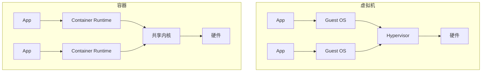
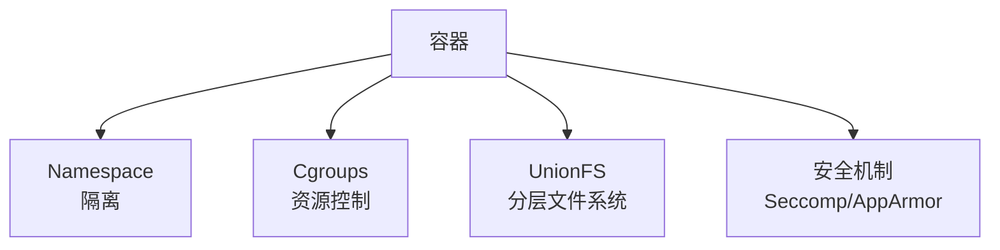
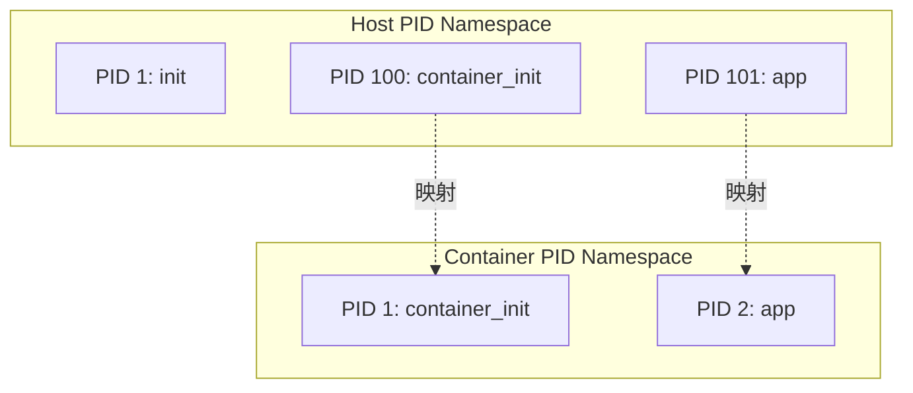
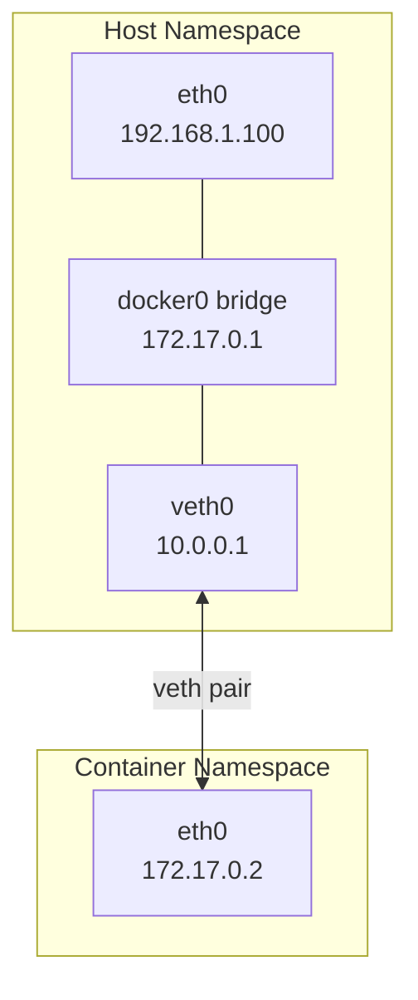
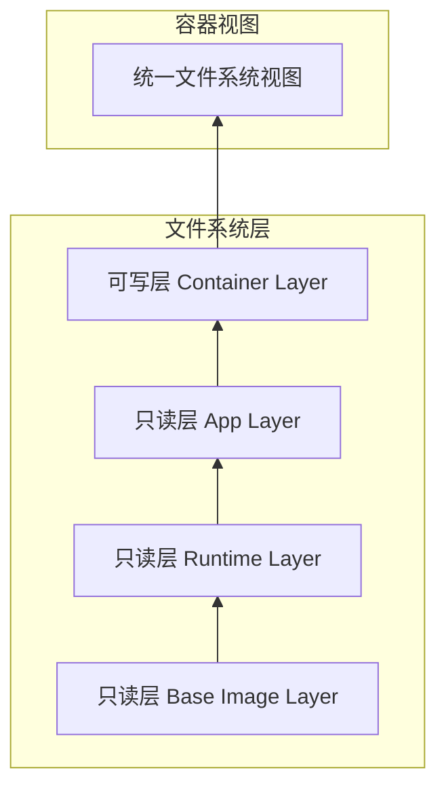
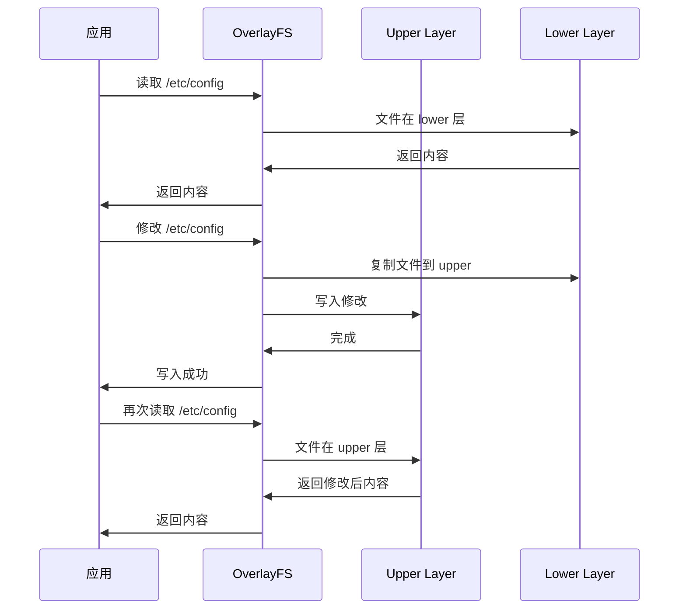
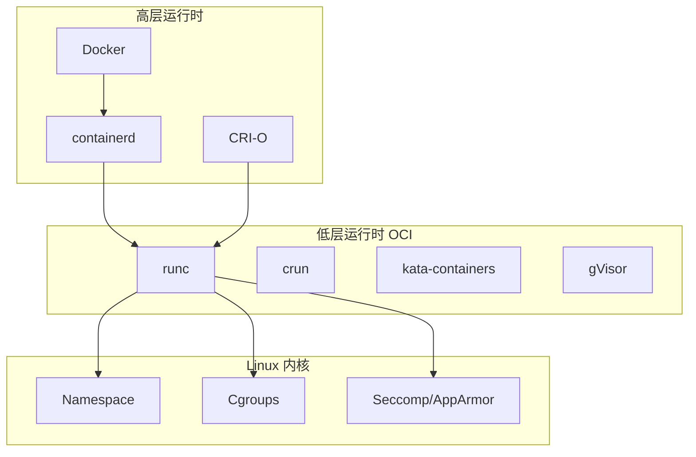
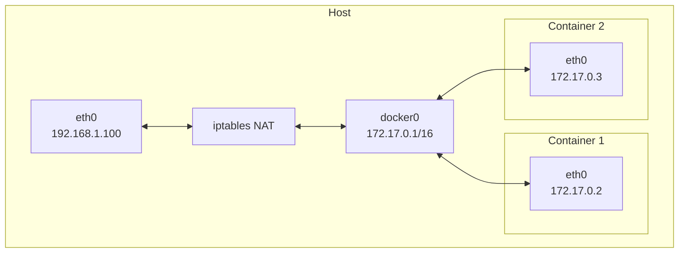

+++
title = "31. Linux容器基础详解"
date = 2026-02-02
weight = 31000
description = "Linux容器技术：Namespace隔离、Cgroups资源控制、UnionFS、容器运行时原理"
[taxonomies]
tags = ["Linux", "容器", "Docker", "Namespace", "Cgroups"]
+++

# Linux 容器基础详解

本文深入剖析 Linux 容器的核心技术：Namespace 隔离机制、Cgroups 资源控制、UnionFS 分层文件系统，以及容器运行时的实现原理。

---

## 一、容器技术概述

### 1.1 什么是容器

容器是一种**操作系统级虚拟化**技术，共享宿主机内核，但拥有独立的：

- 进程空间
- 网络栈
- 文件系统
- 用户空间



### 1.2 容器 vs 虚拟机

| 特性 | 容器 | 虚拟机 |
|------|------|--------|
| 隔离级别 | 进程级 | 硬件级 |
| 启动时间 | 毫秒级 | 分钟级 |
| 资源开销 | MB 级 | GB 级 |
| 性能 | 接近原生 | 有损耗 |
| 安全性 | 共享内核风险 | 强隔离 |
| 密度 | 单机数百个 | 单机数十个 |

### 1.3 容器核心技术



---

## 二、Namespace 隔离机制

### 2.1 Namespace 概述

Namespace 提供进程级的资源隔离，让进程认为自己拥有独立的系统资源。

| Namespace | 隔离内容 | 内核版本 |
|-----------|----------|----------|
| **Mount (mnt)** | 文件系统挂载点 | 2.4.19 |
| **UTS** | 主机名、域名 | 2.6.19 |
| **IPC** | 进程间通信 | 2.6.19 |
| **PID** | 进程 ID | 2.6.24 |
| **Network (net)** | 网络栈 | 2.6.29 |
| **User** | 用户/组 ID | 3.8 |
| **Cgroup** | Cgroup 根目录 | 4.6 |
| **Time** | 系统时间 | 5.6 |

### 2.2 Namespace API

```c
#include <sched.h>
#include <sys/mount.h>

/* 创建新 namespace 的方式 */

/* 1. clone() - 创建子进程时指定新 namespace */
int clone(int (*fn)(void *), void *stack, int flags, void *arg);

/* 常用 flags */
#define CLONE_NEWNS     0x00020000  /* Mount namespace */
#define CLONE_NEWUTS    0x04000000  /* UTS namespace */
#define CLONE_NEWIPC    0x08000000  /* IPC namespace */
#define CLONE_NEWPID    0x20000000  /* PID namespace */
#define CLONE_NEWNET    0x40000000  /* Network namespace */
#define CLONE_NEWUSER   0x10000000  /* User namespace */
#define CLONE_NEWCGROUP 0x02000000  /* Cgroup namespace */

/* 2. unshare() - 当前进程脱离原 namespace */
int unshare(int flags);

/* 3. setns() - 加入已存在的 namespace */
int setns(int fd, int nstype);
```

### 2.3 Mount Namespace

隔离文件系统挂载点，每个容器看到不同的文件系统视图：

```c
#define _GNU_SOURCE
#include <sched.h>
#include <stdio.h>
#include <stdlib.h>
#include <sys/mount.h>
#include <sys/wait.h>
#include <unistd.h>

static char child_stack[1024 * 1024];

static int child_fn(void *arg)
{
    printf("Child PID: %d\n", getpid());
    
    /* 创建新的根文件系统 */
    mount("none", "/", NULL, MS_REC | MS_PRIVATE, NULL);
    
    /* 挂载新的 proc */
    mount("proc", "/proc", "proc", 0, NULL);
    
    /* 挂载 tmpfs */
    mount("tmpfs", "/tmp", "tmpfs", 0, "size=64M");
    
    execl("/bin/bash", "/bin/bash", NULL);
    return 0;
}

int main()
{
    pid_t child_pid = clone(child_fn,
                           child_stack + sizeof(child_stack),
                           CLONE_NEWNS | SIGCHLD,
                           NULL);
    
    waitpid(child_pid, NULL, 0);
    return 0;
}
```

### 2.4 PID Namespace

隔离进程 ID，容器内的进程看到不同的 PID：

```c
static int child_fn(void *arg)
{
    printf("Child PID in container: %d\n", getpid());  /* 输出 1 */
    
    /* 容器内的 init 进程 */
    for (;;) {
        sleep(1);
    }
    return 0;
}

int main()
{
    pid_t child_pid = clone(child_fn,
                           child_stack + sizeof(child_stack),
                           CLONE_NEWPID | SIGCHLD,
                           NULL);
    
    printf("Child PID on host: %d\n", child_pid);  /* 宿主机上的真实 PID */
    waitpid(child_pid, NULL, 0);
    return 0;
}
```



### 2.5 Network Namespace

隔离网络栈，每个容器有独立的网络设备、IP 地址、路由表：

```bash
# 创建 network namespace
ip netns add myns

# 在 namespace 中执行命令
ip netns exec myns ip link list

# 创建 veth pair 连接 namespace
ip link add veth0 type veth peer name veth1
ip link set veth1 netns myns

# 配置 IP
ip addr add 10.0.0.1/24 dev veth0
ip link set veth0 up

ip netns exec myns ip addr add 10.0.0.2/24 dev veth1
ip netns exec myns ip link set veth1 up
ip netns exec myns ip link set lo up

# 测试连通性
ping 10.0.0.2
ip netns exec myns ping 10.0.0.1
```



### 2.6 User Namespace

隔离用户和组 ID，实现容器内 root 映射到宿主机普通用户：

```c
#define _GNU_SOURCE
#include <sched.h>
#include <stdio.h>
#include <sys/types.h>
#include <unistd.h>

static int child_fn(void *arg)
{
    printf("eUID: %d, eGID: %d\n", geteuid(), getegid());
    
    /* 配置 UID/GID 映射 */
    FILE *f;
    
    /* 写入 /proc/self/uid_map */
    f = fopen("/proc/self/uid_map", "w");
    fprintf(f, "0 1000 1\n");  /* 容器内 UID 0 映射到宿主机 UID 1000 */
    fclose(f);
    
    /* 禁用 setgroups（安全要求） */
    f = fopen("/proc/self/setgroups", "w");
    fprintf(f, "deny\n");
    fclose(f);
    
    /* 写入 /proc/self/gid_map */
    f = fopen("/proc/self/gid_map", "w");
    fprintf(f, "0 1000 1\n");
    fclose(f);
    
    printf("After mapping - eUID: %d, eGID: %d\n", geteuid(), getegid());
    
    return 0;
}

int main()
{
    clone(child_fn, child_stack + sizeof(child_stack),
          CLONE_NEWUSER | SIGCHLD, NULL);
    wait(NULL);
    return 0;
}
```

### 2.7 查看 Namespace

```bash
# 查看进程的 namespace
ls -la /proc/$$/ns/
# lrwxrwxrwx 1 user user 0 Feb  2 10:00 cgroup -> 'cgroup:[4026531835]'
# lrwxrwxrwx 1 user user 0 Feb  2 10:00 ipc -> 'ipc:[4026531839]'
# lrwxrwxrwx 1 user user 0 Feb  2 10:00 mnt -> 'mnt:[4026531840]'
# lrwxrwxrwx 1 user user 0 Feb  2 10:00 net -> 'net:[4026531992]'
# lrwxrwxrwx 1 user user 0 Feb  2 10:00 pid -> 'pid:[4026531836]'
# lrwxrwxrwx 1 user user 0 Feb  2 10:00 user -> 'user:[4026531837]'
# lrwxrwxrwx 1 user user 0 Feb  2 10:00 uts -> 'uts:[4026531838]'

# 进入容器 namespace
nsenter --target <PID> --mount --uts --ipc --net --pid /bin/bash

# lsns 查看所有 namespace
lsns
```

---

## 三、Cgroups 资源控制

### 3.1 Cgroups 概述

Cgroups（Control Groups）限制、记录和隔离进程组的资源使用（CPU、内存、磁盘 I/O、网络等）。

```mermaid
graph TD
    subgraph "Cgroups 层次结构"
        ROOT[/ cgroup 根]
        ROOT --> SYSTEM[system.slice]
        ROOT --> USER[user.slice]
        ROOT --> DOCKER[docker]
        
        DOCKER --> C1[container1]
        DOCKER --> C2[container2]
        
        C1 --> C1CPU[cpu: 50%]
        C1 --> C1MEM[memory: 512M]
        
        C2 --> C2CPU[cpu: 25%]
        C2 --> C2MEM[memory: 256M]
    end
```

### 3.2 Cgroups v1 vs v2

| 特性 | Cgroups v1 | Cgroups v2 |
|------|------------|------------|
| 层次结构 | 多层次，每个控制器独立 | 单一统一层次 |
| 挂载点 | `/sys/fs/cgroup/<controller>` | `/sys/fs/cgroup` |
| 进程归属 | 进程可属于不同层次的不同 cgroup | 进程只能属于一个 cgroup |
| 线程支持 | 有限 | 完整的线程模式 |
| 压力指标 | 无 | PSI（Pressure Stall Information） |
| 主流使用 | Docker 默认（旧版） | systemd, 新版容器运行时 |

### 3.3 Cgroups v1 控制器

```bash
# 查看可用控制器
cat /proc/cgroups

# 常用控制器
# cpu       - CPU 时间分配
# cpuacct   - CPU 使用统计
# cpuset    - CPU 和内存节点分配
# memory    - 内存限制
# blkio     - 块设备 I/O 限制
# devices   - 设备访问控制
# freezer   - 进程挂起/恢复
# net_cls   - 网络包分类
# pids      - 进程数量限制
```

### 3.4 CPU 控制

```bash
# Cgroups v1 - CPU 限制
cd /sys/fs/cgroup/cpu

# 创建 cgroup
mkdir mygroup

# 设置 CPU 配额（限制为 50% CPU）
echo 50000 > mygroup/cpu.cfs_quota_us    # 配额：50ms
echo 100000 > mygroup/cpu.cfs_period_us  # 周期：100ms

# 设置 CPU 权重（shares，相对权重）
echo 512 > mygroup/cpu.shares  # 默认 1024

# 将进程加入 cgroup
echo $PID > mygroup/cgroup.procs

# 查看 CPU 使用统计
cat mygroup/cpuacct.usage  # 纳秒
```

```c
/* 代码中设置 CPU 限制 */
#include <stdio.h>
#include <stdlib.h>
#include <sys/stat.h>

void set_cpu_limit(pid_t pid, int percent)
{
    char path[256];
    FILE *f;
    
    /* 创建 cgroup */
    mkdir("/sys/fs/cgroup/cpu/mycontainer", 0755);
    
    /* 设置 CPU 配额 */
    snprintf(path, sizeof(path), "/sys/fs/cgroup/cpu/mycontainer/cpu.cfs_quota_us");
    f = fopen(path, "w");
    fprintf(f, "%d", percent * 1000);  /* percent% of 100ms period */
    fclose(f);
    
    /* 将进程加入 */
    snprintf(path, sizeof(path), "/sys/fs/cgroup/cpu/mycontainer/cgroup.procs");
    f = fopen(path, "w");
    fprintf(f, "%d", pid);
    fclose(f);
}
```

### 3.5 内存控制

```bash
# Cgroups v1 - 内存限制
cd /sys/fs/cgroup/memory

mkdir mygroup

# 设置内存限制（512MB）
echo 536870912 > mygroup/memory.limit_in_bytes

# 设置内存+Swap 限制
echo 1073741824 > mygroup/memory.memsw.limit_in_bytes

# 禁用 OOM Killer（谨慎使用）
echo 1 > mygroup/memory.oom_control

# 查看当前使用
cat mygroup/memory.usage_in_bytes

# 查看统计
cat mygroup/memory.stat
# cache 123456789
# rss 987654321
# mapped_file 12345678
# pgpgin 123456
# pgpgout 654321
# ...

# 将进程加入
echo $PID > mygroup/cgroup.procs
```

### 3.6 Cgroups v2 统一接口

```bash
# Cgroups v2
cd /sys/fs/cgroup

# 创建 cgroup
mkdir mygroup

# 启用控制器
echo "+cpu +memory +io" > mygroup/cgroup.subtree_control

# CPU 限制
echo "max 50000 100000" > mygroup/cpu.max  # max quota period

# 内存限制
echo 536870912 > mygroup/memory.max      # 硬限制
echo 268435456 > mygroup/memory.high     # 软限制（触发回收）

# I/O 限制
echo "8:0 rbps=1048576 wbps=1048576" > mygroup/io.max  # 1MB/s

# 查看压力指标（PSI）
cat mygroup/cpu.pressure
# some avg10=0.00 avg60=0.00 avg300=0.00 total=0
# full avg10=0.00 avg60=0.00 avg300=0.00 total=0

cat mygroup/memory.pressure
cat mygroup/io.pressure
```

### 3.7 Cgroups 在容器中的应用

```go
// Go 示例：Docker 如何设置 cgroups
package main

import (
    "fmt"
    "os"
    "path/filepath"
    "strconv"
)

type CgroupConfig struct {
    CPUQuota   int64  // 微秒
    CPUPeriod  int64
    MemoryMax  int64  // 字节
    PidsMax    int64
}

func SetupCgroups(containerID string, pid int, config CgroupConfig) error {
    cgroupPath := filepath.Join("/sys/fs/cgroup", containerID)
    
    // 创建 cgroup
    if err := os.MkdirAll(cgroupPath, 0755); err != nil {
        return err
    }
    
    // 设置 CPU 限制
    if config.CPUQuota > 0 {
        cpuMax := fmt.Sprintf("%d %d", config.CPUQuota, config.CPUPeriod)
        os.WriteFile(filepath.Join(cgroupPath, "cpu.max"), []byte(cpuMax), 0644)
    }
    
    // 设置内存限制
    if config.MemoryMax > 0 {
        os.WriteFile(filepath.Join(cgroupPath, "memory.max"), 
                     []byte(strconv.FormatInt(config.MemoryMax, 10)), 0644)
    }
    
    // 设置 PID 限制
    if config.PidsMax > 0 {
        os.WriteFile(filepath.Join(cgroupPath, "pids.max"),
                     []byte(strconv.FormatInt(config.PidsMax, 10)), 0644)
    }
    
    // 将进程加入 cgroup
    os.WriteFile(filepath.Join(cgroupPath, "cgroup.procs"),
                 []byte(strconv.Itoa(pid)), 0644)
    
    return nil
}
```

---

## 四、UnionFS 分层文件系统

### 4.1 UnionFS 概述

UnionFS 允许多个文件系统层叠加，形成统一视图：



### 4.2 OverlayFS

OverlayFS 是 Linux 内核原生支持的联合文件系统：

```bash
# OverlayFS 结构
# lowerdir: 只读层（可以多个，用 : 分隔）
# upperdir: 可写层
# workdir:  工作目录（用于原子操作）
# merged:   合并后的挂载点

# 创建目录
mkdir -p /tmp/overlay/{lower1,lower2,upper,work,merged}

# 在 lower 层创建文件
echo "from lower1" > /tmp/overlay/lower1/file1.txt
echo "from lower2" > /tmp/overlay/lower2/file2.txt

# 挂载 OverlayFS
mount -t overlay overlay \
    -o lowerdir=/tmp/overlay/lower2:/tmp/overlay/lower1,\
upperdir=/tmp/overlay/upper,\
workdir=/tmp/overlay/work \
    /tmp/overlay/merged

# 查看合并结果
ls /tmp/overlay/merged/
# file1.txt  file2.txt

# 修改文件（写入 upper 层）
echo "modified" >> /tmp/overlay/merged/file1.txt

# 删除文件（在 upper 层创建 whiteout）
rm /tmp/overlay/merged/file2.txt
ls -la /tmp/overlay/upper/
# c--------- 1 root root 0, 0 Feb  2 10:00 file2.txt  (character device, whiteout)
```

### 4.3 Copy-on-Write (CoW)



### 4.4 Docker 镜像层

```bash
# 查看 Docker 镜像层
docker image inspect nginx --format '{{json .RootFS.Layers}}'

# 查看容器文件系统
docker inspect <container_id> --format '{{json .GraphDriver.Data}}'
# {
#   "LowerDir": "/var/lib/docker/overlay2/xxx/diff:...",
#   "MergedDir": "/var/lib/docker/overlay2/yyy/merged",
#   "UpperDir": "/var/lib/docker/overlay2/yyy/diff",
#   "WorkDir": "/var/lib/docker/overlay2/yyy/work"
# }

# 直接查看容器文件系统
ls /var/lib/docker/overlay2/<container_id>/merged/
```

---

## 五、容器运行时

### 5.1 容器运行时架构



### 5.2 OCI 规范

OCI（Open Container Initiative）定义容器标准：

- **runtime-spec**：容器运行时规范
- **image-spec**：容器镜像规范

```json
// config.json - OCI 运行时配置
{
    "ociVersion": "1.0.2",
    "process": {
        "terminal": true,
        "user": { "uid": 0, "gid": 0 },
        "args": ["/bin/bash"],
        "env": [
            "PATH=/usr/local/sbin:/usr/local/bin:/usr/sbin:/usr/bin:/sbin:/bin",
            "TERM=xterm"
        ],
        "cwd": "/",
        "capabilities": {
            "bounding": ["CAP_NET_BIND_SERVICE", "CAP_KILL"],
            "effective": ["CAP_NET_BIND_SERVICE", "CAP_KILL"]
        }
    },
    "root": {
        "path": "rootfs",
        "readonly": false
    },
    "hostname": "mycontainer",
    "linux": {
        "namespaces": [
            { "type": "pid" },
            { "type": "network" },
            { "type": "ipc" },
            { "type": "uts" },
            { "type": "mount" }
        ],
        "resources": {
            "memory": { "limit": 536870912 },
            "cpu": { "quota": 50000, "period": 100000 }
        }
    }
}
```

### 5.3 runc 使用

```bash
# 创建容器 bundle
mkdir -p mycontainer/rootfs
cd mycontainer

# 导出 rootfs
docker export $(docker create alpine) | tar -C rootfs -xf -

# 生成默认配置
runc spec

# 运行容器
runc run mycontainer

# 其他操作
runc list              # 列出容器
runc state mycontainer # 查看状态
runc kill mycontainer  # 终止容器
runc delete mycontainer # 删除容器
```

### 5.4 手动创建容器

```c
/* 简化的容器实现 */
#define _GNU_SOURCE
#include <sched.h>
#include <stdio.h>
#include <stdlib.h>
#include <string.h>
#include <sys/mount.h>
#include <sys/stat.h>
#include <sys/syscall.h>
#include <sys/wait.h>
#include <unistd.h>

#define STACK_SIZE (1024 * 1024)

static char child_stack[STACK_SIZE];

/* pivot_root 系统调用 */
static int pivot_root(const char *new_root, const char *put_old)
{
    return syscall(SYS_pivot_root, new_root, put_old);
}

static int container_main(void *arg)
{
    char *rootfs = (char *)arg;
    char path[256];
    
    printf("Container PID: %d\n", getpid());
    
    /* 设置主机名 */
    sethostname("container", 9);
    
    /* 准备新的根文件系统 */
    mount(NULL, "/", NULL, MS_REC | MS_PRIVATE, NULL);
    
    /* 挂载 rootfs */
    mount(rootfs, rootfs, "bind", MS_BIND | MS_REC, NULL);
    
    /* 创建 put_old 目录 */
    snprintf(path, sizeof(path), "%s/.pivot_root", rootfs);
    mkdir(path, 0755);
    
    /* pivot_root */
    if (pivot_root(rootfs, path) != 0) {
        perror("pivot_root");
        return 1;
    }
    
    /* 切换到新根 */
    chdir("/");
    
    /* 卸载旧根 */
    umount2("/.pivot_root", MNT_DETACH);
    rmdir("/.pivot_root");
    
    /* 挂载 /proc */
    mount("proc", "/proc", "proc", 0, NULL);
    
    /* 挂载 /dev */
    mount("tmpfs", "/dev", "tmpfs", MS_NOSUID | MS_STRICTATIME, "mode=755");
    
    /* 执行 init 进程 */
    char *argv[] = {"/bin/sh", NULL};
    char *envp[] = {"PATH=/bin:/sbin:/usr/bin:/usr/sbin", "HOME=/root", NULL};
    
    execve("/bin/sh", argv, envp);
    perror("execve");
    return 1;
}

int main(int argc, char *argv[])
{
    if (argc < 2) {
        fprintf(stderr, "Usage: %s <rootfs>\n", argv[0]);
        return 1;
    }
    
    int flags = CLONE_NEWNS | CLONE_NEWPID | CLONE_NEWUTS | 
                CLONE_NEWIPC | CLONE_NEWNET | SIGCHLD;
    
    pid_t child_pid = clone(container_main,
                           child_stack + STACK_SIZE,
                           flags,
                           argv[1]);
    
    if (child_pid == -1) {
        perror("clone");
        return 1;
    }
    
    printf("Parent: container PID = %d\n", child_pid);
    waitpid(child_pid, NULL, 0);
    
    return 0;
}
```

---

## 六、容器网络

### 6.1 容器网络模式

| 模式 | 描述 | 隔离性 | 性能 |
|------|------|--------|------|
| **bridge** | 默认模式，docker0 网桥 | 中 | 中 |
| **host** | 共享主机网络栈 | 无 | 高 |
| **none** | 无网络 | 高 | - |
| **container** | 共享其他容器网络 | 低 | 高 |
| **overlay** | 跨主机网络 | 中 | 中 |
| **macvlan** | MAC 地址虚拟化 | 中 | 高 |

### 6.2 Bridge 网络原理



```bash
# 查看 docker0 网桥
ip link show docker0
bridge link show

# 查看 iptables NAT 规则
iptables -t nat -L -n

# 创建网络
docker network create --driver bridge --subnet 172.18.0.0/16 mynet

# 连接容器到网络
docker network connect mynet mycontainer
```

---

## 七、容器安全

### 7.1 安全机制

| 机制 | 作用 |
|------|------|
| **Capabilities** | 细粒度权限控制（替代 root） |
| **Seccomp** | 系统调用过滤 |
| **AppArmor** | 强制访问控制 |
| **SELinux** | 安全增强 Linux |
| **User Namespace** | 用户隔离 |
| **Rootless** | 非 root 运行容器 |

### 7.2 Capabilities

```bash
# 查看进程 capabilities
cat /proc/$$/status | grep Cap

# Docker 默认丢弃的 capabilities
# CAP_SYS_ADMIN, CAP_NET_ADMIN, CAP_SYS_PTRACE, ...

# 添加 capability
docker run --cap-add NET_ADMIN alpine

# 丢弃所有 capabilities
docker run --cap-drop ALL alpine

# 以非特权模式运行
docker run --privileged=false alpine
```

### 7.3 Seccomp

```json
// seccomp profile
{
    "defaultAction": "SCMP_ACT_ERRNO",
    "architectures": ["SCMP_ARCH_X86_64"],
    "syscalls": [
        {
            "names": ["read", "write", "exit", "exit_group"],
            "action": "SCMP_ACT_ALLOW"
        },
        {
            "names": ["clone"],
            "action": "SCMP_ACT_ALLOW",
            "args": [
                {
                    "index": 0,
                    "value": 2080505856,
                    "op": "SCMP_CMP_MASKED_EQ"
                }
            ]
        }
    ]
}
```

```bash
# 使用 seccomp profile
docker run --security-opt seccomp=/path/to/profile.json alpine
```

---

## 八、常见面试问题

### 8.1 Namespace 相关

**Q: Docker 容器如何实现进程隔离？**

A: 通过 PID Namespace。容器内的进程在独立的 PID Namespace 中运行，PID 从 1 开始编号，看不到宿主机的其他进程。容器内的 PID 1 进程是 init 进程，负责收割僵尸进程。

**Q: 容器能看到宿主机的网络吗？**

A: 默认不能。Docker 使用 Network Namespace 隔离网络，每个容器有独立的网络栈（IP、路由表、iptables）。但可以使用 `--network host` 共享宿主机网络。

### 8.2 Cgroups 相关

**Q: 如何限制容器的 CPU 使用？**

A: 
1. **CPU Quota**：`--cpus=0.5` 或 `--cpu-quota=50000 --cpu-period=100000`（限制 50%）
2. **CPU Shares**：`--cpu-shares=512`（相对权重）
3. **CPU 绑定**：`--cpuset-cpus=0,1`（绑定到特定 CPU）

**Q: 容器内存超限会怎样？**

A: 触发 OOM Killer，杀死容器内的进程。可以通过 `--oom-kill-disable` 禁用（不推荐），或使用 `--memory-swap` 限制 swap 使用。

### 8.3 文件系统相关

**Q: Docker 镜像为什么是分层的？**

A: 
1. **节省空间**：相同层可以共享
2. **加速构建**：缓存未变化的层
3. **加速分发**：只传输差异层
4. **Copy-on-Write**：运行时修改不影响镜像

**Q: 容器数据持久化有哪些方式？**

| 方式 | 特点 |
|------|------|
| **Volume** | 由 Docker 管理，推荐方式 |
| **Bind Mount** | 挂载宿主机目录 |
| **tmpfs** | 内存中，不持久化 |

---

## 相关文章

- [上一篇：Linux设备驱动模型详解](@/articles/linux/linux-30-Linux设备驱动模型详解.md)
- [下一篇：内核模块编程指南](@/articles/linux/linux-32-内核模块编程指南.md)
- [Kubernetes 架构与核心概念](@/articles/cloud-native/k8s-01-架构与核心概念.md)
