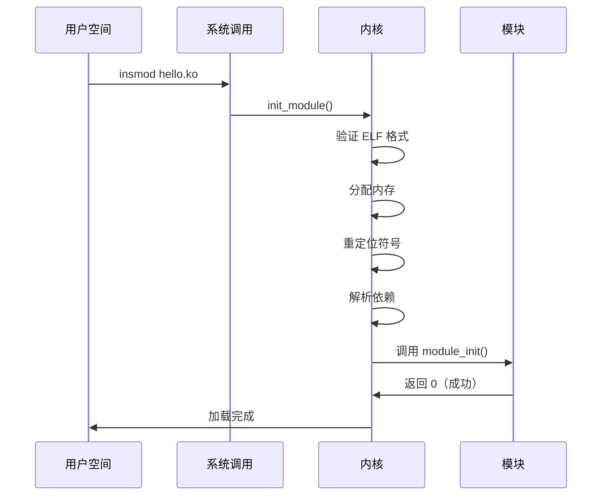

+++
title = "32.内核模块编程指南"
date = 2026-02-02
description = "Linux内核模块：模块加载、符号导出、参数传递、设备驱动编写"
[taxonomies]
tags = ["Linux", "内核", "模块", "驱动开发"]
+++

# Linux 内核模块编程指南

本文介绍 Linux 内核模块的开发方法，包括模块基础结构、加载机制、符号导出、参数传递、以及实际设备驱动开发。

---

## 一、内核模块基础

### 1.1 什么是内核模块

内核模块（Kernel Module）是可以动态加载到内核的代码，无需重新编译整个内核：

- **扩展功能**：添加设备驱动、文件系统等
- **热插拔**：运行时加载/卸载
- **减小内核体积**：按需加载

### 1.2 最简模块

```c
// hello.c
#include <linux/init.h>
#include <linux/module.h>
#include <linux/kernel.h>

static int __init hello_init(void)
{
    pr_info("Hello, Kernel!\n");
    return 0;
}

static void __exit hello_exit(void)
{
    pr_info("Goodbye, Kernel!\n");
}

module_init(hello_init);
module_exit(hello_exit);

MODULE_LICENSE("GPL");
MODULE_AUTHOR("Author");
MODULE_DESCRIPTION("A simple hello world module");
MODULE_VERSION("1.0");
```

### 1.3 Makefile

```makefile
# Makefile
obj-m += hello.o

KDIR ?= /lib/modules/$(shell uname -r)/build

all:
	make -C $(KDIR) M=$(PWD) modules

clean:
	make -C $(KDIR) M=$(PWD) clean

install:
	make -C $(KDIR) M=$(PWD) modules_install

# 多文件模块
# mymodule-objs := file1.o file2.o file3.o
# obj-m += mymodule.o
```

### 1.4 编译和加载

```bash
# 编译
make

# 查看模块信息
modinfo hello.ko

# 加载模块
sudo insmod hello.ko

# 查看日志
dmesg | tail

# 查看已加载模块
lsmod | grep hello

# 卸载模块
sudo rmmod hello

# 使用 modprobe（处理依赖）
sudo modprobe hello
sudo modprobe -r hello
```

---

## 二、模块加载机制

### 2.1 加载过程



### 2.2 模块状态

```bash
# 查看模块状态
cat /proc/modules

# 格式: name size refcount dependencies state address
# hello 16384 0 - Live 0xffffffffc0a00000
```

| 状态 | 含义 |
|------|------|
| Live | 正常运行 |
| Loading | 正在加载 |
| Unloading | 正在卸载 |

### 2.3 模块依赖

```c
// 依赖其他模块
MODULE_SOFTDEP("pre: dep_module");   // 软依赖
MODULE_SOFTDEP("post: cleanup_mod"); // 后置依赖

// 查看依赖
modprobe --show-depends hello
```

---

## 三、模块参数

### 3.1 定义参数

```c
#include <linux/moduleparam.h>

static int count = 1;
static char *name = "default";
static int arr[5];
static int arr_count;
static bool debug = false;

// 参数定义
module_param(count, int, 0644);
MODULE_PARM_DESC(count, "Number of iterations");

module_param(name, charp, 0644);
MODULE_PARM_DESC(name, "The name to display");

module_param_array(arr, int, &arr_count, 0644);
MODULE_PARM_DESC(arr, "An array of integers");

module_param(debug, bool, 0644);
MODULE_PARM_DESC(debug, "Enable debug mode");

static int __init param_init(void)
{
    int i;
    
    pr_info("count = %d\n", count);
    pr_info("name = %s\n", name);
    pr_info("debug = %s\n", debug ? "true" : "false");
    
    for (i = 0; i < arr_count; i++)
        pr_info("arr[%d] = %d\n", i, arr[i]);
    
    return 0;
}
```

### 3.2 使用参数

```bash
# 加载时传参
sudo insmod hello.ko count=5 name="test" debug=1 arr=1,2,3

# 运行时修改（如果权限允许）
echo 10 > /sys/module/hello/parameters/count

# 查看参数
cat /sys/module/hello/parameters/count
```

### 3.3 参数权限

| 权限 | 含义 |
|------|------|
| 0 | 不在 sysfs 显示 |
| S_IRUGO (0444) | 只读 |
| S_IWUSR (0200) | root 可写 |
| 0644 | 常用：root 可写，其他只读 |

---

## 四、符号导出

### 4.1 导出符号

```c
// export_module.c
#include <linux/module.h>

int shared_data = 42;
EXPORT_SYMBOL(shared_data);

int shared_function(int x)
{
    return x * 2;
}
EXPORT_SYMBOL(shared_function);

// 仅导出给 GPL 模块
int gpl_only_func(void)
{
    return 0;
}
EXPORT_SYMBOL_GPL(gpl_only_func);

MODULE_LICENSE("GPL");
```

### 4.2 使用导出符号

```c
// use_module.c
#include <linux/module.h>

extern int shared_data;
extern int shared_function(int x);

static int __init use_init(void)
{
    pr_info("shared_data = %d\n", shared_data);
    pr_info("shared_function(5) = %d\n", shared_function(5));
    return 0;
}

module_init(use_init);
MODULE_LICENSE("GPL");
```

### 4.3 符号版本控制

```bash
# 查看模块符号
nm hello.ko

# 查看内核符号表
cat /proc/kallsyms | grep shared

# 符号版本检查
modprobe --dump-modversions hello.ko
```

---

## 五、字符设备驱动

### 5.1 字符设备框架

```c
#include <linux/module.h>
#include <linux/fs.h>
#include <linux/cdev.h>
#include <linux/device.h>
#include <linux/uaccess.h>

#define DEVICE_NAME "mychardev"
#define CLASS_NAME "myclass"
#define BUF_SIZE 1024

static dev_t dev_num;
static struct cdev my_cdev;
static struct class *my_class;
static struct device *my_device;

static char device_buffer[BUF_SIZE];
static int buffer_pointer = 0;

static int dev_open(struct inode *inode, struct file *filp)
{
    pr_info("Device opened\n");
    return 0;
}

static int dev_release(struct inode *inode, struct file *filp)
{
    pr_info("Device closed\n");
    return 0;
}

static ssize_t dev_read(struct file *filp, char __user *buf,
                        size_t count, loff_t *f_pos)
{
    int bytes_to_read = min((int)count, buffer_pointer - (int)*f_pos);
    
    if (bytes_to_read <= 0)
        return 0;
    
    if (copy_to_user(buf, device_buffer + *f_pos, bytes_to_read))
        return -EFAULT;
    
    *f_pos += bytes_to_read;
    pr_info("Read %d bytes\n", bytes_to_read);
    
    return bytes_to_read;
}

static ssize_t dev_write(struct file *filp, const char __user *buf,
                         size_t count, loff_t *f_pos)
{
    int bytes_to_write = min((int)count, BUF_SIZE - buffer_pointer);
    
    if (bytes_to_write <= 0)
        return -ENOMEM;
    
    if (copy_from_user(device_buffer + buffer_pointer, buf, bytes_to_write))
        return -EFAULT;
    
    buffer_pointer += bytes_to_write;
    pr_info("Wrote %d bytes\n", bytes_to_write);
    
    return bytes_to_write;
}

static long dev_ioctl(struct file *filp, unsigned int cmd, unsigned long arg)
{
    switch (cmd) {
    case 0:  // Clear buffer
        memset(device_buffer, 0, BUF_SIZE);
        buffer_pointer = 0;
        break;
    default:
        return -EINVAL;
    }
    return 0;
}

static const struct file_operations fops = {
    .owner = THIS_MODULE,
    .open = dev_open,
    .release = dev_release,
    .read = dev_read,
    .write = dev_write,
    .unlocked_ioctl = dev_ioctl,
};

static int __init chardev_init(void)
{
    int ret;
    
    /* 分配设备号 */
    ret = alloc_chrdev_region(&dev_num, 0, 1, DEVICE_NAME);
    if (ret < 0) {
        pr_err("Failed to allocate device number\n");
        return ret;
    }
    pr_info("Device number: major=%d, minor=%d\n", MAJOR(dev_num), MINOR(dev_num));
    
    /* 初始化 cdev */
    cdev_init(&my_cdev, &fops);
    my_cdev.owner = THIS_MODULE;
    
    ret = cdev_add(&my_cdev, dev_num, 1);
    if (ret < 0) {
        unregister_chrdev_region(dev_num, 1);
        return ret;
    }
    
    /* 创建设备类 */
    my_class = class_create(THIS_MODULE, CLASS_NAME);
    if (IS_ERR(my_class)) {
        cdev_del(&my_cdev);
        unregister_chrdev_region(dev_num, 1);
        return PTR_ERR(my_class);
    }
    
    /* 创建设备节点 */
    my_device = device_create(my_class, NULL, dev_num, NULL, DEVICE_NAME);
    if (IS_ERR(my_device)) {
        class_destroy(my_class);
        cdev_del(&my_cdev);
        unregister_chrdev_region(dev_num, 1);
        return PTR_ERR(my_device);
    }
    
    pr_info("Character device created: /dev/%s\n", DEVICE_NAME);
    return 0;
}

static void __exit chardev_exit(void)
{
    device_destroy(my_class, dev_num);
    class_destroy(my_class);
    cdev_del(&my_cdev);
    unregister_chrdev_region(dev_num, 1);
    pr_info("Character device removed\n");
}

module_init(chardev_init);
module_exit(chardev_exit);
MODULE_LICENSE("GPL");
```

### 5.2 测试设备

```bash
# 编译加载
make && sudo insmod chardev.ko

# 检查设备
ls -la /dev/mychardev

# 写入数据
echo "Hello" > /dev/mychardev

# 读取数据
cat /dev/mychardev
```

---

## 六、内核内存管理

### 6.1 内存分配函数

```c
#include <linux/slab.h>
#include <linux/vmalloc.h>

/* kmalloc - 物理连续内存 */
void *ptr = kmalloc(size, GFP_KERNEL);
kfree(ptr);

/* kzalloc - 分配并清零 */
void *ptr = kzalloc(size, GFP_KERNEL);

/* vmalloc - 虚拟连续内存（可能物理不连续） */
void *ptr = vmalloc(size);
vfree(ptr);

/* 页分配 */
struct page *page = alloc_page(GFP_KERNEL);
void *addr = page_address(page);
__free_page(page);

/* DMA 内存 */
dma_addr_t dma_handle;
void *ptr = dma_alloc_coherent(dev, size, &dma_handle, GFP_KERNEL);
dma_free_coherent(dev, size, ptr, dma_handle);
```

### 6.2 GFP 标志

| 标志 | 使用场景 |
|------|----------|
| GFP_KERNEL | 普通内核上下文 |
| GFP_ATOMIC | 中断上下文，不可睡眠 |
| GFP_USER | 用户空间分配 |
| GFP_DMA | DMA 可用内存 |

---

## 七、同步与并发

### 7.1 自旋锁

```c
#include <linux/spinlock.h>

static DEFINE_SPINLOCK(my_lock);

void critical_section(void)
{
    unsigned long flags;
    
    spin_lock_irqsave(&my_lock, flags);
    /* 临界区 */
    spin_unlock_irqrestore(&my_lock, flags);
}
```

### 7.2 互斥锁

```c
#include <linux/mutex.h>

static DEFINE_MUTEX(my_mutex);

void critical_section(void)
{
    mutex_lock(&my_mutex);
    /* 临界区 - 可以睡眠 */
    mutex_unlock(&my_mutex);
}
```

### 7.3 等待队列

```c
#include <linux/wait.h>

static DECLARE_WAIT_QUEUE_HEAD(my_wq);
static int condition = 0;

/* 等待 */
wait_event_interruptible(my_wq, condition != 0);

/* 唤醒 */
condition = 1;
wake_up_interruptible(&my_wq);
```

---

## 八、调试技术

### 8.1 打印调试

```c
/* 日志级别 */
pr_emerg("Emergency\n");     // 0
pr_alert("Alert\n");         // 1
pr_crit("Critical\n");       // 2
pr_err("Error\n");           // 3
pr_warn("Warning\n");        // 4
pr_notice("Notice\n");       // 5
pr_info("Info\n");           // 6
pr_debug("Debug\n");         // 7

/* 条件编译调试 */
#ifdef DEBUG
    pr_debug("Debug: x = %d\n", x);
#endif

/* dev_* 系列（带设备信息） */
dev_info(dev, "Device initialized\n");
dev_err(dev, "Failed to initialize\n");
```

### 8.2 动态调试

```bash
# 启用动态调试
echo 'module mymodule +p' > /sys/kernel/debug/dynamic_debug/control

# 查看调试状态
cat /sys/kernel/debug/dynamic_debug/control | grep mymodule
```

### 8.3 procfs 调试

```c
#include <linux/proc_fs.h>
#include <linux/seq_file.h>

static int my_proc_show(struct seq_file *m, void *v)
{
    seq_printf(m, "Counter: %d\n", counter);
    seq_printf(m, "Status: %s\n", status);
    return 0;
}

static int my_proc_open(struct inode *inode, struct file *file)
{
    return single_open(file, my_proc_show, NULL);
}

static const struct proc_ops my_proc_ops = {
    .proc_open = my_proc_open,
    .proc_read = seq_read,
    .proc_lseek = seq_lseek,
    .proc_release = single_release,
};

static int __init init_proc(void)
{
    proc_create("mymodule_info", 0444, NULL, &my_proc_ops);
    return 0;
}
```

---

## 九、常见问题

### 9.1 模块加载失败

```bash
# 检查内核版本匹配
uname -r
modinfo hello.ko | grep vermagic

# 强制加载（危险）
insmod -f hello.ko

# 检查符号依赖
modprobe --show-depends hello
```

### 9.2 内存泄漏检测

```bash
# 使用 kmemleak
echo scan > /sys/kernel/debug/kmemleak
cat /sys/kernel/debug/kmemleak
```

---

## 相关文章

- [上一篇：Linux容器基础详解](/articles/linux/linux-31-Linux容器基础详解/)
- [下一篇：内核内存分配器详解](/articles/linux/linux-33-内核内存分配器详解/)
- [Linux设备驱动模型详解](/articles/linux/linux-30-Linux设备驱动模型详解/)
