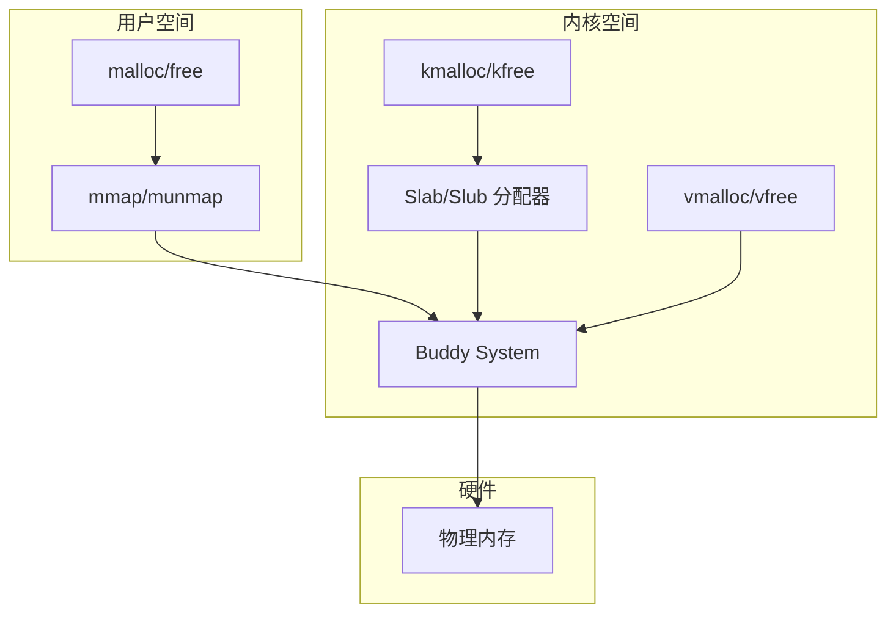
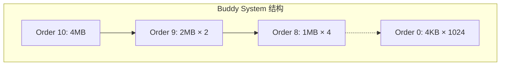
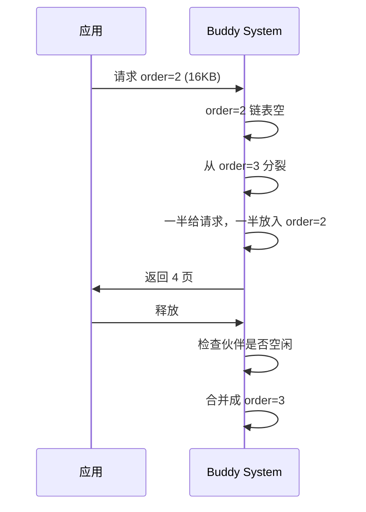
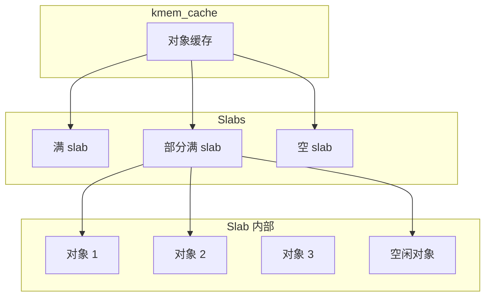
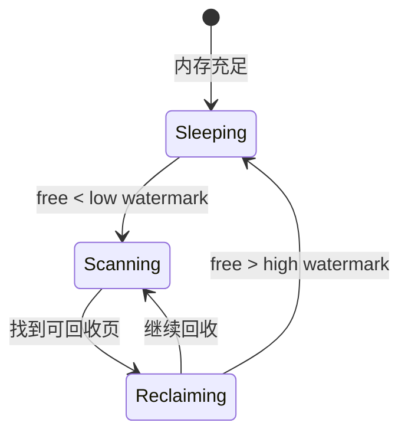

+++
title = "33. 内核内存分配器详解"
date = 2026-02-02
weight = 33000
description = "Linux内核内存分配：Buddy System、Slab/Slub、kmalloc、页回收、OOM"
[taxonomies]
tags = ["Linux", "内核", "内存", "Buddy", "Slab"]
+++

# Linux 内核内存分配器详解

本文深入分析 Linux 内核的内存分配机制，包括 Buddy System 页分配器、Slab/Slub 对象分配器、内存回收策略和 OOM Killer。

---

## 一、内存分配层次

### 1.1 分配器层次结构



### 1.2 分配器对比

| 分配器 | 分配单位 | 物理连续 | 适用场景 |
|--------|----------|----------|----------|
| Buddy | 页（4KB 倍数） | 是 | 大块内存、DMA |
| Slab/Slub | 对象（任意大小） | 是 | 内核对象缓存 |
| vmalloc | 页 | 否 | 大块非连续内存 |

---

## 二、Buddy System 页分配器

### 2.1 基本原理

Buddy System 将物理内存划分为 2^n 页的块：

```
Order 0: 4KB (1 page)
Order 1: 8KB (2 pages)
Order 2: 16KB (4 pages)
...
Order 10: 4MB (1024 pages)  # MAX_ORDER - 1
```



### 2.2 分配过程

```c
/* 分配 2^order 个连续页 */
struct page *alloc_pages(gfp_t gfp, unsigned int order)
{
    // 1. 从 order 对应的空闲链表查找
    // 2. 如果没有，从更高 order 分裂
    // 3. 返回第一个 page 的指针
}

/* 分配算法伪代码 */
struct page *buddy_alloc(int order) {
    for (int current = order; current < MAX_ORDER; current++) {
        if (!list_empty(&free_area[current])) {
            struct page *page = list_first_entry(&free_area[current]);
            list_del(&page->lru);
            
            // 分裂多余的块
            while (current > order) {
                current--;
                struct page *buddy = page + (1 << current);
                list_add(&buddy->lru, &free_area[current]);
            }
            
            return page;
        }
    }
    return NULL;  // 内存不足
}
```

### 2.3 释放与合并

```c
void __free_pages(struct page *page, unsigned int order)
{
    // 尝试与伙伴合并
    while (order < MAX_ORDER - 1) {
        struct page *buddy = find_buddy(page, order);
        
        if (!buddy_is_free(buddy, order))
            break;
        
        // 合并
        list_del(&buddy->lru);
        page = min(page, buddy);
        order++;
    }
    
    list_add(&page->lru, &free_area[order]);
}

struct page *find_buddy(struct page *page, int order) {
    unsigned long pfn = page_to_pfn(page);
    unsigned long buddy_pfn = pfn ^ (1 << order);
    return pfn_to_page(buddy_pfn);
}
```



### 2.4 查看 Buddy 状态

```bash
# 查看各 order 的空闲页数
cat /proc/buddyinfo
# Node 0, zone   Normal   1234  567  234  123   56   23   12    5    2    1    0

# 查看内存碎片化
cat /proc/pagetypeinfo
```

---

## 三、Slab/Slub 分配器

### 3.1 为什么需要 Slab

Buddy System 最小分配 4KB，但内核常需要小对象（几十到几百字节）：
- 浪费内存（内部碎片）
- 频繁的小分配/释放效率低

**Slab 分配器**：
- 预分配对象缓存
- 对象重用
- 减少碎片
- 构造/析构函数支持

### 3.2 Slab 结构



### 3.3 创建和使用缓存

```c
#include <linux/slab.h>

struct my_object {
    int id;
    char name[64];
    struct list_head list;
};

static struct kmem_cache *my_cache;

static int __init my_init(void)
{
    /* 创建缓存 */
    my_cache = kmem_cache_create(
        "my_object_cache",           // 名称
        sizeof(struct my_object),    // 对象大小
        0,                           // 对齐
        SLAB_HWCACHE_ALIGN,          // 标志
        NULL                         // 构造函数
    );
    
    if (!my_cache)
        return -ENOMEM;
    
    /* 分配对象 */
    struct my_object *obj = kmem_cache_alloc(my_cache, GFP_KERNEL);
    if (!obj)
        return -ENOMEM;
    
    obj->id = 1;
    strcpy(obj->name, "test");
    
    /* 释放对象 */
    kmem_cache_free(my_cache, obj);
    
    return 0;
}

static void __exit my_exit(void)
{
    /* 销毁缓存 */
    kmem_cache_destroy(my_cache);
}
```

### 3.4 kmalloc 实现

`kmalloc` 使用预定义的通用缓存：

```c
/* 通用 slab 缓存大小 */
// kmalloc-8, kmalloc-16, kmalloc-32, ..., kmalloc-8192

void *kmalloc(size_t size, gfp_t flags)
{
    // 找到合适大小的缓存
    struct kmem_cache *s = kmalloc_slab(size, flags);
    
    if (!s)
        return NULL;
    
    return kmem_cache_alloc(s, flags);
}

void kfree(const void *x)
{
    struct kmem_cache *s = virt_to_cache(x);
    kmem_cache_free(s, (void *)x);
}
```

### 3.5 Slub 分配器

**Slub** 是 Slab 的简化替代（Linux 2.6.23+）：

| 特性 | Slab | Slub |
|------|------|------|
| 复杂度 | 高 | 低 |
| 内存开销 | 较大 | 较小 |
| 调试 | 困难 | 容易 |
| NUMA | 支持 | 更好支持 |
| 默认 | 已弃用 | 当前默认 |

```bash
# 查看 slab 信息
cat /proc/slabinfo

# 使用 slabtop
slabtop

# 查看内核使用的分配器
cat /sys/kernel/slab/kmalloc-64/object_size
```

---

## 四、内存区域（Zone）

### 4.1 Zone 类型

```c
enum zone_type {
    ZONE_DMA,       // 0-16MB，用于旧 ISA DMA
    ZONE_DMA32,     // 0-4GB，用于 32 位 DMA
    ZONE_NORMAL,    // 正常可映射内存
    ZONE_HIGHMEM,   // 高端内存（32位专用）
    ZONE_MOVABLE,   // 可迁移页面
    __MAX_NR_ZONES
};
```

### 4.2 GFP 标志与 Zone

```c
/* 常用 GFP 标志 */
GFP_KERNEL    // 普通内核分配，可睡眠
GFP_ATOMIC    // 原子上下文，不可睡眠
GFP_USER      // 用户空间分配
GFP_DMA       // 从 ZONE_DMA 分配
GFP_DMA32     // 从 ZONE_DMA32 分配
GFP_HIGHUSER  // 用户空间，优先高端内存

/* 标志组合 */
GFP_KERNEL = __GFP_RECLAIM | __GFP_IO | __GFP_FS
GFP_ATOMIC = __GFP_HIGH | __GFP_ATOMIC | __GFP_KSWAPD_RECLAIM
```

---

## 五、页面回收（Page Reclaim）

### 5.1 kswapd 守护进程



### 5.2 水位线（Watermarks）

```c
struct zone {
    unsigned long watermark[NR_WMARK];
    // WMARK_MIN: 最低水位，触发直接回收
    // WMARK_LOW: 低水位，唤醒 kswapd
    // WMARK_HIGH: 高水位，停止回收
};
```

```bash
# 查看水位线
cat /proc/zoneinfo | grep -A 5 "Node 0"
# pages free     12345
# min      1234
# low      1543
# high     1852
```

### 5.3 LRU 链表

```c
/* 页面在 Active/Inactive 链表间移动 */
enum lru_list {
    LRU_INACTIVE_ANON,  // 匿名页（不活跃）
    LRU_ACTIVE_ANON,    // 匿名页（活跃）
    LRU_INACTIVE_FILE,  // 文件页（不活跃）
    LRU_ACTIVE_FILE,    // 文件页（活跃）
    LRU_UNEVICTABLE,    // 不可回收
    NR_LRU_LISTS
};

/* 页面访问标记 */
void mark_page_accessed(struct page *page)
{
    if (!PageReferenced(page)) {
        SetPageReferenced(page);
    } else if (!PageActive(page)) {
        activate_page(page);
        ClearPageReferenced(page);
    }
}
```

### 5.4 回收策略

```c
/* 回收优先级 */
// 1. 清理 page cache（文件缓存）
// 2. 回收 inactive 匿名页（需要 swap）
// 3. 回收 active 页（降级到 inactive）

unsigned long shrink_inactive_list(unsigned long nr_to_scan,
                                   struct lruvec *lruvec,
                                   struct scan_control *sc,
                                   enum lru_list lru)
{
    LIST_HEAD(page_list);
    
    // 从 LRU 尾部取页面
    isolate_lru_pages(nr_to_scan, lruvec, &page_list, lru);
    
    // 尝试回收
    nr_reclaimed = shrink_page_list(&page_list, ...);
    
    // 未回收的放回 LRU
    putback_inactive_pages(lruvec, &page_list);
    
    return nr_reclaimed;
}
```

---

## 六、OOM Killer

### 6.1 触发条件

当系统内存严重不足，且无法通过以下方式获得内存时触发：
1. 页面回收失败
2. 交换空间已满
3. 直接内存回收失败

### 6.2 选择牺牲进程

```c
/* OOM 评分 */
// oom_score = 进程内存使用 × 调整因子

// 查看进程 OOM 评分
cat /proc/<pid>/oom_score      // 当前评分
cat /proc/<pid>/oom_score_adj  // 调整值 (-1000 ~ 1000)

/* 内核选择逻辑 */
unsigned long oom_badness(struct task_struct *p, ...)
{
    // 基础分：进程使用的内存页数
    points = get_mm_rss(p->mm) + get_mm_counter(p->mm, MM_SWAPENTS);
    
    // 应用调整因子
    adj = p->signal->oom_score_adj;
    if (adj == OOM_SCORE_ADJ_MIN)
        return 0;  // -1000 表示永不杀死
    
    points = points * (1000 + adj) / 1000;
    return points;
}
```

### 6.3 保护进程

```bash
# 保护关键进程（如数据库）
echo -1000 > /proc/<pid>/oom_score_adj

# 设置为 OOM 优先目标
echo 1000 > /proc/<pid>/oom_score_adj

# 禁用 OOM Killer（危险）
echo 0 > /proc/sys/vm/overcommit_memory
```

### 6.4 OOM 日志分析

```bash
# 查看 OOM 日志
dmesg | grep -i "out of memory"
dmesg | grep -i "killed process"

# 典型 OOM 日志
# Out of memory: Kill process 12345 (mysqld) score 900 or sacrifice child
# Killed process 12345 (mysqld) total-vm:1234567kB, anon-rss:890123kB
```

---

## 七、内存调试

### 7.1 kmemleak

```bash
# 启用（内核配置）
CONFIG_DEBUG_KMEMLEAK=y

# 扫描泄漏
echo scan > /sys/kernel/debug/kmemleak

# 查看结果
cat /sys/kernel/debug/kmemleak
```

### 7.2 KASAN

```c
// Kernel Address Sanitizer
// 检测 use-after-free, out-of-bounds 等

// 内核配置
CONFIG_KASAN=y

// 示例输出
// BUG: KASAN: use-after-free in test_func+0x20/0x50
// Read of size 4 at addr ffff888012345678 by task test/1234
```

### 7.3 slub_debug

```bash
# 启动参数
slub_debug=FZPU

# F: 检查 double free
# Z: Red zone 检测
# P: Poisoning
# U: User tracking
```

---

## 八、常见面试问题

**Q: Buddy System 的内部碎片和外部碎片？**

| 碎片类型 | 描述 | Buddy 情况 |
|----------|------|-----------|
| 内部碎片 | 分配块内未使用部分 | 存在（2^n 向上取整） |
| 外部碎片 | 空闲块分散无法合并 | 通过合并减少 |

**Q: kmalloc 和 vmalloc 的区别？**

| 特性 | kmalloc | vmalloc |
|------|---------|---------|
| 物理连续 | 是 | 否 |
| 大小限制 | 较小（MAX_ORDER） | 较大 |
| 速度 | 快 | 慢（需要修改页表） |
| 用途 | DMA、小对象 | 大块非连续内存 |

**Q: 如何避免 OOM？**

1. 设置合理的 overcommit 策略
2. 添加足够的 swap
3. 保护关键进程（oom_score_adj）
4. 监控内存使用
5. 设置 cgroup 内存限制

---

## 相关文章

- [上一篇：内核模块编程指南](@/articles/linux/linux-32-内核模块编程指南.md)
- [内核内存管理详解](@/articles/linux/linux-16-内核内存管理详解.md)
- [OS笔试题-内存管理](@/articles/os/os-10-OS笔试题-内存管理.md)
