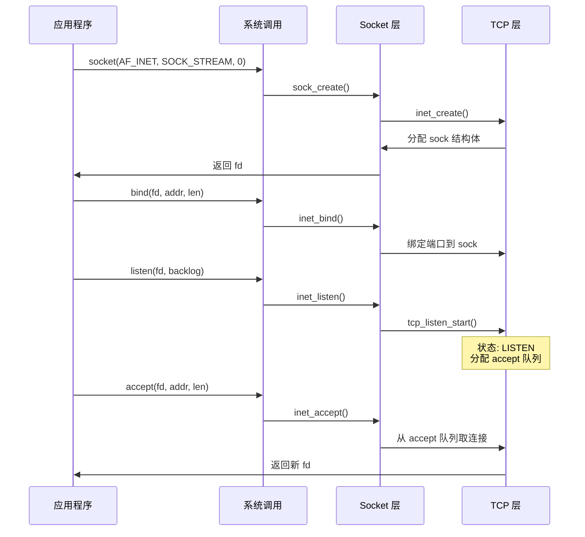
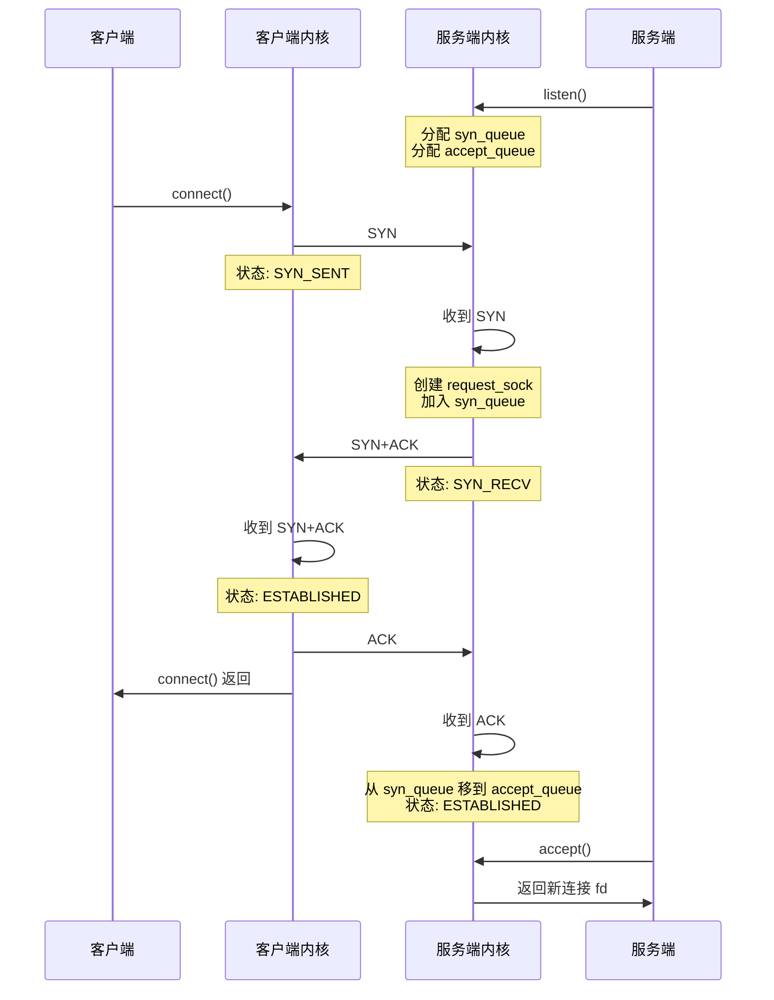
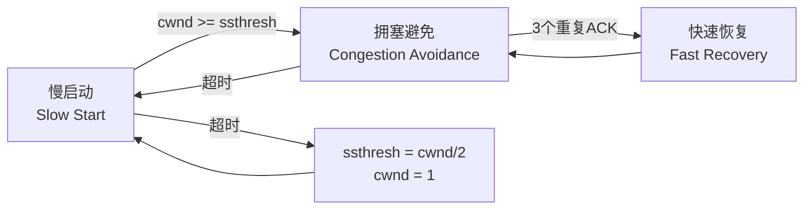
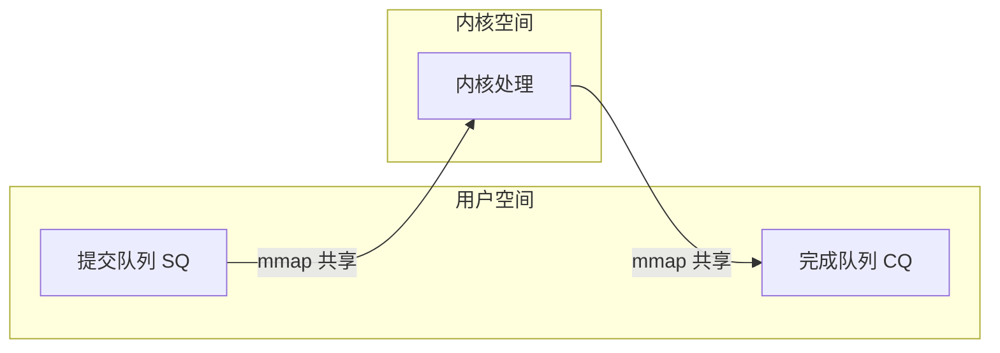
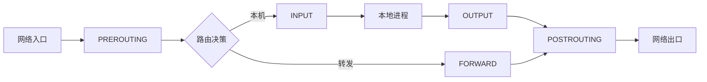

+++
title = "34.内核网络笔试面试题"
date = 2026-02-02
description = "Linux内核网络：socket、TCP/IP栈、epoll、零拷贝、网络性能优化"
[taxonomies]
tags = ["Linux", "内核", "网络", "TCP", "epoll"]
+++

# Linux 内核网络笔试面试题

本文汇总 Linux 内核网络相关的笔试和面试题，涵盖 socket 编程、TCP/IP 协议栈、I/O 多路复用、零拷贝、网络性能优化等内容。

---

## 一、Socket 基础

### 题目 1：socket 系统调用流程

**Q: 描述 `socket()` → `bind()` → `listen()` → `accept()` 的内核实现流程。**

A:



**关键数据结构**：

```c
struct socket {
    socket_state state;        // SS_UNCONNECTED, SS_CONNECTED, ...
    struct sock *sk;           // 底层协议结构
    const struct proto_ops *ops; // 协议操作
};

struct sock {
    struct sock_common __sk_common;
    struct sk_buff_head sk_receive_queue;  // 接收队列
    struct sk_buff_head sk_write_queue;    // 发送队列
    // ... 更多字段
};
```

---

### 题目 2：TIME_WAIT 状态

**Q: 为什么需要 TIME_WAIT 状态？持续多长时间？如何减少 TIME_WAIT？**

A:

**作用**：
1. **确保最后的 ACK 到达**：如果丢失，对端会重发 FIN
2. **避免旧连接数据干扰**：等待 2MSL 确保旧报文消失

**持续时间**：2MSL（Maximum Segment Lifetime），Linux 默认 60 秒。

**减少方法**：

```bash
# 1. 启用 TIME_WAIT 重用
echo 1 > /proc/sys/net/ipv4/tcp_tw_reuse

# 2. 快速回收（不推荐，已废弃）
# echo 1 > /proc/sys/net/ipv4/tcp_tw_recycle

# 3. 减少 FIN_TIMEOUT
echo 30 > /proc/sys/net/ipv4/tcp_fin_timeout

# 4. 增加本地端口范围
echo "1024 65535" > /proc/sys/net/ipv4/ip_local_port_range
```

```c
/* 服务端设置 SO_REUSEADDR */
int reuse = 1;
setsockopt(fd, SOL_SOCKET, SO_REUSEADDR, &reuse, sizeof(reuse));
```

---

### 题目 3：TCP 三次握手在内核中的实现

**Q: 描述 TCP 三次握手时内核的处理过程。**

A:



**半连接队列和全连接队列**：

```c
/* 半连接队列大小 */
// /proc/sys/net/ipv4/tcp_max_syn_backlog

/* 全连接队列大小 */
// min(backlog, /proc/sys/net/core/somaxconn)

/* 查看队列溢出 */
// netstat -s | grep -i listen
// ss -ltn
```

---

## 二、I/O 多路复用

### 题目 4：select/poll/epoll 对比

**Q: 比较 select、poll、epoll 的实现机制和性能差异。**

A:

| 特性 | select | poll | epoll |
|------|--------|------|-------|
| 数据结构 | fd_set (bitmap) | pollfd 数组 | 红黑树 + 就绪链表 |
| 最大连接数 | 1024 (FD_SETSIZE) | 无限制 | 无限制 |
| 拷贝开销 | 每次调用拷贝 | 每次调用拷贝 | 注册时拷贝一次 |
| 遍历方式 | 线性扫描 O(n) | 线性扫描 O(n) | 事件驱动 O(1) |
| 触发模式 | 水平触发 | 水平触发 | LT/ET 可选 |
| 内核实现 | 轮询 | 轮询 | 回调 |

**epoll 内核实现**：

```c
/* epoll 核心结构 */
struct eventpoll {
    struct rb_root rbr;           /* 红黑树根节点 */
    struct list_head rdllist;     /* 就绪链表 */
    wait_queue_head_t wq;         /* 等待队列 */
    // ...
};

struct epitem {
    struct rb_node rbn;           /* 红黑树节点 */
    struct list_head rdllink;     /* 就绪链表节点 */
    struct epoll_event event;     /* 用户关注的事件 */
    struct eventpoll *ep;         /* 所属 eventpoll */
    // ...
};
```

---

### 题目 5：epoll ET 和 LT 模式

**Q: 解释 epoll 的边缘触发（ET）和水平触发（LT）模式的区别，以及使用注意事项。**

A:

| 模式 | 触发条件 | 读取要求 |
|------|----------|----------|
| **LT（水平触发）** | 只要有数据可读就触发 | 可以分多次读 |
| **ET（边缘触发）** | 状态变化时触发一次 | 必须一次读完 |

**ET 模式使用**：

```c
/* ET 模式必须使用非阻塞 I/O */
int flags = fcntl(fd, F_GETFL, 0);
fcntl(fd, F_SETFL, flags | O_NONBLOCK);

/* 设置 ET 模式 */
struct epoll_event ev;
ev.events = EPOLLIN | EPOLLET;  // 边缘触发
ev.data.fd = fd;
epoll_ctl(epfd, EPOLL_CTL_ADD, fd, &ev);

/* ET 模式读取 - 必须循环读到 EAGAIN */
while (1) {
    ssize_t n = read(fd, buf, sizeof(buf));
    if (n == -1) {
        if (errno == EAGAIN || errno == EWOULDBLOCK) {
            break;  // 数据读完
        }
        perror("read");
        break;
    }
    if (n == 0) {
        // 连接关闭
        break;
    }
    process(buf, n);
}
```

**EPOLLONESHOT**：

```c
/* 确保一个 fd 只被一个线程处理 */
ev.events = EPOLLIN | EPOLLET | EPOLLONESHOT;

/* 处理完后需要重新注册 */
epoll_ctl(epfd, EPOLL_CTL_MOD, fd, &ev);
```

---

### 题目 6：epoll 惊群问题

**Q: 什么是 epoll 惊群？如何解决？**

A:

**惊群现象**：多个进程/线程 epoll_wait 同一 epfd，新连接到来时全部被唤醒，但只有一个能 accept 成功。

**解决方案**：

```c
/* 方案 1：EPOLLEXCLUSIVE（Linux 4.5+） */
ev.events = EPOLLIN | EPOLLEXCLUSIVE;
epoll_ctl(epfd, EPOLL_CTL_ADD, listen_fd, &ev);

/* 方案 2：SO_REUSEPORT（Linux 3.9+） */
int reuse = 1;
setsockopt(listen_fd, SOL_SOCKET, SO_REUSEPORT, &reuse, sizeof(reuse));
// 每个线程有独立的 listen socket，内核负载均衡

/* 方案 3：单线程 accept + 分发 */
// 主线程 accept，然后分发给工作线程
```

---

## 三、TCP 协议栈

### 题目 7：TCP 拥塞控制

**Q: 描述 TCP 拥塞控制的四个阶段和 Linux 中常用的拥塞控制算法。**

A:



**主要算法**：

| 算法 | 特点 | 适用场景 |
|------|------|----------|
| Reno | 经典算法，AIMD | 一般网络 |
| CUBIC | Linux 默认，三次函数增长 | 高带宽高延迟 |
| BBR | 基于带宽和 RTT | 长肥管道 |

```bash
# 查看当前算法
cat /proc/sys/net/ipv4/tcp_congestion_control

# 查看可用算法
cat /proc/sys/net/ipv4/tcp_available_congestion_control

# 设置算法
echo bbr > /proc/sys/net/ipv4/tcp_congestion_control
```

---

### 题目 8：TCP 粘包问题

**Q: 什么是 TCP 粘包？如何解决？**

A:

**原因**：TCP 是字节流协议，没有消息边界。

**解决方案**：

```c
/* 方案 1：固定长度 */
#define MSG_LEN 100
char buf[MSG_LEN];
read_exact(fd, buf, MSG_LEN);

/* 方案 2：长度前缀 */
struct Message {
    uint32_t length;
    char data[];
};

uint32_t len;
read_exact(fd, &len, 4);
len = ntohl(len);
char *data = malloc(len);
read_exact(fd, data, len);

/* 方案 3：分隔符 */
// 读到 '\n' 为一条消息

/* 读取指定字节数 */
ssize_t read_exact(int fd, void *buf, size_t count) {
    size_t total = 0;
    while (total < count) {
        ssize_t n = read(fd, (char*)buf + total, count - total);
        if (n <= 0) return n;
        total += n;
    }
    return total;
}
```

---

## 四、零拷贝技术

### 题目 9：零拷贝实现

**Q: 比较 Linux 中的零拷贝技术：mmap、sendfile、splice。**

A:

**传统读写**（4 次拷贝）：

```
磁盘 → 内核缓冲区 → 用户缓冲区 → Socket 缓冲区 → 网卡
```

**sendfile**（2-3 次拷贝）：

```c
#include <sys/sendfile.h>

ssize_t sendfile(int out_fd, int in_fd, off_t *offset, size_t count);

/* 使用示例 */
int file_fd = open("file.txt", O_RDONLY);
struct stat st;
fstat(file_fd, &st);

sendfile(socket_fd, file_fd, NULL, st.st_size);
```

```
磁盘 → 内核缓冲区 → (DMA gather) → 网卡
```

**splice**：

```c
#include <fcntl.h>

ssize_t splice(int fd_in, off_t *off_in, int fd_out, off_t *off_out,
               size_t len, unsigned int flags);

/* 使用示例：文件到 socket */
int pipefd[2];
pipe(pipefd);

splice(file_fd, NULL, pipefd[1], NULL, len, SPLICE_F_MOVE);
splice(pipefd[0], NULL, socket_fd, NULL, len, SPLICE_F_MOVE);
```

**比较**：

| 技术 | 拷贝次数 | 适用场景 |
|------|----------|----------|
| read+write | 4 | 需要处理数据 |
| mmap+write | 3 | 需要多次访问 |
| sendfile | 2-3 | 文件→socket |
| splice | 2 | 管道数据传输 |

---

### 题目 10：io_uring

**Q: 介绍 io_uring 的原理和优势。**

A:



**核心概念**：
- **SQ（Submission Queue）**：提交 I/O 请求
- **CQ（Completion Queue）**：获取完成结果
- **共享内存**：避免系统调用拷贝

```c
#include <liburing.h>

struct io_uring ring;
io_uring_queue_init(256, &ring, 0);

/* 提交读请求 */
struct io_uring_sqe *sqe = io_uring_get_sqe(&ring);
io_uring_prep_read(sqe, fd, buf, len, 0);
io_uring_sqe_set_data(sqe, user_data);
io_uring_submit(&ring);

/* 获取完成事件 */
struct io_uring_cqe *cqe;
io_uring_wait_cqe(&ring, &cqe);
int result = cqe->res;
void *data = io_uring_cqe_get_data(cqe);
io_uring_cqe_seen(&ring, cqe);

io_uring_queue_exit(&ring);
```

**优势**：
1. 真正的异步 I/O
2. 批量提交/完成
3. 减少系统调用
4. 支持多种操作（read, write, accept, connect...）

---

## 五、网络性能优化

### 题目 11：TCP 参数调优

**Q: 列举重要的 TCP 内核参数及其调优建议。**

A:

```bash
# 连接相关
net.core.somaxconn = 65535          # accept 队列大小
net.ipv4.tcp_max_syn_backlog = 65535 # SYN 队列大小

# 缓冲区
net.core.rmem_max = 16777216        # 接收缓冲区最大值
net.core.wmem_max = 16777216        # 发送缓冲区最大值
net.ipv4.tcp_rmem = 4096 87380 16777216  # TCP 接收缓冲区
net.ipv4.tcp_wmem = 4096 65536 16777216  # TCP 发送缓冲区

# TIME_WAIT
net.ipv4.tcp_tw_reuse = 1           # 重用 TIME_WAIT
net.ipv4.tcp_fin_timeout = 30       # FIN 超时

# Keepalive
net.ipv4.tcp_keepalive_time = 600   # 开始探测前的空闲时间
net.ipv4.tcp_keepalive_intvl = 60   # 探测间隔
net.ipv4.tcp_keepalive_probes = 3   # 探测次数

# 拥塞控制
net.ipv4.tcp_congestion_control = bbr
net.core.default_qdisc = fq
```

---

### 题目 12：中断亲和性和 RPS/RFS

**Q: 解释网卡中断亲和性和 RPS/RFS 的作用。**

A:

**中断亲和性**：将网卡中断绑定到特定 CPU。

```bash
# 查看网卡中断
cat /proc/interrupts | grep eth0

# 设置中断亲和性（绑定到 CPU 0）
echo 1 > /proc/irq/32/smp_affinity

# 多队列网卡自动分配
service irqbalance start
```

**RPS（Receive Packet Steering）**：软件实现的接收端负载均衡。

```bash
# 启用 RPS
echo f > /sys/class/net/eth0/queues/rx-0/rps_cpus
```

**RFS（Receive Flow Steering）**：将报文导向处理该连接的 CPU。

```bash
# 启用 RFS
echo 32768 > /proc/sys/net/core/rps_sock_flow_entries
echo 4096 > /sys/class/net/eth0/queues/rx-0/rps_flow_cnt
```

---

## 六、Netfilter 和 XDP

### 题目 13：Netfilter 框架

**Q: 描述 Netfilter 的 hook 点和数据包流向。**

A:



**hook 点**：

| Hook | 位置 | 用途 |
|------|------|------|
| PREROUTING | 路由前 | DNAT |
| INPUT | 到本机 | 入站过滤 |
| FORWARD | 转发 | 转发过滤 |
| OUTPUT | 从本机 | 出站过滤 |
| POSTROUTING | 路由后 | SNAT |

---

### 题目 14：XDP 简介

**Q: 什么是 XDP？相比 iptables 有什么优势？**

A:

**XDP（eXpress Data Path）**：在网卡驱动层处理数据包的 eBPF 程序。

```c
/* XDP 程序示例 */
SEC("xdp")
int xdp_filter(struct xdp_md *ctx)
{
    void *data = (void *)(long)ctx->data;
    void *data_end = (void *)(long)ctx->data_end;
    
    struct ethhdr *eth = data;
    if ((void *)(eth + 1) > data_end)
        return XDP_DROP;
    
    if (eth->h_proto == htons(ETH_P_IP)) {
        struct iphdr *ip = (void *)(eth + 1);
        if ((void *)(ip + 1) > data_end)
            return XDP_DROP;
        
        // 丢弃特定 IP
        if (ip->saddr == htonl(0x0a000001))  // 10.0.0.1
            return XDP_DROP;
    }
    
    return XDP_PASS;
}
```

**XDP 动作**：

| 动作 | 含义 |
|------|------|
| XDP_DROP | 丢弃包 |
| XDP_PASS | 传递给内核协议栈 |
| XDP_TX | 从同一网卡发回 |
| XDP_REDIRECT | 重定向到其他接口 |
| XDP_ABORTED | 错误，丢弃 |

**优势**：
1. 极低延迟（不经过内核协议栈）
2. 高性能（可达 10M+ pps）
3. 灵活性（eBPF 可编程）

---

## 七、常见面试问题

**Q: TCP 和 UDP 的区别？**

| 特性 | TCP | UDP |
|------|-----|-----|
| 连接 | 面向连接 | 无连接 |
| 可靠性 | 可靠 | 不可靠 |
| 顺序 | 保证顺序 | 不保证 |
| 流量控制 | 有 | 无 |
| 拥塞控制 | 有 | 无 |
| 头部开销 | 20+ 字节 | 8 字节 |

**Q: 为什么 TCP 挥手需要四次？**

A: 因为 TCP 是全双工的：
1. 客户端发 FIN：客户端不再发送
2. 服务端发 ACK：确认收到
3. 服务端发 FIN：服务端不再发送（可能还有数据要发）
4. 客户端发 ACK：确认收到

**Q: Nagle 算法和 TCP_NODELAY？**

A: Nagle 算法将小包合并发送，减少网络包数量。`TCP_NODELAY` 禁用 Nagle，适用于延迟敏感应用。

```c
int flag = 1;
setsockopt(fd, IPPROTO_TCP, TCP_NODELAY, &flag, sizeof(flag));
```

---

## 相关文章

- [Linux内核网络栈详解](/articles/linux/linux-09-Linux内核网络栈详解/)
- [HFT面试题-网络优化](/articles/hft/hft-34-HFT面试题-网络优化/)
- [HFT笔试题-网络编程](/articles/hft/hft-35-HFT笔试题-网络编程/)
