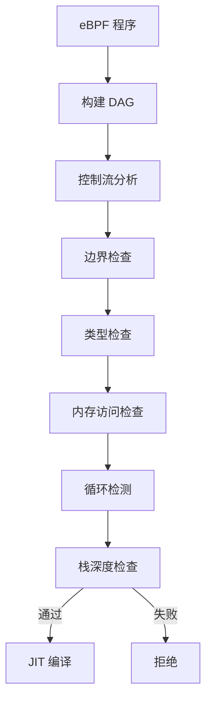
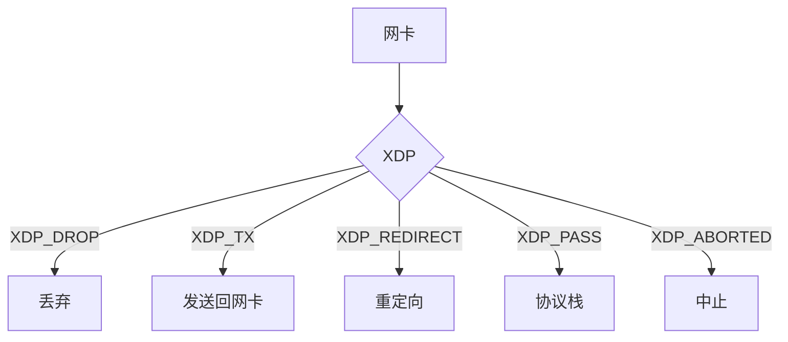

+++
title = "35. eBPF技术深度解析"
date = 2026-02-02
weight = 35000
description = "eBPF原理、程序类型、Map、验证器、CO-RE、应用场景"
[taxonomies]
tags = ["Linux", "eBPF", "内核", "性能", "网络"]
+++

# eBPF 技术深度解析

本文深入讲解 eBPF（Extended Berkeley Packet Filter）技术，包括其架构原理、程序类型、核心组件和实际应用。

---

## 一、eBPF 概述

### 1.1 什么是 eBPF

eBPF 是一种革命性的内核技术，允许在内核中安全地运行沙箱程序，无需修改内核源码或加载内核模块。

```mermaid
graph TD
    subgraph "用户空间"
        APP[应用程序]
        LOADER[eBPF Loader]
        LIBBPF[libbpf]
    end
    
    subgraph "内核空间"
        VERIFIER[验证器]
        JIT[JIT 编译器]
        PROG[eBPF 程序]
        MAP[eBPF Map]
        HOOK[Hook 点]
    end
    
    APP --> LOADER
    LOADER --> LIBBPF
    LIBBPF -->|bpf() syscall| VERIFIER
    VERIFIER -->|验证通过| JIT
    JIT --> PROG
    PROG <--> MAP
    PROG --> HOOK
    MAP -->|读取数据| APP
```

### 1.2 eBPF vs 传统方法

| 特性 | eBPF | 内核模块 | 用户态工具 |
|------|------|----------|------------|
| 安全性 | 验证器保证 | 可能崩溃内核 | 安全 |
| 性能 | 接近原生 | 原生 | 系统调用开销 |
| 部署 | 动态加载 | 需编译 | 简单 |
| 可见性 | 完整内核视图 | 完整 | 有限 |
| 灵活性 | 高 | 高 | 受限于接口 |

### 1.3 eBPF 发展历史

| 年份 | 里程碑 |
|------|--------|
| 1992 | 经典 BPF（包过滤） |
| 2014 | eBPF 进入 Linux 3.18 |
| 2016 | XDP（eXpress Data Path） |
| 2018 | BTF（BPF Type Format） |
| 2020 | CO-RE（Compile Once Run Everywhere） |
| 2022 | eBPF for Windows |

---

## 二、eBPF 架构

### 2.1 eBPF 虚拟机

eBPF 程序运行在内核中的虚拟机上，具有：

- **11 个 64 位寄存器**：R0-R10
- **512 字节栈空间**
- **指令集**：约 100 条指令

```c
// eBPF 寄存器约定
// R0: 返回值
// R1-R5: 函数参数
// R6-R9: 被调用者保存
// R10: 栈帧指针（只读）

// eBPF 指令格式
struct bpf_insn {
    __u8 code;        // 操作码
    __u8 dst_reg:4;   // 目标寄存器
    __u8 src_reg:4;   // 源寄存器
    __s16 off;        // 偏移量
    __s32 imm;        // 立即数
};
```

### 2.2 程序类型

```c
enum bpf_prog_type {
    BPF_PROG_TYPE_SOCKET_FILTER,    // 套接字过滤
    BPF_PROG_TYPE_KPROBE,           // 内核探针
    BPF_PROG_TYPE_TRACEPOINT,       // 跟踪点
    BPF_PROG_TYPE_XDP,              // XDP 网络处理
    BPF_PROG_TYPE_PERF_EVENT,       // 性能事件
    BPF_PROG_TYPE_CGROUP_SKB,       // cgroup 网络
    BPF_PROG_TYPE_CGROUP_SOCK,      // cgroup socket
    BPF_PROG_TYPE_LWT_IN,           // 轻量级隧道
    BPF_PROG_TYPE_SOCK_OPS,         // TCP 事件
    BPF_PROG_TYPE_SK_SKB,           // socket 重定向
    BPF_PROG_TYPE_CGROUP_DEVICE,    // 设备访问控制
    BPF_PROG_TYPE_SK_MSG,           // socket 消息
    BPF_PROG_TYPE_RAW_TRACEPOINT,   // 原始跟踪点
    BPF_PROG_TYPE_CGROUP_SOCKOPT,   // socket 选项
    BPF_PROG_TYPE_TRACING,          // 跟踪（fentry/fexit）
    BPF_PROG_TYPE_STRUCT_OPS,       // 结构体操作
    BPF_PROG_TYPE_EXT,              // 扩展
    BPF_PROG_TYPE_LSM,              // Linux 安全模块
    BPF_PROG_TYPE_SK_LOOKUP,        // socket 查找
    // ...
};
```

### 2.3 Hook 点


---

## 三、eBPF Map

### 3.1 Map 类型

```c
enum bpf_map_type {
    BPF_MAP_TYPE_HASH,              // 哈希表
    BPF_MAP_TYPE_ARRAY,             // 数组
    BPF_MAP_TYPE_PROG_ARRAY,        // 程序数组（尾调用）
    BPF_MAP_TYPE_PERF_EVENT_ARRAY,  // perf 事件数组
    BPF_MAP_TYPE_PERCPU_HASH,       // Per-CPU 哈希
    BPF_MAP_TYPE_PERCPU_ARRAY,      // Per-CPU 数组
    BPF_MAP_TYPE_STACK_TRACE,       // 栈跟踪
    BPF_MAP_TYPE_CGROUP_ARRAY,      // cgroup 数组
    BPF_MAP_TYPE_LRU_HASH,          // LRU 哈希
    BPF_MAP_TYPE_LRU_PERCPU_HASH,   // Per-CPU LRU 哈希
    BPF_MAP_TYPE_LPM_TRIE,          // 最长前缀匹配
    BPF_MAP_TYPE_ARRAY_OF_MAPS,     // Map 的数组
    BPF_MAP_TYPE_HASH_OF_MAPS,      // Map 的哈希
    BPF_MAP_TYPE_DEVMAP,            // 设备映射（XDP）
    BPF_MAP_TYPE_SOCKMAP,           // Socket 映射
    BPF_MAP_TYPE_CPUMAP,            // CPU 映射
    BPF_MAP_TYPE_XSKMAP,            // AF_XDP socket
    BPF_MAP_TYPE_RINGBUF,           // 环形缓冲区
    BPF_MAP_TYPE_INODE_STORAGE,     // inode 存储
    BPF_MAP_TYPE_TASK_STORAGE,      // 任务存储
    // ...
};
```

### 3.2 Map 操作

```c
// 定义 Map（BPF 程序中）
struct {
    __uint(type, BPF_MAP_TYPE_HASH);
    __uint(max_entries, 10240);
    __type(key, __u32);
    __type(value, __u64);
} my_map SEC(".maps");

// Map 操作函数
void *bpf_map_lookup_elem(struct bpf_map *map, const void *key);
long bpf_map_update_elem(struct bpf_map *map, const void *key, 
                         const void *value, __u64 flags);
long bpf_map_delete_elem(struct bpf_map *map, const void *key);

// 示例：计数器
SEC("kprobe/sys_execve")
int count_execve(struct pt_regs *ctx)
{
    __u32 key = 0;
    __u64 *count;
    
    count = bpf_map_lookup_elem(&my_map, &key);
    if (count) {
        __sync_fetch_and_add(count, 1);
    } else {
        __u64 init = 1;
        bpf_map_update_elem(&my_map, &key, &init, BPF_ANY);
    }
    
    return 0;
}
```

### 3.3 Ring Buffer

```c
// 定义 Ring Buffer
struct {
    __uint(type, BPF_MAP_TYPE_RINGBUF);
    __uint(max_entries, 256 * 1024);  // 256KB
} events SEC(".maps");

struct event {
    __u32 pid;
    __u32 tid;
    char comm[16];
    char filename[256];
};

SEC("tracepoint/syscalls/sys_enter_execve")
int trace_execve(struct trace_event_raw_sys_enter *ctx)
{
    struct event *e;
    
    // 预留空间
    e = bpf_ringbuf_reserve(&events, sizeof(*e), 0);
    if (!e)
        return 0;
    
    // 填充数据
    e->pid = bpf_get_current_pid_tgid() >> 32;
    e->tid = bpf_get_current_pid_tgid();
    bpf_get_current_comm(&e->comm, sizeof(e->comm));
    bpf_probe_read_user_str(&e->filename, sizeof(e->filename),
                            (void *)ctx->args[0]);
    
    // 提交
    bpf_ringbuf_submit(e, 0);
    
    return 0;
}

// 用户空间读取
int handle_event(void *ctx, void *data, size_t size)
{
    struct event *e = data;
    printf("pid=%d comm=%s file=%s\n", e->pid, e->comm, e->filename);
    return 0;
}

struct ring_buffer *rb = ring_buffer__new(bpf_map__fd(skel->maps.events),
                                          handle_event, NULL, NULL);
while (1) {
    ring_buffer__poll(rb, 100);  // 100ms 超时
}
```

---

## 四、eBPF 验证器

### 4.1 验证器工作原理

验证器确保 eBPF 程序的安全性：



### 4.2 验证器规则

```c
// 1. 有界循环（Linux 5.3+）
#pragma unroll
for (int i = 0; i < 10; i++) {
    // 必须有明确边界
}

// 2. 指针验证
void *ptr = bpf_map_lookup_elem(&map, &key);
if (ptr) {  // 必须检查 NULL
    // 使用 ptr
}

// 3. 内存边界
char buf[256];
int len = bpf_probe_read_str(buf, sizeof(buf), user_ptr);
if (len > 0 && len < sizeof(buf)) {
    // 安全访问
}

// 4. 寄存器状态跟踪
__u32 value = 0;
if (condition) {
    value = 1;
}
// 验证器知道 value 是 0 或 1

// 5. 辅助函数权限
// 某些辅助函数需要特定权限
bpf_override_return(ctx, -EPERM);  // 需要 CAP_SYS_ADMIN
```

### 4.3 常见验证错误

```c
// 错误 1: 无界循环
for (int i = 0; ; i++) { }  // 拒绝

// 错误 2: 未检查指针
void *ptr = bpf_map_lookup_elem(&map, &key);
*(__u64 *)ptr = 1;  // 拒绝，ptr 可能为 NULL

// 错误 3: 越界访问
char buf[16];
bpf_probe_read(buf, 32, src);  // 拒绝

// 错误 4: 栈溢出
char large_buf[1024];  // 拒绝，超过 512 字节

// 错误 5: 不可达代码
if (0) {
    // 验证器仍会检查
}
```

---

## 五、CO-RE（Compile Once Run Everywhere）

### 5.1 BTF（BPF Type Format）

```c
// BTF 提供类型信息，使程序可移植
// 编译时生成 BTF，运行时重定位

// vmlinux.h 包含所有内核类型
#include "vmlinux.h"
#include <bpf/bpf_helpers.h>
#include <bpf/bpf_tracing.h>
#include <bpf/bpf_core_read.h>

// 使用 CO-RE 读取结构体字段
SEC("kprobe/tcp_connect")
int BPF_KPROBE(tcp_connect, struct sock *sk)
{
    // CO-RE 方式：自动处理字段偏移变化
    __u16 dport = BPF_CORE_READ(sk, __sk_common.skc_dport);
    __u32 daddr = BPF_CORE_READ(sk, __sk_common.skc_daddr);
    
    // 传统方式（不可移植）
    // __u16 dport;
    // bpf_probe_read(&dport, sizeof(dport), &sk->__sk_common.skc_dport);
    
    return 0;
}
```

### 5.2 字段重定位

```c
// 处理字段存在性
SEC("kprobe/do_sys_open")
int BPF_KPROBE(do_sys_open)
{
    struct task_struct *task = (void *)bpf_get_current_task();
    
    // 检查字段是否存在
    if (bpf_core_field_exists(task->thread_pid)) {
        // 新内核
        struct pid *pid = BPF_CORE_READ(task, thread_pid);
    } else {
        // 旧内核
        // 使用其他方式获取
    }
    
    return 0;
}

// 处理枚举值变化
if (bpf_core_enum_value_exists(enum tcp_state, TCP_NEW_SYN_RECV)) {
    // 使用新枚举值
}
```

### 5.3 Skeleton 生成

```bash
# 生成 vmlinux.h
bpftool btf dump file /sys/kernel/btf/vmlinux format c > vmlinux.h

# 编译 BPF 程序
clang -g -O2 -target bpf -D__TARGET_ARCH_x86 \
    -c program.bpf.c -o program.bpf.o

# 生成 skeleton
bpftool gen skeleton program.bpf.o > program.skel.h
```

```c
// 使用 skeleton
#include "program.skel.h"

int main()
{
    struct program_bpf *skel;
    
    // 打开
    skel = program_bpf__open();
    if (!skel) {
        fprintf(stderr, "Failed to open\n");
        return 1;
    }
    
    // 配置（可选）
    skel->rodata->target_pid = getpid();
    
    // 加载
    if (program_bpf__load(skel)) {
        fprintf(stderr, "Failed to load\n");
        goto cleanup;
    }
    
    // 附加
    if (program_bpf__attach(skel)) {
        fprintf(stderr, "Failed to attach\n");
        goto cleanup;
    }
    
    // 主循环
    while (!exiting) {
        sleep(1);
    }
    
cleanup:
    program_bpf__destroy(skel);
    return 0;
}
```

---

## 六、XDP（eXpress Data Path）

### 6.1 XDP 概述

XDP 在网卡驱动层处理数据包，性能极高：



### 6.2 XDP 程序示例

```c
#include "vmlinux.h"
#include <bpf/bpf_helpers.h>
#include <bpf/bpf_endian.h>

// 简单防火墙：阻止特定 IP
struct {
    __uint(type, BPF_MAP_TYPE_HASH);
    __uint(max_entries, 10000);
    __type(key, __u32);    // IP 地址
    __type(value, __u8);   // 阻止标志
} blocked_ips SEC(".maps");

SEC("xdp")
int xdp_firewall(struct xdp_md *ctx)
{
    void *data_end = (void *)(long)ctx->data_end;
    void *data = (void *)(long)ctx->data;
    
    // 解析以太网头
    struct ethhdr *eth = data;
    if ((void *)(eth + 1) > data_end)
        return XDP_PASS;
    
    if (eth->h_proto != bpf_htons(ETH_P_IP))
        return XDP_PASS;
    
    // 解析 IP 头
    struct iphdr *ip = (void *)(eth + 1);
    if ((void *)(ip + 1) > data_end)
        return XDP_PASS;
    
    // 检查源 IP 是否被阻止
    __u32 src_ip = ip->saddr;
    __u8 *blocked = bpf_map_lookup_elem(&blocked_ips, &src_ip);
    if (blocked && *blocked)
        return XDP_DROP;
    
    return XDP_PASS;
}

char LICENSE[] SEC("license") = "GPL";
```

### 6.3 XDP 负载均衡

```c
// 简单的 L4 负载均衡器
struct backend {
    __u32 ip;
    __u16 port;
    __u16 weight;
};

struct {
    __uint(type, BPF_MAP_TYPE_ARRAY);
    __uint(max_entries, 16);
    __type(key, __u32);
    __type(value, struct backend);
} backends SEC(".maps");

struct {
    __uint(type, BPF_MAP_TYPE_PERCPU_ARRAY);
    __uint(max_entries, 1);
    __type(key, __u32);
    __type(value, __u32);
} counter SEC(".maps");

SEC("xdp")
int xdp_lb(struct xdp_md *ctx)
{
    void *data_end = (void *)(long)ctx->data_end;
    void *data = (void *)(long)ctx->data;
    
    struct ethhdr *eth = data;
    if ((void *)(eth + 1) > data_end)
        return XDP_PASS;
    
    if (eth->h_proto != bpf_htons(ETH_P_IP))
        return XDP_PASS;
    
    struct iphdr *ip = (void *)(eth + 1);
    if ((void *)(ip + 1) > data_end)
        return XDP_PASS;
    
    if (ip->protocol != IPPROTO_TCP)
        return XDP_PASS;
    
    struct tcphdr *tcp = (void *)ip + (ip->ihl * 4);
    if ((void *)(tcp + 1) > data_end)
        return XDP_PASS;
    
    // 只处理目标端口 80
    if (tcp->dest != bpf_htons(80))
        return XDP_PASS;
    
    // 轮询选择后端
    __u32 key = 0;
    __u32 *cnt = bpf_map_lookup_elem(&counter, &key);
    if (!cnt)
        return XDP_PASS;
    
    __u32 backend_idx = (*cnt) % 4;
    (*cnt)++;
    
    struct backend *be = bpf_map_lookup_elem(&backends, &backend_idx);
    if (!be)
        return XDP_PASS;
    
    // 修改目标 IP
    __u32 old_daddr = ip->daddr;
    ip->daddr = be->ip;
    
    // 更新校验和
    ip->check = csum_diff(&old_daddr, 4, &ip->daddr, 4, ip->check);
    
    return XDP_PASS;
}
```

---

## 七、跟踪与性能分析

### 7.1 kprobe/kretprobe

```c
// 跟踪系统调用延迟
struct {
    __uint(type, BPF_MAP_TYPE_HASH);
    __uint(max_entries, 10240);
    __type(key, __u32);    // tid
    __type(value, __u64);  // 开始时间
} start_time SEC(".maps");

struct {
    __uint(type, BPF_MAP_TYPE_RINGBUF);
    __uint(max_entries, 256 * 1024);
} events SEC(".maps");

struct event {
    __u32 pid;
    __u32 tid;
    __u64 latency_ns;
    char comm[16];
};

SEC("kprobe/vfs_read")
int BPF_KPROBE(vfs_read_entry)
{
    __u32 tid = bpf_get_current_pid_tgid();
    __u64 ts = bpf_ktime_get_ns();
    
    bpf_map_update_elem(&start_time, &tid, &ts, BPF_ANY);
    return 0;
}

SEC("kretprobe/vfs_read")
int BPF_KRETPROBE(vfs_read_exit, ssize_t ret)
{
    __u32 tid = bpf_get_current_pid_tgid();
    __u64 *ts = bpf_map_lookup_elem(&start_time, &tid);
    if (!ts)
        return 0;
    
    __u64 latency = bpf_ktime_get_ns() - *ts;
    bpf_map_delete_elem(&start_time, &tid);
    
    // 只记录超过 1ms 的调用
    if (latency < 1000000)
        return 0;
    
    struct event *e = bpf_ringbuf_reserve(&events, sizeof(*e), 0);
    if (!e)
        return 0;
    
    e->pid = bpf_get_current_pid_tgid() >> 32;
    e->tid = tid;
    e->latency_ns = latency;
    bpf_get_current_comm(&e->comm, sizeof(e->comm));
    
    bpf_ringbuf_submit(e, 0);
    return 0;
}
```

### 7.2 fentry/fexit（更高效）

```c
// fentry/fexit 比 kprobe 更高效（无 pt_regs 拷贝）
SEC("fentry/tcp_connect")
int BPF_PROG(tcp_connect_entry, struct sock *sk)
{
    // 直接访问参数
    __u16 dport = BPF_CORE_READ(sk, __sk_common.skc_dport);
    
    bpf_printk("tcp_connect: dport=%d\n", bpf_ntohs(dport));
    return 0;
}

SEC("fexit/tcp_connect")
int BPF_PROG(tcp_connect_exit, struct sock *sk, int ret)
{
    // 可以访问返回值
    if (ret < 0) {
        bpf_printk("tcp_connect failed: %d\n", ret);
    }
    return 0;
}
```

### 7.3 性能分析直方图

```c
// 延迟直方图
#define MAX_SLOTS 32

struct {
    __uint(type, BPF_MAP_TYPE_ARRAY);
    __uint(max_entries, MAX_SLOTS);
    __type(key, __u32);
    __type(value, __u64);
} histogram SEC(".maps");

static __always_inline __u32 log2(__u64 value)
{
    __u32 result = 0;
    
    #pragma unroll
    for (int i = 0; i < 64; i++) {
        if (value <= (1ULL << i))
            return i;
    }
    
    return 63;
}

static __always_inline void record_latency(__u64 latency_ns)
{
    __u32 slot = log2(latency_ns / 1000);  // 转换为微秒
    if (slot >= MAX_SLOTS)
        slot = MAX_SLOTS - 1;
    
    __u64 *count = bpf_map_lookup_elem(&histogram, &slot);
    if (count)
        __sync_fetch_and_add(count, 1);
}

// 用户空间打印直方图
void print_histogram(int map_fd)
{
    printf("     usecs       : count\n");
    
    for (int i = 0; i < MAX_SLOTS; i++) {
        __u64 count;
        if (bpf_map_lookup_elem(map_fd, &i, &count) == 0 && count > 0) {
            printf("%10llu -> %-10llu : %llu\n",
                   1ULL << i, 1ULL << (i + 1), count);
        }
    }
}
```

---

## 八、安全应用

### 8.1 LSM（Linux Security Module）

```c
// 阻止执行特定路径的程序
SEC("lsm/bprm_check_security")
int BPF_PROG(restrict_exec, struct linux_binprm *bprm)
{
    char filename[256];
    
    bpf_probe_read_kernel_str(filename, sizeof(filename),
                              bprm->filename);
    
    // 阻止执行 /tmp 下的程序
    if (filename[0] == '/' && filename[1] == 't' &&
        filename[2] == 'm' && filename[3] == 'p' &&
        filename[4] == '/') {
        return -EPERM;
    }
    
    return 0;
}

// 限制网络连接
SEC("lsm/socket_connect")
int BPF_PROG(restrict_connect, struct socket *sock,
             struct sockaddr *address, int addrlen)
{
    if (address->sa_family != AF_INET)
        return 0;
    
    struct sockaddr_in *addr = (struct sockaddr_in *)address;
    __u32 ip = addr->sin_addr.s_addr;
    
    // 检查是否允许连接
    __u8 *allowed = bpf_map_lookup_elem(&allowed_ips, &ip);
    if (!allowed)
        return -EPERM;
    
    return 0;
}
```

### 8.2 Seccomp BPF

```c
// 系统调用过滤
#include <linux/seccomp.h>
#include <linux/filter.h>

// 使用经典 BPF 语法
struct sock_filter filter[] = {
    // 加载系统调用号
    BPF_STMT(BPF_LD | BPF_W | BPF_ABS,
             offsetof(struct seccomp_data, nr)),
    
    // 允许 read
    BPF_JUMP(BPF_JMP | BPF_JEQ | BPF_K, __NR_read, 0, 1),
    BPF_STMT(BPF_RET | BPF_K, SECCOMP_RET_ALLOW),
    
    // 允许 write
    BPF_JUMP(BPF_JMP | BPF_JEQ | BPF_K, __NR_write, 0, 1),
    BPF_STMT(BPF_RET | BPF_K, SECCOMP_RET_ALLOW),
    
    // 允许 exit
    BPF_JUMP(BPF_JMP | BPF_JEQ | BPF_K, __NR_exit, 0, 1),
    BPF_STMT(BPF_RET | BPF_K, SECCOMP_RET_ALLOW),
    
    // 其他系统调用杀死进程
    BPF_STMT(BPF_RET | BPF_K, SECCOMP_RET_KILL),
};

struct sock_fprog prog = {
    .len = sizeof(filter) / sizeof(filter[0]),
    .filter = filter,
};

prctl(PR_SET_NO_NEW_PRIVS, 1);
prctl(PR_SET_SECCOMP, SECCOMP_MODE_FILTER, &prog);
```

---

## 九、工具生态

### 9.1 BCC 工具

```bash
# 常用 BCC 工具
execsnoop          # 跟踪新进程
opensnoop          # 跟踪文件打开
biolatency         # 块 I/O 延迟直方图
tcpconnect         # 跟踪 TCP 连接
tcplife            # TCP 连接生命周期
runqlat            # 调度器运行队列延迟
profile            # CPU 采样分析
offcputime         # Off-CPU 时间分析
funclatency        # 函数延迟
trace              # 自定义跟踪
```

### 9.2 bpftrace

```bash
# 统计系统调用
bpftrace -e 'tracepoint:syscalls:sys_enter_* { @[probe] = count(); }'

# 跟踪进程执行
bpftrace -e 'tracepoint:syscalls:sys_enter_execve { 
    printf("%s -> %s\n", comm, str(args->filename)); 
}'

# 延迟直方图
bpftrace -e 'kprobe:vfs_read { @start[tid] = nsecs; }
             kretprobe:vfs_read /@start[tid]/ { 
                 @latency = hist(nsecs - @start[tid]); 
                 delete(@start[tid]); 
             }'

# 跟踪 TCP 重传
bpftrace -e 'kprobe:tcp_retransmit_skb { 
    @retrans[comm, pid] = count(); 
}'
```

---

## 十、面试常见问题

**Q: eBPF 验证器如何保证安全性？**

A:
1. **控制流分析**：确保无无限循环
2. **边界检查**：所有内存访问必须在有效范围内
3. **类型检查**：跟踪寄存器类型
4. **指针检查**：NULL 检查、范围检查
5. **指令限制**：程序大小限制（100万条指令）

**Q: XDP 和 TC 的区别？**

| 特性 | XDP | TC |
|------|-----|-----|
| 位置 | 驱动层（最早） | 协议栈后 |
| 性能 | 最高 | 较高 |
| 功能 | 有限（无 sk_buff） | 完整 |
| 修改包 | 受限 | 完整支持 |

**Q: CO-RE 解决什么问题？**

A: CO-RE 解决 eBPF 程序的可移植性问题。通过 BTF 类型信息和运行时重定位，同一个编译好的程序可以在不同内核版本上运行，无需重新编译。

---

## 相关文章

- [Linux内核网络栈详解](@/articles/linux/linux-09-Linux内核网络栈详解.md)
- [内核调试工具详解](@/articles/linux/linux-13-内核调试工具详解.md)
- [性能分析与调试](@/articles/linux/linux-08-性能分析与调试.md)
