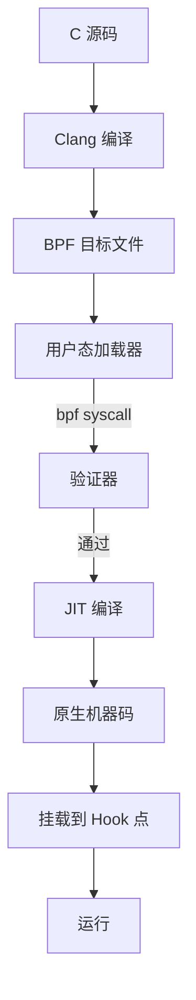

+++
title = "eBPF笔试面试题"
date = 2026-02-02
weight = 36000
description = "eBPF笔试面试题：程序编写、Map操作、XDP、性能分析"
[taxonomies]
tags = ["Linux", "eBPF", "笔试", "面试", "XDP"]
+++

# eBPF 笔试面试题

本文汇总 eBPF 相关的笔试和面试题目，涵盖基础概念、程序编写、性能分析和实际应用。

---

## 一、基础概念题

### 1.1 eBPF 架构

**Q: 解释 eBPF 的执行流程，从程序加载到运行？**



**答案要点**：
1. **编译**：使用 Clang 将 C 代码编译为 BPF 字节码
2. **加载**：用户态程序通过 `bpf()` 系统调用加载程序
3. **验证**：验证器检查程序安全性（边界、循环、内存访问）
4. **JIT 编译**：字节码编译为原生机器码
5. **挂载**：附加到指定的 Hook 点（kprobe、tracepoint、XDP 等）
6. **执行**：事件触发时执行 eBPF 程序

---

### 1.2 验证器

**Q: eBPF 验证器检查哪些内容？如何绕过验证器限制？**

**答案**：

| 检查项 | 说明 | 绕过方法 |
|--------|------|----------|
| 循环边界 | 禁止无界循环 | 使用 `#pragma unroll` 或有界循环 |
| 指针验证 | 必须检查 NULL | 添加 `if (ptr)` 检查 |
| 内存边界 | 访问范围检查 | 使用 `bpf_probe_read` 系列函数 |
| 栈大小 | 最大 512 字节 | 使用 Map 存储大数据 |
| 指令数量 | 限制程序大小 | 拆分为多个程序，使用尾调用 |

```c
// 错误示例
void *ptr = bpf_map_lookup_elem(&map, &key);
*ptr = 1;  // 验证器拒绝

// 正确示例
void *ptr = bpf_map_lookup_elem(&map, &key);
if (ptr) {
    *(__u64 *)ptr = 1;  // OK
}
```

---

### 1.3 Map 类型选择

**Q: 不同场景应该选择什么类型的 Map？**

| 场景 | 推荐 Map 类型 | 原因 |
|------|---------------|------|
| 计数器（单值） | `BPF_MAP_TYPE_ARRAY` | O(1) 访问，无锁 |
| 计数器（多核） | `BPF_MAP_TYPE_PERCPU_ARRAY` | 避免缓存行竞争 |
| 连接跟踪 | `BPF_MAP_TYPE_LRU_HASH` | 自动淘汰旧条目 |
| IP 黑名单 | `BPF_MAP_TYPE_HASH` | 快速查找 |
| 路由表 | `BPF_MAP_TYPE_LPM_TRIE` | 最长前缀匹配 |
| 事件传递 | `BPF_MAP_TYPE_RINGBUF` | 高效用户态通信 |
| 尾调用 | `BPF_MAP_TYPE_PROG_ARRAY` | 程序链式调用 |
| XDP 重定向 | `BPF_MAP_TYPE_DEVMAP` | 设备映射 |

---

## 二、编程题

### 2.1 进程执行跟踪

**题目**：编写 eBPF 程序跟踪所有进程执行，记录 PID、进程名、执行文件路径。

```c
#include "vmlinux.h"
#include <bpf/bpf_helpers.h>
#include <bpf/bpf_tracing.h>
#include <bpf/bpf_core_read.h>

struct event {
    __u32 pid;
    __u32 ppid;
    __u32 uid;
    char comm[16];
    char filename[256];
};

struct {
    __uint(type, BPF_MAP_TYPE_RINGBUF);
    __uint(max_entries, 256 * 1024);
} events SEC(".maps");

SEC("tracepoint/syscalls/sys_enter_execve")
int trace_execve(struct trace_event_raw_sys_enter *ctx)
{
    struct event *e;
    struct task_struct *task;
    
    e = bpf_ringbuf_reserve(&events, sizeof(*e), 0);
    if (!e)
        return 0;
    
    // 获取当前任务信息
    task = (struct task_struct *)bpf_get_current_task();
    
    e->pid = bpf_get_current_pid_tgid() >> 32;
    e->uid = bpf_get_current_uid_gid();
    e->ppid = BPF_CORE_READ(task, real_parent, tgid);
    
    bpf_get_current_comm(&e->comm, sizeof(e->comm));
    
    // 读取执行文件路径（第一个参数）
    const char *filename = (const char *)ctx->args[0];
    bpf_probe_read_user_str(&e->filename, sizeof(e->filename), filename);
    
    bpf_ringbuf_submit(e, 0);
    return 0;
}

char LICENSE[] SEC("license") = "GPL";
```

---

### 2.2 TCP 连接延迟统计

**题目**：统计 TCP 连接建立延迟，输出直方图。

```c
#include "vmlinux.h"
#include <bpf/bpf_helpers.h>
#include <bpf/bpf_tracing.h>
#include <bpf/bpf_core_read.h>

#define MAX_SLOTS 32

struct {
    __uint(type, BPF_MAP_TYPE_HASH);
    __uint(max_entries, 10240);
    __type(key, struct sock *);
    __type(value, __u64);
} start_times SEC(".maps");

struct {
    __uint(type, BPF_MAP_TYPE_ARRAY);
    __uint(max_entries, MAX_SLOTS);
    __type(key, __u32);
    __type(value, __u64);
} histogram SEC(".maps");

static __always_inline __u32 log2l(__u64 v)
{
    __u32 r = 0;
    
    #pragma unroll
    for (int i = 0; i < 64; i++) {
        if (v <= (1ULL << i))
            return i;
    }
    return 63;
}

// TCP 连接开始（SYN 发送）
SEC("fentry/tcp_connect")
int BPF_PROG(tcp_connect, struct sock *sk)
{
    __u64 ts = bpf_ktime_get_ns();
    bpf_map_update_elem(&start_times, &sk, &ts, BPF_ANY);
    return 0;
}

// TCP 连接完成（进入 ESTABLISHED）
SEC("fentry/tcp_finish_connect")
int BPF_PROG(tcp_finish_connect, struct sock *sk, struct sk_buff *skb)
{
    __u64 *start_ts = bpf_map_lookup_elem(&start_times, &sk);
    if (!start_ts)
        return 0;
    
    __u64 latency = bpf_ktime_get_ns() - *start_ts;
    bpf_map_delete_elem(&start_times, &sk);
    
    // 转换为微秒并记录到直方图
    __u32 slot = log2l(latency / 1000);
    if (slot >= MAX_SLOTS)
        slot = MAX_SLOTS - 1;
    
    __u64 *count = bpf_map_lookup_elem(&histogram, &slot);
    if (count)
        __sync_fetch_and_add(count, 1);
    
    return 0;
}

char LICENSE[] SEC("license") = "GPL";
```

---

### 2.3 XDP 包过滤器

**题目**：实现 XDP 程序，按 IP 和端口过滤流量。

```c
#include "vmlinux.h"
#include <bpf/bpf_helpers.h>
#include <bpf/bpf_endian.h>

struct filter_rule {
    __u32 src_ip;       // 0 表示任意
    __u32 dst_ip;       // 0 表示任意
    __u16 src_port;     // 0 表示任意
    __u16 dst_port;     // 0 表示任意
    __u8 protocol;      // 0 表示任意
    __u8 action;        // 0=DROP, 1=PASS
};

struct {
    __uint(type, BPF_MAP_TYPE_ARRAY);
    __uint(max_entries, 256);
    __type(key, __u32);
    __type(value, struct filter_rule);
} rules SEC(".maps");

struct {
    __uint(type, BPF_MAP_TYPE_ARRAY);
    __uint(max_entries, 1);
    __type(key, __u32);
    __type(value, __u32);
} rule_count SEC(".maps");

struct {
    __uint(type, BPF_MAP_TYPE_PERCPU_ARRAY);
    __uint(max_entries, 2);
    __type(key, __u32);
    __type(value, __u64);
} stats SEC(".maps");  // 0=passed, 1=dropped

static __always_inline int match_rule(struct filter_rule *rule,
                                       __u32 src_ip, __u32 dst_ip,
                                       __u16 src_port, __u16 dst_port,
                                       __u8 protocol)
{
    if (rule->src_ip && rule->src_ip != src_ip)
        return 0;
    if (rule->dst_ip && rule->dst_ip != dst_ip)
        return 0;
    if (rule->src_port && rule->src_port != src_port)
        return 0;
    if (rule->dst_port && rule->dst_port != dst_port)
        return 0;
    if (rule->protocol && rule->protocol != protocol)
        return 0;
    
    return 1;
}

SEC("xdp")
int xdp_filter(struct xdp_md *ctx)
{
    void *data_end = (void *)(long)ctx->data_end;
    void *data = (void *)(long)ctx->data;
    
    // 解析以太网头
    struct ethhdr *eth = data;
    if ((void *)(eth + 1) > data_end)
        return XDP_PASS;
    
    if (eth->h_proto != bpf_htons(ETH_P_IP))
        return XDP_PASS;
    
    // 解析 IP 头
    struct iphdr *ip = (void *)(eth + 1);
    if ((void *)(ip + 1) > data_end)
        return XDP_PASS;
    
    __u32 src_ip = ip->saddr;
    __u32 dst_ip = ip->daddr;
    __u8 protocol = ip->protocol;
    __u16 src_port = 0, dst_port = 0;
    
    // 解析 TCP/UDP 端口
    if (protocol == IPPROTO_TCP) {
        struct tcphdr *tcp = (void *)ip + (ip->ihl * 4);
        if ((void *)(tcp + 1) > data_end)
            return XDP_PASS;
        src_port = bpf_ntohs(tcp->source);
        dst_port = bpf_ntohs(tcp->dest);
    } else if (protocol == IPPROTO_UDP) {
        struct udphdr *udp = (void *)ip + (ip->ihl * 4);
        if ((void *)(udp + 1) > data_end)
            return XDP_PASS;
        src_port = bpf_ntohs(udp->source);
        dst_port = bpf_ntohs(udp->dest);
    }
    
    // 获取规则数量
    __u32 key = 0;
    __u32 *count = bpf_map_lookup_elem(&rule_count, &key);
    if (!count)
        return XDP_PASS;
    
    // 遍历规则
    #pragma unroll
    for (__u32 i = 0; i < 64 && i < *count; i++) {
        struct filter_rule *rule = bpf_map_lookup_elem(&rules, &i);
        if (!rule)
            break;
        
        if (match_rule(rule, src_ip, dst_ip, src_port, dst_port, protocol)) {
            __u32 stat_key = rule->action ? 0 : 1;
            __u64 *stat = bpf_map_lookup_elem(&stats, &stat_key);
            if (stat)
                (*stat)++;
            
            return rule->action ? XDP_PASS : XDP_DROP;
        }
    }
    
    // 默认通过
    __u32 stat_key = 0;
    __u64 *stat = bpf_map_lookup_elem(&stats, &stat_key);
    if (stat)
        (*stat)++;
    
    return XDP_PASS;
}

char LICENSE[] SEC("license") = "GPL";
```

---

### 2.4 文件访问审计

**题目**：跟踪特定目录下的文件访问，记录访问者和操作类型。

```c
#include "vmlinux.h"
#include <bpf/bpf_helpers.h>
#include <bpf/bpf_tracing.h>
#include <bpf/bpf_core_read.h>

#define MAX_PATH_LEN 256
#define AUDIT_PATH "/etc"

struct event {
    __u32 pid;
    __u32 uid;
    __u8 op;        // 0=open, 1=read, 2=write
    char comm[16];
    char path[MAX_PATH_LEN];
};

struct {
    __uint(type, BPF_MAP_TYPE_RINGBUF);
    __uint(max_entries, 256 * 1024);
} events SEC(".maps");

static __always_inline int str_starts_with(const char *str, const char *prefix)
{
    #pragma unroll
    for (int i = 0; i < sizeof(AUDIT_PATH); i++) {
        if (prefix[i] == '\0')
            return 1;
        if (str[i] != prefix[i])
            return 0;
    }
    return 1;
}

SEC("tracepoint/syscalls/sys_enter_openat")
int trace_openat(struct trace_event_raw_sys_enter *ctx)
{
    const char *pathname = (const char *)ctx->args[1];
    char path[MAX_PATH_LEN];
    
    int ret = bpf_probe_read_user_str(path, sizeof(path), pathname);
    if (ret < 0)
        return 0;
    
    // 检查是否是审计目录
    if (!str_starts_with(path, AUDIT_PATH))
        return 0;
    
    struct event *e = bpf_ringbuf_reserve(&events, sizeof(*e), 0);
    if (!e)
        return 0;
    
    e->pid = bpf_get_current_pid_tgid() >> 32;
    e->uid = bpf_get_current_uid_gid();
    e->op = 0;  // open
    bpf_get_current_comm(&e->comm, sizeof(e->comm));
    __builtin_memcpy(e->path, path, sizeof(path));
    
    bpf_ringbuf_submit(e, 0);
    return 0;
}

char LICENSE[] SEC("license") = "GPL";
```

---

## 三、性能分析题

### 3.1 CPU 热点分析

**题目**：实现 CPU 采样分析，生成火焰图数据。

```c
#include "vmlinux.h"
#include <bpf/bpf_helpers.h>
#include <bpf/bpf_tracing.h>

#define MAX_STACK_DEPTH 32

struct key_t {
    __u32 pid;
    __s64 kernel_stack_id;
    __s64 user_stack_id;
};

struct {
    __uint(type, BPF_MAP_TYPE_HASH);
    __uint(max_entries, 10240);
    __type(key, struct key_t);
    __type(value, __u64);
} counts SEC(".maps");

struct {
    __uint(type, BPF_MAP_TYPE_STACK_TRACE);
    __uint(key_size, sizeof(__u32));
    __uint(value_size, MAX_STACK_DEPTH * sizeof(__u64));
    __uint(max_entries, 10240);
} stacks SEC(".maps");

SEC("perf_event")
int profile(struct bpf_perf_event_data *ctx)
{
    struct key_t key = {};
    
    key.pid = bpf_get_current_pid_tgid() >> 32;
    key.kernel_stack_id = bpf_get_stackid(ctx, &stacks, 0);
    key.user_stack_id = bpf_get_stackid(ctx, &stacks, BPF_F_USER_STACK);
    
    __u64 *count = bpf_map_lookup_elem(&counts, &key);
    if (count) {
        (*count)++;
    } else {
        __u64 init = 1;
        bpf_map_update_elem(&counts, &key, &init, BPF_ANY);
    }
    
    return 0;
}

char LICENSE[] SEC("license") = "GPL";
```

**用户态处理**：

```c
// 设置 perf 事件
struct perf_event_attr attr = {
    .type = PERF_TYPE_SOFTWARE,
    .config = PERF_COUNT_SW_CPU_CLOCK,
    .sample_freq = 99,  // 99 Hz 采样
    .freq = 1,
};

int pfd = perf_event_open(&attr, -1, cpu, -1, 0);
ioctl(pfd, PERF_EVENT_IOC_SET_BPF, prog_fd);
ioctl(pfd, PERF_EVENT_IOC_ENABLE, 0);
```

---

### 3.2 调度延迟分析

**题目**：测量进程从就绪到运行的调度延迟。

```c
#include "vmlinux.h"
#include <bpf/bpf_helpers.h>
#include <bpf/bpf_tracing.h>
#include <bpf/bpf_core_read.h>

struct {
    __uint(type, BPF_MAP_TYPE_HASH);
    __uint(max_entries, 10240);
    __type(key, __u32);    // pid
    __type(value, __u64);  // 入队时间
} runq_enqueue SEC(".maps");

struct {
    __uint(type, BPF_MAP_TYPE_HASH);
    __uint(max_entries, 10240);
    __type(key, __u32);
    __type(value, __u64);
} runq_latency SEC(".maps");

// 进程被唤醒（入队）
SEC("tp_btf/sched_wakeup")
int handle_sched_wakeup(u64 *ctx)
{
    struct task_struct *p = (void *)ctx[0];
    __u32 pid = BPF_CORE_READ(p, pid);
    __u64 ts = bpf_ktime_get_ns();
    
    bpf_map_update_elem(&runq_enqueue, &pid, &ts, BPF_ANY);
    return 0;
}

SEC("tp_btf/sched_wakeup_new")
int handle_sched_wakeup_new(u64 *ctx)
{
    return handle_sched_wakeup(ctx);
}

// 进程开始运行
SEC("tp_btf/sched_switch")
int handle_sched_switch(u64 *ctx)
{
    struct task_struct *next = (void *)ctx[2];
    __u32 pid = BPF_CORE_READ(next, pid);
    
    __u64 *enqueue_ts = bpf_map_lookup_elem(&runq_enqueue, &pid);
    if (!enqueue_ts)
        return 0;
    
    __u64 latency = bpf_ktime_get_ns() - *enqueue_ts;
    bpf_map_delete_elem(&runq_enqueue, &pid);
    
    // 更新最大延迟
    __u64 *max_lat = bpf_map_lookup_elem(&runq_latency, &pid);
    if (max_lat) {
        if (latency > *max_lat)
            *max_lat = latency;
    } else {
        bpf_map_update_elem(&runq_latency, &pid, &latency, BPF_ANY);
    }
    
    return 0;
}

char LICENSE[] SEC("license") = "GPL";
```

---

## 四、面试问答题

### 4.1 架构与原理

**Q: eBPF 程序和内核模块有什么区别？**

| 方面 | eBPF | 内核模块 |
|------|------|----------|
| 安全性 | 验证器保证安全 | 可能导致内核崩溃 |
| 权限 | 通常需要 CAP_BPF | 需要 root |
| 部署 | 动态加载，无需重启 | 需要编译，可能需重启 |
| 可移植性 | CO-RE 支持跨版本 | 需要针对内核版本编译 |
| 功能限制 | 有限的辅助函数 | 完整内核 API |
| 调试 | bpf_printk、Ring Buffer | printk、kgdb |

---

**Q: XDP 程序可以修改数据包吗？有什么限制？**

**答案**：
- **可以修改**：数据包内容（头部、负载）
- **可以调整**：包头/包尾空间（`bpf_xdp_adjust_head`/`tail`）
- **限制**：
  - 没有完整的 `sk_buff`，功能受限
  - 不能直接访问 socket 信息
  - 需要手动计算校验和
  - 某些网卡不支持某些操作

---

**Q: 如何在 eBPF 程序间共享数据？**

```c
// 方法 1: 使用 Map
struct {
    __uint(type, BPF_MAP_TYPE_HASH);
    __uint(max_entries, 1024);
    __type(key, __u32);
    __type(value, struct shared_data);
} shared SEC(".maps");

// 方法 2: 尾调用
struct {
    __uint(type, BPF_MAP_TYPE_PROG_ARRAY);
    __uint(max_entries, 8);
    __type(key, __u32);
    __type(value, __u32);
} progs SEC(".maps");

SEC("xdp")
int prog1(struct xdp_md *ctx)
{
    // 处理逻辑
    bpf_tail_call(ctx, &progs, 1);  // 调用下一个程序
    return XDP_PASS;
}

// 方法 3: 全局变量（只读）
const volatile __u32 target_pid = 0;
```

---

### 4.2 实际应用

**Q: 如何使用 eBPF 实现容器网络限速？**

```c
// 使用 TC eBPF 实现限速
struct rate_limit {
    __u64 tokens;
    __u64 last_update;
    __u64 rate;  // bytes per second
};

struct {
    __uint(type, BPF_MAP_TYPE_HASH);
    __uint(max_entries, 1024);
    __type(key, __u32);  // cgroup id
    __type(value, struct rate_limit);
} limits SEC(".maps");

SEC("tc")
int tc_egress(struct __sk_buff *skb)
{
    __u32 cgroup_id = bpf_skb_cgroup_id(skb);
    
    struct rate_limit *limit = bpf_map_lookup_elem(&limits, &cgroup_id);
    if (!limit)
        return TC_ACT_OK;
    
    __u64 now = bpf_ktime_get_ns();
    __u64 elapsed = now - limit->last_update;
    
    // 令牌桶算法
    __u64 new_tokens = limit->tokens + (elapsed * limit->rate) / 1000000000;
    if (new_tokens > limit->rate)
        new_tokens = limit->rate;
    
    if (new_tokens >= skb->len) {
        limit->tokens = new_tokens - skb->len;
        limit->last_update = now;
        return TC_ACT_OK;
    }
    
    return TC_ACT_SHOT;  // 丢弃
}
```

---

**Q: 如何检测并阻止恶意进程执行？**

```c
// 使用 LSM BPF
struct blocked_hash {
    __u8 hash[32];  // SHA256
};

struct {
    __uint(type, BPF_MAP_TYPE_HASH);
    __uint(max_entries, 10000);
    __type(key, struct blocked_hash);
    __type(value, __u8);
} blocked SEC(".maps");

SEC("lsm/bprm_check_security")
int BPF_PROG(check_exec, struct linux_binprm *bprm, int ret)
{
    if (ret != 0)
        return ret;
    
    // 获取文件内容哈希（简化，实际需要计算）
    struct blocked_hash hash = {};
    // ... 计算哈希 ...
    
    __u8 *blocked = bpf_map_lookup_elem(&blocked, &hash);
    if (blocked)
        return -EPERM;
    
    return 0;
}
```

---

## 五、调试与问题排查

**Q: eBPF 程序验证失败怎么排查？**

```bash
# 1. 获取详细验证日志
export BPF_LOG_LEVEL=2
./load_program 2>&1 | head -100

# 2. 使用 bpftool 检查
bpftool prog load prog.o /sys/fs/bpf/test verbose

# 3. 常见错误及解决
# "R1 invalid mem access" -> 添加边界检查
# "back-edge from insn X to Y" -> 展开循环
# "invalid indirect read" -> 使用 bpf_probe_read
```

**Q: eBPF 程序性能调优？**

| 优化点 | 方法 |
|--------|------|
| 减少 Map 查找 | 合并多次查找，使用 Per-CPU Map |
| 减少指令数 | 使用位操作代替分支 |
| 使用 fentry | 比 kprobe 更高效 |
| 避免 bpf_printk | 生产环境移除调试日志 |
| 使用 Ring Buffer | 替代 Perf Event Array |

---

## 相关文章

- [上一篇：eBPF技术深度解析](@/articles/linux/linux-35-eBPF技术深度解析.md)
- [下一篇：perf性能分析工具深度解析](@/articles/linux/linux-37-perf性能分析工具深度解析.md)
- [Linux内核网络栈详解](@/articles/linux/linux-09-Linux内核网络栈详解.md)
- [性能分析与调试](@/articles/linux/linux-08-性能分析与调试.md)
