+++
title = "37.perf性能分析工具深度解析"
date = 2026-01-31
description = "perf工具深度解析：PMU硬件原理、采样机制、调用栈采集、火焰图生成与解读"
[taxonomies]
tags = ["Linux", "perf", "性能分析", "PMU", "火焰图"]
+++

# perf 性能分析工具深度解析

本文深入解析 Linux perf 工具的工作原理，包括硬件性能计数器（PMU）、采样机制、调用栈采集、火焰图生成与解读方法。

---

## 一、perf 整体架构

### 1.1 系统架构概览

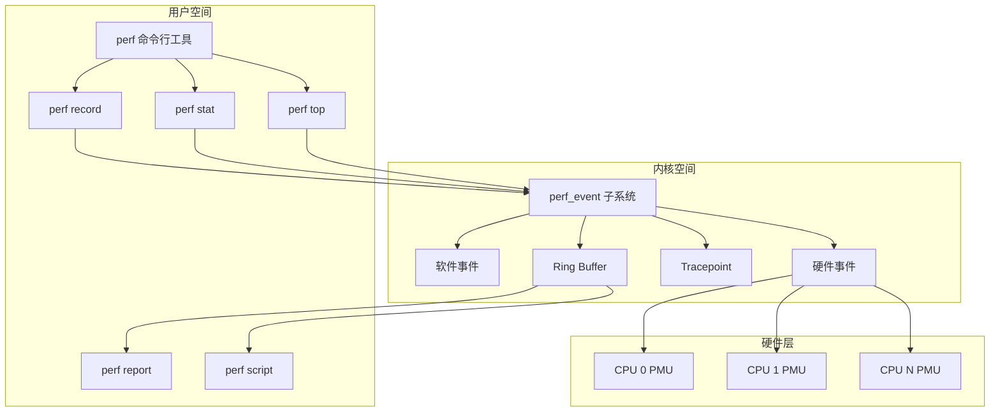

### 1.2 核心组件

| 组件 | 层级 | 功能 |
|------|------|------|
| perf 命令 | 用户空间 | 命令行接口，配置采集、分析数据 |
| perf_event 子系统 | 内核 | 统一的性能事件框架 |
| PMU 驱动 | 内核 | 对接各 CPU 架构的 PMU |
| PMU 硬件 | 硬件 | 硬件性能计数器 |

---

## 二、PMU 硬件性能计数器原理

### 2.1 什么是 PMU

**PMU（Performance Monitoring Unit）** 是 CPU 内置的硬件单元，用于监控 CPU 运行时的各种事件。

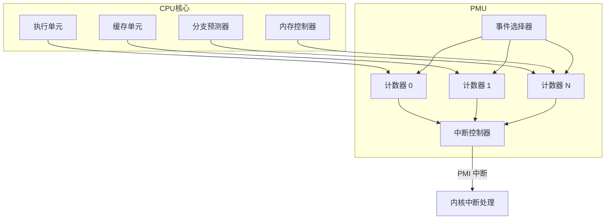

### 2.2 PMU 寄存器

以 **x86 架构**为例，PMU 包含以下关键寄存器：

| 寄存器 | 全称 | 功能 |
|--------|------|------|
| `IA32_PERFEVTSELx` | Performance Event Select | 选择要监控的事件类型 |
| `IA32_PMCx` | Performance Monitoring Counter | 存储计数值 |
| `IA32_PERF_GLOBAL_CTRL` | Global Control | 全局启用/禁用计数器 |
| `IA32_PERF_GLOBAL_STATUS` | Global Status | 计数器溢出状态 |
| `IA32_PERF_GLOBAL_OVF_CTRL` | Overflow Control | 清除溢出标志 |

### 2.3 事件选择器配置

**`IA32_PERFEVTSELx` 寄存器结构：**

| Bit 位 | 字段 | 说明 |
|--------|------|------|
| 63-32 | 保留 | Reserved |
| 31 | CNT | Counter mask |
| 30 | INV | Invert |
| 29 | EN | Enable - 启用计数器 |
| 28 | INT | Interrupt - 溢出时触发中断 |
| 27-24 | CMASK | Counter mask |
| 23-22 | 保留 | Reserved |
| 21-16 | UMASK | 事件子类型掩码 |
| 15-8 | UMASK | Unit mask（继续） |
| 7-0 | Event Select | 事件类型编号 |

### 2.4 常见硬件事件

```c
// Linux 内核定义的通用硬件事件
enum perf_hw_id {
    PERF_COUNT_HW_CPU_CYCLES              = 0,  // CPU 周期
    PERF_COUNT_HW_INSTRUCTIONS            = 1,  // 执行指令数
    PERF_COUNT_HW_CACHE_REFERENCES        = 2,  // 缓存访问
    PERF_COUNT_HW_CACHE_MISSES            = 3,  // 缓存未命中
    PERF_COUNT_HW_BRANCH_INSTRUCTIONS     = 4,  // 分支指令
    PERF_COUNT_HW_BRANCH_MISSES           = 5,  // 分支预测错误
    PERF_COUNT_HW_BUS_CYCLES              = 6,  // 总线周期
    PERF_COUNT_HW_STALLED_CYCLES_FRONTEND = 7,  // 前端停顿
    PERF_COUNT_HW_STALLED_CYCLES_BACKEND  = 8,  // 后端停顿
    PERF_COUNT_HW_REF_CPU_CYCLES          = 9,  // 参考周期
};
```

### 2.5 为什么 PMU 能实现零开销计数

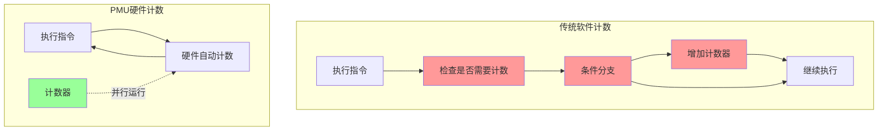

**关键区别**：
- **软件计数**：每次需要执行判断和计数指令，产生额外 CPU 开销
- **PMU 硬件计数**：与 CPU 执行并行运行，不消耗任何执行周期

---

## 三、perf_event 子系统

### 3.1 核心数据结构

```c
// 性能事件属性配置
struct perf_event_attr {
    __u32 type;           // 事件类型（硬件/软件/tracepoint）
    __u32 size;           // 结构体大小
    __u64 config;         // 事件配置（取决于 type）
    
    union {
        __u64 sample_period;  // 采样周期（每 N 个事件采样一次）
        __u64 sample_freq;    // 采样频率（每秒采样 N 次）
    };
    
    __u64 sample_type;    // 采样时记录哪些信息
    __u64 read_format;    // 读取格式
    
    // 标志位
    __u64 disabled       :1,  // 初始禁用
          inherit        :1,  // 子进程继承
          pinned         :1,  // 固定到 PMU
          exclusive      :1,  // 独占模式
          exclude_user   :1,  // 排除用户态
          exclude_kernel :1,  // 排除内核态
          exclude_hv     :1,  // 排除虚拟机监控程序
          exclude_idle   :1,  // 排除空闲
          mmap           :1,  // 记录 mmap 事件
          comm           :1,  // 记录 comm 事件
          freq           :1,  // 使用频率模式
          // ... 更多标志
};

// 采样时可记录的信息
#define PERF_SAMPLE_IP           (1U << 0)   // 指令指针
#define PERF_SAMPLE_TID          (1U << 1)   // 线程 ID
#define PERF_SAMPLE_TIME         (1U << 2)   // 时间戳
#define PERF_SAMPLE_ADDR         (1U << 3)   // 数据地址
#define PERF_SAMPLE_READ         (1U << 4)   // 计数器值
#define PERF_SAMPLE_CALLCHAIN    (1U << 5)   // 调用栈
#define PERF_SAMPLE_ID           (1U << 6)   // 事件 ID
#define PERF_SAMPLE_CPU          (1U << 7)   // CPU 编号
#define PERF_SAMPLE_PERIOD       (1U << 8)   // 采样周期
#define PERF_SAMPLE_STREAM_ID    (1U << 9)   // 流 ID
#define PERF_SAMPLE_RAW          (1U << 10)  // 原始数据
#define PERF_SAMPLE_BRANCH_STACK (1U << 11)  // 分支栈（LBR）
#define PERF_SAMPLE_REGS_USER    (1U << 12)  // 用户态寄存器
#define PERF_SAMPLE_STACK_USER   (1U << 13)  // 用户态栈
```

### 3.2 perf_event_open 系统调用

```c
// 创建性能事件的系统调用
int perf_event_open(
    struct perf_event_attr *attr,  // 事件配置
    pid_t pid,                     // 目标进程
                                   // -1: 所有进程
                                   // 0:  当前进程
                                   // >0: 指定进程
    int cpu,                       // 目标 CPU
                                   // -1: 所有 CPU
                                   // >=0: 指定 CPU
    int group_fd,                  // 事件组（-1 为独立事件）
    unsigned long flags            // 标志
);

// 返回：文件描述符，用于后续操作
```

### 3.3 事件处理流程

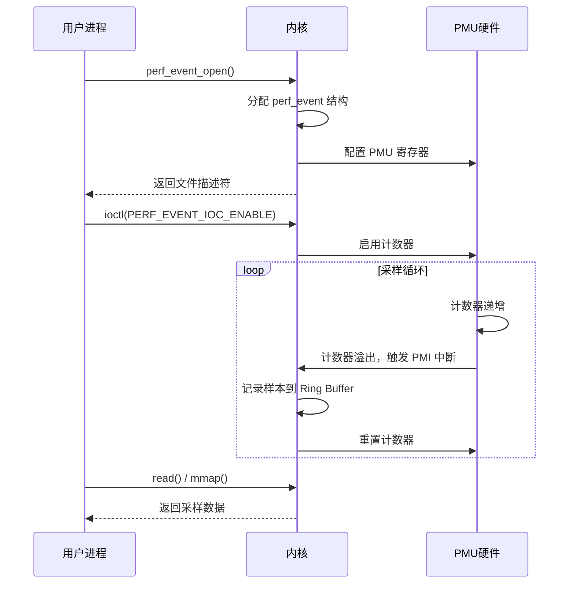

---

## 四、采样机制详解

### 4.1 计数模式 vs 采样模式

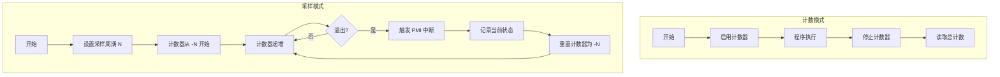

### 4.2 采样周期与频率

| 模式 | 设置方式 | 特点 |
|------|----------|------|
| **周期模式** | `sample_period = N` | 每 N 个事件采样一次 |
| **频率模式** | `sample_freq = F, freq=1` | 每秒采样 F 次（内核自动调整周期） |

**频率模式实现原理**：

```c
// 内核自适应调整采样周期
void perf_adjust_period(struct perf_event *event) {
    u64 period = event->hw.sample_period;
    u64 delta = now - event->last_time;
    u64 samples = event->sample_count - event->last_sample_count;
    
    // 计算实际采样率
    u64 actual_freq = samples * NSEC_PER_SEC / delta;
    
    // 调整周期以达到目标频率
    if (actual_freq > target_freq) {
        period = period * actual_freq / target_freq;  // 增大周期
    } else {
        period = period * actual_freq / target_freq;  // 减小周期
    }
    
    event->hw.sample_period = clamp(period, MIN_PERIOD, MAX_PERIOD);
}
```

### 4.3 PMI 中断处理

**PMI（Performance Monitoring Interrupt）** 是 PMU 计数器溢出时触发的中断。

```c
// 简化的 PMI 中断处理流程（x86）
static void intel_pmu_handle_irq(struct pt_regs *regs) {
    struct cpu_hw_events *cpuc = this_cpu_ptr(&cpu_hw_events);
    
    // 1. 禁用所有计数器
    wrmsrl(MSR_CORE_PERF_GLOBAL_CTRL, 0);
    
    // 2. 读取溢出状态
    u64 status = intel_pmu_get_status();
    
    // 3. 处理每个溢出的计数器
    for_each_set_bit(idx, (unsigned long *)&status, X86_PMC_IDX_MAX) {
        struct perf_event *event = cpuc->events[idx];
        
        if (!event)
            continue;
        
        // 4. 记录采样数据
        struct perf_sample_data data;
        perf_sample_data_init(&data, 0, event->hw.last_period);
        
        // 5. 获取调用栈
        if (event->attr.sample_type & PERF_SAMPLE_CALLCHAIN)
            data.callchain = perf_callchain(event, regs);
        
        // 6. 输出到 Ring Buffer
        perf_event_output(event, &data, regs);
        
        // 7. 重置计数器
        intel_pmu_reload(event);
    }
    
    // 8. 清除溢出状态
    intel_pmu_ack_status(status);
    
    // 9. 重新启用计数器
    wrmsrl(MSR_CORE_PERF_GLOBAL_CTRL, cpuc->ctrl);
}
```

### 4.4 Ring Buffer 数据传递

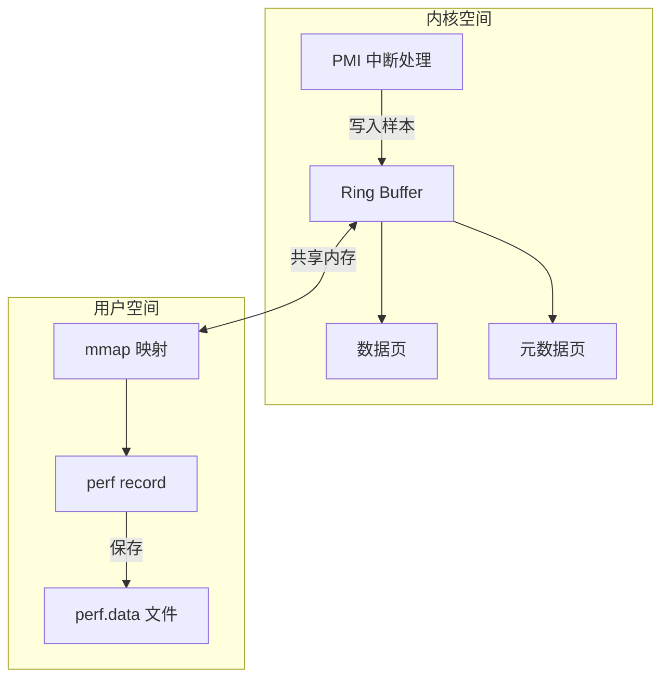

**Ring Buffer 结构**：

```c
struct perf_event_mmap_page {
    __u32 version;         // 版本号
    __u32 compat_version;  // 兼容版本
    __u32 lock;            // 锁
    __u32 index;           // 硬件计数器索引
    __s64 offset;          // 计数器偏移
    __u64 time_enabled;    // 启用时间
    __u64 time_running;    // 运行时间
    
    // Ring Buffer 控制
    __u64 data_head;       // 写入位置（内核更新）
    __u64 data_tail;       // 读取位置（用户更新）
    __u64 data_offset;     // 数据区偏移
    __u64 data_size;       // 数据区大小
    
    // ... 更多字段
};
```

---

## 五、调用栈采集方法

### 5.1 三种栈回溯方法对比

| 方法 | 原理 | 优点 | 缺点 |
|------|------|------|------|
| **Frame Pointer** | 沿 RBP 链回溯 | 快速、开销小 | 需要编译时保留 FP（`-fno-omit-frame-pointer`） |
| **DWARF** | 使用 `.eh_frame` 调试信息 | 准确、不需特殊编译 | 开销大、需要调试信息 |
| **LBR** | 硬件 Last Branch Record | 零开销、精确 | 深度有限（16-32层）、仅 Intel CPU |

### 5.2 Frame Pointer 回溯


**回溯算法**：

```c
// Frame Pointer 栈回溯
struct stack_frame {
    struct stack_frame *next_frame;  // 上一帧的 RBP
    unsigned long return_addr;       // 返回地址
};

void unwind_frame_pointer(struct pt_regs *regs, 
                          unsigned long *callchain, 
                          int max_depth) {
    struct stack_frame *frame;
    int depth = 0;
    
    // 从当前 RBP 开始
    frame = (struct stack_frame *)regs->bp;
    
    while (frame && depth < max_depth) {
        // 验证地址有效性
        if (!access_ok(frame, sizeof(*frame)))
            break;
        
        // 记录返回地址
        callchain[depth++] = frame->return_addr;
        
        // 移动到上一帧
        frame = frame->next_frame;
        
        // 防止死循环
        if ((unsigned long)frame <= (unsigned long)frame->next_frame)
            break;
    }
}
```

**编译选项**：

```bash
# 保留 Frame Pointer（用于 perf 采样）
gcc -fno-omit-frame-pointer -O2 program.c -o program

# 默认 GCC 在 -O2 会省略 Frame Pointer
# 省略 FP 可以多一个通用寄存器，但无法用 FP 方式回溯
```

### 5.3 DWARF 回溯

**DWARF**（Debugging With Attributed Record Formats）使用编译时生成的调试信息进行栈回溯。

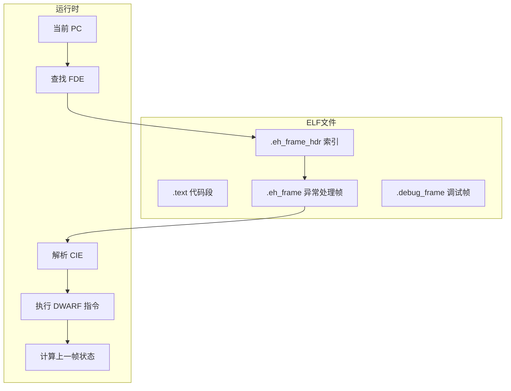

**DWARF 表结构**：

```
FDE (Frame Description Entry) 示例：

PC Range: 0x401000 - 0x401100 (function_a)
Instructions:
  DW_CFA_def_cfa: r7 (rsp) + 8
  DW_CFA_offset: r16 (return_addr) at cfa-8
  
  PC 0x401001:
    DW_CFA_def_cfa_offset: 16
    DW_CFA_offset: r6 (rbp) at cfa-16
  
  PC 0x401004:
    DW_CFA_def_cfa_register: r6 (rbp)
```

**优缺点分析**：

```c
// DWARF 回溯开销较大
// 需要在 PMI 中断上下文中：
// 1. 查找当前 PC 对应的 FDE
// 2. 解析 CIE 公共信息
// 3. 执行 DWARF 虚拟机指令序列
// 4. 计算寄存器恢复规则
// 5. 恢复上一帧状态

// 优点：即使没有 Frame Pointer 也能准确回溯
// 缺点：每帧回溯需要数百条指令
```

### 5.4 LBR（Last Branch Record）

**LBR** 是 Intel CPU 提供的硬件特性，自动记录最近的分支跳转。

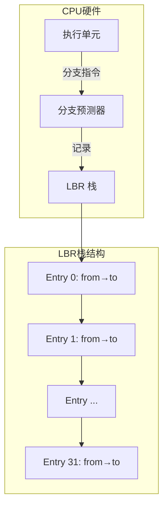

**LBR 寄存器**：

| 寄存器 | 功能 |
|--------|------|
| `MSR_LBR_SELECT` | 选择要记录的分支类型 |
| `MSR_LASTBRANCH_TOS` | 栈顶指针（Top of Stack） |
| `MSR_LASTBRANCH_0_FROM_IP` | 第 0 条记录的源地址 |
| `MSR_LASTBRANCH_0_TO_IP` | 第 0 条记录的目标地址 |
| ... | 最多 32 条记录 |

**使用 LBR 采样**：

```bash
# 使用 LBR 采集调用栈
perf record --call-graph lbr ./program

# LBR 模式特点：
# - 零开销：硬件自动记录
# - 精确：分支级别的精度
# - 深度有限：通常 16-32 层
# - 仅 Intel CPU 支持
```

### 5.5 perf 中选择回溯方法

```bash
# Frame Pointer 方式（默认，需要 -fno-omit-frame-pointer）
perf record --call-graph fp ./program

# DWARF 方式（准确，开销大）
perf record --call-graph dwarf ./program

# LBR 方式（零开销，深度有限）
perf record --call-graph lbr ./program

# DWARF + 指定栈大小
perf record --call-graph dwarf,8192 ./program
```

---

## 六、火焰图生成原理

### 6.1 数据处理流程

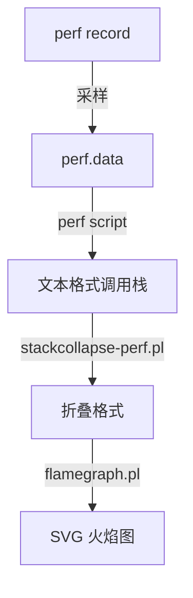

### 6.2 各阶段数据格式

**阶段 1：perf.data（二进制）**

```
# 二进制格式，包含：
# - 文件头（魔数、版本、属性）
# - 事件属性列表
# - 采样数据
# - 符号表
```

**阶段 2：perf script 输出**

```bash
$ perf script

# 输出格式：
# 进程名 PID CPU 时间戳: 事件计数 事件名:
#     地址 符号 (模块)
#     地址 符号 (模块)
#     ...

myapp 12345 [001] 123456.789012:     999999 cycles:
        ffffffff8108a123 native_write_msr ([kernel.kallsyms])
        ffffffff8108a456 intel_pmu_enable_all ([kernel.kallsyms])
        ffffffff81089def x86_pmu_enable ([kernel.kallsyms])
            7f1234567890 compute (/usr/bin/myapp)
            7f1234567abc process (/usr/bin/myapp)
            7f1234567def main (/usr/bin/myapp)
```

**阶段 3：折叠格式**

```bash
$ perf script | stackcollapse-perf.pl

# 输出格式：
# 调用栈（分号分隔）<空格>计数

myapp;main;process;compute;x86_pmu_enable;intel_pmu_enable_all;native_write_msr 42
myapp;main;process;other_func 18
myapp;main;init 5
```

**阶段 4：SVG 火焰图**

```bash
$ perf script | stackcollapse-perf.pl | flamegraph.pl > flame.svg

# 生成 SVG 文件，包含：
# - 每个函数的矩形
# - 宽度 = 采样占比
# - 颜色 = 随机（区分不同函数）
# - 交互功能（点击缩放、搜索）
```

### 6.3 一键生成脚本

```bash
#!/bin/bash
# generate_flamegraph.sh - 一键生成火焰图

PID=${1:-}
DURATION=${2:-30}
OUTPUT=${3:-flamegraph.svg}

if [ -n "$PID" ]; then
    echo "采集进程 $PID 的 CPU profile ($DURATION 秒)..."
    perf record -F 99 -p $PID -g -- sleep $DURATION
else
    echo "采集系统 CPU profile ($DURATION 秒)..."
    perf record -F 99 -a -g -- sleep $DURATION
fi

echo "生成火焰图..."
perf script | \
    stackcollapse-perf.pl | \
    flamegraph.pl --title "CPU Flame Graph" > $OUTPUT

echo "火焰图已保存到: $OUTPUT"
```

---

## 七、火焰图深度解读

### 7.1 火焰图结构解析

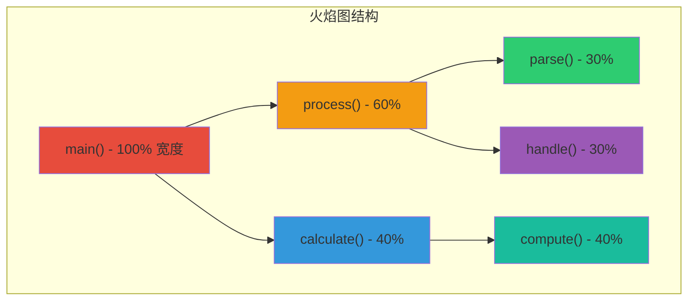

### 7.2 三个核心维度

| 维度 | 含义 | 解读 |
|------|------|------|
| **Y 轴** | 调用栈深度 | 底部是入口（如 main），顶部是叶子函数 |
| **X 轴宽度** | 采样次数占比 | **越宽 = 占用 CPU 时间越多** |
| **颜色** | 无特殊含义 | 随机分配，仅用于区分相邻函数 |

**重要注意**：X 轴的排列顺序是**字母序**，不是时间序！

### 7.3 关键概念：两种宽度

**火焰图宽度示意：**

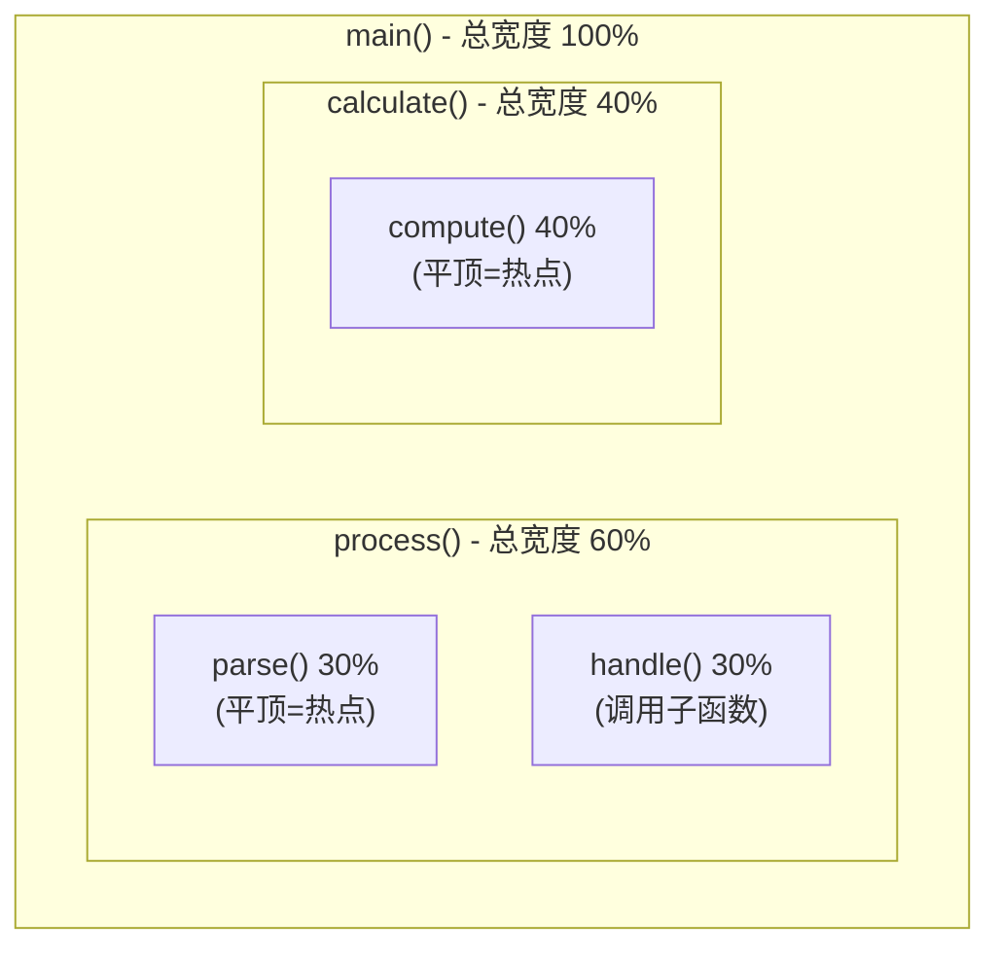

| 宽度类型 | 定义 | 如何识别 |
|----------|------|----------|
| **总宽度** | 函数自身 + 所有子函数的时间 | 函数矩形的完整宽度 |
| **自身宽度** | 仅函数自身代码执行时间 | "平顶"部分（没有子函数覆盖的区域） |

### 7.4 四步读图法

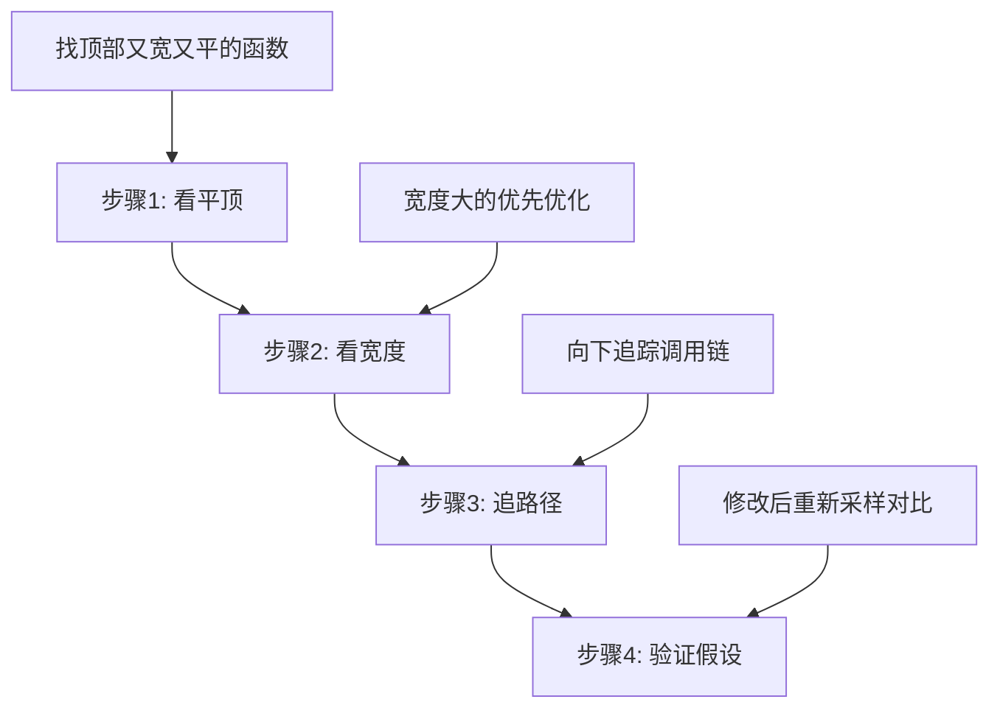

**步骤 1：看平顶（找热点）**

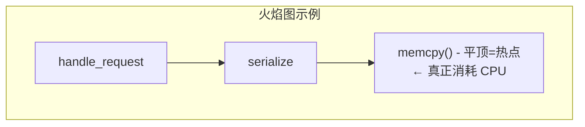

**平顶（Plateau）** = 函数自身在执行代码，没有调用其他函数 = **真正的 CPU 消耗者**

**步骤 2：看宽度（找占比）**

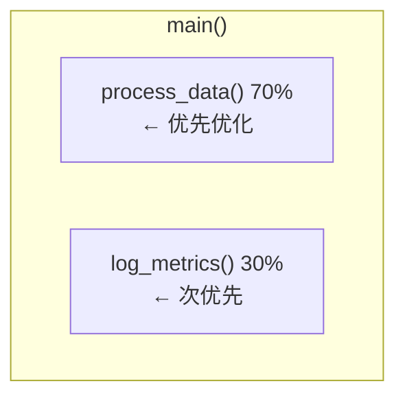

**步骤 3：追路径（理解调用链）**

```
问：为什么 memcpy() 占 30%？
  ↓
答：serialize() 调用了它
  ↓
问：为什么 serialize() 被频繁调用？
  ↓
答：handle_request() 每个请求都序列化
  ↓
问：能否减少序列化？
  ↓
优化方向确定
```

**步骤 4：验证假设**

```bash
# 优化前采样
perf record -g ./app_v1

# 优化后采样
perf record -g ./app_v2

# 使用差分火焰图对比
difffolded.pl before.folded after.folded | flamegraph.pl > diff.svg
```

### 7.5 常见问题模式

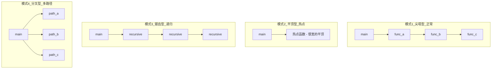

| 模式 | 特征 | 说明 | 优化建议 |
|------|------|------|----------|
| **尖塔型** | 调用链清晰，逐层深入 | 正常情况 | 无需特别优化 |
| **平顶型** | 某函数顶部很宽且平 | 该函数自身消耗大量 CPU | 优化该函数算法/实现 |
| **锯齿型** | 同一函数重复出现 | 递归调用或频繁循环 | 考虑改为迭代、减少调用深度 |
| **分叉型** | 函数调用多个子路径 | 多路径并行消耗 | 逐个分析各路径 |

### 7.6 不同类型火焰图

| 类型 | 数据来源 | 用途 |
|------|----------|------|
| **CPU 火焰图** | `perf record -g` | 分析 CPU 时间消耗 |
| **Off-CPU 火焰图** | `offcputime`（bcc 工具） | 分析等待/阻塞时间 |
| **内存火焰图** | `perf record -e malloc` | 分析内存分配热点 |
| **差分火焰图** | 两次采样对比 | 对比优化前后（红增蓝减） |
| **冰柱图** | 同 CPU，方向相反 | 个人偏好 |

### 7.7 常见误区

| 误区 | 正确理解 |
|------|----------|
| X 轴是时间顺序 | ❌ X 轴是字母序排列 |
| 越高越热 | ❌ 宽度才代表热度，高度只是调用深度 |
| 颜色深=热 | ❌ 颜色是随机的，无特殊含义 |
| 只看单个函数 | ❌ 要结合调用链分析上下文 |
| 一次采样就够 | ❌ 多次采样验证，避免偶然因素 |

---

## 八、perf 命令详解

### 8.1 perf stat - 事件统计

```bash
# 基本统计
$ perf stat ./program

 Performance counter stats for './program':

         12,345,678      cycles                    # 2.5 GHz
          9,876,543      instructions              # 0.80 IPC
            123,456      cache-misses              # 5.0% of cache refs
          2,469,135      cache-references
             12,345      branch-misses             # 1.2% of branches
          1,028,765      branch-instructions

       1.234567890 seconds time elapsed

# 指定事件
$ perf stat -e cycles,instructions,cache-misses,branch-misses ./program

# 详细模式
$ perf stat -d ./program  # 更多缓存事件
$ perf stat -dd ./program # 更详细
$ perf stat -ddd ./program # 最详细

# 重复测量
$ perf stat -r 5 ./program  # 运行 5 次取平均

# 按 CPU 统计
$ perf stat -a -A ./program  # 所有 CPU 分别显示
```

**关键指标解读**：

| 指标 | 含义 | 参考值 |
|------|------|--------|
| IPC | 每周期指令数 | >2 好，<1 差 |
| cache-miss rate | 缓存未命中率 | <5% 好，>10% 需优化 |
| branch-miss rate | 分支预测错误率 | <2% 好，>5% 需优化 |
| stalled-cycles | 停顿周期 | 占比高说明有瓶颈 |

### 8.2 perf record - 采样记录

```bash
# 基本采样
$ perf record ./program

# 采样频率（推荐 99Hz 避免与系统节拍对齐）
$ perf record -F 99 ./program

# 记录调用栈
$ perf record -g ./program

# 指定事件
$ perf record -e cycles ./program
$ perf record -e cache-misses ./program
$ perf record -e branch-misses ./program

# 采样特定进程
$ perf record -p 12345

# 采样所有 CPU
$ perf record -a

# 指定输出文件
$ perf record -o mydata.data ./program

# 选择调用栈回溯方法
$ perf record --call-graph fp ./program    # Frame Pointer
$ perf record --call-graph dwarf ./program # DWARF
$ perf record --call-graph lbr ./program   # LBR（Intel）
```

### 8.3 perf report - 分析报告

```bash
# 交互式报告
$ perf report

# 指定输入文件
$ perf report -i mydata.data

# 按调用链显示
$ perf report -g

# 调用链显示模式
$ perf report -g graph    # 图形模式
$ perf report -g flat     # 扁平模式
$ perf report -g fractal  # 分形模式

# 排序方式
$ perf report --sort=dso,symbol
$ perf report --sort=cpu,pid

# 过滤
$ perf report --dso=libc.so.6
$ perf report --symbol=malloc
```

### 8.4 perf top - 实时监控

```bash
# 实时查看热点
$ perf top

# 指定进程
$ perf top -p 12345

# 显示调用栈
$ perf top -g

# 指定事件
$ perf top -e cache-misses

# 采样频率
$ perf top -F 99
```

### 8.5 perf script - 导出原始数据

```bash
# 导出文本格式（用于火焰图）
$ perf script > out.perf

# 指定输出字段
$ perf script -F comm,pid,tid,time,event,ip,sym,dso

# 过滤
$ perf script --pid 12345
$ perf script --tid 12345
$ perf script --time 10.5,11.0
```

### 8.6 perf annotate - 源码级分析

```bash
# 查看热点函数的汇编
$ perf annotate

# 指定函数
$ perf annotate function_name

# 显示源码（需要 -g 编译）
$ perf annotate -l function_name
```

### 8.7 perf list - 列出可用事件

```bash
# 列出所有事件
$ perf list

# 按类型过滤
$ perf list hw           # 硬件事件
$ perf list sw           # 软件事件
$ perf list cache        # 缓存事件
$ perf list tracepoint   # 跟踪点
```

---

## 九、实战案例

### 9.1 定位 CPU 热点

```bash
# 场景：程序 CPU 使用率高

# 1. 采样
$ perf record -F 99 -g -p $(pgrep myapp) -- sleep 30

# 2. 分析热点
$ perf report

# 3. 生成火焰图
$ perf script | stackcollapse-perf.pl | flamegraph.pl > cpu.svg

# 4. 查看热点函数源码
$ perf annotate hot_function
```

### 9.2 分析缓存问题

```bash
# 场景：怀疑缓存未命中导致性能问题

# 1. 统计缓存事件
$ perf stat -e cache-references,cache-misses,\
    L1-dcache-loads,L1-dcache-load-misses,\
    LLC-loads,LLC-load-misses \
    ./program

# 2. 采样缓存未命中
$ perf record -e cache-misses -g ./program

# 3. 查看哪些代码导致缓存未命中
$ perf report
```

### 9.3 分析分支预测

```bash
# 场景：分支密集型代码

# 1. 统计分支事件
$ perf stat -e branch-instructions,branch-misses ./program

# 2. 采样分支错误
$ perf record -e branch-misses -g ./program

# 3. 分析
$ perf report
$ perf annotate problematic_function
```

### 9.4 多事件同时采样

```bash
# 同时采样多个事件
$ perf record -e cycles,cache-misses,branch-misses -g ./program

# 或使用事件组
$ perf record -e '{cycles,instructions,cache-misses}' -g ./program
```

### 9.5 完整诊断脚本

```bash
#!/bin/bash
# perf_diagnose.sh - perf 性能诊断脚本

TARGET=${1:-./program}
DURATION=${2:-30}
OUTPUT_DIR="./perf_output_$(date +%Y%m%d_%H%M%S)"

mkdir -p $OUTPUT_DIR
cd $OUTPUT_DIR

echo "===== 性能诊断: $TARGET ====="

# 1. 基本统计
echo "[1/5] 收集基本统计..."
perf stat -d -d -d -o stats.txt -- $TARGET &
STAT_PID=$!

# 等待统计完成或超时
sleep $DURATION
kill -2 $STAT_PID 2>/dev/null

# 2. CPU 采样
echo "[2/5] CPU 采样..."
perf record -F 99 -g -o cpu.data -- $TARGET &
RECORD_PID=$!
sleep $DURATION
kill -2 $RECORD_PID 2>/dev/null
wait $RECORD_PID 2>/dev/null

# 3. 生成火焰图
echo "[3/5] 生成火焰图..."
perf script -i cpu.data > cpu.perf
stackcollapse-perf.pl cpu.perf > cpu.folded
flamegraph.pl cpu.folded > cpu_flamegraph.svg

# 4. 缓存分析
echo "[4/5] 缓存分析..."
perf stat -e cache-references,cache-misses,\
    L1-dcache-loads,L1-dcache-load-misses,\
    LLC-loads,LLC-load-misses \
    -o cache_stats.txt -- $TARGET &
CACHE_PID=$!
sleep $DURATION
kill -2 $CACHE_PID 2>/dev/null

# 5. 分支分析
echo "[5/5] 分支分析..."
perf stat -e branch-instructions,branch-misses \
    -o branch_stats.txt -- $TARGET &
BRANCH_PID=$!
sleep $DURATION
kill -2 $BRANCH_PID 2>/dev/null

echo "===== 诊断完成 ====="
echo "输出目录: $OUTPUT_DIR"
echo "- stats.txt       : 基本统计"
echo "- cpu_flamegraph.svg : CPU 火焰图"
echo "- cache_stats.txt : 缓存统计"
echo "- branch_stats.txt: 分支统计"
```

---

## 十、常见问题与解决

### 10.1 权限问题

```bash
# 错误：perf_event_open() 权限不足
# 解决方案：

# 方法 1：使用 root
$ sudo perf record ./program

# 方法 2：调整 paranoid 级别
$ sudo sysctl kernel.perf_event_paranoid=-1

# paranoid 级别：
# -1: 允许所有用户
#  0: 允许采样但不允许 tracepoint
#  1: 只允许非特权事件
#  2: 只允许用户态事件（默认）
#  3: 完全禁用

# 方法 3：给二进制添加 capability
$ sudo setcap cap_sys_admin+ep /usr/bin/perf
```

### 10.2 符号解析问题

```bash
# 问题：perf report 显示 [unknown] 符号

# 解决方案：

# 1. 确保程序有调试符号
$ gcc -g program.c -o program

# 2. 安装内核调试符号
$ sudo apt install linux-image-$(uname -r)-dbgsym  # Debian/Ubuntu
$ sudo yum install kernel-debuginfo               # CentOS/RHEL

# 3. 检查 buildid 缓存
$ perf buildid-cache -l
$ perf buildid-cache -a /path/to/binary
```

### 10.3 调用栈不完整

```bash
# 问题：调用栈只有一两层

# 解决方案：

# 1. 使用 Frame Pointer 编译
$ gcc -fno-omit-frame-pointer -g program.c -o program

# 2. 或使用 DWARF 回溯
$ perf record --call-graph dwarf ./program

# 3. 或使用 LBR（Intel CPU）
$ perf record --call-graph lbr ./program
```

### 10.4 采样数据过大

```bash
# 问题：perf.data 文件太大

# 解决方案：

# 1. 降低采样频率
$ perf record -F 49 ./program  # 从 99 降到 49

# 2. 减少采样时间
$ perf record -g -- sleep 10  # 只采样 10 秒

# 3. 过滤特定进程
$ perf record -p $(pgrep myapp)  # 只采样目标进程

# 4. 压缩存储
$ perf record -z ./program  # 启用压缩
```

---

## 十一、高频考点总结

| 考点 | 频率 | 关键知识 |
|------|------|----------|
| PMU 原理 | ★★★ | 硬件计数器、零开销计数 |
| 采样机制 | ★★★ | PMI 中断、采样周期/频率 |
| 调用栈采集 | ★★☆ | FP/DWARF/LBR 三种方法 |
| perf stat | ★★★ | IPC、cache-miss、branch-miss |
| perf record | ★★★ | -g、-F、--call-graph |
| 火焰图生成 | ★★★ | stackcollapse + flamegraph |
| 火焰图解读 | ★★★ | X轴=占比、平顶=热点 |
| 性能指标 | ★★☆ | IPC、缓存命中率、分支预测率 |

---

## 相关文章

- [上一篇：eBPF笔试面试题](/articles/linux/linux-36-eBPF笔试面试题/)
- [下一篇：Valgrind内存分析工具深度解析](/articles/linux/linux-38-Valgrind内存分析工具深度解析/)
- [性能分析与调试](/articles/linux/linux-08-性能分析与调试/)
- [HFT笔试题-性能分析](/articles/hft/hft-29-HFT笔试题-性能分析/)
- [应用性能分析实战](/articles/sre/sre-37-应用性能分析实战/)
