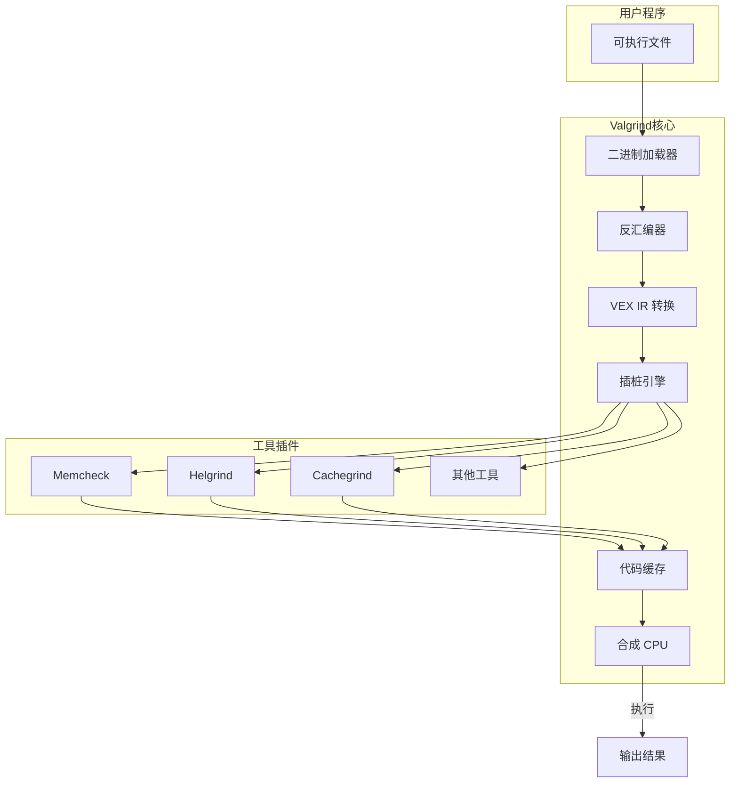
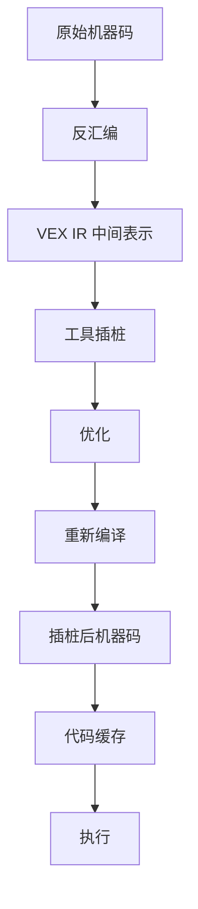
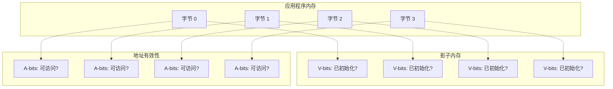
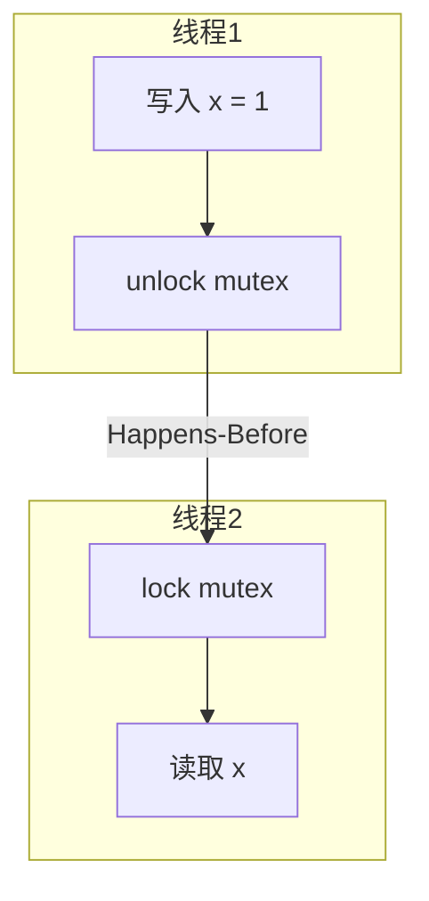

+++
title = "38.Valgrind内存分析工具深度解析"
date = 2026-01-31
description = "Valgrind深度解析：工作原理、Memcheck内存检测、Helgrind线程分析、Cachegrind缓存分析"
[taxonomies]
tags = ["Linux", "Valgrind", "内存分析", "调试", "性能分析"]
+++

# Valgrind 内存分析工具深度解析

本文深入解析 Valgrind 工具的工作原理，包括动态二进制插桩技术、Memcheck 内存错误检测、Helgrind 线程分析、Cachegrind 缓存分析等核心功能。

---

## 一、Valgrind 概述

### 1.1 什么是 Valgrind

**Valgrind** 是一个动态二进制分析框架，通过**动态二进制插桩（Dynamic Binary Instrumentation, DBI）** 技术，在程序运行时插入检测代码，实现内存错误检测、线程分析、性能分析等功能。

### 1.2 核心工具集

| 工具 | 功能 | 常用场景 |
|------|------|----------|
| **Memcheck** | 内存错误检测 | 内存泄漏、越界访问、未初始化读取 |
| **Helgrind** | 线程错误检测 | 数据竞争、死锁、锁顺序问题 |
| **DRD** | 线程错误检测 | 类似 Helgrind，更轻量 |
| **Cachegrind** | 缓存分析 | 缓存命中率、分支预测 |
| **Callgrind** | 调用图分析 | 函数调用关系、CPU 消耗 |
| **Massif** | 堆内存分析 | 内存使用趋势、峰值分析 |
| **DHAT** | 堆分析 | 内存分配模式、生命周期 |

### 1.3 架构概览



---

## 二、工作原理

### 2.1 动态二进制插桩（DBI）

Valgrind 不修改源代码或可执行文件，而是在运行时：

1. **拦截**：接管程序执行
2. **反汇编**：将机器码转换为中间表示（VEX IR）
3. **插桩**：在 IR 中插入检测代码
4. **重编译**：将 IR 重新编译为机器码
5. **执行**：在"合成 CPU"上执行插桩后的代码



### 2.2 VEX 中间表示

**VEX IR** 是 Valgrind 的平台无关中间表示，支持多种 CPU 架构：

```c
// 原始 x86 指令
// mov eax, [ebx+4]
// add eax, 1
// mov [ebx+4], eax

// 转换为 VEX IR（简化）
t1 = GET(ebx)           // 读取 ebx 寄存器
t2 = Add32(t1, 4)       // 计算地址
t3 = Load(t2)           // 从内存加载
t4 = Add32(t3, 1)       // 加 1
Store(t2, t4)           // 存回内存
PUT(eax, t4)            // 更新 eax 寄存器
```

### 2.3 影子内存（Shadow Memory）

Memcheck 使用**影子内存**追踪每个字节的状态：



| 影子内存类型 | 作用 | 比例 |
|-------------|------|------|
| **V-bits** | 每个比特是否已初始化 | 1:1（每字节 8 位） |
| **A-bits** | 地址是否可访问 | 1:8（每 8 字节 1 位） |

### 2.4 为什么 Valgrind 很慢

| 因素 | 开销来源 |
|------|----------|
| **动态翻译** | 每条指令都需要转换和重编译 |
| **影子内存访问** | 每次内存访问都需要检查影子内存 |
| **无硬件加速** | 完全软件模拟，无法使用 CPU 优化 |
| **缓存失效** | 代码缓存容量有限，频繁重编译 |

**典型开销**：程序运行慢 **10-50 倍**

---

## 三、Memcheck 内存错误检测

### 3.1 可检测的错误类型

| 错误类型 | 说明 | 危害 |
|----------|------|------|
| **未初始化内存读取** | 使用未初始化的变量 | 不确定行为 |
| **堆缓冲区溢出** | 访问 malloc 分配区域之外 | 数据损坏、崩溃 |
| **栈缓冲区溢出** | 访问栈数组边界之外 | 栈破坏、安全漏洞 |
| **释放后使用** | 访问已 free 的内存 | 悬挂指针、崩溃 |
| **重复释放** | 同一内存释放两次 | 堆损坏 |
| **内存泄漏** | 分配的内存未释放 | 内存耗尽 |
| **不匹配的分配/释放** | malloc/delete 混用 | 未定义行为 |

### 3.2 基本使用

```bash
# 基本检测
valgrind ./program

# 完整内存检测
valgrind --leak-check=full ./program

# 显示所有错误详情
valgrind --leak-check=full --show-leak-kinds=all ./program

# 追踪内存来源
valgrind --leak-check=full --track-origins=yes ./program

# 输出到文件
valgrind --leak-check=full --log-file=valgrind.log ./program
```

### 3.3 常用选项

| 选项 | 说明 | 默认值 |
|------|------|--------|
| `--leak-check=full` | 详细泄漏报告 | summary |
| `--show-leak-kinds=all` | 显示所有类型泄漏 | definite,possible |
| `--track-origins=yes` | 追踪未初始化值来源 | no |
| `--undef-value-errors=yes` | 报告未初始化值错误 | yes |
| `--track-fds=yes` | 追踪文件描述符泄漏 | no |
| `--num-callers=20` | 调用栈深度 | 12 |
| `--suppressions=file` | 抑制文件 | 无 |
| `--gen-suppressions=all` | 生成抑制规则 | no |

### 3.4 错误报告解读

**未初始化内存读取**：

```
==12345== Conditional jump or move depends on uninitialised value(s)
==12345==    at 0x401234: process_data (main.c:42)
==12345==    by 0x401567: main (main.c:78)
==12345==  Uninitialised value was created by a stack allocation
==12345==    at 0x401200: process_data (main.c:35)
```

**堆缓冲区溢出**：

```
==12345== Invalid read of size 4
==12345==    at 0x401234: access_array (main.c:25)
==12345==    by 0x401567: main (main.c:50)
==12345==  Address 0x5204044 is 0 bytes after a block of size 100 alloc'd
==12345==    at 0x4C2BBAF: malloc (vg_replace_malloc.c:299)
==12345==    by 0x401200: init_array (main.c:15)
```

**内存泄漏报告**：

```
==12345== LEAK SUMMARY:
==12345==    definitely lost: 1,024 bytes in 2 blocks
==12345==    indirectly lost: 2,048 bytes in 4 blocks
==12345==      possibly lost: 512 bytes in 1 blocks
==12345==    still reachable: 4,096 bytes in 8 blocks
==12345==         suppressed: 0 bytes in 0 blocks
```

| 泄漏类型 | 含义 | 严重程度 |
|----------|------|----------|
| **definitely lost** | 确定泄漏，无指针指向 | 严重 |
| **indirectly lost** | 间接泄漏，父块丢失导致 | 严重 |
| **possibly lost** | 可能泄漏，有内部指针 | 需检查 |
| **still reachable** | 程序结束时仍可访问 | 通常可忽略 |

### 3.5 常见错误示例与修复

**示例 1：未初始化变量**

```c
// 错误代码
int process(int flag) {
    int result;  // 未初始化
    if (flag > 0) {
        result = 100;
    }
    return result;  // flag <= 0 时返回未初始化值
}

// 修复
int process(int flag) {
    int result = 0;  // 初始化
    if (flag > 0) {
        result = 100;
    }
    return result;
}
```

**示例 2：堆缓冲区溢出**

```c
// 错误代码
int* arr = malloc(10 * sizeof(int));
for (int i = 0; i <= 10; i++) {  // 应该是 i < 10
    arr[i] = i;  // i=10 时越界
}

// 修复
int* arr = malloc(10 * sizeof(int));
for (int i = 0; i < 10; i++) {
    arr[i] = i;
}
```

**示例 3：释放后使用**

```c
// 错误代码
char* str = malloc(100);
strcpy(str, "hello");
free(str);
printf("%s\n", str);  // 使用已释放内存

// 修复
char* str = malloc(100);
strcpy(str, "hello");
printf("%s\n", str);
free(str);
str = NULL;  // 置空防止误用
```

**示例 4：内存泄漏**

```c
// 错误代码
void process() {
    char* buf = malloc(1024);
    // ... 处理 ...
    if (error) {
        return;  // 泄漏：未释放 buf
    }
    free(buf);
}

// 修复
void process() {
    char* buf = malloc(1024);
    // ... 处理 ...
    if (error) {
        free(buf);  // 错误路径也要释放
        return;
    }
    free(buf);
}
```

---

## 四、Helgrind 线程错误检测

### 4.1 可检测的错误类型

| 错误类型 | 说明 |
|----------|------|
| **数据竞争** | 多线程无锁访问共享数据 |
| **死锁** | 锁的循环等待 |
| **锁顺序不一致** | 可能导致死锁的锁顺序 |
| **POSIX API 误用** | pthread 函数使用错误 |

### 4.2 基本使用

```bash
# 基本线程检测
valgrind --tool=helgrind ./program

# 增加调用栈深度
valgrind --tool=helgrind --num-callers=20 ./program

# 历史记录级别（更准确但更慢）
valgrind --tool=helgrind --history-level=full ./program
```

### 4.3 数据竞争检测原理

Helgrind 使用 **Happens-Before** 关系检测数据竞争：



**如果两个访问之间没有 Happens-Before 关系，且至少一个是写操作，则是数据竞争。**

### 4.4 错误报告解读

**数据竞争**：

```
==12345== Possible data race during read of size 4 at 0x601040 by thread #2
==12345== Locks held: none
==12345==    at 0x401234: reader (main.c:25)
==12345==    by 0x4E3F6B9: start_thread (pthread_create.c:333)
==12345==
==12345== This conflicts with a previous write of size 4 by thread #1
==12345== Locks held: none
==12345==    at 0x401300: writer (main.c:35)
==12345==    by 0x4E3F6B9: start_thread (pthread_create.c:333)
```

**锁顺序问题**：

```
==12345== Thread #2: lock order "0x601040 before 0x601080" violated
==12345==
==12345== Observed order is: first 0x601080, then 0x601040
==12345==    at 0x401234: func_b (main.c:45)
==12345==
==12345== Required order was established by:
==12345==    at 0x401300: func_a (main.c:30)
```

### 4.5 常见错误示例与修复

**示例 1：数据竞争**

```c
// 错误代码
int counter = 0;

void* increment(void* arg) {
    for (int i = 0; i < 100000; i++) {
        counter++;  // 数据竞争
    }
    return NULL;
}

// 修复方案 1：使用互斥锁
pthread_mutex_t mutex = PTHREAD_MUTEX_INITIALIZER;

void* increment(void* arg) {
    for (int i = 0; i < 100000; i++) {
        pthread_mutex_lock(&mutex);
        counter++;
        pthread_mutex_unlock(&mutex);
    }
    return NULL;
}

// 修复方案 2：使用原子操作
#include <stdatomic.h>
atomic_int counter = 0;

void* increment(void* arg) {
    for (int i = 0; i < 100000; i++) {
        atomic_fetch_add(&counter, 1);
    }
    return NULL;
}
```

**示例 2：潜在死锁**

```c
// 错误代码：锁顺序不一致
pthread_mutex_t lock_a, lock_b;

void thread1() {
    pthread_mutex_lock(&lock_a);
    pthread_mutex_lock(&lock_b);  // 先 A 后 B
    // ...
    pthread_mutex_unlock(&lock_b);
    pthread_mutex_unlock(&lock_a);
}

void thread2() {
    pthread_mutex_lock(&lock_b);
    pthread_mutex_lock(&lock_a);  // 先 B 后 A → 死锁风险
    // ...
    pthread_mutex_unlock(&lock_a);
    pthread_mutex_unlock(&lock_b);
}

// 修复：统一锁顺序
void thread2() {
    pthread_mutex_lock(&lock_a);  // 先 A
    pthread_mutex_lock(&lock_b);  // 后 B
    // ...
    pthread_mutex_unlock(&lock_b);
    pthread_mutex_unlock(&lock_a);
}
```

---

## 五、Cachegrind 缓存分析

### 5.1 功能概述

Cachegrind 模拟 CPU 缓存行为，分析：
- L1 指令缓存命中/未命中
- L1 数据缓存命中/未命中
- LL（Last Level）缓存命中/未命中
- 分支预测命中/错误

### 5.2 基本使用

```bash
# 基本缓存分析
valgrind --tool=cachegrind ./program

# 生成详细报告
cg_annotate cachegrind.out.<pid>

# 指定源文件注释
cg_annotate --auto=yes cachegrind.out.<pid>

# 比较两次运行
cg_diff cachegrind.out.1 cachegrind.out.2
```

### 5.3 输出解读

```
==12345== I   refs:      1,234,567,890
==12345== I1  misses:          123,456
==12345== LLi misses:           12,345
==12345== I1  miss rate:          0.01%
==12345== LLi miss rate:          0.00%
==12345== 
==12345== D   refs:        456,789,012  (345,678,901 rd + 111,110,111 wr)
==12345== D1  misses:        5,678,901  (  4,567,890 rd +   1,111,011 wr)
==12345== LLd misses:          567,890  (    456,789 rd +     111,101 wr)
==12345== D1  miss rate:           1.2% (        1.3%   +         1.0%  )
==12345== LLd miss rate:           0.1% (        0.1%   +         0.1%  )
==12345== 
==12345== LL refs:           5,802,357
==12345== LL misses:           580,235
==12345== LL miss rate:            0.0%
```

| 指标 | 含义 |
|------|------|
| I refs | 指令引用次数 |
| I1 misses | L1 指令缓存未命中 |
| D refs | 数据引用次数（读 + 写） |
| D1 misses | L1 数据缓存未命中 |
| LLd misses | 最后一级缓存数据未命中 |
| LL miss rate | 最后一级缓存未命中率 |

### 5.4 cg_annotate 详细报告

```bash
$ cg_annotate cachegrind.out.12345

--------------------------------------------------------------------------------
Ir          I1mr   ILmr   Dr          D1mr   DLmr   Dw         D1mw  DLmw  file:function
--------------------------------------------------------------------------------
1,000,000      10      5   500,000   50,000  5,000   250,000   1,000   100  main.c:process_data
  500,000       5      2   200,000   20,000  2,000   100,000     500    50  utils.c:helper
  ...
```

| 列 | 含义 |
|----|------|
| Ir | 指令读取次数 |
| I1mr | L1 指令缓存未命中 |
| Dr | 数据读取次数 |
| D1mr | L1 数据缓存读未命中 |
| Dw | 数据写入次数 |
| D1mw | L1 数据缓存写未命中 |

---

## 六、Callgrind 调用图分析

### 6.1 基本使用

```bash
# 基本分析
valgrind --tool=callgrind ./program

# 收集缓存信息
valgrind --tool=callgrind --cache-sim=yes ./program

# 收集分支预测信息
valgrind --tool=callgrind --branch-sim=yes ./program

# 可视化分析
kcachegrind callgrind.out.<pid>
```

### 6.2 运行时控制

```bash
# 开始时不收集（程序启动后手动开启）
valgrind --tool=callgrind --instr-atstart=no ./program

# 在另一终端控制
callgrind_control -i on   # 开始收集
callgrind_control -i off  # 停止收集
callgrind_control -d      # 输出当前数据
```

### 6.3 使用 KCachegrind 可视化

```bash
# 安装
sudo apt install kcachegrind  # Debian/Ubuntu
sudo yum install kcachegrind  # CentOS/RHEL

# 打开分析结果
kcachegrind callgrind.out.<pid>
```

**KCachegrind 功能**：
- 调用图可视化
- 函数成本排序
- 源码级标注
- 调用者/被调用者分析

---

## 七、Massif 堆内存分析

### 7.1 基本使用

```bash
# 基本堆分析
valgrind --tool=massif ./program

# 包含栈内存
valgrind --tool=massif --stacks=yes ./program

# 更详细的分配信息
valgrind --tool=massif --detailed-freq=1 ./program

# 可视化
ms_print massif.out.<pid>
```

### 7.2 输出解读

```
    MB
19.63^                                                                       #
     |                                                                      @#
     |                                                                    @@:#
     |                                                                  @@@@:#
     |                                                                @@@@@@:#
     |                                                              @:@@@@@@:#
     |                                                            @@@:@@@@@@:#
     |                                                          @@@@@:@@@@@@:#
     |                                                        @@@@@@@:@@@@@@:#
     |                                                      @@@@@@@@@:@@@@@@:#
     |                                                    @@@@@@@@@@@:@@@@@@:#
     |                                                  @@@@@@@@@@@@@:@@@@@@:#
     |                                                :::@@@@@@@@@@@@@:@@@@@@:#
     |                                              :::::@@@@@@@@@@@@@:@@@@@@:#
     |                                            :::::::@@@@@@@@@@@@@:@@@@@@:#
     |                                          :::::::::@@@@@@@@@@@@@:@@@@@@:#
     |                                        :::::::::::@@@@@@@@@@@@@:@@@@@@:#
     |                                      :::::::::::::@@@@@@@@@@@@@:@@@@@@:#
     |                                    :::::::::::::::@@@@@@@@@@@@@:@@@@@@:#
     |                                  :::::::::::::::::@@@@@@@@@@@@@:@@@@@@:#
   0 +----------------------------------------------------------------------->Gi
     0                                                                   2.193
```

**图例**：
- `#` - 峰值时的堆使用
- `@` - 详细快照
- `:` - 普通快照

### 7.3 详细快照分析

```
--------------------------------------------------------------------------------
  n        time(i)         total(B)   useful-heap(B) extra-heap(B)    stacks(B)
--------------------------------------------------------------------------------
 72     98,222,320       20,582,400       20,000,000       582,400            0
 
 99.72% (20,524,288B) (heap allocation functions) malloc/new/new[], --alloc-fns, etc.
 ->95.12% (19,578,368B) 0x401234: create_buffer (buffer.c:42)
 | ->95.12% (19,578,368B) 0x401567: process (main.c:78)
 |   ->95.12% (19,578,368B) 0x401890: main (main.c:120)
 ->04.60% (945,920B) 0x402345: init_cache (cache.c:25)
```

---

## 八、实战技巧

### 8.1 抑制误报

创建 `.supp` 文件抑制已知问题：

```bash
# 生成抑制规则
valgrind --gen-suppressions=all ./program 2>&1 | grep -A 10 "{"

# 使用抑制文件
valgrind --suppressions=myapp.supp ./program
```

**抑制文件格式**：

```
{
   <name>
   Memcheck:Leak
   match-leak-kinds: reachable
   fun:malloc
   fun:_dl_init
   ...
}
```

### 8.2 与 GDB 集成

```bash
# 在 Valgrind 中启动 GDB 服务器
valgrind --vgdb=yes --vgdb-error=0 ./program

# 另一终端连接
gdb ./program
(gdb) target remote | vgdb

# 在 Valgrind 错误处自动断点
(gdb) continue
```

### 8.3 性能优化建议

```bash
# 1. 使用 --partial-loads-ok=yes 减少误报
valgrind --partial-loads-ok=yes ./program

# 2. 关闭不需要的检测
valgrind --track-origins=no ./program  # 更快但信息少

# 3. 限制错误数量
valgrind --error-limit=no ./program    # 显示所有错误

# 4. 只检测特定文件的内存
valgrind --trace-children=no ./program # 不追踪子进程
```

### 8.4 CI/CD 集成

```bash
#!/bin/bash
# valgrind_check.sh - CI 中使用

valgrind --leak-check=full \
         --error-exitcode=1 \
         --xml=yes \
         --xml-file=valgrind-report.xml \
         ./program

exit_code=$?

if [ $exit_code -ne 0 ]; then
    echo "Valgrind detected memory errors!"
    exit 1
fi

echo "Memory check passed!"
exit 0
```

---

## 九、各工具对比与选择

| 场景 | 推荐工具 | 说明 |
|------|----------|------|
| 内存泄漏 | Memcheck | 最全面的内存检测 |
| 释放后使用 | Memcheck | 精确检测 |
| 缓冲区溢出 | Memcheck | 堆和栈都能检测 |
| 数据竞争 | Helgrind/DRD | Helgrind 更全面，DRD 更快 |
| 死锁检测 | Helgrind | 锁顺序分析 |
| 缓存优化 | Cachegrind | 缓存命中率分析 |
| 性能分析 | Callgrind + KCachegrind | 可视化调用图 |
| 内存使用趋势 | Massif | 堆内存时间线 |

---

## 十、与其他工具对比

| 特性 | Valgrind | ASan | TSan |
|------|----------|------|------|
| 原理 | DBI 动态插桩 | 编译时插桩 | 编译时插桩 |
| 需要重新编译 | ❌ | ✅ | ✅ |
| 运行开销 | 10-50x | 2x | 5-15x |
| 内存检测 | ✅ 全面 | ✅ 快速 | ❌ |
| 线程检测 | ✅ Helgrind | ❌ | ✅ |
| 生产环境 | ❌ | ⚠️ 可选 | ❌ |
| 平台支持 | 多平台 | GCC/Clang | GCC/Clang |

---

## 十一、高频考点总结

| 考点 | 频率 | 关键知识 |
|------|------|----------|
| DBI 原理 | ★★☆ | 动态翻译、VEX IR、影子内存 |
| Memcheck 使用 | ★★★ | --leak-check=full、--track-origins=yes |
| 泄漏类型区分 | ★★★ | definitely/indirectly/possibly/reachable |
| 错误报告解读 | ★★★ | Invalid read/write、Uninitialised value |
| Helgrind 使用 | ★★☆ | 数据竞争、锁顺序检测 |
| 性能开销 | ★★☆ | 10-50x 慢，原因分析 |
| 与 ASan 对比 | ★★☆ | 编译时 vs 运行时插桩 |

---

## 相关文章

- [上一篇：perf性能分析工具深度解析](/articles/linux/linux-37-perf性能分析工具深度解析/)
- [性能分析与调试](/articles/linux/linux-08-性能分析与调试/)
- [内核同步机制详解](/articles/linux/linux-18-内核同步机制详解/)
