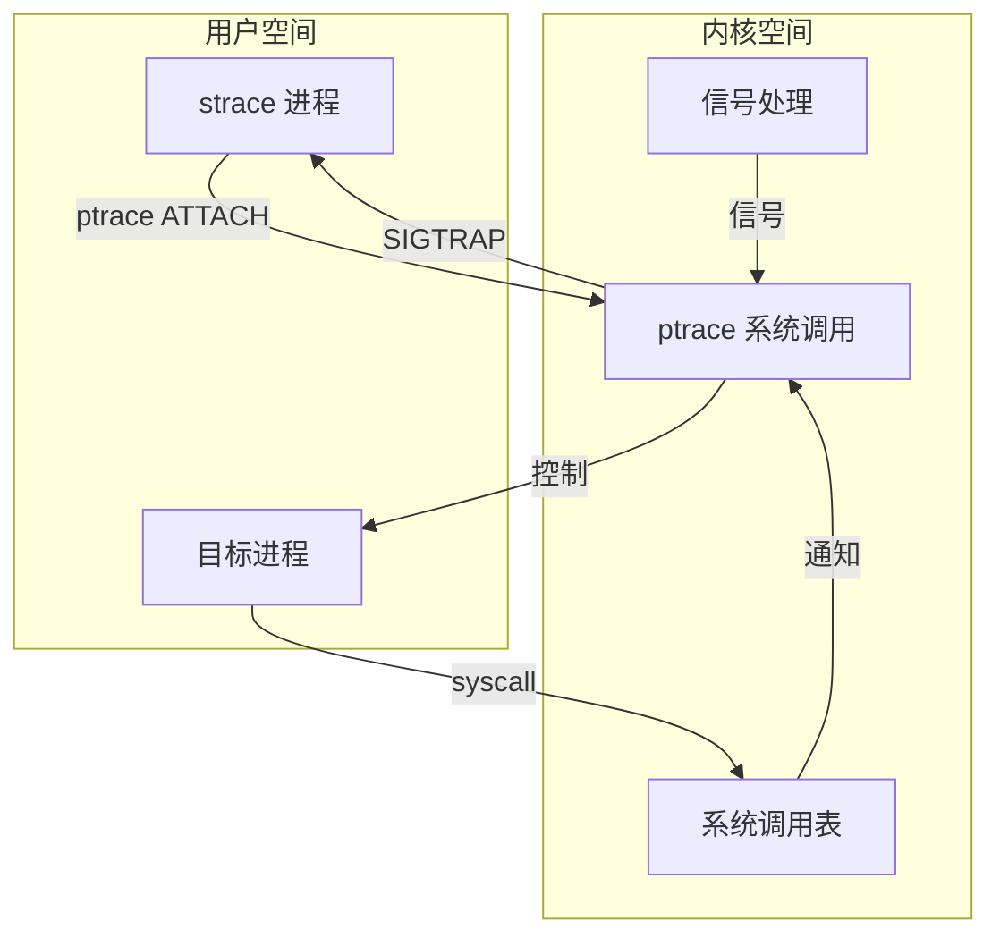
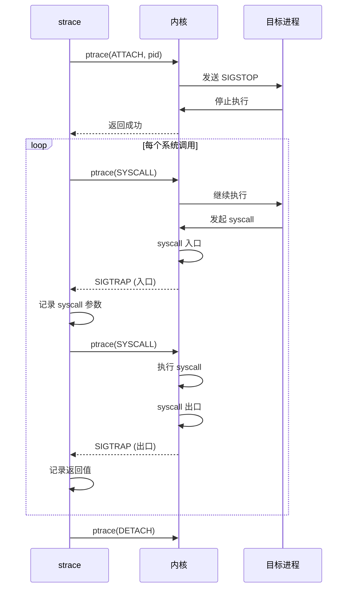

+++
title = "39.strace系统调用追踪深度解析"
date = 2026-01-31
description = "strace深度解析：ptrace原理、系统调用追踪、性能分析、故障排查实战"
[taxonomies]
tags = ["Linux", "strace", "系统调用", "调试", "故障排查"]
+++

# strace 系统调用追踪深度解析

本文深入解析 strace 工具的工作原理，包括 ptrace 机制、系统调用追踪、性能分析、故障排查等实战技巧。

---

## 一、strace 概述

### 1.1 什么是 strace

**strace** 是 Linux 下的系统调用追踪工具，能够：
- 追踪进程发起的所有系统调用
- 显示系统调用的参数和返回值
- 追踪接收到的信号
- 统计系统调用的时间和次数

### 1.2 核心功能

| 功能 | 说明 | 应用场景 |
|------|------|----------|
| **系统调用追踪** | 显示所有 syscall | 了解程序行为 |
| **参数解析** | 智能解析参数含义 | 调试问题 |
| **时间统计** | 每个 syscall 耗时 | 性能分析 |
| **信号追踪** | 捕获信号传递 | 调试崩溃 |
| **子进程追踪** | 跟踪 fork/clone | 多进程调试 |

### 1.3 架构概览



---

## 二、工作原理

### 2.1 ptrace 机制

strace 基于 **ptrace** 系统调用实现，ptrace 允许一个进程（tracer）控制另一个进程（tracee）。

```c
// ptrace 系统调用原型
long ptrace(enum __ptrace_request request, pid_t pid,
            void *addr, void *data);

// 主要操作
PTRACE_ATTACH     // 附加到进程
PTRACE_DETACH     // 分离进程
PTRACE_SYSCALL    // 在 syscall 入口/出口停止
PTRACE_CONT       // 继续执行
PTRACE_PEEKDATA   // 读取内存
PTRACE_GETREGS    // 获取寄存器
```

### 2.2 追踪流程



### 2.3 系统调用拦截原理

**x86_64 架构**：

```
系统调用入口：
1. 用户程序执行 syscall 指令
2. CPU 切换到内核模式
3. 内核检查是否被 ptrace
4. 如果被追踪：
   - 停止目标进程
   - 发送 SIGTRAP 给 tracer
   - tracer 读取寄存器获取 syscall 号和参数

寄存器映射（x86_64）：
- rax: syscall 号 / 返回值
- rdi: 参数 1
- rsi: 参数 2
- rdx: 参数 3
- r10: 参数 4
- r8:  参数 5
- r9:  参数 6
```

### 2.4 为什么 strace 很慢

| 开销来源 | 说明 |
|----------|------|
| **上下文切换** | 每个 syscall 需要 2 次切换到 tracer |
| **信号传递** | SIGTRAP 信号处理开销 |
| **内存访问** | 读取 tracee 内存获取参数 |
| **格式化输出** | 参数解析和格式化 |

**典型开销**：程序运行慢 **2-100 倍**（取决于 syscall 密集程度）

---

## 三、基本使用

### 3.1 启动方式

```bash
# 方式 1：启动新进程
strace ./program

# 方式 2：附加到运行中的进程
strace -p <pid>

# 方式 3：附加到进程的所有线程
strace -p <pid> -f
```

### 3.2 常用选项

| 选项 | 说明 | 示例 |
|------|------|------|
| `-f` | 追踪子进程 | `strace -f ./program` |
| `-ff` | 每个进程单独输出文件 | `strace -ff -o log ./program` |
| `-p pid` | 附加到进程 | `strace -p 1234` |
| `-o file` | 输出到文件 | `strace -o trace.log ./program` |
| `-e expr` | 过滤表达式 | `strace -e open,read ./program` |
| `-t` | 显示时间（秒） | `strace -t ./program` |
| `-tt` | 显示时间（微秒） | `strace -tt ./program` |
| `-T` | 显示 syscall 耗时 | `strace -T ./program` |
| `-c` | 统计汇总 | `strace -c ./program` |
| `-s size` | 字符串最大长度 | `strace -s 1000 ./program` |
| `-v` | 详细输出 | `strace -v ./program` |
| `-y` | 显示文件路径 | `strace -y ./program` |
| `-yy` | 显示 socket 详情 | `strace -yy ./program` |

### 3.3 过滤表达式

```bash
# 按 syscall 名称过滤
strace -e open,read,write ./program
strace -e trace=open,read,write ./program

# 按类别过滤
strace -e trace=file ./program      # 文件相关
strace -e trace=network ./program   # 网络相关
strace -e trace=process ./program   # 进程相关
strace -e trace=signal ./program    # 信号相关
strace -e trace=ipc ./program       # IPC 相关
strace -e trace=memory ./program    # 内存相关
strace -e trace=desc ./program      # 文件描述符相关

# 排除某些 syscall
strace -e trace=!poll,select ./program

# 只显示失败的调用
strace -e status=failed ./program

# 按返回值过滤
strace -e status=unfinished ./program
```

### 3.4 输出格式

```bash
# 基本输出
open("/etc/passwd", O_RDONLY) = 3

# 带时间戳 (-t)
14:30:25 open("/etc/passwd", O_RDONLY) = 3

# 带微秒 (-tt)
14:30:25.123456 open("/etc/passwd", O_RDONLY) = 3

# 带耗时 (-T)
open("/etc/passwd", O_RDONLY) = 3 <0.000045>

# 失败的调用
open("/nonexistent", O_RDONLY) = -1 ENOENT (No such file or directory)
```

---

## 四、高级用法

### 4.1 性能统计

```bash
# 统计 syscall 次数和时间
$ strace -c ./program

% time     seconds  usecs/call     calls    errors syscall
------ ----------- ----------- --------- --------- ----------------
 45.23    0.123456          12     10000           write
 30.15    0.082345          82      1000           read
 15.67    0.042789          42      1000       100 open
  5.12    0.013987          13      1000           close
  3.83    0.010456          10      1000           fstat
------ ----------- ----------- --------- --------- ----------------
100.00    0.273033                 14000       100 total
```

```bash
# 统计 + 详细输出
strace -c -S time ./program    # 按时间排序
strace -c -S calls ./program   # 按调用次数排序
strace -c -S errors ./program  # 按错误次数排序
```

### 4.2 追踪特定文件

```bash
# 追踪对特定文件的操作
strace -e trace=file -P /etc/passwd ./program

# 追踪多个文件
strace -P /etc/passwd -P /etc/shadow ./program
```

### 4.3 注入错误（用于测试）

```bash
# 让 open 调用返回 ENOENT
strace -e inject=open:error=ENOENT ./program

# 让 read 返回错误（概率 50%）
strace -e inject=read:error=EIO:when=2+ ./program

# 注入延迟
strace -e inject=read:delay_enter=100000 ./program  # 100ms 延迟
```

### 4.4 追踪网络操作

```bash
# 追踪所有网络相关调用
strace -e trace=network ./program

# 显示 socket 地址详情
strace -yy -e trace=network ./program

# 输出示例
socket(AF_INET, SOCK_STREAM, IPPROTO_TCP) = 3<TCP:[127.0.0.1:8080]>
connect(3<TCP:[127.0.0.1:8080]>, {sa_family=AF_INET, sin_port=htons(80), 
        sin_addr=inet_addr("93.184.216.34")}, 16) = 0
```

### 4.5 多进程/多线程追踪

```bash
# 追踪子进程
strace -f ./program

# 每个进程单独文件
strace -ff -o trace ./program
# 生成 trace.1234, trace.1235, ...

# 显示进程 ID
strace -f ./program 2>&1 | grep "^\[pid"

# 输出格式
[pid 1234] open("/etc/passwd", O_RDONLY) = 3
[pid 1235] read(3, "root:x:0:0..."..., 4096) = 1024
```

---

## 五、故障排查实战

### 5.1 程序启动失败

```bash
# 场景：程序启动失败，没有明确错误信息

$ strace ./myapp
execve("./myapp", ["./myapp"], 0x7ffd... /* 50 vars */) = 0
...
open("/lib/libcustom.so", O_RDONLY|O_CLOEXEC) = -1 ENOENT (No such file or directory)
write(2, "./myapp: error while loading sha"..., 89) = 89
exit_group(127)

# 问题定位：缺少 libcustom.so 库
```

### 5.2 权限问题

```bash
# 场景：程序报权限错误

$ strace ./myapp
...
open("/etc/secret.conf", O_RDONLY) = -1 EACCES (Permission denied)
write(2, "Cannot read config file\n", 24) = 24

# 问题定位：无权读取配置文件
```

### 5.3 程序挂起

```bash
# 场景：程序卡住不响应

$ strace -p <pid>
select(5, [3 4], NULL, NULL, NULL) = ? ERESTARTSYS (To be restarted if SA_RESTART is set)
--- SIGSTOP {si_signo=SIGSTOP, si_code=SI_USER, si_pid=1234, si_uid=0} ---
select(5, [3 4], NULL, NULL, NULL

# 问题定位：程序阻塞在 select，等待文件描述符 3 和 4
# 使用 lsof -p <pid> 查看这些 fd 是什么
```

### 5.4 性能问题

```bash
# 场景：程序运行缓慢

$ strace -c -S time ./slow_program

% time     seconds  usecs/call     calls    errors syscall
------ ----------- ----------- --------- --------- ----------------
 89.23    5.234567       52345       100           nanosleep
  5.15    0.302345          30     10000           write
  3.67    0.215234          21     10000           read
...

# 问题定位：程序在 nanosleep 上花费了 89% 的时间
```

### 5.5 文件泄漏

```bash
# 场景：文件描述符泄漏

$ strace -e trace=open,close -c ./leaky_program

% time     seconds  usecs/call     calls    errors syscall
------ ----------- ----------- --------- --------- ----------------
 60.00    0.006000           6      1000           open
 40.00    0.004000           4       500           close
------ ----------- ----------- --------- --------- ----------------

# 问题定位：open 1000 次，close 只有 500 次
```

### 5.6 网络连接问题

```bash
# 场景：程序无法连接服务器

$ strace -e trace=network -yy ./client
socket(AF_INET, SOCK_STREAM, IPPROTO_TCP) = 3<TCP:[*:*]>
connect(3<TCP:[*:*]>, {sa_family=AF_INET, sin_port=htons(8080), 
        sin_addr=inet_addr("192.168.1.100")}, 16) = -1 ETIMEDOUT (Connection timed out)

# 问题定位：连接 192.168.1.100:8080 超时
```

---

## 六、实用脚本

### 6.1 分析慢系统调用

```bash
#!/bin/bash
# slow_syscalls.sh - 找出慢的系统调用

PID=$1
THRESHOLD=${2:-0.001}  # 默认 1ms

strace -T -p $PID 2>&1 | while read line; do
    if [[ $line =~ \<([0-9]+\.[0-9]+)\>$ ]]; then
        time=${BASH_REMATCH[1]}
        if (( $(echo "$time > $THRESHOLD" | bc -l) )); then
            echo "$line"
        fi
    fi
done
```

### 6.2 追踪特定操作

```bash
#!/bin/bash
# trace_file_access.sh - 追踪文件访问

TARGET=$1
PATTERN=${2:-""}

strace -f -e trace=file -y "$TARGET" 2>&1 | \
    if [ -n "$PATTERN" ]; then
        grep "$PATTERN"
    else
        cat
    fi
```

### 6.3 生成 syscall 报告

```bash
#!/bin/bash
# syscall_report.sh - 生成系统调用报告

TARGET=$1
OUTPUT=${2:-"syscall_report"}

echo "=== Syscall Report for: $TARGET ===" > $OUTPUT.txt
echo "" >> $OUTPUT.txt

echo "=== Summary ===" >> $OUTPUT.txt
strace -c "$TARGET" 2>&1 | tee -a $OUTPUT.txt

echo "" >> $OUTPUT.txt
echo "=== Slow Calls (>1ms) ===" >> $OUTPUT.txt
strace -T "$TARGET" 2>&1 | grep -E '<0\.[0-9]{3}' | head -50 >> $OUTPUT.txt

echo "Report saved to $OUTPUT.txt"
```

---

## 七、与同类工具对比

| 特性 | strace | ltrace | perf trace | bpftrace |
|------|--------|--------|------------|----------|
| 追踪目标 | 系统调用 | 库函数 | 系统调用 | 内核/用户 |
| 实现机制 | ptrace | ptrace | perf_event | eBPF |
| 性能开销 | 高（2-100x） | 高 | 低（<10%） | 极低 |
| 需要 root | 部分场景 | 否 | 是 | 是 |
| 功能丰富度 | 高 | 中 | 中 | 极高 |
| 学习曲线 | 低 | 低 | 中 | 高 |
| 生产环境 | ⚠️ 慎用 | ⚠️ 慎用 | ✅ 可用 | ✅ 推荐 |

### 7.1 何时使用 strace

✅ **适合场景**：
- 开发/测试环境调试
- 快速定位问题
- 了解程序行为
- 故障排查

❌ **不适合场景**：
- 生产环境性能分析
- 高并发程序
- 对延迟敏感的应用

### 7.2 替代方案

```bash
# perf trace - 更低开销
sudo perf trace ./program

# bpftrace - 更灵活
sudo bpftrace -e 'tracepoint:syscalls:sys_enter_open { printf("%s\n", str(args->filename)); }'

# sysdig - 容器友好
sudo sysdig proc.name=myapp
```

---

## 八、高级技巧

### 8.1 追踪容器内进程

```bash
# 找到容器内进程的宿主 PID
docker inspect --format '{{.State.Pid}}' <container_id>

# 使用 nsenter 进入命名空间后 strace
nsenter -t <pid> -n strace -p <pid>

# 或直接从宿主机 strace
strace -p <host_pid>
```

### 8.2 追踪 setuid 程序

```bash
# 需要 root 权限
sudo strace ./setuid_program

# 或临时禁用 setuid
cp ./setuid_program ./test_program
chmod u-s ./test_program
strace ./test_program
```

### 8.3 保存和回放

```bash
# 保存完整输出
strace -o trace.log -tt -T -f ./program

# 分析保存的日志
grep "= -1" trace.log           # 找失败的调用
grep -E "<[0-9]\." trace.log    # 找慢的调用（>1s）
awk '/^[0-9]/ {print $2}' trace.log | sort | uniq -c | sort -rn  # 统计
```

### 8.4 减少输出噪音

```bash
# 忽略常见的轮询调用
strace -e trace=!poll,select,epoll_wait,nanosleep ./program

# 只关注文件操作
strace -e trace=open,openat,read,write,close -y ./program

# 限制字符串长度
strace -s 100 ./program
```

---

## 九、常见问题

### 9.1 权限不足

```bash
# 错误：Operation not permitted

# 解决方案 1：使用 root
sudo strace -p <pid>

# 解决方案 2：调整 ptrace_scope
echo 0 | sudo tee /proc/sys/kernel/yama/ptrace_scope

# ptrace_scope 值：
# 0 - 允许所有进程
# 1 - 只允许父进程（默认）
# 2 - 只允许 admin
# 3 - 完全禁用
```

### 9.2 程序行为改变

由于 strace 开销大，可能导致：
- 时序问题消失（race condition）
- 性能问题不明显
- 超时行为改变

**解决**：使用 perf trace 或 bpftrace 替代

### 9.3 输出太多

```bash
# 使用过滤
strace -e trace=file ./program

# 输出到文件后分析
strace -o trace.log ./program
grep "ENOENT" trace.log
```

---

## 十、高频考点总结

| 考点 | 频率 | 关键知识 |
|------|------|----------|
| ptrace 原理 | ★★★ | ATTACH、SYSCALL、信号机制 |
| 基本用法 | ★★★ | -f、-p、-e、-o |
| 过滤表达式 | ★★★ | trace=file/network/process |
| 时间统计 | ★★☆ | -c、-T、-t |
| 故障排查 | ★★★ | 文件、权限、网络问题定位 |
| 性能开销 | ★★☆ | 2-100x，ptrace 原因 |
| 与其他工具对比 | ★★☆ | perf trace、bpftrace |

---

## 相关文章

- [上一篇：Valgrind内存分析工具深度解析](/articles/linux/linux-38-Valgrind内存分析工具深度解析/)
- [perf性能分析工具深度解析](/articles/linux/linux-37-perf性能分析工具深度解析/)
- [eBPF技术深度解析](/articles/linux/linux-35-eBPF技术深度解析/)
