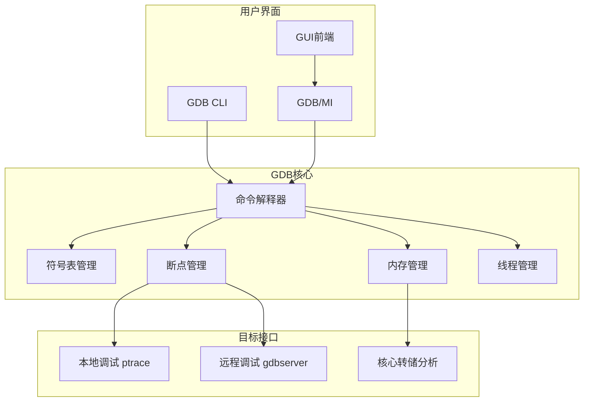
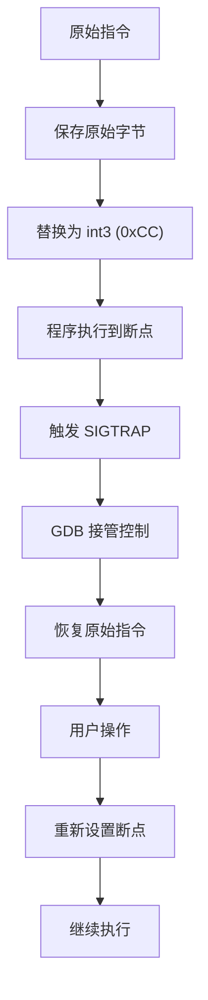
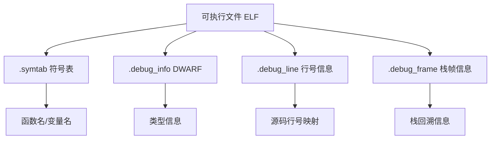

+++
title = "40.GDB调试器深度解析"
date = 2026-01-31
description = "GDB深度解析：调试原理、断点机制、多线程调试、核心转储分析、远程调试"
[taxonomies]
tags = ["Linux", "GDB", "调试", "断点", "核心转储"]
+++

# GDB 调试器深度解析

本文深入解析 GDB 调试器的工作原理，包括 ptrace 机制、断点实现、多线程调试、核心转储分析、远程调试等核心技术。

---

## 一、GDB 概述

### 1.1 什么是 GDB

**GDB（GNU Debugger）** 是 GNU 项目的标准调试器，支持：
- 断点调试（软件/硬件断点）
- 单步执行
- 变量查看和修改
- 调用栈分析
- 多线程/多进程调试
- 核心转储分析
- 远程调试

### 1.2 支持的语言和平台

| 语言 | 平台 |
|------|------|
| C/C++ | Linux、macOS、Windows |
| Rust | Linux、macOS |
| Go | Linux（有限支持） |
| Fortran | Linux |
| Assembly | 多平台 |

### 1.3 架构概览



---

## 二、工作原理

### 2.1 ptrace 机制

GDB 通过 **ptrace** 系统调用控制被调试进程：

```c
// GDB 核心操作
ptrace(PTRACE_ATTACH, pid, ...)    // 附加进程
ptrace(PTRACE_CONT, pid, ...)      // 继续执行
ptrace(PTRACE_SINGLESTEP, pid, ...)// 单步执行
ptrace(PTRACE_PEEKDATA, pid, addr) // 读取内存
ptrace(PTRACE_POKEDATA, pid, addr) // 写入内存
ptrace(PTRACE_GETREGS, pid, ...)   // 获取寄存器
ptrace(PTRACE_SETREGS, pid, ...)   // 设置寄存器
```

### 2.2 软件断点原理



**x86 软件断点**：

```
原始代码：
0x401000: 48 89 e5    mov rbp, rsp
0x401003: 48 83 ec 10 sub rsp, 0x10

设置断点后：
0x401000: CC          int3 (断点)
0x401001: 89 e5       (被截断的指令)
0x401003: 48 83 ec 10 sub rsp, 0x10

断点触发时：
1. CPU 执行 int3，产生异常
2. 内核发送 SIGTRAP 给进程
3. GDB 收到通知，暂停进程
4. GDB 恢复原始指令 (48 89 e5)
5. 用户检查/操作
6. 继续执行前，GDB 可能需要：
   - 单步执行原始指令
   - 重新设置断点
```

### 2.3 硬件断点原理

硬件断点使用 CPU 调试寄存器（x86 的 DR0-DR7）：

| 寄存器 | 功能 |
|--------|------|
| DR0-DR3 | 断点地址（最多 4 个） |
| DR6 | 调试状态 |
| DR7 | 调试控制（启用/类型/长度） |

```c
// 硬件断点类型
#define DR7_BREAK_ON_EXEC  0  // 执行断点
#define DR7_BREAK_ON_WRITE 1  // 写入断点
#define DR7_BREAK_ON_RW    3  // 读写断点

// 断点长度
#define DR7_LEN_1 0  // 1 字节
#define DR7_LEN_2 1  // 2 字节
#define DR7_LEN_4 3  // 4 字节
#define DR7_LEN_8 2  // 8 字节（x86_64）
```

**硬件断点优势**：
- 不修改代码，可用于 ROM
- 支持数据访问断点（watchpoint）
- 数量有限（x86 最多 4 个）

### 2.4 符号表解析



**编译选项**：

```bash
# 生成调试信息
gcc -g program.c -o program       # 默认 DWARF
gcc -g3 program.c -o program      # 包含宏定义
gcc -ggdb program.c -o program    # GDB 优化格式
gcc -gdwarf-4 program.c -o program # 指定 DWARF 版本

# 保留调试信息但优化
gcc -g -O2 program.c -o program   # 可能导致调试困难
```

---

## 三、基本使用

### 3.1 启动 GDB

```bash
# 调试可执行文件
gdb ./program

# 调试并传递参数
gdb --args ./program arg1 arg2

# 附加到运行中的进程
gdb -p <pid>
gdb attach <pid>

# 分析核心转储
gdb ./program core

# 批处理模式
gdb -batch -x commands.gdb ./program

# 安静模式
gdb -q ./program
```

### 3.2 核心命令

| 命令 | 简写 | 说明 |
|------|------|------|
| `run [args]` | `r` | 运行程序 |
| `start` | | 运行到 main 停止 |
| `continue` | `c` | 继续执行 |
| `next` | `n` | 单步（不进入函数） |
| `step` | `s` | 单步（进入函数） |
| `finish` | `fin` | 执行到函数返回 |
| `until [loc]` | `u` | 执行到指定位置 |
| `break [loc]` | `b` | 设置断点 |
| `delete [n]` | `d` | 删除断点 |
| `print expr` | `p` | 打印表达式 |
| `display expr` | `disp` | 每次停止时显示 |
| `backtrace` | `bt` | 显示调用栈 |
| `frame [n]` | `f` | 切换栈帧 |
| `info` | `i` | 显示信息 |
| `list` | `l` | 显示源码 |
| `quit` | `q` | 退出 GDB |

### 3.3 断点操作

```bash
# 按行号
(gdb) break main.c:42
(gdb) b 42                    # 当前文件

# 按函数名
(gdb) break main
(gdb) break MyClass::method

# 按地址
(gdb) break *0x401234

# 条件断点
(gdb) break main.c:42 if i > 100
(gdb) condition 1 i > 100     # 修改断点 1 的条件

# 临时断点（触发一次后删除）
(gdb) tbreak main

# 查看断点
(gdb) info breakpoints
(gdb) info b

# 禁用/启用断点
(gdb) disable 1
(gdb) enable 1

# 删除断点
(gdb) delete 1
(gdb) delete               # 删除所有
(gdb) clear main.c:42      # 按位置删除
```

### 3.4 变量查看

```bash
# 打印变量
(gdb) print variable
(gdb) p variable
(gdb) p/x variable         # 十六进制
(gdb) p/d variable         # 十进制
(gdb) p/t variable         # 二进制
(gdb) p/c variable         # 字符

# 打印表达式
(gdb) p a + b
(gdb) p *ptr
(gdb) p array[5]
(gdb) p struct.member

# 打印数组
(gdb) p *array@10          # 打印 10 个元素
(gdb) p array[0]@10

# 打印内存
(gdb) x/10x 0x401000       # 10 个十六进制字
(gdb) x/10i 0x401000       # 10 条指令
(gdb) x/s 0x401000         # 字符串
(gdb) x/10b ptr            # 10 字节

# x 命令格式: x/NFU addr
# N - 数量
# F - 格式 (x/d/u/o/t/a/c/f/s/i)
# U - 单位 (b/h/w/g = 1/2/4/8 字节)

# 自动显示
(gdb) display variable     # 每次停止时显示
(gdb) undisplay 1          # 取消
```

### 3.5 调用栈分析

```bash
# 显示调用栈
(gdb) backtrace
(gdb) bt
(gdb) bt full              # 包含局部变量
(gdb) bt 5                 # 最近 5 帧

# 切换栈帧
(gdb) frame 3
(gdb) up                   # 上一帧
(gdb) down                 # 下一帧

# 查看帧信息
(gdb) info frame
(gdb) info locals          # 局部变量
(gdb) info args            # 函数参数
```

---

## 四、多线程调试

### 4.1 线程命令

```bash
# 查看线程
(gdb) info threads

# 切换线程
(gdb) thread 2

# 对所有线程执行命令
(gdb) thread apply all bt
(gdb) thread apply all print variable

# 对特定线程执行
(gdb) thread apply 1 2 3 bt
```

### 4.2 调度锁定

```bash
# 查看当前模式
(gdb) show scheduler-locking

# 锁定模式
(gdb) set scheduler-locking on   # 只运行当前线程
(gdb) set scheduler-locking off  # 所有线程运行
(gdb) set scheduler-locking step # 单步时锁定
(gdb) set scheduler-locking replay # 回放时锁定
```

### 4.3 线程特定断点

```bash
# 只在特定线程触发
(gdb) break main.c:42 thread 2

# 断点触发时的线程信息
(gdb) info threads
  Id   Target Id         Frame
  1    Thread 0x7fff... "main" at main.c:50
* 2    Thread 0x7fff... "worker" at worker.c:42 (当前线程)
  3    Thread 0x7fff... "worker" at worker.c:35
```

### 4.4 死锁调试

```bash
# 1. 附加到卡住的进程
(gdb) attach <pid>

# 2. 查看所有线程状态
(gdb) thread apply all bt

# 3. 查找锁等待
# 通常可以看到 pthread_mutex_lock 或 futex
(gdb) thread apply all bt full | grep -A5 "mutex\|lock\|futex"

# 4. 检查锁变量
(gdb) p mutex
(gdb) p mutex.__data.__owner  # 锁持有者的 LWP ID
```

---

## 五、核心转储分析

### 5.1 配置核心转储

```bash
# 启用核心转储
ulimit -c unlimited

# 设置核心文件位置
echo "/tmp/core.%e.%p" | sudo tee /proc/sys/kernel/core_pattern

# 模式说明
# %e - 可执行文件名
# %p - PID
# %t - 时间戳
# %u - UID
# %g - GID
# %s - 信号号

# 检查配置
cat /proc/sys/kernel/core_pattern
```

### 5.2 分析核心转储

```bash
# 加载核心转储
gdb ./program core

# 或
gdb
(gdb) file ./program
(gdb) core-file core

# 基本分析
(gdb) bt                   # 崩溃时的调用栈
(gdb) bt full              # 包含变量
(gdb) info registers       # 寄存器状态
(gdb) x/i $pc              # 崩溃时的指令

# 查看崩溃原因
(gdb) info signals         # 信号信息
```

### 5.3 常见崩溃分析

**段错误（SIGSEGV）**：

```bash
(gdb) bt
#0  0x0000000000401234 in process_data (ptr=0x0) at main.c:42
#1  0x0000000000401567 in main () at main.c:78

(gdb) frame 0
(gdb) list
42        return ptr->data;   # 空指针解引用

(gdb) p ptr
$1 = (struct data *) 0x0
```

**栈溢出**：

```bash
(gdb) bt
#0  recursive_func () at main.c:10
#1  recursive_func () at main.c:15
#2  recursive_func () at main.c:15
... (重复数千次)
```

**堆损坏**：

```bash
(gdb) bt
#0  __GI_raise (sig=sig@entry=6) at ../sysdeps/unix/sysv/linux/raise.c:50
#1  __GI_abort () at abort.c:79
#2  __libc_message () at ../sysdeps/posix/libc_fatal.c:155
#3  malloc_printerr () at malloc.c:5347
#4  _int_free (av=0x7ffff7dd1b80, p=0x555555756260, have_lock=0) at malloc.c:4173
```

---

## 六、远程调试

### 6.1 gdbserver

```bash
# 目标机器上启动 gdbserver
gdbserver :1234 ./program              # 监听端口
gdbserver :1234 --attach <pid>         # 附加进程

# 主机上连接
gdb ./program
(gdb) target remote 192.168.1.100:1234
(gdb) continue
```

### 6.2 通过串口调试

```bash
# 目标机器
gdbserver /dev/ttyS0 ./program

# 主机
gdb ./program
(gdb) target remote /dev/ttyUSB0
```

### 6.3 嵌入式调试

```bash
# OpenOCD + GDB
openocd -f board/stm32f4discovery.cfg &

gdb-multiarch ./firmware.elf
(gdb) target extended-remote :3333
(gdb) monitor reset halt
(gdb) load
(gdb) continue
```

---

## 七、高级技巧

### 7.1 反向调试

```bash
# 开启记录
(gdb) target record-full
(gdb) run

# 反向执行
(gdb) reverse-continue   # 反向继续
(gdb) reverse-step       # 反向单步
(gdb) reverse-next       # 反向 next
(gdb) reverse-finish     # 反向到函数入口

# 设置反向断点
(gdb) break main.c:42
(gdb) reverse-continue   # 反向执行到断点
```

### 7.2 自动化脚本

**.gdbinit 文件**：

```bash
# ~/.gdbinit - 全局配置
set history save on
set history size 10000
set print pretty on
set print array on
set pagination off

# 自定义命令
define pstruct
  print *($arg0)
end

# 断点命令
break main
commands
  silent
  printf "Entered main\n"
  continue
end
```

**Python 脚本**：

```python
# my_commands.py
import gdb

class PrintStructCommand(gdb.Command):
    def __init__(self):
        super().__init__("ps", gdb.COMMAND_USER)
    
    def invoke(self, arg, from_tty):
        val = gdb.parse_and_eval(arg)
        print(val.dereference())

PrintStructCommand()

# 加载: (gdb) source my_commands.py
```

### 7.3 观察点（Watchpoint）

```bash
# 写入观察点
(gdb) watch variable        # 变量被写入时停止
(gdb) watch *0x601040       # 地址被写入时停止

# 读取观察点
(gdb) rwatch variable       # 变量被读取时停止

# 访问观察点
(gdb) awatch variable       # 读取或写入时停止

# 条件观察点
(gdb) watch variable if variable > 100

# 查看观察点
(gdb) info watchpoints
```

### 7.4 捕获点（Catchpoint）

```bash
# 捕获系统调用
(gdb) catch syscall write
(gdb) catch syscall 1       # 按号码

# 捕获异常
(gdb) catch throw           # C++ 异常抛出
(gdb) catch catch           # C++ 异常捕获

# 捕获信号
(gdb) catch signal SIGSEGV

# 捕获 fork/exec
(gdb) catch fork
(gdb) catch exec

# 查看捕获点
(gdb) info catchpoints
```

### 7.5 Pretty Printer

```bash
# 查看可用的 pretty printer
(gdb) info pretty-printer

# STL 容器自动格式化
(gdb) p my_vector
$1 = std::vector of length 3, capacity 4 = {1, 2, 3}

(gdb) p my_map
$2 = std::map with 2 elements = {
  ["key1"] = "value1",
  ["key2"] = "value2"
}

# 禁用 pretty printer
(gdb) disable pretty-printer
```

---

## 八、常用 info 命令

```bash
# 程序信息
(gdb) info files            # 文件和段
(gdb) info functions        # 所有函数
(gdb) info variables        # 全局变量
(gdb) info sources          # 源文件列表
(gdb) info types            # 类型定义

# 运行时信息
(gdb) info registers        # 寄存器
(gdb) info all-registers    # 所有寄存器
(gdb) info frame            # 当前栈帧
(gdb) info stack            # 栈信息
(gdb) info threads          # 线程列表

# 断点信息
(gdb) info breakpoints      # 断点列表
(gdb) info watchpoints      # 观察点
(gdb) info catchpoints      # 捕获点

# 内存信息
(gdb) info proc mappings    # 内存映射
(gdb) info sharedlibrary    # 共享库
```

---

## 九、与 IDE 集成

### 9.1 VS Code

```json
// launch.json
{
    "version": "0.2.0",
    "configurations": [
        {
            "name": "GDB Debug",
            "type": "cppdbg",
            "request": "launch",
            "program": "${workspaceFolder}/program",
            "args": [],
            "cwd": "${workspaceFolder}",
            "MIMode": "gdb",
            "setupCommands": [
                {
                    "text": "-enable-pretty-printing"
                }
            ]
        }
    ]
}
```

### 9.2 Emacs (GUD)

```elisp
M-x gdb
Run gdb (like this): gdb -i=mi ./program
```

### 9.3 其他前端

| 前端 | 说明 |
|------|------|
| **cgdb** | 基于 curses 的界面 |
| **gdbgui** | Web 界面 |
| **DDD** | 图形化界面 |
| **CLion** | JetBrains IDE |
| **Eclipse CDT** | Eclipse 插件 |

---

## 十、与其他调试器对比

| 特性 | GDB | LLDB | WinDbg |
|------|-----|------|--------|
| 平台 | Linux/Unix | macOS/Linux | Windows |
| 支持语言 | C/C++/Rust/Go | C/C++/Swift | C/C++/.NET |
| 脚本 | Python/Guile | Python | JavaScript |
| 远程调试 | gdbserver | lldb-server | - |
| 反向调试 | ✅ | ❌ | ✅ |
| 学习曲线 | 高 | 中 | 高 |

---

## 十一、高频考点总结

| 考点 | 频率 | 关键知识 |
|------|------|----------|
| 断点原理 | ★★★ | int3、ptrace、软件/硬件断点 |
| 基本命令 | ★★★ | break、run、next、step、print、bt |
| 多线程调试 | ★★★ | thread、scheduler-locking |
| 核心转储 | ★★★ | ulimit、core_pattern、分析流程 |
| 观察点 | ★★☆ | watch、rwatch、awatch |
| 远程调试 | ★★☆ | gdbserver、target remote |
| 反向调试 | ★☆☆ | record、reverse-* |

---

## 相关文章

- [上一篇：strace系统调用追踪深度解析](/articles/linux/linux-39-strace系统调用追踪深度解析/)
- [Valgrind内存分析工具深度解析](/articles/linux/linux-38-Valgrind内存分析工具深度解析/)
- [perf性能分析工具深度解析](/articles/linux/linux-37-perf性能分析工具深度解析/)
