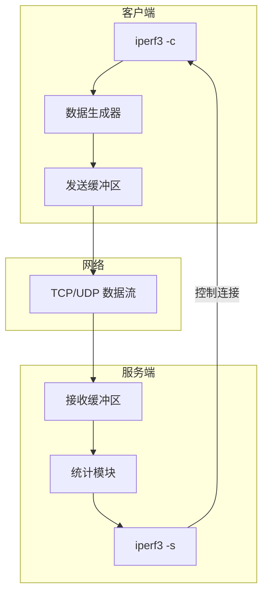
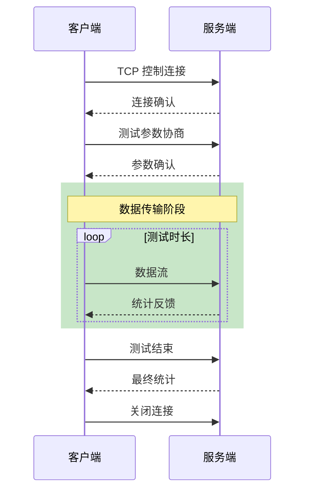

+++
title = "41. iperf3网络带宽测试深度解析"
date = 2026-01-31
weight = 41000
description = "iperf3深度解析：网络带宽测试原理、TCP/UDP测试、多流并发、性能调优"
[taxonomies]
tags = ["Linux", "iperf3", "网络", "带宽测试", "性能"]
+++

# iperf3 网络带宽测试深度解析

本文深入解析 iperf3 网络带宽测试工具的工作原理，包括 TCP/UDP 测试、多流并发、性能调优、故障排查等核心技术。

---

## 一、iperf3 概述

### 1.1 什么是 iperf3

**iperf3** 是一个网络带宽测量工具，用于：
- 测量最大 TCP/UDP 带宽
- 测试网络吞吐量
- 检测网络瓶颈
- 验证 QoS 配置

### 1.2 iperf3 vs iperf2

| 特性 | iperf3 | iperf2 |
|------|--------|--------|
| 代码库 | 全新重写 | 原始代码 |
| 多线程 | 单进程多流 | 多进程 |
| JSON 输出 | ✅ | ❌ |
| 并发客户端 | ❌（单客户端） | ✅ |
| 双向测试 | ✅ | ✅ |
| 维护状态 | 活跃 | 活跃 |
| 兼容性 | 不兼容 iperf2 | - |

### 1.3 架构原理



---

## 二、工作原理

### 2.1 测试流程



### 2.2 TCP 测试原理

```
带宽计算:
带宽 = 传输数据量 / 传输时间

TCP 测量考虑因素:
1. 窗口大小 - 决定在途数据量
2. RTT - 往返时延
3. 丢包率 - 触发重传
4. 拥塞控制算法 - BBR、Cubic 等

理论最大带宽 (BDP):
带宽 = 窗口大小 / RTT

示例:
窗口 = 64KB, RTT = 10ms
带宽 = 64KB / 10ms = 6.4MB/s ≈ 51.2 Mbps
```

### 2.3 UDP 测试原理

```
UDP 测试与 TCP 不同:
- 无拥塞控制
- 客户端指定发送速率
- 测量丢包率和抖动

关键指标:
- 带宽: 实际接收的数据速率
- 丢包率: 丢失包数 / 总发送包数
- 抖动: 包到达时间的变化
```

---

## 三、基本使用

### 3.1 安装

```bash
# Debian/Ubuntu
sudo apt install iperf3

# CentOS/RHEL
sudo yum install iperf3

# macOS
brew install iperf3

# 从源码编译
git clone https://github.com/esnet/iperf.git
cd iperf
./configure && make && sudo make install
```

### 3.2 基本测试

```bash
# 服务端
iperf3 -s

# 客户端（默认 TCP，10 秒）
iperf3 -c 192.168.1.100

# 指定端口
iperf3 -s -p 5201
iperf3 -c 192.168.1.100 -p 5201

# 指定时长
iperf3 -c 192.168.1.100 -t 30    # 30 秒

# 指定传输数据量
iperf3 -c 192.168.1.100 -n 1G    # 传输 1GB
```

### 3.3 常用选项

| 选项 | 说明 | 示例 |
|------|------|------|
| `-s` | 服务端模式 | `iperf3 -s` |
| `-c host` | 客户端模式 | `iperf3 -c 1.2.3.4` |
| `-p port` | 端口号 | `-p 5201` |
| `-t secs` | 测试时长 | `-t 60` |
| `-n bytes` | 传输数据量 | `-n 1G` |
| `-P streams` | 并行流数 | `-P 4` |
| `-R` | 反向测试 | `-R` |
| `-u` | UDP 模式 | `-u` |
| `-b rate` | 目标带宽（UDP） | `-b 1G` |
| `-w size` | 窗口大小 | `-w 256K` |
| `-M mss` | MSS 大小 | `-M 1460` |
| `-J` | JSON 输出 | `-J` |
| `-i secs` | 报告间隔 | `-i 1` |
| `-V` | 详细输出 | `-V` |

---

## 四、TCP 测试详解

### 4.1 基本 TCP 测试

```bash
# 服务端
$ iperf3 -s

# 客户端
$ iperf3 -c 192.168.1.100
Connecting to host 192.168.1.100, port 5201
[  5] local 192.168.1.1 port 45678 connected to 192.168.1.100 port 5201
[ ID] Interval           Transfer     Bitrate         Retr  Cwnd
[  5]   0.00-1.00   sec   112 MBytes   940 Mbits/sec    0   256 KBytes
[  5]   1.00-2.00   sec   112 MBytes   941 Mbits/sec    0   256 KBytes
...
[  5]   9.00-10.00  sec   112 MBytes   940 Mbits/sec    0   256 KBytes
- - - - - - - - - - - - - - - - - - - - - - - - -
[ ID] Interval           Transfer     Bitrate         Retr
[  5]   0.00-10.00  sec  1.09 GBytes   940 Mbits/sec    0             sender
[  5]   0.00-10.04  sec  1.09 GBytes   936 Mbits/sec                  receiver
```

### 4.2 多流并发

```bash
# 4 个并行流
$ iperf3 -c 192.168.1.100 -P 4

# 输出
[  5]   0.00-10.00  sec   280 MBytes   235 Mbits/sec    0             sender
[  7]   0.00-10.00  sec   280 MBytes   235 Mbits/sec    0             sender
[  9]   0.00-10.00  sec   280 MBytes   235 Mbits/sec    0             sender
[ 11]   0.00-10.00  sec   280 MBytes   235 Mbits/sec    0             sender
[SUM]   0.00-10.00  sec  1.09 GBytes   940 Mbits/sec    0             sender
```

### 4.3 双向测试

```bash
# 反向测试（服务端 -> 客户端）
iperf3 -c 192.168.1.100 -R

# 双向同时测试
iperf3 -c 192.168.1.100 --bidir
```

### 4.4 窗口大小调优

```bash
# 指定窗口大小
iperf3 -c 192.168.1.100 -w 512K

# 自动调优
iperf3 -c 192.168.1.100  # 使用系统默认

# 查看实际窗口大小（详细模式）
iperf3 -c 192.168.1.100 -V
```

**窗口大小计算**：

```
推荐窗口大小 = 带宽 × RTT (BDP)

示例：
目标带宽: 1 Gbps
RTT: 50 ms
BDP = 1 Gbps × 50 ms = 1000 Mbit/s × 0.05s = 50 Mbit = 6.25 MB

建议窗口: -w 8M
```

---

## 五、UDP 测试详解

### 5.1 基本 UDP 测试

```bash
# 服务端
$ iperf3 -s

# 客户端（指定目标带宽）
$ iperf3 -c 192.168.1.100 -u -b 100M

# 输出
[ ID] Interval           Transfer     Bitrate         Jitter    Lost/Total Datagrams
[  5]   0.00-1.00   sec  11.9 MBytes   100 Mbits/sec  0.045 ms  0/8547 (0%)
[  5]   1.00-2.00   sec  11.9 MBytes   100 Mbits/sec  0.032 ms  0/8548 (0%)
...
- - - - - - - - - - - - - - - - - - - - - - - - -
[ ID] Interval           Transfer     Bitrate         Jitter    Lost/Total Datagrams
[  5]   0.00-10.00  sec   119 MBytes   100 Mbits/sec  0.028 ms  0/85480 (0%)  sender
[  5]   0.00-10.04  sec   119 MBytes   99.8 Mbits/sec  0.028 ms  0/85480 (0%)  receiver
```

### 5.2 关键指标

| 指标 | 说明 | 理想值 |
|------|------|--------|
| **Bitrate** | 实际带宽 | 接近目标带宽 |
| **Jitter** | 抖动（延迟变化） | <1ms（VoIP） |
| **Lost** | 丢包数/比例 | 0%（理想），<1%（可接受） |

### 5.3 不同带宽测试

```bash
# 测试最大 UDP 带宽
iperf3 -c 192.168.1.100 -u -b 0    # 不限速

# 逐步增加带宽找拐点
for bw in 100M 200M 500M 1G; do
    echo "Testing $bw"
    iperf3 -c 192.168.1.100 -u -b $bw -t 5
done
```

### 5.4 数据包大小测试

```bash
# 默认包大小
iperf3 -c 192.168.1.100 -u -b 100M

# 指定包大小
iperf3 -c 192.168.1.100 -u -b 100M -l 64     # 64 字节
iperf3 -c 192.168.1.100 -u -b 100M -l 1400   # 1400 字节
```

---

## 六、高级用法

### 6.1 JSON 输出

```bash
# 输出 JSON
iperf3 -c 192.168.1.100 -J

# 保存到文件
iperf3 -c 192.168.1.100 -J > result.json

# 解析示例
cat result.json | jq '.end.sum_sent.bits_per_second / 1000000'
```

### 6.2 绑定特定接口

```bash
# 服务端绑定接口
iperf3 -s -B 192.168.1.100

# 客户端绑定源地址
iperf3 -c 192.168.1.100 -B 10.0.0.1
```

### 6.3 设置 DSCP/ToS

```bash
# 设置 ToS（用于 QoS 测试）
iperf3 -c 192.168.1.100 -S 0xC0    # CS6 (Network Control)
iperf3 -c 192.168.1.100 -S 0xB8    # EF (Expedited Forwarding)
```

### 6.4 零拷贝模式

```bash
# 使用 sendfile（减少 CPU 开销）
iperf3 -c 192.168.1.100 -Z

# 特别适用于 10G+ 网络
```

### 6.5 后台服务

```bash
# 守护进程模式
iperf3 -s -D

# 指定日志文件
iperf3 -s -D --logfile /var/log/iperf3.log

# 停止守护进程
pkill iperf3
```

### 6.6 systemd 服务

```ini
# /etc/systemd/system/iperf3.service
[Unit]
Description=iperf3 server
After=network.target

[Service]
Type=simple
ExecStart=/usr/bin/iperf3 -s
Restart=on-failure

[Install]
WantedBy=multi-user.target
```

```bash
sudo systemctl enable iperf3
sudo systemctl start iperf3
```

---

## 七、性能调优

### 7.1 系统参数调优

```bash
# 查看当前参数
sysctl net.core.rmem_max
sysctl net.core.wmem_max
sysctl net.ipv4.tcp_rmem
sysctl net.ipv4.tcp_wmem

# 优化高速网络
sudo sysctl -w net.core.rmem_max=67108864
sudo sysctl -w net.core.wmem_max=67108864
sudo sysctl -w net.ipv4.tcp_rmem="4096 87380 67108864"
sudo sysctl -w net.ipv4.tcp_wmem="4096 65536 67108864"
sudo sysctl -w net.ipv4.tcp_mtu_probing=1
```

### 7.2 CPU 绑定

```bash
# 绑定到特定 CPU
taskset -c 0 iperf3 -s
taskset -c 1 iperf3 -c 192.168.1.100

# 配合中断亲和性
echo 1 > /proc/irq/<irq_num>/smp_affinity
```

### 7.3 拥塞控制算法

```bash
# 查看当前算法
sysctl net.ipv4.tcp_congestion_control

# 使用 BBR
sudo sysctl -w net.ipv4.tcp_congestion_control=bbr

# iperf3 测试
iperf3 -c 192.168.1.100 -C bbr     # 指定算法
```

### 7.4 多队列网卡优化

```bash
# 查看网卡队列
ethtool -l eth0

# 设置队列数
ethtool -L eth0 combined 8

# 配合 RSS
ethtool -X eth0 equal 8
```

---

## 八、故障排查

### 8.1 常见问题

| 问题 | 可能原因 | 解决方法 |
|------|----------|----------|
| 带宽远低于预期 | 窗口太小 | 增大 `-w` |
| 带宽波动大 | 丢包重传 | 检查链路质量 |
| UDP 丢包高 | 发送速率过高 | 降低 `-b` |
| 连接失败 | 防火墙阻止 | 开放端口 5201 |
| 客户端报错 | 服务端忙 | 等待或重启服务端 |

### 8.2 诊断脚本

```bash
#!/bin/bash
# iperf3_diag.sh - 网络诊断

SERVER=$1
PORT=${2:-5201}

echo "=== Network Diagnostics ==="

# 1. Ping 测试
echo "--- Ping Test ---"
ping -c 5 $SERVER

# 2. MTU 检测
echo "--- MTU Discovery ---"
ping -M do -s 1472 -c 1 $SERVER 2>&1

# 3. 路由追踪
echo "--- Traceroute ---"
traceroute -n $SERVER

# 4. TCP 测试
echo "--- TCP Test ---"
iperf3 -c $SERVER -p $PORT -t 10

# 5. UDP 测试
echo "--- UDP Test ---"
iperf3 -c $SERVER -p $PORT -u -b 100M -t 10

# 6. 反向测试
echo "--- Reverse Test ---"
iperf3 -c $SERVER -p $PORT -R -t 10

echo "=== Done ==="
```

### 8.3 长期监控

```bash
#!/bin/bash
# iperf3_monitor.sh - 持续监控

SERVER=$1
INTERVAL=${2:-300}  # 5 分钟
LOGFILE=${3:-/var/log/iperf3_monitor.log}

while true; do
    timestamp=$(date '+%Y-%m-%d %H:%M:%S')
    result=$(iperf3 -c $SERVER -t 10 -J 2>/dev/null)
    
    if [ $? -eq 0 ]; then
        bps=$(echo $result | jq '.end.sum_sent.bits_per_second')
        mbps=$(echo "scale=2; $bps / 1000000" | bc)
        echo "$timestamp: ${mbps} Mbps" >> $LOGFILE
    else
        echo "$timestamp: FAILED" >> $LOGFILE
    fi
    
    sleep $INTERVAL
done
```

---

## 九、与同类工具对比

| 特性 | iperf3 | iperf2 | netperf | nuttcp |
|------|--------|--------|---------|--------|
| 维护状态 | 活跃 | 活跃 | 不活跃 | 活跃 |
| 多客户端 | ❌ | ✅ | ✅ | ✅ |
| JSON 输出 | ✅ | ❌ | ❌ | ❌ |
| TCP 测试 | ✅ | ✅ | ✅ | ✅ |
| UDP 测试 | ✅ | ✅ | ✅ | ✅ |
| 多播测试 | ❌ | ✅ | ✅ | ❌ |
| 学习曲线 | 低 | 低 | 中 | 低 |

### 9.1 何时使用 iperf3

✅ **适合场景**：
- 点对点带宽测试
- 自动化脚本（JSON 输出）
- 简单快速测试

❌ **不适合场景**：
- 多客户端并发测试（用 iperf2）
- 复杂网络模拟（用 netperf）

---

## 十、实战示例

### 10.1 测试 10G 链路

```bash
# 服务端优化
sudo sysctl -w net.core.rmem_max=134217728
sudo sysctl -w net.core.wmem_max=134217728
iperf3 -s

# 客户端测试
iperf3 -c 192.168.1.100 -P 4 -w 4M -t 30 -Z

# 期望结果: ~9.4 Gbps (考虑协议开销)
```

### 10.2 测试 WAN 链路

```bash
# 高延迟链路，增大窗口
# 假设 RTT 100ms, 目标 100Mbps
# BDP = 100Mbps × 0.1s = 10Mbit = 1.25MB

iperf3 -c remote.server.com -w 2M -t 60

# 多流测试
iperf3 -c remote.server.com -P 4 -t 60
```

### 10.3 VoIP 质量测试

```bash
# 模拟 VoIP 流量（G.711 编解码）
# 带宽: 64 kbps, 包大小: 160 字节, 间隔: 20ms

iperf3 -c 192.168.1.100 -u -b 64K -l 160 -t 60

# 检查:
# - 丢包率 < 1%
# - 抖动 < 30ms
```

---

## 十一、高频考点总结

| 考点 | 频率 | 关键知识 |
|------|------|----------|
| 基本用法 | ★★★ | -s、-c、-t、-P |
| TCP vs UDP | ★★★ | 测试原理差异 |
| 窗口大小 | ★★☆ | BDP 计算、-w 参数 |
| 多流测试 | ★★☆ | -P 参数、聚合带宽 |
| UDP 指标 | ★★☆ | 带宽、丢包率、抖动 |
| 性能调优 | ★★☆ | 系统参数、CPU 绑定 |
| JSON 输出 | ★☆☆ | -J、自动化处理 |

---

## 相关文章

- [上一篇：GDB调试器深度解析](@/articles/linux/linux-40-GDB调试器深度解析.md)
- [网络性能分析与调优](@/articles/networking/net-11-网络性能分析与调优.md)
