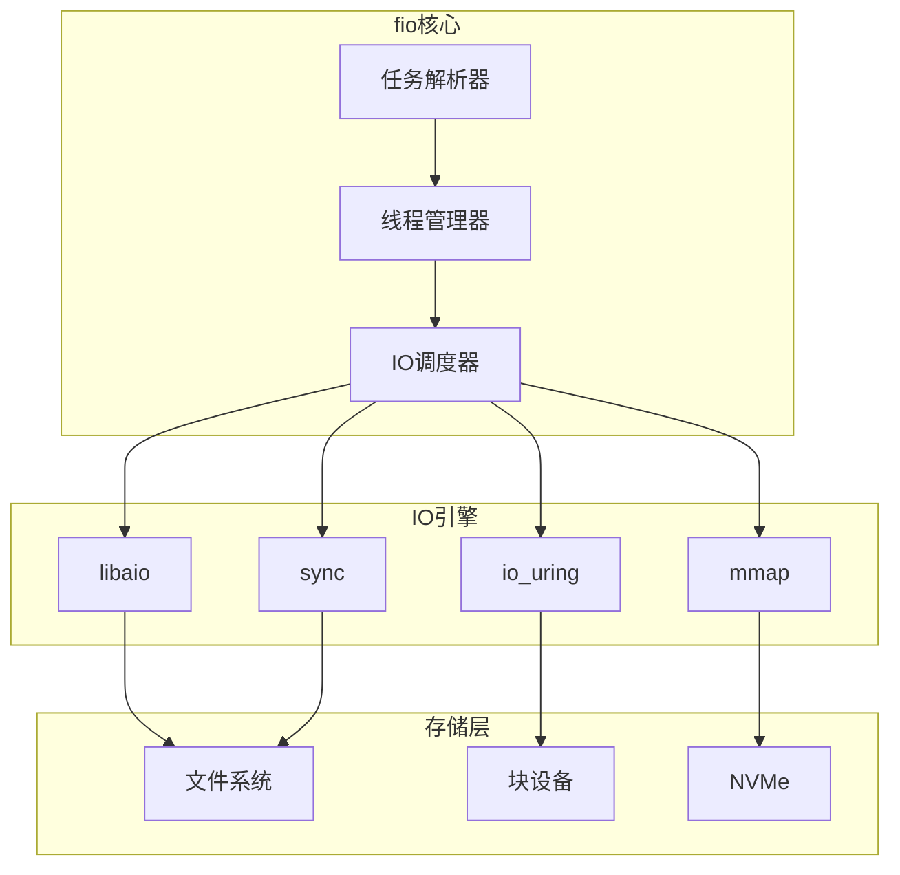
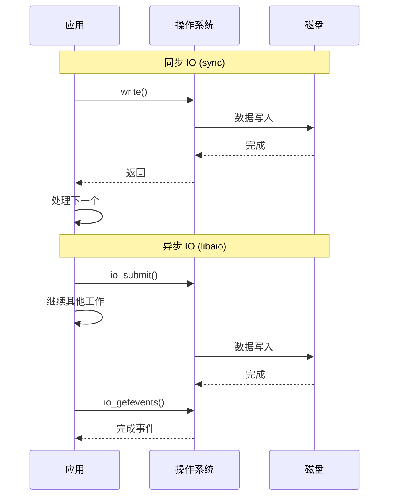

+++
title = "42.fio磁盘IO性能测试深度解析"
date = 2026-01-31
description = "fio深度解析：磁盘IO测试原理、IO模式、异步引擎、性能分析"
[taxonomies]
tags = ["Linux", "fio", "IO", "磁盘", "性能测试"]
+++

# fio 磁盘 IO 性能测试深度解析

本文深入解析 fio（Flexible I/O Tester）工具的工作原理，包括 IO 测试模式、异步引擎、性能指标分析、实战调优等核心技术。

---

## 一、fio 概述

### 1.1 什么是 fio

**fio** 是一个灵活的 I/O 负载生成器，用于：
- 测试存储设备性能
- 模拟真实 I/O 工作负载
- 验证存储系统配置
- 基准测试和性能对比

### 1.2 核心特性

| 特性 | 说明 |
|------|------|
| 多种 IO 引擎 | libaio、io_uring、sync、mmap 等 |
| 灵活的负载模式 | 顺序、随机、混合读写 |
| 多线程/进程 | 并发测试 |
| 精确控制 | 块大小、队列深度、速率限制 |
| 丰富的输出 | IOPS、带宽、延迟分布 |

### 1.3 架构概览



---

## 二、工作原理

### 2.1 IO 引擎对比

| 引擎 | 类型 | 特点 | 适用场景 |
|------|------|------|----------|
| **sync** | 同步 | 简单，每次一个 IO | 基础测试 |
| **psync** | 同步 | pread/pwrite | 文件 IO |
| **libaio** | 异步 | Linux AIO | 高性能块设备 |
| **io_uring** | 异步 | 最新接口 | 最高性能 |
| **mmap** | 内存映射 | 通过 mmap | 特定场景 |
| **posixaio** | 异步 | POSIX AIO | 可移植 |

### 2.2 同步 vs 异步 IO



### 2.3 队列深度（iodepth）

```
队列深度 = 同时在途的 IO 请求数

同步 IO: 队列深度固定为 1
异步 IO: 可配置多个并发请求

示例:
iodepth=1:  [IO1] → 完成 → [IO2] → 完成 → [IO3]
iodepth=32: [IO1,IO2,...IO32] → 批量完成 → [下一批]

更高的队列深度:
- 更好地利用 SSD/NVMe 并行能力
- 可能增加延迟
- 受设备能力限制
```

### 2.4 延迟计算

```
延迟指标:
- slat: 提交延迟（应用到内核）
- clat: 完成延迟（提交到完成）
- lat:  总延迟（slat + clat）

对于同步 IO: slat ≈ 0, lat ≈ clat
对于异步 IO: lat = slat + clat

延迟分布:
- avg: 平均值
- stdev: 标准差
- min/max: 最小/最大
- 百分位: p50, p99, p99.9
```

---

## 三、基本使用

### 3.1 安装

```bash
# Debian/Ubuntu
sudo apt install fio

# CentOS/RHEL
sudo yum install fio

# 从源码编译
git clone https://github.com/axboe/fio.git
cd fio
./configure && make && sudo make install
```

### 3.2 命令行测试

```bash
# 顺序写测试
fio --name=seqwrite --ioengine=libaio --direct=1 \
    --bs=1m --iodepth=32 --rw=write \
    --size=1g --numjobs=1 --runtime=60

# 随机读测试
fio --name=randread --ioengine=libaio --direct=1 \
    --bs=4k --iodepth=64 --rw=randread \
    --size=1g --numjobs=4 --runtime=60

# 混合读写
fio --name=randrw --ioengine=libaio --direct=1 \
    --bs=4k --iodepth=32 --rw=randrw --rwmixread=70 \
    --size=1g --numjobs=4 --runtime=60
```

### 3.3 常用选项

| 选项 | 说明 | 示例 |
|------|------|------|
| `--name` | 任务名称 | `--name=test` |
| `--ioengine` | IO 引擎 | `--ioengine=libaio` |
| `--direct` | 绕过缓存 | `--direct=1` |
| `--bs` | 块大小 | `--bs=4k` |
| `--iodepth` | 队列深度 | `--iodepth=32` |
| `--rw` | 读写模式 | `--rw=randread` |
| `--size` | 文件大小 | `--size=10g` |
| `--numjobs` | 并发任务数 | `--numjobs=4` |
| `--runtime` | 运行时长 | `--runtime=60` |
| `--filename` | 测试文件/设备 | `--filename=/dev/sdb` |
| `--group_reporting` | 合并报告 | `--group_reporting` |

### 3.4 读写模式

| 模式 | 说明 |
|------|------|
| `read` | 顺序读 |
| `write` | 顺序写 |
| `randread` | 随机读 |
| `randwrite` | 随机写 |
| `rw` / `readwrite` | 顺序混合读写 |
| `randrw` | 随机混合读写 |
| `trim` | Trim 操作 |

---

## 四、配置文件

### 4.1 基本格式

```ini
; fio 配置文件: test.fio
[global]
ioengine=libaio
direct=1
bs=4k
size=1g
runtime=60
time_based
group_reporting

[random-read]
rw=randread
iodepth=32
numjobs=4

[random-write]
rw=randwrite
iodepth=32
numjobs=4
```

```bash
# 运行配置文件
fio test.fio
```

### 4.2 多任务配置

```ini
[global]
ioengine=libaio
direct=1
size=1g
runtime=60

; 4K 随机读
[4k-randread]
bs=4k
rw=randread
iodepth=64

; 128K 顺序写
[128k-seqwrite]
bs=128k
rw=write
iodepth=32

; 混合负载
[mixed]
bs=8k
rw=randrw
rwmixread=70
iodepth=32
```

### 4.3 SSD 测试配置

```ini
; ssd-test.fio - SSD 全面测试
[global]
ioengine=libaio
direct=1
filename=/dev/nvme0n1
time_based
runtime=60
group_reporting
stonewall

; 4K 随机读 - IOPS 测试
[4k-randread]
bs=4k
rw=randread
iodepth=256
numjobs=4

; 4K 随机写 - IOPS 测试
[4k-randwrite]
bs=4k
rw=randwrite
iodepth=256
numjobs=4

; 128K 顺序读 - 带宽测试
[128k-seqread]
bs=128k
rw=read
iodepth=32
numjobs=1

; 128K 顺序写 - 带宽测试
[128k-seqwrite]
bs=128k
rw=write
iodepth=32
numjobs=1

; 4K 混合读写 70/30
[4k-randrw]
bs=4k
rw=randrw
rwmixread=70
iodepth=64
numjobs=4
```

---

## 五、输出解读

### 5.1 基本输出

```bash
$ fio --name=test --ioengine=libaio --direct=1 --bs=4k --iodepth=32 \
      --rw=randread --size=1g --numjobs=1

test: (g=0): rw=randread, bs=(R) 4096B-4096B, (W) 4096B-4096B, (T) 4096B-4096B, ioengine=libaio, iodepth=32
fio-3.28
Starting 1 process
Jobs: 1 (f=1): [r(1)][100.0%][r=156MiB/s][r=40.0k IOPS][eta 00m:00s]
test: (groupid=0, jobs=1): err= 0: pid=12345: Wed Jan 31 10:00:00 2026
  read: IOPS=40.0k, BW=156MiB/s (164MB/s)(1024MiB/6548msec)
    slat (nsec): min=1200, max=45678, avg=2345.67, stdev=1234.56
    clat (usec): min=123, max=4567, avg=789.12, stdev=234.56
     lat (usec): min=125, max=4570, avg=791.45, stdev=235.12
    clat percentiles (usec):
     |  1.00th=[  253],  5.00th=[  334], 10.00th=[  392], 20.00th=[  478],
     | 30.00th=[  553], 40.00th=[  635], 50.00th=[  725], 60.00th=[  824],
     | 70.00th=[  938], 80.00th=[ 1074], 90.00th=[ 1287], 95.00th=[ 1500],
     | 99.00th=[ 2040], 99.50th=[ 2311], 99.90th=[ 3032], 99.95th=[ 3392],
     | 99.99th=[ 4228]
   bw (  KiB/s): min=148520, max=165432, per=100.00%, avg=159876.54, stdev=4321.12
   iops        : min=37130, max=41358, avg=39969.14, stdev=1080.28
  lat (usec)   : 250=0.95%, 500=22.15%, 750=29.87%, 1000=21.03%
  lat (msec)   : 2=24.89%, 4=1.08%, 10=0.03%
  cpu          : usr=5.23%, sys=12.45%, ctx=262144, majf=0, minf=45
  IO depths    : 1=0.1%, 2=0.1%, 4=0.1%, 8=0.1%, 16=0.1%, 32=99.6%, >=64=0.0%
     submit    : 0=0.0%, 4=100.0%, 8=0.0%, 16=0.0%, 32=0.0%, 64=0.0%, >=64=0.0%
     complete  : 0=0.0%, 4=99.9%, 8=0.0%, 16=0.0%, 32=0.1%, 64=0.0%, >=64=0.0%
     issued rwts: total=262144,0,0,0 short=0,0,0,0 dropped=0,0,0,0
     latency   : target=0, window=0, percentile=100.00%, depth=32

Run status group 0 (all jobs):
   READ: bw=156MiB/s (164MB/s), 156MiB/s-156MiB/s (164MB/s-164MB/s), io=1024MiB (1074MB), run=6548-6548msec

Disk stats (read/write):
  nvme0n1: ios=261234/0, merge=0/0, ticks=205678/0, in_queue=205678, util=99.12%
```

### 5.2 关键指标解读

| 指标 | 说明 | 关注点 |
|------|------|--------|
| **IOPS** | 每秒 IO 操作数 | 随机小块 IO 性能 |
| **BW** | 带宽 | 顺序大块 IO 性能 |
| **slat** | 提交延迟 | 内核开销 |
| **clat** | 完成延迟 | 设备响应时间 |
| **lat** | 总延迟 | 应用感知延迟 |
| **clat percentiles** | 延迟分布 | 尾延迟（p99, p99.9） |
| **cpu** | CPU 使用率 | usr+sys 不应过高 |
| **IO depths** | 队列深度分布 | 是否达到目标深度 |
| **util** | 设备利用率 | 是否达到 100% |

### 5.3 JSON 输出

```bash
# JSON 输出
fio --output-format=json test.fio > result.json

# JSON+ 格式（包含更多细节）
fio --output-format=json+ test.fio > result.json

# 解析示例
cat result.json | jq '.jobs[0].read.iops'
cat result.json | jq '.jobs[0].read.clat_ns.percentile["99.000000"]'
```

---

## 六、高级用法

### 6.1 io_uring 引擎

```bash
# 使用 io_uring（Linux 5.1+）
fio --name=test --ioengine=io_uring --direct=1 \
    --bs=4k --iodepth=128 --rw=randread \
    --size=1g --numjobs=4

# io_uring 特有选项
fio --name=test --ioengine=io_uring --direct=1 \
    --hipri=1 --fixedbufs=1 --registerfiles=1 \
    --sqthread_poll=1 \
    --bs=4k --iodepth=128 --rw=randread
```

### 6.2 延迟目标（latency_target）

```bash
# 找到满足延迟目标的最大 IOPS
fio --name=test --ioengine=libaio --direct=1 \
    --bs=4k --iodepth=64 --rw=randread \
    --size=1g --latency_target=1000 --latency_window=5s \
    --latency_percentile=99
```

### 6.3 速率限制

```bash
# 限制 IOPS
fio --name=test --ioengine=libaio --direct=1 \
    --bs=4k --rw=randread --rate_iops=10000 \
    --size=1g --runtime=60

# 限制带宽
fio --name=test --ioengine=libaio --direct=1 \
    --bs=128k --rw=write --rate=100m \
    --size=1g --runtime=60
```

### 6.4 数据验证

```bash
# 验证写入数据
fio --name=test --ioengine=libaio --direct=1 \
    --bs=4k --rw=randrw --verify=crc32c \
    --size=1g --runtime=60

# 验证模式
# crc32c, md5, sha1, sha256, sha512, xxhash, pattern
```

### 6.5 分布模式

```bash
# 随机分布
fio --name=test --rw=randread --random_distribution=random

# Zipf 分布（模拟热点）
fio --name=test --rw=randread --random_distribution=zipf:1.2

# Pareto 分布
fio --name=test --rw=randread --random_distribution=pareto:0.9

# Zoned 随机
fio --name=test --rw=randread --random_distribution=zoned:50/10:30/20:20/70
```

---

## 七、常见测试场景

### 7.1 数据库工作负载

```ini
; db-workload.fio
[global]
ioengine=libaio
direct=1
size=10g
runtime=300
time_based
group_reporting

; OLTP 负载模拟
[oltp]
bs=8k
rw=randrw
rwmixread=70
iodepth=64
numjobs=16
filename=/dev/nvme0n1

; 日志写入
[wal]
bs=4k
rw=write
iodepth=1
numjobs=1
filename=/dev/nvme1n1
fsync=1
```

### 7.2 虚拟化存储

```ini
; vm-storage.fio
[global]
ioengine=libaio
direct=1
size=100g
runtime=600
time_based

; 多虚拟机模拟
[vm1]
bs=4k
rw=randrw
rwmixread=60
iodepth=32
offset=0g
size=25g

[vm2]
bs=4k
rw=randrw
rwmixread=60
iodepth=32
offset=25g
size=25g

[vm3]
bs=8k
rw=randread
iodepth=16
offset=50g
size=25g

[vm4]
bs=64k
rw=write
iodepth=8
offset=75g
size=25g
```

### 7.3 RAID 测试

```bash
# 测试 RAID 条带化效果
# 不同块大小测试
for bs in 4k 8k 16k 64k 128k 256k 1m; do
    fio --name=stripe-$bs --ioengine=libaio --direct=1 \
        --bs=$bs --iodepth=32 --rw=read \
        --filename=/dev/md0 --size=10g --runtime=30 \
        --output=stripe-$bs.json --output-format=json
done
```

---

## 八、性能调优建议

### 8.1 最大化 IOPS

```bash
# 小块随机 IO
fio --name=max-iops --ioengine=io_uring --direct=1 \
    --bs=4k --iodepth=256 --rw=randread \
    --numjobs=4 --cpus_allowed_policy=split \
    --filename=/dev/nvme0n1 --runtime=60

# 关键参数:
# - 小块大小 (4k)
# - 高队列深度 (256)
# - 多 job 并发
# - CPU 亲和性
```

### 8.2 最大化带宽

```bash
# 大块顺序 IO
fio --name=max-bw --ioengine=io_uring --direct=1 \
    --bs=1m --iodepth=32 --rw=read \
    --numjobs=1 --filename=/dev/nvme0n1 --runtime=60

# 关键参数:
# - 大块大小 (128k-1m)
# - 适中队列深度
# - 可能需要多 job
```

### 8.3 最小化延迟

```bash
# 低延迟配置
fio --name=low-lat --ioengine=io_uring --direct=1 \
    --bs=4k --iodepth=1 --rw=randread \
    --numjobs=1 --filename=/dev/nvme0n1 --runtime=60 \
    --hipri=1

# 关键参数:
# - 低队列深度 (1-4)
# - io_uring + hipri
# - 单 job
```

---

## 九、与同类工具对比

| 特性 | fio | dd | iometer | diskspd |
|------|-----|-----|---------|---------|
| 平台 | Linux/BSD/Win | Unix/Linux | Windows | Windows |
| 灵活性 | 极高 | 低 | 中 | 高 |
| 异步 IO | ✅ | ❌ | ✅ | ✅ |
| 随机 IO | ✅ | 手动 | ✅ | ✅ |
| 延迟分布 | ✅ | ❌ | ✅ | ✅ |
| 验证 | ✅ | ❌ | ✅ | ✅ |
| 学习曲线 | 高 | 低 | 中 | 中 |

### 9.1 dd vs fio

```bash
# dd - 简单顺序测试
dd if=/dev/zero of=/tmp/test bs=1M count=1024 conv=fdatasync

# fio - 等效但更详细
fio --name=dd-equiv --ioengine=sync --direct=0 \
    --bs=1m --rw=write --size=1g --fsync=1 \
    --filename=/tmp/test
```

---

## 十、故障排查

### 10.1 常见问题

| 问题 | 可能原因 | 解决方法 |
|------|----------|----------|
| IOPS 低 | 队列深度不足 | 增加 iodepth |
| 带宽低 | 块大小太小 | 增加 bs |
| 延迟高 | 队列深度过高 | 降低 iodepth |
| CPU 使用高 | 同步引擎 | 使用 libaio/io_uring |
| 结果不稳定 | 未预热 | 增加 ramp_time |

### 10.2 预热和稳态

```bash
# 预热
fio --name=test --ioengine=libaio --direct=1 \
    --bs=4k --iodepth=32 --rw=randwrite \
    --ramp_time=60 --runtime=300 \
    --filename=/dev/nvme0n1

# SSD 稳态测试
# 1. 先填满设备
fio --name=prefill --ioengine=libaio --direct=1 \
    --bs=128k --rw=write --iodepth=32 \
    --filename=/dev/nvme0n1 --size=100%

# 2. 4K 随机写预处理
fio --name=precondition --ioengine=libaio --direct=1 \
    --bs=4k --rw=randwrite --iodepth=256 \
    --filename=/dev/nvme0n1 --runtime=7200

# 3. 正式测试
fio --name=test --ioengine=libaio --direct=1 \
    --bs=4k --rw=randread --iodepth=256 \
    --filename=/dev/nvme0n1 --runtime=300
```

---

## 十一、高频考点总结

| 考点 | 频率 | 关键知识 |
|------|------|----------|
| IO 引擎选择 | ★★★ | libaio、io_uring、sync 区别 |
| 队列深度 | ★★★ | iodepth 对 IOPS 和延迟的影响 |
| 块大小 | ★★★ | 小块测 IOPS，大块测带宽 |
| 延迟指标 | ★★★ | slat、clat、lat、百分位 |
| 读写模式 | ★★☆ | randread、randwrite、randrw |
| direct IO | ★★☆ | 绕过 page cache |
| 配置文件 | ★★☆ | 多任务配置 |

---

## 相关文章

- [上一篇：iperf3网络带宽测试深度解析](/articles/linux/linux-41-iperf3网络带宽测试深度解析/)
- [性能分析与调试](/articles/linux/linux-08-性能分析与调试/)
