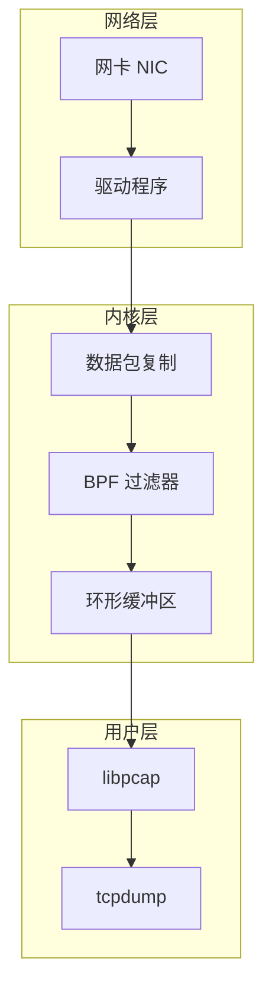
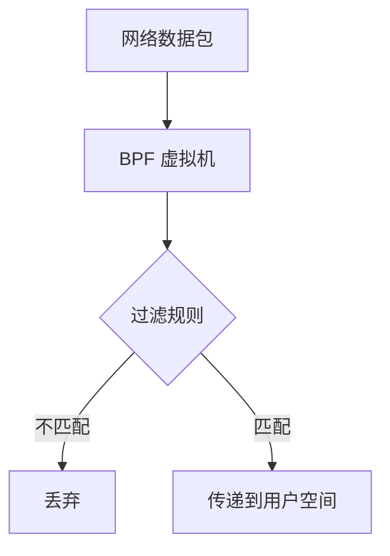
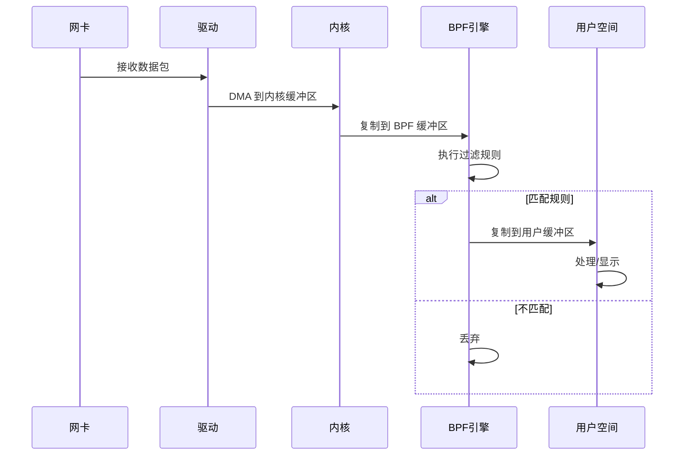

+++
title = "43.tcpdump网络抓包深度解析"
date = 2026-01-31
description = "tcpdump深度解析：libpcap原理、BPF过滤器、协议分析、故障排查"
[taxonomies]
tags = ["Linux", "tcpdump", "网络", "抓包", "libpcap"]
+++

# tcpdump 网络抓包深度解析

本文深入解析 tcpdump 网络抓包工具的工作原理，包括 libpcap、BPF 过滤器、协议分析、故障排查等核心技术。

---

## 一、tcpdump 概述

### 1.1 什么是 tcpdump

**tcpdump** 是最强大的命令行网络分析工具，用于：
- 捕获网络数据包
- 分析网络协议
- 排查网络故障
- 安全审计和入侵检测

### 1.2 核心特性

| 特性 | 说明 |
|------|------|
| 命令行界面 | 适合服务器和自动化 |
| BPF 过滤 | 高效的内核级过滤 |
| 协议解析 | 支持数百种协议 |
| PCAP 格式 | 业界标准格式 |
| 跨平台 | Linux、BSD、macOS |

### 1.3 架构概览



---

## 二、工作原理

### 2.1 libpcap 库

tcpdump 基于 **libpcap**（Packet Capture Library）实现：

```c
// libpcap 核心 API
pcap_t *pcap_open_live(device, snaplen, promisc, timeout, errbuf);
int pcap_compile(pcap_t *p, struct bpf_program *fp, char *str, int optimize, bpf_u_int32 netmask);
int pcap_setfilter(pcap_t *p, struct bpf_program *fp);
int pcap_loop(pcap_t *p, int cnt, pcap_handler callback, u_char *user);
void pcap_close(pcap_t *p);
```

### 2.2 BPF（Berkeley Packet Filter）



**BPF 指令示例**：

```
# 过滤 TCP 80 端口
(000) ldh      [12]                  # 加载以太网类型
(001) jeq      #0x800     jt 2  jf 8 # 是 IPv4?
(002) ldb      [23]                  # 加载协议字段
(003) jeq      #0x6       jt 4  jf 8 # 是 TCP?
(004) ldh      [20]                  # 加载分片偏移
(005) jset     #0x1fff    jt 8  jf 6 # 非首个分片?
(006) ldxb     4*([14]&0xf)          # 加载 IP 头长度
(007) ldh      [x + 16]              # 加载目标端口
(008) jeq      #0x50      jt 9  jf 10 # 是 80?
(009) ret      #262144               # 返回（接受）
(010) ret      #0                    # 返回（拒绝）
```

### 2.3 混杂模式（Promiscuous Mode）

```
普通模式：只接收发往本机的数据包
混杂模式：接收经过网卡的所有数据包

启用混杂模式：
$ tcpdump -i eth0          # 默认启用
$ ip link set eth0 promisc on

禁用混杂模式：
$ tcpdump -i eth0 -p       # 不启用混杂模式
$ ip link set eth0 promisc off
```

### 2.4 捕获过程



---

## 三、基本使用

### 3.1 基本语法

```bash
tcpdump [选项] [表达式]
```

### 3.2 常用选项

| 选项 | 说明 | 示例 |
|------|------|------|
| `-i` | 指定网卡 | `-i eth0` |
| `-n` | 不解析主机名 | `-n` |
| `-nn` | 不解析主机名和端口 | `-nn` |
| `-c N` | 捕获 N 个包后停止 | `-c 100` |
| `-w file` | 写入文件 | `-w capture.pcap` |
| `-r file` | 读取文件 | `-r capture.pcap` |
| `-v/-vv/-vvv` | 详细输出 | `-vvv` |
| `-A` | ASCII 显示 | `-A` |
| `-X` | 十六进制+ASCII | `-X` |
| `-xx` | 包含链路层头 | `-xx` |
| `-s snaplen` | 捕获字节数 | `-s 0`（全部） |
| `-e` | 显示链路层头 | `-e` |
| `-q` | 简洁输出 | `-q` |
| `-t/-tt/-ttt` | 时间戳格式 | `-ttt` |
| `-D` | 列出可用接口 | `-D` |

### 3.3 基本示例

```bash
# 捕获所有流量
sudo tcpdump -i eth0

# 捕获 100 个包
sudo tcpdump -i eth0 -c 100

# 不解析主机名和端口
sudo tcpdump -i eth0 -nn

# 保存到文件
sudo tcpdump -i eth0 -w capture.pcap

# 读取文件
tcpdump -r capture.pcap

# 详细输出
sudo tcpdump -i eth0 -vvv

# 显示 ASCII 内容
sudo tcpdump -i eth0 -A

# 显示十六进制
sudo tcpdump -i eth0 -X
```

---

## 四、过滤表达式

### 4.1 基本过滤

```bash
# 按主机过滤
tcpdump host 192.168.1.1
tcpdump src host 192.168.1.1
tcpdump dst host 192.168.1.1

# 按网段过滤
tcpdump net 192.168.1.0/24
tcpdump src net 10.0.0.0/8

# 按端口过滤
tcpdump port 80
tcpdump src port 443
tcpdump dst port 22
tcpdump portrange 1000-2000

# 按协议过滤
tcpdump tcp
tcpdump udp
tcpdump icmp
tcpdump arp
```

### 4.2 组合过滤

```bash
# 逻辑与
tcpdump host 192.168.1.1 and port 80
tcpdump 'src host 192.168.1.1 and dst port 443'

# 逻辑或
tcpdump 'port 80 or port 443'
tcpdump 'host 192.168.1.1 or host 192.168.1.2'

# 逻辑非
tcpdump 'not port 22'
tcpdump 'host 192.168.1.1 and not port 80'

# 复杂组合
tcpdump 'tcp and (port 80 or port 443) and host 192.168.1.1'
tcpdump '(src host 10.0.0.1 and dst port 80) or (src host 10.0.0.2 and dst port 443)'
```

### 4.3 高级过滤

```bash
# TCP 标志过滤
tcpdump 'tcp[tcpflags] & tcp-syn != 0'    # SYN 包
tcpdump 'tcp[tcpflags] & tcp-ack != 0'    # ACK 包
tcpdump 'tcp[tcpflags] & tcp-fin != 0'    # FIN 包
tcpdump 'tcp[tcpflags] & tcp-rst != 0'    # RST 包
tcpdump 'tcp[tcpflags] & tcp-push != 0'   # PSH 包

# SYN-only (新连接请求)
tcpdump 'tcp[tcpflags] == tcp-syn'

# SYN-ACK (连接响应)
tcpdump 'tcp[tcpflags] == (tcp-syn|tcp-ack)'

# 根据包大小过滤
tcpdump 'len > 100'
tcpdump 'greater 1000'
tcpdump 'less 64'

# VLAN 过滤
tcpdump 'vlan 100'
tcpdump 'vlan and host 192.168.1.1'

# IP 分片
tcpdump '((ip[6:2] > 0) and (not ip[6] = 64))'
```

### 4.4 协议字段过滤

```bash
# IP 协议字段
tcpdump 'ip[9] = 6'           # TCP (协议号 6)
tcpdump 'ip[9] = 17'          # UDP (协议号 17)
tcpdump 'ip[9] = 1'           # ICMP (协议号 1)

# IP TTL
tcpdump 'ip[8] < 10'          # TTL < 10

# TCP 端口（手动计算偏移）
tcpdump 'tcp[0:2] = 80'       # 源端口 80
tcpdump 'tcp[2:2] = 80'       # 目标端口 80

# TCP 窗口大小
tcpdump 'tcp[14:2] > 1000'    # 窗口 > 1000

# HTTP 请求（检查数据）
tcpdump 'tcp dst port 80 and tcp[((tcp[12:1] & 0xf0) >> 2):4] = 0x47455420'  # GET
tcpdump 'tcp dst port 80 and tcp[((tcp[12:1] & 0xf0) >> 2):4] = 0x504f5354'  # POST
```

---

## 五、输出解读

### 5.1 基本输出格式

```bash
$ tcpdump -nn -i eth0
14:30:25.123456 IP 192.168.1.100.54321 > 192.168.1.1.80: Flags [S], seq 1234567890, win 65535, options [mss 1460,sackOK,TS val 123456 ecr 0,nop,wscale 7], length 0
```

**字段解析**：

| 字段 | 说明 |
|------|------|
| `14:30:25.123456` | 时间戳 |
| `IP` | 协议 |
| `192.168.1.100.54321` | 源 IP:端口 |
| `>` | 方向 |
| `192.168.1.1.80` | 目标 IP:端口 |
| `Flags [S]` | TCP 标志（SYN） |
| `seq 1234567890` | 序列号 |
| `win 65535` | 窗口大小 |
| `options [...]` | TCP 选项 |
| `length 0` | 数据长度 |

### 5.2 TCP 标志

| 标志 | 符号 | 说明 |
|------|------|------|
| SYN | S | 同步（连接建立） |
| ACK | . | 确认 |
| FIN | F | 结束 |
| RST | R | 重置 |
| PSH | P | 推送 |
| URG | U | 紧急 |

### 5.3 三次握手示例

```bash
# SYN
14:30:25.001 IP 192.168.1.100.54321 > 192.168.1.1.80: Flags [S], seq 1000, win 65535

# SYN-ACK
14:30:25.002 IP 192.168.1.1.80 > 192.168.1.100.54321: Flags [S.], seq 2000, ack 1001, win 65535

# ACK
14:30:25.003 IP 192.168.1.100.54321 > 192.168.1.1.80: Flags [.], seq 1001, ack 2001, win 65535
```

### 5.4 详细输出示例

```bash
$ tcpdump -vvv -nn -i eth0 port 80

14:30:25.123456 IP (tos 0x0, ttl 64, id 12345, offset 0, flags [DF], proto TCP (6), length 60)
    192.168.1.100.54321 > 192.168.1.1.80: Flags [S], cksum 0x1234 (correct), seq 1234567890, win 65535, options [mss 1460,sackOK,TS val 123456789 ecr 0,nop,wscale 7], length 0
```

---

## 六、高级用法

### 6.1 捕获并实时分析

```bash
# 捕获 HTTP 请求
tcpdump -A -nn -i eth0 'tcp port 80 and (((ip[2:2] - ((ip[0]&0xf)<<2)) - ((tcp[12]&0xf0)>>2)) != 0)'

# 捕获 DNS 查询
tcpdump -nn -i eth0 'udp port 53'

# 只显示 HTTP Host 头
tcpdump -A -nn -i eth0 'tcp port 80' | grep -i 'Host:'

# 捕获 SSH 连接
tcpdump -nn -i eth0 'tcp port 22'
```

### 6.2 保存和分析

```bash
# 保存完整数据包
tcpdump -i eth0 -s 0 -w full_capture.pcap

# 循环写入多个文件
tcpdump -i eth0 -w capture_%Y%m%d_%H%M%S.pcap -G 3600 -W 24

# 限制文件大小
tcpdump -i eth0 -w capture.pcap -C 100  # 每 100MB 一个文件

# 读取并过滤
tcpdump -r capture.pcap 'tcp port 80'
tcpdump -r capture.pcap -nn -c 10
```

### 6.3 远程抓包

```bash
# 远程服务器抓包，本地分析
ssh user@server 'tcpdump -i eth0 -w - -U' | wireshark -k -i -

# 远程抓包保存到本地
ssh user@server 'tcpdump -i eth0 -w - -c 1000' > remote_capture.pcap

# 通过 nc 传输
# 服务端
tcpdump -i eth0 -w - | nc -l 9999
# 客户端
nc server_ip 9999 > capture.pcap
```

### 6.4 性能优化

```bash
# 增大缓冲区
tcpdump -i eth0 -B 4096 -w capture.pcap

# 使用 pcap-ng 格式
tcpdump -i eth0 -w capture.pcapng --time-stamp-precision=nano

# 不解析（提高性能）
tcpdump -i eth0 -nn -w capture.pcap

# 内核过滤（减少用户空间负载）
tcpdump -i eth0 'tcp port 80' -w capture.pcap
```

### 6.5 多接口抓包

```bash
# 所有接口
tcpdump -i any

# 注意：-i any 时看不到以太网头
tcpdump -i any -e  # 无效

# 多实例抓包
tcpdump -i eth0 -w eth0.pcap &
tcpdump -i eth1 -w eth1.pcap &
```

---

## 七、故障排查实战

### 7.1 TCP 连接问题

```bash
# 检查 SYN 包是否发出
tcpdump -nn -i eth0 'tcp[tcpflags] == tcp-syn and host target_ip'

# 检查是否收到 SYN-ACK
tcpdump -nn -i eth0 'tcp[tcpflags] == (tcp-syn|tcp-ack) and src host target_ip'

# 检查 RST 包
tcpdump -nn -i eth0 'tcp[tcpflags] & tcp-rst != 0'

# 连接建立全过程
tcpdump -nn -i eth0 'host target_ip and port 80'
```

### 7.2 DNS 问题

```bash
# 捕获 DNS 查询
tcpdump -nn -i eth0 'udp port 53'

# 详细 DNS 解析
tcpdump -vvv -nn -i eth0 'udp port 53'

# 特定域名查询
tcpdump -nn -i eth0 'udp port 53' | grep 'example.com'
```

### 7.3 HTTP 问题

```bash
# HTTP 请求和响应
tcpdump -A -nn -i eth0 'tcp port 80'

# 只看请求行
tcpdump -A -nn -i eth0 'tcp port 80' | grep -E '^(GET|POST|PUT|DELETE|HEAD)'

# HTTP 响应状态
tcpdump -A -nn -i eth0 'tcp port 80' | grep -E '^HTTP/'
```

### 7.4 ICMP 问题

```bash
# 所有 ICMP
tcpdump -nn -i eth0 icmp

# ICMP 类型过滤
tcpdump -nn -i eth0 'icmp[icmptype] = icmp-echo'         # Echo Request
tcpdump -nn -i eth0 'icmp[icmptype] = icmp-echoreply'    # Echo Reply
tcpdump -nn -i eth0 'icmp[icmptype] = icmp-unreach'      # 不可达
```

### 7.5 ARP 问题

```bash
# 所有 ARP
tcpdump -nn -i eth0 arp

# ARP 请求
tcpdump -nn -i eth0 'arp[6:2] = 1'

# ARP 响应
tcpdump -nn -i eth0 'arp[6:2] = 2'
```

### 7.6 性能分析

```bash
# 统计每秒包数
tcpdump -nn -i eth0 -c 10000 2>&1 | tail -1

# 大包分析
tcpdump -nn -i eth0 'greater 1000'

# 重传分析（结合 Wireshark）
tcpdump -i eth0 -w retrans.pcap
# Wireshark 过滤: tcp.analysis.retransmission
```

---

## 八、实用脚本

### 8.1 连接统计

```bash
#!/bin/bash
# conn_stats.sh - 统计连接

IFACE=${1:-eth0}
DURATION=${2:-10}

echo "Capturing on $IFACE for $DURATION seconds..."
tcpdump -i $IFACE -nn -c 10000 -G $DURATION -W 1 2>/dev/null | \
    awk '{print $3}' | cut -d. -f1-4 | sort | uniq -c | sort -rn | head -20
```

### 8.2 HTTP 监控

```bash
#!/bin/bash
# http_monitor.sh - HTTP 请求监控

IFACE=${1:-eth0}

echo "Monitoring HTTP requests on $IFACE..."
tcpdump -A -nn -i $IFACE 'tcp port 80' 2>/dev/null | \
    grep -E --line-buffered '^(GET|POST|PUT|DELETE|HEAD) ' | \
    while read line; do
        echo "$(date '+%Y-%m-%d %H:%M:%S') $line"
    done
```

### 8.3 DNS 日志

```bash
#!/bin/bash
# dns_log.sh - DNS 查询日志

IFACE=${1:-eth0}

echo "Logging DNS queries on $IFACE..."
tcpdump -l -nn -i $IFACE 'udp port 53 and udp[10:2] & 0x8000 = 0' 2>/dev/null | \
    awk '{
        for (i=1; i<=NF; i++) {
            if ($i ~ /A\?$/) {
                domain = $(i-1)
                gsub(/\.$/, "", domain)
                print strftime("%Y-%m-%d %H:%M:%S"), domain
            }
        }
    }'
```

---

## 九、与 Wireshark 配合

### 9.1 生成 Wireshark 可读文件

```bash
# 捕获并保存
tcpdump -i eth0 -w capture.pcap -s 0

# 在 Wireshark 中打开
wireshark capture.pcap
```

### 9.2 实时传输到 Wireshark

```bash
# 本地实时分析
tcpdump -i eth0 -U -w - | wireshark -k -i -

# 远程实时分析
ssh root@server 'tcpdump -i eth0 -U -w -' | wireshark -k -i -

# 通过命名管道
mkfifo /tmp/capture
tcpdump -i eth0 -w - > /tmp/capture &
wireshark -k -i /tmp/capture
```

---

## 十、与同类工具对比

| 特性 | tcpdump | Wireshark | tshark | ngrep |
|------|---------|-----------|--------|-------|
| 界面 | CLI | GUI | CLI | CLI |
| 协议解析 | 基础 | 完整 | 完整 | 基础 |
| 性能 | 高 | 中 | 高 | 中 |
| 过滤能力 | BPF | BPF+显示过滤 | 完整 | 正则 |
| 适用场景 | 服务器 | 桌面 | 自动化 | 搜索 |

### 10.1 tshark 比较

```bash
# tcpdump
tcpdump -i eth0 -nn 'tcp port 80'

# tshark（Wireshark CLI）
tshark -i eth0 -Y 'tcp.port == 80'

# tshark 优势：更强的解析和过滤
tshark -i eth0 -Y 'http.request.method == GET' -T fields -e http.host -e http.request.uri
```

---

## 十一、高频考点总结

| 考点 | 频率 | 关键知识 |
|------|------|----------|
| BPF 过滤 | ★★★ | 主机、端口、协议、TCP 标志 |
| 基本选项 | ★★★ | -i、-nn、-c、-w、-r |
| 输出解读 | ★★★ | TCP 标志、三次握手 |
| 故障排查 | ★★☆ | DNS、TCP 连接、HTTP |
| 高级过滤 | ★★☆ | 协议字段、组合条件 |
| 保存分析 | ★★☆ | PCAP 格式、Wireshark 配合 |

---

## 相关文章

- [上一篇：fio磁盘IO性能测试深度解析](/articles/linux/linux-42-fio磁盘IO性能测试深度解析/)
- [网络故障排查实战](/articles/networking/net-12-网络故障排查实战/)
