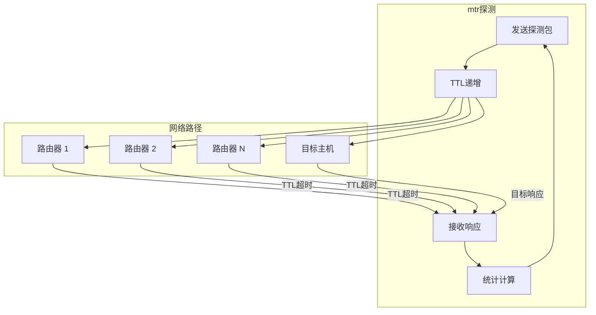
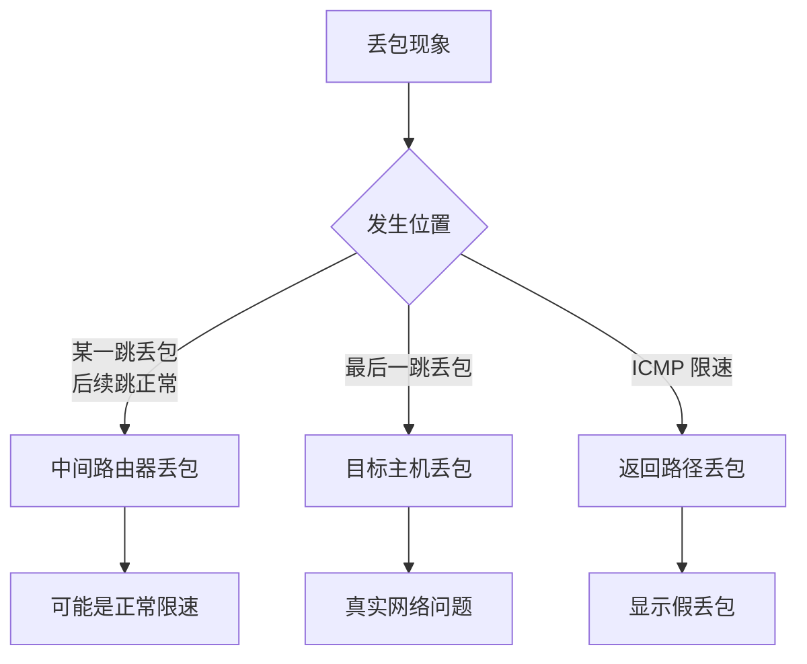
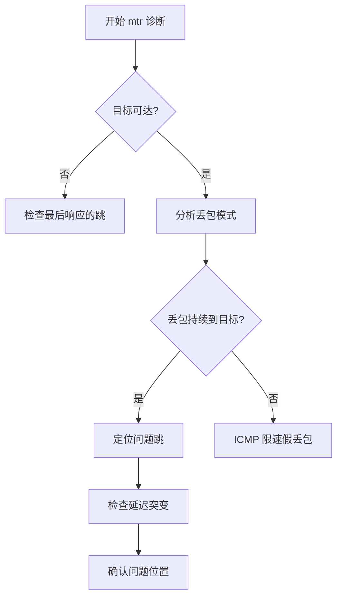

+++
title = "44.mtr网络路径分析深度解析"
date = 2026-01-31
description = "mtr深度解析：路由追踪原理、ICMP/UDP探测、丢包分析、网络诊断"
[taxonomies]
tags = ["Linux", "mtr", "网络", "路由追踪", "诊断"]
+++

# mtr 网络路径分析深度解析

本文深入解析 mtr（My Traceroute）工具的工作原理，包括路由追踪、丢包分析、网络诊断等核心技术。

---

## 一、mtr 概述

### 1.1 什么是 mtr

**mtr** 结合了 **traceroute** 和 **ping** 的功能，提供：
- 实时路由路径显示
- 持续的丢包和延迟统计
- 网络问题定位
- 多种探测模式

### 1.2 mtr vs traceroute vs ping

| 特性 | mtr | traceroute | ping |
|------|-----|------------|------|
| 路径发现 | ✅ | ✅ | ❌ |
| 持续监控 | ✅ | ❌ | ✅ |
| 丢包统计 | ✅ | ❌ | ✅ |
| 每跳延迟 | ✅ | ✅ | 仅目标 |
| 实时更新 | ✅ | ❌ | ✅ |

### 1.3 架构概览



---

## 二、工作原理

### 2.1 TTL 递增原理

```
IP 数据包 TTL（Time To Live）机制：
- 每经过一个路由器，TTL 减 1
- 当 TTL = 0 时，路由器返回 ICMP Time Exceeded
- 通过逐步增加 TTL，可以发现每一跳路由器

探测过程：
TTL=1:  [源] → [路由器1] → ICMP Time Exceeded
TTL=2:  [源] → [路由器1] → [路由器2] → ICMP Time Exceeded
TTL=3:  [源] → [路由器1] → [路由器2] → [路由器3] → ICMP Time Exceeded
...
TTL=N:  [源] → ... → [目标] → ICMP Echo Reply / UDP Port Unreachable
```

### 2.2 探测协议对比

| 协议 | 优势 | 劣势 | 适用场景 |
|------|------|------|----------|
| **ICMP** | 最常用，响应可靠 | 可能被防火墙阻止 | 默认选择 |
| **UDP** | 绕过部分 ICMP 限制 | 依赖端口不可达 | ICMP 被阻时 |
| **TCP** | 穿透更多防火墙 | 需要 root | 严格防火墙环境 |

### 2.3 丢包类型分析



---

## 三、基本使用

### 3.1 安装

```bash
# Debian/Ubuntu
sudo apt install mtr mtr-tiny

# CentOS/RHEL
sudo yum install mtr

# macOS
brew install mtr
```

### 3.2 基本命令

```bash
# 交互模式
mtr google.com

# 报告模式（非交互）
mtr -r google.com
mtr --report google.com

# 指定探测次数
mtr -r -c 100 google.com

# 不解析主机名
mtr -n google.com

# 同时显示 IP 和主机名
mtr -b google.com

# 宽输出（显示完整主机名）
mtr -w google.com
```

### 3.3 常用选项

| 选项 | 说明 | 示例 |
|------|------|------|
| `-r` | 报告模式 | `mtr -r host` |
| `-c N` | 探测次数 | `-c 100` |
| `-n` | 不解析主机名 | `-n` |
| `-b` | 显示 IP 和主机名 | `-b` |
| `-w` | 宽输出 | `-w` |
| `-i N` | 探测间隔（秒） | `-i 0.5` |
| `-s SIZE` | 包大小 | `-s 1000` |
| `-u` | UDP 模式 | `-u` |
| `-T` | TCP 模式 | `-T` |
| `-P PORT` | 端口号 | `-P 443` |
| `-4` / `-6` | IPv4/IPv6 | `-4` |
| `-o FIELDS` | 输出字段 | `-o LDRS` |
| `-z` | 显示 AS 号 | `-z` |

### 3.4 输出字段

```bash
# 默认输出
$ mtr -r -c 10 google.com
                             My traceroute  [v0.95]
host                          Loss%   Snt   Last   Avg  Best  Wrst StDev
 1. router.local               0.0%    10    1.2   1.5   0.8   3.2   0.7
 2. 10.0.0.1                   0.0%    10   10.5  11.2   9.8  15.3   1.8
 3. 172.16.0.1                10.0%    10   25.3  28.7  23.1  45.2   7.2
 4. google.com                 0.0%    10   30.2  32.1  28.5  40.3   3.5
```

| 字段 | 说明 |
|------|------|
| **Loss%** | 丢包率 |
| **Snt** | 发送包数 |
| **Last** | 最后一次延迟 |
| **Avg** | 平均延迟 |
| **Best** | 最小延迟 |
| **Wrst** | 最大延迟 |
| **StDev** | 标准差 |

---

## 四、探测模式

### 4.1 ICMP 模式（默认）

```bash
# 标准 ICMP 探测
mtr google.com

# 使用 ICMP Echo
mtr --icmp google.com
```

### 4.2 UDP 模式

```bash
# UDP 探测
mtr -u google.com
mtr --udp google.com

# 指定端口
mtr -u -P 33434 google.com
```

### 4.3 TCP 模式

```bash
# TCP SYN 探测（需要 root）
sudo mtr -T google.com
sudo mtr --tcp google.com

# 指定端口
sudo mtr -T -P 443 google.com
sudo mtr -T -P 80 google.com
```

### 4.4 选择探测模式的依据

```
1. 默认使用 ICMP
2. 如果 ICMP 被阻止（显示 ???）：
   - 尝试 UDP: mtr -u
3. 如果 UDP 也不行：
   - 尝试 TCP: mtr -T -P 80
4. 针对特定服务：
   - Web: mtr -T -P 443
   - SSH: mtr -T -P 22
```

---

## 五、输出解读

### 5.1 正常输出

```bash
$ mtr -r -c 100 8.8.8.8
                             Loss%   Snt   Last   Avg  Best  Wrst StDev
 1. router.local               0.0%   100    0.5   0.8   0.3   2.1   0.3
 2. isp-gateway                0.0%   100    8.2   9.1   7.5  15.3   1.2
 3. core-router                0.0%   100   15.3  16.2  14.1  22.5   1.8
 4. google-peer                0.0%   100   20.1  21.5  18.5  30.2   2.5
 5. 8.8.8.8                    0.0%   100   25.3  26.8  23.1  35.5   3.0
```

**解读**：
- 每一跳延迟逐渐增加（正常）
- 没有丢包（理想状态）
- StDev 较小（稳定）

### 5.2 丢包分析

```bash
$ mtr -r -c 100 problem.server.com
                             Loss%   Snt   Last   Avg  Best  Wrst StDev
 1. router.local               0.0%   100    0.5   0.8   0.3   2.1   0.3
 2. isp-gateway                0.0%   100    8.2   9.1   7.5  15.3   1.2
 3. core-router               50.0%   100   15.3  16.2  14.1  22.5   1.8
 4. next-hop                   0.0%   100   20.1  21.5  18.5  30.2   2.5
 5. problem.server.com         0.0%   100   25.3  26.8  23.1  35.5   3.0
```

**解读**：
- 第 3 跳显示 50% 丢包
- 但第 4、5 跳无丢包
- **这是 ICMP 限速造成的假丢包**

### 5.3 真实丢包

```bash
$ mtr -r -c 100 problem.server.com
                             Loss%   Snt   Last   Avg  Best  Wrst StDev
 1. router.local               0.0%   100    0.5   0.8   0.3   2.1   0.3
 2. isp-gateway                0.0%   100    8.2   9.1   7.5  15.3   1.2
 3. problem-router            20.0%   100   15.3  16.2  14.1  22.5   1.8
 4. next-hop                  20.0%   100   20.1  21.5  18.5  30.2   2.5
 5. problem.server.com        20.0%   100   25.3  26.8  23.1  35.5   3.0
```

**解读**：
- 从第 3 跳开始持续丢包
- 后续所有跳都有类似丢包率
- **第 3 跳是真正的问题点**

### 5.4 延迟突变

```bash
$ mtr -r -c 100 remote.server.com
                             Loss%   Snt   Last   Avg  Best  Wrst StDev
 1. router.local               0.0%   100    0.5   0.8   0.3   2.1   0.3
 2. local-isp                  0.0%   100    5.2   6.1   4.5  10.3   1.2
 3. peering-point              0.0%   100  150.3 155.2 145.1 180.5  10.8
 4. remote-isp                 0.0%   100  152.1 157.5 148.5 185.2  11.5
 5. remote.server.com          0.0%   100  155.3 160.8 150.1 190.5  12.0
```

**解读**：
- 第 3 跳延迟突然从 6ms 跳到 155ms
- 可能是：跨洲际链路、卫星链路、或拥塞

---

## 六、高级用法

### 6.1 自定义输出字段

```bash
# 自定义字段
mtr -o "LDRS NBAW" google.com

# 字段代码：
# L - Loss%
# D - Dropped packets
# R - Received packets
# S - Sent packets
# N - Newest RTT
# B - Min/Best RTT
# A - Average RTT
# W - Max/Worst RTT
# V - Standard Deviation
# G - Geometric Mean
# J - Jitter
# M - Interarrival Jitter
# X - Unsent packets
```

### 6.2 显示 AS 号

```bash
# 显示 AS 号（需要网络查询）
mtr -z google.com
mtr --aslookup google.com

# 输出示例
 1. AS???? router.local
 2. AS1234 isp-gateway
 3. AS5678 core-router
 4. AS15169 google-peer
```

### 6.3 包大小测试

```bash
# 小包
mtr -s 64 google.com

# MTU 测试
mtr -s 1472 google.com

# 大包
mtr -s 1500 google.com
```

### 6.4 探测间隔

```bash
# 快速探测
mtr -i 0.1 google.com

# 慢速探测（减少负载）
mtr -i 2 google.com
```

### 6.5 JSON/CSV 输出

```bash
# JSON 输出
mtr --json google.com

# CSV 输出
mtr --csv google.com

# 保存报告
mtr -r -c 100 --json google.com > report.json
```

---

## 七、故障排查实战

### 7.1 排查流程



### 7.2 常见问题模式

**模式 1：目标不可达**
```bash
 1. router.local               0.0%   100    0.5   0.8
 2. isp-gateway                0.0%   100    8.2   9.1
 3. ???
 4. ???
 5. ???
```
**原因**：防火墙阻止、路由黑洞、目标宕机

**模式 2：ICMP 限速**
```bash
 3. core-router               50.0%   100   15.3  16.2
 4. next-hop                   0.0%   100   20.1  21.5
 5. target                     0.0%   100   25.3  26.8
```
**原因**：中间路由器 ICMP 限速，非真实丢包

**模式 3：真实丢包**
```bash
 3. problem-router            20.0%   100   15.3  16.2
 4. next-hop                  20.0%   100   20.1  21.5
 5. target                    20.0%   100   25.3  26.8
```
**原因**：从某跳开始的持续丢包

**模式 4：非对称路由**
```bash
 3. router-A                   0.0%   100   50.3  55.2
 4. router-B                   0.0%   100   25.1  28.5  # 延迟降低!
```
**原因**：返回路径不同

### 7.3 实用诊断脚本

```bash
#!/bin/bash
# network_diag.sh - 网络诊断

TARGET=$1
COUNT=${2:-100}

echo "=== Network Diagnosis for $TARGET ==="
echo ""

echo "--- ICMP Mode ---"
mtr -r -c $COUNT -n "$TARGET"
echo ""

echo "--- UDP Mode ---"
mtr -r -c $COUNT -u -n "$TARGET"
echo ""

echo "--- TCP 80 Mode ---"
sudo mtr -r -c $COUNT -T -P 80 -n "$TARGET"
echo ""

echo "--- TCP 443 Mode ---"
sudo mtr -r -c $COUNT -T -P 443 -n "$TARGET"
```

---

## 八、与 ISP 沟通

### 8.1 生成报告

```bash
# 生成详细报告
mtr -r -c 200 -w problem.host.com > mtr_report.txt

# 包含 AS 信息
mtr -r -c 200 -w -z problem.host.com > mtr_report.txt

# 时间戳
echo "Report generated at: $(date)" >> mtr_report.txt
```

### 8.2 报告内容建议

```
提供给 ISP 的信息：
1. 源 IP 和目标 IP
2. mtr 报告（至少 100 次探测）
3. 问题发生的时间范围
4. 问题描述（丢包、高延迟、不可达）
5. 双向 mtr（如果可能）
```

---

## 九、与同类工具对比

| 特性 | mtr | traceroute | tracepath | pathping |
|------|-----|------------|-----------|----------|
| 持续监控 | ✅ | ❌ | ❌ | ✅ |
| 丢包统计 | ✅ | ❌ | ❌ | ✅ |
| ICMP/UDP/TCP | ✅ | ✅ | UDP | ICMP |
| 交互界面 | ✅ | ❌ | ❌ | ❌ |
| AS 查询 | ✅ | ❌ | ❌ | ❌ |
| 平台 | Linux/Mac/Win | 全平台 | Linux | Windows |

---

## 十、高频考点总结

| 考点 | 频率 | 关键知识 |
|------|------|----------|
| TTL 原理 | ★★★ | 每跳减 1，超时返回 ICMP |
| 丢包分析 | ★★★ | 真丢包 vs ICMP 限速 |
| 探测模式 | ★★☆ | ICMP、UDP、TCP 选择 |
| 输出解读 | ★★★ | Loss%、Avg、StDev 含义 |
| 故障定位 | ★★☆ | 问题跳的识别 |
| 与 traceroute 区别 | ★★☆ | 持续监控、统计功能 |

---

## 相关文章

- [上一篇：tcpdump网络抓包深度解析](/articles/linux/linux-43-tcpdump网络抓包深度解析/)
- [网络故障排查实战](/articles/networking/net-12-网络故障排查实战/)
