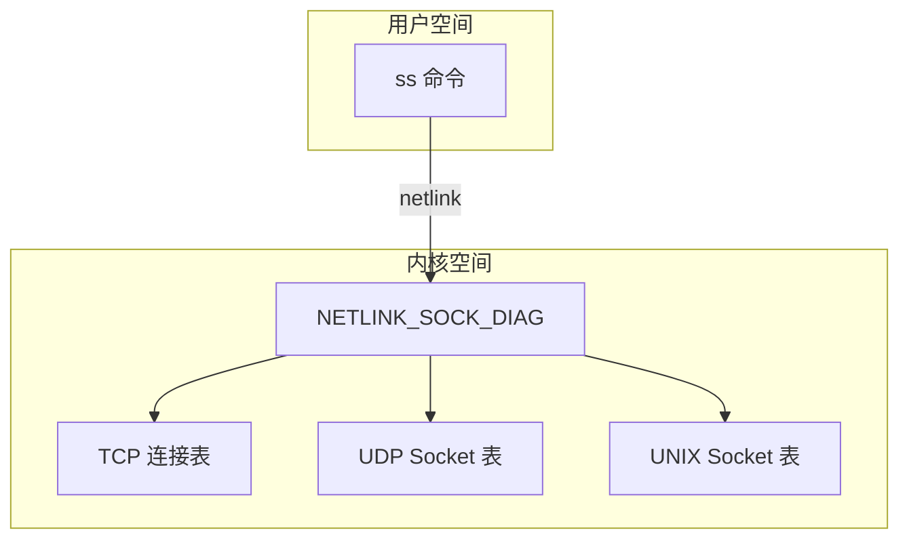
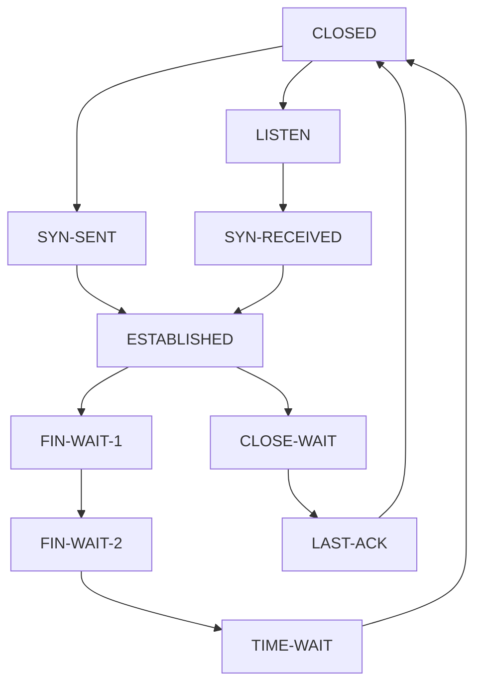

+++
title = "ss网络连接状态深度解析"
date = 2026-01-31
weight = 46000
description = "ss深度解析：Socket统计、TCP状态、连接分析、netstat替代"
[taxonomies]
tags = ["Linux", "ss", "网络", "Socket", "连接"]
+++

# ss 网络连接状态深度解析

本文深入解析 ss（Socket Statistics）工具的工作原理，包括 Socket 统计、TCP 状态分析、连接诊断等核心技术。

---

## 一、ss 概述

### 1.1 什么是 ss

**ss** 是 Linux 下查看 Socket 统计信息的工具，用于：
- 查看网络连接状态
- 统计 Socket 信息
- 替代传统的 netstat
- 网络故障诊断

### 1.2 ss vs netstat

| 特性 | ss | netstat |
|------|-----|---------|
| 速度 | 快（直接读取内核） | 慢（遍历 /proc） |
| 信息量 | 更详细 | 基本 |
| 过滤能力 | 强大 | 弱 |
| 维护状态 | 活跃 | 废弃中 |
| 内存使用 | 低 | 高 |

### 1.3 工作原理



**关键点**：
- ss 使用 **netlink** 接口直接与内核通信
- 不需要遍历 `/proc/net/tcp` 等文件
- 大量连接时性能优势明显

---

## 二、基本使用

### 2.1 常用选项

| 选项 | 说明 | 示例 |
|------|------|------|
| `-t` | TCP 连接 | `ss -t` |
| `-u` | UDP 连接 | `ss -u` |
| `-l` | 监听端口 | `ss -l` |
| `-a` | 所有连接 | `ss -a` |
| `-n` | 不解析服务名 | `ss -n` |
| `-p` | 显示进程 | `ss -p` |
| `-e` | 扩展信息 | `ss -e` |
| `-i` | TCP 内部信息 | `ss -i` |
| `-m` | 内存使用 | `ss -m` |
| `-o` | 计时器信息 | `ss -o` |
| `-s` | 统计摘要 | `ss -s` |
| `-4` / `-6` | IPv4/IPv6 | `ss -4` |

### 2.2 基本查询

```bash
# 所有 TCP 连接
ss -t

# 所有 TCP 监听端口
ss -tl

# 所有连接（不解析）
ss -tan

# 显示进程信息
ss -tlnp

# UDP 监听端口
ss -uln

# UNIX Socket
ss -x
```

### 2.3 输出格式

```bash
$ ss -tlnp
State    Recv-Q   Send-Q   Local Address:Port    Peer Address:Port   Process
LISTEN   0        128      0.0.0.0:22             0.0.0.0:*           users:(("sshd",pid=1234,fd=3))
LISTEN   0        511      127.0.0.1:6379         0.0.0.0:*           users:(("redis-server",pid=2345,fd=6))
LISTEN   0        100      127.0.0.1:25           0.0.0.0:*           users:(("master",pid=3456,fd=13))
```

**字段说明**：

| 字段 | 说明 |
|------|------|
| **State** | 连接状态 |
| **Recv-Q** | 接收队列（LISTEN：等待连接数；ESTAB：未读数据） |
| **Send-Q** | 发送队列（LISTEN：backlog 大小；ESTAB：未确认数据） |
| **Local Address:Port** | 本地地址和端口 |
| **Peer Address:Port** | 远端地址和端口 |
| **Process** | 进程信息 |

---

## 三、TCP 状态分析

### 3.1 TCP 状态说明



| 状态 | 说明 | 常见于 |
|------|------|--------|
| LISTEN | 监听中 | 服务端 |
| SYN-SENT | 已发送 SYN | 客户端连接中 |
| SYN-RECV | 收到 SYN | 服务端半连接 |
| ESTABLISHED | 已建立 | 正常连接 |
| FIN-WAIT-1 | 发送 FIN | 主动关闭方 |
| FIN-WAIT-2 | 收到 ACK | 主动关闭方 |
| TIME-WAIT | 等待 2MSL | 主动关闭方 |
| CLOSE-WAIT | 收到 FIN | 被动关闭方 |
| LAST-ACK | 发送 FIN | 被动关闭方 |

### 3.2 按状态过滤

```bash
# ESTABLISHED 连接
ss state established

# LISTEN 状态
ss state listening

# TIME-WAIT 连接
ss state time-wait

# CLOSE-WAIT 连接
ss state close-wait

# 所有非 LISTEN 状态
ss state connected

# 所有已同步状态
ss state synchronized
```

### 3.3 状态统计

```bash
# 统计各状态数量
ss -s

# 输出示例
Total: 542
TCP:   352 (estab 180, closed 45, orphaned 2, timewait 45)

Transport Total     IP        IPv6
RAW       0         0         0
UDP       12        8         4
TCP       307       280       27
INET      319       288       31
FRAG      0         0         0

# 统计 TIME-WAIT 数量
ss state time-wait | wc -l

# 按状态分组统计
ss -tan | awk 'NR>1 {print $1}' | sort | uniq -c | sort -rn
```

---

## 四、过滤表达式

### 4.1 地址过滤

```bash
# 源地址过滤
ss src 192.168.1.100
ss src 192.168.1.0/24

# 目标地址过滤
ss dst 10.0.0.1
ss dst 10.0.0.0/8

# 组合过滤
ss src 192.168.1.100 and dst 10.0.0.1
```

### 4.2 端口过滤

```bash
# 源端口
ss sport = :22
ss sport = :ssh
ss sport gt :1024

# 目标端口
ss dport = :80
ss dport = :http

# 端口范围
ss dport ge :1000 and dport le :2000

# 常用服务端口
ss '( dport = :http or dport = :https )'
```

### 4.3 组合过滤

```bash
# 特定地址的 HTTP 连接
ss dst 10.0.0.1 and dport = :80

# 本地 22 端口的连接
ss sport = :22

# 排除某端口
ss sport != :22

# 复杂条件
ss '( sport = :22 or sport = :80 ) and src 192.168.1.0/24'
```

### 4.4 过滤运算符

| 运算符 | 说明 | 示例 |
|--------|------|------|
| `=` / `==` / `eq` | 等于 | `sport = :22` |
| `!=` / `ne` | 不等于 | `dport != :80` |
| `>` / `gt` | 大于 | `sport gt :1024` |
| `<` / `lt` | 小于 | `dport lt :1024` |
| `>=` / `ge` | 大于等于 | `sport ge :1000` |
| `<=` / `le` | 小于等于 | `dport le :65535` |
| `and` | 逻辑与 | `src 1.1.1.1 and dst 2.2.2.2` |
| `or` | 逻辑或 | `sport = :22 or sport = :80` |

---

## 五、详细信息

### 5.1 TCP 内部信息 (-i)

```bash
$ ss -ti state established

ESTAB 0 0 192.168.1.100:ssh 192.168.1.1:54321
     cubic wscale:7,7 rto:204 rtt:1.5/0.75 ato:40 mss:1448 pmtu:1500 rcvmss:1448 advmss:1448 cwnd:10 bytes_sent:2048 bytes_acked:2049 bytes_received:1024 segs_out:15 segs_in:12 data_segs_out:8 data_segs_in:6 send 77.2Mbps lastsnd:4 lastrcv:4 lastack:4 pacing_rate 154Mbps delivery_rate 48.2Mbps delivered:9 busy:8ms rcv_rtt:1 rcv_space:14600 rcv_ssthresh:64076 minrtt:0.5
```

**关键指标**：

| 指标 | 说明 |
|------|------|
| **cubic** | 拥塞控制算法 |
| **rto** | 重传超时时间 (ms) |
| **rtt** | 往返时间 (ms) |
| **cwnd** | 拥塞窗口 (段) |
| **mss** | 最大段大小 |
| **bytes_sent** | 发送字节数 |
| **bytes_acked** | 确认字节数 |
| **send** | 发送速率 |
| **pacing_rate** | 节奏发送速率 |
| **delivery_rate** | 交付速率 |
| **minrtt** | 最小 RTT |

### 5.2 内存信息 (-m)

```bash
$ ss -tm

ESTAB 0 0 192.168.1.100:22 192.168.1.1:54321
     skmem:(r0,rb131072,t0,tb87040,f0,w0,o0,bl0,d0)
```

| 字段 | 说明 |
|------|------|
| r | 接收缓冲区已用 |
| rb | 接收缓冲区大小 |
| t | 发送缓冲区已用 |
| tb | 发送缓冲区大小 |
| f | 转发缓冲区 |
| w | 待发送数据 |
| o | 选项缓冲区 |
| bl | backlog |
| d | 丢弃包 |

### 5.3 计时器信息 (-o)

```bash
$ ss -to

ESTAB 0 0 192.168.1.100:22 192.168.1.1:54321 timer:(keepalive,45min,0)
TIME-WAIT 0 0 192.168.1.100:80 192.168.1.2:34567 timer:(timewait,30sec,0)
```

**计时器类型**：
- `keepalive` - 保活计时器
- `timewait` - TIME-WAIT 计时器
- `on` - 重传计时器
- `probe` - 窗口探测

---

## 六、实战场景

### 6.1 查找高连接数服务

```bash
# 按本地端口统计连接数
ss -tn | awk '{print $4}' | cut -d: -f2 | sort | uniq -c | sort -rn | head

# 按远程 IP 统计连接数
ss -tn state established | awk '{print $5}' | cut -d: -f1 | sort | uniq -c | sort -rn | head

# 查看某端口的连接数
ss -tn sport = :80 | wc -l
```

### 6.2 诊断 TIME-WAIT 问题

```bash
# 统计 TIME-WAIT 数量
ss state time-wait | wc -l

# 查看 TIME-WAIT 详情
ss -tn state time-wait

# 按目标地址统计
ss state time-wait | awk '{print $4}' | cut -d: -f1 | sort | uniq -c | sort -rn
```

### 6.3 诊断 CLOSE-WAIT 问题

```bash
# CLOSE-WAIT 表示应用未调用 close()
ss -tnp state close-wait

# 找出问题进程
ss -tnp state close-wait | awk '{print $6}'
```

### 6.4 监听端口安全检查

```bash
# 所有监听端口
ss -tlnp

# 对外监听的端口（排除 127.0.0.1）
ss -tlnp | grep -v '127.0.0.1'

# 检查异常端口
ss -tlnp | grep -v -E ':(22|80|443) '
```

### 6.5 连接性能分析

```bash
# 查看连接的 RTT 和拥塞窗口
ss -ti state established dst 10.0.0.1

# 查看慢连接（高 RTT）
ss -ti state established | grep -E 'rtt:[0-9]{3,}'

# 查看重传情况
ss -ti | grep -E 'retrans:'
```

---

## 七、实用脚本

### 7.1 连接监控

```bash
#!/bin/bash
# conn_monitor.sh - 连接状态监控

while true; do
    clear
    echo "=== Connection Monitor $(date) ==="
    echo ""
    echo "--- State Summary ---"
    ss -s | grep TCP
    echo ""
    echo "--- Top Connections by Remote IP ---"
    ss -tn state established | awk '{print $5}' | cut -d: -f1 | \
        sort | uniq -c | sort -rn | head -10
    echo ""
    echo "--- Listening Ports ---"
    ss -tlnp | head -10
    sleep 5
done
```

### 7.2 异常检测

```bash
#!/bin/bash
# conn_alert.sh - 连接异常告警

THRESHOLD_TIMEWAIT=1000
THRESHOLD_CLOSEWAIT=100
THRESHOLD_ESTABLISHED=10000

TW=$(ss state time-wait | wc -l)
CW=$(ss state close-wait | wc -l)
EST=$(ss state established | wc -l)

if [ $TW -gt $THRESHOLD_TIMEWAIT ]; then
    echo "ALERT: TIME-WAIT connections: $TW > $THRESHOLD_TIMEWAIT"
fi

if [ $CW -gt $THRESHOLD_CLOSEWAIT ]; then
    echo "ALERT: CLOSE-WAIT connections: $CW > $THRESHOLD_CLOSEWAIT"
fi

if [ $EST -gt $THRESHOLD_ESTABLISHED ]; then
    echo "ALERT: ESTABLISHED connections: $EST > $THRESHOLD_ESTABLISHED"
fi
```

### 7.3 端口使用统计

```bash
#!/bin/bash
# port_stats.sh - 端口统计

echo "=== Listening Ports ==="
ss -tlnp | awk 'NR>1 {print $4}' | sort -u

echo ""
echo "=== Connection Count by Port ==="
ss -tn state established | \
    awk '{split($4, a, ":"); print a[length(a)]}' | \
    sort | uniq -c | sort -rn | head -20
```

---

## 八、与 netstat 对比

### 8.1 命令对照

| netstat | ss | 说明 |
|---------|-----|------|
| `netstat -tan` | `ss -tan` | 所有 TCP 连接 |
| `netstat -tln` | `ss -tln` | TCP 监听端口 |
| `netstat -tlnp` | `ss -tlnp` | TCP 监听+进程 |
| `netstat -uan` | `ss -uan` | 所有 UDP |
| `netstat -s` | `ss -s` | 统计摘要 |

### 8.2 性能对比

```bash
# 大量连接时的性能差异
$ time ss -tan | wc -l
50000
real    0m0.150s

$ time netstat -tan | wc -l
50000
real    0m5.234s
```

---

## 九、高频考点总结

| 考点 | 频率 | 关键知识 |
|------|------|----------|
| 基本选项 | ★★★ | -t、-u、-l、-n、-p |
| TCP 状态 | ★★★ | ESTABLISHED、TIME-WAIT、CLOSE-WAIT |
| 过滤表达式 | ★★☆ | src、dst、sport、dport |
| 与 netstat 对比 | ★★☆ | netlink 原理、性能优势 |
| 详细信息 | ★★☆ | -i、-m、-o 选项 |
| 故障排查 | ★★☆ | TIME-WAIT、CLOSE-WAIT 问题 |

---

## 相关文章

- [上一篇：netcat网络工具深度解析](@/articles/linux/linux-45-netcat网络工具深度解析.md)
- [网络故障排查实战](@/articles/networking/net-12-网络虚拟化技术.md)
