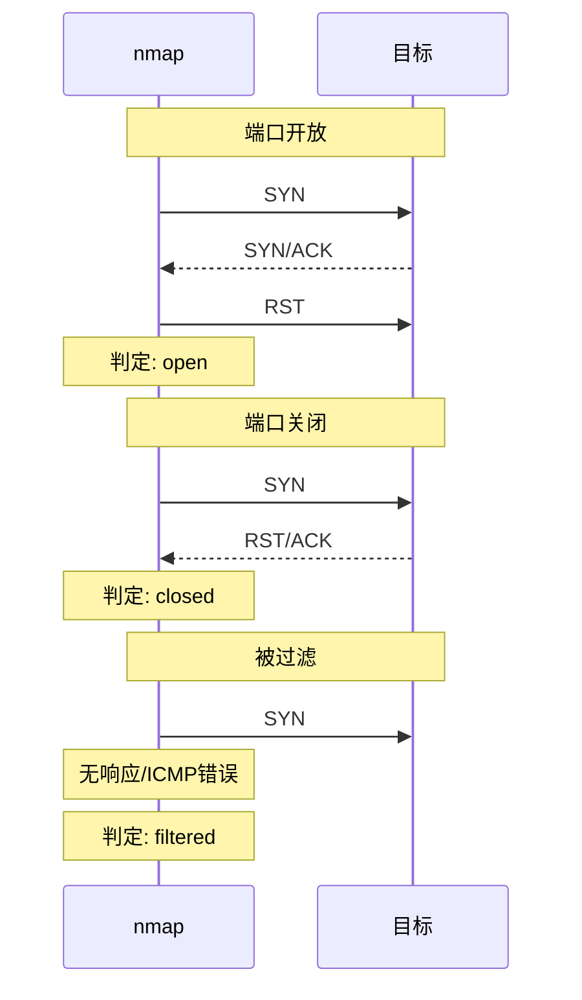
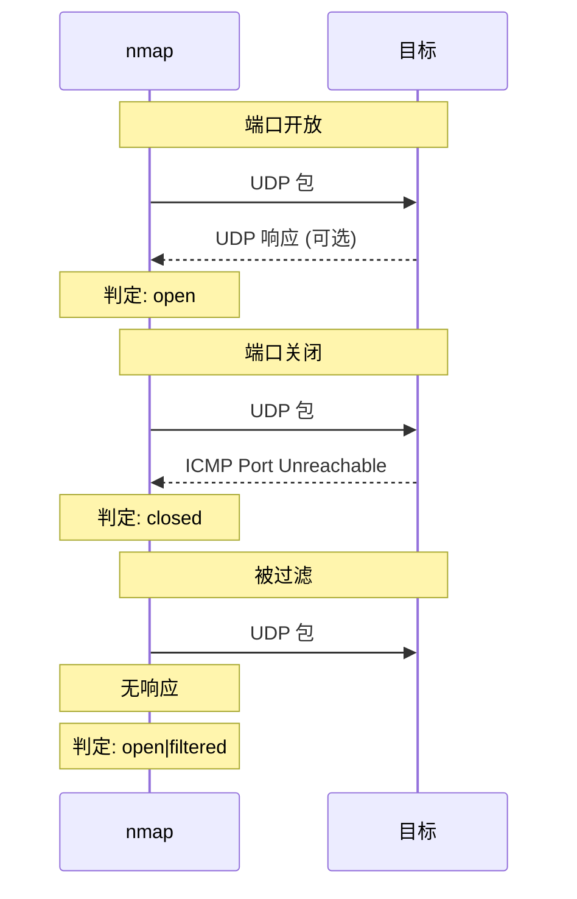

+++
title = "47. nmap网络扫描深度解析"
date = 2026-01-31
weight = 47000
description = "nmap深度解析：端口扫描原理、服务探测、脚本引擎、安全审计"
[taxonomies]
tags = ["Linux", "nmap", "网络", "扫描", "安全"]
+++

# nmap 网络扫描深度解析

本文深入解析 nmap（Network Mapper）工具的工作原理，包括端口扫描技术、服务探测、脚本引擎等核心技术。

---

## 一、nmap 概述

### 1.1 什么是 nmap

**nmap** 是最强大的网络扫描和安全审计工具，用于：
- 主机发现
- 端口扫描
- 服务和版本探测
- 操作系统检测
- 安全漏洞扫描（NSE）

### 1.2 核心功能

| 功能 | 说明 |
|------|------|
| 主机发现 | 发现网络中的活跃主机 |
| 端口扫描 | 确定端口开放状态 |
| 服务探测 | 识别运行的服务和版本 |
| OS 检测 | 推断操作系统类型 |
| 脚本扫描 | 使用 NSE 脚本进行深度探测 |

### 1.3 端口状态

| 状态 | 说明 |
|------|------|
| **open** | 端口开放，有服务监听 |
| **closed** | 端口可达但无服务监听 |
| **filtered** | 被防火墙过滤，无法确定 |
| **unfiltered** | 可达但无法确定开放/关闭 |
| **open\|filtered** | 开放或被过滤 |
| **closed\|filtered** | 关闭或被过滤 |

---

## 二、扫描技术原理

### 2.1 TCP SYN 扫描（-sS）



**特点**：
- 半开扫描，不完成 TCP 握手
- 速度快，隐蔽性好
- 需要 root 权限

### 2.2 TCP Connect 扫描（-sT）

```
完成完整的 TCP 三次握手
- 不需要 root 权限
- 速度慢，容易被检测
- 非 root 用户的默认方式
```

### 2.3 UDP 扫描（-sU）



### 2.4 其他扫描类型

| 扫描类型 | 选项 | 原理 | 特点 |
|----------|------|------|------|
| FIN 扫描 | `-sF` | 发送 FIN 包 | 绕过某些防火墙 |
| Xmas 扫描 | `-sX` | FIN+PSH+URG | 特征明显 |
| NULL 扫描 | `-sN` | 无标志位 | 绕过某些 IDS |
| ACK 扫描 | `-sA` | 发送 ACK | 探测防火墙规则 |
| Window 扫描 | `-sW` | 分析窗口大小 | 特定系统有效 |
| Maimon 扫描 | `-sM` | FIN/ACK | 少数系统有效 |

---

## 三、基本使用

### 3.1 安装

```bash
# Debian/Ubuntu
sudo apt install nmap

# CentOS/RHEL
sudo yum install nmap

# macOS
brew install nmap
```

### 3.2 基本扫描

```bash
# 扫描单个主机
nmap 192.168.1.1

# 扫描主机范围
nmap 192.168.1.1-254
nmap 192.168.1.0/24

# 扫描多个主机
nmap 192.168.1.1 192.168.1.2 192.168.1.3

# 从文件读取目标
nmap -iL hosts.txt

# 排除主机
nmap 192.168.1.0/24 --exclude 192.168.1.1
```

### 3.3 常用选项

| 选项 | 说明 | 示例 |
|------|------|------|
| `-p` | 指定端口 | `-p 22,80,443` |
| `-p-` | 所有端口 | `-p-` |
| `-F` | 快速扫描（100端口） | `-F` |
| `--top-ports` | 常用端口 | `--top-ports 1000` |
| `-sV` | 版本探测 | `-sV` |
| `-O` | OS 检测 | `-O` |
| `-A` | 全面扫描 | `-A` |
| `-T` | 速度模板 | `-T4` |
| `-v` | 详细输出 | `-v` |
| `-oN/-oX/-oG` | 输出格式 | `-oN scan.txt` |

### 3.4 速度模板

| 模板 | 名称 | 说明 |
|------|------|------|
| T0 | paranoid | 极慢，避免 IDS |
| T1 | sneaky | 慢，避免 IDS |
| T2 | polite | 降低负载 |
| T3 | normal | 默认 |
| T4 | aggressive | 快速 |
| T5 | insane | 极快，可能丢包 |

---

## 四、主机发现

### 4.1 发现技术

```bash
# Ping 扫描（仅发现主机）
nmap -sn 192.168.1.0/24

# 列出目标（不扫描）
nmap -sL 192.168.1.0/24

# 跳过主机发现（假设主机在线）
nmap -Pn 192.168.1.1

# ARP 扫描（局域网）
nmap -PR 192.168.1.0/24

# TCP SYN 发现
nmap -PS22,80,443 192.168.1.0/24

# TCP ACK 发现
nmap -PA80,443 192.168.1.0/24

# UDP 发现
nmap -PU53,161 192.168.1.0/24

# ICMP 发现
nmap -PE 192.168.1.0/24    # Echo
nmap -PP 192.168.1.0/24    # Timestamp
nmap -PM 192.168.1.0/24    # Netmask
```

### 4.2 主机发现脚本

```bash
#!/bin/bash
# host_discovery.sh

NETWORK=$1

echo "=== ARP Scan ==="
sudo nmap -sn -PR $NETWORK

echo ""
echo "=== TCP Syn Ping ==="
nmap -sn -PS22,80,443 $NETWORK

echo ""
echo "=== ICMP Echo ==="
nmap -sn -PE $NETWORK
```

---

## 五、端口扫描详解

### 5.1 端口指定

```bash
# 单个端口
nmap -p 22 host

# 端口范围
nmap -p 1-1000 host

# 多个端口
nmap -p 22,80,443,3306 host

# 所有端口
nmap -p- host
nmap -p 1-65535 host

# 常用端口
nmap --top-ports 100 host

# 服务名指定
nmap -p ssh,http,https host

# TCP 和 UDP
nmap -p T:22,80,U:53,161 host
```

### 5.2 扫描类型选择

```bash
# SYN 扫描（默认，需要 root）
sudo nmap -sS host

# Connect 扫描（不需要 root）
nmap -sT host

# UDP 扫描
sudo nmap -sU host

# TCP + UDP
sudo nmap -sS -sU host

# 组合扫描
sudo nmap -sS -sU -p T:22,80,443,U:53,161 host
```

### 5.3 典型扫描场景

```bash
# 快速扫描
nmap -F -T4 host

# 全面扫描
sudo nmap -sS -sV -O -A -p- host

# Web 服务器扫描
nmap -p 80,443,8080,8443 -sV host

# 数据库扫描
nmap -p 3306,5432,27017,6379,1521,1433 -sV host

# 完整审计
sudo nmap -sS -sU -sV -O -A --script=default,vuln -p- host
```

---

## 六、服务和版本探测

### 6.1 版本探测

```bash
# 基本版本探测
nmap -sV host

# 强度级别（0-9）
nmap -sV --version-intensity 5 host

# 轻量探测
nmap -sV --version-light host

# 深度探测
nmap -sV --version-all host
```

### 6.2 输出示例

```bash
$ nmap -sV 192.168.1.1

PORT     STATE SERVICE     VERSION
22/tcp   open  ssh         OpenSSH 8.2p1 Ubuntu 4ubuntu0.5
80/tcp   open  http        nginx 1.18.0
443/tcp  open  ssl/http    nginx 1.18.0
3306/tcp open  mysql       MySQL 8.0.28
```

### 6.3 操作系统检测

```bash
# OS 检测
sudo nmap -O host

# OS 检测 + 版本
sudo nmap -O -sV host

# 推测 OS（即使不确定）
sudo nmap -O --osscan-guess host

# 输出示例
Device type: general purpose
Running: Linux 4.X|5.X
OS CPE: cpe:/o:linux:linux_kernel:4 cpe:/o:linux:linux_kernel:5
OS details: Linux 4.15 - 5.6
```

---

## 七、Nmap 脚本引擎（NSE）

### 7.1 脚本类别

| 类别 | 说明 |
|------|------|
| auth | 认证相关 |
| broadcast | 广播发现 |
| brute | 暴力破解 |
| default | 默认脚本 |
| discovery | 信息发现 |
| dos | 拒绝服务测试 |
| exploit | 漏洞利用 |
| external | 外部服务查询 |
| fuzzer | 模糊测试 |
| intrusive | 侵入性测试 |
| malware | 恶意软件检测 |
| safe | 安全脚本 |
| version | 版本检测 |
| vuln | 漏洞检测 |

### 7.2 使用脚本

```bash
# 默认脚本
nmap -sC host
nmap --script=default host

# 指定脚本
nmap --script=http-title host
nmap --script=ssh-hostkey host

# 多个脚本
nmap --script=http-title,http-headers host

# 按类别
nmap --script=vuln host
nmap --script=safe host

# 通配符
nmap --script "http-*" host
nmap --script "ssh-*" host

# 组合
nmap --script "default and safe" host
nmap --script "vuln and not intrusive" host
```

### 7.3 常用脚本

```bash
# HTTP 信息
nmap --script=http-title,http-headers,http-methods host

# SSL 信息
nmap --script=ssl-cert,ssl-enum-ciphers -p 443 host

# SSH 信息
nmap --script=ssh-hostkey,ssh2-enum-algos -p 22 host

# DNS 信息
nmap --script=dns-brute,dns-zone-transfer host

# SMB 信息
nmap --script=smb-os-discovery,smb-security-mode host

# 漏洞扫描
nmap --script=vuln host
nmap --script=vulners host
```

### 7.4 脚本参数

```bash
# 传递参数
nmap --script=http-brute --script-args http-brute.path=/admin host
nmap --script=dns-brute --script-args dns-brute.threads=10 host

# 多个参数
nmap --script=http-brute --script-args 'http-brute.path=/admin,http-brute.threads=5' host
```

---

## 八、输出格式

### 8.1 输出选项

```bash
# 正常输出到文件
nmap -oN scan.txt host

# XML 输出
nmap -oX scan.xml host

# Grepable 输出
nmap -oG scan.grep host

# 全部格式
nmap -oA scan host  # 生成 scan.nmap, scan.xml, scan.gnmap

# 追加输出
nmap --append-output -oN scan.txt host
```

### 8.2 XML 处理

```bash
# 使用 xsltproc 转 HTML
xsltproc scan.xml -o scan.html

# 使用 Python 解析
python3 -c "import xml.etree.ElementTree as ET; tree = ET.parse('scan.xml'); print(tree.getroot())"
```

---

## 九、高级用法

### 9.1 防火墙/IDS 规避

```bash
# 分片
nmap -f host
nmap --mtu 24 host

# 诱饵
nmap -D RND:10 host
nmap -D 192.168.1.100,192.168.1.101,ME host

# 源端口伪装
nmap --source-port 53 host
nmap -g 80 host

# 随机顺序
nmap --randomize-hosts host

# 慢速扫描
nmap -T0 host
nmap --scan-delay 5s host

# MAC 欺骗（需要 root）
sudo nmap --spoof-mac 00:11:22:33:44:55 host
sudo nmap --spoof-mac Apple host
```

### 9.2 性能优化

```bash
# 并行扫描
nmap --min-parallelism 100 host
nmap --max-parallelism 10 host

# 超时设置
nmap --host-timeout 30m host
nmap --max-retries 2 host

# RTT 优化
nmap --min-rtt-timeout 100ms host
nmap --max-rtt-timeout 500ms host
nmap --initial-rtt-timeout 250ms host
```

### 9.3 IPv6 扫描

```bash
# IPv6 扫描
nmap -6 2001:db8::1
nmap -6 fe80::1%eth0
```

---

## 十、实战场景

### 10.1 内网资产发现

```bash
#!/bin/bash
# internal_scan.sh

NETWORK=$1
OUTPUT_DIR="scan_$(date +%Y%m%d_%H%M%S)"
mkdir -p $OUTPUT_DIR

echo "[*] Host Discovery..."
sudo nmap -sn -PR $NETWORK -oG $OUTPUT_DIR/hosts.gnmap

# 提取活跃主机
grep "Up" $OUTPUT_DIR/hosts.gnmap | awk '{print $2}' > $OUTPUT_DIR/live_hosts.txt

echo "[*] Port Scanning..."
sudo nmap -sS -sV -O -p- -iL $OUTPUT_DIR/live_hosts.txt \
    -oA $OUTPUT_DIR/full_scan

echo "[*] Scan complete. Results in $OUTPUT_DIR"
```

### 10.2 Web 应用扫描

```bash
# Web 服务发现
nmap -p 80,443,8080,8443 -sV --script=http-title,http-headers network/24

# Web 漏洞扫描
nmap -p 80,443 --script "http-vuln-*" target
```

### 10.3 安全审计报告

```bash
# 完整审计
sudo nmap -sS -sU -sV -O -A \
    --script "default,safe,vuln" \
    -p- \
    -oA audit_report \
    target

# 转换为 HTML 报告
xsltproc audit_report.xml -o audit_report.html
```

---

## 十一、与同类工具对比

| 特性 | nmap | masscan | zmap | unicornscan |
|------|------|---------|------|-------------|
| 速度 | 中等 | 极快 | 极快 | 快 |
| 准确性 | 高 | 中等 | 中等 | 中等 |
| 服务探测 | ✅ | ❌ | ❌ | 有限 |
| OS 探测 | ✅ | ❌ | ❌ | 有限 |
| 脚本引擎 | ✅ | ❌ | ❌ | ❌ |
| 学习曲线 | 中 | 低 | 低 | 中 |

---

## 十二、高频考点总结

| 考点 | 频率 | 关键知识 |
|------|------|----------|
| 扫描类型 | ★★★ | SYN、Connect、UDP 原理 |
| 端口状态 | ★★★ | open、closed、filtered |
| 常用选项 | ★★★ | -sS、-sV、-O、-p |
| NSE 脚本 | ★★☆ | 脚本类别、使用方法 |
| 规避技术 | ★★☆ | 分片、诱饵、慢速 |
| 输出格式 | ★★☆ | -oN、-oX、-oA |

---

## 相关文章

- [上一篇：ss网络连接状态深度解析](@/articles/linux/linux-46-ss网络连接状态深度解析.md)
- [网络安全基础](@/articles/security/sec-01-安全基础与威胁模型.md)
