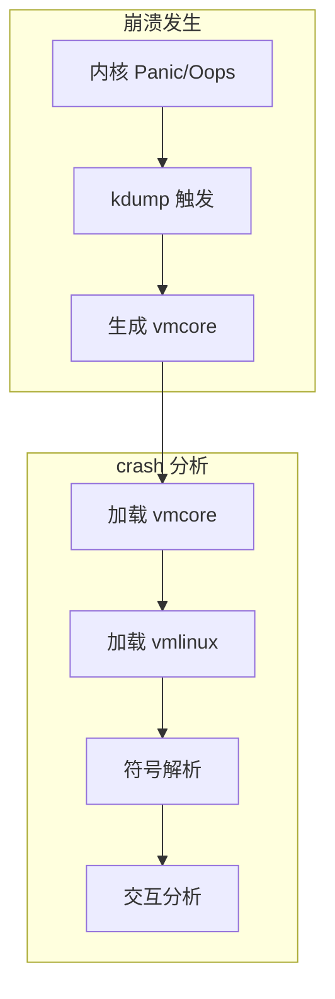

+++
title = "48.crash内核崩溃分析深度解析"
date = 2026-01-31
description = "crash深度解析：内核转储分析、vmcore调试、内核数据结构、故障排查"
[taxonomies]
tags = ["Linux", "crash", "内核", "调试", "vmcore"]
+++

# crash 内核崩溃分析深度解析

本文深入解析 crash 工具的工作原理，包括内核转储分析、vmcore 调试、内核数据结构分析等核心技术。

---

## 一、crash 概述

### 1.1 什么是 crash

**crash** 是 Linux 内核崩溃分析工具，用于：
- 分析内核崩溃转储（vmcore）
- 在线调试运行中的内核
- 分析内核数据结构
- 排查内核故障

### 1.2 核心功能

| 功能 | 说明 |
|------|------|
| vmcore 分析 | 分析 kdump 生成的转储 |
| 在线分析 | 分析运行中的内核（/proc/kcore） |
| 进程分析 | 查看进程状态、堆栈 |
| 内存分析 | 检查内存结构、slab |
| 设备分析 | 查看设备状态 |

### 1.3 工作原理



---

## 二、环境准备

### 2.1 安装 crash

```bash
# Debian/Ubuntu
sudo apt install crash

# CentOS/RHEL
sudo yum install crash

# 从源码编译
git clone https://github.com/crash-utility/crash.git
cd crash
make
```

### 2.2 配置 kdump

```bash
# 安装 kdump
sudo apt install kdump-tools       # Debian/Ubuntu
sudo yum install kexec-tools       # CentOS/RHEL

# 配置 grub 预留内存
# /etc/default/grub
GRUB_CMDLINE_LINUX="crashkernel=256M"

# 更新 grub
sudo update-grub

# 重启后启用 kdump
sudo systemctl enable kdump
sudo systemctl start kdump

# 验证
cat /sys/kernel/kexec_crash_loaded  # 应该是 1
```

### 2.3 获取调试符号

```bash
# CentOS/RHEL
sudo debuginfo-install kernel

# Ubuntu
# 添加 ddebs 仓库
echo "deb http://ddebs.ubuntu.com $(lsb_release -cs) main restricted universe multiverse" | \
    sudo tee /etc/apt/sources.list.d/ddebs.list
sudo apt update
sudo apt install linux-image-$(uname -r)-dbgsym

# 验证 vmlinux 位置
ls /usr/lib/debug/boot/vmlinux-$(uname -r)
```

---

## 三、基本使用

### 3.1 启动 crash

```bash
# 分析 vmcore
crash /usr/lib/debug/boot/vmlinux-$(uname -r) /var/crash/vmcore

# 分析运行中的内核
sudo crash /usr/lib/debug/boot/vmlinux-$(uname -r)

# 或指定 /proc/kcore
sudo crash /usr/lib/debug/boot/vmlinux-$(uname -r) /proc/kcore
```

### 3.2 基本命令

| 命令 | 说明 |
|------|------|
| `help` | 帮助信息 |
| `help cmd` | 命令帮助 |
| `sys` | 系统信息 |
| `bt` | 当前进程堆栈 |
| `ps` | 进程列表 |
| `log` | 内核日志 |
| `dmesg` | 同 log |
| `dis` | 反汇编 |
| `rd` | 读内存 |
| `struct` | 显示结构体 |
| `q` / `quit` | 退出 |

### 3.3 系统信息

```bash
crash> sys
      KERNEL: /usr/lib/debug/boot/vmlinux-5.4.0-89-generic
    DUMPFILE: /var/crash/202601311200/vmcore
        CPUS: 8
        DATE: Fri Jan 31 12:00:00 2026
      UPTIME: 15 days, 03:25:18
LOAD AVERAGE: 2.45, 1.89, 1.56
       TASKS: 542
    NODENAME: server01
     RELEASE: 5.4.0-89-generic
     VERSION: #100-Ubuntu SMP
     MACHINE: x86_64
      MEMORY: 16 GB
       PANIC: "BUG: kernel NULL pointer dereference"
```

---

## 四、崩溃分析

### 4.1 查看崩溃日志

```bash
crash> log
[    0.000000] Linux version 5.4.0-89-generic ...
...
[15432.123456] BUG: kernel NULL pointer dereference, address: 0000000000000008
[15432.123460] #PF: supervisor read access in kernel mode
[15432.123462] #PF: error_code(0x0000) - not-present page
[15432.123465] PGD 0 P4D 0
[15432.123470] Oops: 0000 [#1] SMP NOPTI
[15432.123475] CPU: 3 PID: 12345 Comm: my_process Tainted: G           OE
[15432.123480] RIP: 0010:my_driver_read+0x42/0x100 [my_driver]
```

### 4.2 分析崩溃堆栈

```bash
# 查看当前（崩溃时）的堆栈
crash> bt
PID: 12345  TASK: ffff9876543210  CPU: 3   COMMAND: "my_process"
 #0 [ffffc90001234500] machine_kexec at ffffffff81060000
 #1 [ffffc90001234550] __crash_kexec at ffffffff81120000
 #2 [ffffc90001234620] crash_kexec at ffffffff81120200
 #3 [ffffc90001234640] oops_end at ffffffff81030000
 #4 [ffffc90001234660] page_fault_oops at ffffffff81070000
 #5 [ffffc90001234720] exc_page_fault at ffffffff81a00000
 #6 [ffffc90001234750] asm_exc_page_fault at ffffffff81c00000
 #7 [ffffc90001234800] my_driver_read at ffffffffc0001042 [my_driver]
 #8 [ffffc90001234850] vfs_read at ffffffff81300000
 #9 [ffffc90001234880] ksys_read at ffffffff81300300
#10 [ffffc900012348c0] __x64_sys_read at ffffffff81300350
#11 [ffffc900012348d0] do_syscall_64 at ffffffff81003000
#12 [ffffc90001234900] entry_SYSCALL_64 after swapgs at ffffffff81c00100

# 查看带参数的堆栈
crash> bt -f
crash> bt -l    # 带行号
```

### 4.3 查看寄存器

```bash
crash> bt -r
    RAX: 0000000000000000  RBX: ffff9876543abc00  RCX: 0000000000000000
    RDX: 0000000000001000  RSI: 00007fff12345678  RDI: 0000000000000000
    RBP: ffffc90001234820  RSP: ffffc90001234800  R8:  0000000000000000
    R9:  0000000000000000  R10: 0000000000000000  R11: 0000000000000246
    R12: ffff9876543def00  R13: 0000000000001000  R14: 0000000000000000
    R15: 0000000000000000  RIP: ffffffffc0001042  RFLAGS: 00010246
    CS: 0010  SS: 0018
```

### 4.4 反汇编分析

```bash
# 反汇编函数
crash> dis my_driver_read
0xffffffffc0001000 <my_driver_read>:       push   rbp
0xffffffffc0001001 <my_driver_read+0x1>:   mov    rbp,rsp
0xffffffffc0001004 <my_driver_read+0x4>:   sub    rsp,0x30
...
0xffffffffc0001042 <my_driver_read+0x42>:  mov    rax,QWORD PTR [rdi+0x8]  # 崩溃位置
...

# 指定范围
crash> dis my_driver_read+0x40 5

# 反汇编地址
crash> dis -l ffffffffc0001042
```

---

## 五、进程分析

### 5.1 进程列表

```bash
crash> ps
   PID    PPID  CPU       TASK        ST  %MEM     VSZ    RSS  COMM
      1       0   0  ffff9876543210   IN   0.1  168432  11232  systemd
      2       0   1  ffff9876543320   IN   0.0       0      0  [kthreadd]
    542       1   2  ffff9876543430   IN   0.2  245678  34567  sshd
  12345     542   3  ffff9876543540   RU   0.5  123456  78901  my_process
...

# 过滤选项
crash> ps -k          # 只显示内核线程
crash> ps -u          # 只显示用户进程
crash> ps -c my_proc  # 按名称过滤
crash> ps -p 12345    # 按 PID
```

### 5.2 查看特定进程

```bash
# 切换到特定进程上下文
crash> set 12345
    PID: 12345
COMMAND: "my_process"
   TASK: ffff9876543540
    CPU: 3
  STATE: TASK_RUNNING

# 查看该进程堆栈
crash> bt

# 查看进程打开的文件
crash> files
```

### 5.3 分析死锁

```bash
# 查看所有 D 状态（不可中断睡眠）进程
crash> ps -l | grep UN

# 查看等待队列
crash> waitq

# 查看特定进程的等待信息
crash> bt 12345
```

---

## 六、内存分析

### 6.1 内存信息

```bash
crash> kmem -i
                 PAGES        TOTAL      PERCENTAGE
    TOTAL MEM  4194304       16 GB         ----
         FREE   524288        2 GB        12% of TOTAL MEM
         USED  3670016       14 GB        87% of TOTAL MEM
       SHARED   262144        1 GB         6% of TOTAL MEM
      BUFFERS    65536      256 MB         1% of TOTAL MEM
       CACHED  1048576        4 GB        25% of TOTAL MEM
         SLAB   131072      512 MB         3% of TOTAL MEM
```

### 6.2 Slab 分析

```bash
# Slab 缓存统计
crash> kmem -s
CACHE             OBJSIZE  ALLOCATED     TOTAL  SLABS  SSIZE  NAME
ffff888003c00000      192      15234     16000    400     4k  dentry
ffff888003c00100      704       8567      9000    300     4k  inode_cache
ffff888003c00200      256       3456      4000    125     4k  filp
...

# 特定 slab 详情
crash> kmem -S dentry
```

### 6.3 读取内存

```bash
# 读取指定地址
crash> rd ffff9876543210 10
ffff9876543210:  0000000000000000 0000000100000001
ffff9876543220:  ffff9876543abc00 0000000000000000
...

# 读取为特定类型
crash> rd -a ffff9876543210    # ASCII
crash> rd -s ffff9876543210    # 字符串
crash> rd -32 ffff9876543210   # 32 位
crash> rd -64 ffff9876543210   # 64 位
```

### 6.4 虚拟地址转换

```bash
# 虚拟地址转物理地址
crash> vtop ffff9876543210
VIRTUAL     PHYSICAL
ffff9876543210  123456789a

PAGE DIRECTORY: 0x7654321000
   PUD: 7654321fe8 => 6543210067
   PMD: 543210fd0 => 432109067
   PTE: 32109fc0 => 8000000123456067
 PAGE: 123456000

# 物理地址到虚拟地址
crash> ptov 123456789a
```

---

## 七、数据结构分析

### 7.1 查看结构体定义

```bash
# 查看结构体定义
crash> struct task_struct
struct task_struct {
    struct thread_info thread_info;
    volatile long state;
    void *stack;
    atomic_t usage;
    unsigned int flags;
    unsigned int ptrace;
    ...
    pid_t pid;
    pid_t tgid;
    ...
}
SIZE: 9024

# 查看特定字段偏移
crash> struct task_struct.pid
struct task_struct {
   [2296] pid_t pid;
}
```

### 7.2 查看结构体内容

```bash
# 查看特定地址的结构体
crash> struct task_struct ffff9876543540
struct task_struct {
  thread_info = {
    flags = 0,
  },
  state = 0,
  stack = 0xffffc90001230000,
  ...
  pid = 12345,
  tgid = 12345,
  ...
  comm = "my_process\000\000\000\000\000\000",
}

# 只查看特定字段
crash> struct task_struct.pid,comm ffff9876543540
  pid = 12345,
  comm = "my_process\000\000\000\000\000\000",
```

### 7.3 遍历链表

```bash
# 遍历 task_struct 链表
crash> list task_struct.tasks -s task_struct.pid,comm -H init_task

# 遍历自定义链表
crash> list my_struct.list -s my_struct.data -h ffff9876543000
```

---

## 八、常见崩溃分析

### 8.1 NULL 指针解引用

```bash
crash> log | grep -A 10 "NULL pointer"
BUG: kernel NULL pointer dereference, address: 0000000000000008

crash> bt
 #7 [ffffc90001234800] my_function at ffffffffc0001042

crash> dis my_function+0x42
0xffffffffc0001042:  mov rax, [rdi+0x8]  # rdi 为 NULL

# 解决：检查 rdi 来源，添加 NULL 检查
```

### 8.2 Use-After-Free

```bash
crash> log | grep -A 10 "slab-out-of-bounds"
KASAN: slab-out-of-bounds in my_function

crash> kmem ffff9876543000
  PAGE    ffff888012340000
  slab-free  # 已释放

# 解决：检查对象生命周期管理
```

### 8.3 死锁

```bash
# 找到 D 状态进程
crash> ps -l | grep UN
  12345  UN  my_process

crash> bt 12345
 #5 mutex_lock at ...
 #6 my_function_a at ...

crash> bt 12346
 #5 mutex_lock at ...
 #6 my_function_b at ...

# 分析锁依赖关系
```

### 8.4 栈溢出

```bash
crash> log | grep -A 5 "stack"
Kernel stack overflow
Process: my_process

crash> bt
# 非常深的调用栈或递归

# 解决：减少栈使用，避免递归
```

---

## 九、实用技巧

### 9.1 自动化脚本

```bash
# crash 输入文件
cat > crash_cmds.txt << 'EOF'
sys
log > /tmp/dmesg.txt
bt -a > /tmp/all_stacks.txt
ps -l > /tmp/processes.txt
kmem -i > /tmp/memory.txt
q
EOF

# 批量执行
crash vmlinux vmcore < crash_cmds.txt
```

### 9.2 扩展命令

```bash
# 加载扩展
crash> extend /path/to/extension.so

# 常用扩展
# gdb - 使用 GDB 命令
crash> gdb help

# trace - 追踪分析
crash> extend trace.so
crash> trace
```

### 9.3 搜索内存

```bash
# 搜索字符串
crash> search -s "error message"

# 搜索值
crash> search -x 0xdeadbeef

# 在特定范围搜索
crash> search -s "pattern" ffff888000000000-ffff8880ffffffff
```

---

## 十、与其他工具对比

| 特性 | crash | gdb | drgn |
|------|-------|-----|------|
| vmcore 分析 | ✅ | 有限 | ✅ |
| 在线分析 | ✅ | ❌ | ✅ |
| 内核专用 | ✅ | ❌ | ✅ |
| 脚本扩展 | 有限 | ✅ | Python |
| 学习曲线 | 高 | 中 | 中 |

---

## 十一、高频考点总结

| 考点 | 频率 | 关键知识 |
|------|------|----------|
| kdump 配置 | ★★★ | crashkernel、kdump 服务 |
| 基本命令 | ★★★ | bt、ps、log、dis |
| 堆栈分析 | ★★★ | 调用栈解读、寄存器 |
| 内存分析 | ★★☆ | kmem、struct、rd |
| 常见崩溃 | ★★★ | NULL 指针、UAF、死锁 |
| 符号解析 | ★★☆ | vmlinux、debuginfo |

---

## 相关文章

- [上一篇：nmap网络扫描深度解析](/articles/linux/linux-47-nmap网络扫描深度解析/)
- [Linux内核调试](/articles/linux/linux-08-性能分析与调试/)
