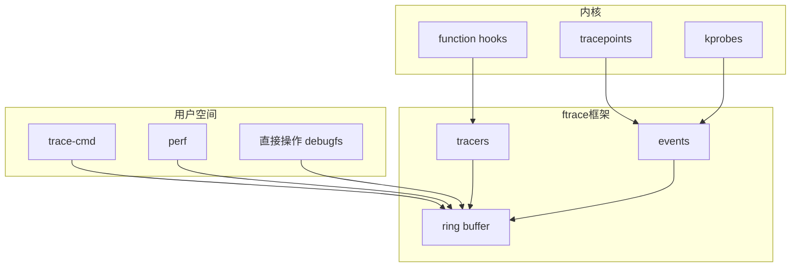
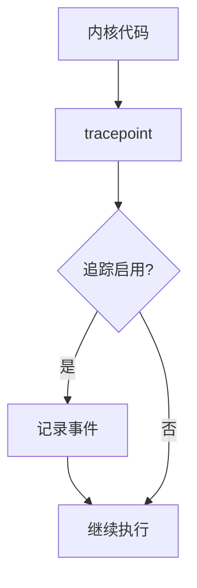

+++
title = "49. ftrace内核追踪深度解析"
date = 2026-01-31
weight = 49000
description = "ftrace深度解析：函数追踪、事件追踪、延迟分析、内核调试"
[taxonomies]
tags = ["Linux", "ftrace", "内核", "追踪", "调试"]
+++

# ftrace 内核追踪深度解析

本文深入解析 ftrace（Function Tracer）工具的工作原理，包括函数追踪、事件追踪、延迟分析等核心技术。

---

## 一、ftrace 概述

### 1.1 什么是 ftrace

**ftrace** 是 Linux 内核内置的追踪框架，用于：
- 追踪内核函数调用
- 分析内核事件
- 测量延迟
- 调试内核问题

### 1.2 核心功能

| 功能 | 说明 |
|------|------|
| 函数追踪 | 追踪内核函数调用 |
| 函数图追踪 | 显示函数调用图 |
| 事件追踪 | 追踪内核事件（tracepoint） |
| 延迟追踪 | 分析调度、中断延迟 |
| 堆栈追踪 | 记录调用堆栈 |

### 1.3 架构概览



---

## 二、工作原理

### 2.1 函数追踪原理

```
编译时：
- 每个函数入口插入 mcount/fentry 调用
- 使用 -pg 编译选项

运行时（未启用追踪）：
- mcount 调用被替换为 NOP 指令
- 零开销

运行时（启用追踪）：
- NOP 被替换回调用指令
- 跳转到 ftrace 处理函数
```

### 2.2 事件追踪原理



### 2.3 Ring Buffer

```
ftrace 使用 per-CPU ring buffer：
- 每个 CPU 独立的缓冲区
- 无锁写入（本地 CPU）
- 可配置大小
- 覆盖或丢弃策略
```

---

## 三、基本使用

### 3.1 debugfs 接口

```bash
# ftrace 目录
cd /sys/kernel/debug/tracing

# 主要文件
available_tracers    # 可用追踪器
current_tracer       # 当前追踪器
trace                # 追踪输出
trace_pipe           # 实时输出（消费式）
tracing_on           # 追踪开关
buffer_size_kb       # 缓冲区大小
available_events     # 可用事件
set_event           # 启用的事件
```

### 3.2 基本操作

```bash
# 查看可用追踪器
cat /sys/kernel/debug/tracing/available_tracers
# hwlat blk mmiotrace function_graph wakeup_rt wakeup function nop

# 启用函数追踪
echo function > /sys/kernel/debug/tracing/current_tracer

# 开始追踪
echo 1 > /sys/kernel/debug/tracing/tracing_on

# 查看追踪结果
cat /sys/kernel/debug/tracing/trace

# 停止追踪
echo 0 > /sys/kernel/debug/tracing/tracing_on

# 清除缓冲区
echo > /sys/kernel/debug/tracing/trace

# 重置追踪器
echo nop > /sys/kernel/debug/tracing/current_tracer
```

### 3.3 trace-cmd 工具

```bash
# 安装
sudo apt install trace-cmd    # Debian/Ubuntu
sudo yum install trace-cmd    # CentOS/RHEL

# 基本用法
# 记录函数追踪
sudo trace-cmd record -p function -c sleep 1

# 查看结果
trace-cmd report

# 记录事件
sudo trace-cmd record -e sched_switch sleep 1

# 函数图追踪
sudo trace-cmd record -p function_graph -c ls
```

---

## 四、追踪器类型

### 4.1 函数追踪器（function）

```bash
# 启用
echo function > /sys/kernel/debug/tracing/current_tracer

# 过滤特定函数
echo 'tcp_*' > /sys/kernel/debug/tracing/set_ftrace_filter
echo 'do_sys_open' >> /sys/kernel/debug/tracing/set_ftrace_filter

# 排除函数
echo '!tcp_v4_rcv' >> /sys/kernel/debug/tracing/set_ftrace_filter

# 清除过滤器
echo > /sys/kernel/debug/tracing/set_ftrace_filter

# 只追踪特定进程
echo $$ > /sys/kernel/debug/tracing/set_ftrace_pid

# 输出示例
#           TASK-PID     CPU#  TIMESTAMP  FUNCTION
#              | |         |        |         |
           bash-1234    [001] 12345.678901: tcp_sendmsg <-sock_sendmsg
```

### 4.2 函数图追踪器（function_graph）

```bash
# 启用
echo function_graph > /sys/kernel/debug/tracing/current_tracer

# 设置最大深度
echo 5 > /sys/kernel/debug/tracing/max_graph_depth

# 过滤函数
echo 'do_sys_open' > /sys/kernel/debug/tracing/set_graph_function

# 输出示例
#  CPU  DURATION                  FUNCTION CALLS
#  |     |   |                     |   |   |   |
   0)               |  do_sys_open() {
   0)               |    getname() {
   0)               |      getname_flags() {
   0)   0.401 us    |        kmem_cache_alloc();
   0)   0.289 us    |        __check_object_size();
   0)   1.312 us    |      }
   0)   1.684 us    |    }
   0)               |    do_filp_open() {
   0)   ...
   0) ! 125.642 us  |  }
```

### 4.3 调度延迟追踪器

```bash
# wakeup - 普通任务唤醒延迟
echo wakeup > /sys/kernel/debug/tracing/current_tracer

# wakeup_rt - 实时任务唤醒延迟
echo wakeup_rt > /sys/kernel/debug/tracing/current_tracer

# 查看最大延迟
cat /sys/kernel/debug/tracing/tracing_max_latency
```

### 4.4 硬件延迟追踪器

```bash
# hwlat - 硬件导致的延迟
echo hwlat > /sys/kernel/debug/tracing/current_tracer

# 设置检测参数
echo 1000 > /sys/kernel/debug/tracing/hwlat_detector/width
echo 10000 > /sys/kernel/debug/tracing/hwlat_detector/window
```

---

## 五、事件追踪

### 5.1 查看可用事件

```bash
# 所有事件
cat /sys/kernel/debug/tracing/available_events

# 按类别
ls /sys/kernel/debug/tracing/events/
# block  ext4  irq  kmem  net  sched  signal  syscalls  ...

# 类别下的事件
ls /sys/kernel/debug/tracing/events/sched/
# sched_switch  sched_wakeup  sched_process_fork  ...
```

### 5.2 启用事件

```bash
# 启用单个事件
echo sched_switch > /sys/kernel/debug/tracing/set_event

# 启用多个事件
echo 'sched_switch sched_wakeup' > /sys/kernel/debug/tracing/set_event

# 启用整个类别
echo 'sched:*' > /sys/kernel/debug/tracing/set_event

# 通过 enable 文件
echo 1 > /sys/kernel/debug/tracing/events/sched/sched_switch/enable

# 清除所有事件
echo > /sys/kernel/debug/tracing/set_event
```

### 5.3 事件过滤

```bash
# 查看过滤字段
cat /sys/kernel/debug/tracing/events/sched/sched_switch/format

# 设置过滤器
echo 'prev_comm == "my_process"' > /sys/kernel/debug/tracing/events/sched/sched_switch/filter

# 复杂过滤
echo 'prev_pid > 1000 && next_pid < 2000' > /sys/kernel/debug/tracing/events/sched/sched_switch/filter

# 清除过滤器
echo 0 > /sys/kernel/debug/tracing/events/sched/sched_switch/filter
```

### 5.4 常用事件类别

| 类别 | 说明 | 常用事件 |
|------|------|----------|
| sched | 调度 | sched_switch, sched_wakeup |
| syscalls | 系统调用 | sys_enter_*, sys_exit_* |
| irq | 中断 | irq_handler_entry/exit |
| block | 块设备 | block_rq_issue, block_rq_complete |
| net | 网络 | net_dev_xmit, netif_receive_skb |
| kmem | 内存 | kmalloc, kfree |

---

## 六、高级用法

### 6.1 堆栈追踪

```bash
# 启用堆栈追踪
echo 1 > /sys/kernel/debug/tracing/options/stacktrace

# 或使用 trace-cmd
trace-cmd record -p function -l 'tcp_sendmsg' --func-stack

# 输出包含调用栈
```

### 6.2 函数执行时间过滤

```bash
# 只记录执行时间超过阈值的函数
echo 100 > /sys/kernel/debug/tracing/tracing_thresh  # 100 微秒
echo function_graph > /sys/kernel/debug/tracing/current_tracer
```

### 6.3 触发器

```bash
# 在特定事件触发时执行动作
cd /sys/kernel/debug/tracing/events/sched/sched_switch

# 记录堆栈
echo 'stacktrace' > trigger

# 记录快照
echo 'snapshot' > trigger

# 启用其他追踪器
echo 'enable_event:kmem:kmalloc' > trigger

# 查看触发器
cat trigger

# 清除触发器
echo '!stacktrace' > trigger
```

### 6.4 直方图

```bash
# 创建直方图
echo 'hist:key=next_pid:vals=hitcount' > \
    /sys/kernel/debug/tracing/events/sched/sched_switch/trigger

# 查看结果
cat /sys/kernel/debug/tracing/events/sched/sched_switch/hist

# 复杂直方图
echo 'hist:key=next_comm.execname:vals=hitcount:sort=hitcount.descending' > trigger
```

### 6.5 Kprobes

```bash
# 添加 kprobe
echo 'p:myprobe do_sys_open filename=+0(%si):string' >> \
    /sys/kernel/debug/tracing/kprobe_events

# 启用
echo 1 > /sys/kernel/debug/tracing/events/kprobes/myprobe/enable

# 查看结果
cat /sys/kernel/debug/tracing/trace

# 删除
echo '-:myprobe' >> /sys/kernel/debug/tracing/kprobe_events
```

---

## 七、实战场景

### 7.1 分析调度延迟

```bash
#!/bin/bash
# sched_latency.sh

cd /sys/kernel/debug/tracing

# 清空
echo > trace
echo nop > current_tracer

# 启用调度事件
echo sched_switch > set_event
echo sched_wakeup >> set_event

# 开始追踪
echo 1 > tracing_on
sleep 5
echo 0 > tracing_on

# 分析
cat trace | grep "my_process"
```

### 7.2 追踪系统调用

```bash
# 使用 trace-cmd
sudo trace-cmd record -e 'syscalls:sys_enter_open*' -p 1234

# 或直接
echo 'syscalls:sys_enter_openat' > /sys/kernel/debug/tracing/set_event
echo $$ > /sys/kernel/debug/tracing/set_event_pid
```

### 7.3 分析 IO 延迟

```bash
#!/bin/bash
# io_latency.sh

cd /sys/kernel/debug/tracing

echo > trace
echo 'block:block_rq_issue' > set_event
echo 'block:block_rq_complete' >> set_event

echo 1 > tracing_on
sleep 10
echo 0 > tracing_on

# 计算延迟
cat trace | awk '
    /block_rq_issue/ { issue[$5] = $4 }
    /block_rq_complete/ {
        if ($5 in issue) {
            lat = $4 - issue[$5]
            print "Latency:", lat, "us"
        }
    }
'
```

### 7.4 函数执行时间分析

```bash
# 使用 function_graph
echo function_graph > /sys/kernel/debug/tracing/current_tracer
echo tcp_sendmsg > /sys/kernel/debug/tracing/set_graph_function
echo 1 > /sys/kernel/debug/tracing/tracing_on

# 执行测试
# ...

echo 0 > /sys/kernel/debug/tracing/tracing_on
cat /sys/kernel/debug/tracing/trace
```

---

## 八、实用脚本

### 8.1 通用追踪脚本

```bash
#!/bin/bash
# ftrace_helper.sh

TRACE_DIR="/sys/kernel/debug/tracing"

start_trace() {
    echo > $TRACE_DIR/trace
    echo 1 > $TRACE_DIR/tracing_on
}

stop_trace() {
    echo 0 > $TRACE_DIR/tracing_on
}

set_tracer() {
    echo $1 > $TRACE_DIR/current_tracer
}

set_filter() {
    echo "$1" > $TRACE_DIR/set_ftrace_filter
}

show_trace() {
    cat $TRACE_DIR/trace
}

reset() {
    echo > $TRACE_DIR/trace
    echo > $TRACE_DIR/set_ftrace_filter
    echo > $TRACE_DIR/set_event
    echo nop > $TRACE_DIR/current_tracer
}

case "$1" in
    start) start_trace ;;
    stop) stop_trace ;;
    show) show_trace ;;
    reset) reset ;;
    *) echo "Usage: $0 {start|stop|show|reset}" ;;
esac
```

### 8.2 延迟监控脚本

```bash
#!/bin/bash
# latency_monitor.sh

THRESHOLD_US=1000  # 1ms

cd /sys/kernel/debug/tracing

echo function_graph > current_tracer
echo $THRESHOLD_US > tracing_thresh
echo 1 > tracing_on

echo "Monitoring for latencies > ${THRESHOLD_US}us..."
echo "Press Ctrl+C to stop"

trap "echo 0 > tracing_on; exit" INT

while true; do
    cat trace_pipe
done
```

---

## 九、与其他工具对比

| 特性 | ftrace | perf | bpftrace | SystemTap |
|------|--------|------|----------|-----------|
| 内核内置 | ✅ | ✅ | ❌ | ❌ |
| 开销 | 低 | 低 | 极低 | 中 |
| 灵活性 | 中 | 中 | 高 | 高 |
| 学习曲线 | 中 | 中 | 中 | 高 |
| 编程能力 | 弱 | 弱 | 强 | 强 |

---

## 十、高频考点总结

| 考点 | 频率 | 关键知识 |
|------|------|----------|
| 追踪器类型 | ★★★ | function、function_graph、nop |
| 事件追踪 | ★★★ | set_event、事件过滤 |
| 函数过滤 | ★★☆ | set_ftrace_filter |
| debugfs 接口 | ★★★ | trace、trace_pipe、tracing_on |
| trace-cmd | ★★☆ | record、report |
| 实战应用 | ★★☆ | 延迟分析、调度追踪 |

---

## 相关文章

- [上一篇：crash内核崩溃分析深度解析](@/articles/linux/linux-48-crash内核崩溃分析深度解析.md)
- [eBPF技术深度解析](@/articles/linux/linux-35-eBPF技术深度解析.md)
- [perf性能分析工具深度解析](@/articles/linux/linux-37-perf性能分析工具深度解析.md)
