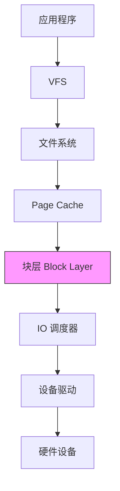
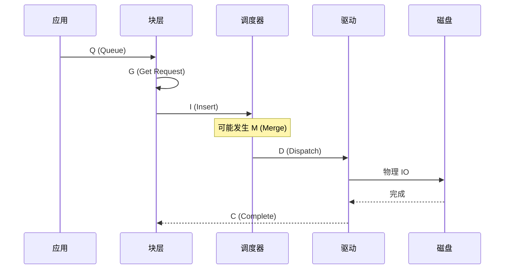

+++
title = "51. blktrace块设备追踪深度解析"
date = 2026-01-31
weight = 51000
description = "blktrace深度解析：块设备IO追踪、IO栈分析、延迟诊断"
[taxonomies]
tags = ["Linux", "blktrace", "IO", "块设备", "性能"]
+++

# blktrace 块设备追踪深度解析

本文深入解析 blktrace 工具的工作原理，包括块设备 IO 追踪、IO 栈分析、延迟诊断等核心技术。

---

## 一、blktrace 概述

### 1.1 什么是 blktrace

**blktrace** 是 Linux 块层 IO 追踪工具，用于：
- 追踪块设备 IO 操作
- 分析 IO 路径延迟
- 诊断存储性能问题
- 可视化 IO 模式

### 1.2 IO 栈层次



**blktrace 追踪块层（Block Layer）的事件**

---

## 二、工作原理

### 2.1 事件类型

| 事件 | 代码 | 说明 |
|------|------|------|
| Q | Queue | 请求进入队列 |
| G | Get Request | 分配 request 结构 |
| I | Insert | 插入 IO 调度器 |
| D | Dispatch | 发送到驱动 |
| C | Complete | IO 完成 |
| M | Merge | 请求合并 |
| R | Requeue | 重新排队 |
| P | Plug | 队列插入 |
| U | Unplug | 队列拔出 |

### 2.2 IO 生命周期



---

## 三、基本使用

### 3.1 安装

```bash
# Debian/Ubuntu
sudo apt install blktrace

# CentOS/RHEL
sudo yum install blktrace
```

### 3.2 基本命令

```bash
# 追踪并实时显示
sudo blktrace -d /dev/sda -o - | blkparse -i -

# 追踪到文件
sudo blktrace -d /dev/sda -o trace

# 解析追踪文件
blkparse -i trace

# 追踪多个设备
sudo blktrace -d /dev/sda -d /dev/sdb -o trace

# 指定追踪时间
sudo blktrace -d /dev/sda -w 10 -o trace
```

### 3.3 常用选项

| 选项 | 说明 | 示例 |
|------|------|------|
| `-d device` | 指定设备 | `-d /dev/sda` |
| `-o file` | 输出文件 | `-o trace` |
| `-w seconds` | 追踪时长 | `-w 30` |
| `-a action` | 过滤动作 | `-a issue -a complete` |
| `-n buffers` | 缓冲区数量 | `-n 16` |
| `-b size` | 缓冲区大小 | `-b 512` |

---

## 四、输出解读

### 4.1 基本输出格式

```bash
$ blkparse -i trace
  8,0    0        1     0.000000000  1234  Q   W 12345678 + 8 [my_process]
  8,0    0        2     0.000001234  1234  G   W 12345678 + 8 [my_process]
  8,0    0        3     0.000002345  1234  I   W 12345678 + 8 [my_process]
  8,0    0        4     0.000010000  1234  D   W 12345678 + 8 [my_process]
  8,0    0        5     0.001234567     0  C   W 12345678 + 8 [0]
```

**字段说明**：

| 位置 | 说明 | 示例 |
|------|------|------|
| 1 | 设备号 (major,minor) | 8,0 |
| 2 | CPU | 0 |
| 3 | 序列号 | 1, 2, 3... |
| 4 | 时间戳 | 0.000000000 |
| 5 | PID | 1234 |
| 6 | 事件类型 | Q, G, I, D, C |
| 7 | 读写方向 | R=读, W=写 |
| 8 | 起始扇区 | 12345678 |
| 9 | 扇区数 | + 8 |
| 10 | 进程名 | [my_process] |

### 4.2 计算延迟

```bash
# Q -> D 延迟（块层处理时间）
Q 时间: 0.000000000
D 时间: 0.000010000
延迟 = 10 微秒

# D -> C 延迟（设备处理时间）
D 时间: 0.000010000
C 时间: 0.001234567
延迟 = 1.224 毫秒

# 总延迟 Q -> C
总延迟 = 1.234 毫秒
```

---

## 五、高级分析

### 5.1 btt - 块追踪分析

```bash
# 生成统计报告
blkparse -i trace -d trace.bin
btt -i trace.bin

# 输出示例
==================== All Coverage ====================

           DEV |       Q2C       D2C       Q2D
-------------- | --------- --------- ---------
         (8,0) |   1.2345    0.9876    0.2469

==================== Device Overhead ====================

       DEV |   Q2G   G2I   I2D   D2C
---------- | ----- ----- ----- -----
     (8,0) | 0.001 0.002 0.244 0.988
```

**指标说明**：

| 指标 | 说明 |
|------|------|
| Q2C | 总延迟（Queue to Complete） |
| D2C | 设备延迟（Dispatch to Complete） |
| Q2D | 块层延迟（Queue to Dispatch） |
| Q2G | 请求分配时间 |
| G2I | 插入调度器时间 |
| I2D | 调度等待时间 |

### 5.2 可视化

```bash
# 生成 IO 分布图
btt -i trace.bin -l trace_latency

# 生成时序图
bno_plot.py trace_bno.dat

# 使用 iowatcher
sudo apt install iowatcher
iowatcher -t trace -o trace.svg
```

### 5.3 过滤特定操作

```bash
# 只追踪读操作
sudo blktrace -d /dev/sda -a read -o trace

# 只追踪写操作
sudo blktrace -d /dev/sda -a write -o trace

# 只追踪 issue 和 complete
sudo blktrace -d /dev/sda -a issue -a complete -o trace

# 追踪同步 IO
sudo blktrace -d /dev/sda -a sync -o trace
```

---

## 六、实战场景

### 6.1 诊断 IO 延迟

```bash
#!/bin/bash
# io_latency.sh

DEVICE=$1
DURATION=${2:-30}

echo "Tracing $DEVICE for $DURATION seconds..."

# 追踪
sudo blktrace -d $DEVICE -w $DURATION -o trace

# 解析
blkparse -i trace -d trace.bin

# 分析
btt -i trace.bin

# 清理
rm -f trace.* trace.bin
```

### 6.2 分析 IO 模式

```bash
# 生成 IO 模式报告
blkparse -i trace | awk '
    /Q.*R/ { reads++ }
    /Q.*W/ { writes++ }
    /Q/ {
        total++
        sectors += $8
    }
    END {
        print "Total IOs:", total
        print "Reads:", reads
        print "Writes:", writes
        print "Total sectors:", sectors
        print "Average size:", sectors/total * 512, "bytes"
    }
'
```

### 6.3 实时监控

```bash
#!/bin/bash
# io_monitor.sh

DEVICE=$1

sudo blktrace -d $DEVICE -o - | blkparse -i - | awk '
    {
        if ($6 == "D") {
            issue[$8] = $4
        }
        if ($6 == "C" && $8 in issue) {
            lat = $4 - issue[$8]
            if (lat > 0.001) {  # > 1ms
                print "High latency:", lat * 1000, "ms at sector", $8
            }
            delete issue[$8]
        }
    }
'
```

---

## 七、与其他工具配合

### 7.1 与 iostat 配合

```bash
# 同时运行 iostat 和 blktrace
iostat -x 1 > iostat.log &
sudo blktrace -d /dev/sda -w 60 -o trace
kill %1

# 对比分析
```

### 7.2 与 fio 配合

```bash
# 在 fio 测试时追踪
sudo blktrace -d /dev/sda -o trace &
fio test.fio
killall blktrace

blkparse -i trace | less
```

---

## 八、与同类工具对比

| 特性 | blktrace | iostat | iotop | bpftrace |
|------|----------|--------|-------|----------|
| 粒度 | IO 级别 | 设备级别 | 进程级别 | 可定制 |
| 延迟分析 | ✅ | ❌ | ❌ | ✅ |
| 实时性 | ✅ | ✅ | ✅ | ✅ |
| 开销 | 中 | 低 | 低 | 低 |
| 可视化 | ✅ | ❌ | ❌ | ❌ |

---

## 九、高频考点总结

| 考点 | 频率 | 关键知识 |
|------|------|----------|
| 事件类型 | ★★★ | Q, G, I, D, C, M |
| 延迟分析 | ★★★ | Q2C, D2C, Q2D |
| 基本用法 | ★★☆ | blktrace, blkparse, btt |
| IO 栈理解 | ★★☆ | 块层在 IO 栈中的位置 |
| 输出解读 | ★★☆ | 字段含义、延迟计算 |

---

## 相关文章

- [上一篇：lsof进程分析深度解析](@/articles/linux/linux-50-lsof进程分析深度解析.md)
- [fio磁盘IO性能测试深度解析](@/articles/linux/linux-42-fio磁盘IO性能测试深度解析.md)
