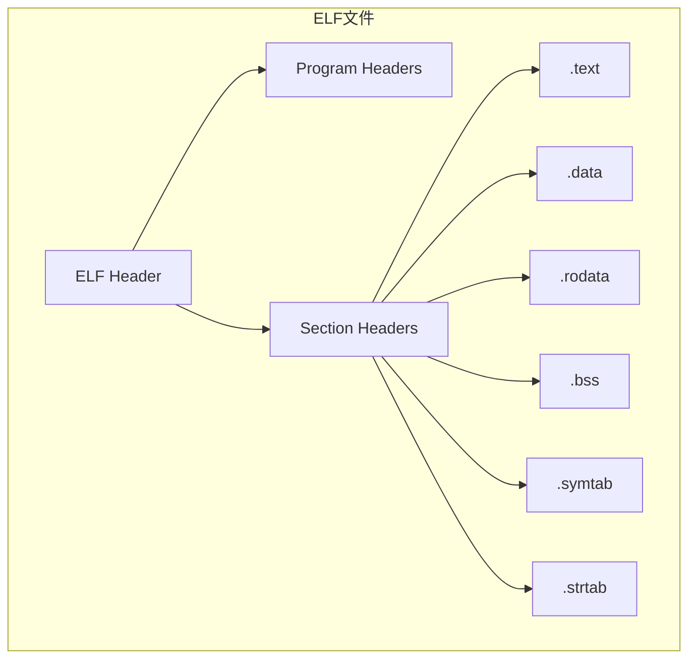

+++
title = "54.objdump/readelf二进制分析深度解析"
date = 2026-01-31
description = "objdump/readelf深度解析：ELF格式、反汇编、符号表、调试信息"
[taxonomies]
tags = ["Linux", "objdump", "readelf", "ELF", "逆向"]
+++

# objdump/readelf 二进制分析深度解析

本文深入解析 objdump 和 readelf 工具的使用，包括 ELF 格式分析、反汇编、符号表等核心技术。

---

## 一、概述

### 1.1 工具简介

| 工具 | 说明 | 用途 |
|------|------|------|
| **readelf** | ELF 文件分析 | 查看 ELF 结构 |
| **objdump** | 目标文件分析 | 反汇编、符号查看 |
| **nm** | 符号表查看 | 快速查看符号 |
| **ldd** | 动态库依赖 | 查看共享库 |

### 1.2 ELF 文件结构



---

## 二、readelf 使用

### 2.1 基本选项

| 选项 | 说明 |
|------|------|
| `-h` | ELF 头 |
| `-l` | 程序头 |
| `-S` | 节头 |
| `-s` | 符号表 |
| `-r` | 重定位 |
| `-d` | 动态段 |
| `-n` | 注释 |
| `-a` | 全部信息 |
| `-W` | 宽格式输出 |

### 2.2 查看 ELF 头

```bash
$ readelf -h /bin/ls
ELF Header:
  Magic:   7f 45 4c 46 02 01 01 00 00 00 00 00 00 00 00 00
  Class:                             ELF64
  Data:                              2's complement, little endian
  Version:                           1 (current)
  OS/ABI:                            UNIX - System V
  ABI Version:                       0
  Type:                              DYN (Position-Independent Executable file)
  Machine:                           Advanced Micro Devices X86-64
  Version:                           0x1
  Entry point address:               0x6a50
  Start of program headers:          64 (bytes into file)
  Start of section headers:          140256 (bytes into file)
  Flags:                             0x0
  Size of this header:               64 (bytes)
  Size of program headers:           56 (bytes)
  Number of program headers:         13
  Size of section headers:           64 (bytes)
  Number of section headers:         30
  Section header string table index: 29
```

### 2.3 查看节头

```bash
$ readelf -S /bin/ls
There are 30 section headers, starting at offset 0x22380:

Section Headers:
  [Nr] Name              Type             Address           Offset
       Size              EntSize          Flags  Link  Info  Align
  [ 0]                   NULL             0000000000000000  00000000
       0000000000000000  0000000000000000           0     0     0
  [ 1] .interp           PROGBITS         0000000000000318  00000318
       000000000000001c  0000000000000000   A       0     0     1
  [13] .text             PROGBITS         0000000000006020  00006020
       0000000000012c82  0000000000000000  AX       0     0     16
  [24] .data             PROGBITS         0000000000025000  00024000
       0000000000000268  0000000000000000  WA       0     0     32
  [25] .bss              NOBITS           0000000000025280  00024268
       0000000000001308  0000000000000000  WA       0     0     32
```

### 2.4 查看符号表

```bash
$ readelf -s /bin/ls | head -20
Symbol table '.dynsym' contains 127 entries:
   Num:    Value          Size Type    Bind   Vis      Ndx Name
     0: 0000000000000000     0 NOTYPE  LOCAL  DEFAULT  UND
     1: 0000000000000000     0 FUNC    GLOBAL DEFAULT  UND __ctype_toupper_loc@GLIBC_2.3
     2: 0000000000000000     0 FUNC    GLOBAL DEFAULT  UND __uflow@GLIBC_2.2.5
     3: 0000000000000000     0 FUNC    GLOBAL DEFAULT  UND getenv@GLIBC_2.2.5
```

### 2.5 查看动态段

```bash
$ readelf -d /bin/ls
Dynamic section at offset 0x23c88 contains 27 entries:
  Tag        Type                         Name/Value
 0x0000000000000001 (NEEDED)             Shared library: [libselinux.so.1]
 0x0000000000000001 (NEEDED)             Shared library: [libc.so.6]
 0x000000000000000c (INIT)               0x4000
 0x000000000000000d (FINI)               0x18b44
```

---

## 三、objdump 使用

### 3.1 基本选项

| 选项 | 说明 |
|------|------|
| `-d` | 反汇编代码段 |
| `-D` | 反汇编所有段 |
| `-t` | 符号表 |
| `-T` | 动态符号表 |
| `-r` | 重定位 |
| `-R` | 动态重定位 |
| `-x` | 所有头信息 |
| `-s` | 所有段内容 |
| `-S` | 混合源码（需要 -g） |
| `-C` | C++ 符号解码 |
| `-M intel` | Intel 语法 |

### 3.2 反汇编

```bash
# 反汇编代码段
objdump -d /bin/ls | head -50

# Intel 语法
objdump -d -M intel /bin/ls

# 混合源码
objdump -dS ./program    # 需要 -g 编译

# 反汇编特定函数
objdump -d /bin/ls | grep -A 20 '<main>:'

# 反汇编特定段
objdump -d -j .text /bin/ls
```

### 3.3 查看符号

```bash
# 符号表
objdump -t /bin/ls

# 动态符号表
objdump -T /bin/ls

# 解码 C++ 符号
objdump -t -C ./cpp_program
```

### 3.4 查看段内容

```bash
# 所有段内容
objdump -s /bin/ls

# 特定段
objdump -s -j .rodata /bin/ls

# 十六进制显示
objdump -s -j .text /bin/ls | head -20
```

---

## 四、nm 使用

### 4.1 基本用法

```bash
# 查看符号
nm program

# 仅显示外部符号
nm -g program

# 按地址排序
nm -n program

# 显示符号大小
nm -S program

# 解码 C++ 符号
nm -C program

# 显示未定义符号
nm -u program
```

### 4.2 符号类型

| 类型 | 说明 |
|------|------|
| T/t | 代码段（.text） |
| D/d | 已初始化数据（.data） |
| B/b | 未初始化数据（.bss） |
| R/r | 只读数据（.rodata） |
| U | 未定义符号 |
| W/w | 弱符号 |
| A | 绝对符号 |

**大写 = 全局，小写 = 局部**

---

## 五、ldd 使用

### 5.1 基本用法

```bash
# 查看依赖
ldd /bin/ls

# 详细信息
ldd -v /bin/ls

# 未使用的依赖
ldd -u /bin/ls
```

### 5.2 输出示例

```bash
$ ldd /bin/ls
    linux-vdso.so.1 (0x00007ffee8bfe000)
    libselinux.so.1 => /lib/x86_64-linux-gnu/libselinux.so.1 (0x00007f1234560000)
    libc.so.6 => /lib/x86_64-linux-gnu/libc.so.6 (0x00007f1234350000)
    libpcre2-8.so.0 => /lib/x86_64-linux-gnu/libpcre2-8.so.0 (0x00007f12342b0000)
    /lib64/ld-linux-x86-64.so.2 (0x00007f12347a0000)
```

### 5.3 安全注意事项

```bash
# ldd 可能执行代码，对不信任的文件使用：
objdump -p /suspicious/binary | grep NEEDED
readelf -d /suspicious/binary | grep NEEDED
```

---

## 六、实战应用

### 6.1 分析函数调用

```bash
# 查找函数
nm program | grep function_name

# 查看函数汇编
objdump -d program | grep -A 30 '<function_name>:'

# 查看调用关系
objdump -d program | grep 'call.*function_name'
```

### 6.2 查找字符串

```bash
# 使用 strings
strings /bin/ls | grep -i error

# 查看 .rodata 段
objdump -s -j .rodata /bin/ls
```

### 6.3 分析共享库

```bash
# 导出的符号
nm -D libexample.so

# 需要的符号
nm -u libexample.so

# GOT/PLT
objdump -d -j .plt libexample.so
readelf -r libexample.so
```

### 6.4 调试信息

```bash
# 检查是否有调试信息
readelf -S program | grep debug

# DWARF 信息
readelf --debug-dump=info program

# 行号信息
readelf --debug-dump=line program
```

---

## 七、实用脚本

### 7.1 符号查找

```bash
#!/bin/bash
# find_symbol.sh

SYMBOL=$1
DIRS=${2:-"/usr/lib /lib"}

for dir in $DIRS; do
    find $dir -name "*.so*" -exec sh -c '
        if nm -D "$1" 2>/dev/null | grep -q "$2"; then
            echo "$1: $2"
        fi
    ' _ {} "$SYMBOL" \;
done
```

### 7.2 依赖分析

```bash
#!/bin/bash
# dep_tree.sh

show_deps() {
    local level=$1
    local file=$2
    local indent=""

    for ((i=0; i<level; i++)); do
        indent="  $indent"
    done

    ldd "$file" 2>/dev/null | grep "=>" | while read line; do
        lib=$(echo "$line" | awk '{print $1}')
        path=$(echo "$line" | awk '{print $3}')
        echo "${indent}${lib}"
        if [ "$level" -lt 3 ] && [ -f "$path" ]; then
            show_deps $((level+1)) "$path"
        fi
    done
}

show_deps 0 "$1"
```

---

## 八、与同类工具对比

| 特性 | readelf | objdump | nm | file |
|------|---------|---------|-----|------|
| ELF 头 | ✅ | ✅ | ❌ | 基本 |
| 反汇编 | ❌ | ✅ | ❌ | ❌ |
| 符号表 | ✅ | ✅ | ✅ | ❌ |
| 段内容 | ❌ | ✅ | ❌ | ❌ |
| 非 ELF | ❌ | ✅ | ❌ | ✅ |

---

## 九、高频考点总结

| 考点 | 频率 | 关键知识 |
|------|------|----------|
| ELF 结构 | ★★★ | header、sections、segments |
| 反汇编 | ★★★ | objdump -d、-M intel |
| 符号表 | ★★★ | nm、readelf -s |
| 动态库 | ★★☆ | ldd、readelf -d |
| 段类型 | ★★☆ | .text、.data、.bss、.rodata |

---

## 相关文章

- [上一篇：stress-ng压力测试深度解析](/articles/linux/linux-53-stress-ng压力测试深度解析/)
- [GDB调试器深度解析](/articles/linux/linux-40-GDB调试器深度解析/)
