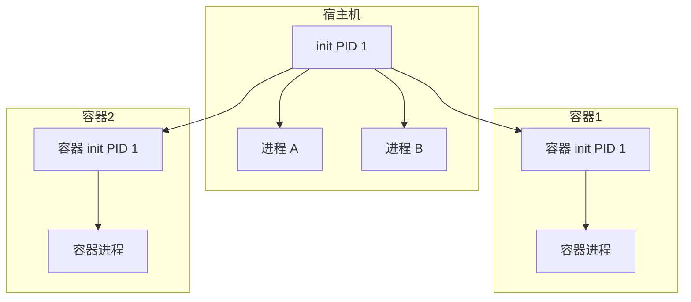

+++
title = "55. nsenter/unshare命名空间工具深度解析"
date = 2026-01-31
weight = 55000
description = "nsenter/unshare深度解析：Linux命名空间、容器调试、进程隔离"
[taxonomies]
tags = ["Linux", "namespace", "nsenter", "unshare", "容器"]
+++

# nsenter/unshare 命名空间工具深度解析

本文深入解析 Linux 命名空间工具，包括 nsenter 和 unshare 的工作原理和实战应用。

---

## 一、命名空间概述

### 1.1 什么是命名空间

**命名空间（Namespace）** 是 Linux 内核的隔离机制，用于：
- 隔离进程视图
- 容器技术基础
- 资源隔离

### 1.2 命名空间类型

| 类型 | 标志 | 隔离内容 |
|------|------|----------|
| Mount | CLONE_NEWNS | 文件系统挂载 |
| UTS | CLONE_NEWUTS | 主机名、域名 |
| IPC | CLONE_NEWIPC | 进程间通信 |
| PID | CLONE_NEWPID | 进程 ID |
| Network | CLONE_NEWNET | 网络栈 |
| User | CLONE_NEWUSER | 用户和组 |
| Cgroup | CLONE_NEWCGROUP | Cgroup 根目录 |
| Time | CLONE_NEWTIME | 系统时间 |

### 1.3 架构概览



---

## 二、unshare 工具

### 2.1 基本用法

```bash
unshare [选项] [程序 [参数...]]
```

### 2.2 常用选项

| 选项 | 说明 |
|------|------|
| `-m, --mount` | Mount 命名空间 |
| `-u, --uts` | UTS 命名空间 |
| `-i, --ipc` | IPC 命名空间 |
| `-n, --net` | Network 命名空间 |
| `-p, --pid` | PID 命名空间 |
| `-U, --user` | User 命名空间 |
| `-C, --cgroup` | Cgroup 命名空间 |
| `-T, --time` | Time 命名空间 |
| `-f, --fork` | Fork 后执行 |
| `-r, --map-root-user` | 映射为 root |
| `--mount-proc` | 挂载新的 /proc |

### 2.3 创建命名空间

```bash
# 创建 UTS 命名空间（修改主机名）
sudo unshare --uts bash
hostname my-container
hostname  # 显示 my-container
exit
hostname  # 恢复原主机名

# 创建 PID 命名空间
sudo unshare --pid --fork --mount-proc bash
ps aux  # 只看到 bash 和 ps

# 创建 Network 命名空间
sudo unshare --net bash
ip link  # 只有 lo 接口

# 创建 User 命名空间（无需 root）
unshare --user --map-root-user bash
id  # uid=0(root)
```

### 2.4 组合使用

```bash
# 类似容器的隔离
sudo unshare --mount --uts --ipc --net --pid --fork --mount-proc bash

# 完全隔离
sudo unshare -m -u -i -n -p -U -C --fork --mount-proc bash
```

---

## 三、nsenter 工具

### 3.1 基本用法

```bash
nsenter [选项] [程序 [参数...]]
```

### 3.2 常用选项

| 选项 | 说明 |
|------|------|
| `-t, --target PID` | 目标进程 PID |
| `-m, --mount` | 进入 Mount 命名空间 |
| `-u, --uts` | 进入 UTS 命名空间 |
| `-i, --ipc` | 进入 IPC 命名空间 |
| `-n, --net` | 进入 Network 命名空间 |
| `-p, --pid` | 进入 PID 命名空间 |
| `-U, --user` | 进入 User 命名空间 |
| `-C, --cgroup` | 进入 Cgroup 命名空间 |
| `-a, --all` | 进入所有命名空间 |

### 3.3 进入容器命名空间

```bash
# 获取容器 PID
docker inspect --format '{{.State.Pid}}' container_name

# 进入容器的所有命名空间
sudo nsenter -t <PID> -a

# 进入特定命名空间
sudo nsenter -t <PID> -n    # 只进入网络命名空间
sudo nsenter -t <PID> -m    # 只进入挂载命名空间

# 在容器网络命名空间中执行命令
sudo nsenter -t <PID> -n ip addr
sudo nsenter -t <PID> -n ss -tlnp
```

### 3.4 使用命名空间文件

```bash
# 命名空间文件位于 /proc/PID/ns/
ls -la /proc/1234/ns/
# lrwxrwxrwx 1 root root 0 cgroup -> 'cgroup:[4026531835]'
# lrwxrwxrwx 1 root root 0 ipc -> 'ipc:[4026531839]'
# lrwxrwxrwx 1 root root 0 mnt -> 'mnt:[4026531840]'
# lrwxrwxrwx 1 root root 0 net -> 'net:[4026531992]'
# lrwxrwxrwx 1 root root 0 pid -> 'pid:[4026531836]'
# lrwxrwxrwx 1 root root 0 user -> 'user:[4026531837]'
# lrwxrwxrwx 1 root root 0 uts -> 'uts:[4026531838]'

# 通过文件进入
nsenter --net=/proc/1234/ns/net ip addr
```

---

## 四、实战应用

### 4.1 容器网络调试

```bash
# 获取容器 PID
CONTAINER_PID=$(docker inspect --format '{{.State.Pid}}' my-container)

# 查看容器网络配置
sudo nsenter -t $CONTAINER_PID -n ip addr
sudo nsenter -t $CONTAINER_PID -n ip route
sudo nsenter -t $CONTAINER_PID -n ss -tlnp

# 在容器网络中使用工具
sudo nsenter -t $CONTAINER_PID -n tcpdump -i eth0

# 测试容器网络连通性
sudo nsenter -t $CONTAINER_PID -n ping 8.8.8.8
```

### 4.2 容器进程调试

```bash
# 查看容器进程
sudo nsenter -t $CONTAINER_PID -p -r ps aux

# 查看容器文件系统
sudo nsenter -t $CONTAINER_PID -m ls /

# 编辑容器内文件
sudo nsenter -t $CONTAINER_PID -m vi /etc/config
```

### 4.3 网络命名空间持久化

```bash
# 创建持久化网络命名空间
sudo ip netns add my-netns

# 进入命名空间
sudo ip netns exec my-netns bash

# 列出命名空间
ip netns list

# 删除命名空间
sudo ip netns delete my-netns
```

### 4.4 简易容器实现

```bash
#!/bin/bash
# simple_container.sh

# 创建 rootfs（使用 busybox）
mkdir -p rootfs
docker export $(docker create busybox) | tar -C rootfs -xf -

# 运行"容器"
sudo unshare --mount --uts --ipc --net --pid --fork \
    /bin/bash -c "
        mount --make-rprivate /
        mount --bind rootfs rootfs
        cd rootfs
        mkdir -p old_root
        pivot_root . old_root
        umount -l /old_root
        rmdir /old_root
        mount -t proc proc /proc
        hostname container
        exec /bin/sh
    "
```

---

## 五、命名空间详解

### 5.1 PID 命名空间

```bash
# 创建新 PID 命名空间
sudo unshare --pid --fork --mount-proc bash

# 在新命名空间中，bash 是 PID 1
ps aux
# USER       PID %CPU %MEM    VSZ   RSS TTY      STAT START   TIME COMMAND
# root         1  0.0  0.0   9684  4996 pts/0    S    10:00   0:00 bash
# root         8  0.0  0.0  11668  3360 pts/0    R+   10:00   0:00 ps aux

# 注意：PID 1 有特殊责任（信号处理、孤儿进程回收）
```

### 5.2 Network 命名空间

```bash
# 创建网络命名空间
sudo unshare --net bash

# 默认只有 lo 接口
ip link
# 1: lo: <LOOPBACK> mtu 65536 qdisc noop state DOWN

# 启用 lo
ip link set lo up

# 可以通过 veth 对连接不同命名空间
```

### 5.3 Mount 命名空间

```bash
# 创建挂载命名空间
sudo unshare --mount bash

# 在新命名空间中的挂载不影响父命名空间
mount -t tmpfs tmpfs /mnt
ls /mnt  # 空的 tmpfs

# 退出后 /mnt 恢复原状
```

### 5.4 User 命名空间

```bash
# 无需 root 创建用户命名空间
unshare --user --map-root-user bash

# 在命名空间中是 root
id
# uid=0(root) gid=0(root) groups=0(root)

# 但实际权限受限于真实 UID
```

---

## 六、与 Docker 对比

```bash
# docker exec 等效
docker exec -it container bash

# nsenter 等效
CONTAINER_PID=$(docker inspect --format '{{.State.Pid}}' container)
sudo nsenter -t $CONTAINER_PID -m -u -i -n -p bash

# nsenter 优势：
# - 可以使用宿主机工具
# - 可以选择性进入特定命名空间
# - 容器可能没有 bash/sh
```

---

## 七、实用脚本

### 7.1 容器调试脚本

```bash
#!/bin/bash
# container_debug.sh

CONTAINER=$1
CMD=${2:-bash}

if [ -z "$CONTAINER" ]; then
    echo "Usage: $0 <container> [command]"
    exit 1
fi

# 获取 PID
PID=$(docker inspect --format '{{.State.Pid}}' "$CONTAINER" 2>/dev/null)

if [ -z "$PID" ] || [ "$PID" = "0" ]; then
    echo "Container not running or not found"
    exit 1
fi

echo "Entering container $CONTAINER (PID: $PID)"
sudo nsenter -t "$PID" -m -u -i -n -p "$CMD"
```

### 7.2 网络调试脚本

```bash
#!/bin/bash
# netns_debug.sh

CONTAINER=$1

PID=$(docker inspect --format '{{.State.Pid}}' "$CONTAINER")

echo "=== Network Interfaces ==="
sudo nsenter -t $PID -n ip addr

echo ""
echo "=== Routes ==="
sudo nsenter -t $PID -n ip route

echo ""
echo "=== Listening Ports ==="
sudo nsenter -t $PID -n ss -tlnp

echo ""
echo "=== Connections ==="
sudo nsenter -t $PID -n ss -tn
```

---

## 八、高频考点总结

| 考点 | 频率 | 关键知识 |
|------|------|----------|
| 命名空间类型 | ★★★ | PID、NET、MNT、UTS、IPC、USER |
| nsenter 用法 | ★★★ | -t、-n、-m、-a |
| unshare 用法 | ★★☆ | --pid、--net、--fork |
| 容器调试 | ★★★ | 进入容器命名空间 |
| 命名空间文件 | ★★☆ | /proc/PID/ns/* |

---

## 相关文章

- [上一篇：objdump/readelf二进制分析深度解析](@/articles/linux/linux-54-objdump-readelf二进制分析深度解析.md)
- [Docker容器技术](@/articles/sre/sre-20-SRE笔试题-综合实战题.md)
