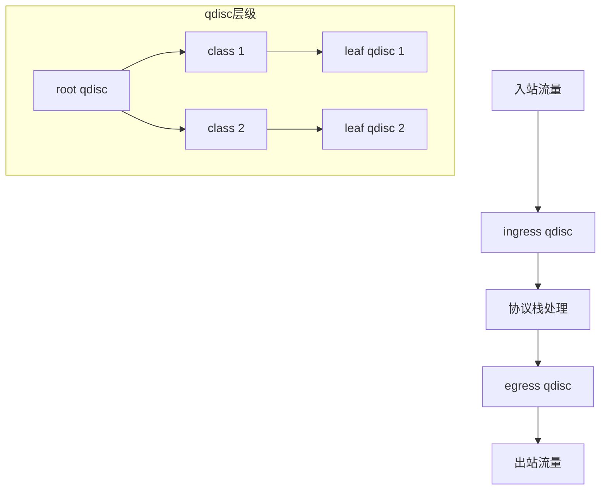

+++
title = "tc流量控制深度解析"
date = 2026-01-31
weight = 56000
description = "tc深度解析：流量整形、QoS、带宽限制、延迟模拟"
[taxonomies]
tags = ["Linux", "tc", "QoS", "流量控制", "网络"]
+++

# tc 流量控制深度解析

本文深入解析 tc（Traffic Control）工具的工作原理，包括流量整形、QoS 配置、带宽限制等核心技术。

---

## 一、tc 概述

### 1.1 什么是 tc

**tc**（Traffic Control）是 Linux 流量控制工具，用于：
- 带宽限制
- 流量整形
- QoS（服务质量）
- 延迟/丢包模拟
- 网络测试

### 1.2 核心概念

| 概念 | 说明 |
|------|------|
| qdisc | 队列规则（Queueing Discipline） |
| class | 流量类别 |
| filter | 过滤器（分类流量） |
| handle | 标识符 |

### 1.3 架构概览



---

## 二、基本使用

### 2.1 基本语法

```bash
tc qdisc [add|del|replace|change|show] dev DEV [handle HANDLE] [root|parent PARENT] [TYPE] [OPTIONS]
tc class [add|del|change|show] dev DEV [classid CLASSID] [parent PARENT] [TYPE] [OPTIONS]
tc filter [add|del|change|show] dev DEV [parent PARENT] [protocol PROTO] [prio PRIO] [OPTIONS]
```

### 2.2 查看当前配置

```bash
# 查看 qdisc
tc qdisc show dev eth0

# 查看 class
tc class show dev eth0

# 查看 filter
tc filter show dev eth0

# 查看统计
tc -s qdisc show dev eth0
tc -s class show dev eth0
```

### 2.3 常用 qdisc 类型

| qdisc | 类型 | 说明 |
|-------|------|------|
| pfifo_fast | 无类 | 默认，先进先出 |
| tbf | 无类 | 令牌桶，限速 |
| sfq | 无类 | 公平队列 |
| netem | 无类 | 网络模拟 |
| htb | 有类 | 层级令牌桶 |
| prio | 有类 | 优先级 |
| cbq | 有类 | 基于类的队列 |

---

## 三、带宽限制

### 3.1 使用 TBF（令牌桶）

```bash
# 限制出站带宽为 1Mbit/s
tc qdisc add dev eth0 root tbf rate 1mbit burst 32kbit latency 400ms

# 参数说明：
# rate: 速率限制
# burst: 突发大小
# latency: 最大延迟

# 删除
tc qdisc del dev eth0 root
```

### 3.2 使用 HTB（层级令牌桶）

```bash
# 创建 root qdisc
tc qdisc add dev eth0 root handle 1: htb default 30

# 创建根类
tc class add dev eth0 parent 1: classid 1:1 htb rate 100mbit ceil 100mbit

# 创建子类
tc class add dev eth0 parent 1:1 classid 1:10 htb rate 50mbit ceil 100mbit  # 高优先级
tc class add dev eth0 parent 1:1 classid 1:20 htb rate 30mbit ceil 100mbit  # 中优先级
tc class add dev eth0 parent 1:1 classid 1:30 htb rate 20mbit ceil 100mbit  # 低优先级（默认）

# 添加过滤器
tc filter add dev eth0 parent 1: protocol ip prio 1 u32 \
    match ip dport 22 0xffff flowid 1:10    # SSH 到高优先级

tc filter add dev eth0 parent 1: protocol ip prio 2 u32 \
    match ip dport 80 0xffff flowid 1:20    # HTTP 到中优先级
```

### 3.3 入站限速

```bash
# 入站流量需要使用 ingress qdisc + ifb 设备

# 加载 ifb 模块
modprobe ifb numifbs=1
ip link set dev ifb0 up

# 创建 ingress qdisc 并重定向到 ifb0
tc qdisc add dev eth0 handle ffff: ingress
tc filter add dev eth0 parent ffff: protocol ip u32 \
    match u32 0 0 action mirred egress redirect dev ifb0

# 在 ifb0 上限速
tc qdisc add dev ifb0 root tbf rate 10mbit burst 32kbit latency 400ms
```

---

## 四、网络模拟（netem）

### 4.1 添加延迟

```bash
# 固定延迟 100ms
tc qdisc add dev eth0 root netem delay 100ms

# 延迟带波动（100ms ± 10ms）
tc qdisc add dev eth0 root netem delay 100ms 10ms

# 正态分布延迟
tc qdisc add dev eth0 root netem delay 100ms 10ms distribution normal

# 相关性延迟（25% 相关）
tc qdisc add dev eth0 root netem delay 100ms 10ms 25%
```

### 4.2 添加丢包

```bash
# 1% 丢包率
tc qdisc add dev eth0 root netem loss 1%

# 带相关性的丢包
tc qdisc add dev eth0 root netem loss 1% 25%

# 随机丢包
tc qdisc add dev eth0 root netem loss random 5%
```

### 4.3 添加重复和乱序

```bash
# 1% 重复包
tc qdisc add dev eth0 root netem duplicate 1%

# 5% 乱序
tc qdisc add dev eth0 root netem reorder 5% 50%

# 包损坏
tc qdisc add dev eth0 root netem corrupt 0.1%
```

### 4.4 组合模拟

```bash
# 模拟差网络：100ms 延迟 + 1% 丢包
tc qdisc add dev eth0 root netem delay 100ms 20ms loss 1%

# 模拟 3G 网络
tc qdisc add dev eth0 root netem delay 250ms 50ms loss 1.5% rate 1mbit

# 模拟卫星链路
tc qdisc add dev eth0 root netem delay 500ms 50ms loss 0.5%
```

---

## 五、QoS 配置

### 5.1 优先级队列

```bash
# 创建 prio qdisc（3 个优先级队列）
tc qdisc add dev eth0 root handle 1: prio

# 查看自动创建的 bands
tc qdisc show dev eth0
# qdisc prio 1: root refcnt 2 bands 3 priomap  1 2 2 2 1 2 0 0 1 1 1 1 1 1 1 1

# 添加过滤器
tc filter add dev eth0 parent 1: protocol ip prio 1 u32 \
    match ip tos 0x10 0xff flowid 1:1  # 低延迟 TOS 到最高优先级

tc filter add dev eth0 parent 1: protocol ip prio 2 u32 \
    match ip protocol 6 0xff match ip dport 22 0xffff flowid 1:1  # SSH
```

### 5.2 基于 DSCP 的 QoS

```bash
# 创建 HTB
tc qdisc add dev eth0 root handle 1: htb default 40

# 创建类
tc class add dev eth0 parent 1: classid 1:1 htb rate 100mbit

tc class add dev eth0 parent 1:1 classid 1:10 htb rate 30mbit ceil 100mbit prio 1  # EF
tc class add dev eth0 parent 1:1 classid 1:20 htb rate 30mbit ceil 80mbit prio 2   # AF
tc class add dev eth0 parent 1:1 classid 1:30 htb rate 20mbit ceil 60mbit prio 3   # CS
tc class add dev eth0 parent 1:1 classid 1:40 htb rate 20mbit ceil 40mbit prio 4   # BE

# 基于 DSCP 分类
tc filter add dev eth0 parent 1: protocol ip prio 1 u32 \
    match ip tos 0xb8 0xfc flowid 1:10  # EF (DSCP 46)

tc filter add dev eth0 parent 1: protocol ip prio 2 u32 \
    match ip tos 0x88 0xfc flowid 1:20  # AF41 (DSCP 34)
```

---

## 六、实用脚本

### 6.1 限速脚本

```bash
#!/bin/bash
# limit_bandwidth.sh

IFACE=$1
RATE=$2

if [ -z "$IFACE" ] || [ -z "$RATE" ]; then
    echo "Usage: $0 <interface> <rate>"
    echo "Example: $0 eth0 10mbit"
    exit 1
fi

# 清除现有规则
tc qdisc del dev $IFACE root 2>/dev/null

# 添加限速
tc qdisc add dev $IFACE root tbf rate $RATE burst 32kbit latency 400ms

echo "Limited $IFACE to $RATE"
tc qdisc show dev $IFACE
```

### 6.2 网络模拟脚本

```bash
#!/bin/bash
# simulate_network.sh

IFACE=$1
PROFILE=$2

case $PROFILE in
    "3g")
        DELAY="250ms 50ms"
        LOSS="1.5%"
        RATE="1mbit"
        ;;
    "4g")
        DELAY="50ms 10ms"
        LOSS="0.5%"
        RATE="50mbit"
        ;;
    "satellite")
        DELAY="500ms 50ms"
        LOSS="0.5%"
        RATE="10mbit"
        ;;
    "clear")
        tc qdisc del dev $IFACE root 2>/dev/null
        echo "Cleared"
        exit 0
        ;;
    *)
        echo "Usage: $0 <interface> <3g|4g|satellite|clear>"
        exit 1
        ;;
esac

tc qdisc del dev $IFACE root 2>/dev/null
tc qdisc add dev $IFACE root netem delay $DELAY loss $LOSS rate $RATE

echo "Applied $PROFILE profile to $IFACE"
tc qdisc show dev $IFACE
```

### 6.3 清除所有规则

```bash
#!/bin/bash
# tc_clear.sh

IFACE=${1:-eth0}

tc qdisc del dev $IFACE root 2>/dev/null
tc qdisc del dev $IFACE ingress 2>/dev/null

echo "Cleared tc rules on $IFACE"
```

---

## 七、故障排查

### 7.1 查看统计

```bash
# 详细统计
tc -s qdisc show dev eth0
tc -s class show dev eth0

# 过滤器命中统计
tc -s filter show dev eth0
```

### 7.2 常见问题

| 问题 | 原因 | 解决 |
|------|------|------|
| 规则不生效 | 方向错误 | 确认是 egress/ingress |
| 限速不准确 | burst 太小 | 增大 burst |
| 丢包严重 | 队列溢出 | 增大队列或降低速率 |
| filter 不匹配 | 优先级问题 | 调整 prio 值 |

---

## 八、与同类工具对比

| 特性 | tc | iptables | wondershaper |
|------|-----|----------|--------------|
| 带宽限制 | ✅ | 有限 | ✅ |
| QoS | ✅ | 标记 | 有限 |
| 延迟模拟 | ✅ | ❌ | ❌ |
| 复杂度 | 高 | 中 | 低 |

---

## 九、高频考点总结

| 考点 | 频率 | 关键知识 |
|------|------|----------|
| 核心概念 | ★★★ | qdisc、class、filter |
| 带宽限制 | ★★★ | tbf、htb |
| 网络模拟 | ★★☆ | netem delay/loss |
| QoS 配置 | ★★☆ | 优先级、DSCP |
| 入站限速 | ★★☆ | ingress + ifb |

---

## 相关文章

- [上一篇：nsenter/unshare命名空间工具深度解析](@/articles/linux/linux-55-nsenter-unshare命名空间工具深度解析.md)
- [网络性能分析与调优](@/articles/networking/net-11-网络性能分析与调优.md)
