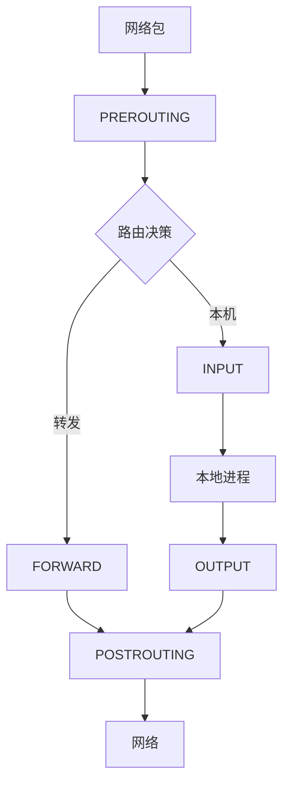

+++
title = "57.iptables/nftables防火墙深度解析"
date = 2026-01-31
description = "iptables/nftables深度解析：包过滤、NAT、状态跟踪、安全配置"
[taxonomies]
tags = ["Linux", "iptables", "nftables", "防火墙", "安全"]
+++

# iptables/nftables 防火墙深度解析

本文深入解析 Linux 防火墙工具，包括 iptables 和 nftables 的工作原理和实战应用。

---

## 一、概述

### 1.1 iptables vs nftables

| 特性 | iptables | nftables |
|------|----------|----------|
| 状态 | 传统 | 现代（推荐） |
| 语法 | 复杂 | 简洁 |
| 性能 | 较低 | 较高 |
| 原子更新 | 否 | 是 |
| IPv4/IPv6 | 分离工具 | 统一 |

### 1.2 Netfilter 架构



### 1.3 表和链

| 表 | 用途 | 链 |
|-----|------|-----|
| filter | 过滤 | INPUT, OUTPUT, FORWARD |
| nat | 地址转换 | PREROUTING, OUTPUT, POSTROUTING |
| mangle | 修改包 | 所有链 |
| raw | 跳过连接跟踪 | PREROUTING, OUTPUT |
| security | SELinux | INPUT, OUTPUT, FORWARD |

---

## 二、iptables 基础

### 2.1 基本语法

```bash
iptables [-t table] COMMAND chain rule-specification
```

### 2.2 常用命令

| 命令 | 说明 |
|------|------|
| `-A` | 追加规则 |
| `-I` | 插入规则 |
| `-D` | 删除规则 |
| `-L` | 列出规则 |
| `-F` | 清空规则 |
| `-P` | 设置默认策略 |
| `-N` | 创建链 |
| `-X` | 删除链 |

### 2.3 基本操作

```bash
# 查看规则
iptables -L -n -v
iptables -L -n -v --line-numbers
iptables -t nat -L -n -v

# 设置默认策略
iptables -P INPUT DROP
iptables -P FORWARD DROP
iptables -P OUTPUT ACCEPT

# 允许已建立的连接
iptables -A INPUT -m state --state ESTABLISHED,RELATED -j ACCEPT

# 允许本地回环
iptables -A INPUT -i lo -j ACCEPT

# 允许 SSH
iptables -A INPUT -p tcp --dport 22 -j ACCEPT

# 允许 HTTP/HTTPS
iptables -A INPUT -p tcp --dport 80 -j ACCEPT
iptables -A INPUT -p tcp --dport 443 -j ACCEPT

# 拒绝其他
iptables -A INPUT -j DROP
```

### 2.4 常用匹配

```bash
# 源/目标地址
iptables -A INPUT -s 192.168.1.0/24 -j ACCEPT
iptables -A INPUT -d 10.0.0.1 -j ACCEPT

# 协议和端口
iptables -A INPUT -p tcp --dport 22 -j ACCEPT
iptables -A INPUT -p udp --dport 53 -j ACCEPT
iptables -A INPUT -p icmp -j ACCEPT

# 接口
iptables -A INPUT -i eth0 -j ACCEPT
iptables -A OUTPUT -o eth1 -j ACCEPT

# 多端口
iptables -A INPUT -p tcp -m multiport --dports 80,443,8080 -j ACCEPT

# IP 范围
iptables -A INPUT -m iprange --src-range 192.168.1.100-192.168.1.200 -j ACCEPT

# 连接状态
iptables -A INPUT -m state --state NEW,ESTABLISHED -j ACCEPT
```

---

## 三、NAT 配置

### 3.1 SNAT（源地址转换）

```bash
# 出站伪装（动态 IP）
iptables -t nat -A POSTROUTING -o eth0 -j MASQUERADE

# 固定 SNAT
iptables -t nat -A POSTROUTING -s 192.168.1.0/24 -o eth0 -j SNAT --to-source 1.2.3.4

# 启用 IP 转发
echo 1 > /proc/sys/net/ipv4/ip_forward
```

### 3.2 DNAT（目标地址转换）

```bash
# 端口转发
iptables -t nat -A PREROUTING -p tcp --dport 80 -j DNAT --to-destination 192.168.1.100:8080

# 允许转发流量
iptables -A FORWARD -p tcp -d 192.168.1.100 --dport 8080 -j ACCEPT
```

### 3.3 端口转发示例

```bash
# 将外部 2222 转发到内部 SSH
iptables -t nat -A PREROUTING -p tcp --dport 2222 -j DNAT --to-destination 192.168.1.100:22
iptables -A FORWARD -p tcp -d 192.168.1.100 --dport 22 -j ACCEPT
```

---

## 四、nftables 基础

### 4.1 基本概念

```bash
# nftables 层级
nftables
├── table (类似 iptables 的表)
│   ├── chain (类似 iptables 的链)
│   │   └── rules (规则)
│   └── set (IP/端口集合)
```

### 4.2 基本命令

```bash
# 列出规则
nft list ruleset
nft list tables
nft list table inet filter

# 添加表
nft add table inet filter

# 添加链
nft add chain inet filter input { type filter hook input priority 0 \; policy drop \; }

# 添加规则
nft add rule inet filter input tcp dport 22 accept

# 删除规则（需要 handle）
nft -a list table inet filter  # 查看 handle
nft delete rule inet filter input handle 5

# 清空表
nft flush table inet filter
```

### 4.3 基本防火墙配置

```bash
#!/usr/sbin/nft -f

flush ruleset

table inet filter {
    chain input {
        type filter hook input priority 0; policy drop;

        # 允许已建立连接
        ct state established,related accept

        # 允许本地回环
        iif "lo" accept

        # 允许 ICMP
        ip protocol icmp accept
        ip6 nexthdr icmpv6 accept

        # 允许 SSH
        tcp dport 22 accept

        # 允许 HTTP/HTTPS
        tcp dport { 80, 443 } accept

        # 记录并拒绝其他
        log prefix "INPUT DROP: " drop
    }

    chain forward {
        type filter hook forward priority 0; policy drop;
    }

    chain output {
        type filter hook output priority 0; policy accept;
    }
}
```

### 4.4 使用集合

```bash
# 定义集合
nft add set inet filter allowed_ips { type ipv4_addr \; }
nft add element inet filter allowed_ips { 192.168.1.100, 192.168.1.101 }

# 使用集合
nft add rule inet filter input ip saddr @allowed_ips accept

# 端口集合
nft add set inet filter allowed_ports { type inet_service \; }
nft add element inet filter allowed_ports { 22, 80, 443 }
nft add rule inet filter input tcp dport @allowed_ports accept
```

---

## 五、NAT（nftables）

```bash
#!/usr/sbin/nft -f

table inet nat {
    chain prerouting {
        type nat hook prerouting priority -100;

        # DNAT
        tcp dport 2222 dnat to 192.168.1.100:22
    }

    chain postrouting {
        type nat hook postrouting priority 100;

        # SNAT/伪装
        oifname "eth0" masquerade
    }
}
```

---

## 六、状态跟踪

### 6.1 连接状态

| 状态 | 说明 |
|------|------|
| NEW | 新连接 |
| ESTABLISHED | 已建立 |
| RELATED | 相关连接（如 FTP 数据） |
| INVALID | 无效包 |

### 6.2 iptables 状态跟踪

```bash
iptables -A INPUT -m state --state ESTABLISHED,RELATED -j ACCEPT
iptables -A INPUT -m state --state INVALID -j DROP
iptables -A INPUT -m state --state NEW -p tcp --dport 22 -j ACCEPT
```

### 6.3 nftables 状态跟踪

```bash
nft add rule inet filter input ct state established,related accept
nft add rule inet filter input ct state invalid drop
nft add rule inet filter input ct state new tcp dport 22 accept
```

---

## 七、实用规则

### 7.1 防 DDoS

```bash
# 限制连接速率
iptables -A INPUT -p tcp --dport 80 -m limit --limit 25/minute --limit-burst 100 -j ACCEPT

# SYN Flood 防护
iptables -A INPUT -p tcp --syn -m limit --limit 1/s --limit-burst 3 -j ACCEPT

# nftables 等效
nft add rule inet filter input tcp dport 80 limit rate 25/minute burst 100 packets accept
```

### 7.2 防端口扫描

```bash
# 检测异常 TCP 标志
iptables -A INPUT -p tcp --tcp-flags ALL NONE -j DROP
iptables -A INPUT -p tcp --tcp-flags ALL ALL -j DROP
```

### 7.3 日志记录

```bash
# iptables
iptables -A INPUT -j LOG --log-prefix "INPUT DROP: " --log-level 4
iptables -A INPUT -j DROP

# nftables
nft add rule inet filter input log prefix \"INPUT DROP: \" drop
```

---

## 八、持久化

### 8.1 iptables

```bash
# 保存
iptables-save > /etc/iptables/rules.v4
ip6tables-save > /etc/iptables/rules.v6

# 恢复
iptables-restore < /etc/iptables/rules.v4

# 使用 iptables-persistent
apt install iptables-persistent
netfilter-persistent save
netfilter-persistent reload
```

### 8.2 nftables

```bash
# 保存
nft list ruleset > /etc/nftables.conf

# 加载
nft -f /etc/nftables.conf

# systemd 服务
systemctl enable nftables
systemctl start nftables
```

---

## 九、迁移脚本

```bash
# iptables 转 nftables
iptables-translate -A INPUT -p tcp --dport 22 -j ACCEPT
# 输出: nft add rule ip filter INPUT tcp dport 22 counter accept

# 完整规则转换
iptables-save | iptables-restore-translate -f /etc/nftables.conf
```

---

## 十、高频考点总结

| 考点 | 频率 | 关键知识 |
|------|------|----------|
| 表和链 | ★★★ | filter/nat、INPUT/OUTPUT/FORWARD |
| 基本规则 | ★★★ | -A、-p、--dport、-j |
| NAT | ★★★ | SNAT、DNAT、MASQUERADE |
| 状态跟踪 | ★★★ | ESTABLISHED、RELATED、NEW |
| nftables 语法 | ★★☆ | 表/链/规则层级 |
| 持久化 | ★★☆ | iptables-save、nft list |

---

## 相关文章

- [上一篇：tc流量控制深度解析](/articles/linux/linux-56-tc流量控制深度解析/)
- [网络安全基础](/articles/security/sec-01-网络安全基础/)
