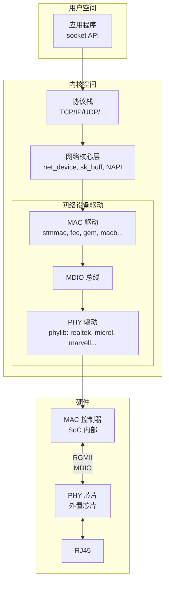
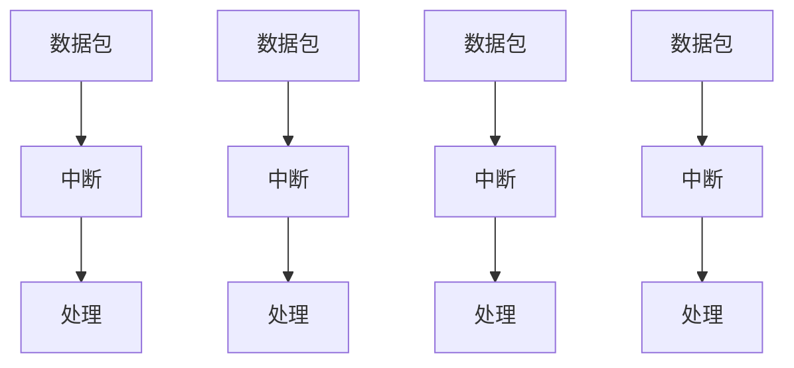
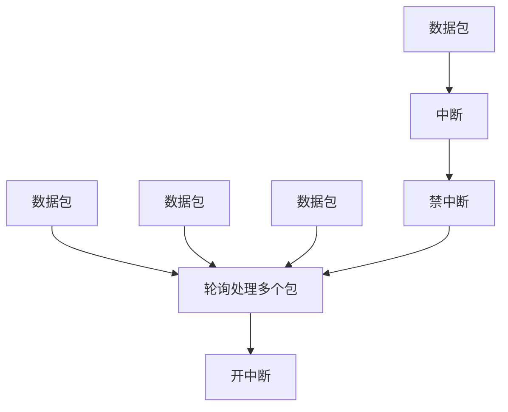
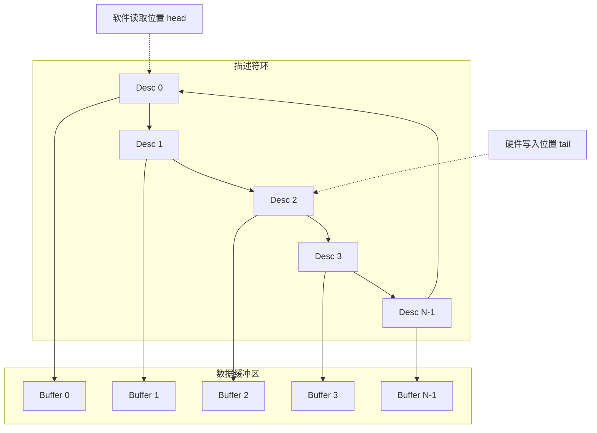
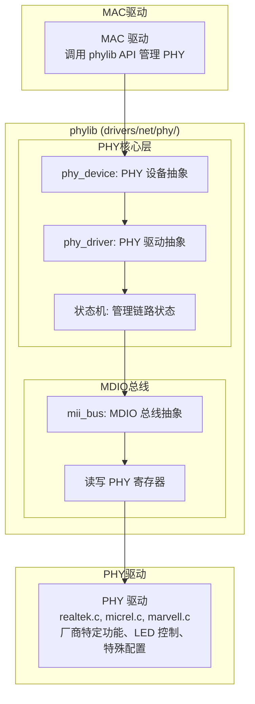

+++
title = "58.以太网与 PHY 驱动开发"
date = 2026-01-21
description = "Linux 以太网驱动开发完整指南：net_device 架构、NAPI、PHY 驱动、MAC 驱动、DMA 描述符、ethtool 接口"
[taxonomies]
tags = ["linux", "driver", "ethernet", "phy", "networking", "kernel"]
+++

# 以太网与 PHY 驱动开发

以太网驱动是嵌入式 Linux 开发中最常见的驱动类型之一。本文深入解析 Linux 网络驱动架构，从 MAC 层到 PHY 层，帮助你掌握完整的以太网驱动开发技能。

---

## 一、以太网驱动架构概述

### 1.1 整体架构



### 1.2 MAC 与 PHY 的关系

**MAC (Media Access Controller) - 数据链路层：**
- 以太网帧的封装和解封
- 源/目的 MAC 地址处理
- CRC 计算和校验
- 流控（Pause 帧）
- DMA 数据传输
- 通常集成在 SoC 内部

**PHY (Physical Layer) - 物理层：**
- 并串转换（MII ↔ 线路信号）
- 编码解码（如 4B/5B, 8B/10B）
- 信号整形、均衡
- 自协商（Auto-negotiation）
- MDI/MDI-X 自动切换
- 通常是独立芯片

**MAC 与 PHY 之间的接口：**

**数据接口（选其一）：**

| 接口 | 速度 | 信号数 | 说明 |
|------|------|--------|------|
| MII | 10/100M | 16 | 老式接口 |
| RMII | 10/100M | 9 | 减少引脚，50MHz 时钟 |
| GMII | 1G | 24 | MII 扩展 |
| RGMII | 1G | 12 | 最常用，DDR 时钟 |
| SGMII | 1G | 2 | 串行，高速 |
| XGMII | 10G | 72 | 10G 并行接口 |

**管理接口：**
- MDIO (Management Data Input/Output)
- 2 线：MDC (时钟) + MDIO (数据)
- 用于读写 PHY 寄存器
- 最高 2.5 MHz

### 1.3 关键数据结构

```c
/* net_device - 网络设备核心结构 */
struct net_device {
    char                name[IFNAMSIZ];     /* 接口名如 eth0 */
    
    /* 硬件信息 */
    unsigned char       dev_addr[ETH_ALEN]; /* MAC 地址 */
    unsigned int        mtu;                /* 最大传输单元 */
    unsigned int        flags;              /* IFF_UP, IFF_RUNNING 等 */
    
    /* 操作函数 */
    const struct net_device_ops *netdev_ops;
    const struct ethtool_ops    *ethtool_ops;
    
    /* 接收相关 */
    struct list_head    napi_list;          /* NAPI 结构链表 */
    
    /* 发送相关 */
    struct netdev_queue *_tx;               /* 发送队列 */
    unsigned int        num_tx_queues;      /* 发送队列数 */
    
    /* 私有数据 */
    void                *priv;              /* 驱动私有数据 */
};

/* net_device_ops - 网络设备操作函数 */
struct net_device_ops {
    int  (*ndo_open)(struct net_device *dev);
    int  (*ndo_stop)(struct net_device *dev);
    netdev_tx_t (*ndo_start_xmit)(struct sk_buff *skb,
                                   struct net_device *dev);
    void (*ndo_set_rx_mode)(struct net_device *dev);
    int  (*ndo_set_mac_address)(struct net_device *dev, void *addr);
    int  (*ndo_do_ioctl)(struct net_device *dev,
                         struct ifreq *ifr, int cmd);
    void (*ndo_tx_timeout)(struct net_device *dev, unsigned int txqueue);
    int  (*ndo_change_mtu)(struct net_device *dev, int new_mtu);
    /* ... 更多 ... */
};

/* sk_buff - 套接字缓冲区 */
struct sk_buff {
    /* 链表管理 */
    struct sk_buff      *next, *prev;
    
    /* 数据指针 */
    unsigned char       *head;      /* 缓冲区起始 */
    unsigned char       *data;      /* 数据起始 */
    unsigned char       *tail;      /* 数据结束 */
    unsigned char       *end;       /* 缓冲区结束 */
    
    unsigned int        len;        /* 数据长度 */
    
    /* 网络设备 */
    struct net_device   *dev;
    
    /* 协议信息 */
    __be16              protocol;
    
    /* ... */
};
```

---

## 二、NAPI（新 API）机制

### 2.1 中断 vs 轮询

**传统中断模式：**



问题：高流量时中断风暴，CPU 被中断淹没

**NAPI 模式（中断 + 轮询）：**



**优点：**
- 减少中断开销
- 批量处理提高效率
- 自适应：低流量用中断，高流量用轮询

### 2.2 NAPI 实现

```c
/* NAPI 结构 */
struct napi_struct {
    struct list_head    poll_list;
    unsigned long       state;
    int                 weight;         /* 每次轮询处理的最大包数 */
    int                 (*poll)(struct napi_struct *, int);
    struct net_device   *dev;
    /* ... */
};

/* NAPI 初始化 */
void netif_napi_add(struct net_device *dev,
                    struct napi_struct *napi,
                    int (*poll)(struct napi_struct *, int),
                    int weight);

/* NAPI 使能 */
void napi_enable(struct napi_struct *napi);

/* NAPI 调度（在中断处理中调用） */
void napi_schedule(struct napi_struct *napi);

/* NAPI 完成（在 poll 函数中调用） */
void napi_complete_done(struct napi_struct *napi, int work_done);

/* 示例：NAPI poll 函数 */
static int my_eth_poll(struct napi_struct *napi, int budget)
{
    struct my_eth_priv *priv = container_of(napi, struct my_eth_priv, napi);
    int work_done = 0;
    
    while (work_done < budget) {
        struct sk_buff *skb;
        
        /* 检查是否有待处理的包 */
        if (!rx_ring_has_data(priv))
            break;
        
        /* 分配 skb */
        skb = netdev_alloc_skb(priv->ndev, RX_BUF_SIZE);
        if (!skb)
            break;
        
        /* 从硬件读取数据 */
        int len = read_rx_data(priv, skb->data);
        skb_put(skb, len);
        
        /* 设置协议 */
        skb->protocol = eth_type_trans(skb, priv->ndev);
        
        /* 提交到协议栈 */
        napi_gro_receive(napi, skb);  /* GRO 聚合 */
        
        work_done++;
    }
    
    /* 处理完所有包，重新开启中断 */
    if (work_done < budget) {
        napi_complete_done(napi, work_done);
        enable_rx_irq(priv);
    }
    
    return work_done;
}

/* 示例：中断处理 */
static irqreturn_t my_eth_irq(int irq, void *dev_id)
{
    struct my_eth_priv *priv = dev_id;
    u32 status = readl(priv->regs + IRQ_STATUS);
    
    if (status & RX_IRQ) {
        /* 禁用接收中断 */
        disable_rx_irq(priv);
        
        /* 调度 NAPI */
        if (napi_schedule_prep(&priv->napi))
            __napi_schedule(&priv->napi);
    }
    
    if (status & TX_IRQ) {
        /* 处理发送完成 */
        my_eth_tx_complete(priv);
    }
    
    return IRQ_HANDLED;
}
```

---

## 三、DMA 描述符

### 3.1 环形缓冲区设计

**接收 (RX) 描述符环：**



**描述符内容：**

| 字段 | 说明 |
|------|------|
| Buffer Addr | 缓冲区地址 (32/64 bit) |
| Length | 数据长度 |
| Status | 状态标志 |
| Control | 控制标志 |
| Next | 下一个描述符指针 |

**Status 标志：**
- OWN: 描述符所有权 (1=硬件, 0=软件)
- FD: 帧起始
- LD: 帧结束
- ES: 错误汇总
- 长度: 接收数据长度

**发送 (TX) 描述符环：**

类似结构，但：
- 软件填充数据，设置 OWN=1
- 硬件发送后清除 OWN
- 可能支持 Scatter-Gather (一帧多描述符)
- 可能支持校验和卸载 (Checksum Offload)

### 3.2 描述符操作实现

```c
/* 描述符结构（以 STMMAC 为例） */
struct dma_desc {
    __le32 des0;    /* 缓冲区地址低 32 位 / 状态 */
    __le32 des1;    /* 缓冲区地址高 32 位 / 控制 */
    __le32 des2;    /* 缓冲区 2 地址 / 长度 */
    __le32 des3;    /* 状态/控制 */
};

/* 驱动私有数据 */
struct my_eth_priv {
    struct net_device *ndev;
    void __iomem *regs;
    
    /* RX 描述符环 */
    struct dma_desc *rx_ring;
    dma_addr_t rx_ring_dma;
    struct sk_buff **rx_skb;
    int rx_head;    /* 软件读取位置 */
    int rx_tail;    /* 硬件写入位置 */
    int rx_count;   /* 描述符数量 */
    
    /* TX 描述符环 */
    struct dma_desc *tx_ring;
    dma_addr_t tx_ring_dma;
    struct sk_buff **tx_skb;
    int tx_head;    /* 软件写入位置 */
    int tx_tail;    /* 硬件读取位置 */
    int tx_count;
    
    struct napi_struct napi;
    /* ... */
};

/* 分配描述符环 */
static int alloc_ring(struct my_eth_priv *priv)
{
    struct device *dev = priv->ndev->dev.parent;
    int i;
    
    /* 分配 RX 描述符（DMA 一致性内存） */
    priv->rx_ring = dma_alloc_coherent(dev,
                        priv->rx_count * sizeof(struct dma_desc),
                        &priv->rx_ring_dma, GFP_KERNEL);
    if (!priv->rx_ring)
        return -ENOMEM;
    
    /* 分配 RX SKB 数组 */
    priv->rx_skb = kcalloc(priv->rx_count, sizeof(struct sk_buff *),
                           GFP_KERNEL);
    
    /* 为每个描述符分配缓冲区 */
    for (i = 0; i < priv->rx_count; i++) {
        struct sk_buff *skb;
        dma_addr_t dma_addr;
        
        skb = netdev_alloc_skb(priv->ndev, RX_BUF_SIZE);
        if (!skb)
            goto err;
        
        /* 映射 DMA */
        dma_addr = dma_map_single(dev, skb->data, RX_BUF_SIZE,
                                  DMA_FROM_DEVICE);
        if (dma_mapping_error(dev, dma_addr)) {
            dev_kfree_skb(skb);
            goto err;
        }
        
        priv->rx_skb[i] = skb;
        
        /* 填充描述符 */
        priv->rx_ring[i].des0 = cpu_to_le32(lower_32_bits(dma_addr));
        priv->rx_ring[i].des1 = cpu_to_le32(upper_32_bits(dma_addr));
        priv->rx_ring[i].des2 = cpu_to_le32(RX_BUF_SIZE);
        priv->rx_ring[i].des3 = cpu_to_le32(RDES3_OWN | RDES3_BUFFER1_VALID);
    }
    
    /* TX 类似 ... */
    
    return 0;
    
err:
    /* 清理 ... */
    return -ENOMEM;
}

/* 发送数据包 */
static netdev_tx_t my_eth_xmit(struct sk_buff *skb, struct net_device *ndev)
{
    struct my_eth_priv *priv = netdev_priv(ndev);
    struct device *dev = ndev->dev.parent;
    struct dma_desc *desc;
    dma_addr_t dma_addr;
    int entry;
    
    /* 检查是否有空闲描述符 */
    if (tx_ring_full(priv)) {
        netif_stop_queue(ndev);
        return NETDEV_TX_BUSY;
    }
    
    entry = priv->tx_head;
    desc = &priv->tx_ring[entry];
    
    /* 映射 SKB 数据 */
    dma_addr = dma_map_single(dev, skb->data, skb->len, DMA_TO_DEVICE);
    if (dma_mapping_error(dev, dma_addr)) {
        dev_kfree_skb(skb);
        return NETDEV_TX_OK;
    }
    
    /* 保存 SKB 以便发送完成后释放 */
    priv->tx_skb[entry] = skb;
    
    /* 填充描述符 */
    desc->des0 = cpu_to_le32(lower_32_bits(dma_addr));
    desc->des1 = cpu_to_le32(upper_32_bits(dma_addr));
    desc->des2 = cpu_to_le32(skb->len);
    
    /* 设置控制标志：首帧、末帧、中断、所有权 */
    wmb();  /* 确保数据写入完成 */
    desc->des3 = cpu_to_le32(TDES3_OWN | TDES3_FD | TDES3_LD |
                             TDES3_CIC_FULL | skb->len);
    
    /* 更新 head */
    priv->tx_head = (entry + 1) % priv->tx_count;
    
    /* 触发 DMA 发送 */
    writel(1, priv->regs + TX_POLL);
    
    return NETDEV_TX_OK;
}

/* 发送完成处理 */
static void my_eth_tx_complete(struct my_eth_priv *priv)
{
    struct device *dev = priv->ndev->dev.parent;
    
    while (priv->tx_tail != priv->tx_head) {
        struct dma_desc *desc = &priv->tx_ring[priv->tx_tail];
        struct sk_buff *skb = priv->tx_skb[priv->tx_tail];
        u32 status = le32_to_cpu(desc->des3);
        
        /* 检查所有权 */
        if (status & TDES3_OWN)
            break;  /* 硬件还未处理完 */
        
        /* 解除 DMA 映射 */
        dma_unmap_single(dev, le32_to_cpu(desc->des0),
                         skb->len, DMA_TO_DEVICE);
        
        /* 释放 SKB */
        dev_kfree_skb_irq(skb);
        priv->tx_skb[priv->tx_tail] = NULL;
        
        /* 更新 tail */
        priv->tx_tail = (priv->tx_tail + 1) % priv->tx_count;
    }
    
    /* 如果之前停止了队列，现在恢复 */
    if (netif_queue_stopped(priv->ndev) && !tx_ring_full(priv))
        netif_wake_queue(priv->ndev);
}
```

---

## 四、PHY 驱动开发

### 4.1 PHY 子系统 (phylib)



### 4.2 PHY 寄存器（IEEE 802.3 标准）

**标准 PHY 寄存器（前 16 个）：**

| 地址 | 名称 | 说明 |
|------|------|------|
| 0 | BMCR (Basic Mode Ctrl) | 基本模式控制 |
| 1 | BMSR (Basic Mode Status) | 基本模式状态 |
| 2 | PHYID1 | PHY 标识符高 16 位 |
| 3 | PHYID2 | PHY 标识符低 16 位 + 型号 + 版本 |
| 4 | ANAR (AN Advertisement) | 自协商通告，通告本端支持的速率/双工模式 |
| 5 | ANLPAR (AN Link Partner) | 链路伙伴能力，对端通告的能力 |
| 6 | ANER (AN Expansion) | 自协商扩展 |
| 7 | ANNPTR | 下一页传输 |
| 8 | ANNPRR | 下一页接收 |
| 9 | GBCR (1000BASE-T Ctrl) | 千兆控制 |
| 10 | GBSR (1000BASE-T Status) | 千兆状态 |
| 15 | GBESR (Extended Status) | 扩展状态 |
| 16-31 | Vendor Specific | 厂商特定寄存器 |

**BMCR 寄存器位定义：**

| Bit | 说明 |
|-----|------|
| 15 | Reset |
| 14 | Loopback |
| 13 | Speed Select (LSB) |
| 12 | Auto-Negotiation Enable |
| 11 | Power Down |
| 9 | Restart Auto-Negotiation |
| 8 | Duplex Mode |
| 6 | Speed Select (MSB) |

**BMSR 寄存器位定义：**

| Bit | 说明 |
|-----|------|
| 5 | Auto-Negotiation Complete |
| 4 | Remote Fault |
| 2 | Link Status |

**PHY ID 示例：**
- Realtek RTL8211E: 0x001cc915
- Micrel KSZ9031: 0x00221620
- Marvell 88E1510: 0x01410dd0

### 4.3 PHY 驱动实现

```c
/* PHY 驱动结构 */
struct phy_driver {
    u32 phy_id;             /* PHY 标识符 */
    u32 phy_id_mask;        /* PHY ID 掩码 */
    char *name;
    u32 features;           /* 支持的特性 */
    
    /* 回调函数 */
    int (*soft_reset)(struct phy_device *phydev);
    int (*config_init)(struct phy_device *phydev);
    int (*config_aneg)(struct phy_device *phydev);
    int (*read_status)(struct phy_device *phydev);
    int (*suspend)(struct phy_device *phydev);
    int (*resume)(struct phy_device *phydev);
    
    /* LED 控制等厂商特定功能 */
    int (*config_intr)(struct phy_device *phydev);
    int (*handle_interrupt)(struct phy_device *phydev);
};

/* 简化的 PHY 驱动示例 */
static int my_phy_config_init(struct phy_device *phydev)
{
    int val;
    
    /* 软复位 */
    phy_write(phydev, MII_BMCR, BMCR_RESET);
    
    /* 等待复位完成 */
    while (phy_read(phydev, MII_BMCR) & BMCR_RESET)
        msleep(1);
    
    /* 配置 LED */
    val = phy_read(phydev, MY_PHY_LED_REG);
    val |= LED_LINK_ACT_MODE;
    phy_write(phydev, MY_PHY_LED_REG, val);
    
    /* 启用中断 */
    phy_write(phydev, MY_PHY_IMR, LINK_CHANGE_INT);
    
    return 0;
}

static int my_phy_read_status(struct phy_device *phydev)
{
    int bmsr, bmcr, lpa;
    
    /* 读取状态寄存器 */
    bmsr = phy_read(phydev, MII_BMSR);
    bmcr = phy_read(phydev, MII_BMCR);
    lpa = phy_read(phydev, MII_LPA);
    
    /* 判断链路状态 */
    phydev->link = !!(bmsr & BMSR_LSTATUS);
    
    if (!phydev->link)
        return 0;
    
    /* 判断速度和双工 */
    if (bmcr & BMCR_ANENABLE) {
        /* 自协商模式，从 LPA 解析 */
        phydev->duplex = (lpa & LPA_DUPLEX) ? DUPLEX_FULL : DUPLEX_HALF;
        
        if (lpa & LPA_1000FULL || lpa & LPA_1000HALF)
            phydev->speed = SPEED_1000;
        else if (lpa & LPA_100FULL || lpa & LPA_100HALF)
            phydev->speed = SPEED_100;
        else
            phydev->speed = SPEED_10;
    } else {
        /* 强制模式 */
        phydev->duplex = (bmcr & BMCR_FULLDPLX) ? DUPLEX_FULL : DUPLEX_HALF;
        
        if (bmcr & BMCR_SPEED1000)
            phydev->speed = SPEED_1000;
        else if (bmcr & BMCR_SPEED100)
            phydev->speed = SPEED_100;
        else
            phydev->speed = SPEED_10;
    }
    
    return 0;
}

static int my_phy_config_intr(struct phy_device *phydev)
{
    int val;
    
    if (phydev->interrupts == PHY_INTERRUPT_ENABLED)
        val = MY_PHY_INT_LINK_CHANGE;
    else
        val = 0;
    
    return phy_write(phydev, MY_PHY_IMR, val);
}

static irqreturn_t my_phy_handle_interrupt(struct phy_device *phydev)
{
    int irq_status;
    
    irq_status = phy_read(phydev, MY_PHY_ISR);
    
    if (!(irq_status & MY_PHY_INT_LINK_CHANGE))
        return IRQ_NONE;
    
    phy_trigger_machine(phydev);
    
    return IRQ_HANDLED;
}

/* PHY 驱动定义 */
static struct phy_driver my_phy_driver[] = {
    {
        .phy_id         = 0x001cc912,
        .phy_id_mask    = 0xfffffff0,
        .name           = "My PHY",
        .features       = PHY_GBIT_FEATURES,
        .config_init    = my_phy_config_init,
        .config_aneg    = genphy_config_aneg,  /* 使用通用函数 */
        .read_status    = my_phy_read_status,
        .config_intr    = my_phy_config_intr,
        .handle_interrupt = my_phy_handle_interrupt,
    },
};

module_phy_driver(my_phy_driver);

MODULE_LICENSE("GPL");
MODULE_DESCRIPTION("My PHY driver");
```

### 4.4 MDIO 总线

```c
/* MDIO 总线结构 */
struct mii_bus {
    const char *name;
    char id[MII_BUS_ID_SIZE];
    
    /* MDIO 读写函数 */
    int (*read)(struct mii_bus *bus, int addr, int regnum);
    int (*write)(struct mii_bus *bus, int addr, int regnum, u16 val);
    
    struct device *parent;
    void *priv;
    
    /* PHY 设备数组 */
    struct phy_device *phy_map[PHY_MAX_ADDR];
};

/* MAC 驱动中注册 MDIO 总线 */
static int my_eth_mdio_init(struct my_eth_priv *priv)
{
    struct mii_bus *bus;
    int ret;
    
    bus = mdiobus_alloc();
    if (!bus)
        return -ENOMEM;
    
    bus->name = "my_eth_mdio";
    snprintf(bus->id, MII_BUS_ID_SIZE, "%s-%x",
             bus->name, priv->id);
    bus->read = my_mdio_read;
    bus->write = my_mdio_write;
    bus->parent = priv->dev;
    bus->priv = priv;
    
    ret = mdiobus_register(bus);
    if (ret) {
        mdiobus_free(bus);
        return ret;
    }
    
    priv->mii_bus = bus;
    return 0;
}

/* MDIO 读操作 */
static int my_mdio_read(struct mii_bus *bus, int addr, int regnum)
{
    struct my_eth_priv *priv = bus->priv;
    u32 val;
    int timeout = 1000;
    
    /* 设置 MDIO 命令：读操作、PHY 地址、寄存器地址 */
    val = MDIO_CMD_READ | (addr << 11) | (regnum << 6);
    writel(val, priv->regs + MDIO_CMD);
    
    /* 等待完成 */
    while (timeout--) {
        val = readl(priv->regs + MDIO_STATUS);
        if (val & MDIO_BUSY) {
            udelay(1);
            continue;
        }
        
        /* 读取数据 */
        return readl(priv->regs + MDIO_DATA) & 0xffff;
    }
    
    return -ETIMEDOUT;
}

/* MDIO 写操作 */
static int my_mdio_write(struct mii_bus *bus, int addr, int regnum, u16 data)
{
    struct my_eth_priv *priv = bus->priv;
    u32 val;
    int timeout = 1000;
    
    /* 写入数据 */
    writel(data, priv->regs + MDIO_DATA);
    
    /* 设置 MDIO 命令：写操作、PHY 地址、寄存器地址 */
    val = MDIO_CMD_WRITE | (addr << 11) | (regnum << 6);
    writel(val, priv->regs + MDIO_CMD);
    
    /* 等待完成 */
    while (timeout--) {
        val = readl(priv->regs + MDIO_STATUS);
        if (!(val & MDIO_BUSY))
            return 0;
        udelay(1);
    }
    
    return -ETIMEDOUT;
}

/* 连接 PHY */
static int my_eth_phy_connect(struct my_eth_priv *priv)
{
    struct phy_device *phydev;
    
    /* 通过设备树获取 PHY */
    phydev = of_phy_connect(priv->ndev,
                            priv->phy_node,
                            my_eth_adjust_link,
                            0,
                            priv->phy_interface);
    
    /* 或者通过 MDIO 地址 */
    // phydev = phy_connect(priv->ndev,
    //                      dev_name(&priv->mii_bus->phy_map[phy_addr]->mdio.dev),
    //                      my_eth_adjust_link,
    //                      priv->phy_interface);
    
    if (!phydev) {
        dev_err(priv->dev, "Failed to connect PHY\n");
        return -ENODEV;
    }
    
    /* 配置支持的模式 */
    phy_remove_link_mode(phydev, ETHTOOL_LINK_MODE_1000baseT_Half_BIT);
    
    priv->phydev = phydev;
    return 0;
}

/* 链路状态变化回调 */
static void my_eth_adjust_link(struct net_device *ndev)
{
    struct my_eth_priv *priv = netdev_priv(ndev);
    struct phy_device *phydev = priv->phydev;
    
    if (phydev->link) {
        /* 链路建立 */
        dev_info(priv->dev, "Link up: %d Mbps, %s duplex\n",
                 phydev->speed,
                 phydev->duplex == DUPLEX_FULL ? "Full" : "Half");
        
        /* 配置 MAC 匹配 PHY 速度/双工 */
        my_eth_set_mac_speed(priv, phydev->speed);
        my_eth_set_mac_duplex(priv, phydev->duplex);
        
        netif_carrier_on(ndev);
    } else {
        /* 链路断开 */
        dev_info(priv->dev, "Link down\n");
        netif_carrier_off(ndev);
    }
}
```

---

## 五、完整 MAC 驱动示例

```c
/* 完整的以太网 MAC 驱动框架 */

#include <linux/module.h>
#include <linux/platform_device.h>
#include <linux/netdevice.h>
#include <linux/etherdevice.h>
#include <linux/ethtool.h>
#include <linux/phy.h>
#include <linux/of_net.h>
#include <linux/dma-mapping.h>

#define DRV_NAME    "my_eth"
#define RX_RING_SIZE    128
#define TX_RING_SIZE    128
#define RX_BUF_SIZE     2048

/* 私有数据 */
struct my_eth_priv {
    struct net_device *ndev;
    struct platform_device *pdev;
    void __iomem *regs;
    
    /* DMA 相关 */
    struct dma_desc *rx_ring;
    struct dma_desc *tx_ring;
    dma_addr_t rx_ring_dma;
    dma_addr_t tx_ring_dma;
    struct sk_buff **rx_skb;
    struct sk_buff **tx_skb;
    int rx_head, tx_head, tx_tail;
    
    /* PHY 相关 */
    struct mii_bus *mii_bus;
    struct phy_device *phydev;
    struct device_node *phy_node;
    phy_interface_t phy_interface;
    
    /* NAPI */
    struct napi_struct napi;
    
    /* 时钟、复位等 */
    struct clk *clk;
    struct reset_control *reset;
};

/* ============================================
 * 网络设备操作函数
 * ============================================ */

static int my_eth_open(struct net_device *ndev)
{
    struct my_eth_priv *priv = netdev_priv(ndev);
    int ret;
    
    /* 分配 DMA 描述符 */
    ret = alloc_ring(priv);
    if (ret)
        return ret;
    
    /* 请求中断 */
    ret = request_irq(priv->irq, my_eth_irq, 0, ndev->name, priv);
    if (ret)
        goto err_free_ring;
    
    /* 初始化 MAC */
    my_eth_hw_init(priv);
    
    /* 启动 PHY */
    phy_start(priv->phydev);
    
    /* 使能 NAPI */
    napi_enable(&priv->napi);
    
    /* 启动发送队列 */
    netif_start_queue(ndev);
    
    return 0;

err_free_ring:
    free_ring(priv);
    return ret;
}

static int my_eth_stop(struct net_device *ndev)
{
    struct my_eth_priv *priv = netdev_priv(ndev);
    
    /* 停止发送队列 */
    netif_stop_queue(ndev);
    
    /* 禁用 NAPI */
    napi_disable(&priv->napi);
    
    /* 停止 PHY */
    phy_stop(priv->phydev);
    
    /* 停止 MAC */
    my_eth_hw_stop(priv);
    
    /* 释放中断 */
    free_irq(priv->irq, priv);
    
    /* 释放描述符 */
    free_ring(priv);
    
    return 0;
}

static netdev_tx_t my_eth_xmit(struct sk_buff *skb, struct net_device *ndev)
{
    /* 见上文 DMA 描述符部分 */
    /* ... */
}

static void my_eth_set_rx_mode(struct net_device *ndev)
{
    struct my_eth_priv *priv = netdev_priv(ndev);
    u32 val = 0;
    
    if (ndev->flags & IFF_PROMISC) {
        /* 混杂模式 */
        val |= MAC_PROMISC;
    } else if (ndev->flags & IFF_ALLMULTI) {
        /* 接收所有组播 */
        val |= MAC_ALLMULTI;
    } else {
        /* 配置组播过滤 */
        struct netdev_hw_addr *ha;
        netdev_for_each_mc_addr(ha, ndev) {
            /* 添加到硬件过滤表 */
        }
    }
    
    writel(val, priv->regs + MAC_FILTER);
}

static int my_eth_set_mac_addr(struct net_device *ndev, void *addr)
{
    struct my_eth_priv *priv = netdev_priv(ndev);
    struct sockaddr *sa = addr;
    
    if (!is_valid_ether_addr(sa->sa_data))
        return -EADDRNOTAVAIL;
    
    eth_hw_addr_set(ndev, sa->sa_data);
    
    /* 写入硬件 */
    writel(ndev->dev_addr[0] | (ndev->dev_addr[1] << 8) |
           (ndev->dev_addr[2] << 16) | (ndev->dev_addr[3] << 24),
           priv->regs + MAC_ADDR_LOW);
    writel(ndev->dev_addr[4] | (ndev->dev_addr[5] << 8),
           priv->regs + MAC_ADDR_HIGH);
    
    return 0;
}

static const struct net_device_ops my_eth_netdev_ops = {
    .ndo_open           = my_eth_open,
    .ndo_stop           = my_eth_stop,
    .ndo_start_xmit     = my_eth_xmit,
    .ndo_set_rx_mode    = my_eth_set_rx_mode,
    .ndo_set_mac_address = my_eth_set_mac_addr,
    .ndo_eth_ioctl      = phy_do_ioctl_running,
    .ndo_get_stats64    = my_eth_get_stats64,
};

/* ============================================
 * ethtool 接口
 * ============================================ */

static void my_eth_get_drvinfo(struct net_device *ndev,
                               struct ethtool_drvinfo *info)
{
    strscpy(info->driver, DRV_NAME, sizeof(info->driver));
    strscpy(info->version, "1.0", sizeof(info->version));
}

static int my_eth_get_link_ksettings(struct net_device *ndev,
                                      struct ethtool_link_ksettings *cmd)
{
    struct my_eth_priv *priv = netdev_priv(ndev);
    
    if (!priv->phydev)
        return -ENODEV;
    
    phy_ethtool_ksettings_get(priv->phydev, cmd);
    return 0;
}

static int my_eth_set_link_ksettings(struct net_device *ndev,
                                      const struct ethtool_link_ksettings *cmd)
{
    struct my_eth_priv *priv = netdev_priv(ndev);
    
    if (!priv->phydev)
        return -ENODEV;
    
    return phy_ethtool_ksettings_set(priv->phydev, cmd);
}

static u32 my_eth_get_link(struct net_device *ndev)
{
    struct my_eth_priv *priv = netdev_priv(ndev);
    return priv->phydev ? priv->phydev->link : 0;
}

static const struct ethtool_ops my_eth_ethtool_ops = {
    .get_drvinfo            = my_eth_get_drvinfo,
    .get_link               = my_eth_get_link,
    .get_link_ksettings     = my_eth_get_link_ksettings,
    .set_link_ksettings     = my_eth_set_link_ksettings,
    .get_ringparam          = my_eth_get_ringparam,
    .set_ringparam          = my_eth_set_ringparam,
    .get_coalesce           = my_eth_get_coalesce,
    .set_coalesce           = my_eth_set_coalesce,
};

/* ============================================
 * 平台驱动
 * ============================================ */

static int my_eth_probe(struct platform_device *pdev)
{
    struct device *dev = &pdev->dev;
    struct net_device *ndev;
    struct my_eth_priv *priv;
    int ret;
    
    /* 分配网络设备 */
    ndev = alloc_etherdev(sizeof(struct my_eth_priv));
    if (!ndev)
        return -ENOMEM;
    
    SET_NETDEV_DEV(ndev, dev);
    priv = netdev_priv(ndev);
    priv->ndev = ndev;
    priv->pdev = pdev;
    
    /* 获取资源 */
    priv->regs = devm_platform_ioremap_resource(pdev, 0);
    if (IS_ERR(priv->regs)) {
        ret = PTR_ERR(priv->regs);
        goto err_free_ndev;
    }
    
    priv->irq = platform_get_irq(pdev, 0);
    if (priv->irq < 0) {
        ret = priv->irq;
        goto err_free_ndev;
    }
    
    /* 获取时钟 */
    priv->clk = devm_clk_get(dev, NULL);
    if (!IS_ERR(priv->clk))
        clk_prepare_enable(priv->clk);
    
    /* 解析设备树获取 PHY 信息 */
    priv->phy_interface = device_get_phy_mode(dev);
    priv->phy_node = of_parse_phandle(dev->of_node, "phy-handle", 0);
    
    /* 获取 MAC 地址 */
    ret = of_get_ethdev_address(dev->of_node, ndev);
    if (ret)
        eth_hw_addr_random(ndev);  /* 使用随机地址 */
    
    /* 初始化 MDIO */
    ret = my_eth_mdio_init(priv);
    if (ret)
        goto err_free_ndev;
    
    /* 连接 PHY */
    ret = my_eth_phy_connect(priv);
    if (ret)
        goto err_free_mdio;
    
    /* 初始化 NAPI */
    netif_napi_add(ndev, &priv->napi, my_eth_poll, NAPI_POLL_WEIGHT);
    
    /* 设置操作函数 */
    ndev->netdev_ops = &my_eth_netdev_ops;
    ndev->ethtool_ops = &my_eth_ethtool_ops;
    
    /* 设置特性 */
    ndev->features |= NETIF_F_IP_CSUM | NETIF_F_RXCSUM;
    ndev->hw_features = ndev->features;
    
    /* 注册网络设备 */
    ret = register_netdev(ndev);
    if (ret)
        goto err_free_phy;
    
    platform_set_drvdata(pdev, ndev);
    
    dev_info(dev, "Ethernet driver loaded, MAC: %pM\n", ndev->dev_addr);
    return 0;

err_free_phy:
    phy_disconnect(priv->phydev);
err_free_mdio:
    mdiobus_unregister(priv->mii_bus);
    mdiobus_free(priv->mii_bus);
err_free_ndev:
    free_netdev(ndev);
    return ret;
}

static int my_eth_remove(struct platform_device *pdev)
{
    struct net_device *ndev = platform_get_drvdata(pdev);
    struct my_eth_priv *priv = netdev_priv(ndev);
    
    unregister_netdev(ndev);
    phy_disconnect(priv->phydev);
    mdiobus_unregister(priv->mii_bus);
    mdiobus_free(priv->mii_bus);
    free_netdev(ndev);
    
    return 0;
}

static const struct of_device_id my_eth_of_match[] = {
    { .compatible = "vendor,my-ethernet" },
    { }
};
MODULE_DEVICE_TABLE(of, my_eth_of_match);

static struct platform_driver my_eth_driver = {
    .probe  = my_eth_probe,
    .remove = my_eth_remove,
    .driver = {
        .name = DRV_NAME,
        .of_match_table = my_eth_of_match,
    },
};

module_platform_driver(my_eth_driver);

MODULE_LICENSE("GPL");
MODULE_DESCRIPTION("My Ethernet Driver");
MODULE_AUTHOR("Your Name");
```

---

## 六、设备树配置

```c
/* 设备树示例 */

/ {
    /* MDIO 总线定义 */
    mdio0: mdio@10001000 {
        compatible = "vendor,my-mdio";
        reg = <0x10001000 0x100>;
        #address-cells = <1>;
        #size-cells = <0>;
        
        /* PHY 定义 */
        phy0: ethernet-phy@0 {
            reg = <0>;  /* PHY 地址 */
            /* 可选：中断 */
            interrupt-parent = <&gpio>;
            interrupts = <10 IRQ_TYPE_LEVEL_LOW>;
        };
        
        phy1: ethernet-phy@1 {
            reg = <1>;
        };
    };
    
    /* MAC 控制器定义 */
    ethernet0: ethernet@10000000 {
        compatible = "vendor,my-ethernet";
        reg = <0x10000000 0x1000>;
        interrupts = <GIC_SPI 20 IRQ_TYPE_LEVEL_HIGH>;
        
        /* 时钟 */
        clocks = <&clk 100>;
        clock-names = "stmmaceth";
        
        /* 复位 */
        resets = <&rst 10>;
        reset-names = "stmmaceth";
        
        /* MAC 地址（可选，否则使用随机或 EEPROM） */
        local-mac-address = [00 11 22 33 44 55];
        
        /* PHY 配置 */
        phy-mode = "rgmii-id";  /* 接口类型 */
        phy-handle = <&phy0>;   /* 关联 PHY */
        
        /* 可选：固定链路（无 PHY） */
        /*
        fixed-link {
            speed = <1000>;
            full-duplex;
        };
        */
    };
};
```

---

## 七、调试技巧

```bash
# 查看网络接口信息
$ ip link show eth0
$ ethtool eth0
$ ethtool -i eth0    # 驱动信息

# PHY 信息
$ ethtool -p eth0    # 闪烁 LED（如果支持）
$ cat /sys/class/net/eth0/phydev/phy_id

# MDIO 调试（需要 CONFIG_MDIO_BUS_DEBUG）
$ cat /sys/kernel/debug/mdio_bus/xxx/registers

# 网络统计
$ ethtool -S eth0    # 驱动统计
$ ip -s link show eth0

# DMA 调试
$ cat /sys/kernel/debug/dmaengine/summary

# 驱动日志
$ dmesg | grep -i eth
$ dmesg | grep -i phy
$ dmesg | grep -i mdio

# 抓包
$ tcpdump -i eth0 -w capture.pcap

# 性能测试
$ iperf3 -s          # 服务端
$ iperf3 -c <server> # 客户端
```

---

## 八、网络性能调优

### 8.1 中断聚合（Interrupt Coalescing）

```c
/*
 * 中断聚合：减少中断频率，提高吞吐量
 * 权衡：延迟 vs 吞吐量
 */

/* ethtool 设置 */
struct ethtool_coalesce {
    /* RX 中断聚合 */
    __u32 rx_coalesce_usecs;      /* 延迟时间（微秒） */
    __u32 rx_max_coalesced_frames; /* 最大包数量 */

    /* TX 中断聚合 */
    __u32 tx_coalesce_usecs;
    __u32 tx_max_coalesced_frames;

    /* 自适应模式 */
    __u32 use_adaptive_rx_coalesce;
    __u32 use_adaptive_tx_coalesce;
};

/* 驱动实现 ethtool 回调 */
static int my_get_coalesce(struct net_device *dev,
                           struct ethtool_coalesce *ec,
                           struct kernel_ethtool_coalesce *kec,
                           struct netlink_ext_ack *extack)
{
    struct my_adapter *adapter = netdev_priv(dev);

    ec->rx_coalesce_usecs = adapter->rx_coal_usecs;
    ec->rx_max_coalesced_frames = adapter->rx_coal_frames;
    ec->tx_coalesce_usecs = adapter->tx_coal_usecs;
    ec->tx_max_coalesced_frames = adapter->tx_coal_frames;
    ec->use_adaptive_rx_coalesce = adapter->adaptive_rx;

    return 0;
}

static int my_set_coalesce(struct net_device *dev,
                           struct ethtool_coalesce *ec,
                           struct kernel_ethtool_coalesce *kec,
                           struct netlink_ext_ack *extack)
{
    struct my_adapter *adapter = netdev_priv(dev);

    /* 验证参数 */
    if (ec->rx_coalesce_usecs > MAX_COAL_USECS)
        return -EINVAL;

    adapter->rx_coal_usecs = ec->rx_coalesce_usecs;
    adapter->rx_coal_frames = ec->rx_max_coalesced_frames;
    adapter->tx_coal_usecs = ec->tx_coalesce_usecs;
    adapter->tx_coal_frames = ec->tx_max_coalesced_frames;

    /* 应用到硬件 */
    my_hw_set_coalesce(adapter);

    return 0;
}

static const struct ethtool_ops my_ethtool_ops = {
    .get_coalesce = my_get_coalesce,
    .set_coalesce = my_set_coalesce,
    .supported_coalesce_params = ETHTOOL_COALESCE_USECS |
                                 ETHTOOL_COALESCE_MAX_FRAMES |
                                 ETHTOOL_COALESCE_USE_ADAPTIVE,
    /* ... */
};
```

### 8.2 Ring Buffer 调优

```c
/* Ring Buffer 大小设置 */

static int my_get_ringparam(struct net_device *dev,
                            struct ethtool_ringparam *ring,
                            struct kernel_ethtool_ringparam *kring,
                            struct netlink_ext_ack *extack)
{
    struct my_adapter *adapter = netdev_priv(dev);

    ring->rx_max_pending = MAX_RX_DESC;
    ring->tx_max_pending = MAX_TX_DESC;
    ring->rx_pending = adapter->rx_ring_size;
    ring->tx_pending = adapter->tx_ring_size;

    return 0;
}

static int my_set_ringparam(struct net_device *dev,
                            struct ethtool_ringparam *ring,
                            struct kernel_ethtool_ringparam *kring,
                            struct netlink_ext_ack *extack)
{
    struct my_adapter *adapter = netdev_priv(dev);
    bool if_running = netif_running(dev);

    /* 验证 */
    if (ring->rx_pending > MAX_RX_DESC ||
        ring->tx_pending > MAX_TX_DESC)
        return -EINVAL;

    /* 需要重新分配 ring buffer */
    if (if_running)
        my_stop(dev);

    /* 释放旧的 */
    my_free_rings(adapter);

    adapter->rx_ring_size = ring->rx_pending;
    adapter->tx_ring_size = ring->tx_pending;

    /* 分配新的 */
    my_alloc_rings(adapter);

    if (if_running)
        my_open(dev);

    return 0;
}
```

### 8.3 多队列与 RSS

```c
/*
 * RSS (Receive Side Scaling) - 多队列接收
 * 将不同流分配到不同 CPU 核心
 */

/* 设置 RSS 哈希密钥 */
static int my_set_rxfh(struct net_device *dev,
                       struct ethtool_rxfh_param *rxfh,
                       struct netlink_ext_ack *extack)
{
    struct my_adapter *adapter = netdev_priv(dev);

    /* 设置哈希密钥 */
    if (rxfh->key)
        memcpy(adapter->rss_key, rxfh->key, RSS_KEY_SIZE);

    /* 设置 indirection table */
    if (rxfh->indir) {
        for (int i = 0; i < RSS_TABLE_SIZE; i++)
            adapter->rss_table[i] = rxfh->indir[i];
    }

    /* 应用到硬件 */
    my_hw_set_rss(adapter);

    return 0;
}

/* 设置 RSS 哈希类型 */
static int my_set_rxnfc(struct net_device *dev, struct ethtool_rxnfc *cmd)
{
    struct my_adapter *adapter = netdev_priv(dev);

    switch (cmd->cmd) {
    case ETHTOOL_SRXFH:
        /* 设置流哈希字段 */
        switch (cmd->flow_type) {
        case TCP_V4_FLOW:
            adapter->rss_hash_tcp4 = cmd->data;
            break;
        case UDP_V4_FLOW:
            adapter->rss_hash_udp4 = cmd->data;
            break;
        /* ... */
        }
        break;
    }

    return 0;
}
```

### 8.4 性能调优命令

```bash
# 中断聚合设置
$ ethtool -c eth0              # 查看当前设置
$ ethtool -C eth0 rx-usecs 50  # 设置 RX 延迟
$ ethtool -C eth0 adaptive-rx on  # 启用自适应

# Ring Buffer 调整
$ ethtool -g eth0              # 查看当前大小
$ ethtool -G eth0 rx 4096 tx 4096  # 增大 ring buffer

# RSS 配置
$ ethtool -x eth0              # 查看 RSS 配置
$ ethtool -X eth0 equal 4      # 均匀分配到 4 个队列
$ ethtool -N eth0 rx-flow-hash tcp4 sdfn  # 设置 TCP4 哈希字段

# 中断亲和性
$ cat /proc/interrupts | grep eth0
$ echo 2 > /proc/irq/XX/smp_affinity  # 绑定到 CPU1

# XPS (Transmit Packet Steering)
$ echo 1 > /sys/class/net/eth0/queues/tx-0/xps_cpus  # CPU0 用 tx-0
$ echo 2 > /sys/class/net/eth0/queues/tx-1/xps_cpus  # CPU1 用 tx-1

# RPS (Receive Packet Steering) - 软件 RSS
$ echo f > /sys/class/net/eth0/queues/rx-0/rps_cpus

# GRO/GSO
$ ethtool -k eth0              # 查看 offload 状态
$ ethtool -K eth0 gro on       # 启用 GRO
$ ethtool -K eth0 tso on       # 启用 TSO

# 缓冲区调整
$ sysctl -w net.core.rmem_max=16777216
$ sysctl -w net.core.wmem_max=16777216
$ sysctl -w net.core.netdev_max_backlog=5000

# NAPI 权重
$ sysctl -w net.core.netdev_budget=600
$ sysctl -w net.core.netdev_budget_usecs=8000
```

### 8.5 性能调优总结

**网络性能调优检查清单：**

**硬件层：**
- [ ] 确认网卡速率和双工模式
- [ ] 检查线缆质量
- [ ] 确认 PCIe 带宽充足

**驱动层：**
- [ ] 使用最新驱动版本
- [ ] 启用多队列（如果硬件支持）
- [ ] 调整 Ring Buffer 大小
- [ ] 配置中断聚合
- [ ] 启用硬件卸载（checksum、TSO、GRO）

**内核层：**
- [ ] 配置 RSS/RPS/XPS
- [ ] 调整中断亲和性
- [ ] 优化 socket 缓冲区大小
- [ ] 调整 NAPI 参数

**应用层：**
- [ ] 使用零拷贝技术
- [ ] 批量 I/O（io_uring, epoll）
- [ ] 连接池复用

**监控：**
- [ ] 监控丢包（ethtool -S、netstat -s）
- [ ] 监控中断分布
- [ ] 监控 CPU 软中断负载

---

## 相关文章

- [上一篇：57 - iptables/nftables 防火墙深度解析](/articles/linux/linux-57-iptables-nftables防火墙深度解析/)
- [下一篇：59 - PCIe 驱动开发](/articles/linux/linux-59-PCIe驱动开发/)
- [30 - Linux 设备驱动模型详解](/articles/linux/linux-30-Linux设备驱动模型详解/)
- [09 - Linux 内核网络栈详解](/articles/linux/linux-09-Linux内核网络栈详解/)
