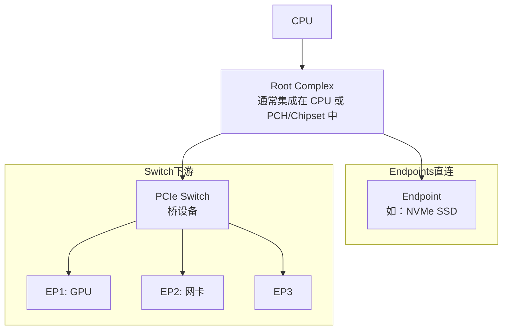
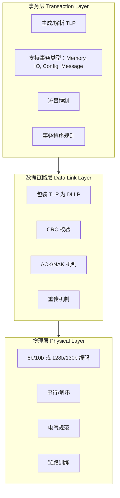
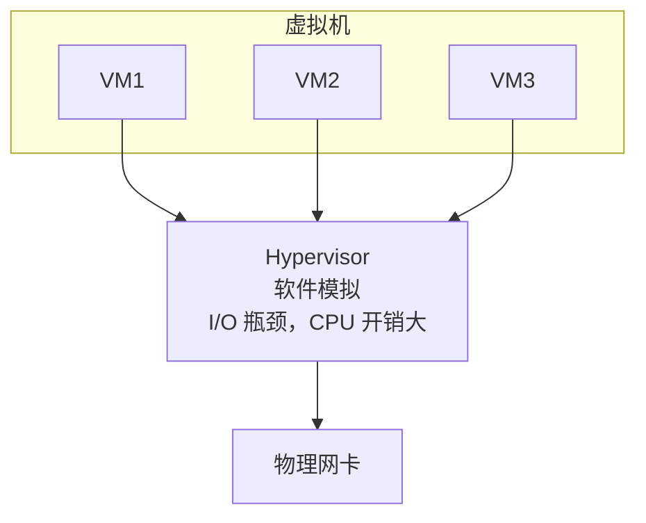
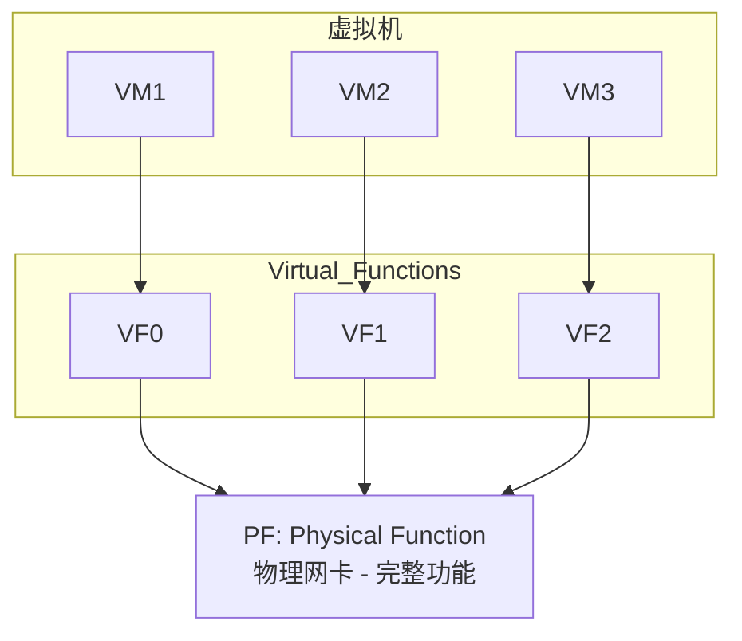

+++
title = "59. PCIe 驱动开发"
date = 2026-01-21
weight = 59000
description = "Linux PCIe 驱动开发完整指南：PCIe 基础、配置空间、BAR、DMA、MSI/MSI-X 中断、驱动开发实战"
[taxonomies]
tags = ["linux", "driver", "pcie", "kernel", "dma", "interrupt"]
+++

# PCIe 驱动开发

PCIe（Peripheral Component Interconnect Express）是现代计算机系统中最重要的高速总线标准。本文深入解析 PCIe 原理和 Linux PCIe 驱动开发。

---

## 一、PCIe 基础

### 1.1 PCIe 架构



**PCIe 拓扑特点：**
- 点对点串行链路（非共享总线）
- 树形拓扑
- 每个链路独立，全双工
- 支持热插拔

### 1.2 PCIe 速度演进

**PCIe 版本对照：**

| 版本 | 传输速率 | 编码 | x1 带宽 | x16 带宽 |
|------|----------|------|---------|----------|
| PCIe 1.0 | 2.5 GT/s | 8b/10b | 250 MB/s | 4 GB/s |
| PCIe 2.0 | 5.0 GT/s | 8b/10b | 500 MB/s | 8 GB/s |
| PCIe 3.0 | 8.0 GT/s | 128b/130b | ~1 GB/s | ~16 GB/s |
| PCIe 4.0 | 16.0 GT/s | 128b/130b | ~2 GB/s | ~32 GB/s |
| PCIe 5.0 | 32.0 GT/s | 128b/130b | ~4 GB/s | ~64 GB/s |
| PCIe 6.0 | 64.0 GT/s | PAM4+FEC | ~8 GB/s | ~128 GB/s |

- GT/s = Giga Transfers per second
- x1/x4/x8/x16 表示链路宽度（Lane 数）

### 1.3 PCIe 协议层



**TLP 类型：**

| 类型 | 说明 |
|------|------|
| Memory Read | 内存读请求 |
| Memory Write | 内存写请求 |
| IO Read/Write | IO 空间读写（传统 x86） |
| Config Read/Wr | 配置空间读写 |
| Message | 中断、电源管理、错误等信令 |
| Completion | 读请求的返回数据 |

---

## 二、PCIe 配置空间

### 2.1 配置空间布局

**PCIe 配置空间（4KB）：**

**0x00-0x3F: PCI 兼容配置头（64 字节）**

| 偏移 | 内容 |
|------|------|
| 0x00 | Vendor ID, Device ID |
| 0x04 | Command, Status |
| 0x08 | Rev ID, Class Code (CC/Subclass/ProgIF) |
| 0x0C | Cache Line Size, Latency Timer, Header Type, BIST |
| 0x10 | BAR0 (Base Address Register 0) |
| 0x14 | BAR1 |
| 0x18 | BAR2 |
| 0x1C | BAR3 |
| 0x20 | BAR4 |
| 0x24 | BAR5 |
| 0x28 | CardBus CIS Pointer |
| 0x2C | Subsystem Vendor ID, Subsystem ID |
| 0x30 | Expansion ROM Base Address |
| 0x34 | Capabilities Pointer, Reserved |
| 0x38 | Reserved |
| 0x3C | Interrupt Line, Interrupt Pin, Min_Gnt, Max_Lat |

**0x40-0xFF: PCI 能力链表（Capability List）**
- Power Management, MSI, MSI-X, PCIe Capability 等

**0x100-0xFFF: PCIe 扩展配置空间**
- 扩展能力：AER, ACS, SR-IOV, TPH 等

### 2.2 重要寄存器详解

**Command 寄存器 (0x04, 16-bit)：**

| Bit | 说明 |
|-----|------|
| 0 | I/O Space Enable - 启用 IO 空间访问 |
| 1 | Memory Space Enable - 启用内存空间访问 |
| 2 | Bus Master Enable - 启用 DMA（设备发起传输） |
| 6 | Parity Error Response |
| 8 | SERR# Enable |
| 10 | Interrupt Disable - 禁用传统中断 |

**Status 寄存器 (0x06, 16-bit)：**

| Bit | 说明 |
|-----|------|
| 3 | Interrupt Status |
| 4 | Capabilities List - 是否有能力链表 |
| 8 | Master Data Parity Error |
| 11 | Signaled Target Abort |
| 12 | Received Target Abort |
| 13 | Received Master Abort |
| 14 | Signaled System Error |
| 15 | Detected Parity Error |

### 2.3 BAR（Base Address Register）

**Memory BAR (32-bit) 格式：**

| Bit | 字段 | 说明 |
|-----|------|------|
| 31:4 | Base Address | 基地址 |
| 3 | PF | Prefetchable |
| 2:1 | Type | 00=32位, 10=64位 |
| 0 | Mem | 0=Memory Space |

**Memory BAR (64-bit)：** 使用两个连续 BAR
- BAR n: Address[31:4], PF, Type=10, 0
- BAR n+1: Address[63:32]

**I/O BAR 格式：**

| Bit | 字段 | 说明 |
|-----|------|------|
| 31:2 | I/O Base Address | I/O 基地址 |
| 1 | Reserved | 保留 |
| 0 | IO | 1=I/O Space |

**BAR 大小检测（BIOS/固件完成）：**
1. 向 BAR 写全 1
2. 读回值，低位的 0 表示地址对齐要求
3. 例如读回 0xFFFF0000，表示需要 64KB 对齐，大小 64KB

**BAR 使用示例：**
- BAR0: 设备寄存器 (4KB, Memory Mapped)
- BAR1: 设备内存 (256MB, Prefetchable)
- BAR2: MSI-X 表 (4KB)

---

## 三、Linux PCIe 子系统

### 3.1 关键数据结构

```c
/* pci_dev - PCI 设备结构 */
struct pci_dev {
    struct list_head bus_list;
    struct pci_bus *bus;        /* 所属总线 */
    struct pci_bus *subordinate; /* 如果是桥，下游总线 */
    
    /* 设备标识 */
    unsigned short vendor;       /* Vendor ID */
    unsigned short device;       /* Device ID */
    unsigned short subsystem_vendor;
    unsigned short subsystem_device;
    unsigned int class;          /* Class Code */
    u8 revision;                 /* Revision ID */
    
    /* BAR 资源 */
    struct resource resource[PCI_NUM_RESOURCES];
    
    /* 中断 */
    unsigned int irq;
    
    /* 驱动私有数据 */
    void *driver_data;
    
    /* DMA 相关 */
    struct device dev;
    
    /* 配置空间访问 */
    int cfg_size;
    
    /* ... */
};

/* pci_driver - PCI 驱动结构 */
struct pci_driver {
    struct list_head node;
    const char *name;
    
    /* 设备匹配表 */
    const struct pci_device_id *id_table;
    
    /* 回调函数 */
    int  (*probe)(struct pci_dev *dev, const struct pci_device_id *id);
    void (*remove)(struct pci_dev *dev);
    int  (*suspend)(struct pci_dev *dev, pm_message_t state);
    int  (*resume)(struct pci_dev *dev);
    void (*shutdown)(struct pci_dev *dev);
    
    /* SR-IOV */
    int  (*sriov_configure)(struct pci_dev *dev, int num_vfs);
    
    /* 错误处理 */
    const struct pci_error_handlers *err_handler;
    
    struct device_driver driver;
};

/* pci_device_id - 设备匹配 ID */
struct pci_device_id {
    __u32 vendor, device;        /* 或 PCI_ANY_ID */
    __u32 subvendor, subdevice;  /* 或 PCI_ANY_ID */
    __u32 class, class_mask;
    kernel_ulong_t driver_data;  /* 驱动私有数据 */
};
```

### 3.2 常用 API

```c
/* ============================================
 * 设备使能与资源获取
 * ============================================ */

/* 使能 PCI 设备 */
int pci_enable_device(struct pci_dev *dev);
int pci_enable_device_mem(struct pci_dev *dev);  /* 只使能 Memory */

/* 禁用设备 */
void pci_disable_device(struct pci_dev *dev);

/* 请求/释放资源 */
int pci_request_regions(struct pci_dev *dev, const char *name);
void pci_release_regions(struct pci_dev *dev);

/* 获取 BAR 资源 */
resource_size_t pci_resource_start(struct pci_dev *dev, int bar);
resource_size_t pci_resource_len(struct pci_dev *dev, int bar);
unsigned long pci_resource_flags(struct pci_dev *dev, int bar);

/* 映射 BAR 到内核地址空间 */
void __iomem *pci_iomap(struct pci_dev *dev, int bar, unsigned long max);
void pci_iounmap(struct pci_dev *dev, void __iomem *addr);

/* ============================================
 * 配置空间访问
 * ============================================ */

int pci_read_config_byte(struct pci_dev *dev, int where, u8 *val);
int pci_read_config_word(struct pci_dev *dev, int where, u16 *val);
int pci_read_config_dword(struct pci_dev *dev, int where, u32 *val);

int pci_write_config_byte(struct pci_dev *dev, int where, u8 val);
int pci_write_config_word(struct pci_dev *dev, int where, u16 val);
int pci_write_config_dword(struct pci_dev *dev, int where, u32 val);

/* ============================================
 * DMA 相关
 * ============================================ */

/* 设置 DMA 掩码 */
int dma_set_mask(struct device *dev, u64 mask);
int dma_set_coherent_mask(struct device *dev, u64 mask);
int dma_set_mask_and_coherent(struct device *dev, u64 mask);

/* 使能 Bus Mastering */
void pci_set_master(struct pci_dev *dev);

/* ============================================
 * 中断相关
 * ============================================ */

/* MSI 中断 */
int pci_enable_msi(struct pci_dev *dev);
void pci_disable_msi(struct pci_dev *dev);

/* MSI-X 中断 */
int pci_enable_msix_range(struct pci_dev *dev, struct msix_entry *entries,
                          int minvec, int maxvec);
void pci_disable_msix(struct pci_dev *dev);

/* 通用中断分配（推荐） */
int pci_alloc_irq_vectors(struct pci_dev *dev, unsigned int min_vecs,
                          unsigned int max_vecs, unsigned int flags);
void pci_free_irq_vectors(struct pci_dev *dev);
int pci_irq_vector(struct pci_dev *dev, unsigned int nr);
```

---

## 四、MSI/MSI-X 中断

### 4.1 中断类型对比

**1. 传统中断 (INTx)：**
- 使用 4 条共享中断线 (INTA#, INTB#, INTC#, INTD#)
- 电平触发
- 需要中断处理中查询设备确认来源
- 已过时，新设备应使用 MSI/MSI-X

**2. MSI (Message Signaled Interrupts)：**
- 设备通过写特定内存地址触发中断
- 每设备最多 32 个中断向量
- 向量数必须是 2 的幂
- 所有向量共享一个地址

**3. MSI-X (Extended MSI)：**
- 每设备最多 2048 个中断向量
- 向量数无需是 2 的幂
- 每个向量可以有独立地址
- 支持中断掩码
- 现代高性能设备推荐

**MSI vs MSI-X 对比：**

| 特性 | MSI | MSI-X |
|------|-----|-------|
| 最大向量数 | 32 | 2048 |
| 向量数限制 | 必须是 2^n | 任意 |
| 地址 | 共享一个 | 每向量独立 |
| 中断掩码 | 无 | 支持 |
| 存储位置 | 配置空间 | BAR 中的表 |
| 适用场景 | 简单设备 | 高性能多队列设备 |

### 4.2 MSI-X 实现

```c
/* MSI-X 表结构（在设备 BAR 中） */
struct msix_entry {
    u32 vector;    /* 内核分配的中断号 */
    u16 entry;     /* 表索引 */
};

/* 使用 pci_alloc_irq_vectors（推荐方式） */
static int setup_msix(struct pci_dev *pdev, struct my_dev *dev)
{
    int nvec, i, ret;
    
    /* 请求 MSI-X 中断，最少 1 个，最多 dev->num_queues 个 */
    nvec = pci_alloc_irq_vectors(pdev, 1, dev->num_queues,
                                  PCI_IRQ_MSIX | PCI_IRQ_MSI);
    if (nvec < 0)
        return nvec;
    
    dev->num_irqs = nvec;
    
    /* 为每个向量注册中断处理 */
    for (i = 0; i < nvec; i++) {
        int irq = pci_irq_vector(pdev, i);
        
        ret = request_irq(irq, my_irq_handler, 0,
                          dev->irq_names[i], &dev->queues[i]);
        if (ret) {
            /* 清理已注册的中断 */
            while (--i >= 0)
                free_irq(pci_irq_vector(pdev, i), &dev->queues[i]);
            pci_free_irq_vectors(pdev);
            return ret;
        }
    }
    
    return 0;
}

/* 中断处理函数 */
static irqreturn_t my_irq_handler(int irq, void *data)
{
    struct my_queue *queue = data;
    u32 status;
    
    /* 读取中断状态 */
    status = readl(queue->regs + IRQ_STATUS);
    if (!status)
        return IRQ_NONE;
    
    /* 清除中断 */
    writel(status, queue->regs + IRQ_STATUS);
    
    /* 处理中断 */
    if (status & RX_DONE)
        napi_schedule(&queue->napi);
    
    if (status & TX_DONE)
        my_tx_complete(queue);
    
    return IRQ_HANDLED;
}

/* 中断亲和性设置（将中断绑定到特定 CPU） */
static void set_irq_affinity(struct my_dev *dev)
{
    int i;
    
    for (i = 0; i < dev->num_irqs; i++) {
        int irq = pci_irq_vector(dev->pdev, i);
        int cpu = i % num_online_cpus();
        
        irq_set_affinity_hint(irq, cpumask_of(cpu));
    }
}

/* 清理中断 */
static void cleanup_msix(struct my_dev *dev)
{
    int i;
    
    for (i = 0; i < dev->num_irqs; i++) {
        int irq = pci_irq_vector(dev->pdev, i);
        irq_set_affinity_hint(irq, NULL);
        free_irq(irq, &dev->queues[i]);
    }
    
    pci_free_irq_vectors(dev->pdev);
}
```

---

## 五、DMA 操作

### 5.1 DMA 映射类型

**1. 一致性映射 (Coherent/Consistent DMA)：**
- CPU 和设备都可以随时访问
- 硬件保证缓存一致性
- 适用于：DMA 描述符、频繁读写的共享结构
- API: `dma_alloc_coherent()`

**2. 流式映射 (Streaming DMA)：**
- 单向传输：TO_DEVICE 或 FROM_DEVICE
- 需要显式同步操作
- 更高效（某些平台）
- 适用于：数据缓冲区、临时传输
- API: `dma_map_single()`, `dma_map_sg()`

**选择建议：**

| 场景 | 推荐映射方式 |
|------|-------------|
| DMA 描述符环 | Coherent |
| 命令/状态结构 | Coherent |
| 网络数据包缓冲区 | Streaming |
| 磁盘 I/O 数据 | Streaming |
| 大块数据传输 | Streaming |

### 5.2 DMA API 使用

```c
/* ============================================
 * 一致性 DMA 映射
 * ============================================ */

struct my_dma_desc {
    __le64 addr;
    __le32 len;
    __le32 flags;
};

static int alloc_dma_ring(struct my_dev *dev)
{
    /* 分配一致性 DMA 内存 */
    dev->desc_ring = dma_alloc_coherent(&dev->pdev->dev,
                                         dev->ring_size * sizeof(struct my_dma_desc),
                                         &dev->desc_ring_dma,
                                         GFP_KERNEL);
    if (!dev->desc_ring)
        return -ENOMEM;
    
    /* 内存已清零，可直接使用 */
    /* dev->desc_ring 是虚拟地址，dev->desc_ring_dma 是总线地址 */
    
    /* 写入硬件：设备使用 DMA 地址 */
    writel(lower_32_bits(dev->desc_ring_dma), dev->regs + DESC_BASE_LOW);
    writel(upper_32_bits(dev->desc_ring_dma), dev->regs + DESC_BASE_HIGH);
    
    return 0;
}

static void free_dma_ring(struct my_dev *dev)
{
    dma_free_coherent(&dev->pdev->dev,
                      dev->ring_size * sizeof(struct my_dma_desc),
                      dev->desc_ring,
                      dev->desc_ring_dma);
}

/* ============================================
 * 流式 DMA 映射
 * ============================================ */

/* 单缓冲区映射 */
static int submit_buffer(struct my_dev *dev, void *buf, size_t len)
{
    dma_addr_t dma_addr;
    
    /* 映射缓冲区（发送到设备） */
    dma_addr = dma_map_single(&dev->pdev->dev, buf, len, DMA_TO_DEVICE);
    
    /* 检查映射错误 */
    if (dma_mapping_error(&dev->pdev->dev, dma_addr))
        return -EIO;
    
    /* 填充描述符 */
    dev->desc_ring[dev->head].addr = cpu_to_le64(dma_addr);
    dev->desc_ring[dev->head].len = cpu_to_le32(len);
    
    /* 保存映射信息以便后续解除映射 */
    dev->buf_info[dev->head].dma_addr = dma_addr;
    dev->buf_info[dev->head].len = len;
    
    return 0;
}

static void complete_buffer(struct my_dev *dev, int idx)
{
    /* 解除映射 */
    dma_unmap_single(&dev->pdev->dev,
                     dev->buf_info[idx].dma_addr,
                     dev->buf_info[idx].len,
                     DMA_TO_DEVICE);
}

/* 接收缓冲区（从设备接收） */
static int setup_rx_buffer(struct my_dev *dev, int idx)
{
    struct sk_buff *skb;
    dma_addr_t dma_addr;
    
    skb = netdev_alloc_skb(dev->ndev, RX_BUF_SIZE);
    if (!skb)
        return -ENOMEM;
    
    /* 映射（从设备接收） */
    dma_addr = dma_map_single(&dev->pdev->dev, skb->data,
                               RX_BUF_SIZE, DMA_FROM_DEVICE);
    if (dma_mapping_error(&dev->pdev->dev, dma_addr)) {
        dev_kfree_skb(skb);
        return -EIO;
    }
    
    dev->rx_skb[idx] = skb;
    dev->desc_ring[idx].addr = cpu_to_le64(dma_addr);
    
    return 0;
}

/* ============================================
 * Scatter-Gather DMA
 * ============================================ */

static int submit_sg_buffer(struct my_dev *dev, struct scatterlist *sg,
                            int nents, enum dma_data_direction dir)
{
    int mapped_nents;
    struct scatterlist *s;
    int i;
    
    /* 映射 scatter-gather 列表 */
    mapped_nents = dma_map_sg(&dev->pdev->dev, sg, nents, dir);
    if (mapped_nents == 0)
        return -EIO;
    
    /* 填充描述符 */
    i = 0;
    for_each_sg(sg, s, mapped_nents, i) {
        dev->desc_ring[dev->head + i].addr = cpu_to_le64(sg_dma_address(s));
        dev->desc_ring[dev->head + i].len = cpu_to_le32(sg_dma_len(s));
    }
    
    return mapped_nents;
}

static void complete_sg_buffer(struct my_dev *dev, struct scatterlist *sg,
                                int nents, enum dma_data_direction dir)
{
    dma_unmap_sg(&dev->pdev->dev, sg, nents, dir);
}

/* ============================================
 * DMA 同步（流式映射需要）
 * ============================================ */

/* CPU 访问前同步 */
dma_sync_single_for_cpu(&dev->pdev->dev, dma_addr, len, DMA_FROM_DEVICE);

/* 设备访问前同步 */
dma_sync_single_for_device(&dev->pdev->dev, dma_addr, len, DMA_TO_DEVICE);
```

---

## 六、完整 PCIe 驱动示例

```c
/*
 * 完整的 PCIe 设备驱动框架
 */

#include <linux/module.h>
#include <linux/pci.h>
#include <linux/interrupt.h>
#include <linux/dma-mapping.h>

#define DRV_NAME        "my_pcie"
#define VENDOR_ID       0x1234
#define DEVICE_ID       0x5678

#define REG_CTRL        0x00
#define REG_STATUS      0x04
#define REG_DMA_ADDR    0x10
#define REG_DMA_LEN     0x14
#define REG_IRQ_STATUS  0x20
#define REG_IRQ_MASK    0x24

struct my_pcie_dev {
    struct pci_dev *pdev;
    void __iomem *bar0;             /* 寄存器映射 */
    void __iomem *bar1;             /* 设备内存（可选） */
    
    /* DMA */
    void *dma_buf;
    dma_addr_t dma_addr;
    size_t dma_size;
    
    /* 中断 */
    int num_irqs;
    
    /* 其他 */
    struct mutex lock;
};

/* ============================================
 * 设备操作函数
 * ============================================ */

static int my_pcie_start_dma(struct my_pcie_dev *dev, size_t len)
{
    /* 确保之前的 DMA 完成 */
    if (readl(dev->bar0 + REG_STATUS) & STATUS_DMA_BUSY)
        return -EBUSY;
    
    /* 设置 DMA 地址和长度 */
    writeq(dev->dma_addr, dev->bar0 + REG_DMA_ADDR);
    writel(len, dev->bar0 + REG_DMA_LEN);
    
    /* 内存屏障：确保上述写入完成 */
    wmb();
    
    /* 启动 DMA */
    writel(CTRL_START_DMA, dev->bar0 + REG_CTRL);
    
    return 0;
}

static irqreturn_t my_pcie_irq(int irq, void *data)
{
    struct my_pcie_dev *dev = data;
    u32 status;
    
    status = readl(dev->bar0 + REG_IRQ_STATUS);
    if (!status)
        return IRQ_NONE;
    
    /* 清除中断 */
    writel(status, dev->bar0 + REG_IRQ_STATUS);
    
    if (status & IRQ_DMA_DONE) {
        /* DMA 完成处理 */
        dev_info(&dev->pdev->dev, "DMA completed\n");
    }
    
    if (status & IRQ_ERROR) {
        /* 错误处理 */
        dev_err(&dev->pdev->dev, "Device error\n");
    }
    
    return IRQ_HANDLED;
}

/* ============================================
 * Probe / Remove
 * ============================================ */

static int my_pcie_probe(struct pci_dev *pdev, const struct pci_device_id *id)
{
    struct my_pcie_dev *dev;
    int ret;
    
    dev_info(&pdev->dev, "Probing device %04x:%04x\n",
             pdev->vendor, pdev->device);
    
    /* 分配设备结构 */
    dev = devm_kzalloc(&pdev->dev, sizeof(*dev), GFP_KERNEL);
    if (!dev)
        return -ENOMEM;
    
    dev->pdev = pdev;
    mutex_init(&dev->lock);
    pci_set_drvdata(pdev, dev);
    
    /* 使能设备 */
    ret = pcim_enable_device(pdev);  /* 使用托管 API，自动清理 */
    if (ret) {
        dev_err(&pdev->dev, "Failed to enable device\n");
        return ret;
    }
    
    /* 请求 BAR 区域 */
    ret = pcim_iomap_regions(pdev, BIT(0) | BIT(1), DRV_NAME);
    if (ret) {
        dev_err(&pdev->dev, "Failed to request regions\n");
        return ret;
    }
    
    /* 映射 BAR */
    dev->bar0 = pcim_iomap_table(pdev)[0];
    dev->bar1 = pcim_iomap_table(pdev)[1];  /* 可能为 NULL */
    
    /* 设置 DMA */
    ret = dma_set_mask_and_coherent(&pdev->dev, DMA_BIT_MASK(64));
    if (ret) {
        ret = dma_set_mask_and_coherent(&pdev->dev, DMA_BIT_MASK(32));
        if (ret) {
            dev_err(&pdev->dev, "No usable DMA configuration\n");
            return ret;
        }
    }
    
    /* 使能 Bus Mastering */
    pci_set_master(pdev);
    
    /* 分配 DMA 缓冲区 */
    dev->dma_size = 4096;
    dev->dma_buf = dma_alloc_coherent(&pdev->dev, dev->dma_size,
                                       &dev->dma_addr, GFP_KERNEL);
    if (!dev->dma_buf) {
        dev_err(&pdev->dev, "Failed to allocate DMA buffer\n");
        return -ENOMEM;
    }
    
    /* 设置中断（MSI-X 优先） */
    ret = pci_alloc_irq_vectors(pdev, 1, 4,
                                 PCI_IRQ_MSIX | PCI_IRQ_MSI | PCI_IRQ_LEGACY);
    if (ret < 0) {
        dev_err(&pdev->dev, "Failed to allocate IRQ vectors\n");
        goto err_free_dma;
    }
    dev->num_irqs = ret;
    
    /* 注册中断处理 */
    ret = request_irq(pci_irq_vector(pdev, 0), my_pcie_irq, 0, DRV_NAME, dev);
    if (ret) {
        dev_err(&pdev->dev, "Failed to request IRQ\n");
        goto err_free_vectors;
    }
    
    /* 使能中断 */
    writel(IRQ_DMA_DONE | IRQ_ERROR, dev->bar0 + REG_IRQ_MASK);
    
    dev_info(&pdev->dev, "Driver loaded successfully\n");
    return 0;

err_free_vectors:
    pci_free_irq_vectors(pdev);
err_free_dma:
    dma_free_coherent(&pdev->dev, dev->dma_size, dev->dma_buf, dev->dma_addr);
    return ret;
}

static void my_pcie_remove(struct pci_dev *pdev)
{
    struct my_pcie_dev *dev = pci_get_drvdata(pdev);
    
    dev_info(&pdev->dev, "Removing device\n");
    
    /* 禁用中断 */
    writel(0, dev->bar0 + REG_IRQ_MASK);
    
    /* 释放中断 */
    free_irq(pci_irq_vector(pdev, 0), dev);
    pci_free_irq_vectors(pdev);
    
    /* 释放 DMA 缓冲区 */
    dma_free_coherent(&pdev->dev, dev->dma_size, dev->dma_buf, dev->dma_addr);
    
    /* pcim_* 资源自动释放 */
}

/* ============================================
 * 电源管理
 * ============================================ */

static int my_pcie_suspend(struct pci_dev *pdev, pm_message_t state)
{
    struct my_pcie_dev *dev = pci_get_drvdata(pdev);
    
    /* 保存设备状态 */
    /* 停止 DMA */
    /* 禁用中断 */
    
    pci_save_state(pdev);
    pci_disable_device(pdev);
    pci_set_power_state(pdev, pci_choose_state(pdev, state));
    
    return 0;
}

static int my_pcie_resume(struct pci_dev *pdev)
{
    struct my_pcie_dev *dev = pci_get_drvdata(pdev);
    
    pci_set_power_state(pdev, PCI_D0);
    pci_restore_state(pdev);
    
    if (pci_enable_device(pdev))
        return -EIO;
    
    pci_set_master(pdev);
    
    /* 恢复设备状态 */
    /* 重新使能中断 */
    
    return 0;
}

/* ============================================
 * 错误处理
 * ============================================ */

static pci_ers_result_t my_pcie_error_detected(struct pci_dev *pdev,
                                                pci_channel_state_t state)
{
    struct my_pcie_dev *dev = pci_get_drvdata(pdev);
    
    dev_err(&pdev->dev, "PCIe error detected, state=%d\n", state);
    
    switch (state) {
    case pci_channel_io_normal:
        return PCI_ERS_RESULT_CAN_RECOVER;
    case pci_channel_io_frozen:
        /* 停止所有 I/O */
        return PCI_ERS_RESULT_NEED_RESET;
    case pci_channel_io_perm_failure:
        return PCI_ERS_RESULT_DISCONNECT;
    }
    
    return PCI_ERS_RESULT_NEED_RESET;
}

static pci_ers_result_t my_pcie_slot_reset(struct pci_dev *pdev)
{
    struct my_pcie_dev *dev = pci_get_drvdata(pdev);
    
    dev_info(&pdev->dev, "Slot reset\n");
    
    if (pci_enable_device(pdev))
        return PCI_ERS_RESULT_DISCONNECT;
    
    pci_set_master(pdev);
    pci_restore_state(pdev);
    
    return PCI_ERS_RESULT_RECOVERED;
}

static void my_pcie_error_resume(struct pci_dev *pdev)
{
    struct my_pcie_dev *dev = pci_get_drvdata(pdev);
    
    dev_info(&pdev->dev, "Resuming from error\n");
    
    /* 恢复正常操作 */
}

static const struct pci_error_handlers my_pcie_err_handlers = {
    .error_detected = my_pcie_error_detected,
    .slot_reset     = my_pcie_slot_reset,
    .resume         = my_pcie_error_resume,
};

/* ============================================
 * 驱动注册
 * ============================================ */

static const struct pci_device_id my_pcie_ids[] = {
    { PCI_DEVICE(VENDOR_ID, DEVICE_ID) },
    { PCI_DEVICE(VENDOR_ID, DEVICE_ID + 1), .driver_data = 1 },
    { 0 }
};
MODULE_DEVICE_TABLE(pci, my_pcie_ids);

static struct pci_driver my_pcie_driver = {
    .name           = DRV_NAME,
    .id_table       = my_pcie_ids,
    .probe          = my_pcie_probe,
    .remove         = my_pcie_remove,
    .suspend        = my_pcie_suspend,
    .resume         = my_pcie_resume,
    .err_handler    = &my_pcie_err_handlers,
};

module_pci_driver(my_pcie_driver);

MODULE_LICENSE("GPL");
MODULE_AUTHOR("Your Name");
MODULE_DESCRIPTION("My PCIe Device Driver");
```

---

## 七、调试技巧

```bash
# 列出所有 PCI 设备
$ lspci
$ lspci -v              # 详细信息
$ lspci -vvv            # 更详细
$ lspci -nn             # 显示 Vendor:Device ID
$ lspci -t              # 树形显示

# 查看特定设备
$ lspci -s 00:1f.0 -vvv

# 查看配置空间
$ lspci -xxx -s 00:1f.0

# setpci 直接操作配置空间
$ setpci -s 00:1f.0 COMMAND  # 读取 Command 寄存器
$ setpci -s 00:1f.0 COMMAND=0x07  # 写入

# 查看 sysfs 中的 PCI 信息
$ ls /sys/bus/pci/devices/
$ cat /sys/bus/pci/devices/0000:00:1f.0/vendor
$ cat /sys/bus/pci/devices/0000:00:1f.0/device
$ cat /sys/bus/pci/devices/0000:00:1f.0/resource

# 查看 BAR
$ cat /sys/bus/pci/devices/0000:00:1f.0/resource
# 输出格式：start end flags

# MSI/MSI-X 信息
$ cat /proc/interrupts | grep -i msi
$ cat /sys/bus/pci/devices/0000:00:1f.0/msi_irqs/

# 驱动绑定
$ echo "0000:00:1f.0" > /sys/bus/pci/drivers/my_driver/bind
$ echo "0000:00:1f.0" > /sys/bus/pci/drivers/my_driver/unbind

# 重新扫描 PCI 总线
$ echo 1 > /sys/bus/pci/rescan

# 移除设备
$ echo 1 > /sys/bus/pci/devices/0000:00:1f.0/remove

# 查看 dmesg
$ dmesg | grep -i pci
$ dmesg | grep my_pcie
```

---

## 八、SR-IOV 虚拟化

### 8.1 SR-IOV 概念

**传统虚拟化 I/O：**



**SR-IOV 虚拟化：**



**优势：**
- VM 直接访问 VF，绕过 Hypervisor
- 接近原生性能
- 减少 CPU 开销
- 支持数十到数百个 VF

### 8.2 SR-IOV 驱动开发

```c
/* SR-IOV PF 驱动示例 */

#include <linux/pci.h>

struct my_pf_adapter {
    struct pci_dev *pdev;
    void __iomem *hw_addr;
    int num_vfs;
    struct my_vf_info *vf_info;  /* VF 管理信息 */
};

struct my_vf_info {
    int vf_id;
    bool active;
    u8 mac_addr[ETH_ALEN];
    u16 vlan_id;
    int tx_rate;  /* 带宽限制 */
};

/* 启用 SR-IOV */
static int my_pci_sriov_configure(struct pci_dev *pdev, int num_vfs)
{
    struct my_pf_adapter *adapter = pci_get_drvdata(pdev);
    int err;

    if (num_vfs == 0) {
        /* 禁用 SR-IOV */
        pci_disable_sriov(pdev);
        kfree(adapter->vf_info);
        adapter->vf_info = NULL;
        adapter->num_vfs = 0;
        return 0;
    }

    /* 分配 VF 管理结构 */
    adapter->vf_info = kcalloc(num_vfs, sizeof(*adapter->vf_info),
                               GFP_KERNEL);
    if (!adapter->vf_info)
        return -ENOMEM;

    /* 初始化 VF 资源 */
    for (int i = 0; i < num_vfs; i++) {
        adapter->vf_info[i].vf_id = i;
        /* 分配默认 MAC、队列等资源 */
        my_init_vf_resources(adapter, i);
    }

    /* 启用 SR-IOV */
    err = pci_enable_sriov(pdev, num_vfs);
    if (err) {
        kfree(adapter->vf_info);
        adapter->vf_info = NULL;
        return err;
    }

    adapter->num_vfs = num_vfs;
    dev_info(&pdev->dev, "Enabled %d VFs\n", num_vfs);
    return num_vfs;
}

/* VF MAC 地址设置（从 PF 控制） */
static int my_set_vf_mac(struct net_device *netdev, int vf, u8 *mac)
{
    struct my_pf_adapter *adapter = netdev_priv(netdev);

    if (vf >= adapter->num_vfs)
        return -EINVAL;

    if (!is_valid_ether_addr(mac))
        return -EINVAL;

    memcpy(adapter->vf_info[vf].mac_addr, mac, ETH_ALEN);
    /* 更新硬件 */
    my_hw_set_vf_mac(adapter, vf, mac);
    return 0;
}

/* VF VLAN 设置 */
static int my_set_vf_vlan(struct net_device *netdev, int vf,
                          u16 vlan, u8 qos, __be16 proto)
{
    struct my_pf_adapter *adapter = netdev_priv(netdev);

    if (vf >= adapter->num_vfs)
        return -EINVAL;

    adapter->vf_info[vf].vlan_id = vlan;
    my_hw_set_vf_vlan(adapter, vf, vlan, qos);
    return 0;
}

/* VF 带宽限制 */
static int my_set_vf_rate(struct net_device *netdev, int vf,
                          int min_tx_rate, int max_tx_rate)
{
    struct my_pf_adapter *adapter = netdev_priv(netdev);

    if (vf >= adapter->num_vfs)
        return -EINVAL;

    adapter->vf_info[vf].tx_rate = max_tx_rate;
    my_hw_set_vf_rate(adapter, vf, max_tx_rate);
    return 0;
}

/* VF 信息查询 */
static int my_get_vf_config(struct net_device *netdev, int vf,
                            struct ifla_vf_info *ivi)
{
    struct my_pf_adapter *adapter = netdev_priv(netdev);

    if (vf >= adapter->num_vfs)
        return -EINVAL;

    ivi->vf = vf;
    memcpy(ivi->mac, adapter->vf_info[vf].mac_addr, ETH_ALEN);
    ivi->vlan = adapter->vf_info[vf].vlan_id;
    ivi->max_tx_rate = adapter->vf_info[vf].tx_rate;
    return 0;
}

/* PF 网络设备操作 */
static const struct net_device_ops my_netdev_ops = {
    .ndo_open           = my_open,
    .ndo_stop           = my_stop,
    .ndo_start_xmit     = my_xmit,
    .ndo_set_vf_mac     = my_set_vf_mac,
    .ndo_set_vf_vlan    = my_set_vf_vlan,
    .ndo_set_vf_rate    = my_set_vf_rate,
    .ndo_get_vf_config  = my_get_vf_config,
    /* ... */
};

/* PCI 驱动注册 */
static struct pci_driver my_pf_driver = {
    .name        = "my_sriov_nic",
    .id_table    = my_pci_ids,
    .probe       = my_probe,
    .remove      = my_remove,
    .sriov_configure = my_pci_sriov_configure,  /* 关键回调 */
};
```

### 8.3 SR-IOV 使用

```bash
# 查看 SR-IOV 能力
$ lspci -v -s 00:1f.0 | grep -i "sr-iov"

# 查看支持的 VF 数量
$ cat /sys/class/net/eth0/device/sriov_totalvfs

# 创建 VF
$ echo 4 > /sys/class/net/eth0/device/sriov_numvfs

# 查看 VF
$ lspci | grep "Virtual Function"
$ ip link show eth0  # 可看到 vf 0, vf 1 等

# 配置 VF MAC
$ ip link set eth0 vf 0 mac 00:11:22:33:44:55

# 配置 VF VLAN
$ ip link set eth0 vf 0 vlan 100

# 限制 VF 带宽
$ ip link set eth0 vf 0 max_tx_rate 1000  # Mbps

# 将 VF 绑定到 VM（vfio-pci）
$ echo "0000:03:10.0" > /sys/bus/pci/devices/0000:03:10.0/driver/unbind
$ echo "vfio-pci" > /sys/bus/pci/devices/0000:03:10.0/driver_override
$ echo "0000:03:10.0" > /sys/bus/pci/drivers/vfio-pci/bind

# QEMU 使用 VF
$ qemu-system-x86_64 \
    -device vfio-pci,host=03:10.0 \
    ...
```

---

## 九、AER（高级错误报告）

```c
/* AER 处理回调 */

static pci_ers_result_t my_io_error_detected(struct pci_dev *pdev,
                                              pci_channel_state_t state)
{
    struct my_device *dev = pci_get_drvdata(pdev);

    switch (state) {
    case pci_channel_io_normal:
        return PCI_ERS_RESULT_CAN_RECOVER;

    case pci_channel_io_frozen:
        /* 停止 DMA 和中断 */
        my_stop_device(dev);
        return PCI_ERS_RESULT_NEED_RESET;

    case pci_channel_io_perm_failure:
        /* 不可恢复 */
        return PCI_ERS_RESULT_DISCONNECT;
    }
    return PCI_ERS_RESULT_NEED_RESET;
}

static pci_ers_result_t my_slot_reset(struct pci_dev *pdev)
{
    struct my_device *dev = pci_get_drvdata(pdev);

    /* 重新初始化设备 */
    if (pci_enable_device(pdev)) {
        dev_err(&pdev->dev, "Cannot re-enable device\n");
        return PCI_ERS_RESULT_DISCONNECT;
    }

    pci_set_master(pdev);
    pci_restore_state(pdev);

    my_reinit_device(dev);
    return PCI_ERS_RESULT_RECOVERED;
}

static void my_io_resume(struct pci_dev *pdev)
{
    struct my_device *dev = pci_get_drvdata(pdev);

    /* 恢复正常操作 */
    my_resume_device(dev);
}

static const struct pci_error_handlers my_err_handler = {
    .error_detected = my_io_error_detected,
    .slot_reset     = my_slot_reset,
    .resume         = my_io_resume,
};

static struct pci_driver my_driver = {
    .name         = "my_pcie_driver",
    .id_table     = my_ids,
    .probe        = my_probe,
    .remove       = my_remove,
    .err_handler  = &my_err_handler,  /* 注册错误处理 */
};
```

```bash
# 查看 AER 信息
$ lspci -vvv -s 00:1f.0 | grep -A 20 "Advanced Error Reporting"

# 查看错误统计
$ cat /sys/bus/pci/devices/0000:00:1f.0/aer_dev_correctable
$ cat /sys/bus/pci/devices/0000:00:1f.0/aer_dev_nonfatal

# 手动注入错误（测试）
$ echo :0028 > /sys/kernel/debug/aer_inject/error_type
$ echo 0000:00:1f.0 > /sys/kernel/debug/aer_inject/inject
```

---

## 相关文章

- [上一篇：58 - 以太网与 PHY 驱动开发](@/articles/linux/linux-58-以太网与PHY驱动开发.md)
- [30 - Linux 设备驱动模型详解](@/articles/linux/linux-30-Linux设备驱动模型详解.md)
- [17 - 中断与系统调用详解](@/articles/linux/linux-17-中断与系统调用详解.md)
