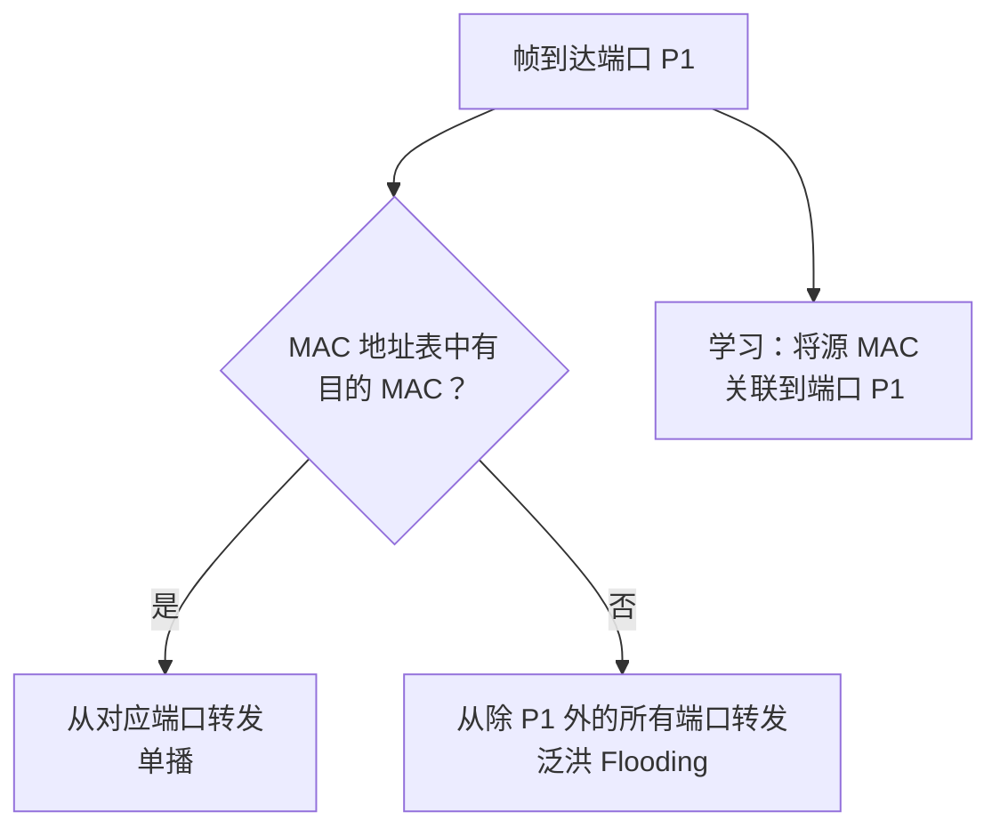
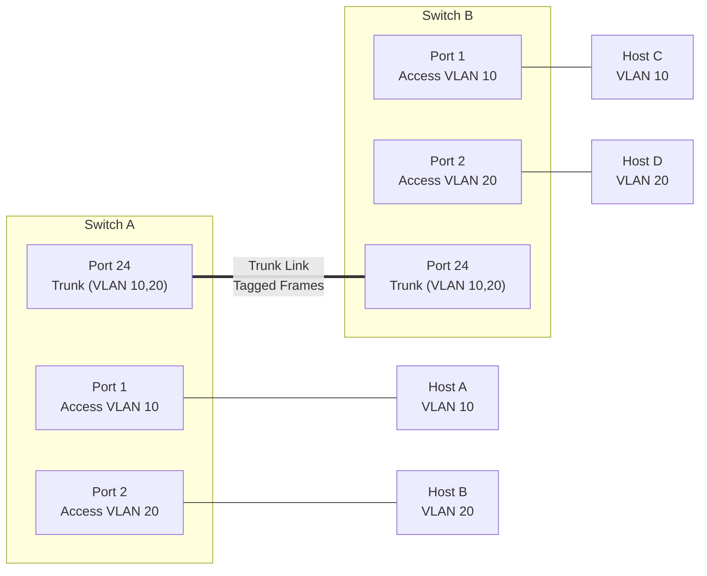
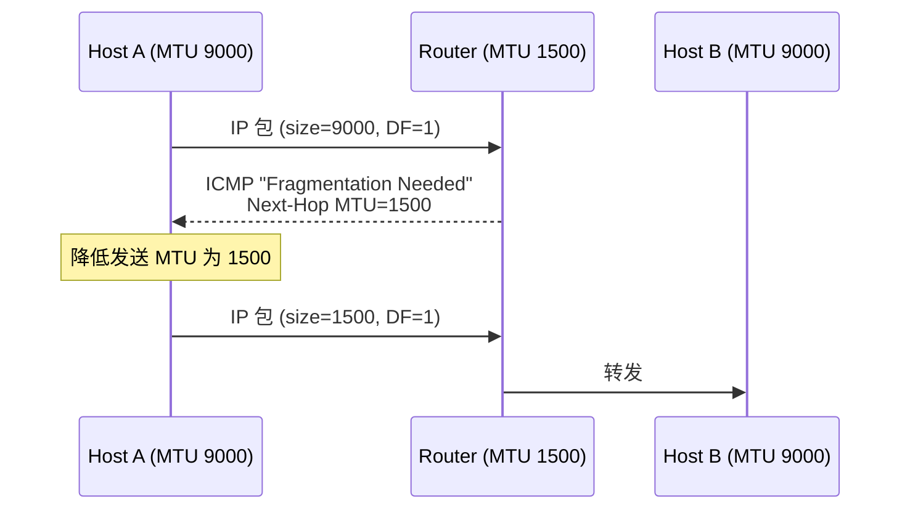

+++
title = "01.Ethernet基础与帧结构详解"
description = "以太网帧结构、MAC地址、VLAN、以太网类型演进、MTU/Jumbo Frame、流量控制与交换机转发原理"
date = 2025-01-16
[taxonomies]
tags = ["networking", "ethernet", "layer2", "vlan", "fundamentals"]
[extra]
toc = true
+++

# Ethernet 基础与帧结构详解

---

## 一、以太网概述

### 1.1 什么是以太网

以太网（Ethernet）是**局域网（LAN）**中最广泛使用的有线网络技术，工作在 **OSI 模型的数据链路层（L2）** 和物理层（L1）。由 Bob Metcalfe 于 1973 年在 Xerox PARC 发明，后经 IEEE 802.3 标准化。

**核心特征**：
- 基于 **帧（Frame）** 进行数据传输
- 使用 **MAC 地址** 标识设备
- 支持 **全双工** 通信（现代以太网）
- 速率从 10 Mbps 演进到 800 Gbps

### 1.2 以太网速率演进

| 标准 | 速率 | 介质 | 最大距离 | 年份 |
|------|------|------|---------|------|
| 10BASE-T | 10 Mbps | Cat3 双绞线 | 100m | 1990 |
| 100BASE-TX | 100 Mbps | Cat5 双绞线 | 100m | 1995 |
| 1000BASE-T | 1 Gbps | Cat5e/Cat6 | 100m | 1999 |
| 10GBASE-T | 10 Gbps | Cat6a/Cat7 | 100m | 2006 |
| 10GBASE-SR | 10 Gbps | 多模光纤 | 300m | 2002 |
| 25GBASE-SR | 25 Gbps | 多模光纤 | 100m | 2016 |
| 40GBASE-SR4 | 40 Gbps | 多模光纤 (MPO) | 100m | 2010 |
| 100GBASE-SR4 | 100 Gbps | 多模光纤 (MPO) | 100m | 2010 |
| 200GBASE-SR4 | 200 Gbps | 多模光纤 | 100m | 2017 |
| 400GBASE-SR8 | 400 Gbps | 多模光纤 | 100m | 2017 |
| 800GE | 800 Gbps | 单模光纤 | - | 2024 |

**数据中心主流**：服务器网卡 25G/100G，交换机上行 100G/400G。

### 1.3 高速以太网物理层技术

- **PCS (Physical Coding Sublayer)**：高速以太网（25G+）使用 Reed-Solomon FEC 纠错。
  - **RS-FEC (KR4/KP4)**：25G/100G 标配。RS(528,514) 用于 25G KR，RS(544,514) 用于 100G KP4。纠错能力强，引入 ~100ns 延迟。
  - **FC-FEC (Firecode/Base-R)**：低延迟 FEC，纠错能力弱于 RS-FEC。
  - **无 FEC**：25G 短距离 DAC/光纤可不开 FEC，但高误码率环境必须开启。
- **Lane Bonding**：100GE = 4×25G lanes（NRZ）或 2×50G lanes（PAM4）；400GE = 8×50G lanes（PAM4）或 4×100G（PAM4）。
- **PAM4 vs NRZ**：NRZ 每符号 1 bit；PAM4 每符号 2 bits，单 lane 带宽翻倍但信噪比要求更高。

---

## 二、Ethernet 帧结构

### 2.1 标准帧格式（IEEE 802.3）

```
┌──────────┬─────┬─────────┬────────┬──────────┬──────────────┬─────┬──────┐
│ Preamble │ SFD │ Dst MAC │ Src MAC│ Type/Len │ Payload      │ FCS │ IFG  │
│ 7 bytes  │ 1B  │ 6 bytes │ 6 bytes│ 2 bytes  │ 46-1500 bytes│ 4B  │ 12B  │
└──────────┴─────┴─────────┴────────┴──────────┴──────────────┴─────┴──────┘
```

各字段详解：

| 字段 | 大小 | 说明 |
|------|------|------|
| **Preamble（前导码）** | 7 字节 | `10101010` 重复 7 次，用于时钟同步 |
| **SFD（帧起始符）** | 1 字节 | `10101011`，标志帧数据开始 |
| **Destination MAC** | 6 字节 | 目的 MAC 地址 |
| **Source MAC** | 6 字节 | 源 MAC 地址 |
| **EtherType / Length** | 2 字节 | ≥ 0x0600 为类型字段；< 0x0600 为长度字段 |
| **Payload（载荷）** | 46~1500 字节 | 上层协议数据（IP 包等） |
| **Padding（填充）** | 0~46 字节 | Payload 不足 46 字节时自动填充 |
| **FCS（帧校验序列）** | 4 字节 | CRC-32 校验，检测传输错误 |
| **IFG（帧间间隔）** | 12 字节 | 帧与帧之间的最小间隔 |

### 2.2 帧大小计算

| 项目 | 最小帧 | 最大帧（标准） | 最大帧（Jumbo） |
|------|--------|--------------|---------------|
| L2 帧（不含 Preamble/SFD/IFG） | **64** 字节 | **1518** 字节 | **9018** 字节 |
| L2 帧（含 Preamble/SFD/IFG） | **84** 字节 | **1538** 字节 | **9038** 字节 |
| Payload | 46 字节 | 1500 字节 | 9000 字节 |

**为什么最小帧是 64 字节**：在早期共享介质（CSMA/CD）中，帧必须足够长以确保发送方在发完帧之前能检测到冲突。64 字节 = 512 bit，对应 10 Mbps 下 51.2 μs 的传输时间，恰好覆盖最大冲突域（2500m 来回）的传播延迟。

### 2.3 常见 EtherType

| EtherType | 协议 | 说明 |
|-----------|------|------|
| `0x0800` | IPv4 | 最常见 |
| `0x0806` | ARP | 地址解析协议 |
| `0x86DD` | IPv6 | |
| `0x8100` | 802.1Q VLAN | VLAN 标签 |
| `0x88A8` | 802.1ad (QinQ) | 双层 VLAN |
| `0x8847` | MPLS unicast | 多协议标签交换 |
| `0x88CC` | LLDP | 链路层发现协议 |
| `0x8906` | FCoE | Fibre Channel over Ethernet |
| `0x8915` | RoCE | RDMA over Converged Ethernet |

### 2.4 FCS 与错误检测

**FCS（Frame Check Sequence）** 是以太网帧尾部的 **4 字节 CRC-32 校验和**，用于检测帧在传输过程中是否发生比特错误。

**计算范围**：FCS 覆盖 **Destination MAC + Source MAC + EtherType/Length + Payload**（不包括 Preamble、SFD 和 IFG）。

**工作原理**：
1. 发送方对上述字段计算 CRC-32，将结果附加在帧尾
2. 接收方对同样的字段重新计算 CRC-32，并与收到的 FCS 比较
3. **不匹配 → 直接丢弃帧**，不会通知发送方

> **关键点**：以太网（L2）不提供重传机制。FCS 校验失败后帧被静默丢弃，丢失恢复依赖上层协议（如 TCP 的重传机制）。这是 L2 和 L4 职责分离的体现。

**CRC-32 生成多项式**（IEEE 802.3）：

```
G(x) = x³² + x²⁶ + x²³ + x²² + x¹⁶ + x¹² + x¹¹ + x¹⁰ + x⁸ + x⁷ + x⁵ + x⁴ + x² + x + 1
```

十六进制表示：`0x04C11DB7`（正常）/ `0xEDB88320`（反射）

**FCS 错误的常见原因**：

| 原因 | 说明 |
|------|------|
| 物理层问题 | 线缆损坏、接头松动、电磁干扰（EMI） |
| 双工不匹配 | 一端 Full-Duplex，另一端 Half-Duplex → Late Collision 导致帧损坏 |
| MTU 不匹配 | 超大帧被中间设备截断 |
| 硬件故障 | 网卡或交换机端口硬件异常 |

**排查命令**：
```bash
# 查看 FCS 错误计数
ethtool -S eth0 | grep -i crc
# 或
ip -s link show eth0   # 查看 rx errors
```

---

## 三、MAC 地址

### 3.1 MAC 地址格式

```
OUI（厂商标识）           设备唯一编号
┌──────────────────┐  ┌──────────────────┐
XX:XX:XX              :XX:XX:XX
```

- **48 bit（6 字节）**，通常表示为 `00:1A:2B:3C:4D:5E` 或 `001A.2B3C.4D5E`
- **OUI（Organizationally Unique Identifier）**：前 24 bit，由 IEEE 分配给厂商
- **NIC 编号**：后 24 bit，由厂商自行分配

### 3.2 特殊 MAC 地址

| 地址 | 说明 |
|------|------|
| `FF:FF:FF:FF:FF:FF` | **广播地址**——帧发送到同一 VLAN 的所有主机 |
| `01:00:5E:xx:xx:xx` | **IPv4 组播地址** |
| `33:33:xx:xx:xx:xx` | **IPv6 组播地址** |
| `01:80:C2:00:00:00` | **STP (Spanning Tree Protocol)** |
| `01:80:C2:00:00:0E` | **LLDP** |

### 3.3 MAC 地址表与交换机转发

交换机通过维护 **MAC 地址表（CAM Table）** 来决定帧的转发目标：



**MAC 表老化时间**：通常 300 秒（5 分钟）。如果在老化时间内未收到某 MAC 地址的帧，条目将被清除。

**MAC 地址位域说明**：

- **I/G 位（第1字节 bit 0）**：0 = Individual（单播），1 = Group（组播/广播）。广播地址 FF:FF:FF:FF:FF:FF 的 I/G=1。
- **U/L 位（第1字节 bit 1）**：0 = Universally administered（IEEE 分配），1 = Locally administered（本地自定义）。虚拟化环境（VM、容器）常用 locally administered MAC。
- **IPv4 组播到 MAC 的映射**：IPv4 multicast 地址的低 23 位映射到 MAC 地址 `01:00:5E:xx:xx:xx` 的低 23 位。由于 IPv4 multicast 有 28 位变化空间但 MAC 只有 23 位，存在 32:1 的地址重叠。

### 3.4 交换机高级特性

#### MAC 地址表深入

- **MAC Address Table aging（老化机制）**：默认 300 秒，可配置。老化机制防止过期条目占用 CAM 表空间（典型 CAM 表容量：8K~128K 条目）。
- **MAC Learning（地址学习）**：交换机从收到的帧中提取**源 MAC → 入端口**映射并写入 CAM 表。目的 MAC 不在表中时 → **Unknown Unicast Flooding（未知单播泛洪）**，将帧从除入端口外的所有端口发出。
- 高密度环境中 MAC 泛洪导致 CAM 表溢出是严重安全隐患（见第七节 MAC 泛洪攻击）。

#### STP / RSTP / MSTP（生成树协议）

在冗余拓扑中，交换机之间存在环路会导致**广播风暴**（帧在环路中无限循环，因为 L2 帧没有 TTL）。生成树协议通过阻塞冗余链路构建**无环树形拓扑**。

**STP（IEEE 802.1D）**：
1. **选举 Root Bridge**：Bridge ID 最小的交换机成为根桥（Bridge ID = Priority(16bit) + MAC Address）
2. **计算最短路径**：每个非根交换机计算到根桥的最短路径开销
3. **端口角色分配**：Root Port（到根桥最优路径）、Designated Port（每个网段的最优端口）、Blocked Port（冗余端口被阻塞）
4. **端口状态转换**：Blocking → Listening（15s）→ Learning（15s）→ Forwarding

> **STP 收敛时间：30~50 秒**——在高可用要求的数据中心环境中这是不可接受的。

**RSTP（IEEE 802.1w，Rapid STP）**：
- 收敛时间缩短至 **< 1 秒**
- 核心改进：**Proposal/Agreement 机制**取代了 STP 的定时器等待
  - Designated Port 向邻居发送 Proposal
  - 邻居同步后回复 Agreement
  - 端口立即进入 Forwarding 状态
- 端口角色增加：**Alternate Port**（Root Port 的备份，故障时立即接管）、**Backup Port**（Designated Port 的备份）
- 端口状态简化为 3 种：Discarding、Learning、Forwarding

**MSTP（IEEE 802.1s，Multiple STP）**：
- 将多个 VLAN 映射到不同的 **STP Instance**
- 不同 Instance 可以有不同的根桥和拓扑 → 实现**跨 VLAN 的流量负载均衡**
- 例如：VLAN 1-100 走 Instance 1（根桥 SW-A），VLAN 101-200 走 Instance 2（根桥 SW-B）

#### Auto-negotiation（自动协商，IEEE 802.3）

物理层机制，两端设备通过 **FLP（Fast Link Pulse）** 交换能力通告：

1. 每端设备发送 FLP 序列，包含自身支持的速率和双工模式
2. 双方比对能力列表，选择**最高共同能力**
3. 协商完成，链路建立

**Auto-negotiation 失败 —— 双工不匹配（Duplex Mismatch）**：

这是**最常见的网络性能隐患之一**，也是面试高频考点：

| 场景 | 结果 |
|------|------|
| 两端都开启 Auto-neg | 正常协商 ✓ |
| 两端都手动配置相同参数 | 正常工作 ✓ |
| **一端 Auto-neg，另一端手动配置** | ⚠️ **双工不匹配** |

当一端手动配置为 100M Full-Duplex，另一端 Auto-neg 检测到 100M 速率但**无法检测双工模式**，默认回退为 **Half-Duplex**：
- Full-Duplex 端认为可以同时收发，不做冲突检测
- Half-Duplex 端检测到"冲突" → 大量 Late Collision
- 结果：**严重丢包和性能退化**，但链路状态显示 Up，难以发现

```bash
# 检查协商状态
ethtool eth0 | grep -E "Speed|Duplex|Auto-negotiation"
# 查看 Late Collision 计数（双工不匹配的标志）
ethtool -S eth0 | grep -i collision
```

---

## 四、VLAN 技术

### 4.1 为什么需要 VLAN

- **隔离广播域**：无 VLAN 时，交换机的所有端口属于同一个广播域，广播帧泛滥
- **安全隔离**：不同部门 / 租户的流量在 L2 层隔离
- **灵活组网**：物理上在同一交换机的主机可以属于不同网络
- **减少广播风暴**：限制广播流量的传播范围

### 4.2 802.1Q VLAN 标签

在标准以太网帧的 **Source MAC** 和 **EtherType** 之间插入 4 字节的 VLAN 标签：

```
┌─────────┬────────┬──────────────┬──────────┬──────────────┬─────┐
│ Dst MAC │ Src MAC│ 802.1Q Tag   │ Type/Len │ Payload      │ FCS │
│ 6B      │ 6B     │ 4 bytes      │ 2B       │ 46-1500B     │ 4B  │
└─────────┴────────┴──────────────┴──────────┴──────────────┴─────┘
                    │              │
                    ▼              │
            ┌──────┬───┬───┬──────┘
            │ TPID │PCP│DEI│ VID  │
            │ 2B   │3b │1b │ 12b  │
            └──────┴───┴───┴──────┘
```

| 字段 | 大小 | 说明 |
|------|------|------|
| **TPID** | 2 字节 | 固定 `0x8100`，标识这是 802.1Q 帧 |
| **PCP** (Priority Code Point) | 3 bit | 帧优先级（0~7），用于 QoS/CoS |
| **DEI** (Drop Eligible Indicator) | 1 bit | 拥塞时是否可丢弃 |
| **VID** (VLAN ID) | 12 bit | VLAN 编号，范围 0~4095 |

**VID 取值范围**：
- `0`：优先级标签（Priority-tagged，不属于任何 VLAN）
- `1`：默认 VLAN（Default VLAN）
- `2~4094`：用户可用
- `4095`：保留

### 4.3 交换机端口类型

| 端口类型 | 行为 | 典型连接 |
|---------|------|---------|
| **Access** | 只属于一个 VLAN；收发**无标签**帧 | 主机、终端设备 |
| **Trunk** | 允许多个 VLAN 的帧通过；帧**带标签** | 交换机之间、交换机与路由器 |
| **Hybrid** | 可配置哪些 VLAN 带标签、哪些不带 | 灵活场景 |



### 4.4 QinQ（802.1ad）

双层 VLAN 标签，也叫 **Provider VLAN** 或 **Stacked VLAN**：

- **外层标签**（S-Tag，Service Tag）：运营商分配，TPID = `0x88A8`
- **内层标签**（C-Tag，Customer Tag）：客户原始 VLAN

用途：运营商网络中区分不同客户的 VLAN 流量，解决 4094 个 VLAN ID 不够用的问题。

---

## 五、MTU 与 Jumbo Frame

### 5.1 MTU（Maximum Transmission Unit）

MTU 是**数据链路层一个帧能承载的最大载荷字节数**：

| 场景 | 标准 MTU | Jumbo MTU |
|------|---------|-----------|
| Ethernet | **1500** 字节 | **9000** 字节 |
| 加 VLAN Tag | 有效 MTU 仍 1500（总帧长 1522） | 同理 |
| PPPoE | 1492（8 字节 PPPoE 头） | - |
| GRE 隧道 | ~1476（24 字节 GRE 头） | - |
| VXLAN | ~1450（50 字节 VXLAN/UDP/外层 IP 头） | - |

### 5.2 Jumbo Frame

将 MTU 从 1500 提升到 **9000**（甚至更高）的非标准帧：

**优势**：
- **降低 CPU 开销**：同样传输 1 GB 数据，1500 MTU 需要 ~700K 帧，9000 MTU 只需 ~117K 帧
- **降低中断次数**：更少的帧 = 更少的网卡中断
- **提高吞吐**：减少帧头/帧间间隔的开销比

**劣势**：
- **端到端一致**：路径上所有设备（NIC、交换机、路由器）都必须支持
- **MTU 不匹配**会导致丢包（IP 分片或 PMTUD 黑洞）
- 不适合 Internet（公网 MTU 通常 1500）

**配置**：
```bash
# Linux 设置 MTU
ip link set eth0 mtu 9000

# 验证
ip link show eth0 | grep mtu

# 测试端到端 MTU（不允许分片）
ping -M do -s 8972 <目标IP>
# 8972 + 20 (IP header) + 8 (ICMP header) = 9000
```

### 5.3 Path MTU Discovery (PMTUD)

自动发现路径上最小 MTU 的机制：



> **注意**：如果防火墙阻止了 ICMP，PMTUD 会失效（PMTUD Black Hole），这是网络排错的常见陷阱。

---

## 六、以太网流量控制

### 6.1 IEEE 802.3x PAUSE

当接收方缓冲区即将溢出时，发送 **PAUSE 帧** 让对端暂停发送：

- 目的 MAC：`01:80:C2:00:00:01`（保留组播地址）
- EtherType：`0x8808`
- 暂停时间：以 512 bit-time 为单位（如 65535 × 512 bit-time）

**问题**：PAUSE 帧会暂停**整个端口**的所有流量，包括高优先级流量。

### 6.2 PFC（Priority-based Flow Control）

IEEE 802.1Qbb，**按优先级**暂停，而非整个端口：

- 基于 802.1Q 的 PCP 字段（8 个优先级）
- 可以只暂停某个优先级的流量，其他优先级不受影响
- 是 **RoCE (RDMA over Converged Ethernet)** 的前提条件

### 6.3 ECN（Explicit Congestion Notification）

在 IP 层标记拥塞信号，让发送方主动降速，避免丢包：

- IP 头中的 2 bit ECN 字段
- 配合 TCP/DCTCP 使用
- 数据中心推荐开启

### 6.4 DCB 与数据中心以太网

**Data Center Bridging (DCB)** 是一组 IEEE 标准的集合，目标是将传统"尽力而为"的以太网改造为**数据中心级无损以太网**，使其能够承载对丢包极度敏感的流量（如存储和 RDMA）。

| 标准 | 名称 | 功能 |
|------|------|------|
| **802.1Qbb** | PFC (Priority-based Flow Control) | 按优先级暂停流量，为特定 Traffic Class 提供无损保证 |
| **802.1Qaz** | ETS (Enhanced Transmission Selection) | 按 Traffic Class 分配带宽比例（如 RDMA 50%、存储 30%、管理 20%） |
| **802.1Qaz** | DCBX (DCB Capability Exchange) | 交换机与网卡之间自动协商 DCB 参数（PFC 配置、ETS 带宽分配、应用优先级映射） |

**DCB 典型配置流程**：
1. 定义 Traffic Class（如 TC3 = RoCE，TC6 = Storage）
2. 配置 PFC：仅对 TC3 启用 PFC（无损）
3. 配置 ETS：TC3 分配 50% 带宽，TC6 分配 30%，默认 TC 分配 20%
4. 启用 DCBX：交换机和网卡自动同步配置

#### RoCEv2（RDMA over Converged Ethernet v2）

RoCEv2 将 **RDMA（Remote Direct Memory Access）** 封装在 UDP/IP 之上，运行在标准以太网上：

```
┌─────────┬─────────┬──────┬──────┬──────────────┬─────┐
│ Eth Hdr │ IP Hdr  │ UDP  │ BTH  │ RDMA Payload │ ICRC│
│         │         │ 4791 │      │              │     │
└─────────┴─────────┴──────┴──────┴──────────────┴─────┘
```

- **核心优势**：数据直接从应用内存到网卡，**绕过内核协议栈和 CPU**（zero-copy, kernel-bypass）
- **前提条件**：需要 **PFC 提供的无损以太网**——RDMA 协议假设网络不丢包，任何丢包都会导致 RDMA 连接性能急剧下降甚至断开
- **典型延迟**：< 2 μs（对比 TCP：50~100 μs）

#### 为什么 AI 训练离不开 RoCEv2

**NCCL（NVIDIA Collective Communications Library）** 是分布式 GPU 训练的通信库，底层依赖 RoCEv2（或 InfiniBand）进行 GPU 间的数据传输：

- **AllReduce 操作**：分布式训练中最核心的集合通信，需要在数百/数千张 GPU 之间交换梯度数据
- GPU-to-GPU 数据传输通过 **GPUDirect RDMA** 直接在 GPU 显存和网卡之间传输，完全绕过 CPU 和系统内存
- **网络丢包的影响**：RDMA 丢包 → PFC 暂停 → 拥塞扩散（PFC Storm）→ 训练 stall → **浪费昂贵的 GPU 算力**（A100/H100 每小时成本数十美元）
- 因此，AI 数据中心的网络团队将**零丢包**作为核心 SLA 指标

### 6.5 PFC Deadlock 与 PFC Storm

- **PFC Deadlock**：当多条 PFC-enabled 链路形成环路时，每条链路都在等待对方释放缓冲区 → 形成死锁。类似于线程死锁。解决方案：PFC Watchdog（交换机检测到某优先级被 PAUSE 超过阈值即丢弃该优先级数据包，打破死锁）。
- **PFC Storm**：一个异常端口持续发送 PAUSE 帧 → 上游交换机被迫暂停发送 → PAUSE 向上游级联传播 → 整个网络瘫痪（Head-of-Line blocking 效应）。这是 RoCEv2/AI 集群网络中**最危险的故障模式**之一。
- **PFC Storm 缓解**：PFC Watchdog、PFC Storm Protection（检测到 PAUSE 持续时间异常长即关闭该端口的 PFC）、ECN 配合降低发送速率（避免触发 PFC）。
- **实际配置建议**：生产环境必须在所有交换机上启用 PFC Watchdog，并设置合理的 PAUSE 超时阈值。

---

## 七、以太网安全

### 7.1 常见攻击

| 攻击 | 原理 | 防御 |
|------|------|------|
| **MAC 泛洪** | 伪造大量源 MAC 使 CAM 表溢出，交换机退化为 Hub | Port Security（限制每端口 MAC 数量） |
| **ARP 欺骗** | 伪造 ARP 应答，中间人攻击 | Dynamic ARP Inspection (DAI) |
| **VLAN 跳跃** | 双层 VLAN 标签欺骗 | 禁用 DTP、配置 Native VLAN |
| **DHCP 欺骗** | 伪造 DHCP 服务器 | DHCP Snooping |
| **STP 攻击** | 伪造 BPDU 成为根桥 | BPDU Guard、Root Guard |

### 7.2 交换机安全配置

```
! Cisco IOS 示例

! 端口安全：限制每端口最多 2 个 MAC
interface GigabitEthernet0/1
  switchport port-security
  switchport port-security maximum 2
  switchport port-security violation shutdown

! DHCP Snooping
ip dhcp snooping
ip dhcp snooping vlan 10,20
interface GigabitEthernet0/24
  ip dhcp snooping trust           ! Trunk 口信任

! Dynamic ARP Inspection
ip arp inspection vlan 10,20
interface GigabitEthernet0/24
  ip arp inspection trust

! BPDU Guard（防止接入口参与 STP）
interface GigabitEthernet0/1
  spanning-tree bpduguard enable
```

### 7.3 802.1X 端口认证

**802.1X（IEEE 802.1X）** 是**基于端口的网络访问控制（Port-Based NAC）** 标准，在设备接入网络之前进行身份验证。

**三个角色**：

```
┌────────────┐     EAP/802.1X      ┌──────────────┐     RADIUS      ┌─────────────────┐
│ Supplicant │ ◄──────────────────► │ Authenticator│ ◄──────────────► │ Authentication  │
│ (客户端)    │   EAPoL over L2     │ (交换机)      │   UDP 1812/1813 │ Server (RADIUS) │
└────────────┘                      └──────────────┘                  └─────────────────┘
```

**工作流程**：
1. 客户端连接交换机端口，端口初始状态为 **Unauthorized**（仅允许 EAPoL 帧通过）
2. 客户端发送 **EAP-Start**，交换机回复 **EAP-Request/Identity**
3. 客户端提交身份凭证（用户名/密码、证书等），交换机透传给 RADIUS 服务器
4. RADIUS 验证通过 → 交换机将端口状态切换为 **Authorized**，正常转发所有流量
5. RADIUS 验证失败 → 端口保持 Unauthorized，或分配到 Guest VLAN

**EAP 认证方法**：

| 方法 | 安全性 | 说明 |
|------|--------|------|
| EAP-MD5 | 低 | 仅单向认证，不加密，不推荐 |
| EAP-TLS | 高 | 双向证书认证，最安全但部署复杂 |
| EAP-PEAP | 中高 | 服务端证书 + 客户端密码，企业最常用 |
| EAP-TTLS | 中高 | 类似 PEAP，兼容性更广 |

#### DHCP Snooping

DHCP Snooping 在交换机上建立一张 **DHCP 绑定表（Binding Table）**，记录合法的 IP-MAC-Port-VLAN 映射关系：

- **Trusted Port**：连接合法 DHCP 服务器的端口（如 Trunk 上行口）
- **Untrusted Port**：接入端口，交换机会拦截来自该端口的 **DHCP Offer/Ack**（阻止 Rogue DHCP Server）
- 绑定表示例：`IP: 10.0.1.5 | MAC: aa:bb:cc:dd:ee:ff | Port: Gi0/1 | VLAN: 10 | Lease: 86400s`

#### Dynamic ARP Inspection (DAI)

DAI 基于 **DHCP Snooping 绑定表** 验证 ARP 数据包的合法性：

- 收到 ARP 包时，检查源 IP 和源 MAC 是否与绑定表中的记录匹配
- 不匹配 → 丢弃该 ARP 包，防止 **ARP Spoofing / ARP Poisoning** 攻击
- DAI + DHCP Snooping 组合是防御中间人攻击（MITM）的标准方案

---

## 八、Linux 下的以太网操作

### 8.1 常用命令

```bash
# 查看网卡信息
ip link show
ethtool eth0

# 查看网卡统计（丢包、错误等）
ethtool -S eth0 | grep -E "rx_|tx_|drop|error"

# 查看 MAC 地址表（Linux 网桥）
bridge fdb show

# 抓包
tcpdump -i eth0 -e -nn            # -e 显示以太网头
tcpdump -i eth0 ether host 00:1a:2b:3c:4d:5e

# 查看 VLAN 配置
ip -d link show eth0.100

# 创建 VLAN 子接口
ip link add link eth0 name eth0.100 type vlan id 100
ip addr add 10.0.100.1/24 dev eth0.100
ip link set eth0.100 up

# 查看网卡 offload 功能
ethtool -k eth0
```

### 8.2 网卡 Offload 功能

现代网卡通过硬件卸载（Offload）减轻 CPU 负担：

| 功能 | 说明 | 命令 |
|------|------|------|
| **TSO** (TCP Segmentation Offload) | 大 TCP 段由网卡切分 | `ethtool -K eth0 tso on` |
| **GSO** (Generic Segmentation Offload) | 通用分段卸载 | `ethtool -K eth0 gso on` |
| **GRO** (Generic Receive Offload) | 将多个小包合并为大包 | `ethtool -K eth0 gro on` |
| **LRO** (Large Receive Offload) | 硬件级接收合并 | `ethtool -K eth0 lro on` |
| **Checksum Offload** | 校验和由网卡计算 | `ethtool -K eth0 rx-checksumming on tx-checksumming on` |
| **RSS** (Receive Side Scaling) | 多队列接收，多核并行处理 | `ethtool -L eth0 combined 8` |

### 8.3 Linux 网络栈与性能调优

#### Interrupt Coalescing（中断合并）

默认情况下，每收到一个数据包网卡就触发一次硬件中断，高流量下中断开销巨大。中断合并将多个数据包**批处理为一次中断**：

```bash
# 设置中断合并参数
ethtool -C eth0 rx-usecs 50 rx-frames 64
# rx-usecs 50: 收到第一个包后等待最多 50μs 再触发中断
# rx-frames 64: 或者累积 64 个包后立即触发中断（先到先触发）

# 查看当前设置
ethtool -c eth0
```

**Trade-off**：降低 CPU 开销（减少中断次数）但**增加尾延迟（tail latency）**。低延迟敏感场景（如高频交易）应设较小值或关闭合并。

#### NAPI（New API）

Linux 内核的**混合中断+轮询**收包机制，防止高负载下的中断风暴（Interrupt Storm）：

```
硬件中断 → 触发 softirq → 进入 NAPI 轮询模式
  ↓
poll() 函数每次最多处理 budget 个包（默认 64）
  ↓
如果还有更多包 → 保持轮询模式（不重新开启硬件中断）
  ↓
包处理完毕 → 退出轮询，重新开启硬件中断
```

- **低负载**：中断驱动，延迟低
- **高负载**：自动切换到轮询模式，吞吐高、CPU 效率高
- 调整 budget：`sysctl -w net.core.netdev_budget=300`

#### XDP（eXpress Data Path）

XDP 允许在 **NIC 驱动层**（sk_buff 分配之前）运行 **eBPF 程序**，实现近线速的数据包处理：

```
                    传统路径                           XDP 路径
                    ────────                           ────────
NIC → Driver → sk_buff分配 → 协议栈 → Socket    NIC → Driver → eBPF程序 → Action
                                                              │
                                                   ┌──────────┼──────────────┐
                                                   │          │              │
                                                XDP_DROP  XDP_PASS    XDP_TX / XDP_REDIRECT
                                                (丢弃)   (继续协议栈)  (原路返回/重定向)
```

**XDP Action**：

| Action | 说明 | 典型场景 |
|--------|------|---------|
| `XDP_DROP` | 在驱动层直接丢弃 | DDoS 防护（丢弃恶意包） |
| `XDP_PASS` | 继续走正常协议栈 | 默认放行 |
| `XDP_TX` | 从同一网卡发回 | 反射式负载均衡 |
| `XDP_REDIRECT` | 重定向到其他网卡或 CPU | 跨网卡转发、AF_XDP |

**实际案例**：
- **Facebook Katran**：基于 XDP 的 L4 负载均衡器，处理 Facebook 全部入站流量
- **Cloudflare**：XDP 用于 DDoS 缓解，10M+ pps 丢包能力

#### AF_XDP（eXpress Data Path Socket）

AF_XDP 提供**用户态原始套接字**，通过 UMEM 共享内存实现 NIC 与用户态之间的 **zero-copy** 数据包收发：

```bash
# 典型性能：单核 24Mpps（零拷贝模式）
# 对比 AF_PACKET: 单核 ~1Mpps
```

用途：高性能用户态网络栈、自定义协议处理、网络功能虚拟化（NFV）。

#### Ring Buffer 调优

网卡的接收/发送环形缓冲区大小决定了突发流量时的缓冲能力：

```bash
# 查看当前 Ring Buffer 大小
ethtool -g eth0

# 增大 Ring Buffer（防止突发流量时丢包）
ethtool -G eth0 rx 4096 tx 4096

# 排查 Ring Buffer 溢出导致的丢包
ethtool -S eth0 | grep -i "drop\|miss\|fifo"
```

**注意**：增大 Ring Buffer 会增加延迟（更多包在缓冲区排队）。需在**吞吐**和**延迟**之间权衡。

---

## 九、面试高频问答

**Q1：以太网帧最小为什么是 64 字节？**

A：源于 CSMA/CD 冲突检测机制。在 10 Mbps 共享介质网络中，最大冲突域的往返传播延迟约 51.2 μs，发送方必须在发完帧之前能检测到冲突。64 字节 = 512 bit，在 10 Mbps 下传输时间恰好为 51.2 μs，覆盖了最大冲突域。虽然现代全双工以太网不再有冲突，但最小帧长度作为标准保留。

**Q2：VLAN 的 Trunk 口和 Access 口的区别？**

A：Access 口只属于一个 VLAN，收发无标签帧，连接终端主机。Trunk 口允许多个 VLAN 的帧通过，帧携带 802.1Q 标签（除 Native VLAN 外），连接交换机之间或交换机与路由器。

**Q3：Jumbo Frame 有什么坑？**

A：最大的坑是路径上所有设备必须一致支持。如果中间有一台交换机 MTU 只有 1500，大帧会被静默丢弃（尤其当 DF bit 为 1 时）。排查时使用 `ping -M do -s <size>` 测试端到端 MTU。另外 Jumbo Frame 不适合公网使用。

**Q4：什么是 MAC 泛洪攻击？如何防御？**

A：攻击者伪造大量不同的源 MAC 地址发送帧，使交换机的 CAM 表溢出。CAM 表满后，交换机对未知目的 MAC 的帧进行泛洪（发往所有端口），攻击者即可嗅探所有流量。防御方式是在接入端口配置 Port Security，限制每端口允许的 MAC 地址数量。

**Q5：STP 和 RSTP 的收敛时间差异？为什么 RSTP 更快？**

A：STP（802.1D）收敛需要 30~50 秒，因为端口必须经历 Blocking → Listening（15s Forward Delay）→ Learning（15s Forward Delay）→ Forwarding 的定时器等待。RSTP（802.1w）将收敛缩短到 < 1 秒，核心改进是 **Proposal/Agreement 机制**：Designated Port 向邻居发送 Proposal，邻居同步后立即回复 Agreement，端口直接进入 Forwarding，无需等待定时器。此外，RSTP 引入了 **Alternate Port** 角色作为 Root Port 的热备份，根端口故障时 Alternate Port 立即接管，无需重新计算拓扑。

**Q6：Auto-negotiation 的工作原理？失败会怎样？**

A：Auto-negotiation（IEEE 802.3）通过 **FLP（Fast Link Pulse）** 在物理层交换能力通告。每端设备发送包含速率/双工能力的 FLP 序列，双方选择最高共同能力建立链路。最危险的失败场景是**一端开 Auto-neg、另一端手动配置**：手动配置端不参与协商，Auto-neg 端能探测到速率（通过信号特征）但无法确定双工模式，默认回退为 Half-Duplex。如果对端是 Full-Duplex，就产生 **Duplex Mismatch**——Full-Duplex 端不做冲突检测直接收发，Half-Duplex 端误判冲突产生大量 Late Collision。链路状态显示 Up，但实际性能严重退化（丢包率可达 50%+），这是 **#1 静默性能杀手**。排查关键：`ethtool eth0` 检查双工模式，`ethtool -S eth0 | grep collision` 查看冲突计数。

---

## 相关文章

- [下一篇：如何实现可靠的UDP](/articles/networking/net-02-可靠UDP实现/)
