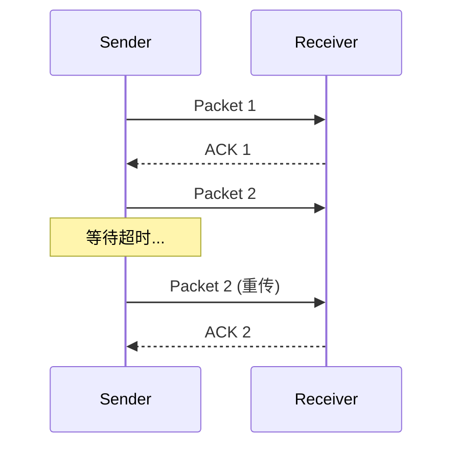
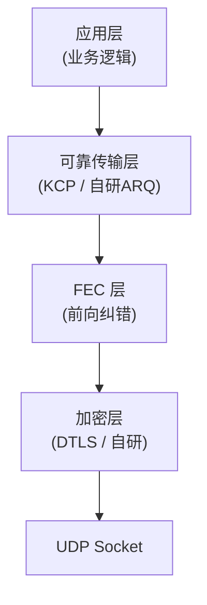

+++
title = "02. 可靠UDP传输详解"
description = "可靠UDP实现原理、ARQ机制、QUIC/KCP/UDT协议对比、FEC前向纠错与生产实践"
date = 2025-01-16
weight = 2000
[taxonomies]
tags = ["networking", "udp", "quic", "kcp", "reliable-transport", "protocol"]
[extra]
toc = true
+++

# 可靠 UDP 传输详解

---

## 一、为什么需要可靠 UDP

### 1.1 TCP 的局限性

TCP 是可靠传输的「默认选择」，但在某些场景下存在**结构性缺陷**：

| 问题 | TCP 表现 | 影响的场景 |
|------|---------|-----------|
| **队头阻塞 (HoL Blocking)** | 一个包丢失导致后续**所有**包阻塞等待重传 | 实时音视频、游戏 |
| **连接建立延迟** | 3 次握手 + TLS 握手 = 2~3 RTT | 短连接、移动网络 |
| **连接迁移不支持** | 基于四元组（IP+Port），WiFi→4G 切换断连 | 移动端 |
| **内核态协议栈** | 拥塞控制算法固定，迭代慢 | 需要定制拥塞控制 |
| **全序交付** | 强制有序，即使应用不需要 | 多流复用 |

### 1.2 可靠 UDP 的目标

在 UDP 之上，在**应用层**实现：
- **可靠性**：确保数据不丢失
- **有序性**：可选的有序交付
- **流控/拥塞控制**：防止网络过载
- **同时保留 UDP 的优势**：无队头阻塞、可用户态实现、可连接迁移

---

## 二、核心机制

### 2.1 ARQ（自动重传请求）

ARQ 是可靠传输的**基石**，三种基本策略：

#### Stop-and-Wait（停等协议）



- **最简单**，但效率极低（每次只能发一个包，等确认后才能发下一个）
- 利用率 = 1 / (1 + 2a)，a = 传播延迟 / 传输延迟

#### Go-Back-N（回退 N 帧）

- 发送窗口 N，接收方只按序接收
- 一个包丢失 → 从该包开始**全部重传**
- 实现简单，但网络利用率不高

#### Selective Repeat（选择重传）

- 发送窗口 N，接收方可以乱序接收
- 只重传丢失的包，不重传已确认的
- **效率最高**，但实现复杂（需要接收端缓冲区、NACK/SACK 机制）

| 策略 | 效率 | 实现复杂度 | 实际使用 |
|------|------|-----------|---------|
| Stop-and-Wait | 低 | 低 | 教学用 |
| Go-Back-N | 中 | 中 | 简单场景 |
| **Selective Repeat** | **高** | 高 | **QUIC、KCP、TCP SACK** |

### 2.2 序列号与确认

```
┌───────────┬───────────┬───────────┬───────────────┐
│ Seq Number│ ACK Number│ Flags     │ Payload       │
│ 4 bytes   │ 4 bytes   │ 1 byte    │ Variable      │
└───────────┴───────────┴───────────┴───────────────┘
```

**关键设计决策**：
- **序列号空间**：足够大以避免回绕（通常 32 bit）
- **确认方式**：
  - **累积 ACK**：确认序号之前的所有包（TCP 默认）
  - **选择性 ACK (SACK)**：精确指出哪些包已收到（TCP 扩展、QUIC 默认）
  - **NACK**：通知发送方哪些包没收到

### 2.3 超时与重传

```python
# RTO (Retransmission Timeout) 计算（RFC 6298 简化版）
SRTT = (1 - α) * SRTT + α * RTT_sample    # α = 1/8
RTTVAR = (1 - β) * RTTVAR + β * |SRTT - RTT_sample|  # β = 1/4
RTO = SRTT + max(G, 4 * RTTVAR)           # G = 时钟粒度
```

**KCP 的快速重传**：
- 不等 RTO 超时，而是当一个包被**跳过 N 次确认**（fastresend，默认 2）时立即重传
- 大幅降低重传延迟

#### RTT 测量与自适应超时

**RTT 测量方法**：

- **Per-packet RTT**：发送方在每个数据包中记录发送时间戳（Timestamp），接收方在 ACK 中原样回传该时间戳。发送方收到 ACK 后计算：`RTT = ACK_receive_time - send_timestamp`。这是最直接、精度最高的测量方式。
- **Karn's Algorithm**：**禁止使用重传包来计算 RTT**。原因：收到 ACK 时无法判断该 ACK 是对原始包还是重传包的确认（即 ACK 歧义问题）。如果用重传包的时间戳计算 RTT，可能严重高估或低估 SRTT，导致 RTO 失真。仅使用**首次发送且成功确认**的包进行 RTT 采样。

**自适应超时计算（RFC 6298）**：

上文 2.3 给出了核心公式，以下是深入解读：

- **SRTT（Smoothed RTT）**：指数加权移动平均，平滑瞬时波动
  ```
  SRTT = (1 - α) × SRTT + α × RTT_sample    # 典型 α = 0.125 (1/8)
  ```
  α 越小越平滑（对新样本反应慢），α 越大越敏感。1/8 是 RFC 6298 推荐值，兼顾稳定性和响应速度。

- **RTTVAR（RTT Variance）**：衡量 RTT 波动幅度
  ```
  RTTVAR = (1 - β) × RTTVAR + β × |SRTT - RTT_sample|    # 典型 β = 0.25 (1/4)
  ```
  注意使用绝对偏差而非标准差——计算更简单且足够有效。

- **RTO（Retransmission Timeout）**：
  ```
  RTO = SRTT + max(G, 4 × RTTVAR)    # G = 时钟粒度（clock granularity）
  ```
  `4 × RTTVAR` 提供对 RTT 波动的安全余量（约覆盖 97.5% 的正态分布情况）。G 确保 RTO 不低于系统时钟精度。

**KCP 的 RTO 策略**：

KCP 使用更简洁但更激进的方式：`rx_rto = rx_srtt + max(interval, 4 * rx_rttvar)`。关键区别在于重传退避策略：**KCP 重传时 RTO 仅增长 1.5 倍**（`rto = rto * 1.5`），而 TCP 使用 2 倍指数退避（`rto = rto * 2`）。在高丢包网络中，这意味着 KCP 的重传触发更快，牺牲了对网络的友善性换取了显著的延迟降低。

### 2.4 流量控制

**滑动窗口机制**：

```
发送方缓冲区：
┌─────┬─────┬─────┬─────┬─────┬─────┬─────┬─────┐
│ Sent│ Sent│ Sent│Ready│Ready│Ready│ Not │ Not │
│ ACKd│ ACKd│     │to   │to   │to   │ Avail│ Avail│
│     │     │     │Send │Send │Send │     │     │
└─────┴─────┴─────┴─────┴─────┴─────┴─────┴─────┘
              ▲                       ▲
              │                       │
         Window Start            Window End
              │←── Send Window ──────→│
```

- **发送窗口**：限制已发送未确认的包数量
- **接收窗口**：接收方告知发送方自己的缓冲区剩余空间
- **拥塞窗口**：发送方根据网络状况自行计算

#### 流控与拥塞控制的区别

| 维度 | 流量控制 (Flow Control) | 拥塞控制 (Congestion Control) |
|------|----------------------|----------------------------|
| **作用范围** | 端到端（接收方 → 发送方） | 网络全局（发送方自主决策） |
| **目标** | 防止接收方缓冲区溢出 | 防止网络链路过载 |
| **信号来源** | 接收方在 ACK 中携带接收窗口大小（rwnd） | 发送方通过丢包 / 延迟变化推断网络状态 |
| **控制变量** | 接收窗口 rwnd | 拥塞窗口 CWND |
| **反馈速度** | 即时（每个 ACK 携带） | 间接（需要统计推断） |

**实际发送窗口** = `min(rwnd, CWND)`。两者中任何一个成为瓶颈都会限制发送速率。流控是**被动**的（接收方告诉你慢下来），拥塞控制是**主动**的（发送方自行感知并调整）。

### 2.5 拥塞控制

| 算法 | 特点 | 适用场景 |
|------|------|---------|
| **AIMD** | 加性增、乘性减（TCP 传统） | 通用 |
| **BBR** | 基于带宽和 RTT 估算，不依赖丢包 | 长肥管道 |
| **CUBIC** | Linux 默认，适合高带宽长延迟 | 通用 |
| **Copa** | 基于延迟的拥塞控制 | 低延迟场景 |
| **无拥塞控制** | KCP 可选择不做拥塞控制 | 牺牲公平性换低延迟 |

#### 拥塞控制状态机（TCP 视角）

**经典 TCP 拥塞控制状态转换**：

```
┌──────────────┐  CWND ≥ ssthresh  ┌────────────────────┐
│  Slow Start  │──────────────────→│ Congestion Avoidance│
│  (指数增长)   │                    │   (线性增长 / AIMD) │
└──────┬───────┘                    └────┬──────┬────────┘
       │                                 │      │
       │ Timeout          3 dup ACKs ←───┘      │ Timeout
       ↓                      ↓                  ↓
┌──────────────┐      ┌────────────────┐  ┌──────────────┐
│ CWND = 1 MSS │      │ Fast Retransmit│  │ CWND = 1 MSS │
│ssthresh=CWND/2│     │+ Fast Recovery │  │ssthresh=CWND/2│
│→ Slow Start  │      │CWND=ssthresh+3│  │→ Slow Start  │
└──────────────┘      │→ Cong. Avoid. │  └──────────────┘
                      └────────────────┘
```

- **Slow Start（慢启动）**：CWND 初始值 = initcwnd（Linux 默认 **10 MSS**，即约 14KB），每收到一个 ACK → CWND += 1 MSS → 实际效果是每 RTT **翻倍**增长，直到达到 ssthresh
- **Congestion Avoidance（拥塞避免）**：CWND 每 RTT 增长约 1 MSS（**AIMD：Additive Increase, Multiplicative Decrease**）
- **Fast Retransmit（快速重传）**：收到 **3 个重复 ACK** → 立即重传丢失包，无需等待 RTO 超时。这是从「等超时」到「快感知」的关键优化
- **Fast Recovery（快速恢复）**：快速重传后，`CWND = ssthresh + 3`，**直接进入拥塞避免**（不回退到慢启动）。这避免了不必要的吞吐骤降
- **Timeout**：`CWND = 1 MSS`，`ssthresh = CWND/2`，**回退到慢启动** — 这是最严厉的惩罚，意味着网络可能严重拥塞

**CUBIC 算法**：

Linux 默认的拥塞控制算法。使用三次函数（cubic function）建模窗口增长：

```
W(t) = C × (t - K)³ + W_max
```

- `W_max`：上次发生拥塞时的窗口大小
- `K = ∛(W_max × β / C)`：从当前窗口恢复到 W_max 所需的时间
- `C = 0.4`，`β = 0.7`（Linux 默认常数）
- **凹形增长（t < K）**：在 W_max 以下快速恢复 — 越接近 W_max 增速越慢，避免再次引发拥塞
- **凸形增长（t > K）**：超过 W_max 后缓慢探测新带宽 — 初始慎重，逐渐加速
- CUBIC 的窗口增长**不依赖 RTT**（只依赖时间 t），因此对长肥管道（high BDP）更公平

**BBR 深入**：

BBR（Bottleneck Bandwidth and Round-trip propagation time）是 Google 提出的**基于模型**的拥塞控制，与 CUBIC 等基于丢包的方案有本质区别：

- **核心估算**：`BtlBw`（瓶颈带宽，取滑动窗口内的 max delivery rate）和 `RTprop`（最小 RTT，取滑动窗口内的 min RTT）
- **发送速率** = `BtlBw × gain_factor`
- **四个状态**：

| 状态 | Gain | 行为 | 持续时间 |
|------|------|------|---------|
| **Startup** | 2/ln2 ≈ 2.89× | 指数探测带宽，直到连续 3 轮 BtlBw 不再增长 | 带宽探测完成 |
| **Drain** | 1/2.89× | 排空 Startup 积累的队列，降低 inflight | 直到 inflight ≤ BDP |
| **ProbeBW** | 1.25/0.75/1.0× cycle | 稳态，8 phase 循环探测带宽变化 | 大部分时间 |
| **ProbeRTT** | — | inflight 降至 4 个包，持续 200ms 测量 min RTT | 每 ~10s 触发一次 |

- **核心优势**：在有随机丢包的链路（如无线网络）上，CUBIC 将丢包误判为拥塞而大幅降窗（吞吐可能下降 50%+）；BBR 只响应实际拥塞（带宽下降 / RTT 上升），不受随机丢包影响

### 2.6 FEC（前向纠错）

**不等丢包发生，预先发送冗余数据**，接收方可从冗余中恢复丢失的包：

```
发送：P1, P2, P3, FEC(P1⊕P2⊕P3)
接收：P1, __, P3, FEC
恢复：P2 = FEC ⊕ P1 ⊕ P3
```

- **优点**：无需重传，延迟最低
- **缺点**：增加带宽开销（冗余数据）
- **实际方案**：Reed-Solomon 编码、XOR FEC
- **常见配置**：每 N 个数据包附加 K 个 FEC 包（如 10:3）

#### FEC 编码方案详解

1. **Reed-Solomon (RS) 编码**：
   - 最经典的 FEC 方案。RS(n, k) 表示：发送 n 个包，其中 k 个是原始数据包，n-k 个是冗余包。只要收到任意 k 个包（无论哪些丢了），就能恢复全部原始数据。
   - 例如 RS(10, 7)：发 10 个包，冗余 3 个，可容忍任意 3 个包丢失。冗余率 = (10-7)/7 ≈ 43%。
   - 数学基础：基于 Galois Field (GF(2^8)) 的多项式插值。编码 = 生成矩阵乘法，解码 = 高斯消元或 Berlekamp-Massey 算法。
   - 优点：纠错能力精确可控、解码确定性强。
   - 缺点：编解码计算量随 n 增大而增大（O(n²)~O(n·log(n))）；冗余率需预先设定，不够灵活。

2. **Fountain Codes (喷泉码)**：
   - **Rateless** 编码——发送方可以无限制地生成编码包，接收方收到任意 k+ε 个包即可恢复（ε 很小，接近 0）。
   - **LT (Luby Transform) Code**：最简单的喷泉码。每个编码包是原始数据包的随机子集的 XOR。解码用 Belief Propagation（类似解联立方程）。
   - **Raptor/RaptorQ (RFC 6330)**：LT Code 的增强版。先用 LDPC 预编码，再用 LT 编码。解码成功率极高（收到 k+1 个包即 99%+ 恢复），编解码复杂度 O(k)。
   - **适用场景**：卫星通信（长延迟无法重传）、CDN 大文件分发、组播/广播场景。

3. **FEC vs ARQ 权衡**：
   | 维度 | FEC | ARQ |
   |------|-----|-----|
   | **延迟** | 固定（不需要等 ACK） | 丢包时增加 ≥ 1 RTT |
   | **带宽** | 固定冗余开销（即使无丢包） | 无丢包时零开销 |
   | **适用** | 高丢包率、低延迟要求 | 低丢包率、带宽敏感 |
   | **组合使用** | 实际系统常混合使用：FEC 纠正少量丢包 + ARQ 兜底处理 FEC 无法纠正的丢包 | |

---

## 三、主流可靠 UDP 协议对比

### 3.1 QUIC

**Google 开发，已标准化为 RFC 9000，HTTP/3 的传输层**。

| 特性 | 说明 |
|------|------|
| **0-RTT / 1-RTT 连接建立** | TLS 1.3 与传输握手合并 |
| **多路复用无队头阻塞** | 每个 Stream 独立，一个 Stream 丢包不影响其他 |
| **连接迁移** | 基于 Connection ID，不依赖四元组 |
| **内置加密** | TLS 1.3 集成，全部加密（含头部） |
| **可插拔拥塞控制** | 支持 Cubic、BBR、Reno 等 |
| **SACK + ACK Range** | 精确告知收到哪些包 |

```
QUIC 协议栈：
┌──────────────────────┐
│      HTTP/3          │
├──────────────────────┤
│   QUIC (Stream MUX)  │    ← 可靠传输 + 加密
├──────────────────────┤
│        UDP           │    ← 无连接、NAT 友好
├──────────────────────┤
│        IP            │
└──────────────────────┘
```

**vs TCP+TLS**：

| 对比项 | TCP + TLS 1.3 | QUIC |
|--------|-------------|------|
| 首次连接延迟 | 2 RTT (TCP握手 + TLS握手) | 1 RTT |
| 恢复连接延迟 | 1 RTT | **0 RTT** |
| 队头阻塞 | 有（TCP 层） | **无** |
| 连接迁移 | 不支持 | **支持** |
| 协议迭代 | 内核态，慢 | 用户态，快 |

### 3.2 KCP

**开源轻量级可靠 UDP 协议**，专注**低延迟**而非高吞吐。

| 特性 | 说明 |
|------|------|
| **快速重传** | 被跳过 N 次 ACK 就重传（不等超时） |
| **非退让模式** | 可关闭拥塞控制，以带宽换延迟 |
| **ARQ 模式可选** | 支持 normal/fast 模式 |
| **纯算法实现** | ~1000 行 C 代码，不负责底层 IO |

**KCP 核心参数**：

```c
// 创建 KCP 实例
ikcpcb *kcp = ikcp_create(conv, user);

// 设置 nodelay 模式
// nodelay=1, interval=10ms, resend=2, nc=1(关闭拥塞控制)
ikcp_nodelay(kcp, 1, 10, 2, 1);

// 设置窗口
ikcp_wndsize(kcp, 128, 128);  // 发送窗口, 接收窗口

// 设置 MTU
ikcp_setmtu(kcp, 1400);
```

**延迟对比**（参考数据，高丢包网络）：

| 丢包率 | TCP 平均延迟 | KCP 平均延迟 | 提升 |
|--------|------------|------------|------|
| 10% | ~200ms | ~70ms | 3x |
| 20% | ~500ms | ~100ms | 5x |
| 30% | ~1000ms+ | ~150ms | 7x+ |

### 3.3 UDT / SRT

| 协议 | 定位 | 特点 |
|------|------|------|
| **UDT** | 大数据传输 | 适合长肥管道；拥塞控制优化 |
| **SRT** (Secure Reliable Transport) | 视频传输 | 基于 UDT；内置加密；低延迟视频优化 |

### 3.4 ENet

- 面向**游戏**的可靠 UDP 库
- 支持多 Channel（可靠有序 / 可靠无序 / 不可靠）
- 轻量（~5000 行 C 代码）

### 3.5 综合对比

| 维度 | QUIC | KCP | UDT/SRT | ENet |
|------|------|-----|---------|------|
| **定位** | 通用传输 | 低延迟 | 大文件/视频 | 游戏 |
| **加密** | 内置 TLS 1.3 | 无（需自己加） | SRT 内置 | 无 |
| **拥塞控制** | 可插拔 | 可选关闭 | 定制 | 简单 |
| **复杂度** | 高 | 低 | 中 | 低 |
| **标准化** | RFC 9000 | 无 | 无 | 无 |
| **多流** | 原生支持 | 不支持 | 不支持 | Channel |
| **典型 RTT 优化** | 0-1 RTT | 快速重传 | 大窗口 | 低开销 |

### 3.6 QUIC 深入

QUIC 在上述对比之外，还有以下关键创新：

**1. Connection Migration（连接迁移）**

QUIC 使用 **Connection ID (CID)** 而非传统四元组（src IP, src Port, dst IP, dst Port）来标识连接。当客户端 IP/Port 变化时（如 WiFi → 4G），连接不会中断：

- 客户端在新网络路径上发送携带相同 CID 的包
- 服务端通过 **CID → connection state** 映射表找到对应连接
- 使用 `preferred_address` transport parameter 通告迁移目标
- 迁移后需要执行 **Path Validation**（发送 `PATH_CHALLENGE`，等待 `PATH_RESPONSE`），验证新路径可达且防止放大攻击
- 为防止网络路径上的连接追踪，QUIC 支持 **CID 轮换** — 迁移后使用新 CID，对中间设备不可关联

```
WiFi 路径: [Client 10.0.1.5:4321] --CID_A--> [Server]
                    ↓ 切换网络
4G 路径:   [Client 100.64.0.8:9876] --CID_A--> [Server]
                                                  ↓
                                     CID_A → 同一 connection state
```

**2. 0-RTT 连接建立**

- **首次连接（1-RTT）**：TLS 1.3 握手 — Client Hello 与传输参数同时发送，Server Hello 完成后即可传数据
- **后续连接（0-RTT）**：客户端复用 PSK（Pre-Shared Key）→ 在第一个 flight 中就发送加密数据 → 无需等待服务端响应
- **安全权衡**：0-RTT 数据存在**重放攻击**风险 — 攻击者录制 0-RTT 包并重放。服务端**必须**对非幂等操作实现重放保护（strike register / ticket 单次使用 / 时间窗口限制）

**3. 多 Stream 无队头阻塞**

每个 Stream 拥有**独立的序列号空间** → Stream A 丢包不会阻塞 Stream B 的数据交付。这是 QUIC 对比 TCP 多路复用的根本优势。TCP 的字节流是全局有序的 — 任何位置的丢包都会阻塞后续所有数据（即使它们属于不同的逻辑流）。

```
TCP (HTTP/2 多路复用):
  Stream A: [pkt1] [pkt2:LOST] [pkt3] [pkt4]
  Stream B: [pkt5] [pkt6] [pkt7]    ← 被 pkt2 阻塞！

QUIC (HTTP/3 多路复用):
  Stream A: [pkt1] [pkt2:LOST] [pkt3] [pkt4]  ← 仅 Stream A 等待重传
  Stream B: [pkt5] [pkt6] [pkt7]               ← 不受影响，正常交付
```

**4. 显式 ACK Delay**

QUIC 的 ACK 帧包含 `ack_delay` 字段，明确告知接收方在收到包到发送 ACK 之间的本地处理延迟。发送方可以精确计算网络 RTT：`network_rtt = ack_received - pkt_sent - ack_delay`。这消除了 Karn's Algorithm 的歧义问题，使 RTT 测量更准确。

**5. 不可靠数据报扩展（RFC 9221）**

在 QUIC 连接内发送**不可靠**的 datagram — 适用于 WebRTC 媒体数据、游戏实时状态等不需要重传的场景。复用 QUIC 连接已有的加密、认证和连接管理能力，同时避免可靠传输的重传开销和延迟。这使得一个 QUIC 连接可以同时承载可靠流（控制信令）和不可靠数据（媒体/游戏状态）。

---

## 四、实现架构

### 4.1 典型实现层次



### 4.2 自研可靠 UDP 的关键设计

```
1. 包头设计
   ┌──────┬──────┬──────┬──────┬──────┬───────────┐
   │ Conv │ Cmd  │ Seq  │ ACK  │ Wnd  │ Timestamp │
   │ 4B   │ 1B   │ 4B   │ 4B   │ 2B   │ 4B        │
   └──────┴──────┴──────┴──────┴──────┴───────────┘
   
   Conv: 会话 ID
   Cmd:  PUSH / ACK / PING / FIN
   Seq:  包序号
   ACK:  确认号
   Wnd:  接收窗口大小
   Timestamp: 用于 RTT 测量

2. 状态机
   CLOSED → SYN_SENT → ESTABLISHED → FIN_WAIT → CLOSED

3. 核心循环（每 10~50ms）
   - 检查超时重传
   - 处理收到的 ACK / SACK
   - 发送窗口内的新包
   - 发送 FEC 冗余包
   - 更新拥塞窗口
```

### 4.3 用户态协议栈方案

**为什么需要 Kernel Bypass**：

内核网络栈每个包需经历系统调用上下文切换、`sk_buff` 分配/释放、协议栈逐层处理（IP → UDP → 应用），累计增加约 **10-20μs 延迟**。对于超低延迟场景（目标 < 10μs），必须绕过内核。

| 方案 | 原理 | 典型延迟 | 适用场景 |
|------|------|---------|---------|
| **DPDK** | Poll-mode driver，用户态直接操作网卡 TX/RX 队列，独占 CPU 核心轮询 | ~1-3μs | 高性能网关、NFV |
| **AF_XDP** | 内核 XDP hook + 用户态 socket，零拷贝收发包，无需独占网卡 | ~3-5μs | 与内核共存的高性能场景 |
| **io_uring** | 异步 I/O 框架，批量提交/完成减少 syscall 次数 | ~5-10μs | 通用高性能服务器 |

**DPDK + QUIC 实践**：

- Google 的 **QUICHE**（C++）和 Cloudflare 的 **quiche**（Rust）可运行在用户态，结合 DPDK 实现高性能 QUIC
- F5、Envoy 等网关使用 DPDK 加速 QUIC 握手（crypto 密集）和数据转发
- 典型架构：DPDK 负责收发包 → 用户态 QUIC 栈处理协议 → 应用逻辑

```
┌───────────────────────────────┐
│         应用逻辑               │
├───────────────────────────────┤
│    QUIC 栈 (quiche / msquic)  │  ← 用户态
├───────────────────────────────┤
│    DPDK / AF_XDP              │  ← 绕过内核
├───────────────────────────────┤
│    NIC (网卡硬件)              │
└───────────────────────────────┘
```

**硬件卸载**：NVIDIA ConnectX SmartNIC 支持 QUIC crypto 加解密卸载和 flow steering（流表分发），将 TLS 加解密、包分类等 CPU 密集操作卸载到网卡芯片，进一步降低 CPU 开销和延迟。

---

## 五、生产实践

### 5.1 场景选型指南

| 场景 | 推荐方案 | 原因 |
|------|---------|------|
| **Web / API** | QUIC (HTTP/3) | 标准化、浏览器支持、0-RTT |
| **实时游戏** | KCP / ENet | 低延迟、轻量 |
| **视频直播/推流** | SRT | 专为视频优化 |
| **文件传输** | QUIC / UDT | 高吞吐 |
| **VPN / 隧道** | WireGuard (UDP) | 轻量、高性能 |
| **物联网** | CoAP (UDP) | 资源受限设备 |

### 5.2 性能调优

```bash
# Linux UDP 缓冲区调大
sysctl -w net.core.rmem_max=26214400        # 接收缓冲区 25MB
sysctl -w net.core.wmem_max=26214400        # 发送缓冲区 25MB
sysctl -w net.core.rmem_default=1048576
sysctl -w net.core.wmem_default=1048576

# UDP 接收缓冲区溢出检查
cat /proc/net/snmp | grep Udp:
# InErrors / RcvbufErrors 增长说明缓冲区不够

# 使用 SO_REUSEPORT 多线程监听
# 内核自动在监听 socket 间负载均衡
```

### 5.3 常见问题排查

| 现象 | 可能原因 | 排查方法 |
|------|---------|---------|
| UDP 丢包 | 接收缓冲区溢出 | `cat /proc/net/snmp` 看 RcvbufErrors |
| 延迟抖动大 | 网络拥塞 / 缓冲区膨胀 (Bufferbloat) | `ping` 看 RTT 分布 |
| 无法连接 | 防火墙阻止 UDP | `traceroute -U` 测试 |
| NAT 超时 | 运营商 NAT 表过期 | 发送心跳包（通常 < 30s） |
| 吞吐低 | 发送窗口太小 | 调大 snd_wnd / rcv_wnd |

---

## 六、面试高频问答

**Q1：为什么不直接用 TCP？什么时候用可靠 UDP？**

A：TCP 的队头阻塞、连接建立延迟、无法连接迁移在某些场景是结构性问题。实时游戏（几十 ms 延迟敏感）、视频通话（不能等重传）、移动网络（频繁切换）、HTTP/3（多路复用）等场景更适合可靠 UDP。

**Q2：KCP 比 TCP 快的原因？**

A：1) 快速重传——不等超时，被跳过 N 次 ACK 就重传；2) 非退让模式——可关闭拥塞控制，不主动降速；3) 更短的 RTO 计算——不像 TCP 翻倍退避；4) 选择性重传——只重传丢失的包。代价是对网络不够「友善」（不公平）。

**Q3：QUIC 的 0-RTT 安全吗？**

A：0-RTT 数据面临**重放攻击**风险——攻击者可以录制 0-RTT 数据包并重放。因此 0-RTT 数据必须是**幂等**的（如 GET 请求），不能用于有副作用的操作。服务端应实现重放检测（如维护 ticket 黑名单或使用 strike register）。

**Q4：FEC 和 ARQ 怎么选？**

A：低延迟优先用 FEC（不需要等重传），带宽受限用 ARQ（不浪费冗余）。实际方案常常两者结合——FEC 恢复小丢包，ARQ 兜底大丢包。比如视频通话中 FEC 覆盖 5% 丢包，超出部分 ARQ 重传。

**Q5：QUIC Connection Migration 底层是如何实现的？**

A：QUIC 连接由 **Connection ID (CID)** 标识（而非 TCP 的四元组）。CID 嵌在每个 QUIC 包头中，长度可变（0-20 字节）。当客户端网络切换（WiFi → 4G），IP/Port 变化但 CID 不变。具体流程：1) 客户端在新路径上发送带相同 CID 的包；2) 服务端通过 **CID → connection state** 映射表找到对应连接；3) 执行 **Path Validation** — 服务端发送 `PATH_CHALLENGE`（包含随机 token），客户端回复 `PATH_RESPONSE`（echo 同一 token），验证新路径可达且不被用于放大攻击；4) 通过 `preferred_address` transport parameter 支持服务端主动通告迁移地址。为防止网络追踪，QUIC 支持 CID 轮换 — 迁移后使用新 CID，使得中间设备无法将新旧路径关联到同一连接。

**Q6：为什么 BBR 在有丢包的网络上表现优于 CUBIC？**

A：核心区别在于**拥塞信号的判断方式**。CUBIC 是基于丢包的拥塞控制 — 将**所有丢包都视为拥塞信号**，一旦检测到丢包就执行乘性降窗（`CWND = CWND × β`）。在无线网络等存在随机丢包（非拥塞导致）的环境中，CUBIC 频繁误判，不断降低发送速率，吞吐可能下降 50% 以上。BBR 是基于模型的拥塞控制 — 它持续估算瓶颈带宽（BtlBw）和最小 RTT（RTprop），根据这两个指标决定发送速率，**不直接依赖丢包信号**。当发生随机丢包但 BtlBw 和 RTprop 没有恶化时，BBR 不会降速。因此在 1-5% 随机丢包的无线链路上，BBR 可以维持接近满带宽的吞吐，而 CUBIC 早已大幅退让。

---

## 相关文章

- [上一篇：Ethernet基础](@/articles/networking/net-01-Ethernet基础.md)
- [下一篇：OpenvSwitch介绍](@/articles/networking/net-03-OpenvSwitch介绍.md)
