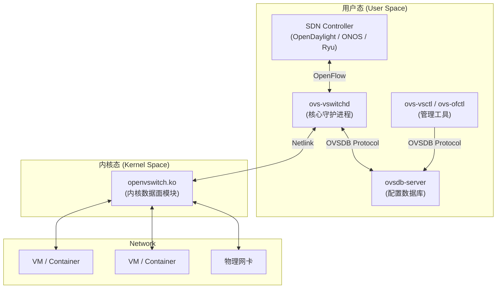
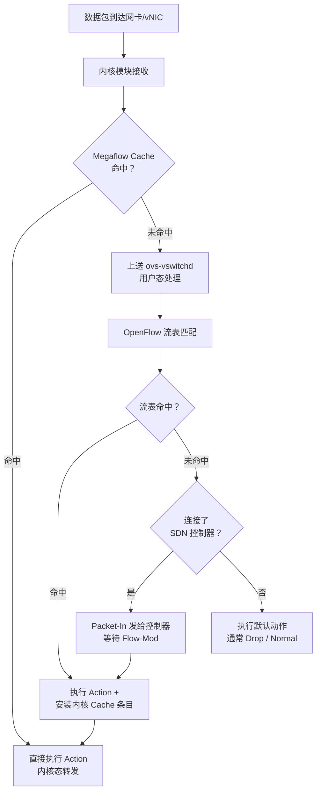
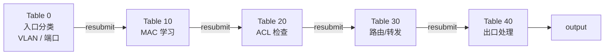
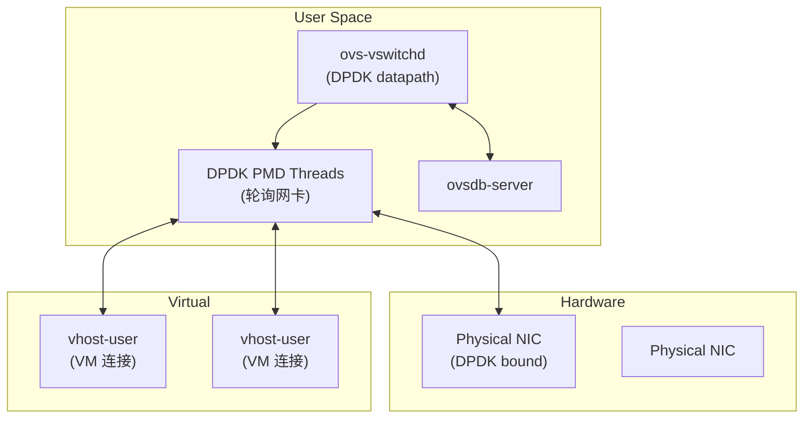

+++
title = "03. Open vSwitch详解"
description = "OVS架构、核心组件、OpenFlow流表、OVSDB、数据转发流程、DPDK加速与生产实践"
date = 2025-01-16
weight = 3000
[taxonomies]
tags = ["networking", "ovs", "sdn", "openflow", "virtualization", "cloud"]
[extra]
toc = true
+++

# Open vSwitch (OVS) 详解

---

## 一、OVS 概述

### 1.1 什么是 Open vSwitch

Open vSwitch（OVS）是一个**生产级多层虚拟交换机**，专为虚拟化环境和云计算设计。它是 SDN（软件定义网络）领域最重要的开源项目之一。

**核心定位**：充当虚拟机/容器与物理网络之间的桥梁，提供可编程的网络转发能力。

| 特性 | 说明 |
|------|------|
| **OpenFlow 支持** | 支持 OpenFlow 1.0~1.5，可被 SDN 控制器编程 |
| **隧道协议** | GRE、VXLAN、Geneve、STT、LISP |
| **QoS** | 支持 policing 和 shaping |
| **LACP/Bond** | 链路聚合 |
| **VLAN** | 完整 802.1Q 支持 |
| **镜像/监控** | sFlow、NetFlow、SPAN、RSPAN |
| **DPDK 加速** | 用户态数据面，性能数量级提升 |

### 1.2 为什么选择 OVS 而非 Linux Bridge

| 对比项 | Linux Bridge | Open vSwitch |
|--------|-------------|-------------|
| **转发逻辑** | 简单 L2 转发 | 可编程 OpenFlow 流表 |
| **隧道** | 需要额外配置 | 原生支持 VXLAN/GRE/Geneve |
| **SDN 支持** | 无 | 原生 OpenFlow |
| **监控** | 基础 | sFlow、NetFlow、CT |
| **分布式能力** | 无 | OVSDB 统一管理 |
| **性能（DPDK）** | 不支持 | 支持 OVS-DPDK |
| **复杂度** | 低 | 高 |
| **适用场景** | 简单虚拟化 | 大规模云网络（OpenStack、K8s） |

---

## 二、OVS 架构

### 2.1 整体架构



### 2.2 核心组件详解

#### ovs-vswitchd（核心守护进程）

- OVS 的**大脑**，负责所有转发决策
- 实现 OpenFlow 交换机协议
- 维护流表（Flow Table），处理数据包匹配和动作
- 与 SDN 控制器通过 OpenFlow 协议通信
- 与内核模块通过 Netlink 通信

#### ovsdb-server（配置数据库）

- 存储 OVS 的**配置信息**（而非流表）：
  - Bridge（虚拟交换机）
  - Port（端口）
  - Interface（接口）
  - Mirror（镜像）
  - QoS 策略
- 使用 **OVSDB 协议**（RFC 7047），支持事务、通知
- 配置持久化到磁盘

#### openvswitch.ko（内核模块）

- **快速路径 (Fast Path)**：内核态数据面，处理匹配到的流
- **慢速路径 (Slow Path)**：未匹配的包上送 ovs-vswitchd 处理
- 使用 **Megaflow Cache** 优化匹配性能

### 2.3 数据转发流程



**性能关键**：绝大多数包应该命中内核 Cache（Fast Path），避免上送用户态。生产环境 Cache 命中率应 > 99%。

---

## 三、OpenFlow 流表

### 3.1 流表概念

OpenFlow 流表是 OVS 转发的**核心数据结构**。每条流表规则包含：

| 组成 | 说明 | 示例 |
|------|------|------|
| **Match Fields** | 匹配条件 | `in_port=1, dl_type=0x0800, nw_dst=10.0.0.1` |
| **Priority** | 优先级（高者优先） | `priority=100` |
| **Actions** | 匹配后执行的动作 | `output:2, mod_dl_dst, drop` |
| **Counters** | 统计计数器 | 匹配包数、字节数 |
| **Cookie** | 控制器标识 | 用于批量管理 |
| **Timeout** | 超时删除 | `idle_timeout=60, hard_timeout=300` |

### 3.2 匹配字段

| 层 | 字段 | 说明 |
|----|------|------|
| **端口** | `in_port` | 入端口号 |
| **L2** | `dl_src`, `dl_dst` | MAC 地址 |
| **L2** | `dl_type` | EtherType（0x0800=IPv4, 0x86DD=IPv6） |
| **L2** | `dl_vlan` | VLAN ID |
| **L3** | `nw_src`, `nw_dst` | IP 地址 |
| **L3** | `nw_proto` | IP 协议号（6=TCP, 17=UDP） |
| **L3** | `nw_tos` / `nw_dscp` | DSCP 值 |
| **L4** | `tp_src`, `tp_dst` | TCP/UDP 端口 |
| **隧道** | `tun_id` | 隧道 ID（如 VXLAN VNI） |
| **CT** | `ct_state` | 连接跟踪状态 |

### 3.3 常用 Action

| Action | 说明 |
|--------|------|
| `output:PORT` | 从指定端口转发 |
| `drop` | 丢弃 |
| `normal` | 使用传统 L2/L3 转发（MAC 学习 + 泛洪） |
| `mod_dl_src:MAC` | 修改源 MAC |
| `mod_dl_dst:MAC` | 修改目的 MAC |
| `mod_nw_src:IP` | 修改源 IP（NAT） |
| `mod_nw_dst:IP` | 修改目的 IP |
| `push_vlan:0x8100` | 添加 VLAN 标签 |
| `pop_vlan` | 移除 VLAN 标签 |
| `set_field:VNI->tun_id` | 设置隧道 ID |
| `resubmit:TABLE` | 跳转到其他流表继续匹配 |
| `ct(...)` | 连接跟踪 |
| `learn(...)` | 动态学习并安装新规则 |
| `controller` | 发送 Packet-In 给控制器 |

### 3.4 流表操作

```bash
# 查看所有流表
ovs-ofctl dump-flows br0

# 查看指定 Table
ovs-ofctl dump-flows br0 table=0

# 添加流表规则
ovs-ofctl add-flow br0 "table=0, priority=100, \
  in_port=1, dl_type=0x0800, nw_dst=10.0.0.2, \
  actions=output:2"

# 修改 Action
ovs-ofctl mod-flows br0 "in_port=1, actions=output:3"

# 删除规则
ovs-ofctl del-flows br0 "in_port=1"

# 查看流表统计
ovs-ofctl dump-aggregate br0

# 实时监控流表变化
ovs-ofctl monitor br0 watch:
```

### 3.5 多级流表（Pipeline）

OVS 支持多级流表（Table 0~254），通过 `resubmit` 或 `goto_table` 实现流水线处理：



### 3.6 Megaflow Cache（Datapath Cache）

OVS 高性能转发的核心在于**内核态 Megaflow Cache**。理解快慢路径是优化 OVS 性能的关键。

#### 快慢路径（Fast Path vs Slow Path）

1. **首包（Slow Path）**：一条新流的第一个包在内核 Megaflow Cache 中无命中 → 通过 Netlink **upcall** 上送到用户态 `ovs-vswitchd` → vswitchd 查询 OpenFlow 流表做匹配 → 将匹配结果**安装为 Megaflow 条目**到内核 Datapath
2. **后续包（Fast Path）**：同一流的后续包在内核 Megaflow Cache 中直接命中 → 完全在内核态处理转发，**无 upcall、无上下文切换**

#### 什么是 Megaflow

Megaflow = **通配（Wildcarded）流表条目**。与精确五元组匹配不同，Megaflow 使用掩码实现范围匹配。例如：

- 精确匹配：`in_port=1,nw_src=10.0.0.5,nw_dst=10.0.0.100,tp_src=54321,tp_dst=80` → 只匹配一条流
- Megaflow：`in_port=1,nw_dst=10.0.0.0/24` → **一条缓存条目处理成千上万条流**

这种通配极大降低了缓存条目数量，提高命中率。

#### 三级缓存架构

```
Packet → [ EMC (Exact Match Cache) ] → [ Megaflow Cache ] → [ upcall to vswitchd ]
            │                              │                       │
            │ 8192 entries                 │ 200K+ entries         │ OpenFlow lookup
            │ Hash of exact 5-tuple        │ Tuple Space Search    │ 安装新 Megaflow
            │ O(1) lookup                  │ O(n_tuples) lookup    │ ~tens of K PPS
            ▼                              ▼                       ▼
         最快路径                        快速路径                 慢速路径
```

- **EMC（Exact Match Cache）**：最前端的微型高速缓存，8192 个条目，使用精确五元组的哈希直接索引。EMC 命中 = 最快路径，单次哈希查找即完成
- **Megaflow Cache**：EMC 未命中后查询。支持 20 万+ 条目，使用 **TSS（Tuple Space Search）** 算法
- **upcall**：Megaflow 也未命中，包上送用户态 vswitchd 做完整 OpenFlow 流表匹配

#### TSS（Tuple Space Search）算法

OVS 的 Megaflow 查找采用 TSS 算法：

- 将所有 Megaflow 条目按**通配模式（Tuple）分组**。例如，所有匹配 `{in_port, nw_dst/24}` 的条目归为一个 Tuple
- 每个 Tuple 维护一个**哈希表**
- 查找时，对每个活跃的 Tuple 做一次哈希查找
- **最坏情况**：N 个不同的 Tuple → N 次哈希查找。因此应尽量减少 Tuple 种类数

#### 性能影响

| 场景 | 性能表现 |
|------|---------|
| Cache 充分预热（warm） | 99%+ 包走快速路径，百万级 PPS |
| 冷启动（cold start） | 大量 upcall，性能骤降至数万 PPS |
| Cache 抖动（thrashing） | 大量唯一流 → Megaflow 频繁增删 → 高 CPU |
| Tuple 爆炸 | 太多通配模式 → TSS 查找变慢 |

#### 诊断与调优

```bash
# 查看内核 Datapath 中的 Megaflow 缓存条目
ovs-dpctl dump-flows

# 查看 Datapath 统计（关注 hit / missed / lost）
ovs-dpctl show
# hit = 快速路径命中, missed = upcall 次数, lost = upcall 队列满丢弃

# 查看连接跟踪表
ovs-appctl dpctl/dump-conntrack

# 调整最大 Megaflow 条目数（默认约 200K）
ovs-vsctl set Open_vSwitch . other_config:flow-limit=200000     # 限制 datapath 最大流表条目数（默认 200000）
ovs-vsctl set Open_vSwitch . other_config:max-idle=10000         # 流表条目最大空闲时间 ms（默认 10000）
ovs-vsctl set Open_vSwitch . other_config:max-revalidator=500    # revalidator 最大等待时间 ms（默认 500）

# 查看 EMC 和 Megaflow 命中率（DPDK 模式）
ovs-appctl dpif-netdev/pmd-stats-show
```

> **生产经验**：如果 `ovs-dpctl show` 中 `missed` 持续增长且 `missed / (hit + missed)` > 1%，说明 Cache 效果不佳，需排查是否有大量短生命周期的唯一流（如端口扫描、DDoS）。

### 3.7 Conntrack 集成

OVS 集成了 Linux 内核的 **conntrack（连接跟踪）模块**，使其具备**有状态防火墙**能力。这是 OpenStack Security Group 和 OVN ACL 的底层实现机制。

#### ct() Action

`ct()` 是 OVS 的连接跟踪动作，将数据包送入内核 conntrack 模块进行状态追踪：

```bash
# 基本用法：将包送入 conntrack 追踪，然后跳转到 table 1 继续处理
actions=ct(table=1)

# 提交连接（将连接记录写入 conntrack 表）
actions=ct(commit)

# 指定 Zone 隔离（不同租户/网络使用不同 zone）
actions=ct(zone=5,table=1)
```

#### ct_state 匹配字段

经过 `ct()` 处理后，可以使用 `ct_state` 匹配连接状态：

| 状态标志 | 含义 |
|---------|------|
| `+trk` | 包已经过 conntrack 追踪 |
| `+new` | 新连接的第一个包 |
| `+est` | 已建立连接的包（双向均已有包） |
| `+rel` | 与已有连接相关的包（如 FTP 数据连接、ICMP 错误） |
| `+inv` | 无效包（conntrack 无法识别） |
| `-trk` | 包尚未经过 conntrack |

#### 典型有状态防火墙流表

```bash
# Table 0：所有未跟踪的 IP 包先送入 conntrack，然后跳转 Table 1
ovs-ofctl add-flow br0 "table=0, priority=100, ip, ct_state=-trk, \
  actions=ct(table=1)"

# Table 1：允许已建立连接和相关连接的包通过
ovs-ofctl add-flow br0 "table=1, priority=100, ip, ct_state=+est+trk, \
  actions=NORMAL"
ovs-ofctl add-flow br0 "table=1, priority=100, ip, ct_state=+rel+trk, \
  actions=NORMAL"

# Table 1：丢弃无效包
ovs-ofctl add-flow br0 "table=1, priority=80, ip, ct_state=+inv+trk, \
  actions=drop"

# Table 1：允许特定方向的新连接（例如只允许从 port 1 发起新连接）
ovs-ofctl add-flow br0 "table=1, priority=50, ip, ct_state=+new+trk, \
  in_port=1, actions=ct(commit),NORMAL"

# Table 1：默认丢弃其他新连接
ovs-ofctl add-flow br0 "table=1, priority=10, ip, ct_state=+new+trk, \
  actions=drop"
```

#### NAT 集成

OVS conntrack 支持 NAT 操作：

```bash
# SNAT：修改源 IP
actions=ct(commit, nat(src=10.0.0.1))

# DNAT：修改目的 IP
actions=ct(commit, nat(dst=192.168.1.100))

# 端口范围 SNAT
actions=ct(commit, nat(src=10.0.0.1:1024-65535))
```

#### Zone 隔离

Zone 用于在同一主机上隔离不同租户或网络的 conntrack 状态：

```bash
# 租户 A 的网络使用 zone 100
actions=ct(zone=100, table=1)

# 租户 B 的网络使用 zone 200
actions=ct(zone=200, table=1)
# 两个 zone 的连接状态完全独立，互不影响
```

#### Conntrack 表容量与调优

| 参数 | 默认值 | 说明 |
|------|--------|------|
| `nf_conntrack_max` | 131072 (128K) | conntrack 表最大条目数 |
| `nf_conntrack_tcp_timeout_established` | 432000 (5天) | TCP 已建立连接超时 |
| `nf_conntrack_udp_timeout` | 30 | UDP 超时 |

```bash
# 查看 conntrack 统计（关注 drop / insert_failed）
conntrack -S

# 查看当前 conntrack 表使用量
conntrack -C

# 调大 conntrack 表（生产环境常设为 1M+）
sysctl -w net.netfilter.nf_conntrack_max=1048576

# 查看 OVS conntrack 条目
ovs-appctl dpctl/dump-conntrack
```

> **常见故障**：conntrack 表满时，所有新连接都会被丢弃，已有连接不受影响。表现为 `conntrack -S` 中 `drop` 计数持续增长。解决方案：增大 `nf_conntrack_max`、缩短空闲连接超时、或排查异常流量。

#### OVN（Open Virtual Network）

OVN 是构建在 OVS 之上的**高层 SDN 控制平面**，提供：

- **逻辑交换机 / 路由器**：声明式网络拓扑，自动下发 OVS 流表
- **分布式 DHCP**：内置 DHCP responder，无需集中式 DHCP 服务器
- **分布式 NAT**：在每个 Hypervisor 上本地执行 SNAT/DNAT
- **ACL（安全组）**：基于 OVS conntrack 实现有状态 ACL
- **负载均衡**：L4 负载均衡（VIP → 多后端）
- **典型用户**：OpenStack Neutron（ML2/OVN driver）、Red Hat OKD/OpenShift、oVirt

---

## 四、OVS 管理与配置

### 4.1 核心管理命令

```bash
# === Bridge（虚拟交换机）管理 ===
# 创建 Bridge
ovs-vsctl add-br br0

# 添加端口
ovs-vsctl add-port br0 eth0
ovs-vsctl add-port br0 veth0 -- set interface veth0 type=internal

# 添加 VXLAN 隧道端口
ovs-vsctl add-port br0 vxlan0 -- set interface vxlan0 \
  type=vxlan options:remote_ip=192.168.1.2 options:key=1000

# 查看 Bridge 配置
ovs-vsctl show

# 查看端口详情
ovs-vsctl list port br0
ovs-vsctl list interface eth0

# === 端口 VLAN 配置 ===
# 设置 Access 端口
ovs-vsctl set port veth0 tag=100

# 设置 Trunk 端口
ovs-vsctl set port eth0 trunks=100,200,300

# === 监控 ===
# 查看 Datapath 统计
ovs-dpctl show
ovs-dpctl dump-flows

# 查看端口统计
ovs-ofctl dump-ports br0

# 查看连接跟踪表
ovs-appctl dpctl/dump-conntrack
```

### 4.2 OVSDB Schema

OVS 配置数据库的核心表结构：

```
Open_vSwitch (全局配置)
  └── Bridge (虚拟交换机)
       ├── Port (端口组)
       │    └── Interface (接口)
       ├── Flow_Table (流表配置)
       ├── Mirror (镜像)
       ├── Controller (SDN 控制器)
       └── QoS (服务质量)
            └── Queue
```

```bash
# 查看 OVSDB 内容
ovsdb-client dump Open_vSwitch

# JSON 格式
ovs-vsctl --format=json list bridge
```

---

## 五、OVS-DPDK（用户态数据面）

### 5.1 为什么需要 OVS-DPDK

标准 OVS 的内核数据面存在瓶颈：
- 每个包经过**内核协议栈**，需要上下文切换
- 中断处理开销
- 内核锁竞争

OVS-DPDK 将数据面移到**用户态**，使用 DPDK 的 PMD（Poll Mode Driver）绕过内核直接操作网卡：

| 指标 | OVS (Kernel) | OVS-DPDK |
|------|-------------|----------|
| 转发性能 | ~1-3 Mpps | ~10-30+ Mpps |
| 延迟 | ~50-100 μs | ~10-20 μs |
| CPU 使用 | 中断驱动 | 轮询（独占 CPU 核心） |
| 内存 | 普通内存 | Hugepages |

### 5.2 OVS-DPDK 架构



### 5.3 配置 OVS-DPDK

```bash
# 1. 配置 Hugepages
echo 2048 > /sys/kernel/mm/hugepages/hugepages-2048kB/nr_hugepages
mount -t hugetlbfs nodev /dev/hugepages

# 2. 绑定网卡到 DPDK 驱动
dpdk-devbind.py --bind=vfio-pci 0000:03:00.0

# 3. 启动 OVS-DPDK
ovs-vsctl --no-wait set Open_vSwitch . other_config:dpdk-init=true
ovs-vsctl --no-wait set Open_vSwitch . other_config:dpdk-socket-mem="1024"
ovs-vsctl --no-wait set Open_vSwitch . other_config:pmd-cpu-mask=0x6

# 4. 创建 DPDK 端口
ovs-vsctl add-br br0 -- set bridge br0 datapath_type=netdev
ovs-vsctl add-port br0 dpdk0 -- set interface dpdk0 type=dpdk \
  options:dpdk-devargs=0000:03:00.0

# 5. 创建 vhost-user 端口（连接 VM）
ovs-vsctl add-port br0 vhost0 -- set interface vhost0 type=dpdkvhostuser
```

### 5.4 OVS-DPDK 性能调优要点

OVS-DPDK 部署后，性能差异可达数倍，关键在于以下调优点：

#### Hugepages 配置

OVS-DPDK **必须**使用 Hugepages 分配数据包缓冲区（mempool）。推荐使用 **1GB Hugepages** 以减少 TLB miss：

```bash
# GRUB 配置（重启生效）
GRUB_CMDLINE_LINUX="default_hugepagesz=1G hugepagesz=1G hugepages=8"
# 分配 8 个 1GB Hugepage = 8GB 内存专用于 DPDK

# 运行时配置（2MB Hugepages，临时方案）
echo 2048 > /sys/kernel/mm/hugepages/hugepages-2048kB/nr_hugepages

# OVS-DPDK socket memory 配置（每个 NUMA node 分配 MB 数）
ovs-vsctl set Open_vSwitch . other_config:dpdk-socket-mem="1024,1024"
```

#### CPU Pinning（PMD 线程绑核）

PMD（Poll Mode Driver）线程以 100% CPU 轮询网卡，**必须绑定到专用核心**：

```bash
# 将 PMD 线程绑定到 core 1 和 core 2（bitmask 0x6 = 二进制 110）
ovs-vsctl set Open_vSwitch . other_config:pmd-cpu-mask=0x6

# 验证 PMD 线程分配
ovs-appctl dpif-netdev/pmd-rxq-show
```

> **注意**：PMD 核心将**永久 100% 占用**（busy-polling），不要分配给其他进程。一般预留 core 0 给操作系统和 vswitchd 管理线程。

#### NUMA 亲和性

PMD 线程、Hugepages 和 NIC 必须在**同一 NUMA node** 上，跨 NUMA 访问有约 **30% 性能惩罚**：

```bash
# 查看 NIC 所在 NUMA node
cat /sys/bus/pci/devices/0000:03:00.0/numa_node

# 查看 NUMA 拓扑
numactl --hardware

# 确保 dpdk-socket-mem 在正确的 NUMA node 上分配
# 格式：node0_mb,node1_mb
ovs-vsctl set Open_vSwitch . other_config:dpdk-socket-mem="0,1024"
# ↑ 表示 NUMA node 0 上分配 0MB，NUMA node 1 上分配 1024MB
```

#### 多队列并行处理

配置多个 NIC RX 队列，映射到不同的 PMD 线程，实现并行收包处理：

```bash
# 设置端口的 RX 队列数
ovs-vsctl set interface dpdk0 options:n_rxq=4

# 查看队列到 PMD 线程的映射
ovs-appctl dpif-netdev/pmd-rxq-show

# 手动调整队列亲和性（将队列 0 绑定到 PMD core 1）
ovs-vsctl set interface dpdk0 other_config:pmd-rxq-affinity="0:1,1:2,2:3,3:4"
```

#### MTU 与 VXLAN 开销

VXLAN 封装增加 **50 字节**开销：

```
外层 Ethernet: 14 bytes
外层 IP:       20 bytes
外层 UDP:       8 bytes
VXLAN Header:   8 bytes
───────────────────────
总开销:        50 bytes
```

| 物理网络 MTU | VXLAN 内层可用 MTU | 建议 |
|-------------|-------------------|------|
| 1500 | 1450 | 默认环境，内层 MTU 必须设为 1450 |
| 9000 (Jumbo) | 8950 | 推荐，吞吐显著提升 |

```bash
# 设置 DPDK 端口 MTU
ovs-vsctl set interface dpdk0 mtu_request=9000

# 设置 vhost-user 端口 MTU
ovs-vsctl set interface vhost0 mtu_request=1450
```

> **常见故障**：内层 MTU > 1450 时（物理 MTU=1500），如果 IP 头设置了 DF（Don't Fragment）bit，包会被直接丢弃而非分片，表现为大包（如 SSH/SCP）不通但 ping 正常。

#### 监控命令

```bash
# 查看每个 PMD 线程的统计（包数、周期数、忙碌率）
ovs-appctl dpif-netdev/pmd-stats-show

# 清除 PMD 统计重新计数
ovs-appctl dpif-netdev/pmd-stats-clear

# 查看端口级别统计
ovs-vsctl --columns=name,statistics list interface

# 查看 DPDK 内存使用
ovs-appctl dpif-netdev/pmd-perf-show
```

---

## 六、OVS 在云平台中的应用

### 6.1 OpenStack Neutron + OVS

OpenStack 使用 OVS 作为默认的 ML2 (Mechanism Driver) 网络后端：

```
Compute Node:
┌──────────────────────────────────────────┐
│  VM1         VM2         VM3             │
│   │           │           │              │
│   └───────┬───┘     ┌────┘              │
│           │         │                    │
│     br-int (OVS Integration Bridge)      │
│           │                              │
│     br-tun (OVS Tunnel Bridge)           │
│           │                              │
│       VXLAN/GRE Tunnel                   │
│           │                              │
│     Physical NIC                         │
└──────────────────────────────────────────┘
```

### 6.2 Kubernetes + OVS (OVN)

**OVN (Open Virtual Network)** 是 OVS 的 SDN 控制平面，提供：
- 逻辑交换机 / 逻辑路由器
- 分布式 NAT / 负载均衡
- ACL（网络策略）
- 隧道自动管理

OVN-Kubernetes 是基于 OVN 的 K8s CNI 插件。

### 6.3 OVS vs Linux Bridge vs eBPF 对比

| 特性 | Linux Bridge | OVS | eBPF/Cilium |
|------|-------------|-----|-------------|
| **性能** | 良好（内核态） | 良好（内核态）+ DPDK 可达 30M+ PPS | 优秀（eBPF 旁路内核协议栈） |
| **可编程性** | 低（iptables 规则） | 高（OpenFlow 流表，多级 Pipeline） | 非常高（eBPF 程序，C/Rust 编写） |
| **有状态防火墙** | iptables + conntrack | OVS conntrack（ct() action） | eBPF conntrack |
| **Overlay 隧道** | 有限（需手动配置） | 原生 VXLAN/GRE/Geneve/STT | VXLAN/Geneve |
| **管理方式** | brctl / ip link | ovsdb-server + OpenFlow + ovs-vsctl | Cilium CLI / K8s CRD |
| **可观测性** | tcpdump / iptables 日志 | sFlow / IPFIX / 端口镜像 | Hubble（流级别可视化） |
| **K8s CNI** | bridge 插件 | OVN-Kubernetes / Antrea | Cilium |
| **典型使用场景** | 简单 L2 桥接、KVM 基础网络 | OpenStack / 大规模 SDN | K8s 原生网络、微服务安全 |
| **学习曲线** | 低 | 中高 | 高 |
| **社区活跃度** | 内核维护 | 活跃（Linux Foundation） | 非常活跃（CNCF Graduated） |

**选型建议**：
- **简单虚拟化**（几十台 VM）→ Linux Bridge 足够
- **OpenStack / 大规模多租户**→ OVS + OVN 是事实标准
- **Kubernetes 原生** → Cilium（eBPF）是趋势，OVN-Kubernetes 适合已有 OVS 经验的团队
- **NFV / 电信场景** → OVS-DPDK 的高性能无可替代

---

## 七、故障排查

### 7.1 常用排查命令

```bash
# 查看 OVS 日志
journalctl -u openvswitch-vswitchd
tail -f /var/log/openvswitch/ovs-vswitchd.log

# 查看内核 Datapath
ovs-dpctl show
ovs-dpctl dump-flows

# 查看端口收发包统计
ovs-ofctl dump-ports br0

# 抓包（OVS 端口）
ovs-tcpdump -i br0 -nn

# 检查 OpenFlow 连接状态
ovs-vsctl get-controller br0
ovs-ofctl show br0

# Trace 一个包的处理路径（非常有用）
ovs-appctl ofproto/trace br0 \
  "in_port=1,dl_src=00:11:22:33:44:55,dl_dst=00:aa:bb:cc:dd:ee,\
   dl_type=0x0800,nw_src=10.0.0.1,nw_dst=10.0.0.2"
```

### 7.2 常见问题

| 问题 | 可能原因 | 排查方法 |
|------|---------|---------|
| VM 间无法通信 | 流表缺失 / VLAN 配置错误 | `ovs-appctl ofproto/trace` |
| 性能低 | Cache 未命中 / DPDK 未启用 | `ovs-dpctl show` 看 missed |
| 控制器连接断开 | 网络 / 认证问题 | `ovs-vsctl get-controller` |
| 端口 UP 但无流量 | Bond 配置错误 / LACP 未协商 | `ovs-appctl bond/show` |
| VXLAN 隧道不通 | UDP 4789 被防火墙阻断 / MTU | `tcpdump -i eth0 port 4789` |

### 7.3 高级诊断

#### ofproto/trace — 最强大的调试工具

`ovs-appctl ofproto/trace` 可以模拟一个包通过整个 OpenFlow Pipeline 的过程，**不实际发包**，显示每个 Table 的匹配结果和执行的 Action：

```bash
# 模拟一个从 port 1 进入的 TCP 包
ovs-appctl ofproto/trace br0 \
  "in_port=1,dl_src=00:11:22:33:44:55,dl_dst=00:aa:bb:cc:dd:ee,\
   dl_type=0x0800,nw_src=10.0.0.1,nw_dst=10.0.0.2,\
   nw_proto=6,tp_src=12345,tp_dst=80"

# 输出示例：
# Flow: in_port=1,dl_src=00:11:22:33:44:55,...
# bridge("br0")
# ---------------
#  0. in_port=1,ip, priority 100
#     resubmit(,10)
# 10. ip,nw_dst=10.0.0.0/24, priority 50
#     output:2
# Final flow: ...
# Megaflow: recirc_id=0,in_port=1,nw_dst=10.0.0.0/24
# Datapath actions: 2
```

#### 清晰查看流表

```bash
# 去除统计信息，只看规则本身
ovs-ofctl dump-flows br0 --no-stats

# 按 Table 查看
ovs-ofctl dump-flows br0 table=0 --no-stats --sort=priority
```

#### 端口级别统计

```bash
# 每端口的 TX/RX/Error/Drop 统计
ovs-vsctl --columns=name,statistics list interface

# 输出示例：
# name     : "eth0"
# statistics: {rx_bytes=1234567, rx_packets=8901, tx_bytes=2345678,
#              tx_packets=7890, rx_errors=0, tx_errors=0, rx_dropped=12}
```

#### Datapath 流缓存诊断

```bash
# 查看内核 Datapath flows（Megaflow Cache 内容）
ovs-appctl dpctl/dump-flows

# 只看特定 Datapath
ovs-appctl dpctl/dump-flows system@ovs-system

# 查看 Datapath 统计
ovs-appctl coverage/show | grep -E "upcall|flow_create|flow_del"
```

#### sFlow / IPFIX 遥测

OVS 支持两种流量遥测标准：

- **sFlow**：采样式监控，低开销（每 N 个包采样 1 个），适合大规模流量分析
- **IPFIX**：基于流的导出，记录每条流的起止时间和统计信息

```bash
# 配置 sFlow
ovs-vsctl -- --id=@s create sFlow \
  agent=eth0 \
  target=\"10.0.0.1:6343\" \
  header=128 \
  sampling=512 \
  polling=10 \
  -- set Bridge br0 sflow=@s

# 配置 IPFIX
ovs-vsctl -- --id=@i create IPFIX \
  targets=\"10.0.0.1:4739\" \
  obs_domain_id=1 \
  obs_point_id=1 \
  cache_active_timeout=60 \
  -- set Bridge br0 ipfix=@i

# 查看 sFlow/IPFIX 配置
ovs-vsctl list sFlow
ovs-vsctl list IPFIX
```

> **生产建议**：sFlow 的 `sampling=512` 表示每 512 个包采样一个，可在高流量下实现 < 1% 的 CPU 开销。使用 sFlow-RT 或 Grafana + InfluxDB 做实时可视化。

---

## 八、面试高频问答

**Q1：OVS 的 Fast Path 和 Slow Path 是什么？**

A：Fast Path 是内核态的 Megaflow Cache，数据包直接在内核匹配缓存的流规则并转发，不需要上送用户态。Slow Path 是当内核 Cache 未命中时，包被上送到用户态的 ovs-vswitchd 进行 OpenFlow 流表匹配。匹配结果会被安装回内核 Cache，后续同类包走 Fast Path。生产环境应保证 > 99% 的包走 Fast Path。

**Q2：OVS-DPDK 和普通 OVS 的区别？**

A：普通 OVS 数据面在内核态，通过 Netlink 与用户态通信。OVS-DPDK 将数据面移到用户态，使用 DPDK PMD 直接轮询网卡，绕过内核协议栈和中断。性能从 ~3 Mpps 提升到 30+ Mpps，但需要独占 CPU 核心和 Hugepages。

**Q3：如何排查 OVS 中一个包为什么被 Drop？**

A：使用 `ovs-appctl ofproto/trace` 模拟一个包，显示它在每个 Table 的匹配结果和执行的 Action。这个命令会显示完整的流表处理路径，包括在哪个 Table 被 Drop。也可以看 `ovs-ofctl dump-flows` 中各规则的匹配计数，确认是否命中了 Drop 规则。

**Q4：OpenFlow 和 OVSDB 的区别？**

A：OpenFlow 管理**数据面的流表**（匹配规则和转发动作），控制「包怎么转」。OVSDB 管理**控制面的配置**（Bridge、Port、Interface 的创建/修改），控制「交换机怎么组建」。SDN 控制器通常同时使用两者：OVSDB 配置基础设施，OpenFlow 下发流表。

**Q5：OVS 的 Packet Forwarding Path — Slow Path vs Fast Path 详细流程？**（Staff 级别）

A：这是理解 OVS 性能的核心问题。

**Slow Path（首包路径）**：
1. 数据包到达内核 openvswitch.ko 模块
2. 查询 **EMC（Exact Match Cache，8192 条目）** → 未命中
3. 查询 **Megaflow Cache（20万+ 条目，TSS 算法）** → 未命中
4. 通过 Netlink **upcall** 上送到用户态 `ovs-vswitchd`
5. vswitchd 执行完整的 **OpenFlow 多级流表匹配**（Table 0 → Table N）
6. 得到 Action 后，将结果**安装为 Megaflow 条目**到内核 Datapath
7. 同时执行该包的转发动作

**Fast Path（后续包路径）**：
1. 数据包到达内核模块
2. 查询 EMC → **命中**（最优情况，O(1) 哈希查找）→ 直接执行 Action
3. 或 EMC 未命中 → 查询 Megaflow → **命中** → 执行 Action

**性能数据**：
- Fast Path（内核态）：**数百万 PPS**，延迟 ~10-50 μs
- Slow Path（upcall 到用户态）：**数万 PPS**，延迟 ~100-500 μs
- 性能差距约 **100 倍**

生产环境中，应通过 `ovs-dpctl show` 监控 hit/missed 比率，保证 **hit/(hit+missed) > 99%**。如果 missed 持续增高，排查是否存在 DDoS、端口扫描等导致的大量唯一流。

**Q6：VXLAN MTU 问题 — 会出什么问题？如何解决？**（Staff 级别）

A：这是 Overlay 网络中最常见的隐蔽故障之一。

**问题根因**：VXLAN 封装增加 **50 字节开销**（外层 Ethernet 14B + IP 20B + UDP 8B + VXLAN 8B）。如果物理网络 MTU=1500，则 VXLAN 内层可用 MTU 仅为 **1450 字节**。

**故障表现**：
- `ping` 正常（ICMP 包小于 1450）
- SSH 连接建立正常，但传输大文件时**卡住或断开**
- SCP/HTTP 下载在传输开始后失败
- 表现为「小包通、大包不通」

**原因分析**：
1. 内层 VM/容器发送 > 1450 字节的包
2. VXLAN 封装后总大小 > 1500
3. 如果 IP 头设置了 **DF（Don't Fragment）bit**（TCP 默认设置），物理网络**不会分片**
4. 物理网络返回 **ICMP Fragmentation Needed**（Type 3, Code 4），但该 ICMP 可能被防火墙阻断
5. 如果 PMTUD（Path MTU Discovery）失败 → **黑洞**：包被静默丢弃

**解决方案**（按优先级）：
1. **设置内层 MTU=1450**：`ip link set dev eth0 mtu 1450`（VM/容器内部）
2. **启用 Jumbo Frames**：物理网络 MTU=9000 → 内层可用 8950，彻底解决（需交换机支持）
3. **关闭 DF bit**：`iptables -t mangle -A POSTROUTING -o vxlan0 -p tcp --tcp-flags SYN,RST SYN -j TCPMSS --clamp-mss-to-pmtu`（MSS Clamping）
4. **确保 PMTUD 正常**：不要在路径上阻断 ICMP Type 3

```bash
# 验证 MTU 问题
ping -M do -s 1422 <remote_ip>  # 1422 + 28(IP+ICMP header) = 1450 → 应该通
ping -M do -s 1423 <remote_ip>  # 1451 → 应该不通（如果 MTU 问题存在）
```

---

## 相关文章

- [上一篇：如何实现可靠的UDP](@/articles/networking/net-02-可靠UDP实现.md)
- [下一篇：DPDK详解](@/articles/networking/net-04-DPDK详解.md)
