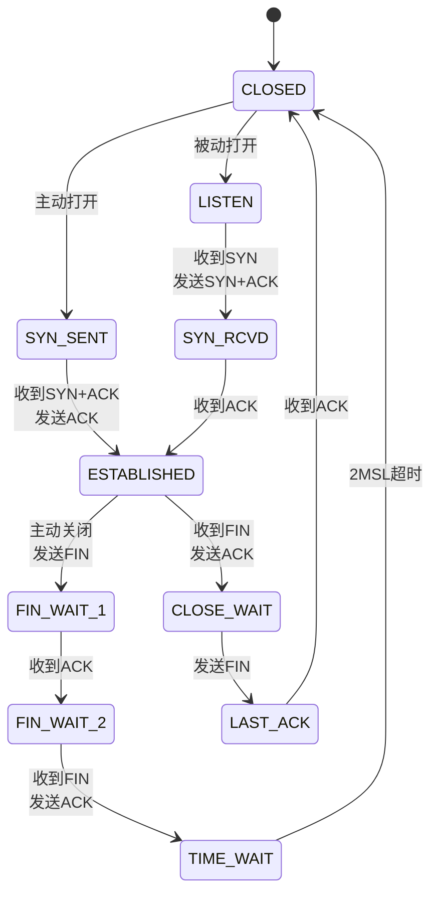

+++
title = "07.TCP协议详解"
date = 2026-01-19
description = "TCP深入解析：三次握手四次挥手、滑动窗口、拥塞控制、常见问题与调优"
[taxonomies]
tags = ["网络", "TCP", "协议"]
+++

## TCP概述

### TCP特性

**传输控制协议（Transmission Control Protocol）**：

- **面向连接**：通信前需要建立连接
- **可靠传输**：确保数据完整、有序到达
- **全双工**：双向同时传输
- **字节流**：无消息边界

### TCP头部结构

```
 0                   1                   2                   3
 0 1 2 3 4 5 6 7 8 9 0 1 2 3 4 5 6 7 8 9 0 1 2 3 4 5 6 7 8 9 0 1
+-+-+-+-+-+-+-+-+-+-+-+-+-+-+-+-+-+-+-+-+-+-+-+-+-+-+-+-+-+-+-+-+
|          Source Port          |       Destination Port        |
+-+-+-+-+-+-+-+-+-+-+-+-+-+-+-+-+-+-+-+-+-+-+-+-+-+-+-+-+-+-+-+-+
|                        Sequence Number                        |
+-+-+-+-+-+-+-+-+-+-+-+-+-+-+-+-+-+-+-+-+-+-+-+-+-+-+-+-+-+-+-+-+
|                    Acknowledgment Number                      |
+-+-+-+-+-+-+-+-+-+-+-+-+-+-+-+-+-+-+-+-+-+-+-+-+-+-+-+-+-+-+-+-+
|  Data |           |U|A|P|R|S|F|                               |
| Offset| Reserved  |R|C|S|S|Y|I|            Window             |
|       |           |G|K|H|T|N|N|                               |
+-+-+-+-+-+-+-+-+-+-+-+-+-+-+-+-+-+-+-+-+-+-+-+-+-+-+-+-+-+-+-+-+
|           Checksum            |         Urgent Pointer        |
+-+-+-+-+-+-+-+-+-+-+-+-+-+-+-+-+-+-+-+-+-+-+-+-+-+-+-+-+-+-+-+-+
```

**关键字段**：
- **Sequence Number**：序列号，标识发送的数据位置
- **Acknowledgment Number**：确认号，期望收到的下一个序号
- **Window**：接收窗口大小
- **标志位**：SYN、ACK、FIN、RST、PSH、URG

---

## 连接管理

### 三次握手

```
客户端                          服务端
  |                               |
  |  -------- SYN(seq=x) -------> |  第一次：客户端发起
  |                               |
  |  <-- SYN+ACK(seq=y,ack=x+1) - |  第二次：服务端响应
  |                               |
  |  -------- ACK(ack=y+1) -----> |  第三次：客户端确认
  |                               |
  |       连接建立，开始传输       |
```

**为什么是三次？**
- 确认双方的发送和接收能力
- 防止失效的连接请求被接受
- 同步双方的初始序列号

**SYN Flood攻击**：
- 攻击者发送大量SYN但不完成握手
- 服务端维护大量半连接，资源耗尽
- 防御：SYN Cookie、增大队列、限流

### 四次挥手

```
客户端                          服务端
  |                               |
  |  -------- FIN(seq=u) -------> |  第一次：客户端请求关闭
  |                               |
  |  <------- ACK(ack=u+1) ------ |  第二次：服务端确认
  |                               |
  |     服务端可能继续发送数据      |
  |                               |
  |  <------- FIN(seq=v) -------- |  第三次：服务端请求关闭
  |                               |
  |  -------- ACK(ack=v+1) -----> |  第四次：客户端确认
  |                               |
  |       TIME_WAIT(2MSL)         |
```

**为什么是四次？**
- TCP是全双工，每个方向需要单独关闭
- 服务端收到FIN后可能还有数据要发

### TIME_WAIT状态

**持续时间**：2MSL（Maximum Segment Lifetime），通常60秒-2分钟

**存在原因**：
1. 确保最后的ACK能到达对方
2. 确保旧连接的数据包消失

**TIME_WAIT过多的问题**：
- 端口被占用
- 内存消耗

**解决方案**：
```bash
# Linux内核参数
net.ipv4.tcp_tw_reuse = 1      # 允许重用TIME_WAIT
net.ipv4.tcp_tw_recycle = 1    # 快速回收（慎用，NAT环境有问题）
net.ipv4.tcp_fin_timeout = 30  # 减少FIN_WAIT2时间
```

---

## 可靠传输

### 序列号与确认

```
发送方                          接收方
  |                               |
  |  -- 数据(seq=1, len=100) ---> |
  |                               |
  |  <------- ACK(ack=101) ------ |  确认收到，期望101
  |                               |
  |  -- 数据(seq=101, len=100) -> |
  |                               |
  |  <------- ACK(ack=201) ------ |
```

### 重传机制

**超时重传（RTO）**：
- 发送数据后启动定时器
- 超时未收到ACK则重传
- RTO根据RTT动态调整

**快速重传**：
- 收到3个重复ACK立即重传
- 不等待超时
- 更快恢复丢包

```
发送方                          接收方
  |  -- seq=1 -->                 |
  |  -- seq=2 -->                 |  (丢失)
  |  -- seq=3 -->                 |
  |  <-- ACK=2 --                 |  收到3，但期望2
  |  -- seq=4 -->                 |
  |  <-- ACK=2 --                 |  重复ACK
  |  -- seq=5 -->                 |
  |  <-- ACK=2 --                 |  第3个重复ACK
  |  -- seq=2 --> (快速重传)       |
```

### SACK选择性确认

告诉发送方哪些数据已收到：
```
ACK=2, SACK=3-5
表示：期望2，但3-5已收到
发送方只需重传2
```

---

## 流量控制

### 滑动窗口

接收方通过Window字段告知能接收多少数据：

```
发送窗口：
┌───┬───┬───┬───┬───┬───┬───┬───┬───┬───┐
│ 1 │ 2 │ 3 │ 4 │ 5 │ 6 │ 7 │ 8 │ 9 │10 │
└───┴───┴───┴───┴───┴───┴───┴───┴───┴───┘
 已确认  │ 已发未确认 │  可发送  │ 不可发送
         └───────────┴──────────┘
              发送窗口
```

**窗口调整**：
- 接收方处理快→窗口大→发送更多
- 接收方处理慢→窗口小→发送减少
- 窗口为0→发送方暂停

### 零窗口探测

当接收窗口为0时：
1. 发送方暂停发送
2. 定期发送探测包
3. 接收方窗口恢复后通知

---

## 拥塞控制

### 为什么需要拥塞控制

网络是共享资源，如果所有发送方都全速发送：
- 路由器缓冲区溢出
- 大量丢包
- 性能急剧下降

### 拥塞控制算法

**慢启动（Slow Start）**：
```
cwnd初始值较小（如1-10 MSS）
每收到一个ACK，cwnd翻倍
指数增长直到达到ssthresh
```

**拥塞避免（Congestion Avoidance）**：
```
cwnd超过ssthresh后
每个RTT，cwnd增加1 MSS
线性增长
```

**快速重传（Fast Retransmit）**：
```
收到3个重复ACK
立即重传，不等超时
```

**快速恢复（Fast Recovery）**：
```
快速重传后
ssthresh = cwnd/2
cwnd = ssthresh + 3
继续拥塞避免
```

### 拥塞控制可视化

```
cwnd
  ^
  |          /\
  |         /  \
  |        /    \____
  |       /          \
  |      /            \
  |     /              \___
  |    /                   
  |   / 慢启动  拥塞避免
  |  /
  | /
  |/________________________> 时间
     ↑        ↑
   ssthresh  丢包
```

### 现代拥塞控制算法

| 算法 | 特点 | 适用场景 |
|------|------|----------|
| Reno | 经典算法 | 通用 |
| Cubic | Linux默认，高带宽友好 | 通用 |
| BBR | Google开发，基于带宽和RTT | 高延迟网络 |
| Vegas | 基于RTT变化 | 低延迟场景 |

**查看/设置拥塞算法**：
```bash
# 查看当前算法
sysctl net.ipv4.tcp_congestion_control

# 查看可用算法
sysctl net.ipv4.tcp_available_congestion_control

# 设置算法
sysctl -w net.ipv4.tcp_congestion_control=bbr
```

---

## TCP状态机

### 完整状态图



### 状态查看

```bash
# 统计各状态连接数
ss -ant | awk '{print $1}' | sort | uniq -c

# 或
netstat -ant | awk '{print $6}' | sort | uniq -c
```

---

## 常见问题与调优

### 高并发连接

**问题**：TIME_WAIT过多、端口耗尽

**调优**：
```bash
# 增大本地端口范围
net.ipv4.ip_local_port_range = 1024 65535

# TIME_WAIT重用
net.ipv4.tcp_tw_reuse = 1

# 增大连接跟踪表
net.netfilter.nf_conntrack_max = 1000000

# 增大半连接队列
net.ipv4.tcp_max_syn_backlog = 65535

# 增大全连接队列
net.core.somaxconn = 65535
```

### 高延迟网络

**问题**：带宽利用率低

**调优**：
```bash
# 增大缓冲区
net.core.rmem_max = 16777216
net.core.wmem_max = 16777216
net.ipv4.tcp_rmem = 4096 87380 16777216
net.ipv4.tcp_wmem = 4096 65536 16777216

# 启用窗口缩放
net.ipv4.tcp_window_scaling = 1

# 使用BBR
net.ipv4.tcp_congestion_control = bbr
```

### 小包频繁

**问题**：大量小包影响性能

**Nagle算法**：
- 合并小包，减少发送次数
- 但增加延迟

**禁用Nagle**（低延迟场景）：
```c
int flag = 1;
setsockopt(fd, IPPROTO_TCP, TCP_NODELAY, &flag, sizeof(flag));
```

### 连接保活

**TCP Keepalive**：
```bash
# 空闲多久开始探测
net.ipv4.tcp_keepalive_time = 600

# 探测间隔
net.ipv4.tcp_keepalive_intvl = 15

# 探测次数
net.ipv4.tcp_keepalive_probes = 5
```

---

## 总结

| 机制 | 目的 | 关键点 |
|------|------|--------|
| 三次握手 | 建立连接 | 同步序列号，确认双方能力 |
| 四次挥手 | 关闭连接 | 全双工，各自关闭 |
| 序列号/确认 | 可靠传输 | 保证数据完整有序 |
| 滑动窗口 | 流量控制 | 接收方控制发送速率 |
| 拥塞控制 | 网络保护 | 避免网络过载 |

理解TCP的这些机制，是进行网络编程和性能调优的基础。

---

## 相关文章

- [上一篇：TCP/IP协议栈基础](/articles/networking/net-06-TCPIP协议栈基础/)
- [下一篇：UDP与可靠UDP](/articles/networking/net-08-UDP与可靠UDP/)
