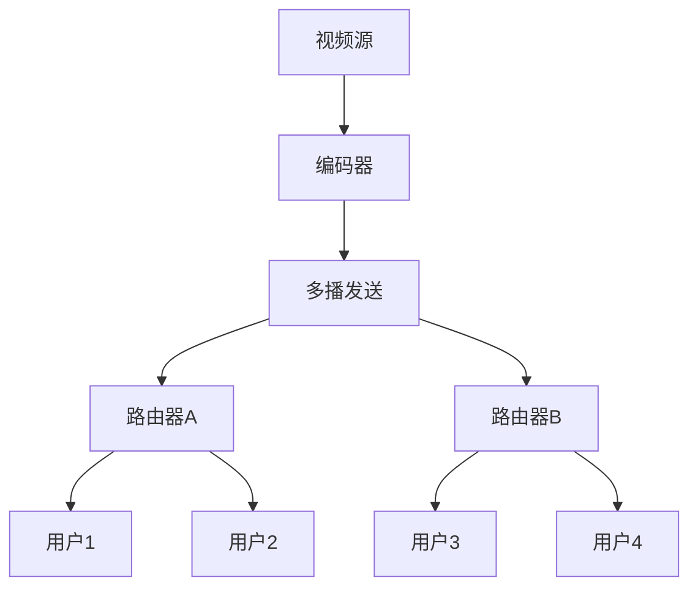

+++
title = "多播与组播技术"
date = 2026-01-19
weight = 9000
description = "多播组播详解：多播原理、IGMP协议、多播路由、应用场景与编程实现"
[taxonomies]
tags = ["网络", "多播", "组播"]
+++

## 传输方式对比

### 单播、广播、多播

| 方式 | 描述 | 接收者 | 网络开销 |
|------|------|--------|----------|
| **单播(Unicast)** | 一对一 | 单个目标 | N份数据→N个接收者 |
| **广播(Broadcast)** | 一对所有 | 局域网所有主机 | 1份数据，所有人收 |
| **多播(Multicast)** | 一对多 | 订阅组的成员 | 1份数据，组成员收 |
| **任播(Anycast)** | 一对最近一个 | 最近的服务节点 | 1份数据，一人收 |

### 为什么需要多播

**单播的问题**：
```
发送者 → 接收者1 (发送一份)
       → 接收者2 (发送一份)
       → 接收者3 (发送一份)
       
带宽占用 = 数据大小 × 接收者数量
```

**多播的优势**：
```
发送者 → 网络 → 接收者1
              → 接收者2
              → 接收者3
              
发送者只发一份，网络复制分发
带宽占用 = 数据大小（与接收者数量无关）
```

### 多播应用场景

| 场景 | 说明 |
|------|------|
| IPTV/视频直播 | 大量用户同时观看 |
| 视频会议 | 多人实时通信 |
| 软件分发 | 批量更新客户端 |
| 金融数据 | 行情广播 |
| 集群通信 | 服务发现、状态同步 |
| 游戏 | 状态同步 |

---

## 多播地址

### IPv4多播地址

**地址范围**：224.0.0.0 - 239.255.255.255（D类地址）

**地址分类**：

| 范围 | 用途 |
|------|------|
| 224.0.0.0/24 | 本地链路，TTL=1，不转发 |
| 224.0.1.0/24 | 互联网控制 |
| 232.0.0.0/8 | SSM（源特定多播） |
| 233.0.0.0/8 | GLOP（AS号映射） |
| 239.0.0.0/8 | 私有地址（组织内部） |

**常用保留地址**：

| 地址 | 用途 |
|------|------|
| 224.0.0.1 | 所有主机 |
| 224.0.0.2 | 所有多播路由器 |
| 224.0.0.5 | OSPF路由器 |
| 224.0.0.6 | OSPF指定路由器 |
| 224.0.0.9 | RIPv2路由器 |
| 224.0.0.251 | mDNS |

### IPv6多播地址

**格式**：FF00::/8

**结构**：
```
FF[Flags][Scope]::[Group ID]

Flags: 0=永久, 1=临时
Scope: 1=节点, 2=链路, 5=站点, 8=组织, E=全球
```

**常用地址**：
- FF02::1 - 所有节点
- FF02::2 - 所有路由器
- FF02::FB - mDNS

### 多播MAC地址映射

IPv4多播地址映射到MAC地址：
```
IP: 239.192.1.100
    ↓
低23位: 01:00:5E + IP低23位
    ↓
MAC: 01:00:5E:40:01:64
```

**问题**：32位IP只用23位映射，有32个IP对应同一个MAC。

---

## IGMP协议

### IGMP功能

**Internet Group Management Protocol**：主机与路由器之间管理组成员关系。

**版本对比**：

| 版本 | 功能 |
|------|------|
| IGMPv1 | 基本加入/离开 |
| IGMPv2 | 快速离开、查询者选举 |
| IGMPv3 | 源过滤（SSM支持） |

### IGMP消息类型

**IGMPv2消息**：

| 类型 | 描述 |
|------|------|
| Membership Query | 路由器查询组成员 |
| Membership Report | 主机报告加入组 |
| Leave Group | 主机离开组 |

### IGMP工作流程

**加入组**：
```
1. 主机发送Membership Report到组地址
2. 路由器记录该接口有组成员
3. 路由器向上游请求多播流量
```

**定期查询**：
```
1. 路由器定期发送Query（224.0.0.1）
2. 主机收到后延迟随机时间回复Report
3. 其他主机听到Report后抑制自己的Report
4. 路由器刷新成员信息
```

**离开组**：
```
1. 主机发送Leave Group到224.0.0.2
2. 路由器发送Group-Specific Query
3. 如无回复，删除组成员记录
```

### IGMP Snooping

**交换机层面的优化**：
- 交换机监听IGMP消息
- 构建端口-组映射表
- 只向有成员的端口转发多播

```
不开启Snooping：多播→所有端口（类似广播）
开启Snooping：  多播→只有成员的端口
```

---

## 多播路由

### 多播路由协议

| 协议 | 类型 | 适用场景 |
|------|------|----------|
| DVMRP | 距离向量 | 早期协议 |
| PIM-DM | 密集模式 | 组成员密集 |
| PIM-SM | 稀疏模式 | 组成员稀疏 |
| MSDP | 域间 | 跨自治系统 |

### PIM-SM

**Protocol Independent Multicast - Sparse Mode**：

**核心概念**：
- **RP（Rendezvous Point）**：汇聚点，源和接收者的会合点
- **SPT（Shortest Path Tree）**：源到接收者的最短路径树
- **RPT（RP Tree）**：以RP为根的共享树

**工作流程**：
```
1. 接收者加入：向RP发送Join
2. 源开始发送：数据发到RP
3. RP转发：沿RPT向接收者转发
4. SPT切换：流量大时切换到最短路径
```

---

## 多播编程

### 发送多播

```python
import socket
import struct

# 创建UDP socket
sock = socket.socket(socket.AF_INET, socket.SOCK_DGRAM, socket.IPPROTO_UDP)

# 设置TTL（存活跳数）
sock.setsockopt(socket.IPPROTO_IP, socket.IP_MULTICAST_TTL, 32)

# 发送到多播组
multicast_group = ('239.192.1.100', 5000)
sock.sendto(b'Hello Multicast', multicast_group)
```

### 接收多播

```python
import socket
import struct

# 创建UDP socket
sock = socket.socket(socket.AF_INET, socket.SOCK_DGRAM, socket.IPPROTO_UDP)

# 允许地址重用
sock.setsockopt(socket.SOL_SOCKET, socket.SO_REUSEADDR, 1)

# 绑定端口
sock.bind(('', 5000))

# 加入多播组
multicast_group = '239.192.1.100'
local_interface = '0.0.0.0'
mreq = struct.pack('4s4s', 
    socket.inet_aton(multicast_group),
    socket.inet_aton(local_interface))
sock.setsockopt(socket.IPPROTO_IP, socket.IP_ADD_MEMBERSHIP, mreq)

# 接收数据
while True:
    data, addr = sock.recvfrom(1024)
    print(f'Received: {data} from {addr}')
```

### 关键Socket选项

| 选项 | 描述 |
|------|------|
| IP_MULTICAST_TTL | 多播TTL |
| IP_MULTICAST_IF | 发送接口 |
| IP_MULTICAST_LOOP | 是否回环 |
| IP_ADD_MEMBERSHIP | 加入组 |
| IP_DROP_MEMBERSHIP | 离开组 |

---

## 应用场景详解

### 视频直播



**优势**：
- 带宽与用户数无关
- 延迟低（UDP）
- 可扩展性好

### 金融行情分发

```
交易所 → 多播组1: 股票行情
       → 多播组2: 期货行情
       → 多播组3: 期权行情
       
券商A订阅：组1、组3
券商B订阅：组1、组2、组3
```

**要求**：
- 超低延迟
- 高可靠性
- 有序传输

### 集群服务发现

```
服务注册：发送到多播组
服务发现：监听多播组

所有节点加入同一多播组
新服务启动时广播自己的信息
其他节点收到后更新服务列表
```

**应用**：
- Consul
- ZeroMQ
- JGroups

---

## 可靠多播

### 多播的可靠性问题

UDP多播不保证可靠性：
- 可能丢包
- 可能乱序
- 不同接收者可能收到不同数据

### 可靠多播方案

**NACK-based（否定确认）**：
```
发送者持续发送
接收者发现丢包后发送NACK
发送者重传丢失的包
```

优点：正常情况无额外开销
缺点：需要缓存历史数据

**ACK-based（确认）**：
```
发送者发送后等待ACK
收到所有ACK后发下一包
```

问题：ACK数量随接收者增加（ACK爆炸）

**混合方案**：
- 层次化ACK
- 代表确认
- 前向纠错（FEC）

### 可靠多播协议

| 协议 | 特点 |
|------|------|
| PGM | RFC 3208，NACK-based |
| NORM | RFC 5740，NACK-based |
| SRM | 基于IP多播的可靠协议 |

---

## 部署考虑

### 网络要求

**多播支持**：
- 网络设备支持多播路由
- 启用IGMP Snooping
- 配置PIM协议

**企业网络**：通常支持
**互联网**：支持有限，需要隧道或覆盖网络

### 安全考虑

**问题**：
- 任何人可以加入组
- 可能被窃听
- 可能被DoS攻击

**解决方案**：
- 应用层加密
- 组密钥管理
- 源认证

### 调试工具

```bash
# 查看多播组成员
netstat -gn
ip maddr show

# 抓包
tcpdump -i eth0 multicast

# 测试发送
echo "test" | socat - UDP4-DATAGRAM:239.192.1.100:5000

# 测试接收
socat UDP4-RECVFROM:5000,ip-add-membership=239.192.1.100:eth0 -
```

---

## 总结

| 要点 | 说明 |
|------|------|
| 适用场景 | 一对多、高效分发 |
| 地址范围 | 224.0.0.0 - 239.255.255.255 |
| 管理协议 | IGMP（主机-路由器） |
| 路由协议 | PIM-SM（稀疏模式常用） |
| 可靠性 | 默认不可靠，需额外机制 |

多播是解决一对多高效通信的关键技术，在视频分发、金融行情、集群通信等场景有广泛应用。

---

## 相关文章

- [上一篇：UDP与可靠UDP](@/articles/networking/net-08-UDP与可靠UDP.md)
- [下一篇：Socket网络编程](@/articles/networking/net-10-Socket网络编程.md)
