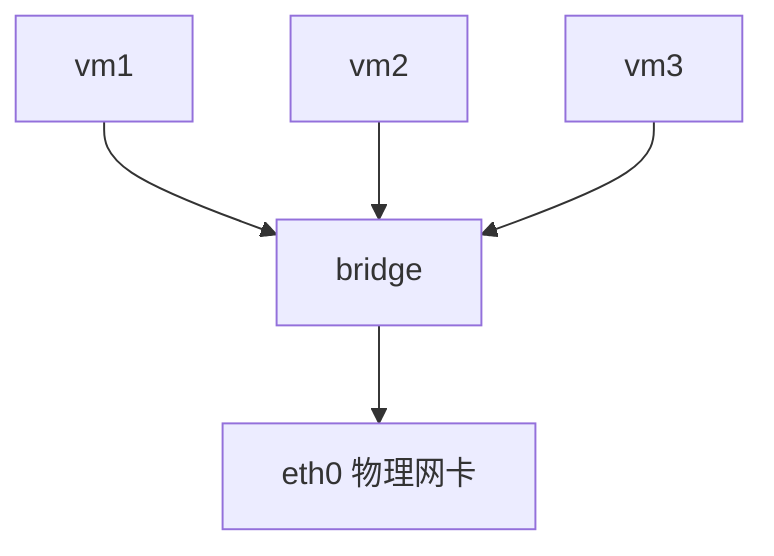
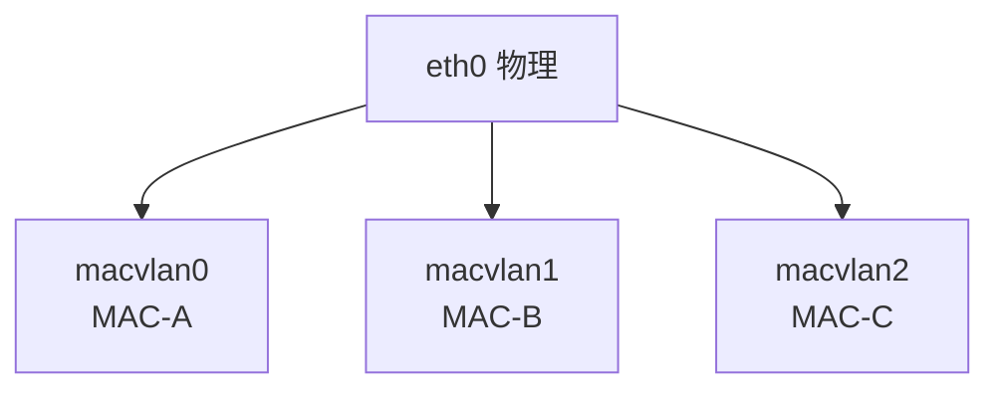
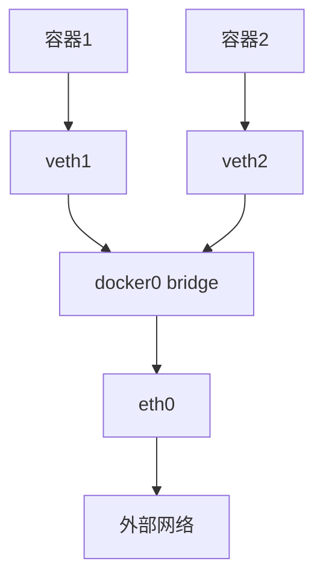
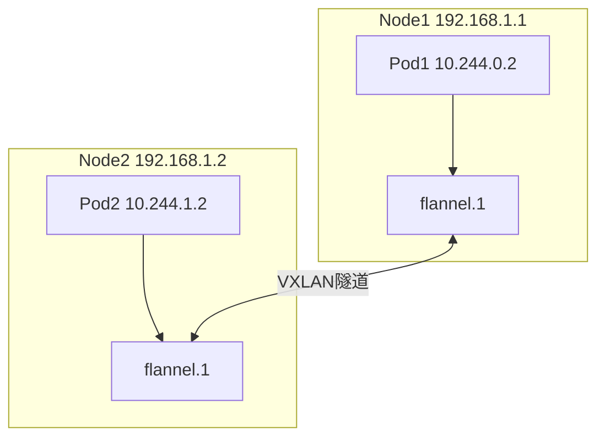

+++
title = "12. 网络虚拟化技术"
date = 2026-01-19
weight = 12000
description = "网络虚拟化详解：Linux虚拟网络设备、VLAN、VXLAN、网络命名空间、容器网络"
[taxonomies]
tags = ["网络", "虚拟化", "容器"]
+++

## 网络虚拟化概述

### 为什么需要网络虚拟化

**传统网络的局限**：
- 物理网络扩展困难
- VLAN数量限制（4096）
- 多租户隔离复杂
- 网络迁移困难

**虚拟化网络的优势**：
- 软件定义，灵活配置
- 突破物理限制
- 支持多租户隔离
- 与虚拟机/容器联动

---

## Linux虚拟网络设备

### veth pair

**虚拟以太网对**：成对出现，一端发送另一端接收

```
容器A                    容器B
  |                        |
veth0 <---- veth pair ----> veth1
```

**创建veth pair**：
```bash
# 创建
ip link add veth0 type veth peer name veth1

# 查看
ip link show type veth

# 启用
ip link set veth0 up
ip link set veth1 up
```

**应用场景**：
- 连接网络命名空间
- 容器网络

### bridge

**虚拟交换机**：二层转发设备



**创建bridge**：
```bash
# 创建
ip link add br0 type bridge

# 启用
ip link set br0 up

# 添加接口
ip link set eth0 master br0
ip link set veth0 master br0

# 查看
bridge link show
```

### tun/tap

**tun**：三层虚拟网卡，处理IP包
**tap**：二层虚拟网卡，处理以太网帧

```
用户态程序 <--读写--> tun/tap设备 <---> 内核网络栈
```

**应用场景**：
- VPN（OpenVPN使用tun）
- 虚拟机网络（QEMU使用tap）

**创建**：
```bash
# 创建tun
ip tuntap add tun0 mode tun

# 创建tap
ip tuntap add tap0 mode tap
```

### macvlan

**基于MAC地址的虚拟网卡**：一个物理网卡虚拟出多个MAC地址



**模式**：
- bridge：同一macvlan可互通
- vepa：通过外部交换机通信
- private：完全隔离
- passthru：直通模式

**创建**：
```bash
ip link add macvlan0 link eth0 type macvlan mode bridge
```

### ipvlan

**基于IP地址的虚拟网卡**：共享MAC地址

**模式**：
- L2：二层模式，类似macvlan
- L3：三层模式，纯路由
- L3S：L3 + 连接跟踪

**创建**：
```bash
ip link add ipvlan0 link eth0 type ipvlan mode l2
```

---

## 网络命名空间

### 概念

**Network Namespace**：隔离的网络栈，包括：
- 网络设备
- IP地址
- 路由表
- iptables规则
- socket

每个容器运行在独立的网络命名空间中。

### 操作

```bash
# 创建命名空间
ip netns add ns1

# 列出命名空间
ip netns list

# 在命名空间中执行命令
ip netns exec ns1 ip addr

# 将设备移入命名空间
ip link set veth1 netns ns1

# 删除命名空间
ip netns delete ns1
```

### 连接两个命名空间

```bash
# 创建两个命名空间
ip netns add ns1
ip netns add ns2

# 创建veth pair
ip link add veth1 type veth peer name veth2

# 分配到不同命名空间
ip link set veth1 netns ns1
ip link set veth2 netns ns2

# 配置IP
ip netns exec ns1 ip addr add 10.0.0.1/24 dev veth1
ip netns exec ns1 ip link set veth1 up
ip netns exec ns2 ip addr add 10.0.0.2/24 dev veth2
ip netns exec ns2 ip link set veth2 up

# 测试连通性
ip netns exec ns1 ping 10.0.0.2
```

---

## VLAN

### VLAN原理

**Virtual LAN**：逻辑隔离的二层网络

**802.1Q标签**：

| 目的MAC(6) | 源MAC(6) | TPID(8100) | TCI(含VID) | 类型/长度 |
|------------|----------|------------|------------|-----------|

TCI 包含 VLAN ID (12位, 0-4095)

### Linux VLAN配置

```bash
# 加载模块
modprobe 8021q

# 创建VLAN子接口
ip link add link eth0 name eth0.100 type vlan id 100

# 配置IP
ip addr add 192.168.100.1/24 dev eth0.100

# 启用
ip link set eth0.100 up

# 查看VLAN
cat /proc/net/vlan/config
```

### VLAN应用

**交换机端口类型**：
- Access：连接终端，发送时去标签
- Trunk：连接交换机/服务器，保留标签
- Hybrid：灵活配置

---

## VXLAN

### 为什么需要VXLAN

**VLAN的限制**：
- VLAN ID只有12位，最多4096个
- 无法跨三层网络
- 不适合大规模云环境

**VXLAN优势**：
- VNI有24位，支持1600万+网络
- 通过UDP封装，可跨三层
- 适合数据中心和云环境

### VXLAN原理

**原始帧**: `[MAC头][IP头][数据]`

**VXLAN封装**:

| 外层MAC | 外层IP | UDP(4789) | VXLAN头 | 原始帧 |
|---------|--------|-----------|---------|--------|

**关键概念**：
- **VNI（VXLAN Network Identifier）**：24位网络标识
- **VTEP（VXLAN Tunnel Endpoint）**：隧道端点，封装/解封装
- **Underlay**：物理网络
- **Overlay**：虚拟网络

### VXLAN配置

```bash
# 创建VXLAN接口
ip link add vxlan100 type vxlan id 100 \
    dstport 4789 \
    local 192.168.1.1 \
    remote 192.168.1.2

# 启用
ip link set vxlan100 up

# 配置IP
ip addr add 10.0.0.1/24 dev vxlan100
```

**多播模式**：
```bash
ip link add vxlan100 type vxlan id 100 \
    group 239.1.1.1 \
    dev eth0
```

---

## 容器网络

### Docker网络模式

| 模式 | 描述 |
|------|------|
| bridge | 默认，使用docker0网桥 |
| host | 共享主机网络 |
| none | 无网络 |
| container | 共享其他容器网络 |
| overlay | 跨主机网络 |
| macvlan | 直接使用物理网络 |

### Bridge模式详解



**NAT访问外部**：
```
容器IP(172.17.0.2) → docker0 → SNAT → eth0 → 外部
```

**端口映射**：
```bash
docker run -p 8080:80 nginx
# iptables DNAT: 宿主机8080 → 容器80
```

### CNI（Container Network Interface）

**标准化容器网络接口**：
- Kubernetes使用CNI
- 插件化架构

**常见CNI插件**：
- Flannel：简单的Overlay网络
- Calico：基于BGP的三层网络
- Cilium：基于eBPF的高性能网络
- Weave：Overlay + 加密

### Flannel工作原理

**VXLAN模式**：


---

## SDN与OpenFlow

### SDN架构

```
应用层: 网络应用
   ↓ 北向接口
控制层: SDN控制器
   ↓ 南向接口(OpenFlow)
数据层: 交换机/路由器
```

### OpenFlow

**协议**：控制器与交换机通信的标准协议

**流表**：
```
Match Fields → Actions

匹配: 源IP=10.0.0.1, 目的端口=80
动作: 转发到端口3
```

### Open vSwitch

**软件实现的OpenFlow交换机**：
```bash
# 创建网桥
ovs-vsctl add-br br0

# 添加端口
ovs-vsctl add-port br0 eth0
ovs-vsctl add-port br0 veth0

# 查看流表
ovs-ofctl dump-flows br0

# 添加流表项
ovs-ofctl add-flow br0 "in_port=1,actions=output:2"
```

---

## 总结

| 技术 | 层次 | 用途 |
|------|------|------|
| veth | L2 | 命名空间连接 |
| bridge | L2 | 虚拟交换 |
| tun/tap | L2/L3 | VPN、虚拟机 |
| macvlan | L2 | 多MAC地址 |
| VLAN | L2 | 逻辑隔离 |
| VXLAN | L2 over L3 | 大规模虚拟网络 |
| Network NS | - | 网络隔离 |

网络虚拟化是云计算和容器技术的基础，理解这些概念对于容器网络排障和性能优化至关重要。

---

## 相关文章

- [上一篇：网络性能分析与调优](@/articles/networking/net-11-网络性能分析与调优.md)
- [下一篇：高性能网络架构](@/articles/networking/net-13-高性能网络架构.md)
