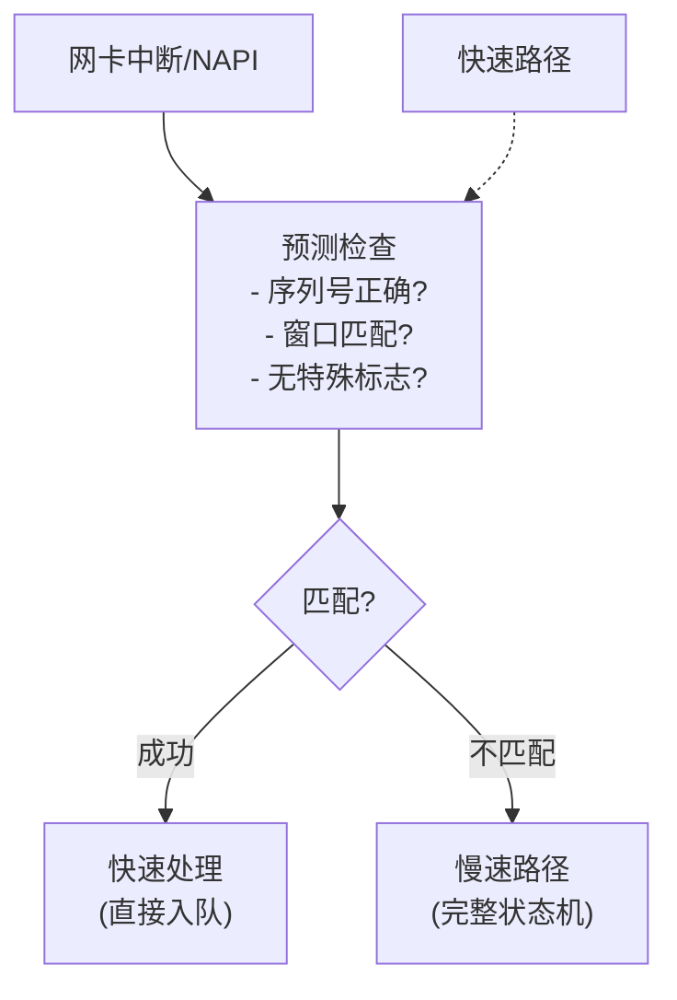

+++
title = "18. TCP调优深入详解(HFT)"
slug = "net-18-TCP调优深入详解"
description = "深入讲解Linux TCP性能调优：内核参数、拥塞控制算法(BBR/CUBIC)、快速路径、零拷贝(sendfile/splice)与低延迟优化"
date = 2026-01-21
weight = 18000
draft = false
[taxonomies]
tags = ["TCP", "网络调优", "BBR", "低延迟", "HFT"]
+++

# TCP调优深入详解(HFT)

## 概述

TCP是金融系统最常用的传输协议。深入理解TCP的工作原理和调优方法，对于优化交易系统的延迟和吞吐量至关重要。

## 一、TCP内核参数

### 1.1 缓冲区参数

```bash
# 接收缓冲区
net.core.rmem_default = 16777216    # 默认接收缓冲区
net.core.rmem_max = 134217728       # 最大接收缓冲区
net.ipv4.tcp_rmem = 4096 87380 134217728  # TCP接收 [min default max]

# 发送缓冲区
net.core.wmem_default = 16777216    # 默认发送缓冲区
net.core.wmem_max = 134217728       # 最大发送缓冲区
net.ipv4.tcp_wmem = 4096 65536 134217728  # TCP发送 [min default max]

# 选项内存
net.core.optmem_max = 16777216

# TCP内存限制（页数）
net.ipv4.tcp_mem = 786432 1048576 1572864  # [low pressure high]
```

### 1.2 连接参数

```bash
# 连接队列
net.core.somaxconn = 65535              # listen()队列长度
net.ipv4.tcp_max_syn_backlog = 65535    # SYN队列长度
net.core.netdev_max_backlog = 300000    # 设备队列长度

# 连接超时
net.ipv4.tcp_syn_retries = 2            # SYN重试次数
net.ipv4.tcp_synack_retries = 2         # SYN-ACK重试次数
net.ipv4.tcp_fin_timeout = 10           # FIN超时

# TIME_WAIT优化
net.ipv4.tcp_tw_reuse = 1               # 允许TIME_WAIT重用
net.ipv4.tcp_max_tw_buckets = 2000000   # TIME_WAIT数量上限

# Keepalive
net.ipv4.tcp_keepalive_time = 60        # 保活开始时间
net.ipv4.tcp_keepalive_intvl = 10       # 保活间隔
net.ipv4.tcp_keepalive_probes = 6       # 保活探测次数
```

### 1.3 低延迟参数

```bash
# 禁用延迟确认
net.ipv4.tcp_quickack = 1

# 低延迟模式
net.ipv4.tcp_low_latency = 1

# 禁用时间戳（减少包大小和处理开销）
net.ipv4.tcp_timestamps = 0

# 禁用SACK（简化处理，但可能影响丢包恢复）
net.ipv4.tcp_sack = 0

# 禁用窗口缩放（如果延迟足够低）
net.ipv4.tcp_window_scaling = 0

# 启用TCP Fast Open
net.ipv4.tcp_fastopen = 3

# Busy polling（轮询接收）
net.core.busy_read = 50     # 微秒
net.core.busy_poll = 50     # 微秒
```

## 二、拥塞控制算法

### 2.1 拥塞控制对比

| 算法 | 类型 | 适用场景 | 特点 |
|------|------|----------|------|
| CUBIC | 基于丢包 | 通用 | Linux默认 |
| BBR | 基于带宽 | 高延迟、丢包 | Google开发 |
| DCTCP | 数据中心 | 低延迟DC | ECN标记 |
| Vegas | 基于延迟 | 低延迟 | 较早算法 |

### 2.2 切换拥塞控制

```bash
# 查看当前算法
sysctl net.ipv4.tcp_congestion_control

# 查看可用算法
sysctl net.ipv4.tcp_available_congestion_control

# 切换到BBR
sysctl -w net.ipv4.tcp_congestion_control=bbr

# 加载额外算法
modprobe tcp_bbr
modprobe tcp_vegas
```

### 2.3 BBR配置

```bash
# 启用BBR
cat >> /etc/sysctl.conf << 'EOF'
net.core.default_qdisc = fq
net.ipv4.tcp_congestion_control = bbr
EOF

sysctl -p

# 验证BBR启用
sysctl net.ipv4.tcp_congestion_control
# 输出: net.ipv4.tcp_congestion_control = bbr
```

### 2.4 程序中设置拥塞控制

```c
#include <netinet/tcp.h>

int set_congestion_control(int sock, const char *algo) {
    return setsockopt(sock, IPPROTO_TCP, TCP_CONGESTION, 
                      algo, strlen(algo));
}

/* 使用示例 */
int sock = socket(AF_INET, SOCK_STREAM, 0);
set_congestion_control(sock, "bbr");
```

## 三、Socket选项优化

### 3.1 关键Socket选项

```c
#include <sys/socket.h>
#include <netinet/tcp.h>

void optimize_socket(int sock) {
    int one = 1;
    int zero = 0;
    
    /* 禁用Nagle算法 */
    setsockopt(sock, IPPROTO_TCP, TCP_NODELAY, &one, sizeof(one));
    
    /* 启用快速确认 */
    setsockopt(sock, IPPROTO_TCP, TCP_QUICKACK, &one, sizeof(one));
    
    /* 设置缓冲区大小 */
    int bufsize = 16 * 1024 * 1024;
    setsockopt(sock, SOL_SOCKET, SO_RCVBUF, &bufsize, sizeof(bufsize));
    setsockopt(sock, SOL_SOCKET, SO_SNDBUF, &bufsize, sizeof(bufsize));
    
    /* 启用busy polling */
    int busy_poll = 50;  /* 微秒 */
    setsockopt(sock, SOL_SOCKET, SO_BUSY_POLL, &busy_poll, sizeof(busy_poll));
    
    /* 地址重用 */
    setsockopt(sock, SOL_SOCKET, SO_REUSEADDR, &one, sizeof(one));
    setsockopt(sock, SOL_SOCKET, SO_REUSEPORT, &one, sizeof(one));
    
    /* 关闭延迟关闭 */
    struct linger lg = {.l_onoff = 1, .l_linger = 0};
    setsockopt(sock, SOL_SOCKET, SO_LINGER, &lg, sizeof(lg));
    
    /* TCP keepalive */
    setsockopt(sock, SOL_SOCKET, SO_KEEPALIVE, &one, sizeof(one));
    int keepidle = 60;
    int keepintvl = 10;
    int keepcnt = 6;
    setsockopt(sock, IPPROTO_TCP, TCP_KEEPIDLE, &keepidle, sizeof(keepidle));
    setsockopt(sock, IPPROTO_TCP, TCP_KEEPINTVL, &keepintvl, sizeof(keepintvl));
    setsockopt(sock, IPPROTO_TCP, TCP_KEEPCNT, &keepcnt, sizeof(keepcnt));
}
```

### 3.2 TCP_NODELAY vs TCP_CORK

```c
/* TCP_NODELAY: 禁用Nagle，立即发送小包 */
int nodelay = 1;
setsockopt(sock, IPPROTO_TCP, TCP_NODELAY, &nodelay, sizeof(nodelay));

/* TCP_CORK: 累积数据直到cork移除或超时 */
int cork = 1;
setsockopt(sock, IPPROTO_TCP, TCP_CORK, &cork, sizeof(cork));

/* 发送多个小数据块 */
write(sock, header, header_len);
write(sock, body, body_len);
write(sock, trailer, trailer_len);

/* 取消cork，立即发送 */
cork = 0;
setsockopt(sock, IPPROTO_TCP, TCP_CORK, &cork, sizeof(cork));
```

### 3.3 零拷贝发送

```c
#include <sys/sendfile.h>

/* 使用sendfile发送文件 */
ssize_t send_file(int sock, int file_fd, size_t count) {
    off_t offset = 0;
    return sendfile(sock, file_fd, &offset, count);
}

/* 使用MSG_ZEROCOPY */
void send_zerocopy(int sock, void *buf, size_t len) {
    /* 需要先启用 */
    int one = 1;
    setsockopt(sock, SOL_SOCKET, SO_ZEROCOPY, &one, sizeof(one));
    
    /* 零拷贝发送 */
    send(sock, buf, len, MSG_ZEROCOPY);
    
    /* 需要等待完成通知 */
    /* 通过recvmsg接收错误队列消息 */
}
```

## 四、快速路径优化

### 4.1 理解TCP快速路径



### 4.2 优化快速路径命中率

```bash
# 减少OPTIONS可以提高快速路径命中率
net.ipv4.tcp_timestamps = 0
net.ipv4.tcp_sack = 0

# 监控快速路径统计
cat /proc/net/snmp | grep Tcp
# 关注 InSegs, OutSegs, RetransSegs
```

## 五、网卡和中断优化

### 5.1 网卡参数

```bash
#!/bin/bash
# nic_optimize.sh

IFACE=${1:-eth0}

# 禁用中断合并
ethtool -C $IFACE rx-usecs 0 tx-usecs 0
ethtool -C $IFACE adaptive-rx off adaptive-tx off

# 禁用pause帧
ethtool -A $IFACE rx off tx off

# 禁用GRO/LRO/TSO/GSO（最低延迟）
ethtool -K $IFACE gro off lro off tso off gso off

# 增大ring buffer
ethtool -G $IFACE rx 4096 tx 4096

# 配置RSS队列
ethtool -L $IFACE combined 8
```

### 5.2 中断亲和性

```bash
#!/bin/bash
# set_irq_affinity.sh

IFACE=$1
CPUS=$2  # 如 "0,1,2,3"

# 获取网卡中断
irqs=$(grep $IFACE /proc/interrupts | awk '{print $1}' | tr -d ':')

# 分配到指定CPU
cpu_array=(${CPUS//,/ })
idx=0
for irq in $irqs; do
    cpu=${cpu_array[$idx]}
    echo $cpu > /proc/irq/$irq/smp_affinity_list
    echo "IRQ $irq -> CPU $cpu"
    idx=$(( (idx + 1) % ${#cpu_array[@]} ))
done
```

### 5.3 RPS/RFS配置

```bash
# RPS - 接收包导向（软件RSS）
echo "f" > /sys/class/net/eth0/queues/rx-0/rps_cpus

# RFS - 接收流导向
echo 32768 > /proc/sys/net/core/rps_sock_flow_entries
echo 2048 > /sys/class/net/eth0/queues/rx-0/rps_flow_cnt

# XPS - 发送包导向
echo "1" > /sys/class/net/eth0/queues/tx-0/xps_cpus
echo "2" > /sys/class/net/eth0/queues/tx-1/xps_cpus
```

## 六、性能监控

### 6.1 TCP统计信息

```bash
#!/bin/bash
# tcp_stats.sh

echo "=== TCP连接统计 ==="
ss -s

echo -e "\n=== 连接状态分布 ==="
ss -tan | awk 'NR>1 {states[$1]++} END {for(s in states) print s, states[s]}' | sort -k2 -rn

echo -e "\n=== 重传统计 ==="
netstat -s | grep -E "(retransmit|timeout|reset)"

echo -e "\n=== SNMP TCP统计 ==="
cat /proc/net/snmp | grep Tcp

echo -e "\n=== 缓冲区使用 ==="
cat /proc/net/sockstat | grep TCP
```

### 6.2 延迟测量

```c
#include <sys/socket.h>
#include <netinet/tcp.h>

/* 获取TCP_INFO */
void get_tcp_info(int sock) {
    struct tcp_info info;
    socklen_t len = sizeof(info);
    
    getsockopt(sock, IPPROTO_TCP, TCP_INFO, &info, &len);
    
    printf("RTT: %u us (variance: %u us)\n", 
           info.tcpi_rtt, info.tcpi_rttvar);
    printf("发送拥塞窗口: %u\n", info.tcpi_snd_cwnd);
    printf("重传次数: %u\n", info.tcpi_total_retrans);
    printf("未确认包数: %u\n", info.tcpi_unacked);
}
```

### 6.3 ss命令详解

```bash
# 显示TCP详细信息
ss -tin

# 输出示例:
# ESTAB 0 0 192.168.1.100:45678 10.0.0.1:80
#    cubic wscale:7,7 rto:204 rtt:1.234/0.567 ato:40 mss:1448 
#    rcvmss:1448 advmss:1448 cwnd:10 bytes_acked:12345 
#    bytes_received:54321 segs_out:100 segs_in:50 
#    send 94.0Mbps lastsnd:4 lastrcv:4 lastack:4 
#    pacing_rate 187.9Mbps delivery_rate 47.0Mbps app_limited
#    busy:8ms rcv_space:14600

# 过滤特定状态
ss -tan state established
ss -tan state time-wait

# 按端口过滤
ss -tan 'sport = :80'
ss -tan 'dport = :443'
```

## 七、常见问题排查

### 7.1 连接超时

```bash
# 检查SYN队列溢出
netstat -s | grep "SYN"

# 检查accept队列溢出
netstat -s | grep "listen queue"

# 增加队列大小
sysctl -w net.core.somaxconn=65535
sysctl -w net.ipv4.tcp_max_syn_backlog=65535
```

### 7.2 重传过多

```bash
# 查看重传统计
netstat -s | grep retransmit

# 可能原因：
# 1. 网络丢包
# 2. 接收端处理慢
# 3. 缓冲区不足

# 检查丢包
ip -s link show eth0

# 增加缓冲区
sysctl -w net.core.rmem_max=134217728
sysctl -w net.ipv4.tcp_rmem="4096 87380 134217728"
```

### 7.3 TIME_WAIT过多

```bash
# 查看TIME_WAIT数量
ss -tan state time-wait | wc -l

# 优化
sysctl -w net.ipv4.tcp_tw_reuse=1
sysctl -w net.ipv4.tcp_fin_timeout=10
sysctl -w net.ipv4.tcp_max_tw_buckets=2000000
```

## 总结

TCP调优的核心要点：

1. **缓冲区**：根据带宽时延积调整
2. **拥塞控制**：BBR适合高延迟或丢包环境
3. **低延迟选项**：TCP_NODELAY、TCP_QUICKACK
4. **中断优化**：禁用合并、配置亲和性
5. **监控**：持续监控TCP统计发现问题

记住，TCP调优需要根据具体场景调整，没有万能配置。

---

## 相关文章

- [上一篇：网络故障排查](@/articles/networking/net-17-网络故障排查.md)
- [下一篇：UDP组播最佳实践(HFT)](@/articles/networking/net-19-UDP组播最佳实践.md)
