+++
title = "DPU 与智能网卡技术详解"
description = "数据处理单元（DPU）架构、应用场景与编程开发深度解析"
date = 2025-02-07
weight = 24000
updated = 2025-02-07
draft = false
[taxonomies]
tags = ["DPU", "SmartNIC", "网络", "数据中心", "卸载", "NVIDIA", "BlueField"]
[extra]
toc = true
comments = true
+++

## 一、DPU 概述

### 1.1 什么是 DPU

DPU（Data Processing Unit，数据处理单元）是一种专门用于数据中心基础设施任务的处理器，与 CPU 和 GPU 并列为数据中心三大计算支柱。

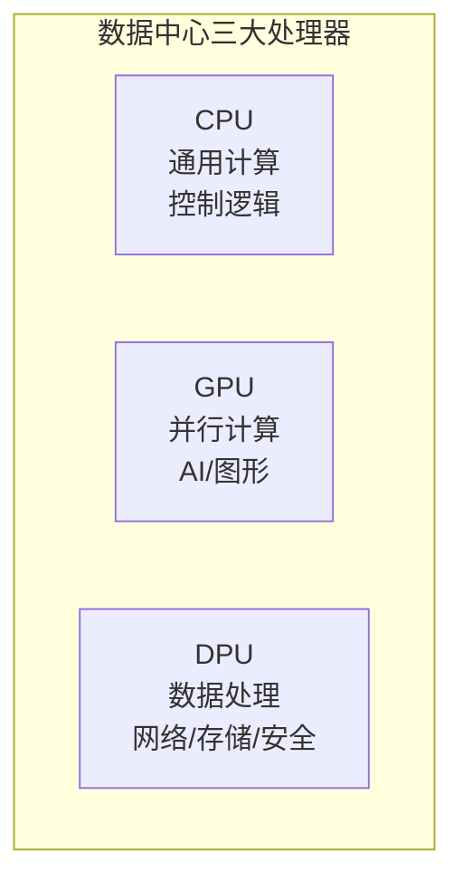

### 1.2 DPU vs SmartNIC

| 特性 | 传统 NIC | SmartNIC | DPU |
|------|----------|----------|-----|
| **处理能力** | 无 | 有限 | 强大 |
| **可编程性** | 无 | 部分 | 完全可编程 |
| **CPU 核心** | 无 | 少量/无 | 多个 ARM 核 |
| **卸载能力** | 基本 | 网络卸载 | 全栈卸载 |
| **操作系统** | 无 | 简单固件 | 完整 Linux |

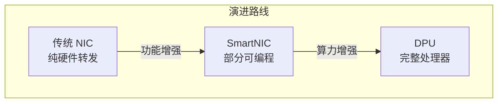

### 1.3 主要厂商产品

| 厂商 | 产品线 | 特点 |
|------|--------|------|
| **NVIDIA** | BlueField | 最成熟，DOCA SDK |
| **AMD** | Pensando | 收购自 Pensando |
| **Intel** | IPU (Mt. Evans) | FPGA + xPU |
| **Marvell** | OCTEON | 网络处理器背景 |
| **Broadcom** | Stingray | 交换芯片整合 |
| **华为** | DPU 系列 | 国产替代 |

---

## 二、DPU 硬件架构

### 2.1 典型架构

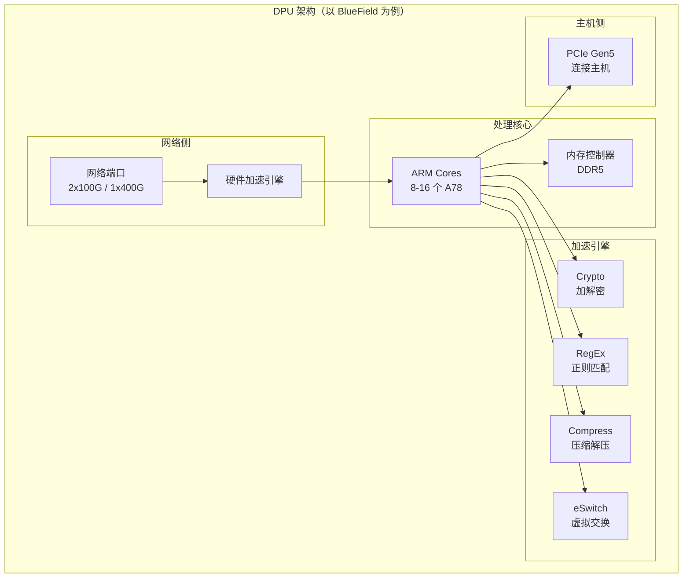

### 2.2 BlueField-3 规格

| 组件 | 规格 |
|------|------|
| **CPU** | 16x ARM Cortex-A78 |
| **网络** | 2x200G 或 400G |
| **PCIe** | Gen5 x16 |
| **内存** | 32GB DDR5 |
| **Crypto** | 400Gbps AES-GCM |
| **存储** | NVMe-oF 卸载 |

### 2.3 硬件加速引擎

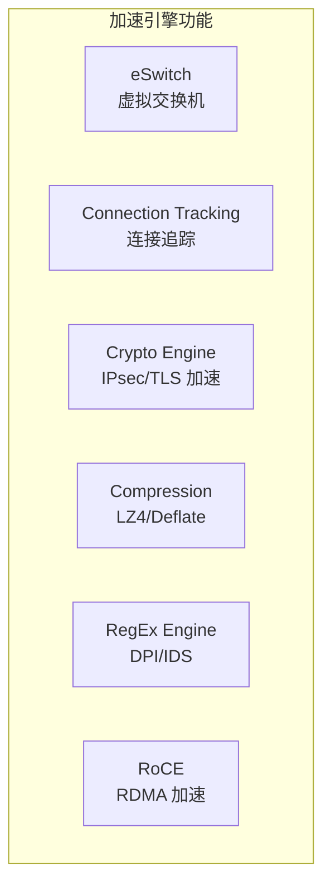

---

## 三、DPU 应用场景

### 3.1 虚拟化卸载

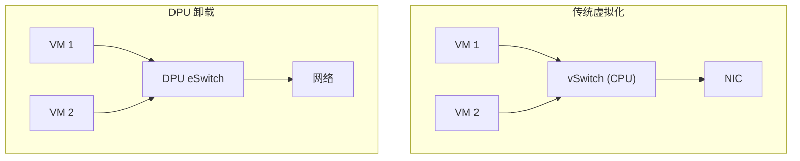

**收益**：

| 指标 | 传统方案 | DPU 卸载 |
|------|----------|----------|
| CPU 占用 | 10-30% | <1% |
| 网络延迟 | ~50μs | ~5μs |
| 带宽 | 受限 | 线速 |

### 3.2 存储加速


**NVMe-oF over DPU**：

- 远程存储呈现为本地 NVMe
- CPU 无感知，零占用
- 支持加密和压缩

### 3.3 安全功能

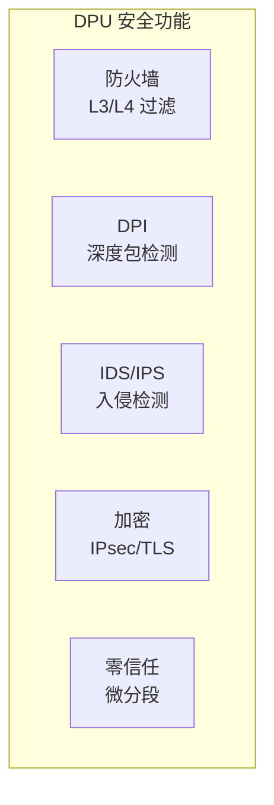

### 3.4 AI 网络加速

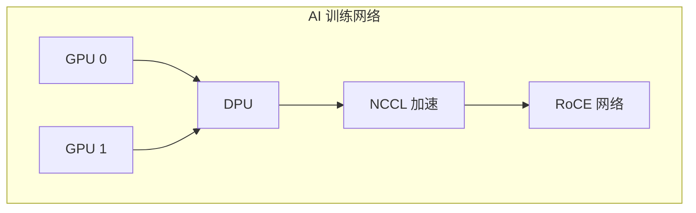

**NCCL 卸载收益**：

- AllReduce 延迟降低 30-50%
- CPU 零占用
- GPUDirect RDMA 支持

---

## 四、DOCA SDK

### 4.1 DOCA 架构

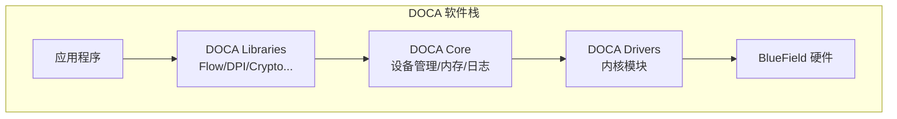

### 4.2 核心库

| 库 | 功能 |
|------|------|
| **DOCA Flow** | 流表编程，OpenFlow 风格 |
| **DOCA DPI** | 深度包检测，L7 识别 |
| **DOCA Crypto** | 加解密操作 |
| **DOCA Compress** | 压缩解压 |
| **DOCA RegEx** | 正则表达式匹配 |
| **DOCA RDMA** | RDMA 操作封装 |

### 4.3 DOCA Flow 编程

```c
#include <doca_flow.h>

// 初始化 DOCA Flow
struct doca_flow_cfg cfg = {
    .queues = 8,
    .mode_args = "vnf,hws",
};
doca_flow_init(&cfg);

// 创建端口
struct doca_flow_port_cfg port_cfg = {
    .port_id = 0,
    .type = DOCA_FLOW_PORT_DPDK_BY_ID,
};
struct doca_flow_port *port;
doca_flow_port_start(&port_cfg, &port);

// 创建管道（Pipeline）
struct doca_flow_pipe_cfg pipe_cfg = {
    .attr = {
        .name = "FORWARD_PIPE",
        .type = DOCA_FLOW_PIPE_BASIC,
    },
    .port = port,
};

// 定义匹配条件
struct doca_flow_match match = {
    .outer = {
        .l3_type = DOCA_FLOW_L3_TYPE_IP4,
        .ip4 = {
            .dst_ip = 0xFFFFFFFF,  // 掩码
        },
    },
};

// 定义动作
struct doca_flow_actions actions = {
    .action_idx = 0,
};

struct doca_flow_fwd fwd = {
    .type = DOCA_FLOW_FWD_PORT,
    .port_id = 1,  // 转发到端口 1
};

// 创建管道
struct doca_flow_pipe *pipe;
doca_flow_pipe_create(&pipe_cfg, &match, NULL, &actions, NULL, &fwd, &pipe);

// 添加流表项
struct doca_flow_match match_entry = {
    .outer = {
        .ip4 = {
            .dst_ip = inet_addr("192.168.1.100"),
        },
    },
};

struct doca_flow_pipe_entry *entry;
doca_flow_pipe_add_entry(0, pipe, &match_entry, &actions, NULL, &fwd, 0, NULL, &entry);
```

### 4.4 开发环境搭建

```bash
# 1. 安装 DOCA SDK（在 BlueField 上）
apt-get install doca-sdk

# 2. 编译示例
cd /opt/mellanox/doca/samples/doca_flow/flow_vxlan_encap
meson build
ninja -C build

# 3. 运行
./build/doca_flow_vxlan_encap -a 03:00.0 -a 03:00.1
```

---

## 五、虚拟交换机卸载

### 5.1 OVS 卸载

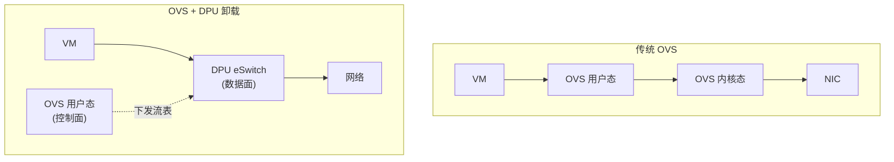

### 5.2 卸载模式

| 模式 | 描述 |
|------|------|
| **Legacy** | DPU 作为普通 NIC |
| **Switchdev** | DPU 作为可编程交换机 |
| **ASAP² Direct** | 最高性能，VM 直接访问 DPU |

### 5.3 Switchdev 配置

```bash
# 在主机上配置
# 1. 切换到 Switchdev 模式
echo switchdev > /sys/class/net/enp3s0f0/compat/devlink/mode

# 2. 创建 VF
echo 4 > /sys/class/net/enp3s0f0/device/sriov_numvfs

# 3. 绑定 VF Representor 到 OVS
ovs-vsctl add-br br0
ovs-vsctl add-port br0 enp3s0f0_0  # VF 0 representor
ovs-vsctl add-port br0 enp3s0f0_1  # VF 1 representor

# 4. 添加流表（会自动卸载到 DPU）
ovs-ofctl add-flow br0 "in_port=1,actions=output:2"
```

---

## 六、存储卸载

### 6.1 NVMe-oF 架构

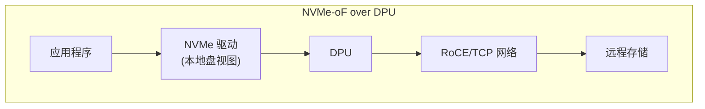

### 6.2 SNAP 技术

NVIDIA SNAP（Software-Defined Network Accelerated Processing）：

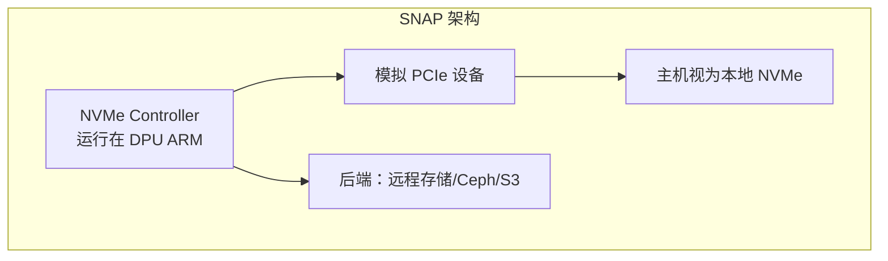

### 6.3 配置示例

```bash
# 在 DPU 上配置 SNAP NVMe
snap_nvme_controller_create \
    --name nvme0 \
    --nqn nqn.2023-01.io.snap:subsys0 \
    --backend ceph \
    --pool-name mypool \
    --image-name myimage
```

---

## 七、安全加速

### 7.1 IPsec 卸载

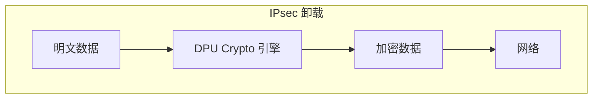

```c
// DOCA IPsec 示例
struct doca_ipsec_sa_attrs sa_attrs = {
    .mode = DOCA_IPSEC_SA_MODE_TRANSPORT,
    .direction = DOCA_IPSEC_DIRECTION_EGRESS,
    .protocol = DOCA_IPSEC_PROTO_ESP,
    .spi = 0x12345678,
    .key_type = DOCA_IPSEC_KEY_TYPE_AES_256,
};

doca_ipsec_sa_create(ctx, &sa_attrs, &sa);
```

### 7.2 防火墙卸载

```c
// 使用 DOCA Flow 实现 L3/L4 防火墙
struct doca_flow_match match = {
    .outer = {
        .l3_type = DOCA_FLOW_L3_TYPE_IP4,
        .l4_type = DOCA_FLOW_L4_TYPE_TCP,
        .tcp = {
            .dst_port = htons(22),  // SSH
        },
    },
};

// 丢弃 SSH 流量
struct doca_flow_fwd fwd = {
    .type = DOCA_FLOW_FWD_DROP,
};

doca_flow_pipe_add_entry(0, pipe, &match, NULL, NULL, &fwd, 0, NULL, &entry);
```

---

## 八、AI 集群网络

### 8.1 GPUDirect RDMA

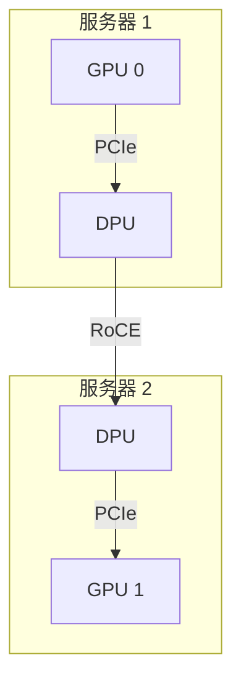

**数据路径**：

| 传统路径 | GPUDirect RDMA |
|----------|----------------|
| GPU → CPU → NIC → 网络 | GPU → DPU → 网络 |
| 延迟：~10μs | 延迟：~2μs |
| CPU 占用 | CPU 零占用 |

### 8.2 NCCL 集成

```bash
# 启用 GPUDirect RDMA
export NCCL_NET_GDR_LEVEL=5
export NCCL_NET_GDR_READ=1

# 使用 SHARP（可选，需要 InfiniBand 交换机支持）
export NCCL_COLLNET_ENABLE=1
```

### 8.3 Rail-Optimized 拓扑

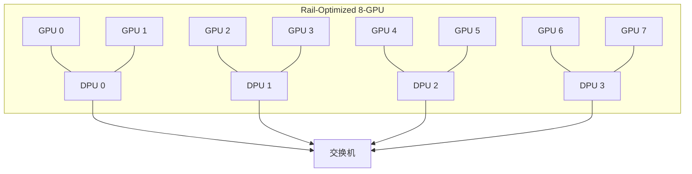

---

## 九、性能调优

### 9.1 关键参数

| 参数 | 说明 | 建议值 |
|------|------|--------|
| **num_queues** | 收发队列数 | CPU 核心数 |
| **ring_size** | 队列深度 | 4096 |
| **cpu_affinity** | CPU 绑定 | 固定绑定 |
| **interrupt_coalescing** | 中断合并 | 适当开启 |

### 9.2 性能监控

```bash
# 查看 DPU 统计
mlnx_perf -d mlx5_0

# 查看流表命中
doca_flow_query

# 查看硬件计数器
ethtool -S enp3s0f0 | grep -E "(rx_|tx_)"
```

### 9.3 常见问题

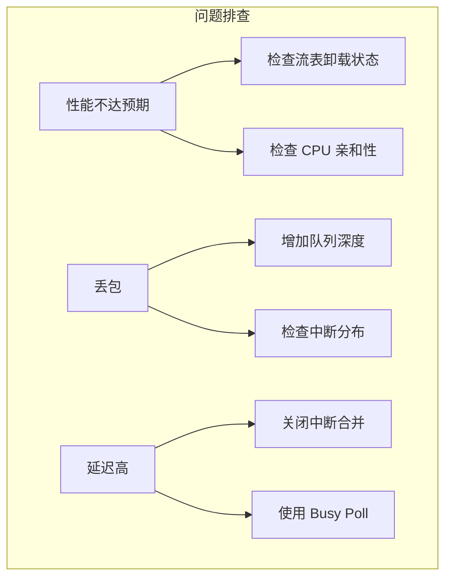

---

## 十、未来展望

### 10.1 技术趋势

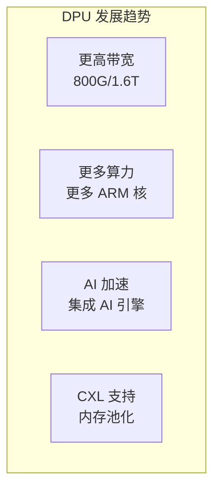

### 10.2 生态发展

| 领域 | 趋势 |
|------|------|
| **云厂商** | 全面采用 DPU 卸载 |
| **开源** | DPDK/SPDK 深度集成 |
| **标准化** | OPI（Open Programmable Infrastructure） |

---

## 相关文章

- [21 - RDMA 与 InfiniBand 详解](@/articles/networking/net-21-RDMA与InfiniBand详解.md)
- [04 - DPDK 详解](@/articles/networking/net-04-DPDK详解.md)
- [13 - 高性能网络架构](@/articles/networking/net-13-高性能网络架构.md)
- [hpc-04 - GPU 集群通信技术](@/articles/hpc/hpc-04-GPU集群通信技术.md)
