+++
title = "用户态网络协议栈设计"
description = "Kernel Bypass 技术与高性能用户态协议栈架构设计详解"
date = 2025-02-07
weight = 25000
updated = 2025-02-07
draft = false
[taxonomies]
tags = ["网络", "用户态", "DPDK", "协议栈", "高性能", "Kernel Bypass"]
[extra]
toc = true
comments = true
+++

## 一、为什么需要用户态协议栈

### 1.1 内核协议栈的瓶颈

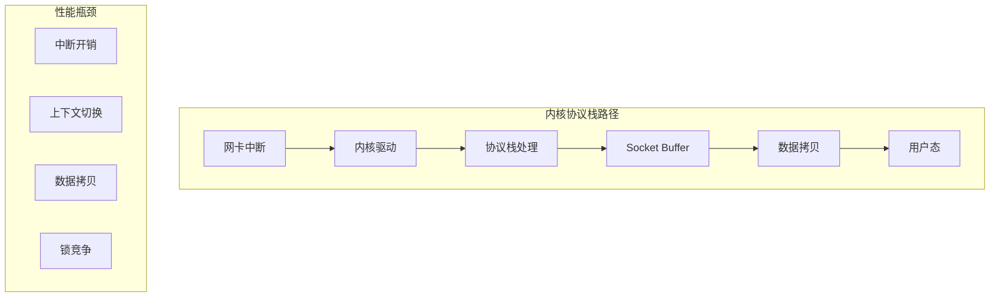

**内核协议栈延迟分解**：

| 阶段 | 延迟 |
|------|------|
| 中断处理 | ~5-10μs |
| 协议栈处理 | ~10-20μs |
| 数据拷贝 | ~5-10μs |
| 用户态切换 | ~1-2μs |
| **总计** | **~20-40μs** |

### 1.2 Kernel Bypass 原理

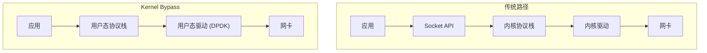

**Kernel Bypass 收益**：

| 指标 | 内核协议栈 | 用户态协议栈 |
|------|------------|--------------|
| 延迟 | 20-40μs | 2-5μs |
| PPS | ~1M | ~10-100M |
| CPU 效率 | 低 | 高 |

### 1.3 用户态协议栈适用场景

- 高频交易（HFT）
- 网络功能虚拟化（NFV）
- CDN / 负载均衡
- 高性能代理
- 实时通信

---

## 二、主流用户态协议栈

### 2.1 方案对比

| 方案 | 开发者 | 特点 | 适用场景 |
|------|--------|------|----------|
| **F-Stack** | 腾讯 | 基于 FreeBSD 栈 | 通用 |
| **mTCP** | KAIST | 学术研究 | 短连接 |
| **Seastar** | ScyllaDB | 全异步 | 数据库 |
| **VPP** | Cisco/fd.io | 向量处理 | NFV |
| **TLDK** | Intel | DPDK 原生 | DPDK 用户 |

### 2.2 架构对比

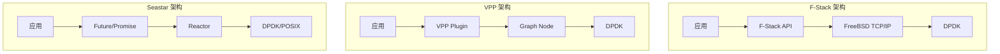

---

## 三、协议栈架构设计

### 3.1 分层架构

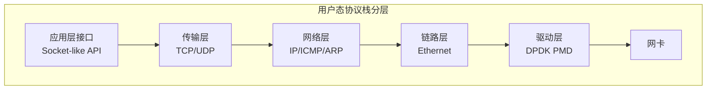

### 3.2 核心数据结构

```c
// 网络缓冲区（类似 mbuf）
struct netbuf {
    uint8_t* data;           // 数据指针
    uint32_t data_len;       // 数据长度
    uint32_t buf_len;        // 缓冲区长度
    
    // 元数据
    uint16_t l2_len;         // L2 头长度
    uint16_t l3_len;         // L3 头长度
    uint16_t l4_len;         // L4 头长度
    
    struct netbuf* next;     // 链表
    
    // 硬件卸载标记
    uint64_t ol_flags;
};

// TCP 连接控制块
struct tcp_pcb {
    uint32_t local_ip;
    uint32_t remote_ip;
    uint16_t local_port;
    uint16_t remote_port;
    
    // TCP 状态
    enum tcp_state state;
    
    // 序列号
    uint32_t snd_una;        // 未确认的发送序列号
    uint32_t snd_nxt;        // 下一个发送序列号
    uint32_t rcv_nxt;        // 下一个期望接收序列号
    
    // 窗口
    uint16_t snd_wnd;        // 发送窗口
    uint16_t rcv_wnd;        // 接收窗口
    
    // 拥塞控制
    uint32_t cwnd;           // 拥塞窗口
    uint32_t ssthresh;       // 慢启动阈值
    
    // 定时器
    uint64_t rto;            // 重传超时
    uint64_t last_ack_time;
    
    // 缓冲区
    struct ring_buffer* send_buf;
    struct ring_buffer* recv_buf;
};
```

### 3.3 连接管理

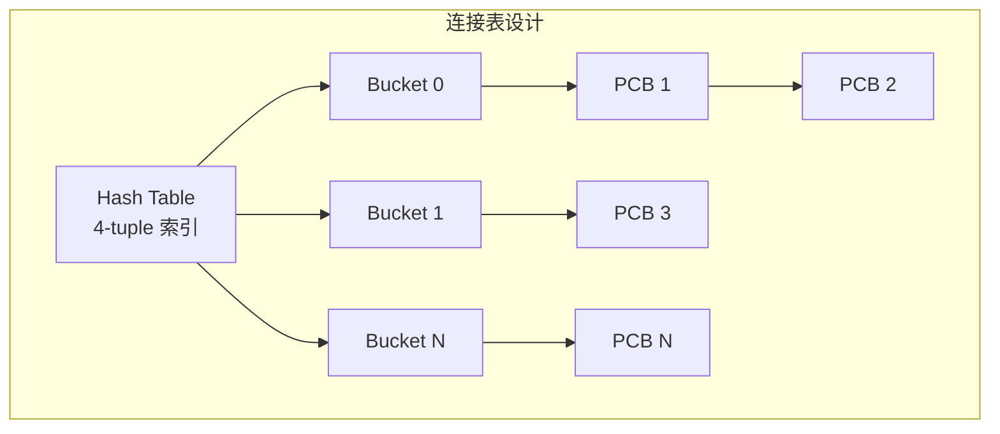

```c
// 连接表
struct tcp_conn_table {
    struct tcp_pcb** buckets;
    uint32_t size;
    uint32_t count;
    spinlock_t* locks;       // 每 bucket 一把锁
};

// 4-tuple hash
static inline uint32_t tcp_hash(uint32_t sip, uint32_t dip, 
                                 uint16_t sport, uint16_t dport) {
    uint32_t hash = sip ^ dip ^ ((uint32_t)sport << 16 | dport);
    return hash;
}

// 查找连接
struct tcp_pcb* tcp_lookup(uint32_t sip, uint32_t dip,
                           uint16_t sport, uint16_t dport) {
    uint32_t hash = tcp_hash(sip, dip, sport, dport);
    uint32_t idx = hash % conn_table.size;
    
    struct tcp_pcb* pcb = conn_table.buckets[idx];
    while (pcb) {
        if (pcb->local_ip == dip && pcb->remote_ip == sip &&
            pcb->local_port == dport && pcb->remote_port == sport) {
            return pcb;
        }
        pcb = pcb->next;
    }
    return NULL;
}
```

---

## 四、收发包流程

### 4.1 接收流程

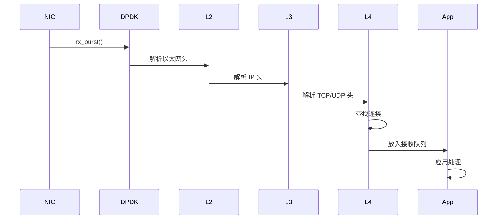

```c
// 收包主循环
void rx_loop(void* arg) {
    struct rte_mbuf* pkts[BURST_SIZE];
    
    while (1) {
        // 1. 从网卡收包
        uint16_t nb_rx = rte_eth_rx_burst(port_id, queue_id, 
                                           pkts, BURST_SIZE);
        
        for (int i = 0; i < nb_rx; i++) {
            struct rte_mbuf* m = pkts[i];
            
            // 2. 解析以太网头
            struct rte_ether_hdr* eth = rte_pktmbuf_mtod(m, struct rte_ether_hdr*);
            
            if (eth->ether_type == htons(RTE_ETHER_TYPE_IPV4)) {
                // 3. 解析 IP 头
                struct rte_ipv4_hdr* ip = (struct rte_ipv4_hdr*)(eth + 1);
                
                if (ip->next_proto_id == IPPROTO_TCP) {
                    // 4. 解析 TCP 头
                    struct rte_tcp_hdr* tcp = (struct rte_tcp_hdr*)
                        ((uint8_t*)ip + (ip->version_ihl & 0x0F) * 4);
                    
                    // 5. 查找连接
                    struct tcp_pcb* pcb = tcp_lookup(
                        ip->src_addr, ip->dst_addr,
                        tcp->src_port, tcp->dst_port
                    );
                    
                    if (pcb) {
                        // 6. TCP 状态机处理
                        tcp_input(pcb, m, ip, tcp);
                    }
                }
            }
            
            rte_pktmbuf_free(m);
        }
    }
}
```

### 4.2 发送流程

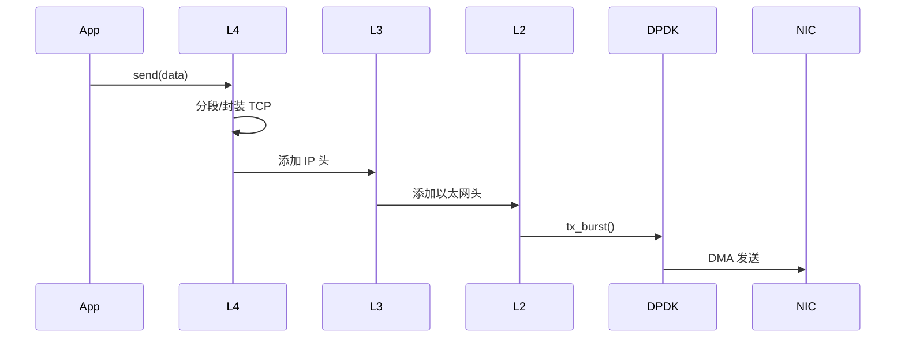

```c
// 发送数据
int tcp_send(struct tcp_pcb* pcb, const void* data, size_t len) {
    // 1. 分配 mbuf
    struct rte_mbuf* m = rte_pktmbuf_alloc(mbuf_pool);
    if (!m) return -ENOMEM;
    
    // 2. 预留头部空间
    uint8_t* pkt = rte_pktmbuf_append(m, 
        sizeof(struct rte_ether_hdr) +
        sizeof(struct rte_ipv4_hdr) +
        sizeof(struct rte_tcp_hdr) +
        len);
    
    // 3. 填充以太网头
    struct rte_ether_hdr* eth = (struct rte_ether_hdr*)pkt;
    rte_ether_addr_copy(&local_mac, &eth->s_addr);
    rte_ether_addr_copy(&remote_mac, &eth->d_addr);
    eth->ether_type = htons(RTE_ETHER_TYPE_IPV4);
    
    // 4. 填充 IP 头
    struct rte_ipv4_hdr* ip = (struct rte_ipv4_hdr*)(eth + 1);
    ip->version_ihl = 0x45;
    ip->total_length = htons(sizeof(struct rte_ipv4_hdr) + 
                             sizeof(struct rte_tcp_hdr) + len);
    ip->src_addr = pcb->local_ip;
    ip->dst_addr = pcb->remote_ip;
    ip->next_proto_id = IPPROTO_TCP;
    
    // 5. 填充 TCP 头
    struct rte_tcp_hdr* tcp = (struct rte_tcp_hdr*)(ip + 1);
    tcp->src_port = pcb->local_port;
    tcp->dst_port = pcb->remote_port;
    tcp->sent_seq = htonl(pcb->snd_nxt);
    tcp->recv_ack = htonl(pcb->rcv_nxt);
    tcp->data_off = (sizeof(struct rte_tcp_hdr) / 4) << 4;
    tcp->tcp_flags = RTE_TCP_ACK_FLAG;
    tcp->rx_win = htons(pcb->rcv_wnd);
    
    // 6. 拷贝数据
    memcpy((uint8_t*)(tcp + 1), data, len);
    
    // 7. 计算校验和（可硬件卸载）
    m->l2_len = sizeof(struct rte_ether_hdr);
    m->l3_len = sizeof(struct rte_ipv4_hdr);
    m->ol_flags |= PKT_TX_IP_CKSUM | PKT_TX_TCP_CKSUM;
    
    // 8. 发送
    rte_eth_tx_burst(port_id, queue_id, &m, 1);
    
    // 9. 更新状态
    pcb->snd_nxt += len;
    
    return len;
}
```

---

## 五、TCP 状态机

### 5.1 状态转换

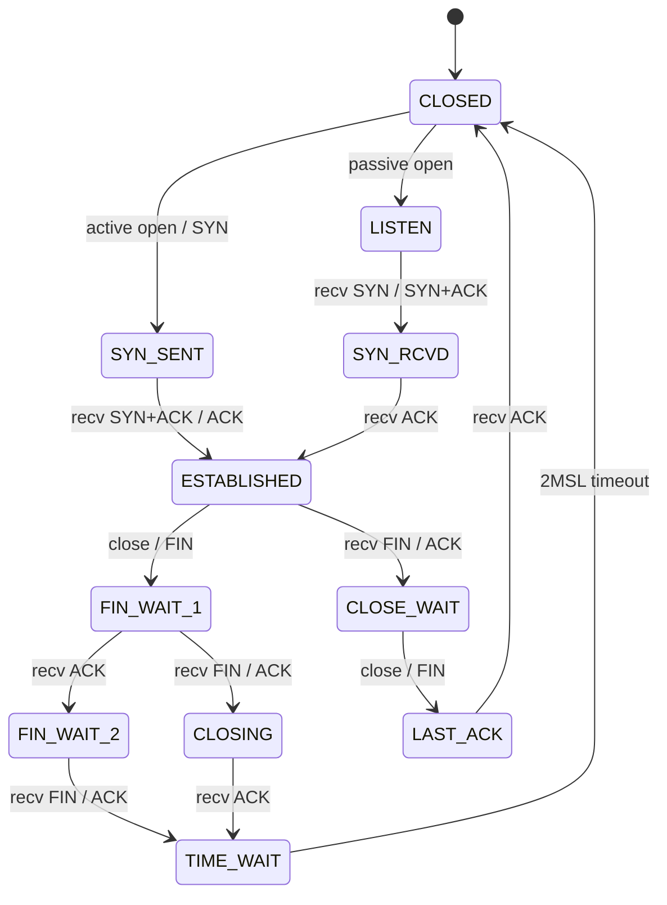

### 5.2 状态机实现

```c
enum tcp_state {
    TCP_CLOSED,
    TCP_LISTEN,
    TCP_SYN_SENT,
    TCP_SYN_RCVD,
    TCP_ESTABLISHED,
    TCP_FIN_WAIT_1,
    TCP_FIN_WAIT_2,
    TCP_CLOSE_WAIT,
    TCP_CLOSING,
    TCP_LAST_ACK,
    TCP_TIME_WAIT,
};

void tcp_input(struct tcp_pcb* pcb, struct rte_mbuf* m,
               struct rte_ipv4_hdr* ip, struct rte_tcp_hdr* tcp) {
    uint8_t flags = tcp->tcp_flags;
    
    switch (pcb->state) {
    case TCP_LISTEN:
        if (flags & RTE_TCP_SYN_FLAG) {
            // 收到 SYN，发送 SYN+ACK
            tcp_send_synack(pcb, tcp);
            pcb->state = TCP_SYN_RCVD;
        }
        break;
        
    case TCP_SYN_SENT:
        if ((flags & RTE_TCP_SYN_FLAG) && (flags & RTE_TCP_ACK_FLAG)) {
            // 收到 SYN+ACK，发送 ACK
            pcb->rcv_nxt = ntohl(tcp->sent_seq) + 1;
            tcp_send_ack(pcb);
            pcb->state = TCP_ESTABLISHED;
        }
        break;
        
    case TCP_SYN_RCVD:
        if (flags & RTE_TCP_ACK_FLAG) {
            pcb->state = TCP_ESTABLISHED;
        }
        break;
        
    case TCP_ESTABLISHED:
        if (flags & RTE_TCP_FIN_FLAG) {
            // 收到 FIN
            pcb->rcv_nxt++;
            tcp_send_ack(pcb);
            pcb->state = TCP_CLOSE_WAIT;
        } else if (flags & RTE_TCP_ACK_FLAG) {
            // 处理数据和 ACK
            tcp_process_data(pcb, m, tcp);
            tcp_process_ack(pcb, tcp);
        }
        break;
        
    // ... 其他状态
    }
}
```

---

## 六、拥塞控制

### 6.1 拥塞控制算法

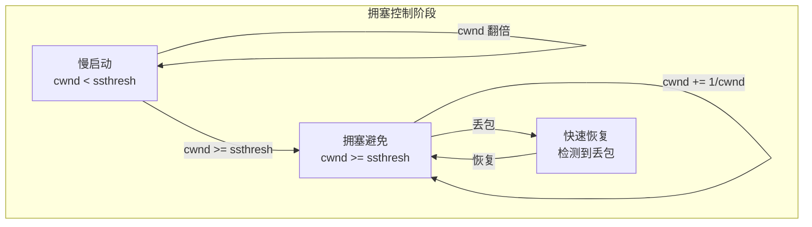

### 6.2 实现示例

```c
void tcp_congestion_control(struct tcp_pcb* pcb, uint32_t acked) {
    if (pcb->cwnd < pcb->ssthresh) {
        // 慢启动：每个 ACK 增加 1 MSS
        pcb->cwnd += TCP_MSS;
    } else {
        // 拥塞避免：每个 RTT 增加 1 MSS
        pcb->cwnd += TCP_MSS * TCP_MSS / pcb->cwnd;
    }
}

void tcp_fast_retransmit(struct tcp_pcb* pcb) {
    // 收到 3 个重复 ACK
    pcb->ssthresh = pcb->cwnd / 2;
    pcb->cwnd = pcb->ssthresh + 3 * TCP_MSS;
    
    // 重传丢失的段
    tcp_retransmit(pcb);
}

void tcp_timeout(struct tcp_pcb* pcb) {
    // 超时重传
    pcb->ssthresh = pcb->cwnd / 2;
    pcb->cwnd = TCP_MSS;  // 重新慢启动
    
    tcp_retransmit(pcb);
}
```

---

## 七、多核扩展

### 7.1 架构设计

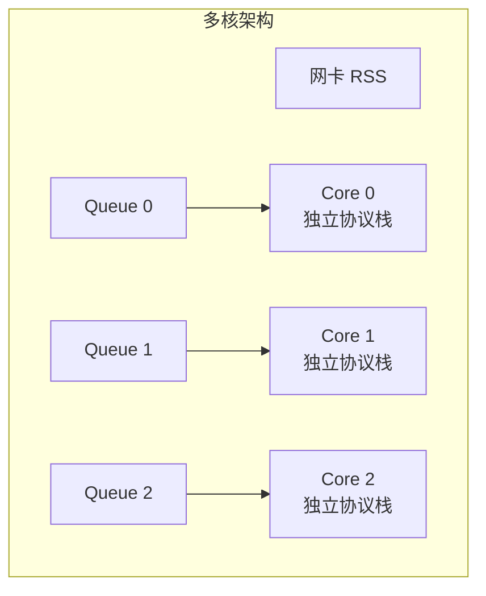

### 7.2 无锁设计

```c
// 每核心独立的数据结构
struct per_core_data {
    struct tcp_conn_table conn_table;
    struct rte_mempool* mbuf_pool;
    struct timer_wheel* timers;
    // 统计信息
    uint64_t rx_packets;
    uint64_t tx_packets;
} __rte_cache_aligned;

static struct per_core_data core_data[RTE_MAX_LCORE];

// 获取当前核心的数据
static inline struct per_core_data* get_core_data(void) {
    return &core_data[rte_lcore_id()];
}
```

### 7.3 RSS 配置

```c
// 配置 RSS
struct rte_eth_rss_conf rss_conf = {
    .rss_key = NULL,  // 使用默认 key
    .rss_key_len = 0,
    .rss_hf = ETH_RSS_IP | ETH_RSS_TCP | ETH_RSS_UDP,
};

struct rte_eth_conf port_conf = {
    .rxmode = {
        .mq_mode = ETH_MQ_RX_RSS,
    },
    .rx_adv_conf = {
        .rss_conf = rss_conf,
    },
};

rte_eth_dev_configure(port_id, num_queues, num_queues, &port_conf);
```

---

## 八、与应用集成

### 8.1 API 设计

```c
// 兼容 POSIX 的 API
int ustack_socket(int domain, int type, int protocol);
int ustack_bind(int fd, const struct sockaddr* addr, socklen_t len);
int ustack_listen(int fd, int backlog);
int ustack_accept(int fd, struct sockaddr* addr, socklen_t* len);
int ustack_connect(int fd, const struct sockaddr* addr, socklen_t len);
ssize_t ustack_send(int fd, const void* buf, size_t len, int flags);
ssize_t ustack_recv(int fd, void* buf, size_t len, int flags);
int ustack_close(int fd);

// 非阻塞 + epoll 风格
int ustack_epoll_create(void);
int ustack_epoll_ctl(int epfd, int op, int fd, struct epoll_event* event);
int ustack_epoll_wait(int epfd, struct epoll_event* events, 
                       int maxevents, int timeout);
```

### 8.2 F-Stack 使用示例

```c
#include <ff_api.h>

void* loop(void* arg) {
    int sockfd = ff_socket(AF_INET, SOCK_STREAM, 0);
    
    struct sockaddr_in addr;
    addr.sin_family = AF_INET;
    addr.sin_addr.s_addr = INADDR_ANY;
    addr.sin_port = htons(8080);
    
    ff_bind(sockfd, (struct sockaddr*)&addr, sizeof(addr));
    ff_listen(sockfd, 128);
    
    int epfd = ff_epoll_create(1024);
    struct epoll_event ev;
    ev.events = EPOLLIN;
    ev.data.fd = sockfd;
    ff_epoll_ctl(epfd, EPOLL_CTL_ADD, sockfd, &ev);
    
    struct epoll_event events[MAX_EVENTS];
    
    while (1) {
        int n = ff_epoll_wait(epfd, events, MAX_EVENTS, -1);
        
        for (int i = 0; i < n; i++) {
            if (events[i].data.fd == sockfd) {
                int client = ff_accept(sockfd, NULL, NULL);
                ev.events = EPOLLIN;
                ev.data.fd = client;
                ff_epoll_ctl(epfd, EPOLL_CTL_ADD, client, &ev);
            } else {
                char buf[1024];
                int len = ff_recv(events[i].data.fd, buf, sizeof(buf), 0);
                if (len > 0) {
                    ff_send(events[i].data.fd, buf, len, 0);
                } else {
                    ff_close(events[i].data.fd);
                }
            }
        }
    }
}

int main() {
    ff_init(argc, argv);
    ff_run(loop, NULL);
    return 0;
}
```

---

## 九、性能优化

### 9.1 优化技巧

| 优化点 | 方法 |
|--------|------|
| **批量处理** | rx/tx_burst 一次处理多个包 |
| **预取** | rte_prefetch0 预取下一个包 |
| **零拷贝** | 直接操作 mbuf |
| **Busy Poll** | 避免中断 |
| **缓存优化** | 数据结构对齐 |

### 9.2 性能对比

| 场景 | 内核栈 | F-Stack | 提升 |
|------|--------|---------|------|
| 小包 PPS | 1M | 10M+ | 10x |
| 连接/秒 | 50K | 500K+ | 10x |
| 延迟 | 30μs | 3μs | 10x |

---

## 十、生产考虑

### 10.1 与内核栈共存

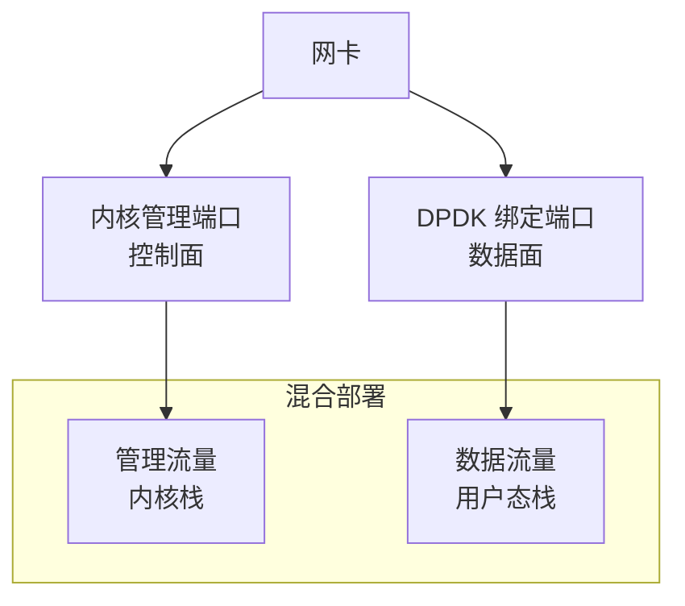

### 10.2 常见问题

| 问题 | 解决方案 |
|------|----------|
| 与内核服务冲突 | 使用不同端口/IP |
| 调试困难 | 增加日志，pcap 抓包 |
| 功能不完整 | 按需实现，回退内核 |

---

## 相关文章

- [04 - DPDK 详解](@/articles/networking/net-04-DPDK详解.md)
- [24 - DPU 与智能网卡技术详解](@/articles/networking/net-24-DPU与智能网卡技术详解.md)
- [13 - 高性能网络架构](@/articles/networking/net-13-高性能网络架构.md)
- [07 - TCP 协议详解](@/articles/networking/net-07-TCP协议详解.md)
