+++
title = "26 - CXL 与新型内存互联技术"
description = "Compute Express Link 技术深度解析：内存扩展、池化与异构计算"
date = 2025-02-07
updated = 2025-02-07
draft = false
[taxonomies]
tags = ["CXL", "内存", "PCIe", "互联", "异构计算", "数据中心"]
[extra]
toc = true
comments = true
+++

## 一、CXL 概述

### 1.1 什么是 CXL

CXL（Compute Express Link）是一种开放的高速互联标准，专为 CPU、GPU、FPGA、加速器和内存设备之间的高效通信而设计。

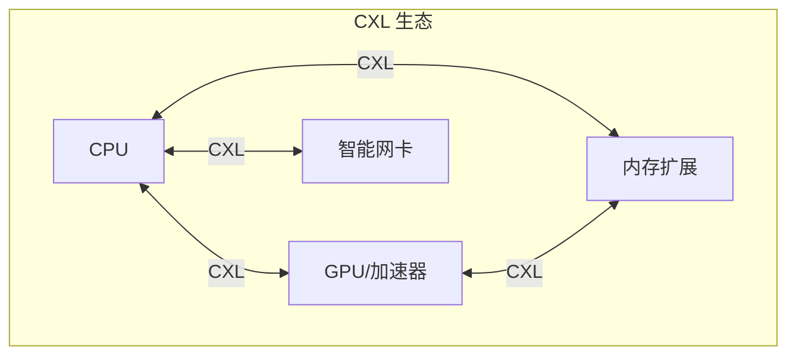

### 1.2 CXL vs 其他互联技术

| 技术 | 带宽 | 延迟 | 缓存一致性 | 主要用途 |
|------|------|------|------------|----------|
| **PCIe 5.0** | 64 GB/s (x16) | ~μs | 无 | I/O 设备 |
| **CXL 3.0** | 64 GB/s (x16) | ~ns | 支持 | 内存/加速器 |
| **NVLink 4** | 900 GB/s | ~ns | 支持 | GPU 互联 |
| **InfiniBand** | 400 Gbps | ~μs | 无 | 集群网络 |

### 1.3 CXL 版本演进

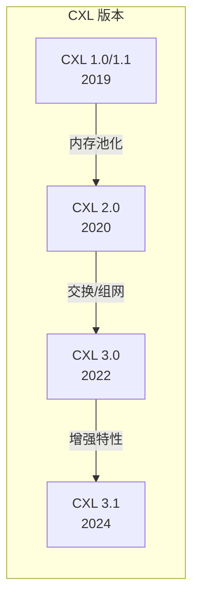

| 版本 | 关键特性 |
|------|----------|
| **1.0/1.1** | 基础协议，内存扩展 |
| **2.0** | 内存池化，热插拔 |
| **3.0** | CXL 交换机，Fabric 组网 |
| **3.1** | 端口绑定，扩展内存 |

---

## 二、CXL 协议架构

### 2.1 三种协议

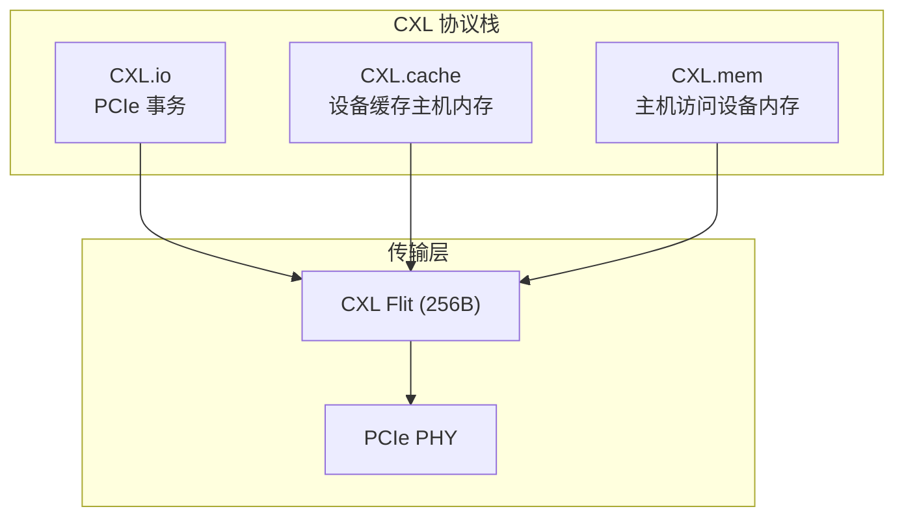

### 2.2 CXL.io

- 兼容 PCIe 5.0
- 设备枚举、配置
- DMA 传输
- 中断处理

### 2.3 CXL.cache

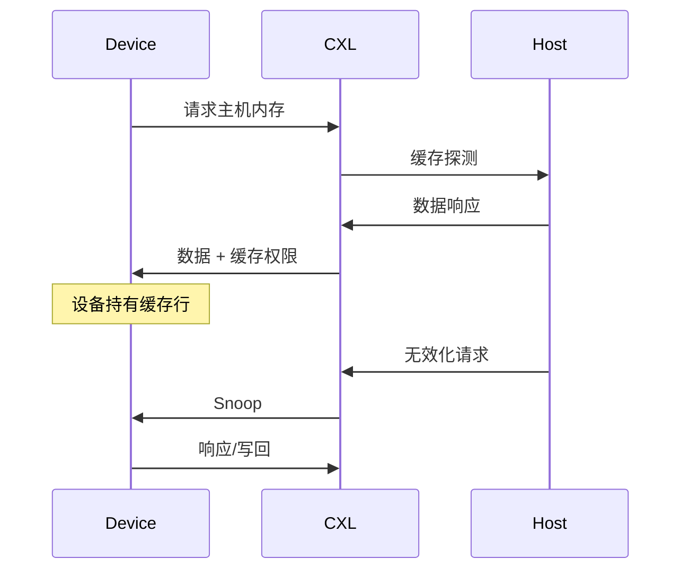

**缓存一致性状态**：

| 状态 | 含义 |
|------|------|
| **Invalid** | 无效 |
| **Shared** | 只读共享 |
| **Exclusive** | 独占，未修改 |
| **Modified** | 独占，已修改 |

### 2.4 CXL.mem

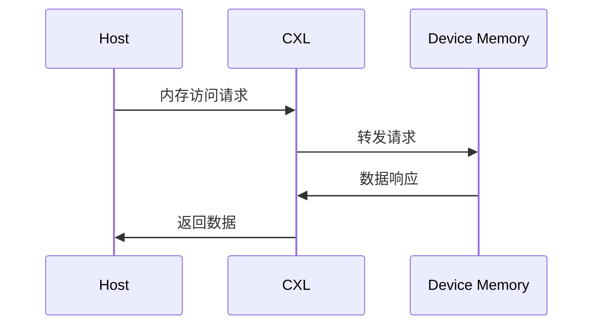

**访问模式**：

| 模式 | 延迟 | 描述 |
|------|------|------|
| **HDM-D** | 较高 | 设备专属内存 |
| **HDM-H** | 较低 | 主机管理内存 |

---

## 三、CXL 设备类型

### 3.1 三种设备类型

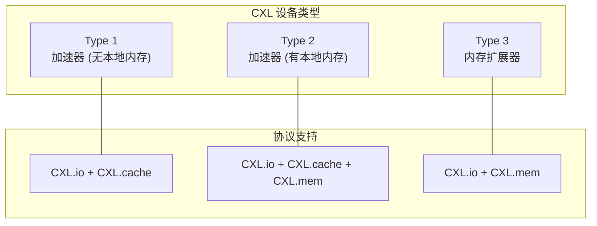

### 3.2 Type 1：加速器（无内存）

- 示例：SmartNIC、加密卡
- 缓存主机内存进行处理
- 无本地持久内存

### 3.3 Type 2：加速器（有内存）

- 示例：GPU、FPGA
- 既可缓存主机内存
- 也可让主机访问设备内存
- 完整缓存一致性

### 3.4 Type 3：内存扩展

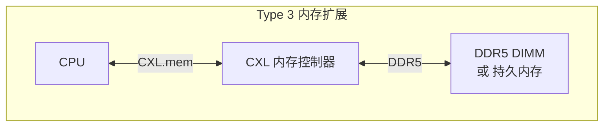

- 纯内存设备
- 扩展系统内存容量
- 支持持久内存（CXL PMEM）

---

## 四、内存池化

### 4.1 池化架构

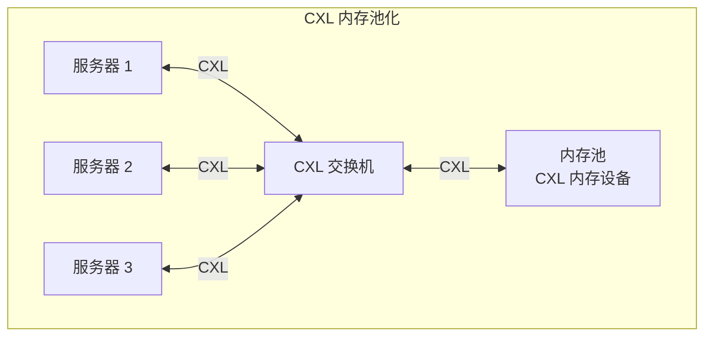

### 4.2 内存池化收益

| 收益 | 说明 |
|------|------|
| **成本降低** | 减少过度配置 |
| **资源共享** | 按需分配 |
| **灵活性** | 动态扩展 |
| **故障隔离** | 内存故障不影响主机 |

### 4.3 多主机共享

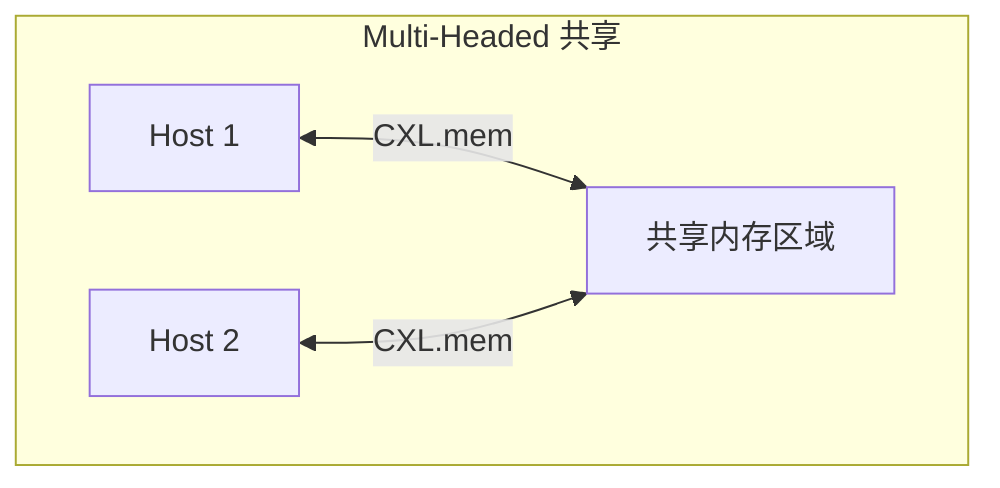

**使用场景**：

- 分布式数据库
- 共享缓存层
- 进程间高速通信

---

## 五、CXL 交换机与 Fabric

### 5.1 CXL 交换机

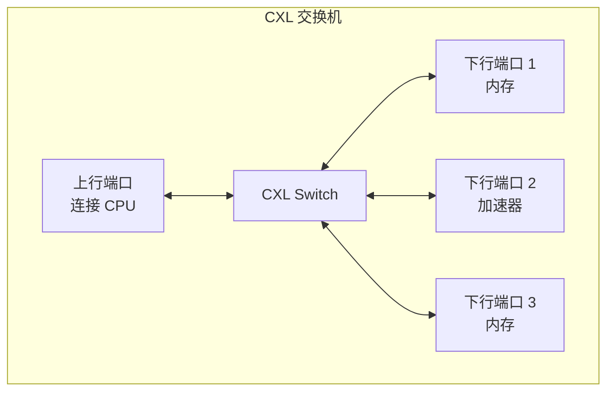

### 5.2 CXL Fabric（3.0+）

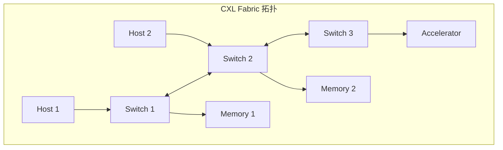

### 5.3 全局 Fabric Attached Memory

CXL 3.0 支持 Fabric Attached Memory (FAM)：

- 内存资源全局可访问
- 支持动态配置
- 多级交换拓扑

---

## 六、软件支持

### 6.1 Linux 内核支持

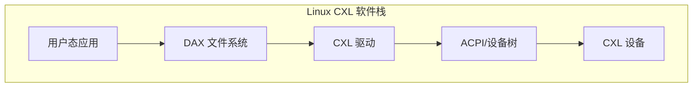

**关键组件**：

| 组件 | 功能 |
|------|------|
| **cxl-core** | 核心驱动框架 |
| **cxl-mem** | Type 3 内存设备 |
| **cxl-port** | 端口/交换机管理 |
| **cxl-acpi** | ACPI 枚举 |

### 6.2 内存管理

```bash
# 查看 CXL 设备
ls /sys/bus/cxl/devices/

# 查看内存区域
cat /sys/bus/cxl/devices/mem0/size

# 使用 daxctl 管理
daxctl list
daxctl reconfigure-device dax0.0 --mode=system-ram
```

### 6.3 编程接口

```c
#include <linux/cxl.h>

// 打开 CXL 设备
int fd = open("/dev/cxl/mem0", O_RDWR);

// 映射 CXL 内存
void* ptr = mmap(NULL, size, PROT_READ | PROT_WRITE,
                 MAP_SHARED, fd, offset);

// 使用 CXL 内存
memcpy(ptr, data, len);

// 刷新到持久内存（如果是 PMEM）
msync(ptr, len, MS_SYNC);
```

---

## 七、应用场景

### 7.1 内存扩展

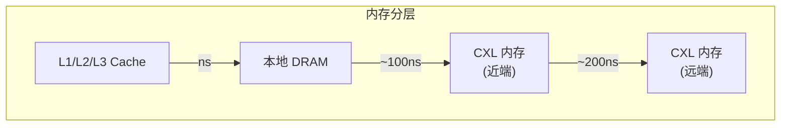

**使用场景**：

- 大内存数据库（SAP HANA, Oracle）
- 内存数据分析
- AI 训练（大模型参数）

### 7.2 加速器互联

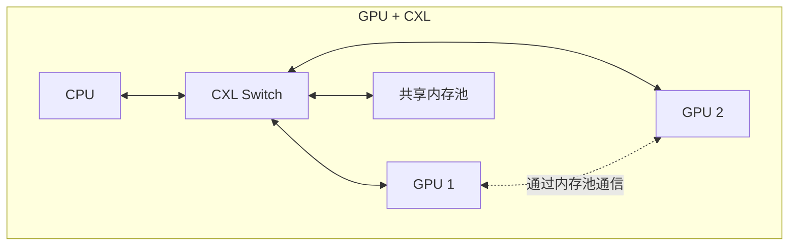

### 7.3 数据库加速

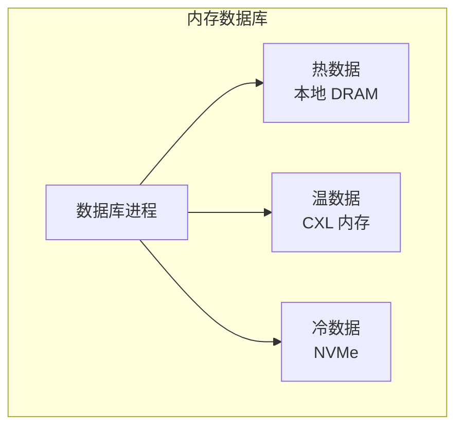

---

## 八、与其他技术对比

### 8.1 CXL vs NUMA

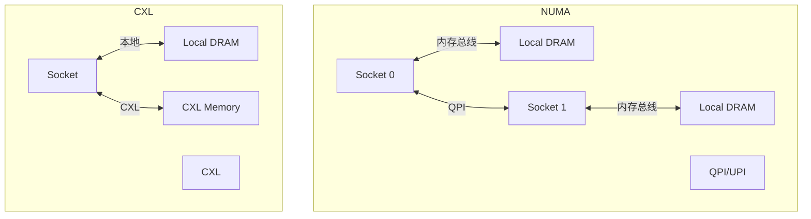

| 对比项 | NUMA | CXL |
|--------|------|-----|
| 带宽 | 高 | 中等 |
| 延迟 | 低 | 较高 |
| 扩展性 | 有限 | 高 |
| 成本 | 高 | 较低 |

### 8.2 CXL vs NVMe-oF

| 对比项 | CXL | NVMe-oF |
|--------|-----|---------|
| 目标 | 内存扩展 | 存储访问 |
| 延迟 | ~100ns | ~10μs |
| 语义 | 内存 load/store | 块 I/O |
| 用途 | 内存池化 | 存储池化 |

---

## 九、性能考虑

### 9.1 延迟分析

| 路径 | 延迟 |
|------|------|
| 本地 DRAM | ~80ns |
| 远端 NUMA | ~150ns |
| CXL 内存（同交换机） | ~200ns |
| CXL 内存（跨交换机） | ~300ns+ |

### 9.2 带宽设计

```
CXL 3.0 x16 = 64 GB/s (双向)

内存带宽设计：
- DDR5-4800 单通道 = 38.4 GB/s
- CXL 内存建议多通道设计
```

### 9.3 优化建议

| 优化点 | 方法 |
|--------|------|
| **数据放置** | 热数据本地，冷数据 CXL |
| **预取** | 针对 CXL 延迟调整预取 |
| **交错** | 跨 CXL 设备交错 |
| **监控** | 监控访问延迟 |

---

## 十、未来展望

### 10.1 技术趋势

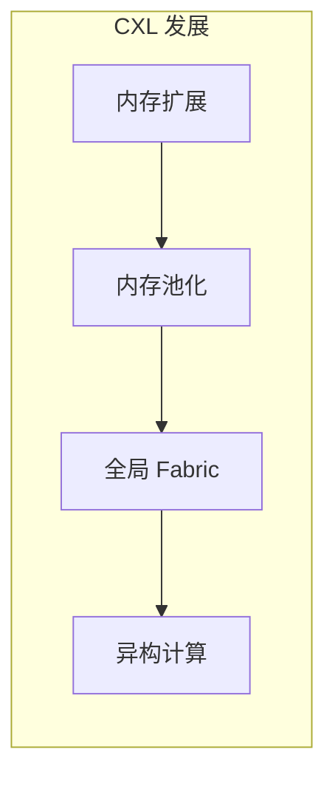

### 10.2 生态发展

| 领域 | 趋势 |
|------|------|
| **芯片** | Intel/AMD 全面支持 |
| **内存** | Samsung/SK 推出产品 |
| **交换机** | 多家厂商推出 |
| **软件** | Linux 内核持续完善 |

---

## 相关文章

- [24 - DPU 与智能网卡技术详解](/articles/networking/net-24-DPU与智能网卡技术详解/)
- [21 - RDMA 与 InfiniBand 详解](/articles/networking/net-21-RDMA与InfiniBand详解/)
- [hpc-04 - GPU 集群通信技术](/articles/hpc/hpc-04-GPU集群通信技术/)
- [linux-24 - 内存管理与优化](/articles/linux/linux-24-内存管理与优化/)
